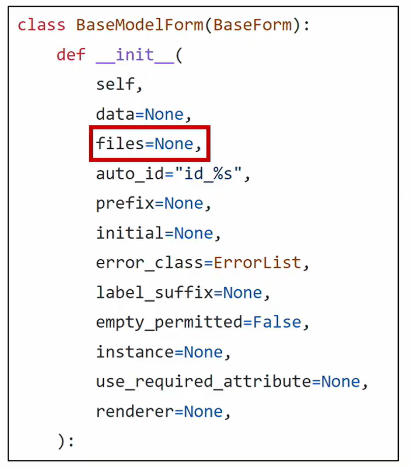

# Django

## Managing static files

### 개요

개발자가 서버에 미리 준비한 혹은 사용자가 업로드한 정적파일을 클라이언트에게 제공하는 방법

### Static files

#### 정적 파일

응답할 때 별도의 처리 없이 파일 내용을 그대로 보여주면 되는 파일

- 사용자의 요청에 따라 내용이 바뀌는 것이 아니라 요청한 것을 그대로 보여주는 파일

파일 자체가 고정되어 있고, 서비스 중에도 추가되거나 변경되지 않고 고정되어있음

- 예를 들어, 웹 사이트는 일반적으로 이미지, 자바 스크립트 또는 CSS와 같은 미리 준비된 추가 파일(움직이지 않는)을 제공해야 함

Django에서는 이러한 파일들을 "static file”이라 함

- Django는 staticfiles 앱을 통해 정적 파일과 관련된 기능을 제공

settings.py

```python
INSTALLED_APPS = [
	...
    'django.contrib.staticfiles',
]
```

#### Media File

미디어 파일

사용자가 웹에서 업로드하는 정적 파일(user-uploaded)

- 정적 파일에 포함

유저가 업로드한 모든 정적 파일

#### 웹 서버와 정적 파일


웹 서버의 기본 동작은

- 특정 위치(URL)에 있는 자원을 요청(HTTP request) 받아서
- 응답(HTTP response)을 처리하고 제공(serving)하는것

이는 "자원과 자원에 접근 가능한 주소가 있다."라는 의미

- 자원이 있으면 응답하기 위한 주소가 있다

- 예를 들어, 사진 파일은 자원이고 해당 사진 파일을 얻기 위한 경로인 웹 주소(URL)가 존재함

즉, 웹 서버는 요청받은 URL로 서버에 존재하는 정적 자원(static resource)을 제공

### Static files 구성하기

#### Django에서 정적파일을 구성하고 사용하기 위한 몇가지 단계

1. `INSTALLED_APPS`에 `django.contrib.staticfiles`가 포함되어 있는지 확인하기
2. `settings.py`에서 `STATIC_URL`을 정의하기
   
   - 1,2번은 가보면 써있음
3. 앱의 `static` 폴더에 정적 파일을 위치하기
   -  예시) `my_app/static/sample_img.jpg`
   - `static/`까지가 기본 경로
   - 그 이후에 파일이 위치해야 경로를 사용할 수 있다

4. 템플릿에서 static 템플릿 태그를 사용하여 지정된 경로에 있는 정적 파일의 URL 만들기

   ```django
   
   
   ```

   

#### Django template tag

```django

```

- `load tag`
- 빌트인되어있지 않은 태그들은 로드해야 함
  - 파이썬에서 import 역할
- 특정 라이브러리, 패키지에 등록된 모든 템플릿 태그와 필터를 로드

```django

```

- static tag
- `STATIC_ROOT`에 저장된 정적 파일에 연결
- ''안에 static fiie의 경로

#### Static files  관련 Core Settings

1. `STATIC ROOT`
2. `STATICFILES_DIRS`
3. `STATIC_URL`

##### STATIC_ROOT

Default: `None`

Django 프로젝트에서 사용하는 모든 정적 파일을 한곳에 모아 넣는 경로

collectstatic이 배포를 위해 정적 파일을 수집하는 디렉토리의 절대 경로

- 배포: 서비스를 사용자에게 제공하기 위해 클라우드나 외부 서버에 업로드하는 것

개발 과정에서 `settings.py`의 `DEBUG` 값이 `True`로 설정되어 있으면 해당 값은 작용되지 않음

- 노란 에러 페이지- 자세한 내용이라 실제 사용때는 끔

실 서비스 환경(배포 환경)에서 Django의 모든 정적 파일을 다른 웹 서버가 직접 제공하기 위해 사용

배포 환경에서는 Django를 직접 실행하는 것이 아니라, 다른 서버에 의해 실행되기 때문에 실행하는 다른 서버는 Django에 내장되어 있는 정적 파일들을 인식하지 못함 (내장되어 있는 정적 파일들을 밖으로 꺼내는 이유)

- 장고를 실행할 다른 컴퓨터들을 위해 내장된 정적파일을 준비해두는 것

###### [참고] collectstatic

`STATIC_ROOT`에 Django 프로젝트의 모든 정적 파일을 수집

`settings.py`

```python
STATIC_ROOT = BASE_DIR / 'staticfiles'
```

`bash`

```bash
$ python manage.py collectstatic
```

```bash
133 static files copied to 'C:\Users\dhlim\OneDrive\바탕 화면\싸피\라이브 코드\1011\07_django\staticfiles'.
(venv) 
```

`staticfiles`라는 폴더 생김

-  `admin` 폴더 안에 파일들 있음
- `admin` 사이트 디자인했던 정적파일들임
- 다른 컴퓨터는 알수없었던 거라 어디에 있는건지 물리적인 경로

###### [참고] 소프트웨어 배포 (Deploy) 

프로그램 및 애플리케이션을 서버와 같은 기기에 설치하여 서비스를 제공하는 것

- 다른 컴퓨터에서도 쓸 수 있게

클라우드 컴퓨팅 서비스(AWS, Google Cloud, MS Azure 등)에 프로그램 및 애플리케이션을 설치해 제공하는 것


##### STATICFILES_DIRS

Default: `[]` (Empty list)

`app/static/` 디렉토리 경로를 사용하는 것(기본 경로) 외에 추가적인 정적 파일 경로 목록을 정의하는 리스트

- 템플레이트 추가 경로 표시하듯이
- 리스트 안에 추가적인 경로 지정

추가 파일 디렉토리에 대한 전체 경로를 포함하는 문자열 목록으로 작성되어야 함

```python
# 작성 예시
STATICFILES_DIRS = [
    BASE_DIR / 'static',
]
```

##### STATIC_URL

Default: `None`

`STATIC_ROOT`에 있는 정적 파일을 참조 할 때 사용할 URL

- 실제 사용할 URL을 만들어주는

개발 단계에서는 실제 정적 파일들이 저장되어 있는 `app/static/` 경로 (기본 경로) 및 STATICFILES_DIRS에 정의된 추가 경로들을 탐색

실제 파일이나 디렉토리가 아니며, URL로만 존재

비어 있지 않은 값으로 설정 한다면 반드시 slash(/)로 끝나야 함

```python
# 작성 예시

STATIC_URL = '/static/'
```

### Static files 사용하기

#### static file 가져오기

Static files을 가져오는 2가지 방법

1. 기본 경로에 있는 static file 가져오기
   - `app/static/~`
2. 추가 경로에 있는 static file 가져오기
   - `STATICFILES_DIRS`에 있는 새로운 경로에 있는 파일들

##### 기본 경로에 있는 static file 가져오기

1) `articles/static/articles` 경로에 이미지 파일 배치하기

`index.html`

일단 로드를 해줘야 함

다른 태그보다 위쪽에 

```django

```

사진 들어갈 곳에

```django

```

개발자도구에서 url 보면

`http://127.0.0.1:8000/static/articles/gs.png`있음

url이 있어야 요청이 갈수 있어야 됨 그래야 클라이언트도 이 파일을 볼 수 있음

이걸 결정하는 것이 `STATIC_URL`

`/static/`으로 정했었음

개발자도구에서 network탭에서 새로고침하면

이 주소로 request URL하고 있다는 것을 알 수 있음

##### 추가 경로에 있는 static file 가져오기

`settings.py`

```python
STATICFILES_DIRS = [
    BASE_DIR / 'static',
]
```

가장 상단 폴더에 static 폴더 만들기

폴더 내에 넣고자 하는 파일 이동

`index.html`

다른 태그보다 위쪽에 

```django

```

폴더 안에 있는 파일명을 넣어서 이미지 태그

```django
  
```

##### STATIC_URL 확인하기

`Django`가 해당 이미지를 클라이언트에게 응답하기 위해 만든 image url 확인하기

- 개발자도구 - `Inspect` 버튼을 통해 확인

`STATIC_URL` + `static file 경로`"로 설정됨

-  `http://127.0.0.1:8000/static/articles/sample_img_1.png`

개발자도구-Network에서 `Request URL` 확인해보기

- 클라이언트에게 이미지를 응답하기 위한 요청 URL을 만든것

### ImageField 

#### ImageField()

이미지 업로드에 사용하는 모델 필드

`FileField`를 상속받는 서브 클래스이기 때문에 FileField의 모든 속성 및 메서드를 사용 가능

더해서 사용자에 의해 업로드 된 객체가 유효한 이미지인지 검사

`ImageField` 인스턴스는 최대 길이가 200자인 문자열로 DB에 생성되며, `max_length` 인자를 사용하여 최대 길이를 변경 할 수 있음

- 이미지 덩어리가 들어가는 것이 아니라 문자열이 들어감

#### FileField()

`FileField(upload_to='', storage=None, max_length=100, **options)`

파일 업로드에 사용하는 모별 필드

2개의 선택 인자를 가지고 있다 (필수는 아님)

1. `upload_to`
   - 어떤 경로에 업로드할 것인가
2. `storage`

#### FileField / ImageField를 사용하기 위한 단계

1. `settings.py`에 `MEDIA_ROOT`, `MEDIA_URL` 설정
2. `upload_to` 속성을 정의하여 업로드 된 파일에 사용할 `MEDIA_ROOT`의 하위 경로를 지정 (선택사항)
   - `MEDIA_ROOT` 정의한 후 그 이후의 `MEDIA_ROOT/path`

#### MEDIA_ROOT

Default: `''` (Empty string)

사용자가 업로드 한 파일(미디어 파일)들을 보관할 디렉토리의 절대 경로

Django는 성능을 위해 업로드 파일은 데이터베이스에 저장하지 않음

- 데이터베이스에 저장되는 것은 "파일 경로"

`MEDIA_ROOT`는 `STATIC_ROOT`와 반드시 다른 경로로 지정해야 함

```python
# settings.py
    
MEDIA_ROOT = BASE_DIR / 'media'
```

#### MEDIA_URL

static은 기본값인데 이건 해줘야 합

Default: `''` (Empty string)

MEDIA_ROOT에서 제공되는 미디어 파일을 처리하는 URL

업로드 된 파일의 주소(URL)를 만들어 주는 역할

- 웹 서버 사용자가 사용하는 public URL

비어 있지 않은 값으로 설정 한다면 반드시 slash(/)로 끝나야 함

`주소/media/미디어의 경로`

`MEDIA_URL`은 `STATIC_URL`과 반드시 다른 경로로 지정해야 함

```python
# settings.py

MEDIA_URL = '/media/'
```

#### 개발 단계에서 사용자가 업로드한 미디어 파일 제공하기

```python
# crud/urls.py

from django.conf import settings
from django.conf.urls.static import static

urlpatterns = [
	path('admin/', admin.site.urls),
    path('articles/', include('articles.urls')),
    path('accounts/', include('accounts.urls')),
] + static(settings.MEDIA_URL, document_root=settings.MEDIA_ROOT)
```

사용자로부터 업로드 된 파일이 프로젝트에 업로드 되고나서, 실제로 사용자에게 제공하기 위해서는 업로드 된 파일의 URL이 필요함

업로드 된 파일의 URL == `settings.MEDIA_URL`

위 URL을 통해 참조하는 파일의 실제 위치 == `settings.MEDIA_ROOT`

https://docs.djangoproject.com/en/4.1/howto/static-files/

### CREATE

#### ImageField 작성

`articles/models.py`

```python
    image = models.ImageField(blank=True)
```

이미지가 필수적인가 하면 아님 그래서 빈값도 허용

null이랑 blank는 다름 blank는 빈값

##### Model field option

Model field option 중 아래 2가지 사항 알아보기

1. `blank`
2. `null`

###### blank

Default : `False`

True인 경우 필드를 비워 둘 수 있음

- 이럴 경우 DB에는 (빈 문자열)이 저장됨

유효성 검사에서 사용 됨 (`is_valid`)

- "Validation-related"
- 필드에 `blank=True`가 있으면 form 유효성 검사에서 빈 값을 입력할 수 있음

문자열 기반필드이기 때문에 빈값을 blank, null 두가지로 하기보다는 빈문자열으로 표현

https://docs.djangoproject.com/en/3.2/ref/models/fields/#blank

###### null

Default : `False`

True인 경우 Django는 빈 값을 DB에 NULL로 저장함

- "Database-related"
- 유효성 검사에는 영향을 끼치지 않음

###### null 관련 주의사항

CharField, TextField와 같은 문자열 기반 필드에는 null 옵션 사용을 피해야 함

- 문자열 기반 필드에 null=True로 설정 시 데이터 없음에 대한 표현에 `빈 문자열`과 `NULL` 2가지 모두 가능하게 됨
- "데이터 없음"에 대한 표현에 두 개의 가능한 값을 갖는 것은 좋지 않음
- Django는 문자열 기반 필드에서 NULL이 아닌 빈 문자열을 사용하는 것이 규칙
  - `blank`

#### Migrations

모델스 바꿨으니 마이그레이션

```bash
$ python manage.py makemigrations
```

그냥하면

```bash
SystemCheckError: System check identified some issues:

ERRORS:
articles.Article.image: (fields.E210) Cannot use ImageField because Pillow is not installed.
        HINT: Get Pillow at https://pypi.org/project/Pillow/ or run command "python -m pip install Pillow".
```

`Pillow` 설치하고 하면

```bash
$ pip install Pillow
$ pip freeze > requirements.txt
```

```bash
$ python manage.py makemigrations
```

```bash
$ python manage.py migrate
```

##### [참고] Pillow

광범위한 파일 형식 지원, 효율적이고 강력한 이미지 처리 기능을 제공하는 라이브러리

이미지 처리 도구를 위한 견고한 기반을 제공

#### ArticleForm에서 image 필드 출력 확인

`forms.py`

```python
        fields = ('title', 'content', 'image',)
```

혹은

```python
        exclude = ('user',)
```

개발자 도구 보면

```html
<input type="file" name="image" accept="image/*" id="id_image">
```

`accept="image/*"`는 파일첨부 눌렀을 때 파일 필터링이 이미지로 되게 하는것

하지만 이미지가 업로드 되지 않음

파일 또는 이미지 업로드 시에는 form 태그에 `enctype` 속성을 다음과 같이 변경해야 함

```django
<form action="" method="POST" enctype="multipart/form-data">
```

```django



  <h1>CREATE</h1>
  <form action="" method="POST" enctype="multipart/form-data">
    
    {{ form.as_p }}
    <input type="submit">
  </form>
  <hr>
  <a href="">[back]</a>


```

##### [참고] form 태그의 enctype(인코딩) 속성 값

1. `aplication/x-www-form-urlencoded`

   - 기본 값
   - 모든 문자 인코딩

2. `multipart/form-data`

    파일/이미지 업로드 시에 반드시 사용해야 함

   전송되는 데이터의 형식을 지정

   `<input type="file">`을 사용할 경우 사용

3. `text/plain`

#### request. FILES

파일 및 이미지는 `request`의 `POST` 속성값으로 넘어가지 않고 `FILES` 속성 값에 담겨 넘어감

```python
# articles/views.py

@login_required
@require_http_methods(['GET', 'POST'])
def create(request):
    if request.method == 'POST':
        form = ArticleForm(request.POST, request.FILES)
...
```

##### [참고] request.FILES가 두번째 위치 인자인 이유

BaseModelForm Class의 생성자 함수 살펴보기



첫번째 두번째라서 인자 따로 안써주고 넣어줌, `instance`는 인자 언급하고 넣어줌

#### 이미지 첨부하기

이미지 첨부하지 않으면 `Blank=True` 속성으로 인해 빈 문자열이 저장되고, 이미지를 첨부한 경우는 `MEDIA_ROOT` 경로에 이미지가 업로드 됨

`CREATE`에서 첨부하면 그 데이터에 img 필드 안에 있음

업로드 성공했으면 `media` 폴더 생김

`settings.py`에 `MEDIA_ROOT`를 넣었기 때문

똑같은 파일 업로드 하면 이미지 뒤에 난수 넣어서 겹치지 않게 해줌

### READ

#### 업로드 이미지 출력하기

`detail.html`

```django
  
```

경로에 들어와야 하기 때문에 `.url` 속성이 들어감

- `article.image.url` - 업로드 파일의 경로
- `article.image` - 업로드 파일의 파일 이름

#### 출력확인

###### Media_url 확인하기

개발자도구로 url 보면 폴더가 `/static/` `/media/`로 바뀜

로칼에 있는거로는 불가능하기 때문에 이렇게 해주는 것

이때 문제가 이미지가 없으면 `{{ article.image.url }}` 때문에 에러가 뜸

그래서 이미지가 있을 때만 출력할 수 있도록 if문 넣어줌

`detail.html`

```django
  
    
  
```

### 리마인드

`pillow` 설치해야 이미지 필드

이미지 업로드 안할 수도 있으니 `blank=True`

null은 문자열 기반필드에는 안써주는게 좋다

`settings.py`에 `MEDIA_ROOT`로 실제 DIR경로 추가

MEDIA_URL은 제공해주는 URL

이미지는 인코딩 타입 바꿔주고 `request.FILES` 추가

업로드 하면 데이터에는 파일이 아니라 url이 있음

- 이미지만 업로드하는 서버가 있음

### UPDATE

#### 개요

이미지는 바이너리 데이터이기 때문에 텍스트처럼 일부만 수정하는 것은 불가능

때문에 새로운 사진으로 대체하는 방식을 사용

#### 업로드 이미지 수정하기

`update.html`

```django
 enctype="multipart/form-data"
```

추가

```django
  <form action="" method="POST" enctype="multipart/form-data">
```


`views.py`

폼을 불러올 때 `request.POST`뿐 아니라 `request.FILES`도 불러와야 한다

변경전

```python
@login_required
@require_http_methods(['GET', 'POST'])
def update(request, pk):
    article = Article.objects.get(pk=pk)
    if request.user == article.user:
        if request.method == 'POST':
            form = ArticleForm(request.POST, instance=article)
            if form.is_valid():
                form.save()
                return redirect('articles:detail', article.pk)
        else:
            form = ArticleForm(instance=article)
    else:
        return redirect('articles:index')
    context = {
        'article': article,
        'form': form,
    }
    return render(request, 'articles/update.html', context)
```

두번째 인자로 `.FILES`도 넣어줌

```python
            form = ArticleForm(request.POST, request.FILES, instance=article)
```

최종

```python
@login_required
@require_http_methods(['GET', 'POST'])
def update(request, pk):
    article = Article.objects.get(pk=pk)
    if request.user == article.user:
        if request.method == 'POST':
            form = ArticleForm(request.POST, request.FILES, instance=article)
            if form.is_valid():
                form.save()
                return redirect('articles:detail', article.pk)
        else:
            form = ArticleForm(instance=article)
    else:
        return redirect('articles:index')
    context = {
        'article': article,
        'form': form,
    }
    return render(request, 'articles/update.html', context)
```

다른 수정과 달리 삭제하고 다른 데이터로 대체

#### 'upload_to' argument

지금까지는 media 루트 귀결되고 있음

업로드 투를 이용해서 더 체계적으로

### 사용자 지정 업로드 경로와 파일 이름 설정하기

ImageField는 업로드 디렉토리와 파일 이름을 설정하는 2가지 방법을 제공

1. 문자열 값이나 경로 지정 방법
2. 함수 호출 방법

#### 문자열 값이나 경로 지정 방법

`upload_to` 인자에 새로운 이미지 저장 경로를 추가 후 `migration` 과정 진행

`models.py`

```python
    image = models.ImageField(blank=True, upload_to='images/')
```

추가

최종

```python
from django.db import models
from django.conf import settings

# Create your models here.
class Article(models.Model):
    user = models.ForeignKey(settings.AUTH_USER_MODEL, on_delete=models.CASCADE)
    title = models.CharField(max_length=10)
    content = models.TextField()
    # image = models.ImageField(blank=True)
    image = models.ImageField(blank=True, upload_to='images/')
    created_at = models.DateTimeField(auto_now_add=True)
    updated_at = models.DateTimeField(auto_now=True)

    def __str__(self):
        return self.title
```

확인해보면 medei/images 폴더가 생기고 그 안에 파일 들어있음

단순 문자열 뿐만 아니라 파이썬 time 모듈의 strtime() 형식도 포함될 수 있으며, 이는 파일 업로드 날짜/시간으로 대체 됨

- 각각 형식에 맞는 시간으로 변경할 수 있는 
- 자동으로 파일 업로드한 날짜

```python
    image = models.ImageField(blank=True, upload_to='%Y/%m/%d')
```

`media/2022/10/11` 이렇게 연월일 폴더가 생기고 그 안에 이미지 들어감

문자열로 하기에는 사용자마다 다른 폴더에 저장한다던지 하는 건 어려움

최종

```python
class Article(models.Model):
    user = models.ForeignKey(settings.AUTH_USER_MODEL, on_delete=models.CASCADE)
    title = models.CharField(max_length=10)
    content = models.TextField()
    # image = models.ImageField(blank=True)
    # image = models.ImageField(blank=True, upload_to='images/')
    image = models.ImageField(blank=True, upload_to='%Y/%m/%d')
    created_at = models.DateTimeField(auto_now_add=True)
    updated_at = models.DateTimeField(auto_now=True)

    def __str__(self):
        return self.title
```


#### 함수 호출 방법

upload_to는 독특하게 함수처럼 호출이 가능하며 해당 함수가 호출되면서 반드시 2개의 인자를 받음

- 두 개의 인자를 순서대로 받는다는 규칙이 있음

1. `instance`
   - FileField가 정의된 모델의 인스턴스
   - 대부분 이 객체는 아직 데이터베이스에 저장되기 전이므로 아직 PK 값이 없을 수 있으니 주의
2. `filename`
   - 기존 파일 이름

`models.py`

모델안에

```python
    image = models.ImageField(blank=True, upload_to='articles_image_path')
```

모델 밖에 함수로

```python
def articles_image_path(instance, filename):
    return f'images/{instance.user.username}/{filename}'
```

추가

그러고 이미지 업로드 하면

`images/계정이름`

폴더에 파일 들어감

## Image Resizing

### 개요

실제 원본 이미지를 서버에 그대로 로드하는 것은 여러 이유로 부담이 큼

HTML ``태그에서 직접 사이즈를 조정할 수도 있지만, 업로드될 때 이미지 자체를 resizing 하는 것을 사용해볼 것

- 애초에 원본이 아니라 사이즈 줄여진 이미지를 저장

### 사전 준비

django-imagekit 모듈 설치 및 등록

```bash
$ pip install django-imagekit
$ pip freeze > requirements.txt
```

`settings.py`

INSTALLED_APPS에

```python
    'imagekit',
```

추가

```python
INSTALLED_APPS = [
    'articles',
    'accounts',
    'django_extensions',
    'imagekit',
    'django.contrib.admin',
    'django.contrib.auth',
    'django.contrib.contenttypes',
    'django.contrib.sessions',
    'django.contrib.messages',
    'django.contrib.staticfiles',
]
```

#### [참고] django-imagekit

이미지 처리를 위한 Django 앱

- 썸네일, 해상도, 사이즈, 색깔 등을 조정할 수 있음

공식문서 보면서 진행하면 됨

### 썸네일 만들기

2가지 방식으로 썸네일 만들기를 진행

1. 원본 이미지 저장X
   - 리사이징된 이미지만 저장
2. 원본 이미지 저장O

#### 원본 이미지 저장 X

`models.py`

`imagekit`에서 두개 import

```python
from imagekit.processors import Thumbnail
from imagekit.models import ProcessedImageField
```

모델 안에

```python
    image = ProcessedImageField(
        blank=True,
        upload_to='thumbnails/',
        processors=[Thumbnail(200,300)],
        format='JPEG',
        options={'quality': 80},
    )
```

최종

```python
from django.db import models
from django.conf import settings
from imagekit.processors import Thumbnail
from imagekit.models import ProcessedImageField

def articles_image_path(instance, filename):
    return f'images/{instance.user.username}/{filename}'

# Create your models here.
class Article(models.Model):
    user = models.ForeignKey(settings.AUTH_USER_MODEL, on_delete=models.CASCADE)
    title = models.CharField(max_length=10)
    content = models.TextField()
    # image = models.ImageField(blank=True)
    # image = models.ImageField(blank=True, upload_to='images/')
    # image = models.ImageField(blank=True, upload_to='%Y/%m/%d')
    # image = models.ImageField(blank=True, upload_to=articles_image_path)
    image = ProcessedImageField(
        blank=True,
        upload_to='thumbnails/',
        processors=[Thumbnail(200,300)],
        format='JPEG',
        options={'quality': 80},
    )
    created_at = models.DateTimeField(auto_now_add=True)
    updated_at = models.DateTimeField(auto_now=True)

    def __str__(self):
        return self.title
```

이렇게 하고 업로드하면

200, 300으로 사진이 줄어들고 잘려서 업로드됨

`media/thumbnails` 폴더에 사진 들어가 있는데 작아지고 잘린 사진 들어가 있음

- 퍼센트로
- 잘리는게 아니라 이미지 비율 변경

- 이런 기타 방식은 django-imagekit 공식문서에서 찾아서 쓰기

##### [참고]pilkit

processors에 작성하는 여러 클래스는 해당 라이브러리 문서를 별도로 확인

https://github.com/matthewwithanm/pilkit

#### 원본 이미지 저장 O

저장X일때 import한 것에 더해 `ImageSpecField` 추가 import

```python
from imagekit.processors import Thumbnail
from imagekit.models import ProcessedImageField, ImageSpecField
```

모델에 image는 초기 버전 살리고 그 아래에 `image_thumbnail` 추가함

원본은 유지하고 그걸 기반으로 썸네일 만드는 느낌(source에 원본)

`Imagespecfield`에는 아까랑 비슷한데 소스만 추가

```python
    image = models.ImageField(blank=True)
    image_thumbnail = ImageSpecField(
        source='image',
        processors=[Thumbnail(200,300)],
        format='JPEG',
        options={'quality': 80},
    )
```

최종

```python
from django.db import models
from django.conf import settings
from imagekit.processors import Thumbnail
from imagekit.models import ProcessedImageField, ImageSpecField

def articles_image_path(instance, filename):
    return f'images/{instance.user.username}/{filename}'

# Create your models here.
class Article(models.Model):
    user = models.ForeignKey(settings.AUTH_USER_MODEL, on_delete=models.CASCADE)
    title = models.CharField(max_length=10)
    content = models.TextField()
    # image = models.ImageField(blank=True)
    # image = models.ImageField(blank=True, upload_to='images/')
    # image = models.ImageField(blank=True, upload_to='%Y/%m/%d')
    # image = models.ImageField(blank=True, upload_to=articles_image_path)
    image = models.ImageField(blank=True)
    image_thumbnail = ImageSpecField(
        source='image',
        processors=[Thumbnail(200,300)],
        format='JPEG',
        options={'quality': 80},
    )
    created_at = models.DateTimeField(auto_now_add=True)
    updated_at = models.DateTimeField(auto_now=True)

    def __str__(self):
        return self.title
```

그러고 migrations

컬럼이 추가됐는데 스키마 가보면 테이블에 추가 안됨

물리적인 컬럼은 아니다

업로드해보고 페이지 보면 일단 원본 이미지가 뜸

언제 생성? -> 페이지에 출력할 때

`detail.html`

```django
    
```

이렇게 넣으면 썸네일로 출력이 됨

파일은 `media/CACHE`라는 폴더가 생겨서 그 안에 난수로 저장되어있음

생성 시기- 출력이 이루어졌을때

- 그래서 다른 파일들 있던 게시글 들어가서 출력되면 그 게시글에 출력하는 파일도 썸네일 생성됨

개발자도구 `Network`를 보면 size가 없고 메모리캐시라고 되어있음 장고가 아니라 크롬이 이 이미지를 memory cache에 저장해두었다가

- 그래서 time도 없음

참고

쿠키삭제

개발자도구 network보면 뜨는 시간 볼 수 있음 Network throttling 바꾸면 쓰로틀링 걸 수 있다

## QuerySet API Advanced

지금까지는 `.all()`, `.get()`, .`filter()` 정도만 배움

### 사전 준비

가상 환경 생성 및 활성화

```bash
$ python -m venv venv
$ source venv/Scripts/activate
```


패키지 목록 설치

migrate 진행

`sqlite3`에서 csv 데이터 import  하기

```bash
$ sqlite3 db.sqlite3
```

```bash
SQLite version 3.39.4 2022-09-29 15:55:41
Enter ".help" for usage hints.
sqlite>
```

```bash
sqlite> .mode csv
sqlite> .import users.csv users_user
sqlite> .exit
```

이러면 데이터 들어가있음

```bas
$ python manage.py shell_plus
```

`shell_plus`킴

#### CRUD 기본

```bash
In [1]: User.objects.all()
Out[1]: <QuerySet [<User: User object (1)>, <User: User object (2)>, <User: User object (3)>, <User: User object (4)>, <User: User object (5)>, <User: User object (6)>, <User: User object (7)>, <User: User object (8)>, <User: User object (9)>, <User: User object (10)>, <User: User object (11)>, <User: User object (12)>, <User: User object (13)>, <User: User object (14)>, <User: User object (15)>, <User: User object (16)>, <User: User object (17)>, <User: User object (18)>, <User: User object (19)>, <User: User object (20)>, '...(remaining elements truncated)...']>

In [2]: User.objects.create(
   ...: first_name='길동',
   ...: last_name='홍',
   ...: age=100,
   ...: country='제주도',
   ...: phone='010-1234-4567',
   ...: balance=10000,)
Out[2]: <User: User object (101)>

In [3]: user=User.objects.get(pk=101)

In [4]: user
Out[4]: <User: User object (101)>

In [5]: user.last_name
Out[5]: '홍'

In [6]: user.last_name = '김'

In [7]: user.save()

In [8]: user.last_name
Out[8]: '김'

In [9]: user
Out[9]: <User: User object (101)>

In [10]: user.delete()
Out[10]: (1, {'users.User': 1})

In [11]: User.objects.get(pk=101)
---------------------------------------------------------------------------
DoesNotExist                              Traceback (most recent call last)
Cell In [11], line 1
----> 1 User.objects.get(pk=101)

File ~\OneDrive\바탕 화면\싸피\라이브 코드\1011\99_django_orm_advanced\venv\lib\site-packages\django\db\models\manager.py:85, in BaseManager._get_queryset_methods.<locals>.create_method.<locals>.manager_method(self, *args, **kwargs)
     84 def manager_method(self, *args, **kwargs):
---> 85     return getattr(self.get_queryset(), name)(*args, **kwargs)

File ~\OneDrive\바탕 화면\싸피\라이브 코드\1011\99_django_orm_advanced\venv\lib\site-packages\django\db\models\query.py:435, in QuerySet.get(self, *args, **kwargs)       
    433     return clone._result_cache[0]
    434 if not num:
--> 435     raise self.model.DoesNotExist(
    436         "%s matching query does not exist." %
    437         self.model._meta.object_name
    438     )
    439 raise self.model.MultipleObjectsReturned(
    440     'get() returned more than one %s -- it returned %s!' % (
    441         self.model._meta.object_name,
    442         num if not limit or num < limit else 'more than %s' % (limit - 1),   
    443     )
    444 )

DoesNotExist: User matching query does not exist.
```

#### 전체 인원수

```bash
In [12]: User.objects.all()
```

```bash
Out[12]: <QuerySet [<User: User object (1)>, <User: User object (2)>, <User: User object (3)>, <User: User object (4)>, <User: User object (5)>, <User: User object (6)>, <User: User object (7)>, <User: User object (8)>, <User: User object (9)>, <User: User object (10)>, <User: User object (11)>, <User: User object (12)>, <User: User object (13)>, <User: User object (14)>, <User: User object (15)>, <User: User object (16)>, <User: User object (17)>, <User: User object (18)>, <User: User object (19)>, <User: User object (20)>, '...(remaining elements truncated)...']>
```

```bash
In [13]: len(User.objects.all())
```

```bash
Out[13]: 100
```


이건 그냥 파이썬 함수 쓴것

##### .count()

QuerySet과 일치하는 데이터베이스의 개체 수를 나타내는 정수를 반환

`.all()`을 사용하지 않아도 됨

```bash
In [14]: User.objects.count()
```

```bash
Out[14]: 100
```

### Sorting data

나이가 어린 순으로 이름과 나이 조회하기

#### order_by()

`.order_by(*fields)`

QuerySet의 정렬을 재정의

기본적으로 오름차순으로 정렬하며 필드명에 '-' (하이픈) 을 작성하면 내림차순으로 정렬

인자로 `?` 를 입력하면 랜덤으로 정렬

```bash
In [15]: User.objects.order_by('age')
```

```bash
Out[15]: <QuerySet [<User: User object (11)>, <User: User object (59)>, <User: User object (61)>, <User: User object (22)>, <User: User object (36)>, <User: User object (40)>, <User: User object (54)>, <User: User object (18)>, <User: User object (20)>, <User: User object (27)>, <User: User object (41)>, <User: User object (44)>, <User: User object (50)>, <User: User object (7)>, <User: User object (80)>, <User: User object (84)>, <User: User object (93)>, <User: User object (16)>, <User: User object (73)>, <User: User object (75)>, '...(remaining elements truncated)...']>
```

이게 나이순인지 모름

#### .values()

` .values(*fields, **expressions)` 

모델 인스턴스가 아닌 딕셔너리 요소들을 가진 QuerySet을 반환 

*fields 는 선택인자이며 조회하고자 하는 필드명을 가변인자로 입력 받음

- 필드를 지정하면 각 딕셔너리에는 지정한 필드에 대한 key와 value만을 출력
- 입력하지 않을 경우 각 딕셔너리에는 레코드의 모든 필드에 대한 key와 value를 출력

values() 이렇게 하면 모든 값 나옴

```bash
In [19]: User.objects.order_by('?').values()
```

```bash
Out[19]: <QuerySet [{'id': 37, 'first_name': '예은', 'last_name': '이', 'age': 25, 'country': '전라남도', 'phone': '016-8369-3803', 'balance': 4900}, {'id': 33, 'first_name': '준영', 'last_name': '이', 'age': 29, 'country': '경상남도', 'phone': '010-3950-8990', 'balance': 52000}, {'id': 67, 'first_name': '보람', 'last_name': '허', 'age': 28, 'country': '충청북도', 'phone': '016-4392-9432', 'balance': 82000}, {'id': 32, 'first_name': '은주', 'last_name': '김', 'age': 38, 'country': '전라북도', 'phone': '016-3075-6557', 'balance': 950000}, {'id': 6, 'first_name': '서준', 'last_name': '이', 'age': 26, 'country': '충청북도', 'phone': '02-8601-7361', 'balance': 530}, {'id': 29, 'first_name': '준서', 'last_name': '서', 'age': 36, 'country': '충청남도', 'phone': '011-8419-5766', 'balance': 44000}, {'id': 56, 'first_name': '지민', 'last_name': ' 송', 'age': 26, 'country': '충청북도', 'phone': '010-5065-2165', 'balance': 460}, {'id': 3, 'first_name': '정자', 'last_name': '구', 'age': 37, 'country': '전라남도', 'phone': '011-4177-8170', 'balance': 3100}, {'id': 51, 'first_name': '영순', 'last_name': '지', 'age': 25, 'country': '충청북도', 'phone': '02-6625-4561', 'balance': 5100}, {'id': 82, 'first_name': '현지', 'last_name': '김', 'age': 39, 'country': '충청북도', 'phone': '02-8468-8321', 'balance': 680000}, {'id': 21, 'first_name': '동현', 'last_name': '신', 'age': 36, 'country': '경상북도', 'phone': '010-1172-2541', 'balance': 4700}, {'id': 14, 'first_name': '영일', 'last_name': '김', 'age': 35, 'country': '전라남도', 'phone': '011-4448-6198', 'balance': 720}, {'id': 52, 'first_name': '준영', 'last_name': '윤', 'age': 35, 'country': '강원도', 'phone': '011-4625-3694', 'balance': 95000}, {'id': 19, 'first_name': '성민', 'last_name': '김', 'age': 26, 'country': ' 충청남도', 'phone': '011-6897-4723', 'balance': 6100}, {'id': 72, 'first_name': '도윤', 'last_name': '노', 'age': 28, 'country': '전라남도', 'phone': '011-1162-6129', 'balance': 280000}, {'id': 25, 'first_name': '유진', 'last_name': '이', 'age': 24, 'country': '경기도', 'phone': '010-2349-9997', 'balance': 270000}, {'id': 81, 'first_name': '명숙', 'last_name': '진', 'age': 26, 'country': '강원도', 'phone': '010-6226-1846', 'balance': 690000}, {'id': 20, 'first_name': '정수', 'last_name': '김', 'age': 17, 'country': '경기도', 'phone': '016-1159-3227', 'balance': 590}, {'id': 38, 'first_name': '준호', 'last_name': '심', 'age': 28, 'country': '충청북도', 'phone': '016-6703-7656', 'balance': 340}, {'id': 76, 'first_name': '성현', 'last_name': '윤', 'age': 20, 'country': '전라북도', 'phone': '02-3771-8197', 'balance': 65000}, '...(remaining elements truncated)...']>
```

필드 넣어주면 거기 해당하는 key의 values만 나옴

```bash
In [16]: User.objects.order_by('age').values('first_name', 'age')
```

```bash
Out[16]: <QuerySet [{'first_name': '서영', 'age': 15}, {'first_name': '지후', 'age': 15}, {'first_name': '우진', 'age': 15}, {'first_name': '은정', 'age': 16}, {'first_name': '성훈', 'age': 16}, {'first_name': '유진', 'age': 16}, {'first_name': '영호', 'age': 16}, {'first_name': '광수', 'age': 17}, {'first_name': '정수', 'age': 17}, {'first_name': '진호', 'age': 17}, {'first_name': '정호', 'age': 17}, {'first_name': '예은', 'age': 17}, {'first_name': '은정', 'age': 17}, {'first_name': '주원', 'age': 18}, {'first_name': '예지', 'age': 18}, {'first_name': '지훈', 'age': 18}, {'first_name': '하은', 'age': 18}, {'first_name': '옥자', 'age': 19}, {'first_name': '동현', 'age': 19}, {'first_name': '성수', 'age': 19}, '...(remaining elements truncated)...']> 
```

이름과 나이를 나이가 많은 순서대로 조회하기

#### order_by('-')

```bash
In [17]: User.objects.order_by('-age').values('first_name', 'age') 
```

```bash
Out[17]: <QuerySet [{'first_name': '정호', 'age': 40}, {'first_name': '미경', 'age': 40}, {'first_name': '성현', 'age': 40}, {'first_name': '상훈', 'age': 40}, {'first_name': '민서', 'age': 40}, {'first_name': '영식', 'age': 39}, {'first_name': '미경', 'age': 39}, {'first_name': '영일', 'age': 39}, {'first_name': '승민', 'age': 39}, {'first_name': '현지', 'age': 39}, {'first_name': '민재', 'age': 39}, {'first_name': '영미', 'age': 39}, {'first_name': '은주', 'age': 38}, {'first_name': '중수', 'age': 38}, {'first_name': '경희', 'age': 38}, {'first_name': '예은', 'age': 38}, {'first_name': '종수', 'age': 38}, {'first_name': '경자', 'age': 38}, {'first_name': '정자', 'age': 37}, {'first_name': '영수', 'age': 37}, '...(remaining elements truncated)...']>
```

#### .order_by('?')

랜덤 정렬

```bash
In [18]: User.objects.order_by('?').values('first_name', 'age')  
```

```bash
Out[18]: <QuerySet [{'first_name': '동현', 'age': 19}, {'first_name': '영환', 'age': 30}, {'first_name': '하은', 'age': 32}, {'first_name': '우진', 'age': 15}, {'first_name': '진호', 'age': 17}, {'first_name': '명자', 'age': 23}, {'first_name': '정자', 'age': 37}, {'first_name': '영길', 'age': 37}, {'first_name': '유진', 'age': 16}, {'first_name': '경희', 'age': 38}, {'first_name': '우진', 'age': 34}, {'first_name': '미경', 'age': 35}, {'first_name': '정남', 'age': 27}, {'first_name': '영호', 'age': 16}, {'first_name': '도윤', 'age': 28}, {'first_name': '광수', 'age': 17}, {'first_name': '시우', 'age': 25}, {'first_name': '보람', 'age': 30}, {'first_name': '은경', 'age': 19}, {'first_name': '은정', 'age': 16}, '...(remaining elements truncated)...']>
```

인자 여러개면 하나 하고 그 안에서 같은것끼리 정렬

이름, 나이, 계좌 잔고를 나이가 어린순으로, 만약 같은 나이라면 계좌 잔고가 많은 순으로 정렬해서 조회하기

```bash
In [22]: User.objects.order_by('age', '-balance').values('first_name', 'age', 'balance')
```

```bash
Out[22]: <QuerySet [{'first_name': '서영', 'age': 15, 'balance': 640000}, {'first_name': '지후', 'age': 15, 'balance': 16000}, {'first_name': '우진', 'age': 15, 'balance': 300}, {'first_name': '은정', 'age': 16, 'balance': 7000}, {'first_name': '유진', 'age': 16, 'balance': 6400}, {'first_name': '성훈', 'age': 16, 'balance': 6200}, {'first_name': '영호', 'age': 16, 'balance': 6100}, {'first_name': '광수', 'age': 17, 'balance': 94000}, {'first_name': '진호', 'age': 17, 'balance': 18000}, {'first_name': '예은', 'age': 17, 'balance': 8200}, {'first_name': '은정', 'age': 17, 'balance': 970}, {'first_name': '정수', 'age': 17, 'balance': 590}, {'first_name': '정호', 'age': 17, 'balance': 570}, {'first_name': '지훈', 'age': 18, 'balance': 300000}, {'first_name': '예지', 'age': 18, 'balance': 9400}, {'first_name': '하은', 'age': 18, 'balance': 4800}, {'first_name': '주원', 'age': 18, 'balance': 390}, {'first_name': '동현', 'age': 19, 'balance': 790000}, {'first_name': '은경', 'age': 19, 'balance': 210000}, {'first_name': '미숙', 'age': 19, 'balance': 89000}, '...(remaining elements truncated)...']>
```

##### [참고] order_by 주의사항

다음과 같이 작성할 경우 앞에 호출은 모두 지워지고 마지막 호출만 적용됨

```python
User.objects.order_by('balance').order_by('-age')

# 결국 User.objects.order_by('-age')와 같다
```

### Filtering data

중복없이 모든 지역 조회하기

#### distinct()

```bash
In [23]: User.objects.distinct().values('country')
```

```bash
Out[23]: <QuerySet [{'country': '전라북도'}, {'country': '경상남도'}, {'country': '전라남도'}, {'country': '충청남도'}, {'country': '충청북도'}, {'country': '경기도'}, {'country': '제주특별자치도'}, {'country': '경상북도'}, {'country': '강원도'}]> 
```

지역순으로 오름차순 정렬하여 중복없이 모든 지역 조회하기

```bash
In [24]: User.objects.distinct().values('country').order_by('country')
```

```bash
Out[24]: <QuerySet [{'country': '강원도'}, {'country': '경기도'}, {'country': '경상남도'}, {'country': '경상북도'}, {'country': '전라남도'}, {'country': '전라북도'}, {'country': '제주특별자치도'}, {'country': '충청남도'}, {'country': '충청북도'}]>   
```

이름과 지역의 중복 없이 모든 이름과 지역 조회하기

```bash
In [25]: User.objects.distinct().values('first_name', 'country')
```

```bash
Out[25]: <QuerySet [{'first_name': '정호', 'country': '전라북도'}, {'first_name': '경희', 'country': '경상남도'}, {'first_name': '정자', 'country': '전라남도'}, {'first_name': '미경', 'country': '충청남도'}, {'first_name': '영환', 'country': '충청북도'}, {'first_name': '서준', 'country': '충청북도'}, {'first_name': '주원', 'country': '경 기도'}, {'first_name': '예진', 'country': '충청북도'}, {'first_name': '서현', 'country': '제주특별자치도'}, {'first_name': '서윤', 'country': '충청남도'}, {'first_name': '서영', 'country': '제주특별자치도'}, {'first_name': '미정', 'country': '충청남도'}, {'first_name': '하은', 'country': '전라북도'}, {'first_name': '영일', 'country': '전 라남도'}, {'first_name': '지원', 'country': '경상북도'}, {'first_name': '옥자', 'country': '경상남도'}, {'first_name': '병철', 'country': '충청남도'}, {'first_name': '광 수', 'country': '충청북도'}, {'first_name': '성민', 'country': '충청남도'}, {'first_name': '정수', 'country': '경기도'}, '...(remaining elements truncated)...']>
```

이름과 지역의 중복 없이 지역순으로 오름차순 정렬하여 모든 이름과 지역 조회하기

```bash
In [26]: User.objects.distinct().values('first_name', 'country').order_by('country') 
```

```bash
Out[26]: <QuerySet [{'first_name': '은정', 'country': '강원도'}, {'first_name': '서준', 'country': '강원도'}, {'first_name': '보람', 'country': '강원도'}, {'first_name': '준영', 'country': '강원도'}, {'first_name': '영호', 'country': '강원도'}, {'first_name': '도현', 'country': '강원도'}, {'first_name': '동현', 'country': '강원도'}, {'first_name': '승민', 'country': '강원도'}, {'first_name': '예은', 'country': '강원도'}, {'first_name': '명숙', 'country': '강원도'}, {'first_name': '지훈', 'country': '강원 도'}, {'first_name': '현정', 'country': '강원도'}, {'first_name': '성현', 'country': '강원도'}, {'first_name': '주원', 'country': '경기도'}, {'first_name': '정수', 'country': '경기도'}, {'first_name': '유진', 'country': '경기도'}, {'first_name': '미경', 'country': '경기도'}, {'first_name': '민서', 'country': '경기도'}, {'first_name': '성 수', 'country': '경기도'}, {'first_name': '지원', 'country': '경기도'}, '...(remaining elements truncated)...']>
```

#### filter()

에러가 나도 빈 쿼리셋을 줌

나이가 30인 사람들의 이름 조회

```ba
In [27]: User.objects.filter(age=30).values('first_name')
```

```bash
Out[27]: <QuerySet [{'first_name': '영환'}, {'first_name': '보람'}, {'first_name': '
은영'}]>
```

#### field-lookup

SQL WHERE 절의 상세한 조건을 지정하는 방법

QuerySet 메서드 `filter()`, `exclude()` 및 `get()`에 대한 키워드 인자로 사용됨

문법 규칙

- 필드명 뒤에 `double-underscore` 이후 작성함

  ```python
   field__lookuptype=value
  ```

https://docs.djangoproject.com/en/4.1/ref/models/querysets/#field-lookups

나이가 30살 이상인 사람들의 이름과 나이 조회하기

##### __gte=

greater 줄인거

함수의 인자이기 때문에 >=를 쓰면 안됨

```bash
In [29]: User.objects.filter(age>=30).values('first_name', 'age')
```

```bash
---------------------------------------------------------------------------
NameError                                 Traceback (most recent call last)
Cell In [29], line 1
----> 1 User.objects.filter(age>=30).values('first_name', 'age')

NameError: name 'age' is not defined
```

```bash
In [30]: User.objects.filter(age__gte=30).values('first_name', 'age')
```

```bash
Out[30]: <QuerySet [{'first_name': '정호', 'age': 40}, {'first_name': '경희', 'age': 36}, {'first_name': '정자', 'age': 37}, {'first_name': '미경', 'age': 40}, {'first_name': '영환', 'age': 30}, {'first_name': '예진', 'age': 33}, {'first_name': '하은', 'age': 32}, {'first_name': '영일', 'age': 35}, {'first_name': '병철', 'age': 34}, {'first_name': '동현', 'age': 36}, {'first_name': '숙자', 'age': 33}, {'first_name': '영식', 'age': 39}, {'first_name': '성현', 'age': 40}, {'first_name': '준서', 'age': 36}, {'first_name': '영수', 'age': 37}, {'first_name': '은주', 'age': 38}, {'first_name': '영길', 'age': 37}, {'first_name': '선영', 'age': 37}, {'first_name': '중수', 'age': 38}, {'first_name': '미영', 'age': 37}, '...(remaining elements truncated)...']> 
```

나이가 30살 이상이고 계좌 잔고가 50만원 초과인 사람들의 이름과 나이, 계좌 잔고 조회하기

```bash
In [31]: User.objects.filter(age__gte=30, balance__gt=500000).values('first_name', 'age','balance')
```

```bash
Out[31]: <QuerySet [{'first_name': '성현', 'age': 40, 'balance': 580000}, {'first_name': '은주', 'age': 38, 'balance': 950000}, {'first_name': '선영', 'age': 37, 'balance': 570000}, {'first_name': '중수', 'age': 38, 'balance': 780000}, {'first_name': '미 경', 'age': 39, 'balance': 890000}, {'first_name': '현지', 'age': 39, 'balance': 680000}]>
```

이름에 '호'가 포함되는 사람들의 이름과 성 조회하기

##### __contains=

```bash
In [32]: User.objects.filter(first_name__contains='호').values('first_name', 'last_name')
```

```ba
Out[32]: <QuerySet [{'first_name': '정호', 'last_name': '유'}, {'first_name': '진호', 'last_name': '백'}, {'first_name': '준호', 'last_name': '심'}, {'first_name': '정호', 'last_name': '백'}, {'first_name': '영호', 'last_name': '하'}, {'first_name': '영호', 'last_name': '김'}]>
```

핸드폰 번호가 011로 시작하는 사람들의 이름과 핸드폰 번호 조회

sql에선 %와일드카드랑 동일하게 동작

'_'(under score)는 별도로 정규 표현식을 사용해야 함

##### __startswith=

```bash
In [33]: User.objects.filter(phone__startswith='011-').values('first_name','phone')
```

```bash
Out[33]: <QuerySet [{'first_name': '경희', 'phone': '011-9854-5133'}, {'first_name': '정자', 'phone': '011-4177-8170'}, {'first_name': '미경', 'phone': '011-9079-4419'}, {'first_name': '영환', 'phone': '011-2921-4284'}, {'first_name': '주원', 'phone': '011-2525-1976'}, {'first_name': '서윤', 'phone': '011-9693-6452'}, {'first_name': '영일', 'phone': '011-4448-6198'}, {'first_name': '옥자', 'phone': '011-1038-5964'}, {'first_name': '성민', 'phone': '011-6897-4723'}, {'first_name': '진호', 'phone': '011-3885-5678'}, {'first_name': '성현', 'phone': '011-2884-6546'}, {'first_name': '준서', 'phone': '011-8419-5766'}, {'first_name': '성훈', 'phone': '011-2725-8590'}, {'first_name': '선영', 'phone': '011-8272-1305'}, {'first_name': '예은', 'phone': '011-2465-6519'}, {'first_name': '명자', 'phone': '011-3545-5608'}, {'first_name': '은정', 'phone': '011-5824-4366'}, {'first_name': '준영', 'phone': '011-4625-3694'}, {'first_name': '영호', 'phone': '011-8615-2227'}, {'first_name': '우진', 'phone': '011-3124-1126'}, '...(remaining elements truncated)...']>
```

이름이 '준'으로 끝나는 사람들의 이름 조회하기

##### __endswith=

```bash
In [34]: User.objects.filter(first_name__endswith='준').values('first_name')
```

```bash
Out[34]: <QuerySet [{'first_name': '서준'}, {'first_name': '서준'}]>
```

경기도 혹은 강원도에 사는 사람들의 이름과 지역 조회하기

##### __in=[]

```bash
In [35]: User.objects.filter(country__in=['강원도', '경기도']).values('first_name','country')
```

```bash
Out[35]: <QuerySet [{'first_name': '주원', 'country': '경기도'}, {'first_name': '정수', 'country': '경기도'}, {'first_name': '은정', 'country': '강원도'}, {'first_name': '서준', 'country': '강원도'}, {'first_name': '유진', 'country': '경기도'}, {'first_name': '보람', 'country': '강원도'}, {'first_name': '준영', 'country': '강원도'}, {'first_name': '영호', 'country': '강원도'}, {'first_name': '미경', 'country': '경기도'}, {'first_name': '도현', 'country': '강원도'}, {'first_name': '민서', 'country': '경기 도'}, {'first_name': '동현', 'country': '강원도'}, {'first_name': '승민', 'country': '강원도'}, {'first_name': '성수', 'country': '경기도'}, {'first_name': '예은', 'country': '강원도'}, {'first_name': '지원', 'country': '경기도'}, {'first_name': '명숙', 'country': '강원도'}, {'first_name': '지훈', 'country': '강원도'}, {'first_name': '영 호', 'country': '강원도'}, {'first_name': '현정', 'country': '강원도'}, '...(remaining elements truncated)...']>
```


경기도 혹은 강원도에 살지 않는 사람들의 이름과 지역 조회하기

#### exclude()

exclude(**kwargs)

주어진 매개변수와 일치하지 않는 객체를 포함하는 QuerySet 변환

```bash
In [36]: User.objects.exclude(country__in=['강원도', '경기도']).values('first_name', 'country')
```

```bash
Out[36]: <QuerySet [{'first_name': '정호', 'country': '전라북도'}, {'first_name': '경희', 'country': '경상남도'}, {'first_name': '정자', 'country': '전라남도'}, {'first_name': '미경', 'country': '충청남도'}, {'first_name': '영환', 'country': '충청북도'}, {'first_name': '서준', 'country': '충청북도'}, {'first_name': '예진', 'country': '충 청북도'}, {'first_name': '서현', 'country': '제주특별자치도'}, {'first_name': '서윤', 'country': '충청남도'}, {'first_name': '서영', 'country': '제주특별자치도'}, {'first_name': '미정', 'country': '충청남도'}, {'first_name': '하은', 'country': '전라북도'}, {'first_name': '영일', 'country': '전라남도'}, {'first_name': '지원', 'country': ' 경상북도'}, {'first_name': '옥자', 'country': '경상남도'}, {'first_name': '병철', 'country': '충청남도'}, {'first_name': '광수', 'country': '충청북도'}, {'first_name': ' 성민', 'country': '충청남도'}, {'first_name': '동현', 'country': '경상북도'}, {'first_name': '숙자', 'country': '경상남도'}, '...(remaining elements truncated)...']> 
```


나이가 가장 어린 10명의이름과 나이 조회하기

#### [:]

쿼리도 인덱싱으로 접근할 수 있음

```bash
In [37]: User.objects.order_by('age').values('first_name','age')[:10]
```

```bash
Out[37]: <QuerySet [{'first_name': '서영', 'age': 15}, {'first_name': '지후', 'age': 15}, {'first_name': '우진', 'age': 15}, {'first_name': '은정', 'age': 16}, {'first_name': '성훈', 'age': 16}, {'first_name': '유진', 'age': 16}, {'first_name': '영호', 'age': 16}, {'first_name': '광수', 'age': 17}, {'first_name': '정수', 'age': 17}, {'first_name': '진호', 'age': 17}]>
```

나이가 30이거나 성이 김씨인 사람들 조회

|는 불가능

```bash
In [38]: User.objects.filter(age=30 | last_name='김')
```

```bash
  Cell In [38], line 1
    User.objects.filter(age=30 | last_name='김')
                                          ^
SyntaxError: invalid syntax
```

Q오브젝트 사용

```bash
In [41]: User.objects.filter(Q(age=30) | Q(last_name='김'))
```

```bash
Out[41]: <QuerySet [<User: User object (5)>, <User: User object (8)>, <User: User object (9)>, <User: User object (11)>, <User: User object (14)>, <User: User object (16)>, <User: User object (18)>, <User: User object (19)>, <User: User object (20)>, <User: User object (23)>, <User: User object (32)>, <User: User object (46)>, <User: User object (47)>, <User: User object (57)>, <User: User object (60)>, <User: User object (62)>, <User: User object (70)>, <User: User object (78)>, <User: User object (82)>, <User: User object (85)>, '...(remaining elements truncated)...']>
```

마찬가지로 and도 Q오브젝트로 가능

- 콤마랑 똑같음

```bash
In [45]: User.objects.filter(Q(age=30) & Q(last_name='김')).values('last_name')
```

```bash
Out[45]: <QuerySet [{'last_name': '김'}]>
```

#### 'Q'object

객체를 만들고 객체들끼리 사용

기본적으로 `filter()`와 같은 메서드의 키워드 인자는 `AND statement`를 따름

- 쉼표하면 and처럼 됨

만약 더 복잡한 쿼리를 실행해야 하는 경우가 있다면 `Q` 객체가 필요함

- 예를 들어 `OR statement` 같은 경우

  ```python
  # 예시
  
  from django.db.models import Q
  Q(question__startswith='What')
  ```

 https://docs.djangoproject.com/en/3,2/topics/db/queries/#complex-lookups-with-q-objects

'&' 및 '|'를 사용하여 Q 객체를 결합할 수 있음

```python
# 예시

Q(question__startswith='Who') | Q(question__startswith='What')
```

조회를 하면서 여러 Q객체를 제공할 수도 있음

```python
Article.objects.get(
	Q(title__startwith='Who'),
    Q(created_at=date(2005, 5, 2)) | Q(created_at=date(2005, 5, 6))
)
```

sql 구분으로 보고 싶으면 `.query`해서 print

```bash
In [48]: print(User.objects.all().query)
```

```bash
SELECT "users_user"."id", "users_user"."first_name", "users_user"."last_name", "users_user"."age", "users_user"."country", "users_user"."phone", "users_user"."balance" FROM "users_user"
```


### Aggregation(Grouping data)

#### aggregate()

"Aggregate calculates values for the entire queryset."

전체 queryset에 대한 값을 계산

특정 필드 전체의 합, 평균, 개수 등을 계산할 때 사용

딕셔너리를 반환

`Aggregation functions`

- `Avg`, `Count`, `Max`, `Min`, `Sum` 등
- https://docs.djangoproject.com/en/3.2/ref/models/querysets/#aggregation-functions

나이가 30살 이상인 사람들의 평균 나이 조회하기

shell_plus에서는 import 안해도 되지만 그냥 함

```bash
In [49]: from django.db.models import Avg
In [51]: User.objects.filter(age__gte=30).aggregate(Avg('age'))
```

```bash
Out[51]: {'age__avg': 36.2093023255814}
```

key이름이 키값과 avg 합쳐져서 나옴

이름 바꾸고 싶으면 aggregate 안에 값 넣어줌

```bash
In [53]: User.objects.filter(age__gte=30).aggregate(ssafy=Avg('age'))
```

```bash
Out[53]: {'ssafy': 36.2093023255814}
```

가장 높은 계좌 잔액 조회하기

```bash
In [54]: from django.db.models import Max
In [55]: User.objects.aggregate(Max('balance'))
```

```bash
Out[55]: {'balance__max': 1000000}
```

모든 계좌 잔액 총액 조회하기

```bash
In [56]: from django.db.models import Sum
In [57]: User.objects.aggregate(Sum('balance'))
```

```bash
Out[57]: {'balance__sum': 14425040}
```

#### annotate()

쿼리의 각 항목에 대한 요약 값을 계산

- aggregate와 같이 쓰임

SQL의 GROUP BY에 해당

'주석을 달다' 라는 사전적 의미를 가지고 있음

- 존재하는건 아니고 계산으로 잠깐 하는거니 주석

각 지역별로 몇 명씩 살고 있는지 조회하기

```bash
In [58]: from django.db.models import Count
In [59]: User.objects.values('country').annotate(Count('country'))
```

```bash
Out[59]: <QuerySet [{'country': '강원도', 'country__count': 14}, {'country': '경기도', 'country__count': 9}, {'country': '경상남도', 'country__count': 9}, {'country': '경상북도', 'country__count': 15}, {'country': '전라남도', 'country__count': 10}, {'country': '전라북도', 'country__count': 11}, {'country': '제주특별자치도', 'country__count': 9}, {'country': '충청남도', 'country__count': 9}, {'country': '충청북도', 'country__count': 14}]>
```

country가 나오고 그 다음에 카운트한게 주석 처럼 달림

key 값 이름 바꿀 수 있음

```bash
In [60]: User.objects.values('country').annotate(num_of_country=Count('country'))   
```

```bash
Out[60]: <QuerySet [{'country': '강원도', 'num_of_country': 14}, {'country': '경기도', 'num_of_country': 9}, {'country': '경상남도', 'num_of_country': 9}, {'country': '경상북도', 'num_of_country': 15}, {'country': '전라남도', 'num_of_country': 10}, {'country': '전라북도', 'num_of_country': 11}, {'country': '제주특별자치도', 'num_of_country': 9}, {'country': '충청남도', 'num_of_country': 9}, {'country': '충청북도', 'num_of_country': 14}]>
```


각 지역별로 몇 명씩 살고 있는지 + 지역별 계좌 잔액 평균 조회하기

```bash
In [62]: User.objects.values('country').annotate(Count('country'), avg_balance=Avg('balance'))
```

```bash
Out[62]: <QuerySet [{'country': '강원도', 'country__count': 14, 'avg_balance': 157895.0}, {'country': '경기도', 'country__count': 9, 'avg_balance': 182852.22222222222}, {'country': '경상남도', 'country__count': 9, 'avg_balance': 73870.0}, {'country': '경
상북도', 'country__count': 15, 'avg_balance': 75630.0}, {'country': '전라남도', 'country__count': 10, 'avg_balance': 66265.0}, {'country': '전라북도', 'country__count': 11, 'avg_balance': 161138.18181818182}, {'country': '제주특별자치도', 'country__count': 9, 'avg_balance': 351233.3333333333}, {'country': '충청남도', 'country__count': 9, 'avg_balance': 104304.44444444444}, {'country': '충청북도', 'country__count': 14, 'avg_balance': 159610.7142857143}]>
```


각 성씨가 몇 명씩 있는지 조회하기

```bash
In [63]: User.objects.values('last_name').annotate(Count('last_name'))
```

```bash
Out[63]: <QuerySet [{'last_name': '고', 'last_name__count': 2}, {'last_name': '곽', 'last_name__count': 1}, {'last_name': '구', 'last_name__count': 1}, {'last_name': '권', 'last_name__count': 1}, {'last_name': '김', 'last_name__count': 23}, {'last_name': '남', 'last_name__count': 2}, {'last_name': '노', 'last_name__count': 1}, {'last_name': '류', 'last_name__count': 1}, {'last_name': '문', 'last_name__count': 2}, {'last_name': '민', 'last_name__count': 1}, {'last_name': '박', 'last_name__count': 7}, {'last_name': '배', 'last_name__count': 3}, {'last_name': '백', 'last_name__count': 3}, {'last_name': '서', 'last_name__count': 3}, {'last_name': '성', 'last_name__count': 1}, {'last_name': '손', 'last_name__count': 1}, {'last_name': '송', 'last_name__count': 2}, {'last_name': '신', 'last_name__count': 2}, {'last_name': '심', 'last_name__count': 1}, {'last_name': '안', 'last_name__count': 1}, '...(remaining elements truncated)...']>
```


### N:1예시

만약 Comment - Article 관계가 N:1 인 경우 다음과 같은 참조도 가능 

```python
# 예시

Article.objects.annotate(
	number_of_comment=Count('comment'),
    pub_date=Count('comment', filter=Q(comment__created_at__lte='2000-01-01'))
)
```

전체 게시글을 조회하면서(Article.objects.all())

annotate로 각 게시글의 댓글 개수(number_of_comment)와

2000-01-01보다 나중에 작성된 댓글의 개수(pub_date)를 함께 조회하는 것


이더프로젝트에 Count annotate 응용할수 있음

댓글에서 좌우일때 어떤걸 선택해야 할지- `boolean`

선택 여부는 form에서 바꾸기

models.py

```python
class Comment(models.Model):
    question = models.ForeignKey(Question, on_delete=models.CASCADE)
    content = models.CharField(max_length=100)
    pick = models.BooleanField()
```

참 거짓이니까 booleanfield()로

forms.py

```python
class CommentForm(forms.ModelForm):
    PICK_A = False
    PICK_B = True
    PICKS = [
        (PICK_A, '왼쪽'),
        (PICK_B, '오른쪽'),
    ]

    pick = forms.ChoiceField(choices=PICKS)

    class Meta:
        model = Question
        fields = '__all__'
```

views.py에서

detail 함수 만져줌

```python
def detail(request, question_pk):
    # 계산이 필요한 값
    # 왼쪽을 선택한 댓글의 갯수
    # 오른쪽을 선택한 댓글의 갯수
    count_a = Count('comment', filter=Q(comment__pick=False))
    count_b = Count('comment', filter=Q(comment__pick=True))
    total_count = Count('comment')

    question = Question.objects.annotate(
            count_a=count_a,
            count_b=count_b,
            total_count=total_count,
        ).get(pk=question_pk)
        # 질문 하나 가져오면서 그 질문에 달린 댓글을 왼쪽에 딸린것과 오른쪽에 딸린것 가져옴
        
    # 이렇게 한걸 위처럼 변수만들어서 보기 좋게 함
    # question = Question.objects.annotate(
    #         count_a = Count('comment', filter=Q(comment__pick=False)),
    #         count_b = Count('comment', filter=Q(comment__pick=True)),
    #         total_count = Count('comment'),
    #     ).get(pk=question_pk)
    
    # question.count_a => a를 선택한 댓글의 갯수
    # question.count_b => a를 선택한 댓글의 갯수
    # question.total_count => a를 선택한 댓글의 갯수

    if question.total_count == 0:
        a_per = 0
        b_per = 0
    else:
        a_per = round(question.count_a / question.total_count * 100, 2)
        b_per = round(question.count_b / question.total_count * 100, 2)


    context = {
        'question': question,
        'comments': comments,
        'comment_form': comment_form,
        'a_per': a_per,
        'b_per': b_per,
    }
    return render(request, 'eithers/detail.html', context)
```

