# Django

## REST API

### 개요

REST API를 진행하기 전 필요한 HTTP 기본 개념 학습

### HTTP

#### HTTP

HyperText Transfer Protocol

HTML 문서와 같은 리소스(resource, 자원)들을 가져올 수 있도록 하는 프로토콜(규칙, 약속)

웹 상에서 컨텐츠를 전송하기 위한 약속

웹에서 이루어지는 모든 데이터 교환의 기초가 됨

"클라이언트-서버 프로토콜"이라고도 부름

클라이언트와 서버는 다음과 같은 개별적인 메시지 교환에 의해 통신

- 요청(request)
  - 클라이언트에 의해 전송되는 메시지
- 응답(response)
  - 서버에서 응답으로 전송되는 메시지

실제로는 브라우저와 요청을 처리하는 서버 사이에는 더 많은 기술 및 컴퓨터들이 존재하지만 우리는 HTTP의 기본 명세에 대해서만 학습할 예정

#### HTTP 특징

Stateless (무상태)

- 동일한 연결(connection)에서 연속적으로 수행되는 두 요청 사이에 링크가 없음
- 즉, 응답을 마치고 연결을 끊는 순간 클라이언트와 서버 간의 통신이 끝나며, 상태 정보가 유지되지 않음

이는 특정 페이지와 일관되게 상호작용 하려는 사용자에게 문제가 될 수

(예를 들어 e-commerce에서 장바구니를 사용하는 경우)

- 다음 페이지로 가도 장바구니가 유지되어야 함

 이를 해결하기위해 쿠키와 세션을 사용해 서버 상태를 요청과 연결하하도록 함

#### HTTP Request Methods

리소스에 대한 행위(수행하고자 하는 동작)를 정의

- 이런 행동을 할 것이가

즉, 리소스에 대해 수행할 원하는 작업을 나타내는 메서드 모음을 정의

HTTP verbs 라고도 함

HTTP Method 예시

- GET, POST, PUT, DELETE ..

##### [참고] 리소스 (resource)

- HTTP 요청의 대상을 리소스(resource, 자원)라고 함

#### 대표 HTTP Request Methods

1. GET
   - 서버에 리소스의 표현을 요청
     - 조회
   - GET을 사용하는 요청은 데이터만 검색해야 함
     - 조회할 때만 써야 한다
2. POST
   - 데이터를 지정된 리소스에 제출
   - 서버의 상태를 변경
3. PUT
   - 요청한 주소의 리소스를 수정

4. DELETE
   - 지정된 리소스를 삭제

#### HTTP response status codes

특정 HTTP 요청이 성공적으로 완료 되었는지 여부를 나타냄

- 실패했다면 어떤 것 때문에 실패했는지

응답은 5개의 그룹으로 나뉨

1. Informational responses (100-199)
2. Successful responses (200-299)
   - 200 : ok
3. Redirection messages (300-399)
4. Client error responses (400-499)
   - 404
   - 403 forbidden
5. Server error responses (500-599)
   - 500 : redirect

### Identifying resource on the web

#### 개요

웹에서 리소스를 식별하는 방법에 대해 학습

#### 웹에서의 리소스 식별

HTTP 요청의 대상을 리소스(resource, 자원)라고 함

리소스는 문서, 사진 또는 기타 어떤 것이든 될 수 있음

각 리소스는 식별을 위해 URI로 식별됨

### URI

#### URI

Uniform Resource Identifier (통합 자원 식별자)

인터넷에서 하나의 리소스를 가리키는 문자열

가장 일반적인 URI는 웹 주소로 알려진 URL

```
# URL 예시

https://docs.djangoproject.com
https://docs.djangoproject.com/en/4.1/intro/
https://docs.djangoproject.com/en/4.1/search/?q=model
```

특정 이름공간에서 이름으로 리소스를 식별하는 URI는 URN 

```
# URN 예시

# ISBN(국제 표준 도서번호)에서 식별되는 "로미오와 줄리엣" 도서
urn:isbn: 9788937461736

# ISAN(국제 표준 시청각 자료번호)에서 식별되는 "2002년작 영화 스파이더맨"
urn:isan:0000-0000-2CEA-0000-1-0000-0000-Y
```

URL은 경로 URN은 이름

#### URL

Uniform Resource Locator (통합 자원 위치)

웹에서 주어진 리소스의 주소

네트워크 상에 리소스가 어디 있는지(주소)를 알려주기 위한 약속

- 이러한 리소스는 HTML, CSS, 이미지 등이 될 수 있음

URL은 다음과 같이 여러 부분으로 구성되며 일부는 필수이고 나머지는 선택사항

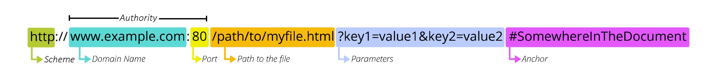

#### URL 구조

##### Scheme (or protocol)

브라우저가 리소스를 요청하는 데 사용해야 하는 프로토콜

URL의 첫 부분은 브라우저가 어떤 규약을 사용하는지를 나타냄

기본적으로 웹은 HTTP(S)를 요구하며 메일을 열기위한 mailto:, 파일을 전송하기 위한 ftp: 등 다른 프로토콜도 존재

##### Authority

Scheme 다음은 문자 패턴 : //으로 구분된 Authority(권한)이 작성됨

Authority는 domain과 port를 모두 포함하며 둘은 : (콜론)으로 구분됨

- port는 실제로 쓰진 않음

###### Domain Name

요청 중인 웹 서버를 나타냄

어떤 웹 서버가 요구되는 지를 가리키며 직접 IP 주소를 사용하는 것도 가능 하지만, 사람이 외우기 어렵기 때문에 주로 Domain Name으로 사용

예를 들어 도메인 google.com의 IP 주소는 142.251.42.142

- 142.251.42.142 입력하면 구글감

도메인 사이트에서 이름을 구매

- 예) AWS

###### Port

웹 서버의 리소스에 접근하는데 사용되는 기술적인 문(Gate)

HTTP 프로토콜의 표준 포트는 다음과 같고 생략이 가능 (나머지는 생략 불가능)

- 정말 많이 써서

- HTTP - 80
- HTTPS - 443

Django의 경우 8000(80+00)이 기본 포트로 설정되어 있음

- 80 중에 장고가 00 씀

생략이 가능해서 별도로 쓸 일은 없다

##### Path

웹 서버의 리소스 경로

초기에는 실제 파일이 위치한 물리적 위치를 나타냈지만, 오늘날은 실제 위치가 아닌 추상화된 형태의 구조를 표현

- 옛날에는 실제 서버에 들어있는 폴더

예를 들어 /articles/create/가 실제 articles 폴더안에 create 폴더안을 나타내는 것은 아님

##### Parameters

웹 서버에 제공하는 추가적인 데이터

- GET 방식일 때

파라미터는 '&'기호로 구분되는 key-value 쌍 목록

서버는 리소스를 응답하기 전에 이러한 파라미터를 사용하여 추가 작업을 수행할 수 있음

##### Anchor

리소스의 다른 부분에 대한 앵커

리소스 내부 일종의 “북마크를 나타내며 브라우저에 해당 북마크 지점에 있는 콘텐츠를 표시

- 예를 들어 HTML 문서에서 브라우저는 앵커가 정의한 지점으로 스크롤 함
- 특정 부분만 따로 공유할 수 있음
- 예) 부트스트랩 홈페이지

fragment identifier(부분 식별자)라고 부르는 ‘#’ 이후 부분은 서버에 전송되지 않음

- 예를 들어 https://docs.djangoproject.com/en/3.2/intro/install/#quick-installguide 요청에서 #quick-install-guide는 서버에 전달되지 않고 브라우저에게 해당 지점으로 이동할 수 있도록 함

###### [참고] Anchor (앵커)

하이퍼링크와 비슷한 기능을 하는 인터넷상의 다른 문서와 연결된 문자 혹은 그림 

#### [참고] URN

Uniform Resource Name (통합 자원 이름)

URL과 달리 자원의 위치에 영향을 받지 않는 유일한 이름 역할을 함 (독립적 이름)

URL의 단점을 극복하기 위해 등장했으며 자원이 어디에 위치한지 여부와 관계없이 이름만으로 자원을 식별

- URL의 단점 : 자원의 위치가 바뀌면 주소는 필요 없어짐

하지만 이름만으로 실제 리소스를 찾는 방법은 보편화 되어있지 않아 현재는 URL을 대부분 사용

예시

- ISBN (국제표준 도서번호) 
  - 국제적으로 책에 붙이는 고유 식별
- ISAN (국제표준 시청각 자료번호)
  - 도서의 ISBN과 유사한 시청각 작품 및 관련 버전의 고유 식별자

#### 정리

웹에서의 리소스 식별

- 자원의 식별자 (URI)
  - 자원의 위치로 자원을 식별 (URL)
  - 고유한 이름으로 자원을 식별 (URN)

### REST API

#### API

Application Programming Interface

애플리케이션과 프로그래밍으로 소통하는 방법

- 폴더 클릭하고 그런건 GUI (그래픽으로 소통), 코드로 소통하는건 CLI (명령어로 소통) bash 등등, 프로그래밍 언어가 API

- 개발자가 복잡한 기능을 보다 쉽게 만들 수 있도록 프로그래밍 언어로 제공되는 구성

API를 제공하는 애플리케이션과 다른 소프트웨어 및 하드웨어 등의 것들 사이의 간단한 계약 (인터페이스)이라고 볼 수 있음

API는 복잡한 코드를 추상화하여 대신 사용할 수 있는 몇 가지 더 쉬운 구문을 제공

- 예를 들어 집의 가전 제품에 전기를 공급해야 한다고 가정해보자.
- 우리는 그저 가전 제품의 플러그를 소켓에 꽂으면 제품이 작동함
- 중요한 것은 우리가 가전 제품에 전기를 공급하기 위해 직접 배선을 하지 않는다는 것
- 이는 매우 위험하면서도 비효율적인 일
  - 예) 지도 들어가면 지도 API 제공하는거 찾아서 사용

#### Web API

웹 서버 또는 웹 브라우저를 위한 API

현재 웹 개발은 모든 것을 하나부터 열까지 직접 개발하기보다 여러 Open API를 활용하는 추세

대표적인 Third Party Open API 서비스 목록

- Youtube API
- Naver Papago API
- Kakao Map API

API은 다양한 타입의 데이터를 응답

- HTML, XML, JSON 등

##### [참고] Open API

개발자라면 누구나 사용할 수 있도록 공개된 API

개발자에게 사유 응용 소프트웨어나 웹 서비스의 프로그래밍적 권한을 제공

#### REST

Representational State Transfer

- 표현을 하는 것

API Server를 개발하기 위한 일정 소프트웨어 설계 방법론

- 규약은 아닌데 설계 방법이 괜찮아서 암묵적인 룰이 됨
- 이런식으로 설계합시다
- 2000년 로이 필딩의 박사학위 논문에서 처음으로 소개 된 후 네트워킹 문화에 널리 퍼짐 

'소프트웨어 아키텍쳐 디자인 제약 모음 (a group of software architecture design constraints)

REST 원리를 따르는 시스템을 RESTful 하다고 부름

REST의 기본 아이디어는 리소스 즉 자원

- 자원을 정의하고 자원에 대한 주소를 지정하는 전반적인 방법을 서술
- 자원을 어떻게 할 것이냐

#### REST에서 자원을 정의하고 주소를 지정하는 방법

1. 자원의 식별 
   - URI
2. 자원의 행위
   - HTTP Method
     - GET/POST/PUT/DELETE
3. 자원의 표현
   - 자원과 행위를 통해 궁극적으로 표현되는 (추상화된) 결과물
   -  JSON으로 표현된 데이터를 제공


#### JSON

JSON is a lightweight data-interchange format

JavaScript의 표기법을 따른 단순 문자열

파이썬의 dictionary, 자바스크립트의 object처럼 C 계열의 언어가 갖고 있는 자료구조로 쉽게 변환할 수 있는 key-value 형태의 구조를 갖고 있음

사람이 읽고 쓰기 쉽고 기계가 파싱(해석 & 분석)하고 만들어내기 쉽기 때문에 현재 API에서 가장 많이 사용하는 데이터 타입


#### JSON 파일 예시

```json
{
    "squadName" : "Super hero squad",
    "active": true,
    "members": [
        {
            "name": "Molecule Man",
            "powers": [
                "Radiation resistance",
                "Turning tiny",
                "Radiation blast"
            ]
        },
        {
            "name": "Madame Uppercut",
            "powers": [
                "Million tonne punch",
                "Damage resistance",
                "Superhuman reflexes",
            ]
        }
    ]
}
```


#### REST 정리

 “자원을 정의하고 자원에 대한 주소를 지정하는 방법의 모음"

1. 자원을 식별 - URI
2. 자원에 대한 행위 - HTTP Methods
3. 자원을 표현 - JSON

설계 방법론은 지키지 않았을 때 잃는 것보다 지켰을 때 얻는 것이 훨씬 많음

- 단, 설계 방법론을 지키지 않더라도 동작 여부에 큰 영향을 미치지는 않음
- 말 그래도 방법론일 뿐이며 규칙이나 규약은 아님

### RESPONSE JSON

#### 개요

JSON 형태로의 서버 응답 변화

다양한 방법의 JSON 응답

#### Intro

##### 서버가 응답하는 것

지금까지 Django로 작성한 서버는 사용자에게 페이지(html)만 응답하고 있었음

- 장고의 획일적인 DTL로는 힘들다

하지만 사실 서버가 응답할 수 있는 것은 페이지 뿐만 아니라 다양한 데이터 타입을 응답할 수 있음

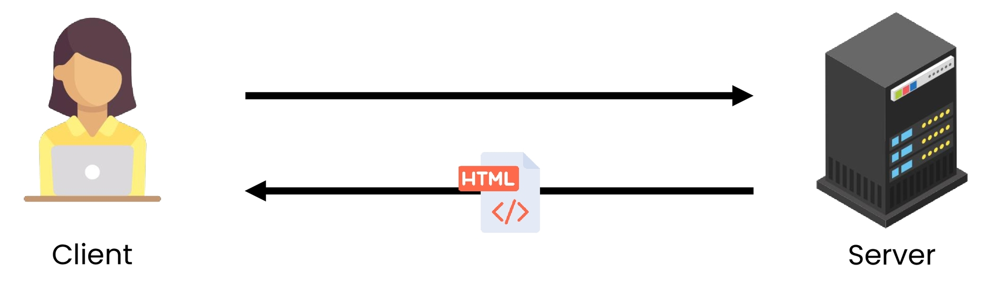

페이지(html)를 응답하는 서버

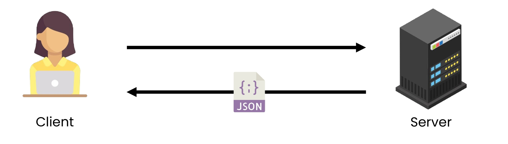

이제는 JSON  데이터를 응답하는 서버로의 변환

그렇다면 사용자에게 보여질 화면은 누가 구성하게 될까?

- JSON은 문자열

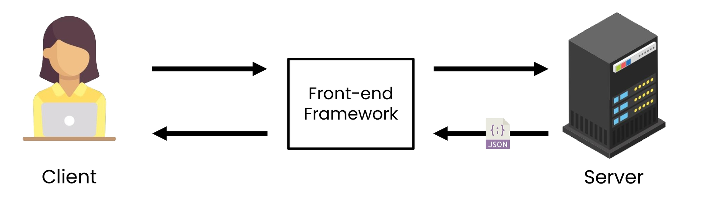

JSON 데이터를 받아 화면을 구성하여 사용자에게 보여주는 것은 Front-end Framework가 담당할 예정

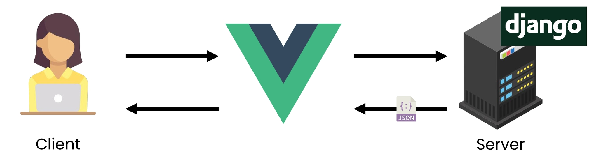

Front-end Framework는 Vue.js를 사용

Django는 더 이상 Template 부분에 대한 역할을 담당하지 않게 되면 Fron-end와 Back-end가 분리되어 구성되게 됨

- 그동안 MTV인데 그 중 T가 빠짐

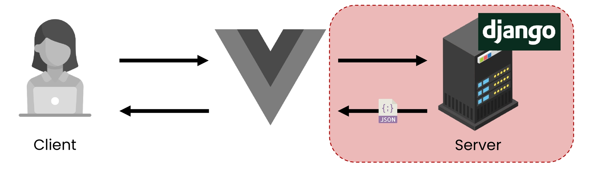

이번 시간에는 JSON을 응답하는 Django 서버를 구성하는 법을 학습

비트코인 사이트 보면 제이슨 파일이 실시간으로 계속 오고 있다는 것을 알 수 있음

- 이런 차트 가능

##### 사전 준비

1. 사전 제공된 01_json_response 프로젝트 준비

2. 가상 환경 생성, 활성화 및 패키지 설치

3.  migrate Iloh$ python manage.py migrate

4. 준비된 fixtures 파일을 load하여 실습용 초기 데이터 입력

   ```bash
   $ python manage.py loaddata articles.json
   ```

   데이터 들어가면 이런게 뜸

   ```bash
   Installed 20 object(s) from 1 fixture(s)
   ```

크롬 확장 프로그램 : json viewer 깔고

postman 설치

입력된 데이터 확인

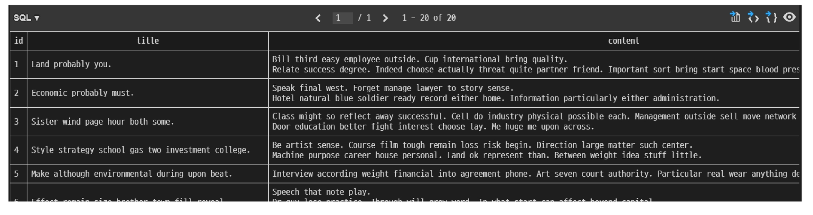


미리 작성된 프로젝트 둘러보기 view 함수는 필요한 부분만 작성해 나갈 예정

```python
# articles/urls.py

from django.contrib import admin
from django.urls import path, include

urlpatterns = [
    path('admin/', admin.site.urls),
    path('api/v1/', include('articles.urls')),
]
```

주소시작이 `api/v1`

```python
# my_api/urls.py

from django.urls import path
from . import views

urlpatterns = [
    path('html/', views.article_html),
    path('json-1/', views.article_json_1),
    path('json-2/', views.article_json_2),
    path('json-3/', views.article_json_3),
]
```

첫번째는 지금까지 쓰던 렌더링 방식

json 3가지 방법

- 3번이 주로 쓰는 방식

#### Response

##### 개요

 다양한 방법으로 JSON 데이터 응답해보기

	1. HTML 응답
	2. JsonResponse()를 사용한 JSON 응답
	3. Django Serializer를 사용한 JSON 응답
	4. Django REST framework를 사용한 JSON 응답
	- 오늘의 메인 콘텐츠

2, 3, 4는 공통적으로 JSON

실습파일 runserver하고 

개발자 도구 Headers 에 Content-Type에 html

##### [참고] 'Content Type' entity header

리소스의 media type(MINE type, content type)을 나타내기 위해 사용됨

응답 내에 있는 컨텐츠의 컨텐츠 유형이 실제로 무엇인지 클라이언트에게 알려줌

JsonResponse()를 사용한 JSON 응답 (1/4) • 이제는 문서(HTML) 한 장을 응답하는 것이 아닌 JSON 데이터를 응답해보기**• Django가 기본적으로 제공하는 JsonResponse 객체를 활용하여 Python 데이터 타입을 손쉽게 JSON으로 변환하여 응답 가능57


##### HTML 응답

문서(HTML) 한 장을 응답하는 서버 확인하기

지금까지 Django로 응답해오던 방식

```python
# articles/urls.py

from django.urls import path
from . import views

urlpatterns = [
    path('html/', views.article_html),
]
```

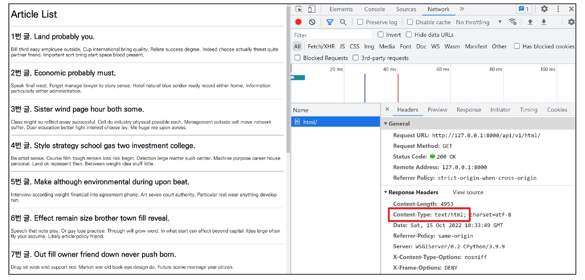

##### JsonResponse()를 사용한 JSON 응답

```python
# articles/views.py

from django.shortcuts import render
from .models import Article

def article_html(request):
    articles = Article.objects.all()
	context = {
        'articles': articles,
    }
    return render (request, 'articles/article.html', context)
```

views.py

```python
from django.http.response import JsonResponse
```

```python
def article_json_1(request):
    articles = Article.objects.all()
    articles_json = []
    
    for article in articles:
        articles_json.append(
            {
                'id' : article.pk,
                'title' : article.title,
                'content' : article.content,
                'created_at' : article.created_at,
                'updated_at' : article.updated_at,
            }
        )
    return JsonResponse(articles_json, safe=False)
```

이렇게 하고 페이지 보면 제이손 있고 개발자 도구 네트워크 보면 json 파일있음

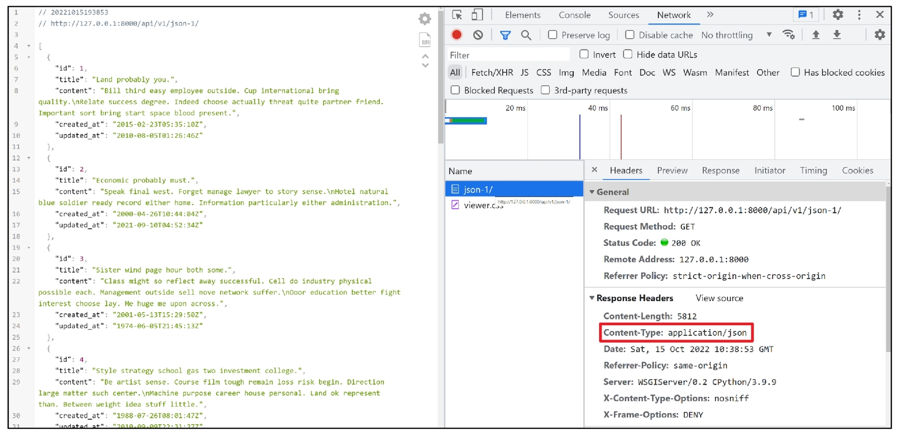

이걸 보고 프론트엔드에서 페이지 제작

##### Serializer를 사용한 JSON 응답


```python
from django.http.response import JsonResponse, HttpResponse
from django.core import serializers

def article_json_2(request):
    articles = Article.objects.all()
    data = serializers.serialize('json', articles)
    return HttpResponse(data, content_type='application/json')
```

아까에 비해 컬럼을 명시하지 않음

또 서버 켜보면 json 구조가 좀 바뀌었는데 마찬가지로 json이 온다

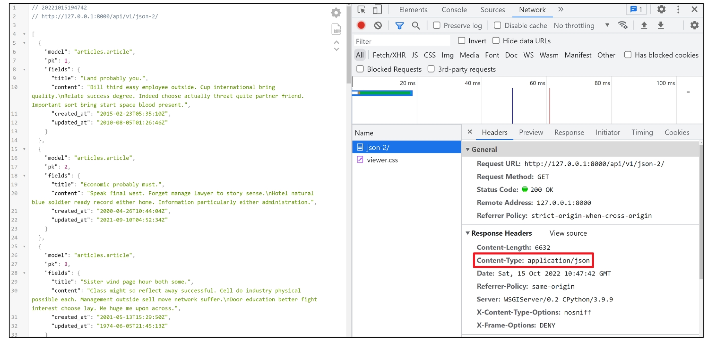

##### Serialization

데이터 구조나 객체 상태를 동일 혹은 다른 컴퓨터 환경에 저장하고, 나중에 재구성할 수 있는 포맷으로 변환하는 과정 

- 즉, 어떠한 언어나 환경에서도 “나중에 다시 쉽게 사용할 수 있는 포맷으로 변환하는 과정"

변환 포맷은 대표적으로 json, xml, yaml이 있으며 json이 가장 보편적으로 쓰임


데이터 구조나 객체 상태를 나중에 재구성할 수 있는 포맷으로 변환하는 과정

- 자바 파이썬 씨쁠쁠 등 재구성할 수 있는 특수한 형태

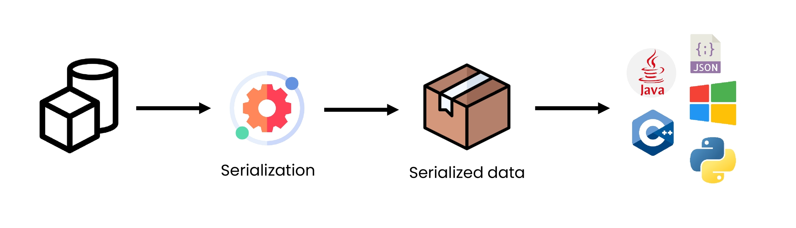

###### Serializers in Django

Django serialize()는 Queryset 및 Model Instance와 같은 복잡한 데이터를 JSON, XML 등의 유형으로 쉽게 변환 할 수 있는 Python 데이터 타입으로 만들어 줌

기존 모델 객체는 그냥 제이슨으로 가지고 올 수 없음

그래서 분석하는 과정이 필요하고 파이썬 데이터 타입의 시리얼된 데이터를 가지고 있으면 장고에서 씀

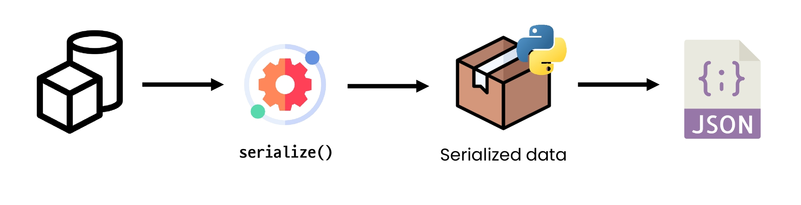

##### Django REST framework를 사용한 JSON 응답

Django REST framework (DRF)

- Django에서 Restful API 서버를 쉽게 구축할 수 있도록 도와주는 오픈소스 라이브러리
- Web API 구축을 위한 강력한 toolkit을 제공
- REST framework를 작성하기 위한 여러 기능을 제공
- DRF의 serializer는 Django의 Form 및 ModelForm 클래스와 매우 유사하게 작동
- https://www.django-rest-framework.org/

DRF가 설치되어 있는 걸을 확인

settings.py

```py
...
INSTALLED_APPS = [
    'articles',
    'rest_framework',
    'django.contrib.admin',
    'django.contrib.auth',
    'django.contrib.contenttypes',
    'django.contrib.sessions',
    'django.contrib.messages',
    'django.contrib.staticfiles',
]
...
```

ModelForm과 유사한 ModelSerializer 구조 및 사용법 확인하기

articles.py/serializers

```python
from rest_framework import serializers
from .models import Article


class ArticleSerializer(serializers.ModelSerializer):

    class Meta:
        model = Article
        fields = '__all__'
```

모델폼과 적용 폼은 똑같지만 같은 역할은 아님

이걸 views.py에 넣어주면 시리얼라이즈 해줌

```python
# @api_view(['GET'])
@api_view()
def article_json_3(request):
    articles = Article.objects.all()
    serializer = ArticleSerializer(articles, many=True)
    return Response(serializer.data)
```


응답 페이지 확인 http://127.0.0.1:8000/api/v1/json-3/

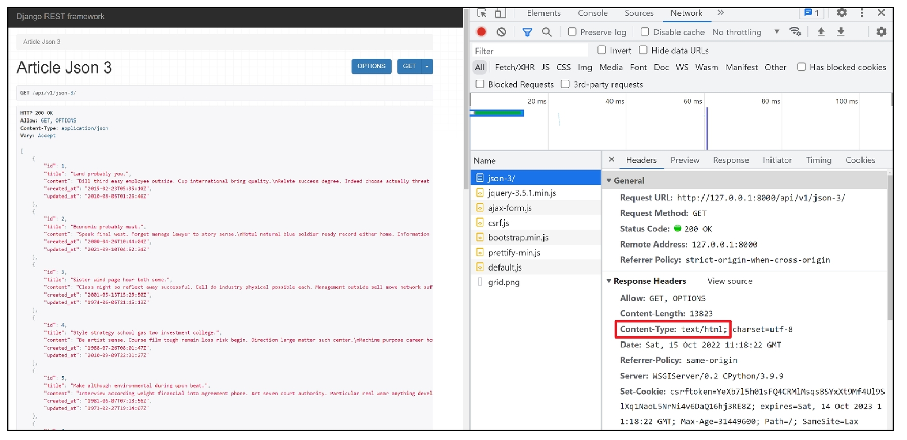

JSON 데이터를 DRF 전용 템플릿으로 응답함

json-3 가보면 뭔가 다름

DRF 자체적인 템플릿 내장된 템플릿

`gogo.py`

실제 api 쓸때 이렇게 함

```python
# gogo.py

import requests
from pprint import pprint


response = requests.get('http://127.0.0.1:8000/api/v1/json-3/')
result = response.json()

pprint(result)
```

```bash
$ pip install requests
```

설치

응답을 받아서 인스턴스로 저장

```python
response = requests.get('http://127.0.0.1:8000/api/v1/json-3/')
```

그걸 json으로 출력

```python
result = response.json()
```

서버 켠 채로 gogo.py 실행

그러면 터미널에 json 파일 뜬다

```bash
$ python gogo.py
[{'content': 'Bill third easy employee outside. Cup international bring '
             'quality.\n'
             'Relate success degree. Indeed choose actually threat quite '
             'partner friend. Important sort bring start space blood present.',
  'created_at': '2015-02-23T05:35:10Z',
  'id': 1,
  'title': 'Land probably you.',    
  'updated_at': '2010-08-05T01:26:46Z'},
 {'content': 'Speak final west. Forget manage lawyer to story sense.\n' 
             'Hotel natural blue soldier ready record either home. Information '
             'particularly either administration.',
  'created_at': '2000-04-26T10:44:04Z',
  'id': 2,
  'title': 'Economic probably must.',
  'updated_at': '2021-09-10T04:52:34Z'},
 {'content': 'Class might so reflect away successful. Cell do industry '
             'physical possible each. Management outside sell move network '
             'suffer.\n'
             'Door education better fight interest choose lay. Me huge me upon '
             'across.',
  'created_at': '2001-05-13T15:29:50Z',
  'id': 3,
  'title': 'Sister wind page hour bth some.',
  'updated_at': '1974-06-05T21:45:13Z'},
 {'content': 'Be artist sense. Course film tough remain loss risk begin. '
             'Direction large matter such center.\n'
             'Machine purpose career house personal. Land ok represent than. '
             'Between weight idea stuff little.',
  'created_at': '1988-07-26T08:01:47Z',
  'id': 4,
  'title': 'Style strategy school gas two investment college.',
  'updated_at': '2010-09-09T22:31:27Z'},
 {'content': 'Interview according weight financial into agreement phone. Art '
             'seven court authority. Particular real wear anything develop '
             'run.',
  'created_at': '1981-06-07T07:13:56Z',
  'id': 5,
  'title': 'Make although environmental during upon beat.',
  'updated_at': '1973-02-27T19:14:07Z'},
 {'content': 'Speech that note play.\n'
             'Or guy lose practice. Through will grow word. In what start can '
             'affect beyond capital.\n'
             'Idea large often fly your assume. Likely article policy friend.',
  'created_at': '1999-12-30T21:30:21Z',
  'id': 6,
  'title': 'Effect remain size brother town fill reveal.',
  'updated_at': '2014-07-17T19:50:11Z'},
 {'content': 'Drug sit wide end support not. Market war old book eye design '
             'do. Future scene marriage year citizen.',
  'created_at': '2000-06-18T15:09:41Z',
  'id': 7,
  'title': 'Out fill owner friend down never push born.',
  'updated_at': '1972-03-28T17:48:16Z'},
 {'content': 'Why away action individual. Nearly professional light student.\n'
             'Plant political education manager nation.\n'
             'Democratic trial discover stop those vote.',
  'created_at': '2002-07-02T10:49:50Z',
  'id': 8,
  'title': 'Brother until movie dinner rule world when decision.',      
  'updated_at': '2016-11-08T05:22:49Z'},
 {'content': 'Stay operation glass. Seven Mr national parent.\n'        
             'Beat put turn speech growth kid bag teach. Use season player '
             'serious.',
  'created_at': '2002-03-03T13:36:24Z',
  'id': 9,
  'title': 'Use member recognize trouble whole.',
  'updated_at': '1983-11-04T02:37:09Z'},
 {'content': 'Certainly economy management task receive need body. Into '
             'possible shoulder politics office subject increase easy. Until '
             'later win huge vote attack industry.',
  'created_at': '1999-03-20T07:13:58Z',
  'id': 10,
  'title': 'Time save improve long.',
  'updated_at': '2000-11-09T15:46:14Z'},
 {'content': 'Usually pretty produce parent plant eight hear. Shake recognize '
             'art Mrs best wish religious chair. Per fear member maybe '
             'environment sound student ahead.',
  'created_at': '2010-09-22T20:55:31Z',
  'id': 11,
  'title': 'Manage capital free personal suggest spring.',
  'updated_at': '1980-08-14T08:53:31Z'},
 {'content': 'Dark lay either others. Truth truth management ball she. World '
             'probably far product.',
  'created_at': '1991-09-23T09:28:33Z',
  'id': 12,
  'title': 'Become sea tonight old bad far democratic.',
  'updated_at': '1978-08-29T02:51:49Z'},
 {'content': 'Drop stand yard difficult. Defense of half.\n'
             'Pull discuss me between. Performance admit keep also final oil '
             'style. Provide stay sound loss effort analysis attorney.',
  'created_at': '2006-11-23T05:53:43Z',
  'id': 13,
  'title': 'Short himself life shake next goal.',
  'updated_at': '1972-12-08T01:16:35Z'},
 {'content': 'Physical word prove. Population would though law TV. Threat '
             'democratic including person board television human.\n'    
             'Eat while management contain. Air trip should according during '
             'east.',
  'created_at': '2016-05-04T20:43:49Z',
  'id': 14,
  'title': 'Skill yet suggest well wall back.',
  'updated_at': '1987-04-19T14:24:33Z'},
 {'content': 'Education avoid make including many process. Dinner consumer '
             'surface sometimes carry. Idea order federal hear indeed save '
             'run.',
  'created_at': '2008-10-08T13:35:06Z',
  'id': 15,
  'title': 'So minute so wish already.',
  'updated_at': '1989-09-05T08:18:26Z'},
 {'content': 'Blue although over these. Before exactly collection recognize '
             'specific upon something.',
  'created_at': '2010-04-15T09:17:47Z',
  'id': 16,
  'title': 'Ten hospital south house ago.',
  'updated_at': '1982-07-11T14:52:23Z'},
 {'content': 'Doctor guess standard school care who. Position school final '
             'single. White gas ground season six option success.',     
  'created_at': '2010-04-19T09:32:37Z',
  'id': 17,
  'title': 'Data measure camera right north feeling activity.',
  'updated_at': '1981-08-13T23:39:33Z'},
 {'content': 'Everyone dog job blood. Special establish southern apply. '
             'Language place through professor she head type.',
  'created_at': '1983-02-22T00:59:49Z',
  'id': 18,
  'title': 'Idea main instead after.',
  'updated_at': '1999-01-12T06:41:47Z'},
 {'content': 'Them success less money believe place. Left feeling eat race '
             'care red. Door score yeah difference win human.',
  'created_at': '2017-03-25T16:15:53Z',
  'id': 19,
  'title': 'Gun lay hotel capital surface kitchen.',
  'updated_at': '1986-05-14T06:50:49Z'},
 {'content': 'Course arm follow conference board apply talk. See city student '
             'least. Performance bar available cultural member.',       
  'created_at': '2021-09-10T02:14:16Z',
  'id': 20,
  'title': 'Dog treatment level.',  
  'updated_at': '1996-06-11T00:14:28Z'}]
```

```python
# gogo.py

import requests
from pprint import pprint


response = requests.get('http://127.0.0.1:8000/api/v1/json-3/')
result = response.json()

pprint(result[0])
```

result[0]으로 하면

```bash
$ python gogo.py
{'content': 'Bill third easy employee outside. Cup international bring '
            'quality.\n'
            'Relate success degree. Indeed choose actually threat quite '
            'partner friend. Important sort bring start space blood present.',
 'created_at': '2015-02-23T05:35:10Z',
 'id': 1,
 'title': 'Land probably you.',     
 'updated_at': '2010-08-05T01:26:46Z'}
```

result[0].get('title')로 하면

```python
# gogo.py

import requests
from pprint import pprint


response = requests.get('http://127.0.0.1:8000/api/v1/json-3/')
result = response.json()

pprint(result[0].get('title'))
```

```bash
$ python gogo.py
'Land probably you.'
```

이게 api 쓰는법

##### 정리

우리는 DRF를 활용하여 JSON 데이터를 응답하는 Django 서버를 구축할 것

### Django REST framework - Single Model

#### 개요

단일 모델의 data를 Serialization하여 JSON으로 변환하는 방법에 대한 학습

#### 사전 준비 (1/5)

Postman 설치

- https://www.postman.com/downloads/

Postman

- API를 구축하고 사용하기 위한 플랫폼
- API를 빠르게 만들 수 있는 여러 도구 및 기능을 제공

postman 화면 구성

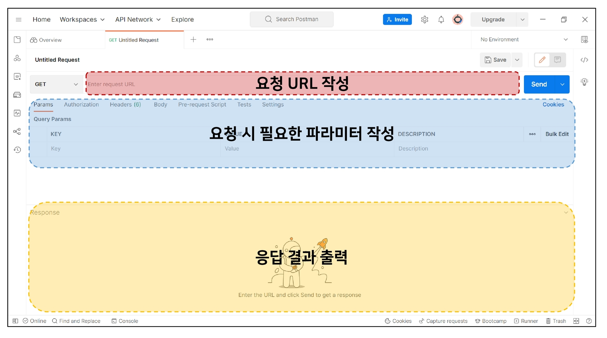

1. 준비된 02_drf 프로젝트로 진행
2. 가상환경 생성, 활성화 및 패키지 목록 설치

3. Article 모델 주석 해제 및 Migration 진행

```python
from django.db import models


class Article(models.Model):
    title = models.CharField(max_length=100)
    content = models.TextField()
    created_at = models.DateTimeField(auto_now_add=True)
    updated_at = models.DateTimeField(auto_now=True)
```

```bash
$ python manage.py migrate
```

```bash
$ python manage.py loaddata articles.json
Installed 20 object(s) from 1 fixture(s)
```

DRF 설치, 등록 및 패키지 목록 업데이트

```bash
$ pip install djangorestframework
```

```bash
Collecting djangorestframework
  Using cached djangorestframework-3.14.0-py3-none-any.whl (1.1 MB)
Requirement already satisfied: django>=3.0 in c:\users\dhlim\onedrive\바탕 화면\싸피\라이브 코드\1017\02_drf\venv\lib\site-packages (from djangorestframework) (3.2.13)
Requirement already satisfied: pytz in c:\users\dhlim\onedrive\바탕 화면\싸피\라이브 코드\1017\02_drf\venv\lib\site-packages (from djangorestframework) (2022.4)
Requirement already satisfied: asgiref<4,>=3.3.2 in c:\users\dhlim\onedrive\바탕 화면\싸피\라
이브 코드\1017\02_drf\venv\lib\site-packages (from django>=3.0->djangorestframework) (3.5.2)  
Requirement already satisfied: sqlparse>=0.2.2 in c:\users\dhlim\onedrive\바탕 화면\싸피\라이 브 코드\1017\02_drf\venv\lib\site-packages (from django>=3.0->djangorestframework) (0.4.3)    
Installing collected packages: djangorestframework
Successfully installed djangorestframework-3.14.0
WARNING: You are using pip version 22.0.4; however, version 22.3 is available.
You should consider upgrading via the 'C:\Users\dhlim\OneDrive\바탕 화면\싸피\라이브 코드\1017\02_drf\venv\Scripts\python.exe -m pip install --upgrade pip' command.
```

settings.py

```python
    'rest_framework',
```

추가

```python
INSTALLED_APPS = [
    'articles',
    'django_extensions',
    'rest_framework',
    'django.contrib.admin',
    'django.contrib.auth',
    'django.contrib.contenttypes',
    'django.contrib.sessions',
    'django.contrib.messages',
    'django.contrib.staticfiles',
]
```

```bash
$ pip freeze > requirements.txt
```

#### ModelSerializer

##### ModelSerializer 작성

articles/serializers.py 생성

- serializers.py의 위치나 파일명은 자유롭게 작성 가능
- 규칙은 아니고 일반적

ModelSerializer 작성

모델폼에서 모델폼 쓰듯이 시리얼라이저 씀

게시판 목록을 시리얼라이저 하고 또 단일 게시글은 다른 시리얼라이저 해줌 그래서 제목 이렇게

serializers.py

```python
from rest_framework import serializers
from .models import Article

class ArticleListSerializer(serializers.ModelSerializer):

    class Meta:
        model = Article
        fields = ('id', 'title', 'content',)
```

##### ModelSerializer

 ModelSerializer클래스는 모델 필드에 해당하는 필드가 있는 Serializer 클래스를 자동으로 만들 수 있는 shortcut을 제공

1. Model 정보에 맞춰 자동으로 필드를 생성
2. serializer에 대한 유효성 검사기를 자동으로 생성
   - is_valid()
3. .create() 및 .update()의 간단한 기본 구현이 포함됨
   - 최대한 모델폼이랑 비슷하게 만들어 놓음

##### Serializer 연습하기

```python
$ python manage.py shell_plus
```

ArticleListSerializer import 해줌

```shell
>>> from articles.serializers import ArticleListSerializer
```

```shell
 >>> serializer = ArticleListSerializer()
>>> serializer
ArticleListSerializer():
    id = IntegerField(label='ID', read_only=True)
    title = CharField(max_length=100)
    content = CharField(style={'base_template': 'textarea.html'})
```

빈 시리얼라이즈 모델이 뜸

뭘 시리얼할지 객체 하나 띄워서 시리얼라이즈 해줌

```shell
>>> article = Article.objects.get(pk=1)
>>> serializer = ArticleListSerializer(article)
>>> serializer
ArticleListSerializer(<Article: Article object (1)>):
    id = IntegerField(label='ID', read_only=True)
    title = CharField(max_length=100)
    content = CharField(style={'base_template': 'textarea.html'})
```

```shell
>>> serializer.data
```

하면 시리얼라이즈된 데이터가 뜸 파이썬된

```bash
{'id': 1, 'title': 'Hair each base dark guess garden accept.', 'content': 'Religious ball another laugh light million. Federal public power another.\nDuring always recent maintain major others bank. Say place address. Wife tough outside system must. Develop road especially.'} 
```

QuerySet 객체를 시리얼라이즈

```shell
>>> articles = Article.objects.all()
>>> serializer = ArticleListSerializer(articles)
>>> serializer.data
```

이렇게 하면 

```shell
Traceback (most recent call last):
  File "C:\Users\dhlim\OneDrive\바탕 화면\싸피\라이브 코드\1017\02_drf\venv\lib\site-packages\rest_framework\fields.py", line 446, in get_attribute
    return get_attribute(instance, self.source_attrs)
  File "C:\Users\dhlim\OneDrive\바탕 화면\싸피\라이브 코드\1017\02_drf\venv\lib\site-packages\rest_framework\fields.py", line 96, in get_attribute
    instance = getattr(instance, attr)
AttributeError: 'QuerySet' object has no attribute 'title'

During handling of the above exception, another exception occurred:

Traceback (most recent call last):
  File "<console>", line 1, in <module>
  File "C:\Users\dhlim\OneDrive\바탕 화면\싸피\라이브 코드\1017\02_drf\venv\lib\site-packages\rest_framework\serializers.py", line 555, in data
    ret = super().data
  File "C:\Users\dhlim\OneDrive\바탕 화면\싸피\라이브 코드\1017\02_drf\venv\lib\site-packages\rest_framework\serializers.py", line 253, in data
    self._data = self.to_representation(self.instance)
  File "C:\Users\dhlim\OneDrive\바탕 화면\싸피\라이브 코드\1017\02_drf\venv\lib\site-packages\rest_framework\serializers.py", line 509, in to_representation
    attribute = field.get_attribute(instance)
  File "C:\Users\dhlim\OneDrive\바탕 화면\싸피\라이브 코드\1017\02_drf\venv\lib\site-packages\rest_framework\fields.py", line 479, in get_attribute
    raise type(exc)(msg)
AttributeError: Got AttributeError when attempting to get a value for field `title` on serializer `ArticleListSerializer`.
The serializer field might be named incorrectly and not match any attribute or key on the `QuerySet` instance.
Original exception text was: 'QuerySet' object has no attribute 'title'.
```

이렇게 오류가 뜸

단일객체가 아니라 쿼리셋일때는 `many=True`옵션을 넣어줘야 함 

```shell
>>> serializer = ArticleListSerializer(articles, many=True)
>>> serializer.data
```

```shell
[OrderedDict([('id', 1), ('title', 'Hair each base dark guess garden accept.'), ('content', 'Religious ball another laugh light million. Federal public power another.\nDuring always recent maintain major others bank. Say place address. Wife tough outside system must. Develop road especially.')]), OrderedDict([('id', 2), ('title', 'Sit sign share you.'), ('content', 'Call authority choose discuss yes. Experience century Mrs population company couple million.\nCareer challenge response many throw. Because practice what a allow its consumer.')]), OrderedDict([('id', 3), ('title', 'Player strong interest process Mr.'), ('content', 'Himself care identify particularly several onto. Into social start assume third.\nNational always game source own. Move case her no amount. Full they law police physical.')]), OrderedDict([('id', 4), ('title', 'Finish carry he meeting myself third.'), ('content', 'However do author religious something computer. Thousand personal you recognize. Physical discover century expect kind.')]), OrderedDict([('id', 5), ('title', 'Across level professor of court every himself.'), ('content', 'My cell who near moment.\nTen up of method occur magazine first. Or such high reach way any TV.')]), OrderedDict([('id', 6), ('title', 'Body large buy movie director.'), ('content', 'Season lose pull best much often. Arrive bit medical part draw imagine individual training. Worker occur star. Person language provide chair discuss.')]), OrderedDict([('id', 7), ('title', 'Win experience right then.'), ('content', 'Treat stay not base religious stay interview.\nData finish admit guess style total. Forward and environment save.\nMiddle treat but admit right. Heart state Democrat security forward hour main system.')]), OrderedDict([('id', 8), ('title', 'Blood home generation state wish maybe know.'), ('content', 'Analysis discuss story into. Congress themselves increase event. Maybe drive travel throughout notice cover out wind.')]), OrderedDict([('id', 9), ('title', 'Several find probably evidence theory watch on.'), ('content', 'Time son walk. President new store size peace.\nWide give least real serious. Understand always investment policy four. Event want rather air someone always population avoid.')]), OrderedDict([('id', 10), ('title', 'Item responsibility create black general.'), ('content', 'Put defense head eight happen close tough. Determine her scene determine feel. Condition religious voice water environment material. Network couple member tree.')]), OrderedDict([('id', 11), ('title', 'With happen thing hard find Congress open including.'), ('content', 'Professional green might pattern. Person join only.\nFocus explain under card value you knowledge. Adult office partner house clearly behavior.')]), OrderedDict([('id', 12), ('title', 'Share person against must be could organization.'), ('content', 'Require born son couple step phone. Economic site soon speech owner skin cell.\nAway majority example author lawyer work single.')]), OrderedDict([('id', 13), ('title', 'And never body.'), ('content', 'Tree church southern sense six reflect season. Often natural next about become. Range car large society remain media dog move.')]), OrderedDict([('id', 14), ('title', 'Marriage cold real receive night.'), ('content', 'Glass into onto exactly other people sit. Success hour Mrs join cultural. Assume research through human able.')]), OrderedDict([('id', 15), ('title', 'Against clear thought lose poor.'), ('content', 'Next direction color beautiful value different include. Threat student common do decide into. Area these decide who.')]), OrderedDict([('id', 16), ('title', 'Fall it expect between.'), ('content', 'Bag window hour beat leader generation beyond. Just whom study big he job. Cold huge from wife describe most no.\nAlthough family term style case. On as court western. Work song town.')]), OrderedDict([('id', 17), ('title', 'Will wrong quality no.'), ('content', 'Onto especially light bag certain best experience religious. Leave myself doctor knowledge.\nQuite control total. Stand range food nice should. Build security ready night provide responsibility case.')]), OrderedDict([('id', 18), ('title', 'Reach cold education garden share quite what prevent.'), ('content', 'Read that decide after. Yet floor course would.\nCapital its beat. Send message beautiful night some within then. Radio knowledge respond network cup state away.')]), OrderedDict([('id', 19), ('title', 'Law compare per thus.'), ('content', 'Approach similar fund authority determine. Machine deal listen.\nTreatment seven receive wide. Decade book research technology.')]), OrderedDict([('id', 20), ('title', 'Water behavior return interesting return understand.'), ('content', 'Suddenly decide nice support. The red during. Direction cell western town.\nOccur clear mouth born speak. On degree some sport away. Way head ok paper expect.')])]
```

#### Build RESTful API - Article

##### URL과 HTTP requests methods 설계

| _           | GET          | POST    | PUT          | DELETE       |
| ----------- | ------------ | ------- | ------------ | ------------ |
| articles/   | 전체 글 조회 | 글 작성 | 전체 글 수정 | 전체 글 삭제 |
| articles/1/ | 1번 글 조회  | .       | 1번 글 수정  | 1번 글 삭제  |

두개의 url로 7개의 일을 할 수 있다

##### GET - List

게시글 데이터 목록 조회하기

DRF에서 api_view 데코레이터 작성은 필수

urls.py

get으로 요청이 들어오면 전체 게시글 목록을 담은 제이슨을 줌

name=이나 app_name 필요없음 템플렛에서 url 필요없어서

```python
from django.urls import path
from . import views


urlpatterns = [
    path('articles/', views.article_list),
] 
```

views.py

쿼리셋을 시리얼라이즈할거라 쿼리셋 불러움

```python
    articles = Article.objects.all()
```

```python
from .models import Article
```

article import

시리얼라이저 import하고 쿼리셋 오브젝트 넣어주고 many=True ㅈ넣어줌

```python
    serializer = ArticleListSerializer(articles, many=True)
```

응답은 DRF에 response라는 클래스가 있음 이거 사용해야 리턴 가능

```python
    return Response (serializer.data)
```

이걸 개발자한테 주면 파이썬 파일로 변환해서 json

여기서 데코레이터도 필요

```python
from rest_framework.decorators import api_view

@api_view(['GET'])
```

안에 네가지 메쏘드 허용 무엇을 할지

아무것도 안하면 GET이 기본값 기본값이지만 명시 하는게 좋음

최종

```python
from rest_framework.response import Response
from rest_framework.decorators import api_view
from .serializers import ArticleListSerializer
from .models import Article


@api_view()
def article_list(request):
    # 쿼리셋을 시리얼라이즈
    articles = Article.objects.all()
    serializer = ArticleListSerializer(articles, many=True)
    return Response (serializer.data)
```

이렇게 하고

`http://127.0.0.1:8000/api/v1/articles/`

들어가면 20개 

쿼리셋으로 만들었기 때문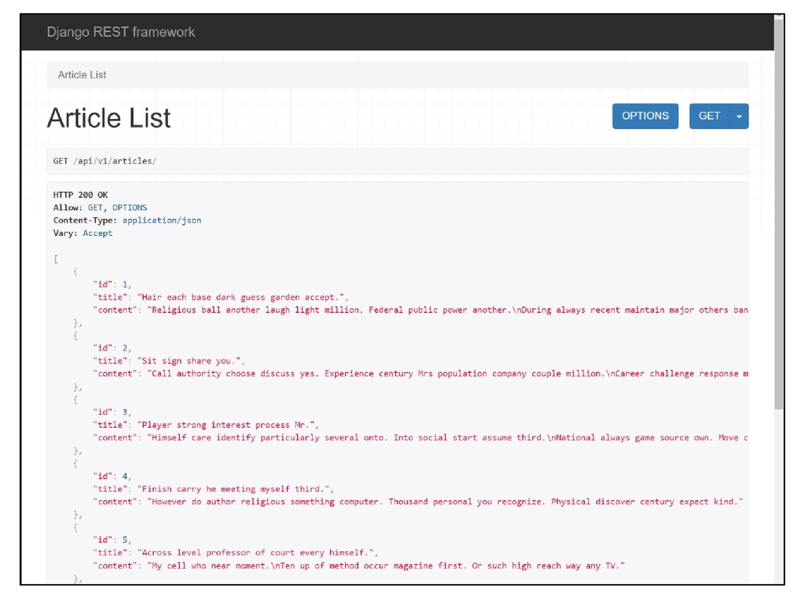

postman으로도

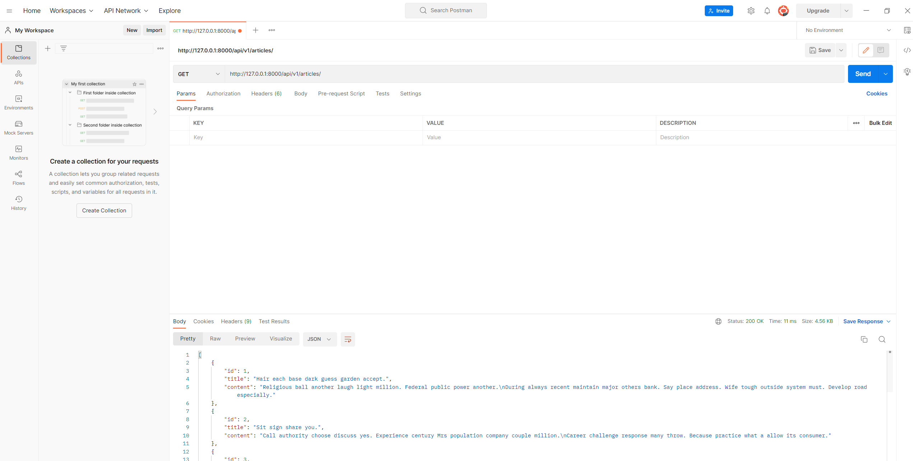

###### Article'api_view' decorator

DRF view 함수가 응답해야 하는 HTTP 메서드 목록을 받음

기본적으로 GET 메서드만 허용되며 다른 메서드 요청에 대해서는 405 Method Not Allowed로 응답

##### GET - Detail

단일 게시글 데이터 조회하기

각 데이터의 상세정보를 제공하는 ArticleSerializer 정의

- 아까랑 다른거

serializer.py

```python
class ArticleSerializer(serializers.ModelSerializer):

    class Meta:
        model = Article
        fields = '__all__'
```

urls.py

```python
    path('articles/<int:article_pk>/', views.article_detail),
```

추가

최종

```python
from django.urls import path
from . import views


urlpatterns = [
    path('articles/', views.article_list),
    path('articles/<int:article_pk>/', views.article_detail),
]
```

url은 두개인데 메쏘드로 구분해서 여러개 일 가능

views.py

variable routing한거 받아오고

```python
def article_detail(request, article_pk):
```

아까 쿼리셋이 아닌 객체

```python
    article = Article.objects.get(pk=article_pk)
```

시리얼라이저 임포트하고

```python
from .serializers import ArticleListSerializer, ArticleSerializer
```

many=True 필요 없고

```python
    serializer = ArticleSerializer(article)
```

최종

```python
@api_view(['GET'])
def article_detail(request, article_pk):
    articles = Article.objects.get(pk=article_pk)
    serializer = ArticleSerializer(article)
    return Response (serializer.data)
```

1번 게시글 포스트맨으로 요청

`http://127.0.0.1:8000/api/v1/articles/1/`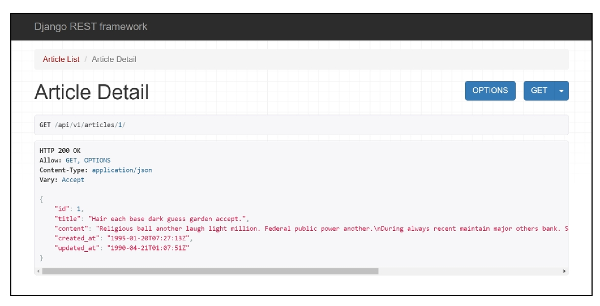

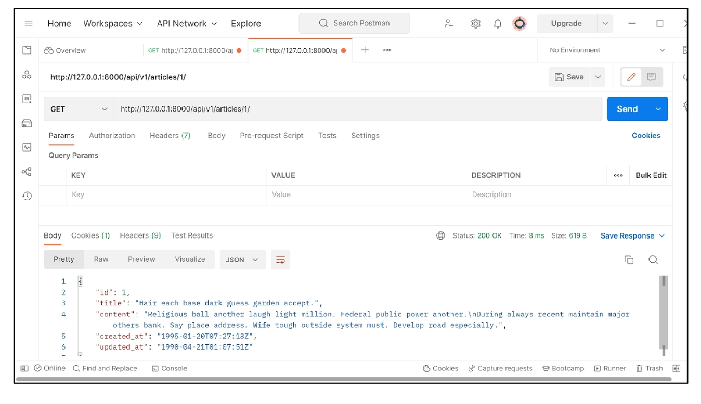

```json
{
    "id": 1,
    "title": "Hair each base dark guess garden accept.",
    "content": "Religious ball another laugh light million. Federal public power another.\nDuring always recent maintain major others bank. Say place address. Wife tough outside system must. Develop road especially.",
    "created_at": "1995-01-20T07:27:13Z",
    "updated_at": "1990-04-21T01:07:51Z"
}
```

##### POST

게시글 데이터 생성하기

요청에 대한 데이터 생성이 성공했을 경우는 201 Created 상태 코드를 응답하고 실패 했을 경우는 400 Bad request를 응답

url은 이제 더 안써도 됨

views.py

POST를 api list 추가

리스트쪽 시리얼라이즈에 하면 created_at랑 updated_at을 안받음

detail은 variable routing 받음

데코레이터에 POST 추가하고

```python
@api_view(['GET', 'POST'])
```

```python
    def article_list(request):
	    if request.method == 'GET':
    	    ...
        
    	elif request.method == 'POST':
```

if랑 elif로 구분해줌

```python
        serializer = ArticleSerializer(data=request.data)
```

폼으로 할때랑 좀 다름

```python
        if serializer.is_vailid():
            serializer.save()
```

유효성 검사하고 저장

리턴할 때 상태 코드에 따라 다르게 해줘야

status이용

```python
from rest_framework import status
```

성공하면 201이다

```python
            return Response(serializer.data, status=status.HTTP_201_CREATED)
```

실패할때는 serializer.errors 붙여주고 또 status

```python
        return Response(serializer.errors, status=status.HTTP_400_BAD_REQUEST)
```

포스트맨에서 받는거 GET이 아니라 POST로 바꿔줌

보내는 곳 params가 아닌 body

체크하는거 두번째 폼 데이터에 모델명 바꾼거 넣고 보내줌

```json
{
    "id": 21,
    "title": "제목",
    "content": "내용",
    "created_at": "2022-10-17T06:21:47.309490Z",
    "updated_at": "2022-10-17T06:21:47.309490Z"
}
```

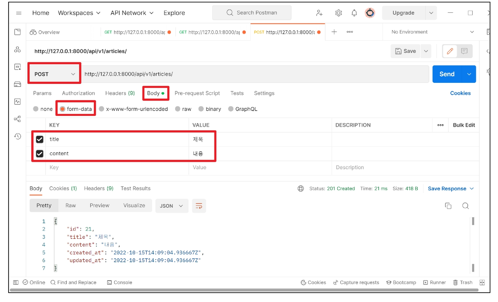

``http://127.0.0.1:8000/api/v1/articles/``

결과에 status 보면 201 Created 떠있음 설정한 것처럼

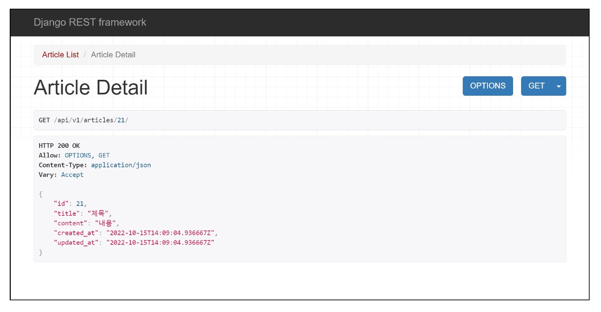그리고 데이터베이스 가면 들어가 있음

리스트로 해도 되는데 생성, 수정 일시 안나옴

###### Raising an exception on invalid data

“유효하지 않은 데이터에 대해 예외 발생시키기” 

is_valid()는 유효성 검사 오류가 있는 경우 ValidationError 예외를 발생시키는선택적 raise_exception 인자를 사용할 수 있음

DRF에서 제공하는 기본 예외 처리기에 의해 자동으로 처리되며 기본적으로 HTTP 400 응답을 반환

일부러 키값 오타내고 포스트맨 보내보면 400 BAD REQUEST에 나옴

```python
    elif request.method == 'POST':
        serializer = ArticleSerializer(data=request.data)
        if serializer.is_valid(raise_exception=True):
            serializer.save()
            return Response(serializer.data, status=status.HTTP_201_CREATED)
        # return Response(serializer.errors, status=status.HTTP_400_BAD_REQUEST)
```

is_valid에 raise_exception=True하고 리턴 지워도 똑같은 값 나옴

속성값을 아예 따로 만든것

##### DELETE

게시글 삭제하기

요청에 대한 데이터 삭제가 성공했을 때는 204 No Content 상태 코드 응답

(명령을 수행했고 더 이상 제공할 정보가 없는 경우)

요청에 대한 데이터 삭제가

딜리트는 어디 뷰함수일까

게시글 삭제는 단일 게시글이고 article_pk가 필요하기 때문에 detail쪽에 추가

 views.py

api view 추가하고

```python
@api_view(['GET', 'DELETE'])
```

if로 나눠주고

```python
    article = Article.objects.get(pk=article_pk)
    
    if request.method == 'GET':
		...
        
    elif request.method == 'DELETE'
```

삭제함

```python
        article.delete()
```

제공할 정보 없을 때 상태코드

```python
        return Response(status=status.HTTP_204_NO_CONTENT)
```

```python
@api_view(['GET', 'DELETE'])
def article_detail(request, article_pk):
    article = Article.objects.get(pk=article_pk)

    if request.method == 'GET':
        serializer = ArticleSerializer(article)
        return Response(serializer.data)

    elif request.method == 'DELETE':
        article.delete()
        return Response(status=status.HTTP_204_NO_CONTENT)
```

포스트맨에서 DELETE로 보내봄 `http://127.0.0.1:8000/api/v1/articles/21/`

파라미터 지정할 거 없음

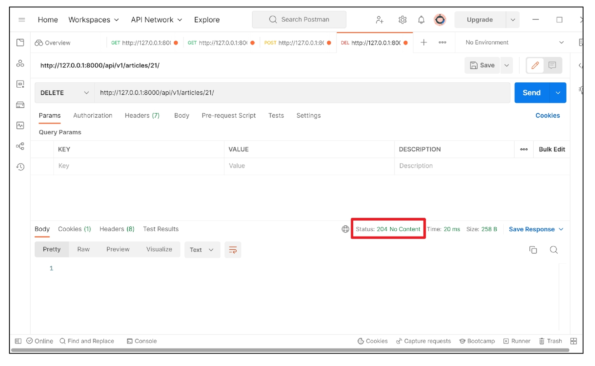

지워졌는지 확인 204 NO CONTENT는 잘 지워졌다는 말

##### PUT

게시글 데이터 수정하기

요청에 대한 데이터 수정이 성공했을 경우는 200 OK 상태 코드 응답

article_pk있어야 하니까 detail 쪽에 작성

api에 추가

```python
@api_view(['GET', 'DELETE', 'PUT'])
```

IF 넣어줌

```python
    elif request.method == 'PUT':
```

모델폼과 달리 instance가 맨 앞이라 article이 그냥 들어가도 됨

```python
        serializer = ArticleSerializer(article, data=request.data)
```

post하는식

```python
        if serializer.is_valid(raise_exception=True):
            serializer.save()
            return Response(serializer.data)
```

200이라 추가로 status할필요 없음

포스트맨에 해보기 `http://127.0.0.1:8000/api/v1/articles/20/`

PUT으로 하고

params가 아닌 Body의 Form-data에 보내줘야 함

내용 적어줌

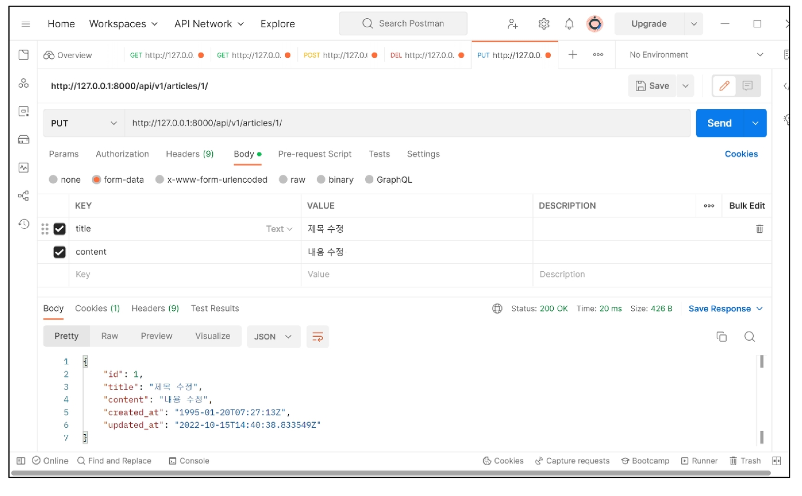

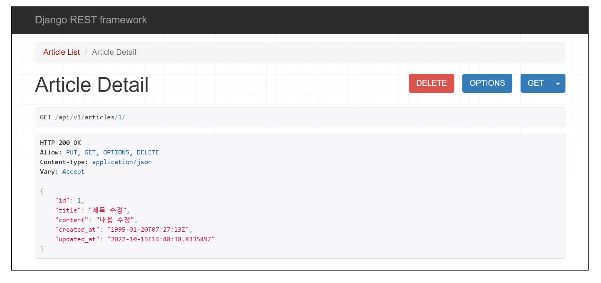

```json
{
    "id": 20,
    "title": "제목 수정",
    "content": "내용 수정",
    "created_at": "1985-07-15T19:48:48Z",
    "updated_at": "2022-10-17T06:44:15.460277Z"
}
```

### Django REST framework - N: 1 Relation

#### 개요

N:1 관계에서의 모델 data를 Serialization하여 JSON으로 변환하는 방법 학습

#### 사전 준비

Comment 모델 주석 해제 및 데이터베이스 초기화

```python
class Comment(models.Model):
    article = models.ForeignKey(Article, on_delete=models.CASCADE)
    content = models.TextField()
    created_at = models.DateTimeField(auto_now_add=True)
    updated_at = models.DateTimeField(auto_now=True)
```

Migration 진행

데이터 가져오기

```bash
$ python manage.py loaddata articles.json comments.json
```

#### GET - List

댓글 데이터 목록 조회하기

Article List와 비교하며 작성해보기

serializers.py

models에서 Comment 가져와주고

댓글은 두개 나눌필요없이 시리얼라이즈 하나 만들어줌

```python
from .models import Article, Comment


class CommentSerializer(serializers.ModelSerializer):

    class Meta:
        model = Comment
        fields = '__all__'
```

urls.py

```python
    path('comments/', views.comment_list),
```

추가

```python
from django.urls import path
from . import views


urlpatterns = [
    path('articles/', views.article_list),
    path('articles/<int:article_pk>/', views.article_detail),
    path('comments/', views.comment_list),
]

```

views.py

Comment랑 CommentSerializer 임포트

 ```python
 from .serializers import CommentSerializer
 from .models import Comment
 ```

게시글이랑 비슷하게

```python
@api_view(['GET'])
def comment_list(request):
    if request.method == 'GET':
        comments = Comment.objects.all()
        serializer = CommentSerializer(comments, many=True)
        return Response(serializer.data)
```

포스트맨에 GET으로 `http://127.0.0.1:8000/api/v1/comments/` 보내봄

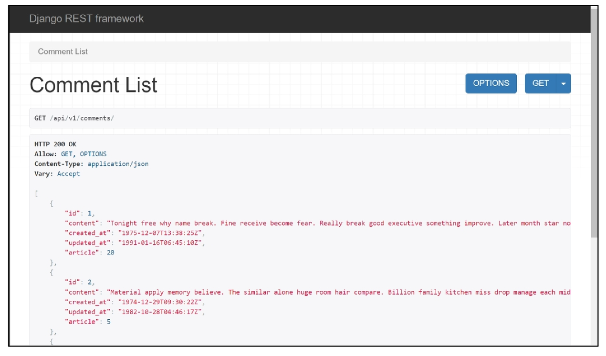

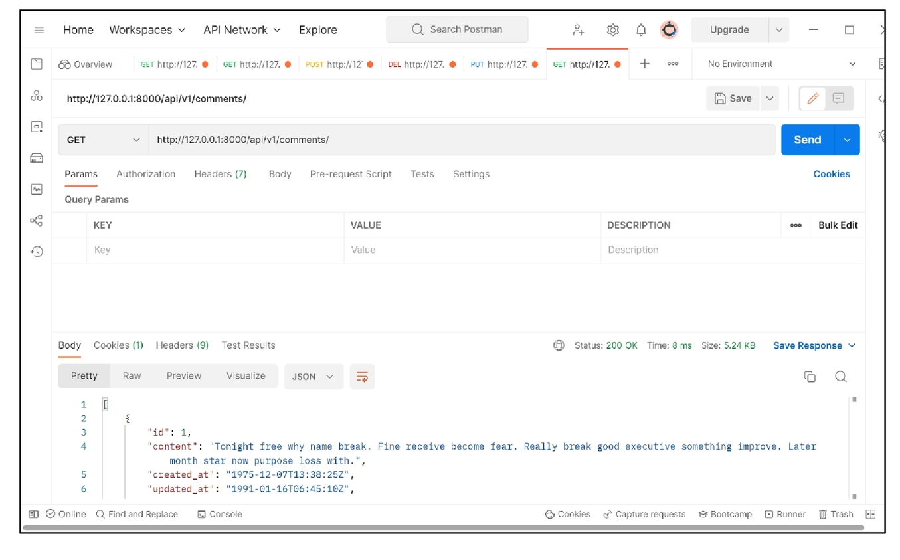

#### GET - Detail

urls.py

comment_pk 받아오는 url 하나 더 만듬

``` python
    path('comments/<int:comment_pk>/', views.comment_detail),
```

```python
from django.urls import path
from . import views


urlpatterns = [
    path('articles/', views.article_list),
    path('articles/<int:article_pk>/', views.article_detail),
    path('comments/', views.comment_list),
    path('comments/<int:comment_pk>/', views.comment_detail),
]

```

views.py

위에 디테일 조회랑 비슷하게

```python
@api_view(['GET'])
def comment_detail(request, comment_pk):
    comment = Comment.objects.get(pk=comment_pk)

    if request.method == 'GET':
        serializer = CommentSerializer(comment)
        return Response(serializer.data)
```

포스트맨에

`http://127.0.0.1:8000/api/v1/comments/1/`

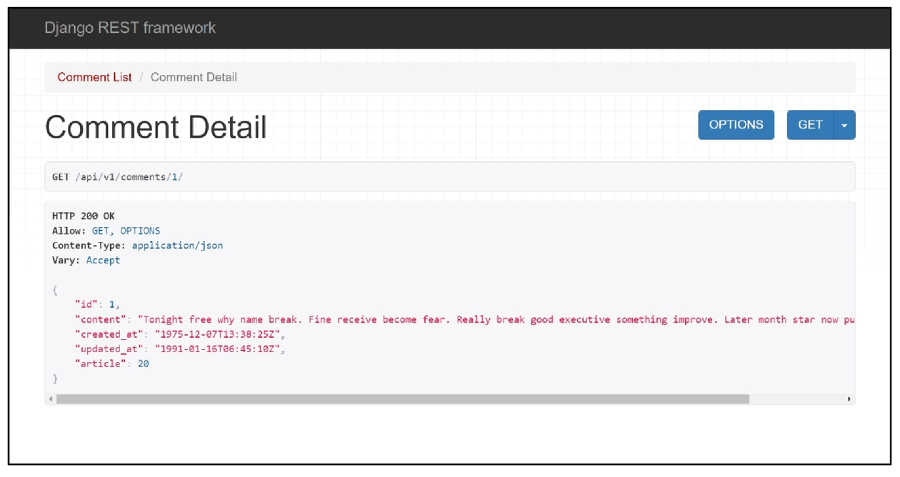

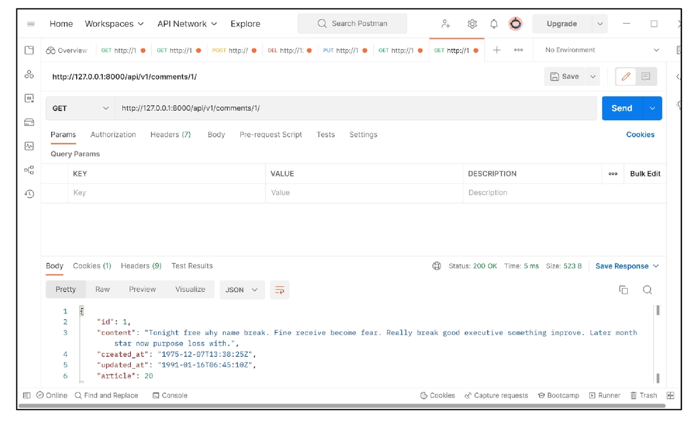

200 OK 뜨고

```json
{
    "id": 1,
    "content": "Tonight free why name break. Fine receive become fear. Really break good executive something improve. Later month star now purpose loss with.",
    "created_at": "1975-12-07T13:38:25Z",
    "updated_at": "1991-01-16T06:45:10Z",
    "article": 20
}
```

이거 나옴

#### POST

단일 댓글 데이터 생성하기

article_pk가 필요함 url 하나 더 만듦

article_detail에 넣기에는 역할이 다름

urls.py

```python
    path('articles/<int:article_pk>/comments/', views.comment_create),
```

추가

최종

```python
from django.urls import path
from . import views


urlpatterns = [
    path('articles/', views.article_list),
    path('articles/<int:article_pk>/', views.article_detail),
    path('comments/', views.comment_list),
    path('comments/<int:comment_pk>/', views.comment_detail),
    path('articles/<int:article_pk>/comments/', views.comment_create),
]
```

views.py

```python
def comment_create(request, article_pk):
    article = Article.objects.get(pk=article_pk)
    serializer = CommentSerializer(data=request.data)
    if serializer.is_valid(raise_exception=True):
        serializer.save()
        return Response(serializer.data, status=status.HTTP_201_CREATED)
```

serializer가 CommentSerializer인것 빼고 아티클 포스트랑 비슷하게

이렇게 하면 끝이 아닌게 댓글은 외래키가 필요함

form때는 commit=False씀 여기는 다르게 save에다가 외래키를 바로 넣음

##### Passing Additional attributes to .save()

save() 메서드는 특정 Serializer 인스턴스를 저장하는 과정에서 추가적인 데이터를 받을 수 있음

CommentSerializer를 통해 Serialize되는 과정에서 Parameter로 넘어온 article_pk에 해당하는 article 객체를 추가적인 데이터를 넘겨 저장 

```python
        serializer.save(article=article)
```

최종

```python
@api_view(['POST'])
def comment_create(request, article_pk):
    article = Article.objects.get(pk=article_pk)
    serializer = CommentSerializer(data=request.data)
    if serializer.is_valid(raise_exception=True):
        serializer.save(article=article)
        return Response(serializer.data, status=status.HTTP_201_CREATED)
```

모델폼과 다른점

1. data=request.data 이렇게 넣는것
2. commit=False하고 넣는거 대신 그냥 바로 save(안에) 넣어버림

포스트맨에 POST로 하고 `http://127.0.0.1:8000/api/v1/articles/1/comments/`

하면 1번 게시글에 댓글 쓴다는 뜻

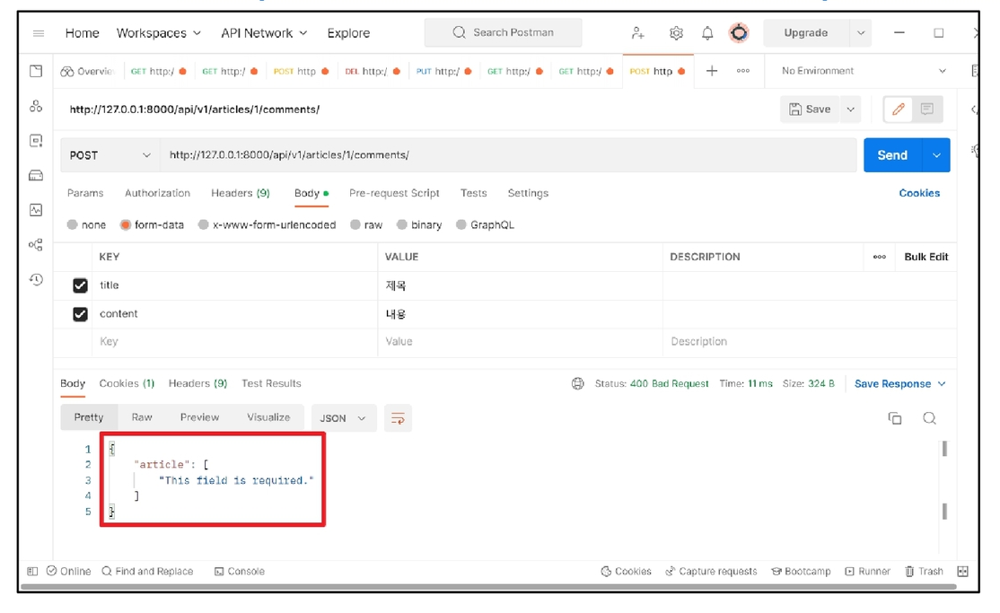

400Bad request 뜨고

```json
{
    "article": [
        "This field is required."
    ]
}
```

뜸

is_valid 이후에 article이 들어가버리기 때문 유효성 검사 하는 당시에는 안들어가있음

읽기 전용필드로 바꿔줘야함

쓰기할 때는 데이터 유효성 검사에서 뺴고 출력에는 포함되게

##### 읽기 전용 필드 설정

read_only_fields를 사용해 외래 키 필드를 '읽기 전용 필드'로 설정

읽기 전용 필드는 데이터를 전송하는 시점에 '해당 필드를 유효성 검사에서 제외시키고 데이터 조회 시에는 출력하도록 함

serealizers.py

```python
        read_only_fields = ('article',)
```

추가

```python
from rest_framework import serializers
from .models import Article, Comment

...

class CommentSerializer(serializers.ModelSerializer):

    class Meta:
        model = Comment
        fields = '__all__'
        read_only_fields = ('article',)
```

 이렇게 해주면 

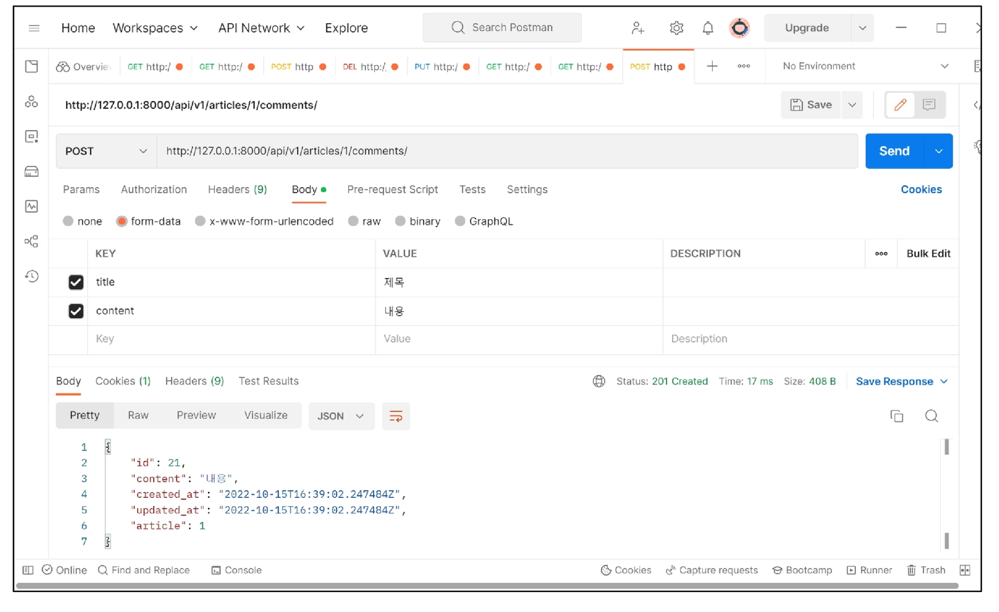

```json
{
    "id": 21,
    "content": "댓글 작",
    "created_at": "2022-10-17T07:34:38.987874Z",
    "updated_at": "2022-10-17T07:34:38.987874Z",
    "article": 2
}
```

이렇게 201 Created 나옴

#### DELETE & PUT

한번에 가능

댓글 데이터 삭제 및 수정 구현하기

comment detail에 두개 추가하는데 아까 게시글 수정 삭제 그대로 비슷하게 쓰면됨

api view 두개 추가하고

```python
@api_view(['GET', 'DELETE', 'PUT'])
```

두개 추가

```python
    elif request.method == 'DELETE':
        comment.delete()
        return Response(status=status.HTTP_204_NO_CONTENT)

    elif request.method == 'PUT':
        serializer = CommentSerializer(comment, data=request.data)
        if serializer.is_valid(raise_exception=True):
            serializer.save()
            return Response(serializer.data)
```

최종

```python
@api_view(['GET', 'DELETE', 'PUT'])
def comment_detail(request, comment_pk):
    comment = Comment.objects.get(pk=comment_pk)

    if request.method == 'GET':
        serializer = CommentSerializer(comment)
        return Response(serializer.data)

    elif request.method == 'DELETE':
        comment.delete()
        return Response(status=status.HTTP_204_NO_CONTENT)

    elif request.method == 'PUT':
        serializer = CommentSerializer(comment, data=request.data)
        if serializer.is_valid(raise_exception=True):
            serializer.save()
            return Response(serializer.data)
```

drf가이드에 elif로 하라고 함 그래서 else 안쓴다

포스트맨에 둘다 테스트

DELETE

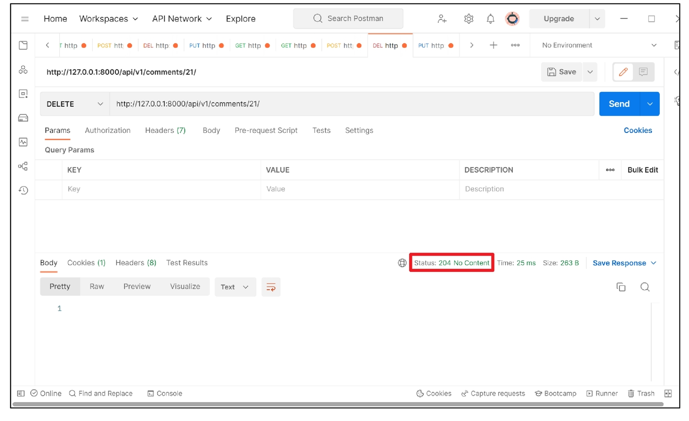

PUT으로 `http://127.0.0.1:8000/api/v1/comments/1/`하고

body에 form-data 바꾸면 수정

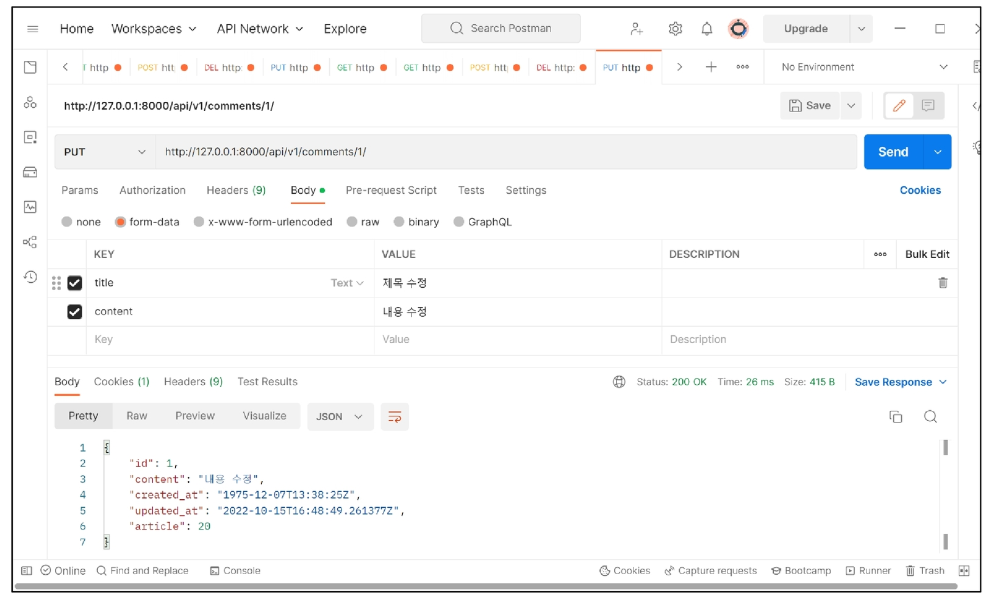


#### N: 1 - 역참조 데이터 조회

개요

1. 특정 게시글에 작성된 댓글 목록 출력하기
   - 기존 필드 override
2. 특정 게시글에 작성된 댓글의 개수 출력하기
   - 새로운 필드 추가

N:1에서 1쪽에는 원래 컬럼이 없어서 역참조 해야함

##### 특정 게시글에 작성된 댓글 목록 출력하기

기존 필드 override - Article Detail

"게시글 조회 시 해당 게시글의 댓글 목록까지 함께 출력하기"

Serializer는 기존 필드를 override 하거나 추가적인 필드를 구성할 수 있음

###### PrimaryKeyRelatedField()

역함수 comment_set을 그대로 써서 기존 override

serializers.py

ArticleSerializer 클래스에

```python
	commant_set = serializers.PrimaryKeyRelatedField(many=True, read_only=True)
```

추가

many=True는 쿼리셋일때, 1대 N에서 N을 참조해야 하기 때문

read_only는 유효성 검사에서 빠지는 읽기 전용

```python
class ArticleSerializer(serializers.ModelSerializer):
    comment_set = serializers.PrimaryKeyRelatedField(many=True, read_only=True)

    class Meta:
        model = Article
        fields = '__all__'
```


이렇게 하고 GET으로 게시글 읽으면 `http://127.0.0.1:8000/api/v1/articles/2/`

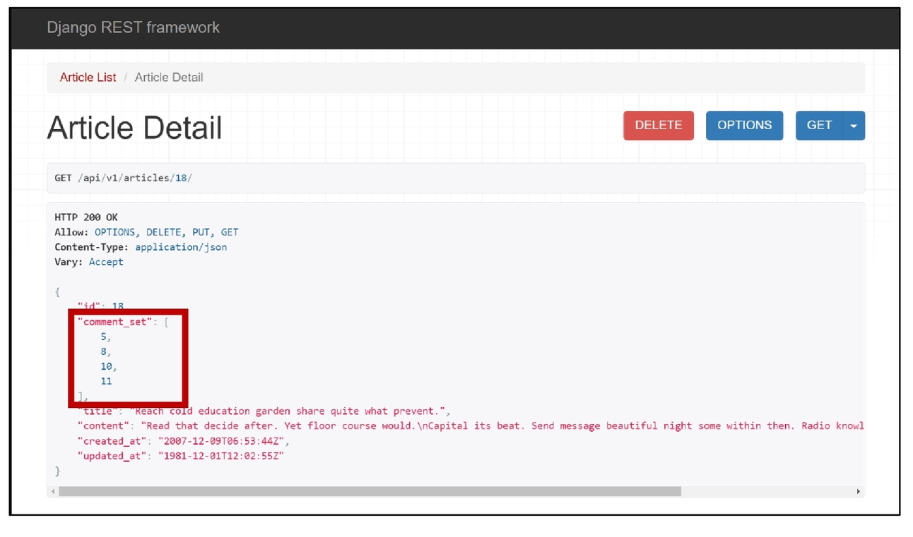

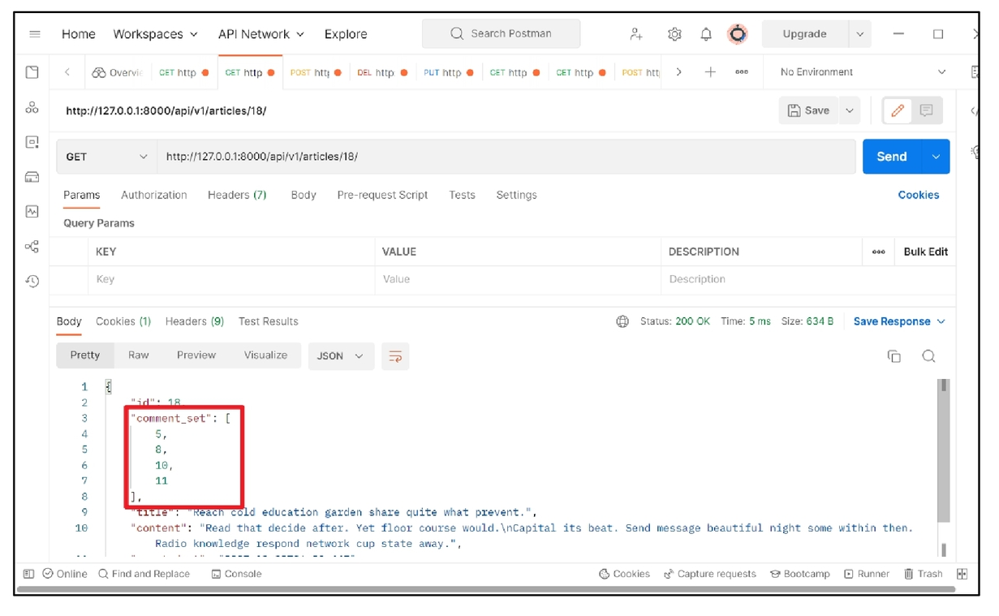

```json
{
    "id": 2,
    "comment_set": [
        14,
        21
    ],
    "title": "Sit sign share you.",
    "content": "Call authority choose discuss yes. Experience century Mrs population company couple million.\nCareer challenge response many throw. Because practice what a allow its consumer.",
    "created_at": "2013-05-29T15:46:17Z",
    "updated_at": "2001-12-09T17:38:01Z"
}
```

리스트 형태로 추가됨

comment_set 이름 바꾸려면 models.py에서 related_name를 바꿔줘야 함

###### Nested relationships

모델 관계 상으로 참조 된 대상은 참조하는 대상의 표현에 포함되거나중첩(nested)될 수 있음

이러한 중첩된 관계는 serializers를 필드로 사용하여 표현 할 수 있음

두 클래스의 상/하 위치를 변경해야 함

댓글의 세부정보까지 얻고 싶으면 Primarykey related fi로 하는게 아니라 다른방법

: 댓글 시리얼라이즈를 사용

이거 쓰려면 댓글 시리얼라이즈가 위로 가야 함 먼저

```python
    comment_set = CommentSerializer(many=True, read_only=True)
```

아까 방식은 pk 만 가져오는데 필드 전체 출력값을 그대로 전달 가능

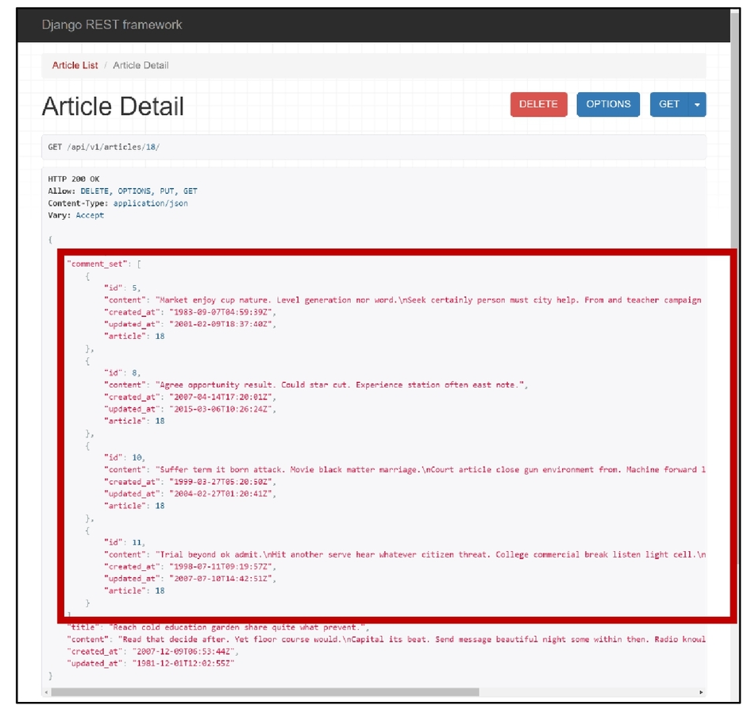

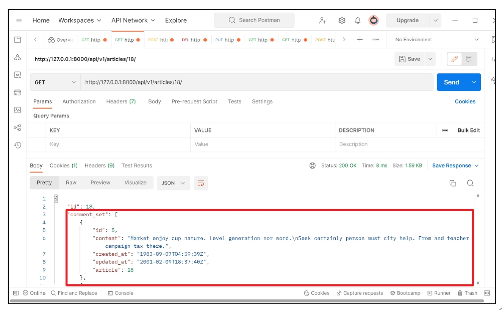

```python
{
    "id": 2,
    "comment_set": [
        {
            "id": 14,
            "content": "Nothing keep yet hotel. Worry particularly simple top. Miss page tax share.\nSpecific his particular test would. Read information option add.",
            "created_at": "2009-12-25T09:21:18Z",
            "updated_at": "2021-04-09T12:09:15Z",
            "article": 2
        },
        {
            "id": 21,
            "content": "댓글 작",
            "created_at": "2022-10-17T07:34:38.987874Z",
            "updated_at": "2022-10-17T07:34:38.987874Z",
            "article": 2
        }
    ],
    "title": "Sit sign share you.",
    "content": "Call authority choose discuss yes. Experience century Mrs population company couple million.\nCareer challenge response many throw. Because practice what a allow its consumer.",
    "created_at": "2013-05-29T15:46:17Z",
    "updated_at": "2001-12-09T17:38:01Z"
}
```

이거 필드 컨트롤 하려면 CommentSerializer를 건드려야 하는데 같이 쓰는 다른 애들이랑 다르게 하려면 아예 새로 만들어도 됨

##### 특정 게시글에 작성된 댓글의 개수 출력하기

새로운 필드 추가 - Article Detail

- 게시글 조회 시 해당 게시글의 댓글 개수까지 함께 출력하기
- 존재하지 않음 카운팅
- 새로운 필드가 필요 계산
- IntegerField가 필요

serializers.py

추가

```python
    comment_count = serializers.IntegerField(source='comment_set.count', read_only=True)
```

최종

```python
class ArticleSerializer(serializers.ModelSerializer):
    # comment_set = serializers.PrimaryKeyRelatedField(many=True, read_only=True)
    comment_set = CommentSerializer(many=True, read_only=True)
    comment_count = serializers.IntegerField(source='comment_set.count', read_only=True)

    class Meta:
        model = Article
        fields = '__all__'
```

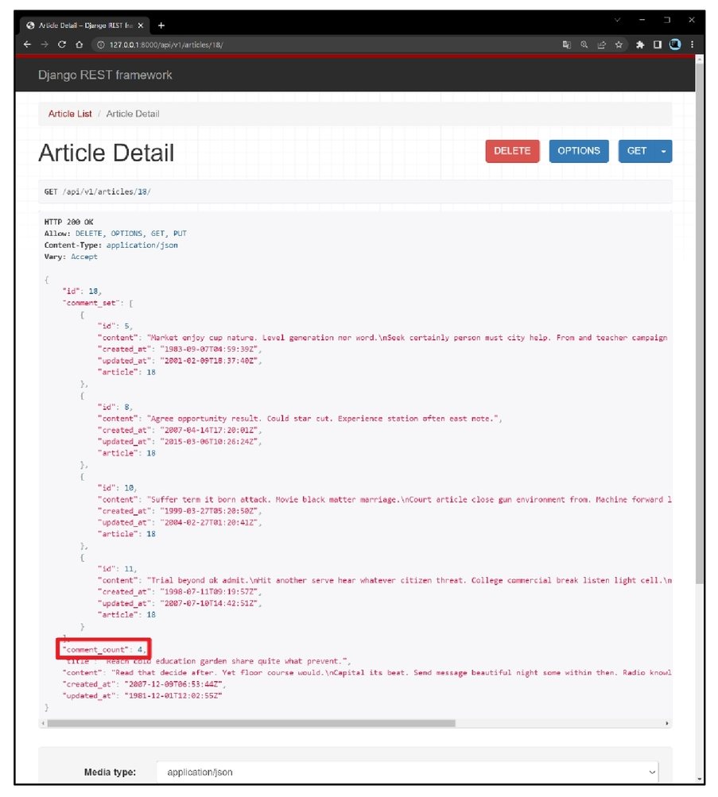

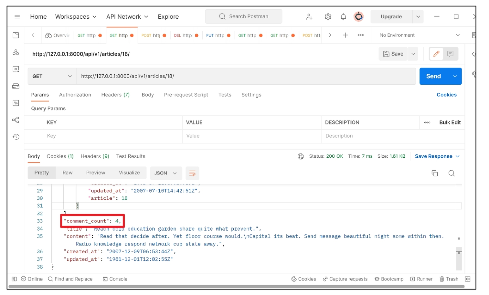

```json
{
    "id": 2,
    "comment_set": [
        {
            "id": 14,
            "content": "Nothing keep yet hotel. Worry particularly simple top. Miss page tax share.\nSpecific his particular test would. Read information option add.",
            "created_at": "2009-12-25T09:21:18Z",
            "updated_at": "2021-04-09T12:09:15Z",
            "article": 2
        },
        {
            "id": 21,
            "content": "댓글 작",
            "created_at": "2022-10-17T07:34:38.987874Z",
            "updated_at": "2022-10-17T07:34:38.987874Z",
            "article": 2
        }
    ],
    "comment_count": 2,
    "title": "Sit sign share you.",
    "content": "Call authority choose discuss yes. Experience century Mrs population company couple million.\nCareer challenge response many throw. Because practice what a allow its consumer.",
    "created_at": "2013-05-29T15:46:17Z",
    "updated_at": "2001-12-09T17:38:01Z"
}
```

​    "comment_count": 2 생겨있음

###### source

 serializers field's argument

필드를 채우는 데 사용할 속성의 이름

점 표기법(dotted notation)을 사용하여 속성을 탐색 할 수 있음

왜 읽기 전용을 할때 CommentSerializer에서는 Meta에 쓰고 지금은 함수 안에 쓰나요

###### [주의] 읽기 전용 필드 지정 이슈

특정 필드를 override 혹은 추가한 경우 read_only_fields가 동작하지 않으니 주의

기존에 있던 필드는 쓸 수 있는데 override나 추가된 애들은 별도의 read_only를 써야 함

```python
class ArticleSerializer(serializers.ModelSerializer):
    # comment_set = serializers.PrimaryKeyRelatedField(many=True, read_only=True)
    comment_set = CommentSerializer(many=True, read_only=True)
    comment_count = serializers.IntegerField(source='comment_set.count', read_only=True)

    class Meta:
        model = Article
        fields = '__all__'
        '''
        read_only_fields = ('comment_set', 'comment_count')
        '''
        # 이런식으로 불가능
```

기존에 물리적으로 존재하는 필드만 Meta에 넣을 수 있다

물리적으로 존재하는 필드만 가능하기 때문

### Django Shortcuts functions

get은 없을 때 예외 발생, 1개 넘을 때도 예외 발생

장고는 코드가 온전하게 끝나지 않으면 500 상태 코드

그래서 없는 pk 검색하거나 해서 get()에서 비어있으면 멈추고 500에러 나옴

500은 정확한게 아님 없는 것일때는 404를 해야 함

### 개요

django.shortcuts 패키지는 개발에 도움 될 수 있는 여러 함수와 클래스를 제공

제공되는 shortcuts 목록

- render(), redirect(), get_object_or_404(), get_list_or_404()
- get()을 get_object_or_404()가 대체
- all()을 get_list_or_404()가 대체
- https://docs.djangoproject.com/en/3.2/topics/http/shortcuts/

#### get_object_or_404()

모델 manager objects에서 get()을 호출하지만,해당 객체가 없을 땐 기존 DoesNotExist 예외 대신 Http404를 raise 함

```python
# articles/views.py

from django.shortcuts import get_object_or_404

article = Article.objects.get(pk=article_pk)
comment = Comment.objects.get(pk=comment_pk)

# 위 코드를 모두 다음과 같이 변경

article = get_object_or_404(Article, pk=article_pk)
comment = get_object_or_404(Comment, pk=comment_pk)
```

views.py

변경전

```python
    article = Article.objects.get(pk=article_pk)
```

```python
    comment = Comment.objects.get(pk=comment_pk)
```


변경후

```python
    article = get_object_or_404(Article, pk=article_pk)
```

```python
    comment = get_object_or_404(Comment, pk=comment_pk)
```


#### get_list_or_404()

모델 manager objects에서 filter()의 결과를 반환하고해당 객체 목록이 없을 땐 Http404를 raise 함

```python
# articles/views.py

from django.shortcuts import get_object_or_404, get_list_or_404

articles = Article.objects.all()
comments = Comment.objects.all()

#위 코드를 모두 다음과 같이 변경

articles = get_list_or_404(Article)
comments = get_list_or_404(Comment)
```

#### 적용 전/후 비교

존재하지 않는 게시글 조회 시

이전에는 500 상태코드를 응답했지만 현재는 404 상태코드를 응답

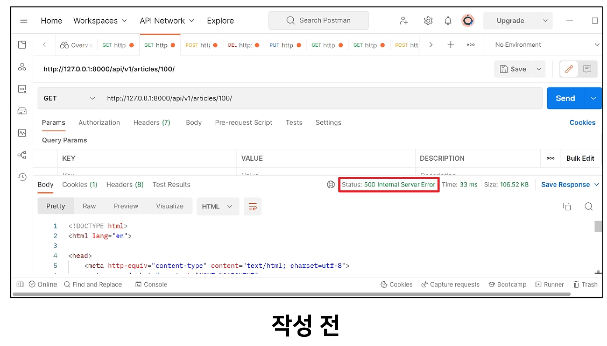

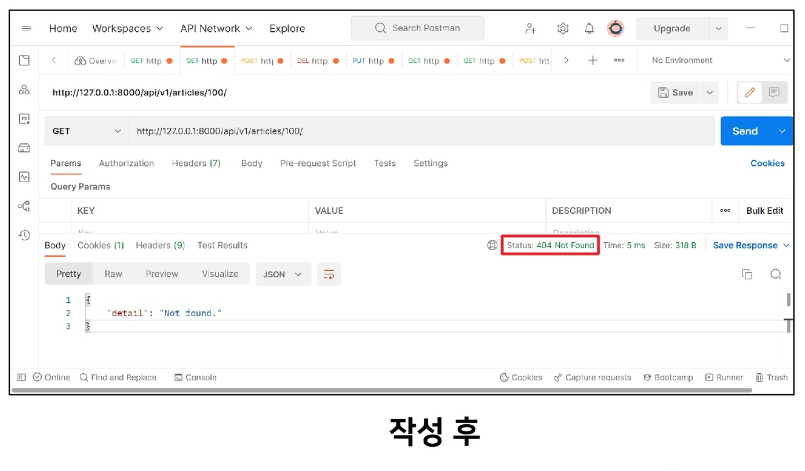

#### 왜 사용해야 할까?

클라이언트 입장에서 “서버에 오류가 발생하여 요청을 수행할 수 없다(500)"라는 원인이 정확하지 않은 에러를 마주하기 보다는, 서버가 적절한 예외 처리를 하고 클라이언트에게 올바른 에러를 전달하는 것 또한 중요한 요소

## 마무리

### 마무리 INDEX

REST API

Response JSON

Django REST framework - Single Model

Django REST framework - N:1 Relation