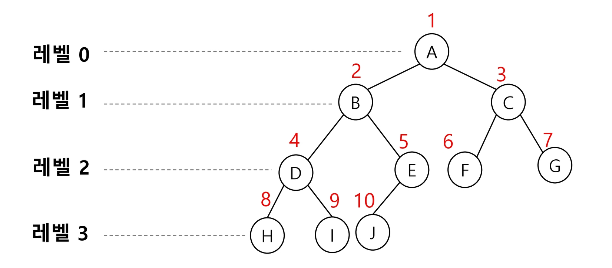

# 알고리즘

## 트리

비선형 구조

원소들 간에 1:n 관계를 가지는 자료 구조

원소들 간에 계층관계를 가지는 계층형 자료구조

상위 원소에서 하위 원소로 내려가면서 확장되는 트리(나무)모양의 구조

### 정의

한 개 이상의 노드로 이루어진 유한 집합이며 다음 조건을 만족한다. 

- 노드 중 최상위 노드를 루트(root)라 한다.
- 나머지 노드들은 n(>= 0)개의 분리 집합 T1....TN으로 분리될 수 있다.

이들 T1, ... , TN은 각각 하나의 트리가 되며(재귀적 정의) 루트의 부 트리 (subtree)라 한다.

- 일부를 잘라내도 트리의 조건을 충족함

### 용어정리


 노드(node) - 트리의 원소

- 트리 T의 노드 - A, B, C, D, E, F, G, H, I, J. K 

간선(Edge) - 노드를 연결하는 선. 부모 노드와 자식 노드를 연결

- 계층적 구조라서 부모와 자식이란 표현

루트 노드(root node) - 트리의 시작 노드

- 트리 T의 루트노드 - A

- 상황을 적용해보니 트리가 되네?

형제 노드(sibling node) - 같은 부모 노드의 자식 노드들 

- BCD는 형제 노드

조상 노드 - 간선을 따라 루트 노드까지 이르는 경로에 있는 모든 노드들

- K의 조상 노드 : F, B, A
- 공통 조상 - 겹치는 조상

서브 트리(subtree) - 부모 노드와 연결된 간선을 끊었을 때 생성되는 트리

자손 노드 - 서브 트리에 있는 하위 레벨의 노드들

- B의 자손 노드 - EFK

차수(degree)

- 노드의 차수 : 노드에 연결된 자식 노드의 수.
  - B의 차수=2, C의 차수=1
- 트리의 차수 : 트리에 있는 노드의 차수 중에서 가장 큰 값
  - 트리 T의 차수=3
- 단말 노드(리프 노드) : 차수가 0인 노드, 자식 노드가 없는 노드

높이

- 노드의 높이 : 루트에서 노드에 이르는 간선의 수. 노드의 레벨
  - B의 높이=1, F의 높이=2
  - 교재마다 다르긴 한데 상대적이다
- 트리의 높이 : 트리에 있는 노드의 높이 중에서 가장 큰 값. 최대 레벨
  - 트리 T의 높이=3


### 이진트리

모든 노드들이 2개의 서브트리를 갖는 특별한 형태의 트리

각 노드가 자식 노드를 최대한 2개 까지만 가질 수 있는 트리

- 왼쪽 자식 노드(left child node)
- 오른쪽 자식 노드(right child node)

이진 트리의 예


#### 특성

레벨 1에서의 노드의 최대 개수는 2^i개

높이가 h인 이진 트리가 가질 수 있는 노드의 최소 개수는 (h+1)개가 되며, 최대 개수는 (2h+1-1)개가 된다.

#### 종류

##### 포화 이진 트리(Full Binary Tree)

모든 레벨에 노드가 포화상태로 차 있는 이진 트

높이가 h일 때, 최대의 노드 개수인 (2^(h+1)-1) 의 노드를 가진 이진 트리

높이 3일 때 2^(3+1)-1 = 15개의 노드

루트를 1번으로 하여 2^(h+1)-1까지 정해진 위치에 대한 노드 번호를 가짐

- 아래로, 좌->우


##### 완전 이진 트리(Complete Binary Tree)

높이가 h이고 노드 수가 n개일 때 (단, h+1 < n < 2^(h+1)-1), 포화 이진 트리의 노드 번호 1번부터 n번까지 빈 자리가 없는 이진 트리

예) 노드가 10개인 완전 이진 트리

번호 붙이는 방식은 똑같음

n까지 갈때 중간에 빠지면 안됨


##### 편향 이진 트리(Skewed Binary Tree)

높이 h에 대한 최소 개수의 노드를 가지면서 한쪽 방향의 자식 노드만을 가진 이진 트리 

- 왼쪽 편향 이진 트리
- 오른쪽 편향 이진 트리

트리를 하는 이유인 효율이 떨어지는 구조


#### 순회

순회(traversal)란 트리의 각 노드를 중복되지 않게 전부 방문(Misit) 하는 것을 말하는데 트리는 비선형 구조이기 때문에 선형구조에서와 같이 선후 연결 관계를 알 수 없다.

따라서 특별한 방법이 필요하다.

순회(traversal): 트리의 노드들을 체계적으로 방문하는 것 

3가지의 기본적인 순회방법

- 전위순회(preorder traversal) : VLR 
  - 부모노드 방문 후, 자식노드를 좌우 순서로 방문한다. 
  - 부모가 양 자식 어깨를 얹고 코로나 검사 받으러 감
  - 부모님 먼저 검사

- 중위순회(inorder traversal) : LVR 
  - 왼쪽 자식노드, 부모노드, 오른쪽 자식노드 순으로 방문한다. 
- 후위순회(postorder traversal) : LRV 
  - 자식노드를 좌우 순서로 방문한 후, 부모노드로 방문한다.


##### 전위 순회(preorder traversal)

###### 수행 방법 

1. 현재 노드 n을 방문하여 처리한다. -> V
2. 현재 노드 n의 왼쪽 서브트리로 이동한다. -> L 
3. 현재 노드 n의 오른쪽 서브트리로 이동한다. -> R 

###### 알고리즘

```pseudocode
def preorder_traverse(T) : # 전위순회
	if T: # T is not None 
		visit(T) # print(T.item) 
		preorder_traverse(T.left) 
		preorder_traverse(T.right)
```

###### 예 

순서 1 : T0 → T1 → T2 

순서2 : A → B D (T3) → C F G 

총 순서 : A B D E H I C F G

##### 중위 순회(inorder traversal)

###### 수행 방법 

1. 현재 노드 n의 왼쪽 서브트리로 이동한다. : L
   - 처리하지 않고 먼저 이동
   - 이동 더 못하면 그때 처리하고 리턴
2. 현재 노드 n을 방문하여 처리한다. : V
3. 현재 노드 n의 오른쪽 서브트리로 이동한다. : R 
   - 오른쪽에서 리턴하면 한번더 이전단계로

###### 알고리즘 

```pseudocode
def inorder_traverse(T) :        # 중위순회 
	if T :                       # T is not None 
		inorder_traverse(T.left) 
		visit(T)                 # 다시 리턴하면서 print(T.item) 
		inorder_traverse(T.right)
```

######  예


순서1 : T1 → T0 → T2 

순서2 : D B (T3) → A → F C G

총 순서 : D B H E I A F C G

##### 후위 순회(postorder traversal) 

###### 수행 방법 

1. 현재 노드 n의 왼쪽 서브트리로 이동한다. : L
2. 현재 노드 n의 오른쪽 서브트리로 이동한다. : R
   - 오른쪽에서 리턴할때 처리
3. 현재 노드 n을 방문하여 처리한다. : V 

###### 알고리즘 

```pseudocode
def postorder_traverse(T) :           # 후위순회 
	if T : 
		postorder_traverse(T.left)    # T is not None 
		postorder_traverse(T.right) 
		visit(T)                      # print(T.item)
```

###### 예

순서1 : T1 → T2 → T0 

순서2 : D (T3) B → F G C → A 

총 순서 : D H I E B F G C A

##### 연습 문제


전위 순회는? 

- A B D H I E J C F K G L M?

- 서브 트리 순환 물어볼 수도
  - B D H I E J 하고 끝 

중위 순회는?

- H D I B J E A F K C L G M

후위 순회는?

- H I D J E B A K F L M G C

#### 표현

##### 배열을 이용한 이진 트리의 표현

포화이진트리와 완전이진트리의 저장방법

이진 트리에 각 노드 번호를 다음과 같이 부여

루트의 번호를 1로 함 

레벨 n에 있는 노드에 대하여 왼쪽부터 오른쪽으로 2 부터 2^(n+1) - 1 까지 번호를 차례로 부여



###### 노드 번호의 성질

노드 번호가 i인 노드의 부모 노드 번호?  `└i/2┘`

- └ ┘플로어 연산 작은 정수 중 가장 큰 값 `i//2`
- 조상은? `//2` 반복

노드 번호가 i인 노드의 왼쪽 자식 노드 번호? `2*i`

노드 번호가 i인 노드의 오른쪽 자식 노드 번호? `2*i+1 `

레벨 n의 노드 번호 시작 번호는? `2^n`


```pseudocode
preorder(n)
	if n <= size:  # 사이즈 이내의 정수면 존재하니까 순회하고, 14같은거 처리 안해야하니까
		visit(n)
		preorder(n*2)
		preorder(n*2+1)
```

완전이진트리나 포화이진트리의 경우에만 가능 그 번호 붙이는 방식일 때만

노드 번호를 배열의 인덱스로 사용

###### 배열의 크기

높이가 h인 이진 트리를 위한 배열의 크기는? 

- 레벨의 최대 노드 수는? 2^i
- 따라서 1 + 2 + 4 + 8 ... + 2^i = Σ2 = 2^(h+1)-1


포화나 완전이 아닌데도 이런식으로 번호를 붙이면 낭비가 심하다


###### 단점

편향 이진 트리의 경우에 사용하지 않는 배열 원소에 대한 메모리 공간 낭비 발생

트리의 중간에 새로운 노드를 삽입하거나 기존의 노드를 삭제할 경우 배열의 크기 변경 어려워 비효율적

문제 풀이에선 신경 안써도 된다

##### [참고] 이진 트리의 저장

완전, 포화가 아닐때는 어떻게 저장할 것인가

###### 부모 번호를 인덱스로 자식 번호를 저장 

트리에서는 간선수 + 1 = 정점수

```pseudocode
4 <- 간선의 개수 N

1 2 1 3 3 4 3 5 <- 부모 자식 순
```


```pseudocode
for i : 1 -> N
	read p, c
	if (ci[p] == 0)  # 1번 자식이 비어있으면
    	c1[p] = c    # 1번에 써
    else
    	c2[p] = c    # 아니면 2번에
```

###### 자식 번호를 인덱스로 부모 번호를 저장


```pseudocode
for i : 1 -> N
	read p, c
	par[c] = p
```

순회를 할때는 부모에서 자식으로 가야 하니 : 부모를 인덱스로 자식번호 저장

조상이나 루트 찾을 때는 : 자식 번호를 인덱스로 부모 번호 저장

###### 루트 찾기, 조상 찾기

ex) 5번 노드의 조상 찾기 


```pseudocode
c = 5
while( a[c] != 0 ) # 루트인지 확인, 부모가 있는지 확인
	c = a[c]       # 부모를 자식으로 옮김
	anc.append(c)  # 조상 목록 
root = c
```

##### 연결리스트

배열을 이용한 이진 트리의 표현의 단점을 보완하기 위해 연결리스트를 이용하여 트리를 표현할 수 있다. 이 연결 자료구조를 이용한 이진트리의 표현 

- 이진 트리의 모든 노드는 최대 2개의 자식 노드를 가지므로 일정한 구조의 단순 연결 리스트 노드를 사용하여 구현


###### 완전 이진 트리의 연결 리스트 표현


#### 수식트리

수식을 표현하는 이진 트리

수식 이진 트리(Expression Binary Tree)라고 부르기도 함.

연산자는 루트 노드이거나 가지 노드(루트 리프 가운데 있는 것)

피연산자는 모두 잎 노드


##### 순회 

중위 순회 : A / B* C * D + E (식의 중위 표기법, 기존에 쓰는 방식)

후위 순회 : A B / C * D * E + (식의 후위 표기법)

전위 순회 : + * * / A B C D E (식의 전위 표기법)


#### 이진 탐색 트리

탐색작업을 효율적으로 하기 위한 자료구조

모든 원소는 서로 다른 유일한 키를 갖는다.

key(왼쪽 서브트리)<key(루트 노드)<key(오른쪽 서브트리)

왼쪽 서브트리와 오른쪽 서브트리도 이진 탐색 트리다.

중위 순회하면 오름차순으로 정렬된 값을 얻을 수 있다.

추가할 때 번거로운 작업 줄일 수 있다


##### 탐색연산

루트에서 시작한다.

탐색할 키 값 x를 루트 노드의 키 값과 비교한다.

- (키 값 x = 루트노드의 키 값)인 경우 : 원하는 원소를 찾았으므로 탐색연산 성공 
- (키 값 x < 루트노드의 키 값)인 경우 : 루트노드의 왼쪽 서브트리에 대해서 탐색연산 수행
- (키 값 x > 루트노드의 키 값)인 경우 : 루트노드의 오른쪽 서브트리에 대해서 탐색연산 수행 

서브트리에 대해서 순환적으로 탐색 연산을 반복한다.

순회와의 차이 : 탐색연산은 재귀일 필요 없음, 리턴 안해도됨


루트값을 잘 구해야 한다

13 탐색


##### 연산

###### 삽입 연산

1. 먼저 탐색 연산을 수행 
   - 삽입할 원소와 같은 원소가 트리에 있으면 삽입할 수 없으므로, 같은 원소가 트리에 있는지 탐색하여 확인한다. 
   - 탐색에서 탐색 실패가 결정되는 위치가 삽입 위치가 된다.
2. 탐색 실패한 위치에 원소를 삽입한다. 

다음 예는 5을 삽입하는 예이다.


##### 성능

탐색(searching), 삽입 (insertion), 삭제(deletion) 시간은 트리의 높이 만큼 시간이 걸린다

- O(h)h : BST의 깊이(height) 

평균의 경우 

- 이진 트리가 균형적으로 생성되어 있는 경우 
- O(logn) 

최악의 경우 

- 한쪽으로 치우친 경사 이진트리의 경우

- O(n) 

- 순차탐색과 시간복잡도가 같다.

###### 검색 알고리즘의 비교 

배열에서의 순차 검색 : O(N) 

정렬된 배열에서의 순차 검색 : O(N)

정렬된 배열에서의 이진탐색 : O(logN) 

- 고정 배열 크기와 삽입, 삭제 시 추가 연산 필요

이진 탐색트리에서의 평균 : O(logN)) 

- 최악의 경우 : O(N) -
- 완전 이진 트리 또는 균형트리로 바꿀 수 있다면 최악의 경우를 없앨 수 있다. 
  - 새로운 원소를 삽입할 때 삽입 시간을 줄인다. •
  - 평균과 최악의 시간이 같다. O(logn)

해쉬 검색 : O(1) 

- 추가 저장 공간이 필요 

상용에서 검색을 위해 어떤 알고리즘을 사용할까?

##### 연산 연습

###### 삭제 연산

삭제연산에 대해 알고리즘을 생각해 봅시다. 

다음 트리에 대하여 13, 12, 9를 차례로 삭제해 보자


13까지 탐색해서 지우면 됨

12는 15에 대한 레퍼런스를 9에 복사

9를 남기면 복잡해짐 그래서 6을 날리고 9 자리에 6 넣어야 함

#### [참고] 힙(heap)

완전 이진 트리에 있는 노드 중에서 키값이 가장 큰 노드나 키값이 가장 작은 노드를 찾기 위해서 만든 자료구조

최대 힙(max heap)

- 키값이 가장 큰 노드를 찾기 위한 완전 이진 트리 
- {부모노드의 키값 > 자식노드의 키값}
- 루트 노드 : 키값이 가장 큰 노드

최소 힙(min heap) 

- 키값이 가장 작은 노드를 찾기 위한 완전 이진 트리 
- {부모노드의 키값 < 자식노드의 키값}
- 루트 노드 : 키값이 가장 작은 노드

##### 힙의 예


##### 힙이 아닌 이진 트리의 예

아닌 이유를 설명해 보세요.


트리1 : 완전 이진 트리가 아님, 5가 겹치고 중간에 빠짐

트리2: 크기 조건을 만족하지 않음

##### 연산 - 삽입

최대힙

###### 17 삽입


조건

1. 완전 이진 트리 유지
   - last += 1

2. 부모 > 자식
   - c = last
   - p = c//2

###### 23 삽입


부모가 더 작은 상황 -> 자리바꾸기

조건

1. 완전 이진 트리 유지
   - last += 1

2. 부모 > 자식
   - c = last
   - p = c//2
   - 조건을 만족하지 않으면 부모가 없거나 부모>자식일 때까지 자리 바꿈

##### 힙 연산 - 삭제

힙에서는 루트 노드의 원소만을 삭제 할 수 있다.

루트 노드의 원소를 삭제하여 반환한다. 

힙의 종류에 따라 최대값 또는 최소값을 구할 수 있다.

1. 완전이진트리
2. 최대 힙 / 최소 힙


1) 삭제해서 일단 보관
2) 마지막 노드를 루트에 두고 last -= 1
3) 루트의 자식을 확인
   - 자식이 하나만 있으면 그거랑만 비교
   - 둘다 있으면 둘 중 더 큰거랑 비교
   - 부모>자식이 될때까지
     - 자식이 있고 부모<자식일 경우 교환

##### 힙을 이용한 우선순위 큐

힙(Heap) 

완전 이진 트리로 구현된 자료구조로서,  키값이 가장 큰 노드나 가장 작은 노드를 찾기에 용이한 자료구조 

아래의 예는 최소 힙(Min heap)으로서, 가장 작은 키값을 가진 노드가 항상 루트에 위치한다. 


힙의 키를 우선순위로 활용하여 우선순위 큐를 구현할 수 있다. 

