# Computational Thinking

## 서론 - 프로그래밍과 논리/수학

### 프로그래밍의 어려운 점 두 가지

- 프로그래밍 언어 문법과 라이브러리 사용 
- 논리 (Hard Logic)

#### 문법과 라이브러리 

- 많이 알려진 어려운 점 
- 위 프로그램이 무엇을 하는 것인지 처음 보는 사람은 알 수 없음

```java
#include <iostream>
#include <set>
#include <functional>
using namespace std;

int main(){
    
    set(int) s:
   
    pair<set(int)::iterator, bool> pr:
    pr = s.insert(50); // returns result pair
    s.insert(40); 
    s.insert(80);

    if (true == pr.second)
        cout << *pr.first << "Success!" << endl; else
		cout << *pr.first << " Failure! " << endl;
......
```

#### 논리 (Hard Logic) 

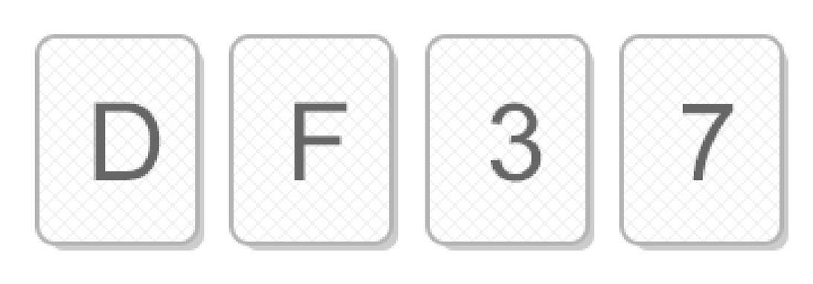

Hard vs. Soft Logic 

##### 카드 문제 

사실: 모든 카드의 한쪽에는 알파벳이, 다른 쪽에는 숫자가 써 있음

주장: 만약 한쪽이 D면 반대쪽은 3

- 사실인지 확인하기 위해 다음 카드들 중 반드시 뒤집어 보아야 하는 것은 몇 개이고 어느 것인가

정답 D와 7

##### 맥주집 문제 


규칙: 20세 이하인 사람은 맥주를 마실 수 없음 

나이 혹은 마시고 있는 것을 표시한 다음 4명 중 확인이 필요한 사람은 몇 명이고 누구인가?

정답 17세와 맥주

똑같은 논리

##### 카드 문제와 맥주집 문제의 비교 

맥주집 문제가 훨씬 풀기 쉽다. 

사실, 두 문제는 완전히 같은 문제임. 즉, 논리적 구성은 완전히 동일함

왜 맥주집 문제가 풀기 쉬운가? 

논리 구조를 정확히 이해하고 맥주집 문제를 푸는 사람은 카드 문제를 똑같이 풀 수 있음 

즉, 맥주집 문제를 풀 때 논리를 사용한 것이 아니다!

##### Hard vs. Soft Logic 

맥주집 문제를 풀 때는 직관을 사용한 것 

직관은 논리적인 느낌을 주는 것 

직관의 장점은 (익숙한 상황에서) 빠르다는 것 

직관의 단점은 정확하지 않다는 것 (가끔은 익숙한 상황에서도 틀림) 

또 다른 단점은 강한 착각을 일으킨다는 것

##### 과자와 버스 

“너 과자 몇 개 먹었니?" vs. “버스 타려고 하는데 천원 있니?” 

두 질문은 같은 표현을 사용하지만, 하나는 정확한 개수를 요구하고, 다른 하나 는 천원 이상이 있는지 물어보는 것

##### 토플과 복권 

“합격하려면 토플 500점 이상 혹은 토익 600점 이상이 필요” vs. “복권에 당첨되 면 자동차 혹은 천만원을 줍니다”

두 말은 같은 표현을 사용하지만 하나는 inclusive or, 다른 하나는 exclusive or

##### 일상생활 vs 프로그래밍 

일상 생활에서는 

- Soft Logic이 빠르기 때문에 유용 
- 논리적으로 부정확한 표현을 사용하지만, 어떤 의미인지 모든 사람이 이미 알 고 있다는 가정이 존재 

프로그래밍은 Hard Logic을 사용

- 프로그래밍 언어의 표현들이 모두 논리학에서 나온 것
- 사용되는 수많은 알고리즘들을 이해하기 위해서는 Hard Logic이 필요

##### 오해의 근원 

Soft Logic으로 알고리즘을 이해하려고 하는 것! 

알고리즘 설명을 보고 또 봐도 이해가 안되는 것은 증명을 안 봤기 때문 

증명을 봐도 이해가 안되는 것은 직관으로 이해하려고 하기 때문 

가끔 직관적으로 이해되는 알고리즘이 있지만 조금만 어려워지면 직관으로 완 전한 이해를 얻는 것은 사실상 불가능

### 참고

#### 명제

-  참이나 거짓을 알 수 있는 식이나 문장.
- p, 9, r, ...로 표현
- 예) 
  - 서울은 대한민국의 수도다
  - 1+1=3 

#### 진릿값 

- 참이나 거짓을 표현. 
- T, F 또는 1, 0

#### 연산 (결합)

##### 부정 NOT

p가 명제일 때, 명제의 진릿값이 반대

~p 또는 p로 표기 (not p 또는 p의 부정으로 읽음)

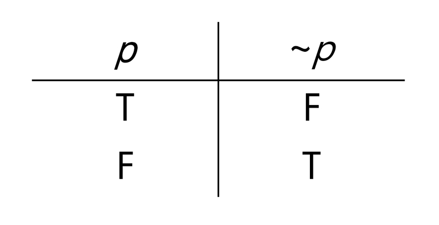

##### 논리곱 AND 

p, q가 명제일 때, p, q 모두 참일 때만 참이 되는 명제. 

p ∧ q (p and q, p 그리고 q)

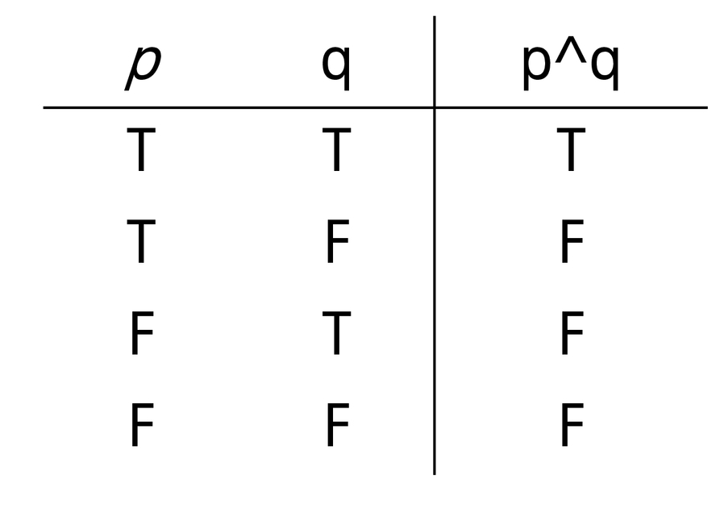

##### 논리합 OR

p, q가 명제일 때, p, q 모두 거짓일 때만 거짓이 되는 명제. 

p ∨ q (p or q, p 또는 q)

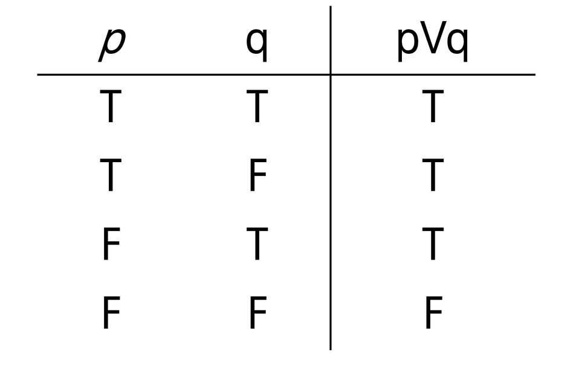

##### 배타적 논리합 XOR 

p. q가 명제일 때, p, q 중 하나만 참일 때 참이 되는 명제.

p ⊕ q (p xor q)

다르다고 하기도 함, 달라야지 T이기 때문

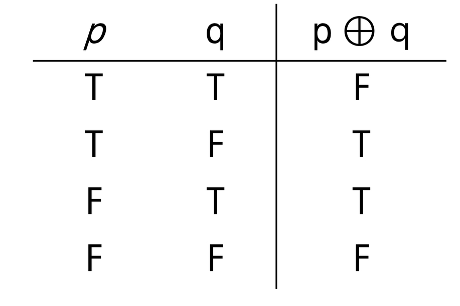

#### 합성 

연산자 우선 순위

- ¬ > ∨, ∧ > →, ↔
- not > and, or > 조건 명제의 연산

항진명제 : 진릿값이 항상 참 

모순명제 : 진릿값이 항상 거짓

사건명제 : 항진명제도 모순명제도 아닌 명제

#### 조건명제

p, q가 명제일 때, 명제 p가 조건(또는 원인), q가 결론(또는 결과)로 제시되는 명제. 

p→q (p이면 q이다.)

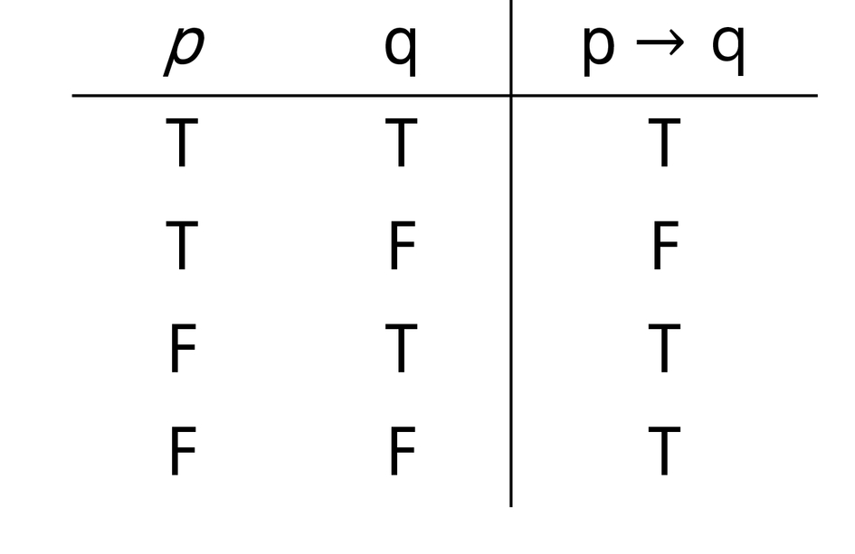

T->F일때만 F

p가 F면 무조건 T

q가 T면 무조건 T 

#### 쌍방조건명제

p, q가 명제일 때, 명제 p와 q가 모두 조건이면서 결론인 명제

p ↔ q(p면 q고, q면 p다.)

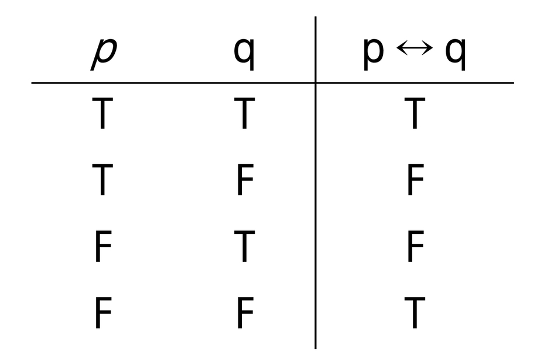

두개가 같을 때 T

#### 조건명제의 역, 이, 대우 

역 : q→ p 

이 : ¬p → ¬q 

대우 : ¬q → ¬p

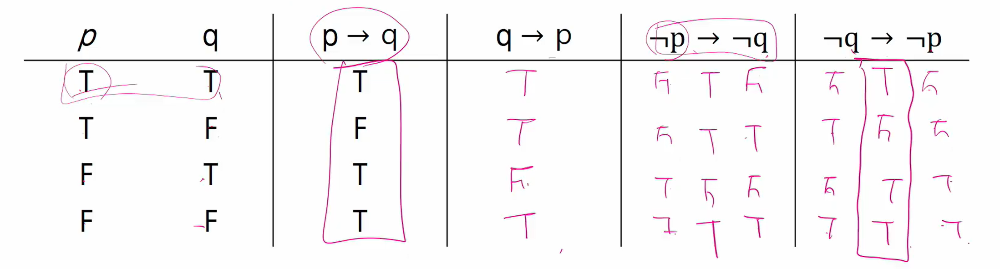

p-> q 판단하기 힘들 때 대우를 보고 판단하는 경우가 있음

### 논리 연습

문제 1: 다음을 명제식 형태로 쓰고 참인지 거짓인지 판단하시오

1. 만약 0이 홀수라면, 미국에서 2080년 월드컵이 열린다
   - p->q
   - p가 F라서
   - 뒤는 상관없이 T
2. 만약 19893827938274839이 Prime Number라면, 2는 짝수이다.
   - prime number : 소수
   - q가 T면
   - 앞은 상관없이 T

문제 2

p와 q가 명제이고 p q가 거짓이라고 하자. 다음 명제식의 참 거짓은 어떻 게 되는가? 

- p가 T, q가 F일때

1. ~p → q 
   - F->T 라서 T
2. p ∨ q 
   - T -> F 라서 T
3. q → p
   - F->T라서 T

문제 3

다음 명제들의 역, 이, 대우를 쓰시오

1. 만약 0이 홀수라면, 미국에서 2080년 월드컵이 열린다
   - 대우 : 미국에서 2080년 월드컵이 열리지 않는가면 0은 짝수
2. 만약 19893827938274839이 Prime Number라면, 2는 짝수이다.
   - 2가 홀수라면 ~~가 소수가 아니다

문제 4

다음 명제식의 진리표를 만드시오

1. p ∧ (q → ~p)

   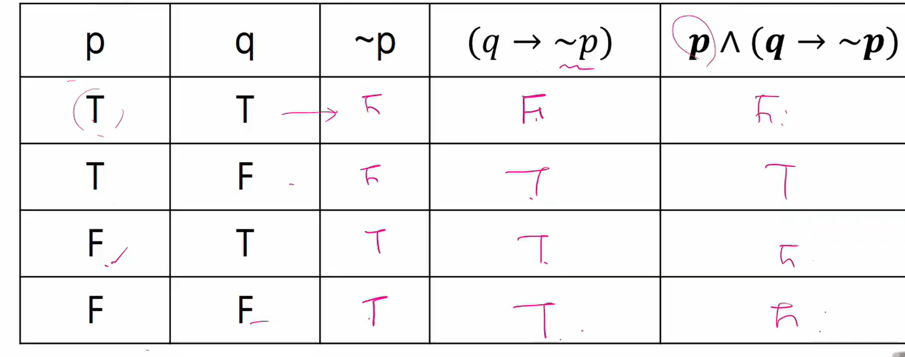

2. (p ∧ ~q) → r

   3개면 경우의 수 더 추가

   | P    | Q    | R    | ~q   | p ∧ ~q | (p ∧ ~q) → r |
   | ---- | ---- | ---- | ---- | ------ | ------------ |
   | T    | T    | T    | F    | F      | T            |
   | T    | T    | F    | F    | F      | T            |
   | T    | F    | T    | T    | T      | T            |
   | T    | F    | F    | T    | T      | F            |
   | F    | T    | T    | F    | F      | T            |
   | F    | T    | F    | F    | F      | T            |
   | F    | F    | T    | T    | F      | T            |
   | F    | F    | F    | T    | F      | T            |

   

### 증명

증명은 정확한 명제식으로 표현할 수 있는 것이라야 함

보통은 정확한 명제식까지 쓰지는 않으나 근본적으로는 명제식으로 바꿀 수 있음

증명에 대한 수많은 오해가 p → q를 p ↔ q와 혼동하는 것에서 일어남

모든 당구공은 색이 같다는 다음 증명에서 잘못된 것은?

- 수학적 귀납법: P(1)이 참이고, P(n)→P(n+1)이 참이면 P(n)은 모든 자연수 n 에 대해서 참이다. 
- 모든 자연수 n에 대해 당구공 n개가 들어있는 집합에서 그 집합에 포함된 당구 공은 모두 색이 같다는 것을 증명함
- P(1): 당구공 1개가 들어있는 집합은 모두 색이 같음
- P(n)+P(n+1)을 증명하기 위해 P(n)이 참이라고 가정
- 당구공 n+1개가 들어 있는 임의의 집합을 생각함
- 이 집합에서 하나를 빼면 당구공 n개가 있는 집합이 되므로 지금 상황에서 모 든 당구공의 색이 같음
- 방금 뺀 원소를 다시 넣고, 다른 당구공을 빼면 역시 당구공 n개가 있는 집합이 되므로 지금 상황에서도 모든 당구공의 색이 같음 
- 위의 두 상황에서 처음 뺀 당구공과 두번째로 뺀 당구공의 색이 같음을 알 수 있으므로 당구공 n+1개가 들어 있는 임의의 집합은 색이 같은 것만을 포함함

- 대부분의 사람들이 P(n)이 참이라고 가정할 수 없다고 반론함

- 수학적 귀납법에서 필요한 것은 P(n)P(n+1)이 참임을 보이는 것 뿐이므로 P(n) 이 정말로 참일 필요는 없음

- 위 증명에서 실제로 잘못된 것은 다음 부분 
  - 위의 두 상황에서 처음 뺀 당구공과 두번째로 뺀 당구공의 색이 같음을 알 수 있으므로.. 
- 처음 뺀 당구공과 두번째로 뺀 당구공의 색이 같다는 것은 공통 부분이 있다는 것 인데, 실제로 n=1인 경우, 즉 n+1=2인 경우 공통 부분이 없음

Prime Number의 개수는 무한히 많다는 다음 증명은 옳은가?

- Prime Number의 개수가 유한한 개라고 가정 
- 모든 Prime Number를 다 곱하고 1을 더한 수를 n이라고 하자 
- 이 수 n은 어떤 Prime으로 나누어도 나머지가 1이다. 
- 그런데 n은 어떤 Prime보다도 크므로 합성수이다. 
- 합성수이지만 어떤 Prime으로도 나누어지지 않으므로 모순 발생

이 증명에 대한 반론으로 몇 개의 Prime이 더 존재하면 되는 것이 아니냐는 주장이 자주 있음 

위 증명은 “Prime Number가 k개 이면 모순이 발생”, 즉, “Prime Number가 k개”  → “항상 거짓”, 이 명제가 항상 참임을 확인한 것 

즉, “Prime Number가 k개” 라는 명제가 항상 거짓일 수 밖에 없다!

#### 수학적 귀납법과 증명의 수준 

수학적 귀납법의 기본형: P(1) 이 참이고, P(n) → P(n+1)이 참이면 P(n)은 모든 자연수 n에 대해서 참이다

수학적 귀납법의 강한 형태: P(1) 이 참이고, P(1)∧P(2)∧ ... ∧P(n)∧P(n+1) 이 참이면 P(n)은 모든 자연수 n에 대해서 참이다.

#### 증명 연습

##### Trivial Proof

∀x,P(x)→Q(x)를 증명하려는데, Q(x)가 항상 참인 경우

- q가 항상 참이면 p → q도 참

문제 1: 다음 명제를 증명하시오 

1.  실수 x에 대해, 만약 x<-1이면 x^2 + 1/4 > 0이다
   - 뒤가 참이니까 전체도 참
2.  n이 홀수이면 4n^3 + 6n^2 + 12는 짝수이다.
   - 뒤 짝수니까 다 참이다

##### Vacuous Proof

∀x,P(x) →Q(x)를 증명하려는데, P(x)가 항상 거짓인 경우 

문제 2: 다음 명제를 증명하시오 

1. 실수 x에 대해, 만약 2x^2 - 4x + 4 < 0이면 x > 8이다. 
   - 앞이 거짓이네 뒤도 볼것없이 트루다
2. 4n^3 + 6n^2 + 11 는 짝수이면 n이 홀수이다.
   - 앞이 거짓이네 뒤도 볼것없이 트루다

## 논리와 증명

문제1: 다음 명제들이 항진명제라는 것을 진리표를 이용해서 보이시오 

1. ~(~p ∧ g) ∨ q 

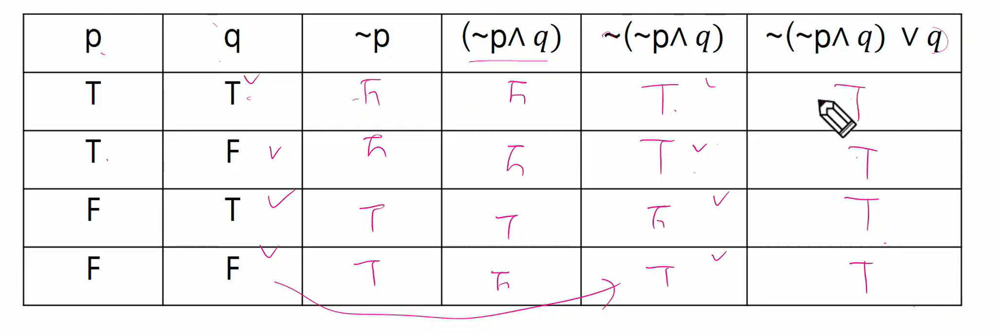

2. (~ p ∨ q) v (p ∧ ~q)

문제 2

다음 명제들이 모순명제라는 것을 진리표를 이용해서 보이시오

1. (~p ∨ q) ∧ (p ∧ ~q) 

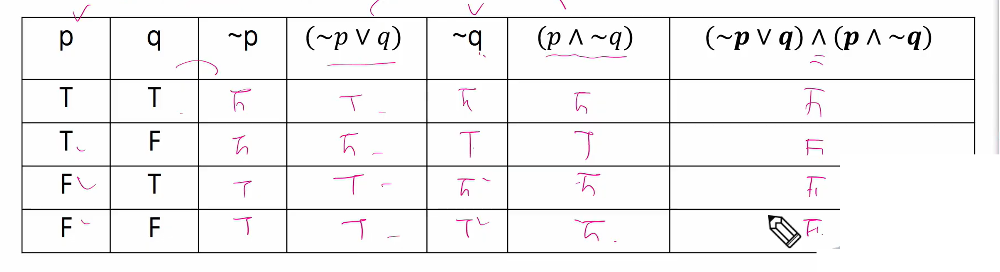

2. (p ∧ q) ∧ (p ∧ ~q)

문제 3

다음 명제의 쌍 들에 대해서 두 명제가 동등한지를 진리표를 이용해 확인하시오

1.  p ∧ (p ∨ q)와 p 

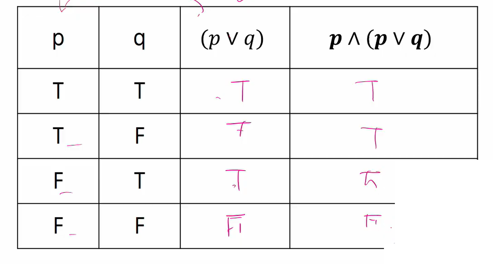

2. ~p ∨ ~q와 ~(p ∨ q)

문제 4: 명제식의 변형을 통하여 다음 명제를 간소화하시오. 

- 공통부분

1. (p ∧ ~ q)  ∨ (p ∧ q) 
   - p ∧ (~q ∨ q)
   - p ∧ u
   - u:항진명제
   - p
   - 드 모르간의 정의 참고
2. (p ∨ ~q) ∧ (~p ∨ ~q)

문제 5: 다음 명제들이 참인지 확인하시오. 단, R은 실수의 집합을 의미하고, Z는 정수의 집합을 의미한다.

1. ∀x ∈R, x^2 ≥ x 
   - 모든 실수에 대해 x제곱은 x보다 크다
   - 모든 -> 반례 하나만 찾아도
   - x = 1/2일때 안된 -> 거짓
2. ∀x ∈Z, x^2 ≥ x 
   - 0인경우, 음수, 양수 다 만족함
   - 참
3. ∃x ∈R, x^2 < x
   - 어떤 -> 존재하는것 하나만 찾아도 됨
   - x=0.5
   - 참
4. ∃x ∈Z, x^2 < x

문제 6: (직접 증명) n이 짝수이면 3n + 5는 홀수임을 증명하라

(힌트: n = 2k로 두고 3n + 5가 2(어떤 정수) + 1 형태로 표현될 수 있는지...)

- 2(3k+2)+1

문제 8: m이 짝수이고 n이 홀수이면 2m + 3n은 홀수임을 증명하라

2*2k + 3(2l+1)

= 2(2k + 3l + 1) + 1

문제 9: (대우를 증명) 자연수 n에 대해, n^2 + 5가 홀수이면 n은 짝수임을 증명하라 

(힌트: 명제 대신, n이 홀수이면 n^2 + 5은 짝수임을 증명한다)

- 원래 명제는 차수가 낮아져서 증명하기 어려움
- 대우로 하면 홀수를 2k+1로 바꿔서 가능

문제 10: n^2이 짝수이면 n은 짝수임을 증명하라

- 대우 : n이 홀수면 n^2은 홀수
- (2k+1)^2 = 2(2k^2 + 2k) + 1
- 대우가 참 -> 명제는 참

## 수와 표현

컴퓨터는 0/1을 표현할 수 있는 비트들을 모아 수를 표현 

k개의 비트를 사용하면 0부터 2^k-1까지 표현 가능 

사실, 꼭 저 범위인 것은 아님. 약속하는 방식에 따라 다르지만, 어떤 경우는 최대 2^k 가지의 값을 표현하는 것이 가능 

- 구분을 어디다 하느냐에 따라 0에서부터가 아니라 -7부터 8일수도 있음

10진수로 자리를 쓰면 0부터 10^-1까지 표현이 가능한 것과 완전히 동일한 과정

어떤 값 n을 표현하기 위해서는 몇 개의 비트가 필요할까? 

2^k - 1 ≥ n이 성립해야 함 -> 즉, 2^k  ≥ n + 1

같은 의미로, k  ≥ log(n + 1) -> 약 logn 비트가 필요

x = logn과 2^x = n은 같은 말

위의 식을 잘 보면, logn이란

(가) 2의 몇 승이 n이 되느냐의 답 

(나) n을 표현하는 데 몇 비트가 필요한가의 답 

(다) 1로 시작해서 계속 두 배를 할 때 몇 번 하면 n이 되느냐의 답 

(라) n을 2로 계속 나눌 때 몇 번 나누면 거의 1이 되느냐에 대한 답

x = logn일 때 x와 n을 비교하면 x가 더 작고, n이 커질수록 엄청나게 달라진다 

100자리로 표현할 수 있는 10진수 값은 읽을 수도 없을 정도로 큰 값이다. 

컴퓨터 분야에서 로그의 밑은 항상 2

자리수를 줄일 수 있다

32비트 컴퓨터의 주소 공간은 2^(32) = 약 40억개 주소 

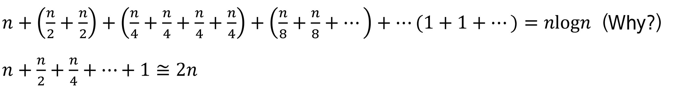

위 두 식의 항의 개수는 log n개 (Why?)

### 문제들

#### 문제1

2진수 표현에서 logn 비트로 표현할 수 있는 숫자 범위는?

- 2^logn = n^log2

- n^log2 = n (log2 = 1)

- 숫자 범위는 n이 된다

#### 문제2

스무고개가 이상적으로 진행된다고 할 때, 맞출 수 있는 답의 종류는 몇가지인가?

2의 20승

문제 3: n이 충분히 큰 값일 때 다음 중 어느 값이 더 큰가? 각 쌍에 대해 비교하고 그 이유를 작성하시오.

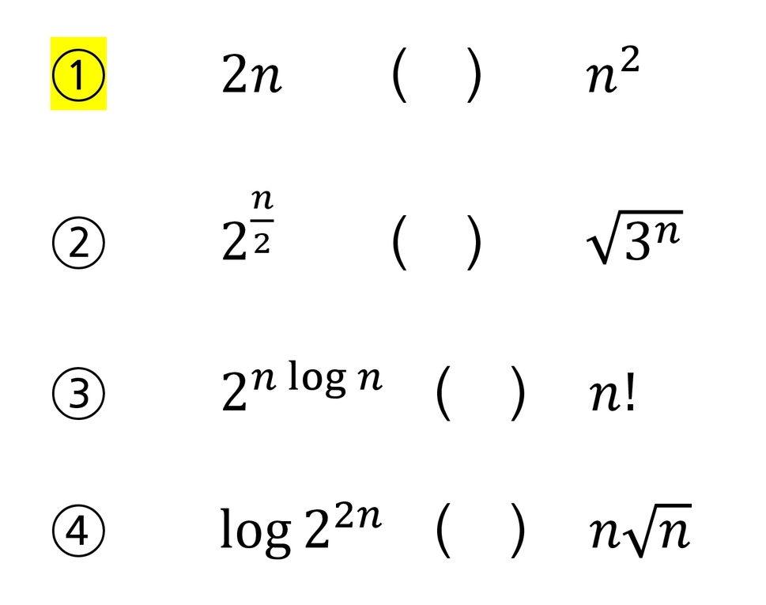

1. 2n보다는 제곱이 큼

3. 2^nlogn = n^n -> n^n이 큼

#### 문제 4

명제식의 변형을 통하여 다음 명제를 간소화하시오

1. (p ∧ ~q) ∨ ( p ∧ q )

2. (p ∨ q) ∧ (~p ∨ ~q)

   = (p ∧ ~p) ∨~q

   = ∅ ∨ ~q

   = ~q

#### 문제 5

다음 함수들의 역함수를 구하시요

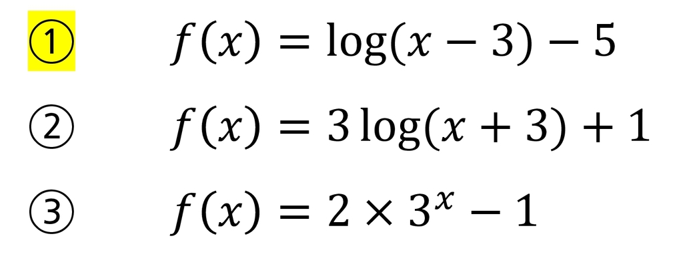

1. f(x) + 5 = log(x-3)

   2^(f(x)+5) = x - 3

   x =  2^(f(x)+5) + 3

   f-1(x) = 2^(x+5) + 3

## 집합과 조합론

두 집합 A와 B에 대해 A가 B의 부분집합임을 증명한다는 것은 A의 임의의 원소가 B에 포함됨을 보이는 것과 같다. 

예를 들어 모든 4의 배수는 2의 배수라는 것을 증명하려면, 4k=2(2k)임을 보이면 되는 것이다. 

두 집합 A와 B가 같다는 것을 증명하기 위해서는 A가 B의 부분집합이고 B가 A의 부분집합임을 증명하면 된다.

다음 두 집합이 같다는 것을 상세히 증명해 보자. A={x|x=2k+1, k는 자연수), B={x|x=4k+1 혹은 x=4k+3,k는 자연수) 

A가 B의 부분집합이다

- A에 포함되는 임의의 원소 x를 가정. x=2k+1임
- k가 짝수(=2t)인 경우와 홀수(=2t+1)인 경우로 나눔
- 짝수인 경우 x=2k+1=2(2t)+1=4t+1로서, x는 B에 포함됨
- 홀수인 경우 x=2k+1=2(2t+1)+1=4t+3로서, x는 B에 포함됨
- 모든 가능한 경우에 는 B에 포함됨.

B가 A의 부분집합이다

- B에 포함되는 임의의 원소 X를 가정
- x=4k+1인 경우, x=4k+1=2(2k)+1로서 x는 A에 포함됨
- x=4k+3인 경우, x=4k+3=2(2k+1)+1로서 x는 A에 포함됨
- 모든 가능한 경우에 는 B에 포함됨. 

위 두 가지 증명에서 집합 A와 B는 같다.

조합론은 경우의 수를 따지는 문제들을 보통 말한다. 

조합은 개수는 C를 이용하여 표현하기도 하지만 괄호 표현을 더 많이 쓴다.

### 연습 문제들

#### 문제 1

$$
\begin{pmatrix}n\\k\\\end{pmatrix} + \begin{pmatrix}n\\k-1\\\end{pmatrix} = \begin{pmatrix}n+1\\k\\\end{pmatrix}
$$

임을 증명하라

n!으로 묶어주고

분수 위아래 n-(k-1) 곱해주고 합쳐서 팩토리얼 해주고 하면 답 나옴

문제 4: 귀류법을 이용하여 
$$
(A - B) \cap (B-A) = Ø
$$
임을 증명하라

귀류법 

- 명제의 부정을 참이라 가정하고 거짓임을 보임
- ¬ (p → q) = p ∧ ~q

원소가 있다면 가정

P가 저식에 속하면

A-B에도 속하고

B-A에도 속함

경우

i) A에 속하고 B 아님

ii) B에 속하고 A 아님

iii) 둘다 안속함

iv) 둘다 속함

문제8 8X8 체스판에 말 두개를 놓으려고 한다 아무 곳에나 놓아도 되지만 한 칸에 두개가 들어가지는 못한다 가능한 방법은 모두 몇가지인가
$$
_{64}C_2
$$


구하면된다


2개의 벽을 제거했을때

- 벽의 좌표를 저장한 배열 벽이 n개

  - a의 원소중 2개 고르는 방법

  - ```pseudocode
    for i : 0 -> 2
    	for j : i+1 -> N-1
    		f(i, j)
    ```

  - 벽의 좌표 두개 고름

#### 문제 10

비밀번호를 0부터 9까지의 숫자만 가지고 만든다고 하자 4개 이상 6개 이하의 숫자를 쓸 수 있다고 할 때 가능한 비밀번호의 가지수는 얼마인가?

4자리 경우의 수

5자리 경우의 수

6자리 경우의 수 각각 구해서 더하면 된다

#### 문제 12 

52개의 카드를 이용해서 만들 수 있는 5개 카드의 조합은 몇가지인가
$$
_{52}C_5 =  \frac{52!}{47! \times5!} = \frac{52 \times 51 \times 50 \times  49 \times  48}{5\times 4\times 3\times 2}= 2,598,960
$$

#### 문제 13

52개의 카드를 이용해서 만들 수 있는 5개 카드 조합 중 같은 무늬의 카드가 정확히 3개인 경우는 몇가지인가?

4 C 1 (4개 무늬중에 하나 고르고)

13 C 3 (거기서 3개 고르고)

3 C 2 ( 남은 무늬중에서 2개 고르고)

13 C 1 (하나 고르고)

13 C 1 (하나 고르고)

#### 문제 14

x+y+z=100의 자연수 해는 몇가지인가

100개 공을 늘여놓고 공 사이에 경계선 2개 고른다고 생각하면됨

총 경계 99개 거기서 2개 고름

99 C 2 구하면됨

## 기초수식

알고리즘의 시간 복잡도를 표현할 수 있는 다양한 수식들이 존재한다.

풀이법을 익혀 두어야 알고리즘의 시간 복잡도를 계산할 수 있고, 알고리즘이 얼마나 걸릴 지 예측할 수 있다

### 연습 문제들

다음 재귀식들을 O() notation 수준으로 풀어라

#### 문제1

T(n) = T(n-1) + 1, T(0) = 1

= T(n-2) + 1 + 1

= T(n-3) + 1 + 1 + 1

...

= T(n-k) + k

= T(0) + n  # n이 k랑 같아진다면

= 1 + n # 최종적인 T(n)의 연산수

가장 높은 차수만 표시하면 O(n)

문제2. T(n) = T(n-1) + n, T(0) = 1

답 O(n^2)

#### 문제2

T(n) = T(n-2) + n, T(0) = 1

= T(n-2) + (n-1) + n

= T(n-3) + (n-2) + (n-1) + n

= T(n-k) + (n-k+1) + ... + (n-1) + n

n=k

= T(0) + 1 + 2 + ... + n

= 1 + n(n+1)/2

= 1 + 1/2 * n^2 + 1/2 * n/2 

빅오표기법 : O(n^2)

#### 문제3

T(n)  = T(n-1) + logn, T(0) = 1

​          = T(n-2) + log(n-1) + logn

​			= T(n-3) +  log(n-2) + log(n-1) + logn

​		    = T(n-k) + log(n-k+1) ... + log(n-1) + logn\

​	        **n=k일때**

​			=T(0) + log1 + ... + log(n-1) + logn

​            = 1 + logn! 

logn! <= logn^n

1+ logn! <= 1 + logn^n

​                 = 1+ nlongn

빅오 표기법 : O(nlogn)

#### 문제4

T(n) = T(n/2) + 1, T(1) = 1

T(n)

= T(n/4) + 1 + 1

= T(n/8) + 1 + 1 + 1

= T(n/(2^k) + k

= T(1) + k (k=logn일때)

= 1+ logn

빅오 표기법 : O(logn)

#### 문제5

T(n) = T(n/2) + n, T(1) = 1

​        = T(1/2 * n/2) + n/2 + n  = T(n/4) + n/2 + n

​        = T(n/8) + n/4 + n/2 + n

​		...

​		= T(n/2^k) + n/(2^(k-1)) + ... + 1/2^2 + 1/2^1 + n/2^0

k=logn일때

​		= T(1) + n((1/2)^(k-1) + ... + (1/2)^2 + (1/2)^1 + (1/2)^0)

등비급수
$$
a \times \frac{1-r^n}{1-r}
$$

$$
T(1) + n \times \frac{1-\frac{1}{2}^k}{1-\frac{1}{2}}\\
= 1 + n \times 2 \times (1-\frac{1}{n})\\
= 2n - 1
$$

빅오표기법 : O(n)

## 재귀

재귀란 자기 자신을 호출하는 함수, 그럼 끝날 수가 있는가?

함수는 입력이 있으며, 자기 자신의 입력과 동일한 입력으로 자기 자신을 호출하면 당연히 끝나지 않음

하지만, 다른 입력으로 호출하면 끝날 수 있음

```pseudocode
int abc(int x) // 이 함수는 안 끝남
{
return abc(x);
}
~
int sum(int x) // 이 함수는 끝남. 결과 값은?
{
if (x <= 0) return 0; 
return x + sum(x-1);
}
```

함수란 어떤 문제를 해결하는 방법을 코딩한 것

함수가 어떤 문제의 단 한 케이스만을 해결하는 것이 아님 

제대로 코딩 된 것이라면 해결하는 문제의 모든 케이스들을 해결해야 함

수학적 귀납법 증명 사용 가능 

(가) n이 0일 때 문제를 풀 수 있음 

(나) n-1에서 문제를 풀 수 있으면 n에서도 문제를 풀 수 있다.

위 두 가지가 사실이면 모든 가능한 n에 대해 문제를 풀 수 있다는 것이 사실

위 박스의 함수 sum()을 보면 정확히 위의 두 가지를 코딩한 것임 

따라서, sum() 함수는 문제를 해결한다는 것을 증명할 수 있음 

방금 보인 증명은 high-level 증명이며, 상세한 증명은 과정의 첫날에 본 적이 있음

어떤 미스터리한 이유로 문제가 해결되는 것은 아니고, 실제로 프로그램을 돌리면 필요한 계산이 다 일어남. 순차적인 코드에서 일어나는 계산과 완전히 동일. 다만 표현하는 방법이 달라진 것

```java
int sum(int x)
{
	if (x <= 0) return 0;
	return x + sum(x-1);
}
```

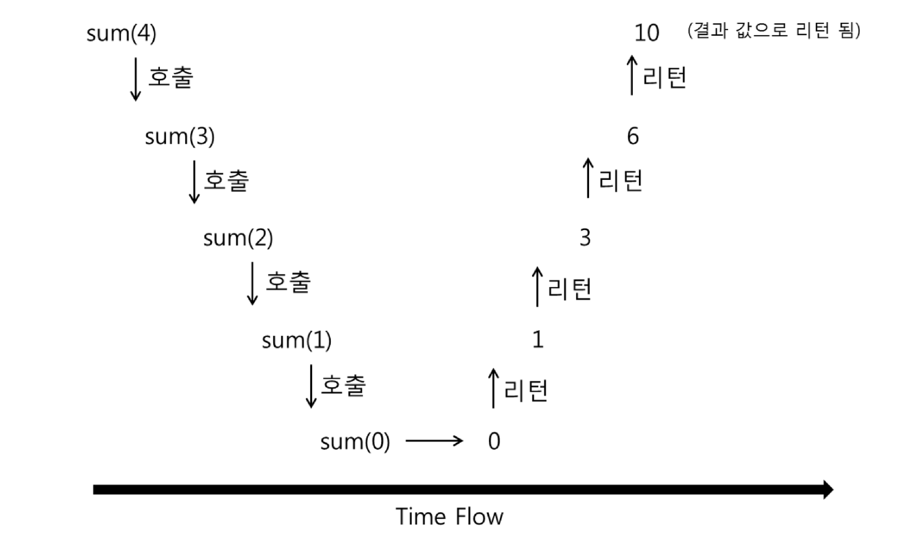

sum(x)호출할때마다 메모리 영역 사용, 저장

다시 리턴하면서 메모리영역에 남아있던 숫자들 더함

### 연습 문제들

다음 문제들을 푸는 재귀 알고리즘을 수도코드로 작성하고, 정확 성 증명 및 시간 복잡도 계산을 수행하라 - 

#### 문제 1

피보나치 수열: F(n)=F(n-1)+F(n-2), F(1)=F(2)=1

```pseudocode
fibo(n):
	if n <= 2:
		return 1
    else:
    	return fibo(n-1) + fibo(n-2) 
```

f(1) => 1

f(2) => 2

f(1) ~ f(k-1)

f(k) = f(k-1) + f(k-2)

##### 시간복잡도

T(n) = T(n-1) + T(n-2) + 1

< T(n-1) + T(n-1) + 1 = 2T(n - 1) + 1

= 2(2T(n - 2) + 1) + 1

= 2(2(2T(n - 2) + 1) + 1) + 1

= 2^k * T(n-k) + 2^(k-1) + ... + 2 + 1
$$
= 2^k \times T(n-k) + \frac{1-r^k}{1 - r}
$$

$$
= 2^n + \frac{1-2^n}{1 - 2}
$$

빅오표기법 O(2^n)

## 동적 프로그래밍

간단하게 설명하면 재귀 함수에서 동일한 입력의 함수 호출이 반복적으로 일어날 때 그 결과 값을 저장해 두고 불러 쓰는 것이다. (Memoization)

최초 입력에서 파생되는 모든 가능한 입력에 대한 답을 모두 저장할 수 있는 메모리가 있어야 한다. 

단순히 재귀에서 저장된 값을 찾아보는 것으로도 가능하지만, 결과 값을 순서를 정해서 계산할 수도 있다. (Dynamic Programming)

항상 빠르지는 않다

### 문제들

다음 문제들을 푸는 동적 프로그래밍 알고리즘을 수도코드로 작성하고, 정확성 증명 및 시간 복잡도 계산을 수행하라

#### 문제 1

Memoization 피보나치 수열: F(n) = F(n - 1) + F (n - 2), F (1) = F(2) = 1 

(힌트: 계산되는 값이 n 가지 밖에 없으므로 이 값들을 저장할 수 있는 배열을 만들어 두고 재귀 호출에 들어가기 전에 값이 있는 지 확인하는 방법)

메모이제이션도 호출횟수가 늘어날수록 효율 떨어진다

```pseudocode
Fibonacci(n)
{
	if n== 0 or n== 1
		then return n
		
	if memoization[n] != null
		then return memoization[n]
		
	memoization[n] = Fibonacci(n-1) + Fibonacci(n-2) 
	return memoization[n]
}

```


#### 문제 2

Dynamic Programming 피보나치 수열

F(n) = F (n - 1) + F (n - 2) 

(힌트: 작은 값부터 순서대로 계산한다) 

```pseudocode
Fibonacci(n)
{
	F[0] <- 0 
	F[1] <- 1 
	
	for i <- 2, i ≤ n, i <- i+1
		F[i] = F[i-1] + F[i-2] 
        
    return F[n]
}
```


세 버전 중 어느 것이 빠를까

-> 마지막 방식