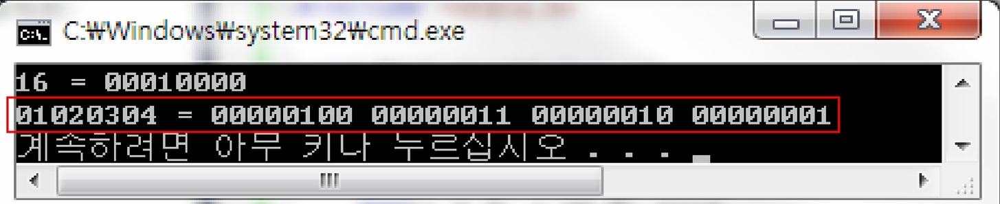
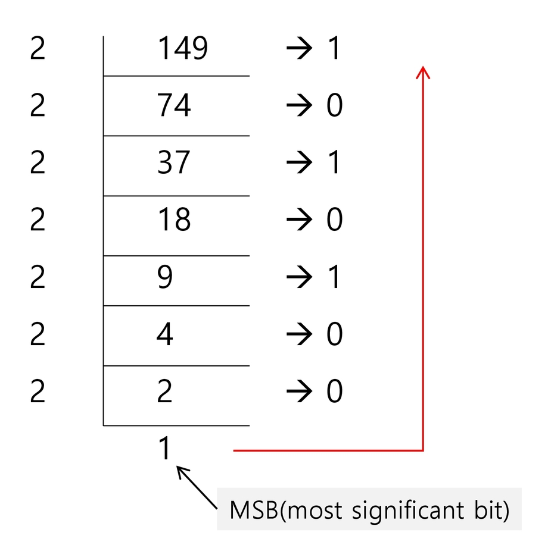

# APS 응용

## 학습목표

SW 문제 해결 역량이란 무엇인가를 이해하고 역량을 강화하는 방법을 이해한다.

효율적인 알고리즘의 필요성을 이해하고 알고리즘의 성능 측정 방법 중 하나인 시간복잡도에 대해 이해한다. 

프로그램을 작성하기 위한 기본 중 표준 입출력 방법에 대해 이해한다. 

비트 수준의 연산과 알고리즘에 대해 이해한다. 

컴퓨터에서의 실수 표현 방법에 대해 이해한다.

프로그래밍하기 위한 제약 조건과 요구사항

- 프로그래밍 언어의 특성 
- 프로그램이 동작할 HW와 OS에 관한 지식
- 라이브러리들의 유의 사항들
- 프로그램이 사용할 수 있는 최대 메모리
- 사용자 대응 시간 제한
- 재사용성이 높은 간결한 코드

SW 문제 해결 역량이란 무엇인가? 

- 프로그램을 하기 위한 많은 제약 조건과 요구사항을 이해하고 최선의 방법을 찾아내는 능력
- 프로그래머가 사용하는 언어나 라이브러리, 자료구조, 알고리즘에 대한 지식을 적재적소에 퍼즐을 배치하듯 이들을 연결하여 큰 그림을 만드는 능력이라 할 수 있다.
- 문제 해결 역량은 추상적인 기술이다. 
  - 프로그래밍 언어, 알고리즘처럼 명확히 정의된 실체가 없다. 
  - 무작정 알고리즘을 암기하고 문제를 풀어본다고 향상되지 않는다.
- 문제 해결 역량을 향상시키기 위해서 훈련이 필요하다.

문제해결능력을 훈련하기 위해서는 

- 일부 새로운 언어, 프레임워크, 개발 방법론만을 배워나가는 것만으로 충분하지 않다.
- 이들을 조합해 나가는 방법을 배워야 하지만 쉽지 않다.
- 경험을 통해서 나아지리라 막연히 짐작만 한다. 그러나 경험에서는 문제 해결 능력을 개발할 수 있는 상황이 항상 주어지는 것이 아니며 또한 그런 상황에서 자기 개발을 하기는 쉽지 않다. 
- 상황을 인위적으로 만들어 훈련해야 한다. 즉 잘 정제된 추상적인 문제를 제시하고 이를 해결해 가면서 문제 해결 능력을 향상시킬 수 있는 훈련이 필요하다.

문제 해결 과정

1. 문제를 읽고 이해한다
2. 문제를 익숙한 용어로 재정의한다
3. 어떻게 해결할지 계획을 세운다
4. 계획을 검증한다
5. 프로그램으로 구현한다
6. 어떻게 풀었는지 돌아보고, 개선할 방법이 있는지 찾아본다

되돌아가야할 때도 있는데 그 되돌아 갈 타이밍을 적당히

문제 해결 전략

- 직관과 체계적인 접근

- 체계적인 접근을 위한 질문들

  - 비슷한 문제를 풀어본 적이 있던가? 

  - 단순한 방법에서 시작할 수 있을까? 

  - 문제를 단순화 할 수 있을까?

  - 그림으로 그려 볼 수 있을까?

  - 수식으로 표현할 수 있을까? 

  - 문제를 분해할 수 있을까?

  - 뒤에서부터 생각해서 문제를 풀 수 있을까?

  - 특정 형태의 답만을 고려할 수 있을까

## 복잡도 분석

### 알고리즘? 

(명) 알고리즘 : 유한한 단계를 통해 문제를 해결하기 위한 절차나 방법이다. 

주로 컴퓨터용어로 쓰이며, 컴퓨터가 어떤 일을 수행하기 위한 단계적 방법을 말한다. 

간단하게 다시 말하면 어떠한 문제를 해결하기 위한 절차라고 볼 수 있다.

예를 들어 1부터 100까지의 합을 구하는 문제를 생각해 보자.

1+2+3+...+100 = 5050
$$
\frac{100 \times(1+100)}{2}=5050
$$


### 알고리즘의 효율 

공간적 효율성과 시간적 효율성 

- 공간적 효율성은 연산량 대비 얼마나 적은 메모리 공간을 요하는 가를 말한다. 
- 시간적 효율성은 연산량 대비 얼마나 적은 시간을 요하는 가를 말한다.
- 효율성을 뒤집어 표현하면 복잡도(Complexity)가 된다. 복잡도가 높을수록 효율성은 저하된다.

시간적 복잡도 분석

- 하드웨어 환경에 따라 처리시간이 달라진다. 
  - 부동소수 처리 프로세서 존재유무, 나눗셈 가속기능 유무
    - cpu안에 공간 나뉘어져 있음
  - 입출력 장비의 성능, 공유여부
-  소프트웨어 환경에 따라 처리시간이 달라진다.
  - 프로그램 언어의 종류
  - 운영체제, 컴파일러의 종류
- 이러한 환경적 차이로 인해 분석이 어렵다.

### 복잡도의 점근적 표기 

시간 (또는 공간)복잡도는 입력 크기에 대한 함수로 표기하는데, 이 함수는 주로 여러 개의 항을 가지는 다항식이다

이를 단순한 함수로 표현하기 위해 점근적 표기 (Asymptotic Notation)를 사용한다. 

입력 크기 n이 무한대로 커질 때의 복잡도를 간단히 표현하기 위해 사용하는 표기법이다. 

- O(Big-Oh) - 표기
- Ω (Big-Omega) - 표기
- θ (Big-Theta) - 표기

#### O(Big-Oh)-표기

O-표기는 복잡도의 점근적 상한을라타낸다. 

복잡도가 f(n) = 2n^2-7n+4 이라면, f(n)의 표기는 O(n^2)이다.

먼저 f(n)의 단순화된 표현은 n^2이다.

단순화된 함수 n^2에 임의의 상수를 곱한 cn^2이 n이 증가함에 따라 f(n)의 상한이 된다. (단, c>0.)

단순히 실행시간이n^2에 비례하는 알고리즘이라고 말함

복잡도 f(n)과 O-표기를 그래프로 나타내고 있다

n이 증가함에 따라 O(g(n))이 점근적 상한이라는 것 (즉, g(n)이 n0보다 큰 모든 n에 대해서 항상 f(n)보다 크다는 것을 보여 준다.


#### Ω(Big-Omega)-표기

복잡도의 점근적 하한을 의미한다. -

f(n) = 2n^2-7n+4의 Ω-표기는 Ω(n^2)이다

f(n)=Ω(n^2)은 “n이 증가함에 따라 2n-7n+4이 cn^2보다 작을 수 없다” 라는 의미이다. 이때 상수 c=1로 놓으면 된다. 

O-표기 때와 마찬가지로, Ω-표기도 복잡도 다항식의 최고차항만 계수 없이 취하면 된다. 

“최소한 이만한 시간은 걸린다”

- 빅오랑 표기법은 같은데 빅오가 최악의 경우
- 오메가는 아무리 잘해도 이정도 연산

복잡도 f(n)과 Ω-표기를 그래프로 나타낸 것인데, n이 증가함에 따라 Ω(g(n))이 점근적 하한이라는 것 (즉, g(n)n 보다 큰 모든 n에 대해서 항상 f(n)보다 작다는 것을 보여준다.


#### θ(Theta)-표기

O-표기와 Ω-표기가 같은 경우에 사용한다.

f(n) = 2n2+8n+3 = O(n2) = Ω(n^2)이므로, f(n)=θ(n)이다.

f(n)은 n이 증가함에 따라 과 동일한 증가율을 가진다” 라는 의미이다.

항상 이정도의 연산은 발생한다


#### 자주 사용하는 O-표기

`0(1)` : 상수 시간 (Constant time) 

`O(logn)` : 로그(대수) 시간 (Logarithmic tince)

- 절반씩 줄어들때

`O(n)` : 선형 시간 (Linear time)

`O(nlogn)` : 로그 선형 시간 (Log-linear time)

`O(n^2)` : 제곱 시간 (Quadratic time)

`O(n^3)` : 세제곱 시간 (Cubic time) 

`O(2^n)` : 지수 시간 (Exponential time)

- 입력의 크기가 작으면 이거일수 있다

### 왜 효율적인 알고리즘이 필요한가 

10억 개의 숫자를 정렬하는데 PC에서 O(n) 알고리즘은 300여 년이 걸리는 반면에 O(nlogn) 알고리즘은 5분 만에 정렬한다

| O(n2)  | 1,000 | 1백만 | 10억  |
| ------ | ----- | ----- | ----- |
| PC     | < 1초 | 2시간 | 300년 |
| 슈퍼컴 | < 1초 | 1초   | 1주일 |

| O(nlogn) | 1,000 | 1백만 | 10억  |
| -------- | ----- | ----- | ----- |
| PC       | < 1초 | < 1초 | 5분   |
| 슈퍼컴   | < 1초 | < 1초 | < 1초 |

효율적인 알고리즘은 슈퍼컴퓨터보다 더 큰 가치가 있다. 

값 비싼 HW의 기술 개발보다 효율적인 알고리즘 개발이 훨씬 더 경제적이다

## 표준 입출력 방법

#### Python3 표준입출력 

##### 입력 

Raw 값의 입력 : `input()`

- 받은 입력값을 문자열로 취급

Evaluated 값 입력: `eval(input())`

-  받은 입력값을 평가된 데이터 형으로 취급
- 명령어로 취급해서 보통의 상황에서는 쓰지 말것

하나하나 출력하는 것보다 통으로 넣어서 출력하는게 백준같은 곳에서 더 빠른 이유

출력 버퍼에 보낼때 하나하나 해도 통으로 같이 보내서 출력을 하게끔 되어있음

그래서 묶어서 하면 그 보내는 횟수가 줄어듬

검정에서는 이거 고려하도록 정밀하게 만들어짐

##### 출력

print()

-  표준 출력 함수. 출력값의 마지막에 개행 문자 포함

 print ("text, end='')

- 출력 시 마지막에 개행문자 제외할 시

 print (''%d' % number)

- Formatting 된 출력

#### 문제 제시 

다음 내용을 표준 입력으로 읽어 들여 변수에 저장 후 출력하시오.


칸을 나눠서 저장

문자열로 저장

- 이 경우는 수정은 안됨

칸을 나눠서 정수로 저장 등등 

### 파일의 내용을 표준 입력으로 읽어오는 방법 

##### import sys

sys.stdin = open("a.txt", "r")

```python
import sys 
sys.stdin = open("input.txt", "r") 
sys.stdout = open("output.txt", "w") 

text = input()
print (text)
```

프로그램과 입출력 장치간의 데이터를 주고받는 통로가 stdin stdout

출력 장치와 프로그램 사이에는 콘솔이 있음

출력장치와의 연결을 끊고 input.txt에서 가져오기

써야 하는 경우

- 파이참 콘솔 붙였을 때 저장하는 영역 크기가 1mb: 1mb보다 클 때는 파일로 

##### map(int, input().split())

```python
import sys 
sys.stdin = open("input.txt", "r")

T = int(input())

r, c = map(int, input().split())
# 한 줄 입력 받아서 공백 기준으로 나누고, 정수로 형 변환
field = []
for i in range(0, r):
	row = input() 
    field.append(row)

print (T) 
print (str(r) + " " + str(c)) 
for i in range(0, r):
	print (field[i])
```

## 비트 연산

### 비트 연산자

#### &

비트 단위로 AND 연산을 한다. 

예) num1 & num2

bit & 0 : 무조건 0

bit & 1 : 원래 bit 그대로

쓰이는 곳 

- 특정 비트를 0으로 만들 때
- 마스킹 : 남겨놓고 싶은 건 1, 없에고 싶은건 0으로 110001이런식으로 & 해줌
- 비트 검사

#### | 

비트 단위로 OR 연산을 한다

예) num1 | num2

bit | 0 : 원래 bit 유지

bit | 1 : 특정 bit를 1로 만들때

1<<2 : bit2만 1인 값

~(1<<2): bit2만 0인 값

#### ^ 

비트 단위로 XOR 연산을 한다. (같으면 0 다르면 1)

예) num1 ^ num2

특정 비트를 반전시킬 때 (bit = 0 if but bit else 1)

- bit = bit ^ 1
- bit ^= 1

#### ~

단항 연산자로서 피연산자의 모든 비트를 반전시킨다.

예) ~num

~(1011) = 0100

#### <<

피 연산자의 비트 열을 왼쪽으로 이동시킨다

예) num << 2

a = 18

a << 2

00010010

01001000

옮기면 오른쪽에서는 계속 0을 공급해준다

2의 n승만큼 곱해줌

#### >>

피연산자의 비트 열을 오른쪽으로 이동시킨다

예) num >> 2

2의 n승만큼 나눠줌

#### 1<<n

2^n값을 갖는다

n번만큼 옆으로 옯겨가

2^a자리에 있던 비트 2^(a+n)자리에 가있는것

원소가 n인 경우 모든 부분집합의 수를 의미한다

Power set (모든 부분집합)

- 공집합과 자기 자신을 포함한 모든 부분집합
- 각 원소가 포함되거나 포함되지 않는 2가지 경우의 수를 계산하면 모든 부분집합의 수가 계산된다.

#### i & (1<<j)

계산 결과 : i의 j번째 비트가 1인지 아닌지를 의미한다

i의 j번 비트 검사

- j가 2라 치면 (1<<j)는 0100
- 이걸 i와 비교하면 j번째 비트랑 &가 되고 나머지 0이 됨 
- 그래서 i의 j번째 비트만 남음 그게 0인지 아닌지 확인

### 비트 연산 예제1

```python
def Bbit_print(i):
	output = ""
    for j in range(7, -1, -1):                 #왼쪽에서 오른쪽이니 7번비트부터 0번 비트 순으로 거꾸로
        output += "1" if i & (1 << j) else "0"  # 1이면 1 0이면 0 출력
    print (output)

for i in range(-5, 6):
	print ("%3d = " % i, end='') 
    Bbit_print(i)
```


### 연습문제1

0과 1로 이루어진 1차 배열에서 7개 bit를 묶어서 10진수로 출력하기

예를 들어 이면 1, 13 을 출력한다

입력 예

- 0000000111 1000000110 0000011110 0110000110 0001111001 1110011111 1001100111 
- 편의상 10개 단위로 간격을 두었음. 이어있는 데이터로 간주하시오.

### 비트 연산 예제2

```python
def Bbit_print(i):
	output = "" 
    for j in range(7, -1, -1):
        output += "1" if i & (1 «< j) else "0"
        print(output, end='') 
a = 0x10                        # 16진수 2칸 8bit = 1byte
x = 0x01020304                  # 16진수 2칸씩 4개 4byte
print("%d = " % a, end='') 
# 10진수로 표현을 해봐
Bbit_print(a) 
print()
print("O%X = " % x, end='')
# %X : 16진수로 표현하라는 소리
for i in range(0, 4):  # 0에서 시작했을 때랑 1에서 시작했을 때랑 비교
	Bbit_print((x >> i*8) & Oxff) 
    # i*8이기 때문에 i가 올라갈때마다 8칸 오른쪽 이동 즉, 8개씩 출력
    # 11111111이랑 &를 해봐 
```



### 엔디안(Endianness)

컴퓨터의 메모리와 같은 1차원의 공간에 여러 개의 연속된 대상을 배열하는 방법을 의미하며 HW 아키텍처마다 다르다.

주의 : 속도 향상을 위해 바이트 단위와 워드 단위를 변환하여 연산할 때 올바로 이해하지 않으면 오류를 발생시킬 수 있다

고정된 공간 사용 숫자마다 다르지 않음

#### 분류

엔디안은 크게 두 가지로 나뉨 

데이터를 1byte 단위로 채울때 1000~ 1003을 채울 때 1000에 가장 작은 단위를 넣을 것인가 큰 단위를 넣을 것인가

잘라서 전송할 때 어떤 걸 먼저 잘라서 보내는가 그걸 받아서 어떻게 재배치 하는가

- 빅 엔디안(Big-endian) 

  - 보통 큰 단위가 앞에 나옴. 네트워크

- 리틀 엔디안(Little-endian)

  - 작은 단위가 앞(낮은 주소)에 나옴. 대다수 데스크탑 컴퓨터. 


  | 종류        | 0x1234의 표현 | 0x12345678의 표현 |
  | ----------- | ------------- | ----------------- |
  | 빅 엔디안   | 12 34         | 12 34 56 78       |
  | 리틀 엔디안 | 34 12         | 78 56 34 12       |

  


#### 엔디안 확인 코드

```python
import sys

print(sys.byteorder)
```

### 비트 연산 예제3

```python
def ce(n): # change endian
    p = [] 
    for i in range(0, 4):
		p.append(in >> (24 - i*8) & 0xff) 
        return p
```

```python
x = 0x01020304 
p = [] 
for i in range(0, 4):
	p.append((x >> (i*8)) & Oxff)

print ("x = %d%d%d%d" % (p[0], P[1], p[2], p[3])) 
p = ce(x) 
print ("x = %d%d%d%d" % (p[0], p[1], p[2], p[3]))
```

### 비트 연산 예제4

```python
def ce1(n):
	return (n << 24 & Oxff000000) | (n << 8 & Oxff0000)
		| (n >> 8 & 0xff00) | (n >> 24 & 0xff)
```

(1<<a) | (1<<b) : a번 비트와 b번 비트가 1인 값

~()(1<<a) | (1<<b)) : a번 비트와 b번 비트가 0인 값

```python
(n << 24 & Oxff000000)
```


`n << 24` n을 24번 옆으로 옮기면 04가 01자리에 가게됨

`& Oxff000000` : 01자리만 살리고 나머지 0으로 만들기(마스킹)

```python
(n << 8 & Oxff0000)
```


`(n << 8)`: 8번 옆으로 옮기고

`& Oxff0000` ff자리 살림 03번째 비트 자리 살림

```python
(n >> 8 & 0xff00)
```


```python
 (n >> 8 & 0xff00) | (n >> 24 & 0xff)
```


최종


: 반대로 뒤집어 놓은 모양 

### 비트 연산 예제5

비트 연산자 ^를 두 번 연산하면 처음 값을 반환한다

```python
def Bbit_print(i):
	output = "" 
    for j in range(7, -1, -1):
        output += "1" if i & (1 « j) else "0" 
        print (output) 
a = 0x86
key = OxAA

print ("a | ==> ", end='')
Bbit_print(a)

print ("a^=key ==> ", end='');
a ^= key; Bbit
print(a)

print ("a^=key ==> ", end='');
a ^= key; 
Bbit_print(a)
```


key = 10101010

a^key는 그대로 반대로 그대로 반대로 번갈아 일종의 암호화

한번더 ^key 하면 또 그대로 반대로 그대로 반대로 해서 원래 값 복원

## 진수

2진수, 8진수, 10진수, 16진수 

10진수 → 타 진수로 변환 

- 원하는 타진법의 수로 나눈 뒤 나머지를 거꾸로 읽는다. 
- 예제) 
  - (149)10 = (10010101)2
  - = (225) 8 
  - = (95) 16



MSB & LSB : 가장 큰 단위, 가장 작은 단위

타 진수 → 10진수로 변환

- 예) 
- (135)8 = 1`*`8^2 + 3`*`8^1 + 5`*`8^0 = 9310 
- 소수점이 있을 때의 예)
  - (135.12)8 = 1`*`8^2 + 3`*`8^1 + 5`*`8^0 + 1`*`8^(-1) + 2`*`8^(-2) = 93.15625

2진수, 8진수, 16진수간 변환 3자리씩 묶음


컴퓨터에서의 음의 정수 표현 방법 

만약 첫비트를 기호로 하고 뒤에서부터 절대값으로 하면 -0 +0이 생김

1의 보수 : 부호와 절대값으로 표현된 값을 부호 비트를 제외한 나머지 비트들을 0은 1로, 1은 0로 변환한다. 

- 1의 보수
  - 111111111111111에서 뺀 값
  - 한자리가 더 많은 2의 제곱수 10000000000에서 1을 뺀 값가의 차
  - 1의 보수와 원래 값을 더하면 111111111111이 나옴

- 6: 1000000000000110 : 부호와 절대값 표현

- 6: 1111111111111001 : 1의 보수 표현

2의 보수 : 1의 보수방법으로 표현된 값의 최하위 비트에 1을 더한다.

- 10000000000000(한자리가 더 많은 2의 제곱수)에서 뺀 값

- 6: 1111111111111010 : 2의 보수 표현.
- 더하면 단순하게 되고 0도 하나
- 음수의 저장은 2의 보수로 한다

## 실수

### 실수의 표현

소수점 이하 4자리를 10진수로 나타내보면

실수 저장했을 때 바이트 수가 무한대로 할 수 없으니 조정해야 하는데 복잡

그래서 오차가 생김


2진 실수를 10진수로 변환하는 방법 

예) 1001.0011


IEEE754

컴퓨터는 실수를 표현하기 위해 부동 소수점(floating-point) 표기법을 사용한다

부동 소수점 표기 방법은 소수점의 위치를 고정시켜 표현하는 방식이다

- 소수점의 위치를 왼쪽의 가장 유효한 숫자 다음으로 고정시키고 밑수의 지수승으로 표현 

  `1001.0011` → `1.0010011 x 2^3`

실수는 유효자리수가 중요

#### 실수를 저장하기 위한 형식

- 단정도 실수(32비트)
- 배정도 실수(64비트)


가수부(mantissa) : 실수의 유효 자릿수들을 부호화된 고정 소수점으로 표현한 것

지수부(exponent) : 실제 소수점의 위치를 지수 승으로 표현한 것

##### 단정도 실수

###### 가수 부분을 만드는 방법

예 : 1001.0011 

- 정수부의 첫 번째 자리가 1이 되도록 오른쪽으로 시프트 
  - 왼쪽으로 세번

- 소수점 이하를 23 비트로 만든다. 

- 소수점 이하만을 가수 부분에 저장

  - 1.0은 고정이니까 1.0 빼고 소수점만 가수부 -> `00100110000000000000000` 

- 지수 부분은 시프트 한 자릿수 만큼 증가 또는 감소 

  - 증가할 자릿수값 저장되어 있음

  ```
  0001.0010011
  0001.00100110000000000000000
  00100110000000000000000
  
  → 1.0010011 x 2^3
  ```

지수부에는 8비트가 배정(256개의 상태를 나타낼 수 있음)

숫자로는 0-255까지 나타낼 수 있지만, 음수 값을 나타낼 수 있어야 하므로 익세스(excess) 표현법을 사용

- 익세스 표현법 : 지수부의 값을 반으로 나누어 그 값을 0으로 간주하여 음수지수와 양수지수를 표현하는 방법

###### 단정도 표현에서의 지수부 익세스 표현 실제 지수


예) 1001.0011을 단정도 실수로 표현한 예

- 3이 저장


10진수로 표현한 값에서 127을 빼준값이 실제 지수값이 됨


23개 비트로 모자라는 경우가 생김

지수부 자리가 커지면 소수부도 넣을 수 있는 자리가 적어짐

그래서 오차 생길 수 있긴 함

줄이려면 배정도 실수

### 실수

컴퓨터는 실수를 근사적으로 표현한다.

- 이진법으로 표현 할 수 없는 형태의 실수는 정확한 값이 아니라 근사 값으로 저장되는데 이때 생기는 작은 오차가 계산 과정에서 다른 결과를 가져온다
  - 곱하고 더하면서 누적됨

이 실수 자료형의 유효 자릿수를 알아두자. 

- 32 비트 실수형 유효자릿수(십진수) → 6 
- 164 비트 실수형 유효자릿수(십진수) → 15

파이썬에서의 실수 표현 범위를 알아보자 

파이썬에서는 내부적으로 더 많은 비트를 사용해서 훨씬 넓은 범위의 실수를 표현할 수 있다. 

최대로 표현할 수 있는 값은 약 1.8 × 10^308 이고 이 이상은 inf로 표현

- 최소값 초기화할 때 inf 쓰기도 하는데 쓰면 느리다 쓰지말것

최소로 표현할 수 있는 값은 약 5.0 × 10^(-324) 이며, 이 이하는 0으로 표현

```python
import struct
a = 9.187500
bits, = struct.unpack('I', struct.pack('f',a))
print(f'{bits:032b}') # 자릿수 표현, b는 이진수
# 01000001000100110000000000000000
# 0 : 부호
# 10000010 : 지수부
# 나머지
```

```python
b = 0.1
print(f'{b:.20f}')
# 0.10000000000000000555
# 오차 생김
```

