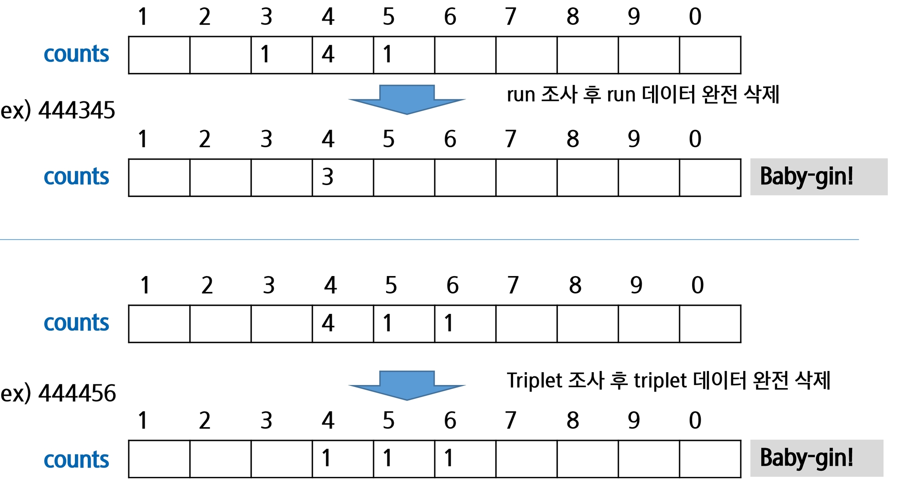

# 완전 검색 & 그리디

재귀적 알고리즘의 특성을 이해하고 이를 구현하기 위한 재귀 호출에 대해 학습한다.

완전 검색의 개념을 이해하고 완전 검색을 통한 문제 해결 방법에 대해 학습한다. 

조합적 문제(Combinatorial Problems)에 대한 완전 검색 방법에 대해 이해한다.

- 순열, 조합, 부분집합을 생성하는 알고리즘을 학습한다.

탐욕 알고리즘 기법의 개념과 주요 특성을 이해한다.

## 반복(Iteration)과 재귀(Recursion)

반복과 재귀는 유사한 작업을 수행할 수 있다. 

반복은 수행하는 작업이 완료될 때 까지 계속 반복

- 루프 (for, while 구조) 

재귀는 주어진 문제의 해를 구하기 위해 동일하면서 더 작은 문제의 해를 이용하는 방법

- 하나의 큰 문제를 해결할 수 있는(해결하기 쉬운) 더 작은 문제로 쪼개고 결과들 을 결합한다.
- 재귀 함수로 구현

- 파이썬은 재귀에 제약이 있다
  - 1000번에 접근하면 재귀로 푸는게 아닌가 생각해야

### 반복구조

초기화 

- 반복되는 명령문을 실행하기 전에 (한번만) 조건 검사에 사용할 변수의 초기값 설정

조건검사 (check control expression) 

반복할 명령문 실행 (action) 

업데이트 (loop update)

- 무한 루프(infinite loop)가 되지 않게 조건이 거짓(false)이 되게 한다.


#### 반복을 이용한 선택정렬

```python
def SelectionSort(A):
    n = len(A)

    for i in range(0,n-1):
        minI = i
        for j in range(i+1,n):
            if A[j] < A[minI]:
                minI = j 
        A[minI], A[i] = A[i], A[minI]
```

###  재귀적 알고리즘

재귀적 정의는 두 부분으로 나뉜다.

하나 또는 그 이상의 기본 경우(basis case or rule)

- 집합에 포함되어 있는 원소로 induction을 생성하기 위한 시드(seed) 역할

하나 또는 그 이상의 유도된 경우(inductive case or rule)

- 새로운 집합의 원소를 생성하기 위해 결합되어지는 방법

#### 재귀 함수 (recursive function) 

함수 내부에서 직접 혹은 간접적으로 자기 자신을 호출하는 함수.

- 자기 자신이라는 표현보다는 똑같이 생긴 함수라고 이해

일반적으로 재귀적 정의를 이용해서 재귀 함수를 구현한다.

따라서, 기본 부분(basis part)와 유도 부분(inductive part)로 구성된다. 

재귀적 프로그램을 작성하는 것은 반복 구조에 비해 간결하고 이해하기 쉽다.

- 효율면에서는 떨어져서 실무에서는 안쓰길 권장받음

- 그러나, 재귀에 대해 익숙하지 않은 개발자들은 재귀적 프로그램이 어렵다고 느낀다. 

함수 호출은 프로그램 메모리 구조에서 스택을 사용한다. 따라서 재귀 호출은 반복적인 스택의 사용을 의미하며 메모리 및 속도에서 성능저하가 발생한다.

- 돌아오는 과정에서 백업해둔거 복구하고 그런시간이 반복되어 함수 호출 복귀에 걸리는 시간이 오래걸린다

##### 팩토리얼 재귀 함수 

###### 재귀적 정의

Basis rule

- N ≤1경우, n=1

inductive rule

- N>1, n! = n X (n - 1)!

###### n!에 대한 재귀함수 

```pseudocode
def fact(n): 
	if n <= 1:     // Basis part 
		return 1 
    else:          // Inductive part
    	return n * fact( n - 1 )
```

###### 호출

```pseudocode
fact ( n )
	IF n <= 1
		RETURN 1
    ELSE
		RETURN n * fact( n - 1 )
```

### 반복 또는 재귀?

- 서로 다른 메모리 영역 사용

해결할 문제를 고려해서 반복이나 재귀의 방법을 선택

재귀는 문제 해결을 위한 알고리즘 설계가 간단하고 자연스럽다.

- 추상 자료형(List, tree 등)의 알고리즘은 재귀적 구현이 간단하고 자연스러운 경우가 많다. 

일반적으로, 재귀적 알고리즘은 반복(Iterative) 알고리즘보다 더 많은 메모리와 연산을 필요로 한다.

**입력 값 n이 커질수록 재귀 알고리즘은 반복에 비해 비효율적일 수 있다.**

이진탐색

- 반복은 내려가서 찾으면 종료
- 재귀는 찾고 다시 올라가는 과정에서 복구하고 그런 과정이 오래걸린다

- 둘 다 되면 반복이 낫다

#### 반복과 재귀의 비교

|                | 재귀                                         | 반복                  |
| -------------- | -------------------------------------------- | --------------------- |
| 종료           | 재귀 함수 호출이 종료되는 베이스 (base case) | 반복문의 종료 조건    |
| 수행 시간      | (상대적) 느림                                | 빠름                  |
| 메모리 공간    | (상대적) 많이 사용                           | 적게 사용             |
| 소스 코드 길이 | 짧고 간결                                    | 길다                  |
| 소스 코드 형태 | 선택 구조(if...else)                         | 반복 구조(for, while) |
| 무한 반복시    | 스택 오버플로우                              | CPU를 반복해서 점유   |

반복 덜 돌거나 더 돌거나 중간에 빠져나오거나 주의

스택 오버플로우

- 스택 안에 함수랑 쓰이는 변수들 차버림

재귀는 그냥 뱉어버림

##### 2^k 연산의 재귀와 반복

###### 재귀 Recursion 

```pseudocode
 Iteration Power_of_2(k) // Output: 2
 
 	if k == 0:
    	return 1
    else: 
    	return 2 * Power_of_2(k - 1)
```

###### 반복  Iteration

```pseudocode
Power_of_2(k) // Output: 2x 
	i = 0
    power = 1
    while i < k
    	power = power * 2
    	i = i +1 
    	
   return power
```

### 연습문제1

선택 정렬 함수(SelectionSort)를 재귀적 알고리즘으로 작성해 보시오

## 완전 검색 기법

### 문제 제시 : Baby-gin Game

설명

- 0~9 사이의 숫자 카드에서 임의의 카드 6장을 뽑았을 때, 3장의 카드가 연속적 인 번호를 갖는 경우를 run이라 하고, 3장의 카드가 동일한 번호를 갖는 경우를 triplet이라고 한다.
- 그리고, 6장의 카드가 run과 triplet로만 구성된 경우를 baby-gin으로 부른다.
- 6자리의 숫자를 입력 받아 baby-gin 여부를 판단하는 프로그램을 작성하라.

입력 예

- 667767은 두 개의 triplet이므로 baby-gin이다. (666, 777)
- 054060은 한 개의 run과 한 개의 triplet이므로 역시 baby-gin이다. (456, 000)
- 101123은 한 개의 triplet가 존재하나, 230이 run이 아니므로 baby-gin 이 아니다.
- (123을 run으로 사용하더라도 0110 run이나 triplet가 아님)

6자리의 숫자를 입력 받아 어떻게 Baby-gin 여부를 찾을 것인가?

### 고지식한 방법(brute-force)

brute-force는 문제를 해결하기 위한 간단하고 쉬운 접근법이다.

- "Just-do-it” 
- force의 의미는 사람(지능)보다는 컴퓨터의 force를 의미한다. 

brute-force 방법은 대부분의 문제에 적용 가능하다. 

상대적으로 빠른 시간에 문제 해결(알고리즘 설계)을 할 수 있다.

문제에 포함된 자료(요소, 인스턴스)의 크기가 작다면 유용하다.

학술적 또는 교육적 목적을 위해 알고리즘의 효율성을 판단하기 위한 척도로 사용된다.

#### Brute-force 탐색 (sequential search)

자료들의 리스트에서 키 값을 찾기 위해 첫 번째 자료부터 비교하면서 진행한다.

```pseudocode
SequentialSearch( A[O ..n], k)
	A[n] ← k 
	i ← 0
    WHILE A[i] != K    // k가 맞는지 찾고
    	i++                      // 아니면 다음거
    IF i<n : RETURN i
    ELSE   : RETURN -1
```

결과 

- 탐색 성공
- 탐색 실패

### 완전 검색으로 시작하라

모든 경우의 수를 생성하고 테스트하기 때문에 수행 속도는 느리지만, 해답을 찾아내지 못할 확률이 작다. 

- 더 효율적인것 고민할 필요없이 제출하면 됨

- 완전검색은 입력의 크기를 작게 해서 간편하고 빠르게 답을 구하는 프로그램을 작성한다.

이를 기반으로 그리디 기법이나 동적 계획법을 이용해서 효율적인 알고리즘을 찾을 수 있다. 

검정등에서 주어진 문제를 풀 때, 우선 완전 검색으로 접근하여 해답을 도출한 후, 성능 개선을 위해 다른 알고리즘을 사용하고 해답을 확인하는 것이 바람직하다.

#### 완전 검색을 통한 Baby-gin 접근

고려할 수 있는 모든 경우의 수 생성하기

- 6개의 숫자로 만들 수 있는 모든 숫자 나열 (중복 포함)

  - 6! 정도면 완전검색으로 해도 되겠구나

- 예) 입력으로 {2, 3, 5, 7, 7, 7}을 받았을 경우, 아래와 같이 순열을 생성할 수 있다. 

  235777

  237577

  237757

  ...

  777532

  <모든 경우의 순열 나열> 

해답 테스트하기 

- 앞의 3자리와 뒤의 3자리를 잘라, run와 triplet 여부를 테스트하고 최종적으로 baby-gin을 판단한다.

- 예) 235777 : 237  해당없음 777 triplet

  baby-gin 아님!!

#### 완전 검색

많은 종류의 문제들이 특정 조건을 만족하는 경우나 요소를 찾는 것이다.

또한, 이들은 전형적으로 순열(permutation), 조합(combination), 그리고 부분 집합(subsets)과 같은 조합적 문제들 (Combinatorial Problems) 과 연관된다.

완전 검색은 조합적 문제에 대한 brute-force 방법이다.

## 순열

### 문제 제시 : 여행사 BIG sale!


Big sale1: 출발, 도착 선택. 모든 도시를 여행시켜드립니다. 단 숙박비는 본인 부담.

- A, B를 선택했다면 여행사는 어느 경로로 여행할까?

Big sale2: 3곳을 선택하면 여행시켜 드립니다.

- 여행지는 어느 도시를 선택할 때 가장 이득일까?

Big sale 3: 추가 도시 할인.

2개 선택 10%!

3개 선택 20%!

4개 선택 무려 30% 할인!

단 이동 경비는 무료입니다.

- 여행자가 70만원이 있다. 최대 개수의 도시를 선택하려면?

### 순열 (Permutation)

서로 다른 것들 중 몇 개를 뽑아서 한 줄로 나열하는 것

서로 다른 n개 중 r개를 택하는 순열은 아래와 같이 표현한다. 
$$
_nP_r
$$
그리고 nPr 은 다음과 같은 식이 성립한다
$$
_nP_r = n \times (n-1)\times(n-2)\times...\times (n-r+1)
\\
= \frac{n!}{n-r!}
$$

-  0 부터 n-1까지 n개

 nPn = n!이라고 표기하며 Factorial이라 부른다.
$$
n!= n\times(n-1)\times(n-2)\times...\times2\times1
$$
다수의 알고리즘 문제들은 순서화된 요소들의 집합에서 최선의 방법을 찾는 것과 관련 있다. 

- TSP(Traveling Salesman Problem) , 보부상

N 개의 요소들에 대해서 n! 개의 순열들이 존재한다.

- 12! = 479,001,600
- n > 12 인 경우, 시간 복잡도 폭발적으로 ↑

10 ≤ N ≤ 20


### 단순하게 순열을 생하는 방법

예) {1, 2, 3}을 포함하는 모든 순열을 생성하는 함수 

- 동일한 숫자가 포함되지 않았을 때, 각 자리 수 별로 loop을 이용해 아래와 같이 구현할 수 있다.

```pseudocode
FOR i1 in 1 → 3
	FOR i2 in 1 → 3
		IF i2 != i1 
			FOR i3 in 1 → 3
            	IF i3 != i1 AND i3 + i2
                	print( i1, i2, i3 )
```

```python
for i in range(1,4):
    for j in range(1, 4):
        if i != j:
            for k in range(1, 4):
                if k != 1 and k != j:
                    print(i, j, k)
'''
1 2 3
1 3 2
2 1 2
2 1 3
2 3 2
3 1 2
3 1 3
3 2 3
'''
```


### 순열 생성 방법

#### 사전적 순서(Lexicographic-Order)

{1, 2, 3}, n = 3 인 경우 다음과 같이 생성된다. 

[1 2 3] [1 3 2] [2 1 3] [2 3 1] [3 1 2] [3 2 1] 

#### 최소 변경을 통한 방법(Minimum-exchange requirement) 

각각의 순열들은 이전의 상태에서 단지 두 개의 요소들 교환을 통해 생성 

[**1** 2 **3**] [**3** **2** 1] [2 **3** **1**] [**2** 1 **3**] [**3** **1** 2] [1 3 2]

1950년대의 교회의 종소리 패턴하고 유사 

Johnson-Trotter 알고리즘


#### 재귀 호출을 통한 순열 생성

```pseudocode
// p[] : 데이터가 저장된 배열
// k: 원소의 개수, n: 선택된 원소의 수
perm( n, k ) 
	if n == k 
		print array // 원하는 작업 수행
    else 
    	for i : n -> k-1
        p[n] <-> p[i]
        perm(n+1, k)
        p[n] <-> p[i]
```

1,2,3으로 구성된 순열


n = 0

n = 1 유지할래

n=1 유지할래

돌아오면서 2, 3을 바꿔볼래

```py
def f(i, k):
    if i == k: # 인덱스 i == 원소의 개수
        print(p)
    else:
        for j in range(i, k):
            p[i], p[j] = p[j], p[i]
            f(i+1, k)
            p[i], p[j] = p[j], p[i]  # 돌아올 때는 원상복구 시키고

p = [1,2,3]
f(0, 3)
'''
[1, 2, 3]
[1, 3, 2]
[2, 1, 3]
[2, 3, 1]
[3, 2, 1]
[3, 1, 2]
'''
```


돌아갈 때는 used 돌려놓음

```pseudocode
p[] : 순열을 저장하는 배열, arr[i] : 순열을 만드는데 사용할 숫자 배열
// n: 원소의 개수, i: 선택된 원소의 수 
// used [N-1]:사용여부, p:결과 저장 배열
perm( n, k )
	if (n == k)
    print_arr()
    else 
    	for i: 0-> k-1           # 모든 원소에 대해
        	if not used[i]       # 사용된 적이 없으면
				p[n] = arr[i]    # 순열에 사용
                used[i] = True   # 사용됨으로 표시
                perm(n+1,k) 
                used[i] = False  # 다른 자리에서 사용가능
```

```python
def f(i, k):
    if i == k:
        print(p)
    else:
        for j in range(k):
            if used[j] == 0:    #a[j]가 아직 사용되지 않았으면
                used[j] = 1     # a[j] 사용됨으로 표시
                p[i] = a[j]     # p[j]는 a[j]로 결정
                f(i+1, k)
                used[j] = 0


N = 3
a = [i for i in range(1, N+1)]
used = [0] * N
p = [0] * N
f(0, N)

'''
[1, 2, 3]
[1, 3, 2]
[2, 1, 3]
[2, 3, 1]
[3, 1, 2]
[3, 2, 1]
'''
```

이전 방법과 출력 순서가 다름

이 방식은 사전순으로 생성

고르는 갯수 조절하기

```python
def f(i, k, r):
    if i == r:                  # 갯수는 r개
        print(p)
    else:
        for j in range(k):
            if used[j] == 0:    # a[j]가 아직 사용되지 않았으면
                used[j] = 1     # a[j] 사용됨으로 표시
                p[i] = a[j]     # p[j]는 a[j]로 결정
                f(i+1, k, r)    # p[i+1] 값을 결정하러 이동
                used[j] = 0     # a[j]를 다른 자리에서 쓸 수 있도록 해제


N = 5
R = 3
a = [i for i in range(1, N+1)]
used = [0] * N
p = [0] * R
f(0, N, R)
```

### 연습 문제2

6자리 숫자에 대해서 완전 검색을 적용해서 Baby-gin을 검사해보시오

입력예

- 124783
- 667767
- 054060
- 101123

## 부분 집합

집합에 포함된 원소들을 선택하는 것이다. 

다수의 중요 알고리즘들이 원소들의 그룹에서 최적의 부분 집합을 찾는 것이다. 

- 예) 배낭 짐싸기(knapsack) 

N 개의 원소를 포함한 집합

- 자기 자신과 공집합 포함한 모든 부분집합(power set)의 개수는 2^n개

- 원소의 수가 증가하면 부분집합의 개수는 지수적으로 증가

### 단순하게 모든 부분 집합 생성하는 방법

4개 원소를 포함한 집합에 대한 power set 구하기

```pseudocode
FOR i1 in 0 → 1
	bit[0] ← i1             //0번째 원소  
	FOR i2 in 0 → 1
		bit[1] ← i2         //1번째 원소
        FOR i2 in 0 → 1
        bit[2] ← i3         //2번째 원소
        	FOR i2 in 0 → 1
            bit[3] ← i4     //3번째 원소
            print_array()   //생성된 부분집합 출력
```

### 바이너리 카운팅을 통한 사전적 순서(Lexicographic Order)

부분집합을 생성하기 위한 가장 자연스러운 방법이다.

바이너리 카운팅(Binary Counting)은 사전적 순서로 생성하기 위한 가장 간단 한 방법이다.

원소의 수가 변해도 가능

#### 바이너리 카운팅(Binary Counting)

원소 수에 해당하는 N개의 비트열을 이용한다.

n번째 비트값이 1이면 n번째 원소가 포함되었음을 의미한다.


##### 부분집합 생성 코드 예 

```python
arr = [3, 6, 7, 1, 5, 4] 
n = len(arr)
 
for i in range(0, (1 << n)):             # 1<<n: 부분집합의 개수 2^n-1
	for j in range(0, n):                # 원소의 수만큼 비트를 비교함
		if i & (1<<j):                   #i의 번째 비트가 1이면 번째 원소 출력 
			print('%d'%arr[j], end='') 
    print()
```


### 재귀로 부분집합 생성

```python
def f(i, k):
    if i == k:
        # print(bit)
        for j in range(k):
            if bit[j]:
                print(arr[j], end = ' ')
        print()
    else:
        bit[i] = 0
        f(i+1, k)
        bit[i] = 1
        f(i+1, k)

arr = [3, 6, 7]
n = len(arr)

bit = [0] * n    # bit[i] : arr[i]가 부분집합의 원소인지 표시
f(0, n)
```

## 조합

서로 다른 n개의 원소 중 r개를 순서 없이 골라낸 것을 조합 (combination)이라고 부른다.

조합의 수식


### 재귀 호출을 이용한 조합 생성 알고리즘

```pseudocode
an[] : n개의 원소를 가지고 있는 배열
tr[] : r개의 크기의 배열, 조합이 임시 저장될 배열

comb(n,r)
	if( r == 0) print_arr()
    else if (n < r) return
    else 
    	tr[r-1] = an[n-1]
        comb(n-1, r-1)
        comb(n-1, r)
```

뒤에서 해야 인덱스 연산이 편리

### n개에서 r개를 고르는 조합

#### 반복문

10개의 원소 중 3개를 고르는 조합 


```pseudocode
for i: 0 -> 7               # j, k로 선택될 원소를 남김 
	for j : i+1 -> 8        # k로 선택될 원소를 남김 
		for k: j+1 -> 9
			f(a[i], a[j], a[k])
```

```python
N = 10
for i in range(N-2):
    for j in range(i+1, N-1):
        for k in range(j+1, N):
            print(i, j, k)
```

#### 재귀


```python
def nCr(n, r, s):                  # n개에서 r개를 고르는 조합, s : 선택할 수 있는 구간의 시작
    if r == 0:
        print(*comb)
    else:
    	for i in range(s, n-r+1):  # n-r+1까지는 남겨둬야함
            comb[r-1] = A[i]
            nCr(n, r-1, i+1)


A = [1, 2, 3, 4, 5]
n = len(A)
r = 3
comb = [0] * r
nCr(n, r, 0)
```

1. 선택 (순열/부분집합/조합)으로 고르고
2. 행동
3. 결과 비교

### 연습문제 3

부분집합 합 문제 구현하기

- 아래의 10개의 정수 집합에 대한 모든 부분 집합 중 원소의 합이 0이 되는 부분 집합을 모두 출력하시오. 

  예> {-1, 3, -9, 6, 7, -6, 1, 5, 4, -2};

## 탐욕 알고리즘

특정 기법이 아니라 분류

### 문제 제시 : 거스름돈 줄이기

손님이 지불한 금액에서 물건값을 제한 차액(거스름돈)을 지불하는 문제를 생각해보자. 

 “어떻게 하면 손님에게 거스름돈으로 주는 지폐와 동전의 개수를 최소 한으로 줄일 수 있을까?"

### 탐욕 (Greedy) 알고리즘

탐욕 알고리즘은 최적해를 구하는 데 사용되는 근시안적인 방법 

- 멀리 보는것이 아님

일반적으로, 머리속에 떠오르는 생각을 검증 없이 바로 구현하면 Greedy 접근이 된다. 

여러 경우 중 하나를 선택 할 때마다 그 순간에 최적이라고 생각되는 것을 선택해 나가는 방식으로 진행하여 최종적인 해답에 도달한다.

각 선택 시점에서 이루어지는 결정은 지역적으로는 최적이지만, 그 선 택들을 계속 수집하여 최종적인 해 었다고 하여, 그것이 최적이 라는 보장은 없다.

일단, 한번 선택된 것은 번복하지 않는다. 이런 특성 때문에 대부분의 탐욕 알고리즘들은 단순하며, 또한 제한적인 문제들에 적용된다.

최적화 문제(optimization)란 가능한 해들 중에서 가장 좋은(최대 또는 최소) 해를 찾는 문제이다.

### 동작 과정

1) 해 선택 : 현재 상태에서 부분 문제의 최적 해를 구한 뒤, 이를 부분해 집합(Solution Set)에 추가한다. 
2) 실행 가능성 검사 : 새로운 부분 해 집합이 실행가능한지를 확인한다. 곧, 문제의 제약 조건을 위반하지 않는 지를 검사한다. 
3) 해 검사 : 새로운 부분 해 집합이 문제의 해가 되는지를 확인한다. 아직 전체 문제의 해가 완성되지 않았다면 1의 해 선택부터 다시 시작한다.

#### 탐욕 기법을 적용한 거스름돈 줄이기 

1) 해 선택 : 여기에서는 멀리 내다볼 것 없이 가장 좋은 해를 선택한다. 단위가 큰 동전으로만 거스름돈을 만들면 동전의 개수가 줄어들므로 현재 고를 수 있 는 가장 단위가 큰 동전을 하나 골라 거스름돈에 추가한다. 
2) 실행 가능성 검사 : 거스름돈이 손님에게 내드려야 할 액수를 초과하는지 확인 한다. 초과한다면 마지막에 추가한 동전을 거스름돈에서 빼고, 1로 돌아가서 현재보다 한 단계 작은 단위의 동전을 추가한다. 
3) 해 검사 : 거스름돈 문제의 해는 당연히 거스름돈이 손님에게 내드려야 하는 액수와 일치하는 셈이다. 더 드려도, 덜 드려도 안되기 때문에 거스름돈을 확인해서 액수에 모자라면 다시 1로 돌아가서 거스름돈에 추가할 동전을 고른다.

최적해를 반드시 구한다는 보장이 없다


case2의 경우 400원 2개로 가능한데 그리디로 하면 그게 아니게 나온다

### 배낭 짐싸기(Knapsack) 

도둑은 부자들의 값진 물건들을 훔치기 위해 보관 창고에 침입하였다.

도둑은 훔친 물건을 배낭에 담아 올 계획이다. 배낭은 담을 수 있는 물건의 총 무게(W)가 정해져 있다.

창고에는 여러 개(n개)의 물건들이 있고 각각의 물건에는 무게와 값이 정해져 있다. 

경비원들에 발각되기 전에 배낭이 수용할 수 있는 무게를 초과하지 않으면서, 값이 최대가 되는 물건들을 담아야 한다. 


#### 정형적 정의 

S = { item, item2, . . ., item.}, 물건들의 집합 

Wi: itemi 의 무게, Pi = itemi 의 값 

W : 배낭이 수용가능 한 총 무게

문제 정의


####  문제 유형

`0-1 Knapsack `

- 배낭에 물건을 통째로 담아야 하는 문제. 

- 물건을 쪼갤 수 없는 경우. ·

`Fractional Knapsack`

- 물건을 부분적으로 담는 것이 허용되는 문제.
- 물건을 쪼갤 수 있는 경우.

##### 0-1 Knapsack

###### 완전 검색 방법

완전 검색으로 물건들의 집합 S에 대한 모든 부분집합을 구한다. 

부분집합의 총무게가 W를 초과하는 집합들은 버리고, 나머지 집합에서 총 값이 가장 큰 집합을 선택할 수 있다.

물건의 개수가 증가하면 시간 복잡도가 지수적으로 증가한다.

- 크기 n인 부분합의 수 2^n

###### 탐욕적 방법1


값이 비싼 물건부터 채운다.

W = 30kg 

탐욕적 방법의 결과

- (물건1), 25kg, 10만원

최적해 

- (물건2, 물건3), 20kg, 14만원

최적이 아니다.

###### 탐욕적 방법2


무게가 가벼운 물건부터 채운다. 

W = 30kg 무게

탐욕적 방법의 결과 

- (물건2 + 물건3), 14만원 

최적해

- (물건1), 15만원 

역시 최적해를 구할 수 없다.

###### 탐욕적 방법 3


무게 당 (예> kg당) 값이 높은 순서로 물건을 채운다. 

W = 30kg 무게 

탐욕적 방법의 결과

- (물건1, 물건3), 190만원 

최적해

- (물건2, 물건3), 200만원 

역시, 탐욕적 방법으로 최적해를 구하기 어렵다.

##### Fractional Knapsack 

물건의 일부를 잘라서 담을 수 있다. 


탐욕적인 방법

- (물건1 + 물건3 + 물건2의 절반), 30kg, 220만원
- 구할 수 있다

#### 결론

- 탐욕 알고리즘 쓰면 안된다

- 부분집합, DP, 백트래킹으로 풀자

### 활동 선택 문제

#### 회의실 배정하기

김대리는 소프트웨어 개발팀들의 회의실 사용 신청을 처리하는 업무를 한다. 이번 주 금요일에 사용 가능한 회의실은 하나만 존재하고 다수의 회의가 신청된 상태이다.

회의는 시작 시간과 종료 시간이 있으며, 회의 시간이 겹치는 회의들은 동시에 열릴 수 없다. 

가능한 많은 회의가 열리기 위해서는 회의들을 어떻게 배정해야 할까? 

입력 예 

- 회의 개수

- (시작시간, 종료 시간) 

  10

  1 4  1 6  6 10  5 7  3 8  5 9  3 5  8 11  2 13  12 14

시작시간과 종료시간(si, fi)이 있는 n개의 활동들의 집합 A = {A1, A2. . . ., An}, 1 ≤ i ≤ n 에서 서로 겹치지 않는 (non-overlapping) 최대갯수의 활동들의 집합 S를 구하는 문제

양립 가능한 활동들의 크기가 최대가 되는 So,n+1 의 부분집합을 선택하 는 문제 

- 료 시간 순으로 활동들을 정렬한다. 
- So,n+1 는 a0의 종료 시간부터 an+1의 시작시간 사이에 포함된 할동들
- So,n+1 = {a1, a2, a3, a4, a5, a6, a7, a8, a9, a10} = S


##### 탐욕 기법의 적용 

공집합이 아닌 하위 문제(subproblem) S_i,j 가 있고 S_i,j 에 속한 활동 a_m 은 종료 시 간이 가장 빠른 활동이다. 

그렇다면,

1. 하위문제(subproblem) S_i,j 에서 종료 시간이 가장 빠른 활동 a_m을 선택한다.
2. S_i,m은 공집합이므로, a_m을 선택하면 공집합이 아닌 하위 문제 S_m,j 가 남는다. 
3. 1, 2 과정을 반복한다.

S_i,j를 풀기 위해

1. 종료 시간이 가장 빠른 am 선택

2. S_i,j = {a_m} U S_m,j 의 해집합

   


탐욕 기법을 적용한 반복 알고리즘 

```pseudocode
A : 활동들의 집합, S: 선택된 활동(회의)들 집합 
Si시작시간, fi: 종료시간, 1 ≤ i ≤ n

Sort A by finish time
S ← {A1}
j ← 1
	FOR i in 2 → n
    	IF Si ≥ Fj
        	S ← S U {Ai}
            j ← i
```

 종료 시간이 빠른 순서로 활동들을 정렬한다.

첫 번째 활동(A<sub>1</sub>)을 선택한다.

선택한 활동(A<sub>1</sub>)의 종료시간보다 빠른 시작 시간을 가지는 활동을 모두 제거한다.

남은 활동들에 대해 앞의 과정을 반복한다.

##### 예제

종료시간으로 정렬된 10개의 회의들


#####  재귀 알고리즘

```pseudocode
A: 정렬된 활동 들의 집합 
S: 선택된 활동(회의)들 집합 
Si 시작시간, f: 종료시간, 0 ≤ i ≤ n+1

Recursive_Selection(i, j)
	m ← i + 1

	WHILE m < j AND Sm < fi          // 종료 시간이 가장 빠른 활동 선택
		m ← m + 1
			
	IF m<j : RETURN {am} ∪ Recursive_Selection (m, j)
    ELSE : RETURN {} // 남은 것중에 넣을 게 없으면 공집합 여기서부터 리턴
```

- 반복이 더 효율적이다

### 탐욕 알고리즘의 필수 요소

#### 탐욕적 선택 속성(greedy choice property)

탐욕적 선택은 최적해로 갈수 있음을 보여라.

즉, 탐욕적 선택은 항상 안전하다. 

#### 최적 부분 구조(optimal substructure property)

최적화 문제를 정형화하라 

-> 하나의 선택을 하면 풀어야 할 하나의 하위 문제가 남는다.

**[원문제의 최적해 = 탐욕적 선택 + 하위 문제의 최적해]** 임을 증명하라.

#### 탐욕 기법과 동적 계획볍의 비교

| 탐욕 기법                                                    | 동적계획법                                              |
| ------------------------------------------------------------ | ------------------------------------------------------- |
| 매 단계에서, 가장 좋게 보이는 것을 빠르게 선택한다. → 지역 최적 선택(local optimal choice) | 매 단계의 선택은 해결한 하위 문제의 해를 기반으로 한다. |
| 하위 문제를 풀기 전에 (탐욕적) 선택이 먼저 이루어진다.       | 하위 문제가 우선 해결된다.                              |
| Top-down 방식                                                | Bottom-up 방식                                          |
| 일반적으로, 빠르고 간결하다.                                 | 좀더 느리고, 복잡하다.                                  |

#### 대표적인 탐욕 기법의 알고리즘들 

| 알고리즘            | 목적                                                         | 설명                                                         |        |
| ------------------- | ------------------------------------------------------------ | ------------------------------------------------------------ | ------ |
| Prim                | N 개의 노드에 대한 최소 신장 트리(MST)를 찾는다.             | 서브트리를 확장하면서 MST를 찾는다.                          | 그래프 |
| Kruskal             | N 개의 노드에 대한 최소 신장 트리(MST)를 찾는다.             | 싸이클이 없는 서브 그래프를 확장하면서 MST를 찾는다.         | 그래프 |
| Dijkstra            | 주어진 정점에서 대한 최단 경로를 찾는다                      | 다른 정점들에 주어진 정점에서 가장 가까운 정점을 찾고, 그 다음을 정점을 반복해서 찾는다. | 그래프 |
| Huffman tree & code | 문서의 압축을 위해 문자들의 빈도수에 따라 코드값을 부여한다. | 출현 빈도가 낮은 문자부터 선택해서 이진 트리를 완성하고 코드값을 부여한다. | 문자열 |

 ## Baby-gin

### 탐욕 기법을 통한 문제 해결

완전검색 아닌 방법으로 풀어보자. 

- 6개의 숫자는 6자리의 정수 값으로 입력된다. 
- counts 배열의 각 원소를 체크하여 run과 triplet 및 baby-gin 여부를 판단한다.

#### 풀이



#### 알고리즘 예 

```pseudocode
i ← 0, inp ← 0, tri ← 0, run ← 0
inp ← input_6_numbers() 
c[12] ← {0,} 

WHILE i < 6 
	c[inp % 10] ← c[inp % 10] + 1
    inp ← inp / 10
    i++
```

```pseudocode
i ← 0
WHILE i < 10
	IF C[i] ≥ 3
		c[i] + c[i] - 3
        tri++
        continue // 있으면 건너뛰고 다음 수부터
    IF C[i] = 1 AND c[i + 1] ≥ 1 AND C[i + 2] ≥ 1
    	c[i] ← c[i] - 1
        c[i + 1] ← c[i + 1] - 1
        c[i + 2] ← c[i + 2] - 1
        run++
        continue	
	i++ // 둘다 없으면 그때 다음으로 가서
    
IF run + tri == 2 : print("Baby Gin")
ELSE              : print("Lose")
```

