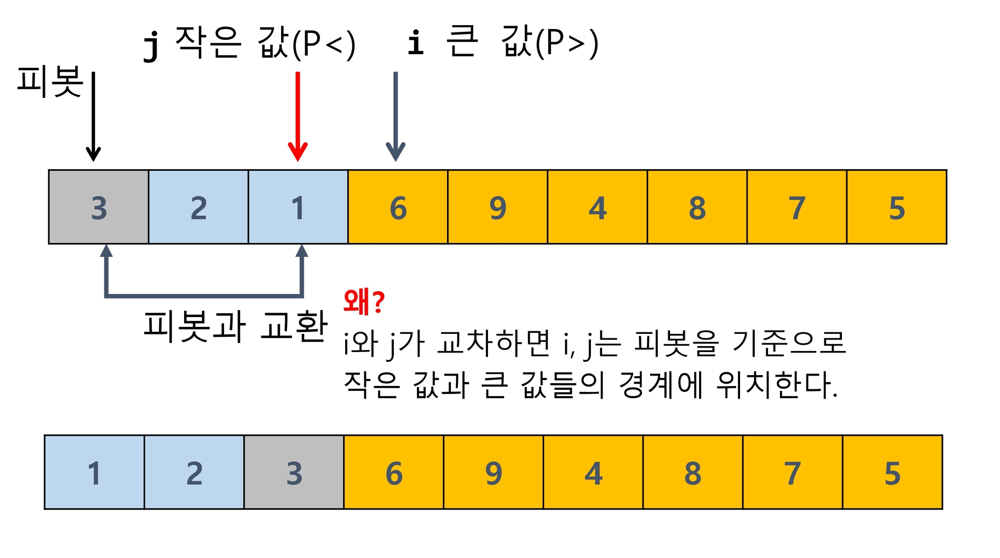
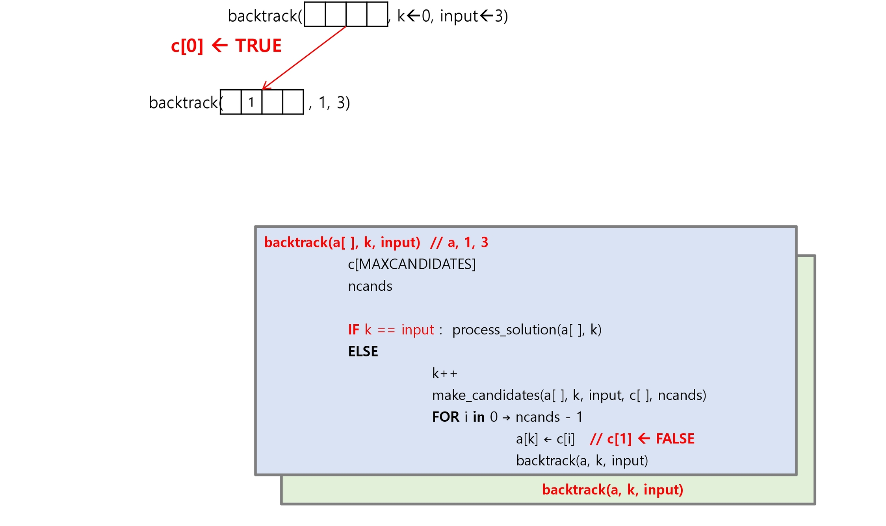
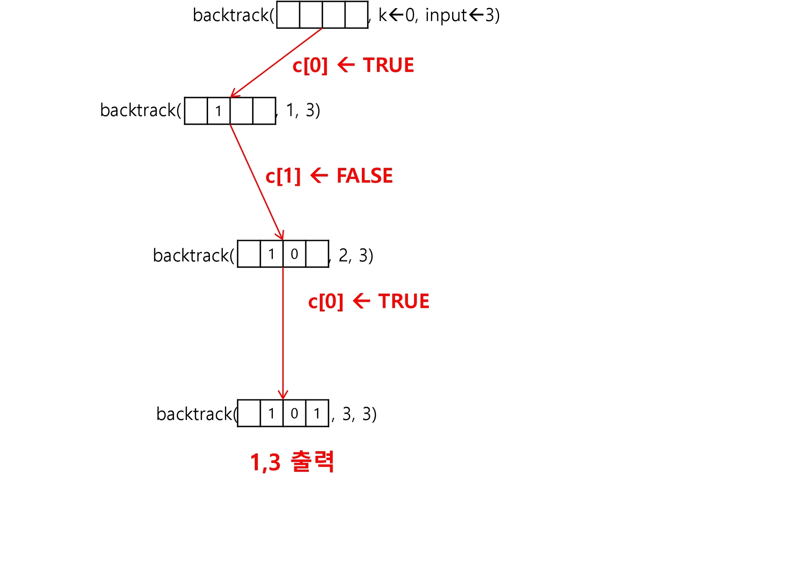

# 분할 정복 & 백트래킹

문제를 분할해서 해결하는 분할 정복(Divide and Conquer) 기법을 이해하고 대표적인 알고리즘인 퀵 정렬과 병합 정렬에 대해 학습한다. 

상태 공간 트리의 모든 노드를 검색하는 백트래킹에 대해 학습한다.

이진 트리(Binary Tree)의 특성을 이해하고 이진 트리의 중요한 연산인 탐색, 삽입, 삭제 알고리즘을 학습한다.


## 분할 정복


### 문제 제시 : 가짜 동전 찾기

n개의 동전들 중에 가짜 동전이 하나 포함되어 있다. 

가짜 동전은 진짜 동전에 비해 아주 조금 가볍다. 진짜 동전들의 무게가 동일하다고 할 때 양팔 저울을 이용해서 가짜 동전을 찾아보자. 

양팔 저울을 최소로 사용해서 가짜 동전을 찾는 방법은 무엇인가? 

예를 들어 동전이 24(진짜 23, 가짜 1)개 있다면?

- 반 나누고 계속 가벼운쪽을 올려놓고 반복하다가 마지막에 가벼운 쪽


### 분할 정복 기법

#### 유래

1805년 12월 2일 아우스터리츠 전투에서 나폴레옹이 사용한 전략 

전력이 우세한 연합군을 공격하기 위해 나폴레옹은 연합군의 중앙부로 쳐들어가 연합군을 둘로 나눔. 

둘로 나뉜 연합군을 한 부분씩 격파함.

#### 설계 전략 

분할(Divide) : 해결할 문제를 여러 개의 작은 부분으로 나눈다. 

정복(Conquer) : 나눈 작은 문제를 각각 해결한다. 

통합(Combine) : (필요하다면) 해결된 해답을 모은다.

#### Top-down approach


#### 반복(Iterative) 알고리즘: O(n)

$$
C^2 = C \times C \\
C^3 = C \times C \times C \\
...\\
C^n = C \times C \times C ...C
$$

```pseudocode
Iterative_Power(x, n)
	result ← 1
	
	FOR i in 1 → n
		result ← result * X

	RETURN result
```

#### 분할 정복 기반의 알고리즘 : O(log<sub>2</sub>n)


```pseudocode
Recursive_Power(x, n)
	IF n == 1 : RETURN x
    IF n is even
		y ← Recursive_Power(x, n/2)
		RETURN y * y 
    ELSE
		y ← Recursive_Power(x, (n-1)/2) 
		RETURN y * y * x
```


### 병합 정렬(Merge Sort)

여러 개의 정렬된 자료의 집합을 병합하여 한 개의 정렬된 집합으로 만드는 방식

분할 정복 알고리즘 활용

- 자료를 최소 단위의 문제까지 나눈 후에 차례대로 정렬하여 최종 결과를 얻어냄.
- top-down 방식 

시간 복잡도

- O(n log n)

#### 병합 정렬 과정 

{69, 10, 30, 2, 16, 8, 31, 22}를 병합 정렬하는 과정 

##### 분할 단계

전체 자료 집합에 대하여, 최소 크기의 부분집합이 될 때까지 분할 작업을 계속한다.


##### 병합 단계

2개의 부분집합을 정렬하면서 하나의 집합으로 병합 

8개의 부분집합이 1개로 병합될 때까지 반복함


#### 알고리즘

##### 분할 과정

```pseudocode
merge_sort(LIST m) 
	IF length(m) == 1 : RETURN m
    
    LIST left, right 
    middle ← length(m) / 2 
    FOR x in m before middle 
    	add x to left
    FOR x in m after or equal middle
    	add x to right
        
    left < merge_sort(left) 
    right < merge_sort(right) 
    
    RETURN merge(left, right)
```

##### 병합 과정

```pseudocode
merge(LIST left, LIST right)  
	LIST result
	
	WHILE length(left) > 0 OR length(right) > 0  // 둘다 있다면
    	IF length(left) > O AND length(right) > 0
        	IF first(left) <= first(right)      // 왼쪽이 작으면 왼쪽거
				append popfirst(left) to result
			ELSE                                // 반대면 오른쪽
				append popfirst(right) to result 
		ELIF length(left) > 0
			append posfirst(left) to result 
		ELIF length(right) > 0
			append popfirst(right) to result 
	RETURN result
```


### 퀵 정렬

주어진 배열을 두 개로 분할하고, 각각을 정렬한다. 

- 병합 정렬과 동일?

#### 병합 정렬과 다른 점 

1. 병합 정렬은 그냥 두 부분으로 나누는 반면에, 퀵 정렬은 분할할 때, 기준 아이템(pivot item) 중심으로, 이보다 작은 것은 왼편, 큰 것은 오른편에 위치시킨다.

2. 각 부분 정렬이 끝난 후, 병합정렬은 “병합” 이란 후처리 작업이 필요하나, 퀵 정렬은 필요로 하지 않는다.
   - 항상 좋다는 것은 아니다

#### 알고리즘

```pseudocode
quickSort(A[], l, r)
	if l < r                      // 조건 중요
		s ← partition(a, l, r)    // 피봇의 위치
		quickSort(A[], l, s - 1)
        quickSort(A[], s + 1, r)
```

#### Hoare-Partition 알고리즘

```pseudocode
partition(A[], l, r) 
	p ← A[L]             // p: 피봇 값
	i ← 1, j ← r
    WHILE i ≤ j
    	WHILE i ≤ j and A[i] ≤ p : i++     // 두 개가 만날 때까지, 피봇보다 작은애 찾기
    	WHILE i ≤ j and A[j] ≥ p : j--     // 피봇보다 큰애 찾기
    	IF i < j : swap(A[i], A[j])    // 떨어져 있다면 자리 바꿈
        
    swap(A[L], A[j])
    RETURN j
```

##### 아이디어

P(피봇)값들 보다 큰 값은 오른쪽, 작은 값들은 왼쪽 집합에 위치하도록 한다.


피봇을 두 집합의 가운데에 위치시킨다


##### 피봇 선택 

왼쪽 끝/오른쪽 끝/임의의 세개 값 중에 중간 값


##### 정렬하기




##### 왼쪽 구간 작업

1이 새롭게 피봇되어서 위의 작업 반복

-> 조건상 i r 이 교차되기 때문에 끝


##### 오른쪽 작업


##### 코드

```python
def partition(l, r):
    pivot = A[l]
    i, j = l, r
    while i <= j:
        while i <= j and A[i] <= pivot:
            i += 1
        while i <= j and A[j] >= pivot:
            j -= 1
        if i < j:
            A[i], A[j] = A[j], A[i]
    A[l], A[j] = A[j], A[l]
    return j


def qsort(l, r):
    if l < r:
        s = partition(l, r)
        qsort(l, s-1)
        qsort(s+1, r)


A = [7, 2, 5, 3, 7, 5]
N = len(A)
qsort(0, N-1)
print(A)

# [2, 3, 5, 5, 7, 7]
```

#### Lomuto partition 알고리즘

```pseudocode
partition(A[], p, r)
	x ← A[r] 
	i ← p - 1 
	
	FOR j in p → r - 1 
		IF A[j] ≤ x 
			i++, swap(A[i], A[j]) 
			
	swap(A[i+1], A[r]) 
	RETURN i + 1
```


피봇(5)보다 큰 값 나오면 i가 멈추고 j만 감

i가 피봇보다 큰 값의 시작 위치, 작은 애들중에 마지막 위치 가리킴

i j 사이에는 피봇보다 큰 값이 보여있게 됨

j 가 가다가 피봇보다 작은값 만나면 i가 한칸가고 i 앞 숫자랑 j 뒷 숫자라 교환


### 문제 제시 : 병뚜껑 속의 숫자 게임

술래가 병뚜껑 속 숫자를 확인한 후, 다음 사람부터 숫자를 맞히기 시작한다. 술래는 Up 또는 Down을 통해 게임에 참여한 사람들이 병뚜껑 속 숫자에 점점 가까워질 수 있도록 힌트를 제시한다.

예시) * 병뚜껑 속 숫자가 3일 경우 첫 번째 사람이 14를 외쳤다면! ▶ 술래는 DOWN'! ▶ 두 번째 사람이 2를 외쳤다면! ▶ 술래는 'UP'! ▶ 세 번째 사람이 4를 외쳤다면! ▶ 술래는 'DOWN'! ▶ 결국 네 번째 사람이 병뚜껑 속 숫자인 3을 부를 수 밖에 없으므로 벌주 당첨!

이 게임은 숫자를 맞히는 게 아니라 피하는 게 핵심!! 

최대로 빨리 당첨 되려면 어떻게 하면 될까?


### 이진검색

자료의 가운데에 있는 항목의 키 값과 비교하여 다음 검색의 위치를 결정하고 검색을 계속 진행하는 방법

- 목적 키를 찾을 때까지 이진 검색을 순환적으로 반복 수행함으로써 검색 범위를 반으로 줄여가면서 보다 빠르게 검색을 수행함

이진 검색을 하기 위해서는 자료가 정렬된 상태여야 한다.

#### 검색 과정

1. 자료의 중앙에 있는 원소를 고른다. 
2. 중앙 원소의 값과 찾고자 하는 목표 값을 비교한다. 
3. 목표 값이 중앙 원소의 값보다 작으면 자료의 왼쪽 반에 대해서 새로 검색을 수행하고, 크다면 자료의 오른쪽 반에 대해서 새로 검색을 수행한다. 
4. 찾고자 하는 값을 찾을 때까지 1~3의 과정을 반복한다.

#### 예) 이진 검색으로 20을 찾는 경우


#### 알고리즘

##### 반복구조


```pseudocode
binarySearch(n, S[], key) 
low ← 0
high ← n - 1
                                        // low는 구간의 왼쪽 끝, high는 오른쪽 끝
WHILE low <= high                       // < 가 아니라 <= 써야함, 역전되면 값이 없는것
		mid + low + (high - low) / 2
		
		IF S[mid] == key
				RETURN mid
        ELIF S[mid] > key
				high ← mid - 1
		ELSE
				low ← mid + 1
RETURN -1
```

##### 재귀구조

```pseudocode
binarySearch(a[], low, high, key)
	IF low > high
		RETURN -1
	ELSE
		mid ← (low + high) / 2 
		IF key == a[mid]
			RETURN mid 
		ELIF key < a[mid]
			RETURN binarySearch(a[], low, mid - 1, key)
        ELSE
			RETURN binarySearch(a[], mid + 1, high, key)
```


### 분할 정복의 활용

병합 정렬은 외부 정렬의 기본이 되는 정렬 알고리즘이다. 또한, 멀티코어 (MultiCore) CPU 나 다수의 프로세서에서 정렬 알고리즘을 병렬화하기 위해 병합 정렬 알고리즘이 활용된다. 

퀵 정렬은 매우 큰 입력 데이터에 대해서 좋은 성능을 보이는 알고리즘이다.

### 연습문제1

배열의 데이터를 퀵 정렬하는 함수를 작성하고 테스트 해보시오. 

입력 예 

- 11, 45, 23, 81, 28, 34 
- 11, 45, 22, 81, 23, 34, 99, 22, 17, 8
- 1, 1, 1, 1, 1, 0, 0, 0, 0, 0


## 백트래킹


### 문제 제시 : N-Queen 문제

nxn 서양 장기판에서 배치한 Queen 들이 서로 위협하지 않도록 n개의 Queen을 배치하는 문제 

- 어떤 두 Queen 도 서로를 위협하지 않아야 한다. 

- Queen을 배치한 n개의 위치는?


### 백트래킹(Backtracking) 개념 

여러 가지 선택지 (옵션)들이 존재하는 상황에서 한가지를 선택한다

이 선택이 이루어지면 새로운 선택지들의 집합이 생성된다

이런 선택을 반복하면서 최종 상태에 도달한다.

- 올바른 선택을 계속하면 목표 상태(goal state)에 도달한다.

#### 예) 당첨 리프 노드 찾기 

루트에서 갈 수 있는 노드를 선택한다. 

꽝 노드까지 도달하면 최근의 선택으로 되돌아와서 다시 시작한다. 

더 이상의 선택지가 없다면 이전의 선택지로 돌아가서 다른 선택을 한다. 

루트까지 돌아갔을 경우 더 이상 선택지가 없다면 찾는 답이 없다.


#### 백트래킹과 깊이 우선 탐색과의 차이 

어떤 노드에서 출발하는 경로가 해결책으로 이어질 것 같지 않으면 더 이상 그 경로를 따라가지 않음으로써 시도의 횟수를 줄임. (Prunning 가지치기)

깊이 우선 탐색이 모든 경로를 추적하는데 비해 백트래킹은 불필요한 경로를 조기에 차단.

깊이 우선 탐색을 가하기에는 경우의 수가 너무나 많음. 즉, N! 가지의 경우의 수를 가진 문제에 대해 깊이 우선 탐색을 가하면 당연히 처리 불가능한 문제.

백트래킹 알고리즘을 적용하면 일반적으로 경우의 수가 줄어들지만 이 역시 최악의 경우에는 여전히 지수함수 시간(Exponential Time)을 요하므로 처리 불가능

- 반드시 효과가 좋아진다는 보장은 없다

#### 8-Queens 문제 

퀸 8개를 크기의 체스판 안에 서로를 공격할 수 없도록 배치하는 모든 경우를 구하는 문제

후보 해의 수:
$$
_{64}C_{8} = \frac{64!}{8!(64-8)!} = 4,426,165,368
$$
실제 해의 수 : 이 중에서 실제 해는 92개 뿐

즉, 44억 개가 넘는 후보 해의 수 속에서 92개를 최대한 효율적으로 찾아내는 것이 관건

4-Queens 문제로 축소해서 생각해 보자

- 같은 행에 위치할 수 없다. 
- 모든 경우의 수 : 4x4x4x4 = 256


루트 노드에서 리프(leaf) 노드까지의 경로는 해답후보(candidate solution)가 되는데, 깊이 우선 검색을 하여 그 해답후보 중에서 해답을 찾을 수 있다.

그러나 이 방법을 사용하면 해답이 될 가능성이 전혀 없는 노드의 후손 노드 (descendant)들도 모두 검색해야 하므로 비효율적이다.

모든 후보를 검사?

- No!

백트래킹 기법

- 어떤 노드의 유망성을 점검한 후에 유망(promising)하지 않다고 결정되면 그 노드의 부모로 되돌아가(backtracking) 다음 자식 노드로 감
- 어떤 노드를 방문하였을 때 그 노드를 포함한 경로가 해답이 될 수 없으면 그 노드는 유망하지 않다고 하며, 반대로 해답의 가능성이 있으면 유망하다고 한다.
- 가지치기(prunning): 유망하지 않는 노드가 포함되는 경로는 더 이상 고려하지 않는다.

백트래킹을 이용한 알고리즘은 다음과 같은 절차로 진행된다. 

1. 상태 공간 트리의 깊이 우선 검색을 실시한다.
2. 각 노드가 유망한지를 점검한다
3. 만일 그 노드가 유망하지 않으면, 그 노드의 부모 노드로 돌아가서 검색을 계속한다.

#### 일반 백트래킹

##### 알고리즘

```pseudocode
checknode (node v)
	IF promising( v )                 // 유망한가
    	If there is a solution at v   // 최종해인지
			write the solution
		ELSE                          // 최종해 아니면
			FOR each child u of v     // 다음 자식노드들을 대상으로 다음 단계 진행
				checknode( u )
				                      // 유망하지 않으면 리턴
```


##### 상태 공간 트리


많이 잘라짐

##### 깊이 우선 검색 vs 백트래킹

순수한 깊이 우선 검색 = 155 노드

백트래킹 = 27 노드

#### 상태공간트리 구축

```pseudocode
bool bactrack(선택 집합, 선택한 수, 모든 선택수)
{
	if (선택한 수 == 모든 선택수) // 더 이상 탐색할 노드가 없다.
	{
		찾는 솔루션인지 체크;
		return 결과;
	}
	현재 선택한 상태집합에 포함되지 않는 후보 선택들(노드) 생성
	
	모든 후보 선택들에 대해
	{
		선택 집합에 하나의 후보선택을 추가 
		선택한 수 = 선택한 수 + 1
		결과 = backtrack 호출(선택집합, 선택한 수, 모든 선택수)
		
		if (결과 == 성공)
			return 성공; //성공한 경우 상위로 전달
	}
	return 실패;
}
```

##### {1,2,3}의 powerset을 구하는 백트래킹 알고리즘

```pseudocode
backtrack(a[ ], k, input)
		C[MAXCANDIDATES]
        ncands

		IF k == input : process_solution(a[ ], k)
        ELSE
			k++
            make_candidates(a[ ], k, input, c[ ], ncands)
            FOR i in 0 → ncands - 1
					a[k] ← C[i]
                    backtrack(a, k, input)
                    
main()
		a[MAX]          // powerset을 저장할 배열 
		backtrack(a[ ], 0, 3) // 3개의 원소를 가지는 powerset
```

```pseudocode
make_candidates(a[], k, n, c[], ncands)
	c[0] ← TRUE 
	c[1] ← FALSE
    ncands ← 2
    
process_solution(a[], k)
	FOR i in 1 → k
			IF a[i] == TRUE : print( i )
```








##### 백트래킹을 이용하여 순열 구하기

접근 방법은 앞의 부분집합 구하는 방법과 유사하다. 

```pseudocode
backtrack(a[ ], k, input) 
	c[MAXCANDIDATES]
    ncands 
    
    IF k == input : process_solution(a[ ], k)
    ELSE
    		k++
            make_candidates(a[ ], k, input, c[ ], ncands)
            FOR i in 0 → ncands - 1
            		a[k] = c[i]
                    backtrack(a, k, input)
                    
main()
		a[MAX]                    // 순열을 저장할 배열
        backtrack(a[ ], 0, 3)     // 3개의 원소를 가지는 순열
```

```pseudocode
make_candidates(a[], k, n, c[], ncands)
	in_perm[NMAX] ← FALSE

	FOR i in 1 → k- 1
		in_perm[ a[i] ] ← TRUE

	ncand ← 0
    FOR i in 1 → n
    	IF in_perm[i] == FALSE
			c[ncands] ← i
            ncands++


process_solution(a[], k)
	FOR i in 1 → k : print( a[i] )
```


### 연습문제2

{1,2,3,4,5,6,7,8,9,10}의 powerset 중 원소의 합이 10인 부분집합을 모두 출력하시오.