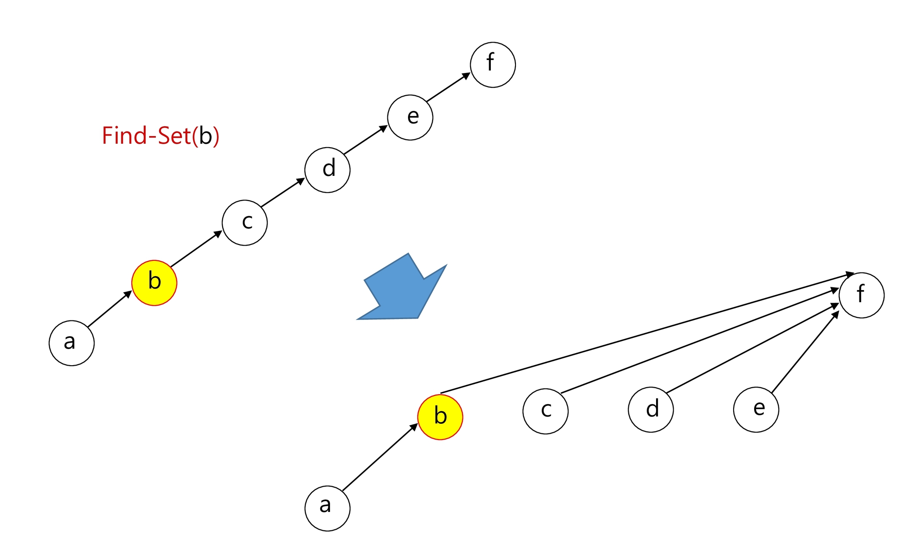
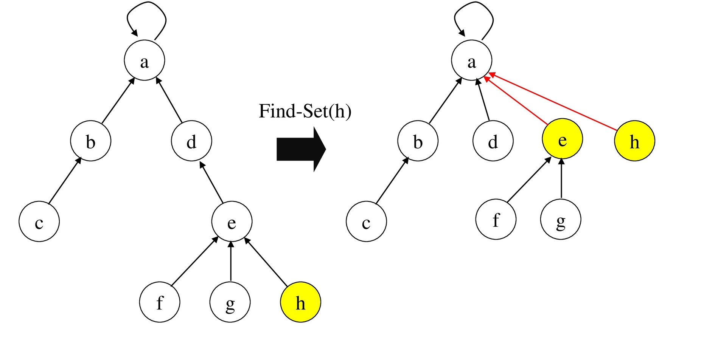

# 그래프 & 백트래킹

## 그래프

### 그래프 기본

실 세계 문제를 그래프로 추상화해서 해결하는 방법을 학습한다. 

- 그래프 탐색 기법인 BFS와 DFS에 대해 학습한다. 

- 그래프 알고리즘에 활용되는 상호배타 집합(Disjoint-Sets)의 자료구조에 대해 학습한다.

- 최소 신장 트리(Minimum Spanning Tree)를 이해하고 탐욕 기법을 이용해서 그래프에서 최소 신장 트리를 찾는 알고리즘을 학습한다.
- 그래프의 두 정점 사이의 최단 경로(Shortest Path)를 찾는 방법을 학습한다.

#### 문제 제시 : 친구 관계

A의 친구는 B다.

C의 친구는 E, F이다. 

(D - E), (F - G), (N - B, I, L), (G - A, C, D, H), (I - J, H), (B - D, K, L), (M - I, J), ( E - A, H), (C - B, I, L), (B - 1), (J - A, G) 

A의 친구 중에 친구가 가장 많은 친구는 누구인가?

#### 그래프

그래프는 아이템(사물 또는 추상적 개념)들과 이들 사이의 연결 관계를 표현한다. 

그래프는 정점(Vertex)들의 집합과 이들을 연결하는 간선(Edge)들의 집합으로 구성된 자료 구조 

- |V| : 정점의 개수, |E| : 그래프에 포함된 간선의 개수
- |V| 개의 정점을 가지는 그래프는 최대 |V| (|V| - 1) / 2 간선이 가능

​	예> 5개 정점이 있는 그래프의 최대 간선 수는 10(= 5*4/2) 개이다.

선형 자료구조나 트리 자료구조로 표현하기 어려운 N:N 관계를 가지는 원소들을 표현하기에 용이하다

#### 그래프 유형

무향 그래프(Undirected Graph)

유향 그래프(Directed Graph)

가중치 그래프(Weighted Graph)

사이클 없는 방향 그래프(DAG, Directed Acyclic Graph)


완전 그래프

- 정점들에 대해 가능한 모든 간선들을 가진 그래프 


부분 그래프 

- 원래 그래프에서 일부의 정점이나 간선을 제외한 그래프

#### 인접 정점

인접(Adjacency) 

- 두 개의 정점에 간선이 존재(연결됨)하면 서로 인접해 있다고 한다. 
- 완전 그래프에 속한 임의의 두 정점들은 모두 인접해 있다.


#### 그래프 경로

경로란 간선들을 순서대로 나열한 것 

- 간선들: (0, 2), (2, 4), (4, 6) 
- 정점들: 0 - 2 - 4 - 6

경로 중 한 정점을 최대한 한번만 지나는 경로를 단순경로라 한다.

- 0 - 2 - 4 - 6, 0 - 1 - 6

시작한 정점에서 끝나는 경로를 사이클(Cycle)이라고 한다.

- 1 - 3 - 5 - 1

#### 그래프 표현

간선의 정보를 저장하는 방식, 메모리나 성능을 고려해서 결정

인접 행렬 (Adjacent matrix) 

- |V| x |V| 크기의 2차원 배열을 이용해서 간선 정보를 저장
- 배열의 배열(포인터 배열) 

인접 리스트 (Adjacent List)

- 각 정점마다 해당 정점으로 나가는 간선의 정보를 저장 

간선의 배열

- 간선(시작 정점, 끝 정점)을 배열에 연속적으로 저장

#### 인접행렬

두 정점을 연결하는 간선의 유무를 행렬로 표현

- |V| x |V| 정방 행렬

- 행 번호와 열 번호는 그래프의 정점에 대응
- 두 정점이 인접되어 있으면 1, 그렇지 않으면 0으로 표현
- 무향 그래프
  - i번째 행의 합 = i번째 열의 합 = V<sub>i</sub> 의 차수 
  - 예) 친구관계
- 유향 그래프
  - 보통 행: 출발 열: 도착
  - 행 i의 합 = V<sub>i</sub> 의 진출차수
  - 열 i의 합 = V<sub>i</sub> 의 진입차수
  - 예) 비상연락망


##### 단점


빈공간이 많다

정점이 1000 넘어가면 힘들다 


이 형식은 탐색이 힘듬

#### 인접 리스트

각 정점에 대한 인접 정점들을 순차적으로 표현

하나의 정점에 대한 인접 정점들을 각각 노드로 하는 연결 리스트로 저장


##### 무방향 그래프


노드 수 = 간선의 수 * 2 

각 정점의 노드 수 = 정점의 차수

#### 방향 그래프


노드 수 = 간선의 수 

각 정점의 노드 수 = 정점의 진출 차수

### DFS

#### 문제 제시 : 친구관계

다음과 같이 친구 관계를 그래프로 표현하였다. 

A로부터 시작해서 한 명의 친구에게만 소식을 전달, 전달 할 수 있다면 최대 몇 명의 친구가 소식을 전달 받을 수 있을까? (단 소식을 전달 받은 친구한테는 소식을 재 전달 할 수 없다.) 

A로부터 시작해서 친구들에게 동시에 소식을 전달할 수 있다고 할 때, 가장 늦게 전달 받는 사 람은 누구일까? (단 친구에게 소식을 전달하는 속도는 동일하다)


#### 그래프 순회(탐색)

그래프 순회는 비선형구조인 그래프로 표현된 모든 자료(정점)를 빠짐없이 탐색하는 것을 의미한다.

두 가지 방법

- 깊이 우선 탐색(Depth First Search, DFS) 
- 너비 우선 탐색(Breadth First Search, BFS)

#### DFS(깊이우선탐색)

시작 정점의 한 방향으로 갈 수 있는 경로가 있는 곳까지 깊이 탐색해 가다가 더 이상 갈 곳이 없게 되면, 가장 마지막에 만났던 갈림길 간선이 있는 정점으로 되돌아와서 다른 방향의 정점 으로 탐색을 계속 반복하여 결국 모든 정점을 방문하는 순회방법

가장 마지막에 만났던 갈림길의 정점으로 되돌아가서 다시 깊이 우선 탐색을 반복해야 하므로 후입선출 구조의 스택 사용 (재귀도 가능)

재귀로 풀면 너무 커져버리는 경우가 있어서 이럴 때는 반복 구조로 풀기

#### 스택

스택(stack)의 특성

- 물건을 쌓아 올리듯 자료를 쌓아 올린 형태의 자료구조이다.
- 선형구조 : 자료 간의 관계가 1대1의 관계를 갖는다.
  - 비선형구조 : 자료 간의 관계가 1대N의 관계를 갖는다.(예 : 트리)
- 마지막에 삽입한 자료를 가장 먼저 꺼낸다.
  - 후입선출(LIFO, Last-In-First-Out) 이라고 부른다.

##### 스택의 구현

###### 필요한 저장소와 연산 

- 자료를 선형으로 저장할 저장소 

  - C언어에서는 배열을 사용할 수 있다.
  - 저장소 자체를 스택이라 부르기도 한다.
  - 스택에서 마지막 삽입된 원소의 위치를 top이라 부른다.

- 연산

  | push    | 저장소에 자료를 삽입(저장)한다.                |
  | ------- | ---------------------------------------------- |
  | pop     | 저장소에서 자료를 꺼낸다. (삽입한 자료의 역순) |
  | isEmpty | 스택이 공백인지 아닌지를 확인하는 연산         |
  | peek    | 스택의 top에 있는 item(원소)을 반환하는 연산.  |

   

###### 삽입/삭제 과정 

- 빈 스택에 원소 A,B,C를 차례로 삽입 후 한번 삭제하는 연산과정


###### push 알고리즘 

- top은 스택에서 마지막 자료의 위치를 가리킨다. 

  ```pseudocode
  push(s, x) 
  	top + top + 1;
      if top >= STACK_SIZE
      	error overflow;
      else
      	S[top] ← x;
  ```

###### pop 알고리즘

```pseudocode
pop( s ) 
	if top < 0
    	error underflow;
	else
    	top = top - 1;
        return S[top + 1];
```

#### 알고리즘

##### 재귀

```pseudocode
DFS_Recursive(G, V)

	visited[ v ] ← TRUE      // v 방문 설정
	
	FOR each all w in adjacency( G, v )
    	IF visited[w]  ≠  TRUE
			DFS_Recursive(G, W)
```

##### 반복

```pseudocode
STACK s
visited[ ]
DFS(v)
	push( s, v )
    WHILE NOT isEmpty( s )
		V ← pop(s)
        IF NOT visited[v]
        	visit( v )
            FOR each w in adjacency( v )
            	IF NOT visited[w]
                	push(s, w)
```

1. 지나간 정점 저장(중복된 저장이 생길 수 있음)
2. 갈림길을 직접 저장(건너뛰기 때문에 구체적 경로는 파악 힘듬)

#### DFS 예

갈림길을 저장하는 케이스

```pseudocode
STACK s
visited[ ]
DFS(V)
	push( s, v )
    WHILE NOT isEmpty( s )          // 갈곳이 없을 때 스택에 가면 
    	v ← pop(s)                  // 가지 않고 남겨둔 정점들 있다
        IF NOT visited[v]
        	visit( v )
            FOR each w in adjacency( v )
            	IF NOT visited[w]
                	push(s, w) 
```


단점 : 중복되어서 들어감

```pseudocode
STACK s
visited[ ]
DFS(V)
	push( s, v )
    visited[v] = True        // stack에 들어간적 없으면 푸시해
    WHILE NOT isEmpty( s )
		V ← pop(s)
        visit( v )
        FOR each w in adjacency( v )
        	IF NOT visited[w]
        	push(s, w)
            visited[v] = True
```

#### 연습문제1 -DFS

다음은 연결되어 있는 두 개의 정점 사이의 간선을 순서대로 나열 해 놓은 것이다. 모든 정점을 깊이 우선 탐색하여 화면에 깊이 우선 탐색 경로를 출력하시오. 시작 정점을 1로 시작하시오.

- 1, 2, 1, 3, 2, 4, 2, 5, 4, 6, 5, 6, 6, 7, 3, 7
- 출력 결과의 예는 다음과 같다.
  - 1-2-4-6-5-7-3
  - 1-3-7-6-5-2-4


5521_상원이의 생일파티

- BFS, DFS 다 가능

### BFS

너비우선탐색은 탐색 시작점의 인접한 정점들을 먼저 모두 차례로 방문한 후에, 방문했던 정점을 시작점으로 하여 다시 인접한 정점들을 차례로 방문하는 방식

인접한 정점들에 대해 탐색을 한 후, 차례로 다시 너비우선탐색을 진행해야 하므로, 선입선출 형태의 자료구조인 큐를 활용함

#### 큐

##### 큐(Queue)의 특성

- 스택과 마찬가지로 삽입과 삭제의 위치가 제한적인 자료구조
  - 큐의 뒤에서는 삽입만 하고, 큐의 앞에서는 삭제만 이루어지는 구조
- 큐에 삽입한 순서대로 원소가 저장되어, 가장 먼저 삽입된 원소는 가장 먼저 삭제된다.
  - 선입선출구조(FIFO: First In First Out)


##### 큐의 선입선출 구조


rear 마지막 저장된 위치

front가 마지막에 꺼내진 위치

-1부터

##### 큐의 기본 연산

- 삽입: enQueue
-  삭제: deQueue

#### BFS

BFS는 예제 그래프를 붙여진 번호 순서로 탐색함


#### 알고리즘

입력 파라미터: 그래프 G와 탐색 시작점 v

```pseudocode
BFS(G,v) // 그래프 G, 탐색 시작점 v
	큐 생성
    시작점 v를 큐에 삽입
    점 v를 방문한 것으로 표시   // 중복 방지하려고 큐 넣을 때 표시
    WHILE 큐가 비어있지 않은 경우
    	t ← 큐의 첫번째 원소 반환
        FOR t와 연결된 모든 선에 대해
        	u ← t의 이웃점
            u가 방문되지 않은 곳이면,
            u를 큐에 넣고, 방문한 것으로 표시
```


A 꺼내고 BCD 넣기

TTTTFFFFF

BCD


B 꺼내고 EF넣기

TTTTTTFFF

CDEF


C꺼냄


D꺼내고 GHI넣기

TTTTTTTTT

EFGHI

이제 쭉 처리하고 끝


#### 연습문제2 - BFS

다음은 연결되어 있는 두 개의 정점 사이의 간선을 순서대로 나열 해 놓은 것이다. 모든 정점을 너비 우선 탐색하여 화면에 너비 우선탐색 경로를 출력하시오. 시작 정점을 1로 시작하시오.

- 1, 2, 1, 3, 2, 4, 2, 5, 4, 6, 5, 6, 6, 7, 3, 7
- 출력 결과의 예는 다음과 같다. 
  - 1-2-3-4-5-7-6


### 서로소 집합

서로소 또는 상호배타 집합들은 서로 중복 포함된 원소가 없는 집합들이다. 다시 말해 교집합이 없다.

집합에 속한 하나의 특정 멤버를 통해 각 집합들을 구분한다. 이를 대표자 (representative)라 한다.

- `대표원소`

### 상호배타 집합을 표현하는 방법 

`연결 리스트 `

`트리`

### 상호배타 집합 연산 

`Make-Set(x) `

`Find-Set(x) `

`Union(x,y)`

#### 예

`Make-Set(x)` : x가 대표 원소인 집합을 만들어라

`Make-Set(y)`

`Make-Set(a)`

`Make-Set(b)`


`Union(x, y)` : x과 대표원소인 집합과 y가 대표원소인 집합을 합치고 앞에 있는 애를 새로운 대표 원소로

`Union(a, b)`


`Find-Set(y)`  : y가 포함된 집합의 대표원소를 출력해 return x (representative)  

`Find-Set(b)  return a (representative)`


`Union(x, a)`


### 상포 배타 집합 표현 

#### 트리

하나의 집합(a disjoint set)을 하나의 트리로 표현한다. 

자식 노드가 부모 노드를 가리키며 루트 노드가 대표자가 된다.

- 자기 자신을 가리키면 대표 원소


대표 원소 갯수 - 트리 갯수

##### 연산 예

###### Make-set(a) ~ Make-Set(f)


다 자기 자신을 가리킴

tree `[0, 1, 2, 3, 4, 5, 6]`

정점을 인덱스, 가리키는 값이 내부

###### Union(c, d), Union(e, f)


tree `[0, 1, 2, 3, 3, 5, 5]`

###### Union(d, f)

둘다 대표원소가 아님

d의 대표원소를 찾고 `r1 <- find_set(d)`

f의 대표원소를 찾고 `r2 <- find_set(f)`

f의 대표원소를 d의 대표원소로 교체 `tree[r2] <- r1`


`tree [0, 1, 2, 3, 3, 3, 5]`

| 첨자 | 1    | 2    | 3    | 4    | 5    | 6    |
| ---- | ---- | ---- | ---- | ---- | ---- | ---- |
| 정점 | a    | b    | c    | d    | e    | f    |
| 부모 | 1    | 2    | 3    | 3    | 3    | 5    |

```pseudocode
find_set(v)
	while tree[v] != v: # v의 트리가 v와 같지 않다면
		v = tree[v]     # 트리에 있던 걸 새로운 부모로 헤서 반복
    return v            # 반복될 때 대표 원소 나옴 # 6->5 5->3 3->3 : 3
```

```pseudocode
 Union(a, b)
 	r1 <- find_set(a)
 	r2 <- find_set(b)
 	tree[r2] = r1
```

##### 상호배타 집합에 대한 연산

###### Make-Set(x)

유일한 멤버 x를 포함하는 새로운 집합을 생성하는 연산 

```pseudocode
Make-Set(x)
	p[x] = x
```

 ###### Find_Set(x)

x를 포함하는 집합을 찾는 연산

```pseudocode
// 재귀
Find-Set(x)
		IF X == p[x] : RETURN X
        ELSE         : RETURN Find_Set(p[x])
```

``` pseudocode
// 반복, 이게 더 빠름
Find_set(x)
	while P[x] != x: 
		x = P[x]    
    return x
```

 ###### Union(x,y)

x와 y를 포함하는 두 집합을 통합하는 연산

```pseudocode
 Union(x, y)
 		p[Find-Set(y)] ← Find-Set(x)
```

###### 연산 예

`make-set(1)-(6)`

| index | 1    | 2    | 3    | 4    | 5    | 6    |
| ----- | ---- | ---- | ---- | ---- | ---- | ---- |
| P     | 1    | 3    | 3    | 4    | 5    | 6    |

`union(1,3) `

3의 대표 원소 - 자기자신(3) 대표원소 1로 바꿈

| index | 1    | 2    | 3    | 4    | 5    | 6    |
| ----- | ---- | ---- | ---- | ---- | ---- | ---- |
| P     | 1    | 3    | 1    | 4    | 5    | 6    |

`union(2,3)`

3번의 대표 원소 찾음->1 1의 대표 원소 2로

| index | 1    | 2    | 3    | 4    | 5    | 6    |
| ----- | ---- | ---- | ---- | ---- | ---- | ---- |
| P     | 2    | 3    | 1    | 4    | 5    | 6    |

`union(5,6)`

| index | 1    | 2    | 3    | 4    | 5    | 6    |
| ----- | ---- | ---- | ---- | ---- | ---- | ---- |
| P     | 2    | 3    | 1    | 4    | 5    | 5    |

`findset(6)`

5 출력

주의: Union할때 p[Find-set(y)]로 하는게 아니라 p[y]로 하는 실수 많이 함

###### 문제점



이렇게 줄이는 작업 있었으면 좋겠다

##### 연산의 효율을 높이는 방법

Rank를 이용한 Union

- 각 노드는 자신을 루트로 하는 subtree의 높이를 랭크 Rank라는 이름으로 저장한다
- 두 집합을 합칠 때 rank가 낮은 집합을 rank가 높은 집합에 붙인다 

Path compression 

- Find-Set을 행하는 과정에서 만나는 모든 노드들이 직접 root를 가리키도록 포인터를 바꾸어 준다.

###### 랭크를 이용한 Union의 예


Make_Set() 연산

Make_Set( x ): 유일한 멤버 x를 포함하는 새로운 집합을 생성하는 연산

```pseudocode
p[x] : 노드 x의 부모 저장
rank[x] : 루트 노드가 x인 트리의 랭크 값 저장

Make_Set(x) 
p[x] ← x
rank[x] ← 0
```

Find_Set 연산 

Find_Set( x ) : x를 포함하는 집합을 찾는 오퍼레이션 

```pseudocode
Find_Set(x) 
	IF X ≠ p[x]   // x가 루트가 아닌 경우
    		p[x] ← Find_Set(p[x])
    RETURN p[x] 
```

Find_set 연산은 특정 노드에서 루트까지의 경로를 찾아 가면서 노드의 부모 정보를 갱신 한다.

Union 연산

```pseudocode
Union(x,y): 
	Link( Find_Set(x), Find_Set(y) )
```

```pseudocode
Link(x, y)
		IF rank[x] > rank[y]
        		p[y] + x            // rank는 트리의 높이
        ELSE 
        		p[x] + y
                IF rank[x] == rank[y]
                		rank[y]++
```

x21 y S e sgo Q112|0|4 Union(x, y)


###### Path Compression의 예



거쳐서 가는 애를 직접 가게

### 최소 신장 트리(MST)

그래프에서 최소 비용 문제

1. 모든 정점을 연결하는 간선들의 가중치의 합이 최소가 되는 트리
   - MST
2. 정점 사이의 최소 비용의 경로 찾기
   - 다익스트라

신장 트리

- n개의 정점으로 이루어진 무방향 그래프에서 n개의 정점과 n-1개의 간선으로 이루어진 트리

최소 신장 트리 (Minimum Spanning Tree)

- 가중치가 있는 그래프에서 따짐

- 무방향 가중치 그래프에서 신장 트리를 구성하는 간선들의 가중치의 합이 최소인 신장 트리

#### MST 표현


인접 행렬에 1대신 가중치 (무방향이라 대칭)

인접 리스트는 인접한 정점 번호랑 가중치를 같이 쌍으로 저장


`그래프`

- 트리를 구성한 다음에 트리 자체로만 구성

`간선들의 배열`

- MST에 대한 정보 따로 뽑아내서

`인접 리스트`

부모 자식 관계와 가중치에 대한 배열

- 트리

#### Prim 알고리즘

하나의 정점에서 연결된 간선들 중에 하나씩 선택하면서 MST를 만들어 가는 방식

탐욕 알고리즘의 하나

이익이 되는 것을 선택

1. 임의 정점을 하나 선택해서 시작
   - 어차피 모든 정점 MST에 포함이라 아무거나 해도됨
2.  선택한 정점과 인접하는 정점들 중의 최소 비용의 간선이 존재하는 정점을 선택
3. 모든 정점이 선택될 때 까지 1, 2 과정을 반복

서로소인 2개의 집합(2 disjoint-sets) 정보를 유지

- 트리 정점들(tree vertices) - MST를 만들기 위해 선택된 정점들

- 비트리 정점들(nontree vertices) - 선택 되지 않은 정점들

##### 적용 예


0과 인접한 애들중 비용 최소인점 - 31


0, 2 얘네들과 인접한 비용중 최소 - 21


셋과 인접한 비용중 최소 - 25


4과 인접한 비용중 최소인애 - 46

32 안되는 이유 - 사이클을 만들면 안됨


이러면 완성 이 간선들 가중치의 합이 답


##### 알고리즘 코드

```pseudocode
MST_PRIM(G, r)                  // G: 그래프, r: 시작 정점
	FOR u in G.V
		u.key ← ∞               // u.key: u에 연결된 간선중 최소 가중치 MST 연결 비용
    	u.π ← NULL              // u. : 트리에서 u의 부모, MST의 누구와 연결되었는가
	r.key ← 0 
	Q ← G.V                     // 우선순위 Q에 모든 정점 넣는다. 비용이 제일 작은
    WHILE Q 0                   // 빈 Q 가 아닐동안 반복
    	u ← Extract_MIN(Q)      // key 값이 가장 작은 정점 가져오기
        FOR v in G.Adj[u]                   // u의 인접 정점들
        	IF v ∈ Q AND W(u, v) < v.key   // Q에 있는 v의 key값 갱신
				V.π ← eu
                v.key ← w(u, v)
```


|      | 0    | 1    | 2    | 3    | 4    | 5    | 6    |
| ---- | ---- | ---- | ---- | ---- | ---- | ---- | ---- |
| π    | 0    | 1    | 2    | 3    | 4    | 5    | 6    |
| key  | 0    | ∞    | ∞    | ∞    | ∞    | ∞    | ∞    |

0이랑 연결된 최소 비용 찾기

|      | 0    | 1    | 2    | 3    | 4    | 5    | 6    |
| ---- | ---- | ---- | ---- | ---- | ---- | ---- | ---- |
| π    | 0    | 1    | 2    | 3    | 4    | 5    | 6    |
| key  | 0    | ∞    | ∞    | ∞    | ∞    | ∞    | ∞    |

키값 최소(u) <- 0

`mst[u] <- 1`: mst에 포함한다는 말

나머지 정점에 대해 MST에 포함되어 있지 않은 애들 중에서 인접인 애들 비용

인접인건 행렬일 경우

```pseudocode
for v : 0 -> V

	if MST[v] == 0 and adj[v][u] > 0   # MST에 아직 포함 안됐고, 가중치가 있으면
    	key[v] <- min(key[v], adjM[u][v])
```

|      | 0    | 1    | 2    | 3    | 4    | 5    | 6    |
| ---- | ---- | ---- | ---- | ---- | ---- | ---- | ---- |
| π    | 0    | 1    | 2    | 3    | 4    | 5    | 6    |
| key  | 0    | 32   | 31   | ∞    | ∞    | 60   | 51   |

정점에 대해 MST에 포함되어 있지 않은 애들 중에서 인접인 애들 비용

2를 넣음 이제 다시 2 포함된걸로 갱신

|      | 0    | 1    | 2    | 3    | 4    | 5    | 6    |
| ---- | ---- | ---- | ---- | ---- | ---- | ---- | ---- |
| π    | 0    | 1    | 2    | 3    | 4    | 5    | 6    |
| key  | 0    | 21   | 31   | ∞    | 46   | 60   | 25   |

이제 최솟값 21이니까 1번 포함시키고 1번포함해서 다시 갱신하고 반복

#### KRUSKAL 알고리즘

간선을 하나씩 선택해서 MST 를 찾는 알고리즘

1. 최초, 모든 간선을 가중치에 따라 오름차순으로 정렬

2. 가중치가 가장 낮은 간선부터 선택하면서 트리를 증가시킴
   - 사이클이 존재하면 다음으로 가중치가 낮은 간선 선택
3. n-1 개의 간선이 선택될 때 까지 2)를 반복


##### 적용 예


싸이클이 걸리면 통과


싸이클을 걸러내는 방법이 포인트

- 단순히 MST에 포함되어 있느냐라로는 안됨 ex)2-4연결할때 둘다 포함되어 있음

- 상호베타 집합

각자 대표를 만들고

5-3을 선택하면

`if fs(5) != fs(3)`

5 대표 원소와 3의 대표원소가 다르다면 연결시켜

`Union(5,3)`

앞에것이 대표원소가 되게끔

이걸 반복

##### 알고리즘 코드

```ps
MST-KRUSKAL(G, W)
	A ← 0                  // 0: 공집합
    FOR vertex v in G.V    // G.V: 그래프의 정점 집합
		Make_Set(v)        // G.E: 그래프의 간선 집합
    
    G.E에 포함된 간선들을 가중치 w 에 의해 정렬

	FOR 가중치가 가장 낮은 간선 (u, v) ∈ G.E 선택(n-1개)
    	IF Find_Set(u) ≠ Find_Set(v)
			A ← A ∪ {(u, v)}
			Union(u, v);

	RETURN A
```

### 최단 경로

최단 경로 정의 

- 간선의 가중치가 있는 그래프에서 두 정점 사이의 경로들 중에 간선의 가중치의 합이 최소인 경로

하나의 시작 정점에서 끝 정점까지의 최단경로 

- 다익스트라(dijkstra) 알고리즘
  - 음의 가중치를 허용하지 않음
- 벨만포드(Bellman-Ford) 알고리즘
  - 음의 가중치 허용

 모든 정점들에 대한 최단 경로

-  플로이드 워샬(Floyd-Warshall) 알고리즘
  - DP관련
  - 모든 정점에서 출발해서 모든 정점에 가는 거리

#### Dijkstra 알고리즘

시작 정점에서 거리가 최소인 정점을 선택해 나가면서 최단 경로를 구하는 방식이다.

- 그리디

시작정점(s) 에서 끝정점(t) 까지의 최단 경로에 정점 `x`가 존재한다.

이때, 최단경로는 `S`에서 `x`까지의 최단 경로와 `x`에서 `t`까지의 최단경로로 구성된다.

탐욕 기법을 사용한 알고리즘으로 MST의 프림 알고리즘과 유사하다.


##### 알고리즘

```pseudocode
s: 시작 정점, A: 인접 행렬, D: 거리
V: 정점 집합, U: 선택된 정점 집합

Dijkstra(s, A, D)
	U = {s};             // 비용이 결정된 정점들의 집합
    
    FOR 모든 정점 v
    	D[v] ← A[s][v]   // D[v] : 시작점 s에서 v에 도착하는 최소비용
    	
	WHILE U ≠ V          // 선택되지 않은 정점이 남아있는 동안
		D[W]가 최소인 정점 w ∈ V-U 를 선택   // U에 포함되지 않는 애들 중에 최소
        U ← U ∪ {W}      // w를 거쳐서 가는 최소비용
        
		FOR w에 인접한 모든 정점 v
			D[v] ← min(D[v], D[w] + A[w][v])   // 거쳐갔을 때 비용이 줄면 그걸로 갱신
```


```pseudocode
    U = {s};             // 비용이 결정된 정점들의 집합 어펜드해도 되고 비지티드 표시도 됨

	FOR 모든 정점 v
    	D[v] ← A[s][v]   // D[v] : 시작점 s에서 v에 도착하는 최소비용
```


```pseudocode
		D[W]가 최소인 정점 w ∈ V-U 를 선택   // U에 포함되지 않는 애들 중에 최소
        U ← U ∪ {W}      // w를 거쳐서 가는 최소비용
```

0, 2, 4 중에서 0은 U에 있어서 나머지중 작은 2 선택

U에 b넣기


```pseudocode
        FOR w에 인접한 모든 정점 v
                    D[v] ← min(D[v], D[w] + A[w][v])   // 거쳐갔을 때 비용이 줄면 그걸로 갱신
```

c일때, `D[v] = 4, D[w] + A[w][v] = 2 + 1`, 3이면 되니 갱신
d일때, `D[v] = 무한, D[w] + A[w][v]] = 2 + 7 ` 9로 갱신

갱신 후 C가 제일 작아서 C로 감


```pseudocode
		D[W]가 최소인 정점 w ∈ V-U 를 선택   // U에 포함되지 않는 애들 중에 최소
        U ← U ∪ {W}      // w를 거쳐서 가는 최소비용
        
		FOR w에 인접한 모든 정점 v
			D[v] ← min(D[v], D[w] + A[w][v])   // 거쳐갔을 때 비용이 줄면 그걸로 갱신
```


```pseudocode
		D[W]가 최소인 정점 w ∈ V-U 를 선택   // U에 포함되지 않는 애들 중에 최소
        U ← U ∪ {W}      // w를 거쳐서 가는 최소비용
        
		FOR w에 인접한 모든 정점 v
			D[v] ← min(D[v], D[w] + A[w][v])   // 거쳐갔을 때 비용이 줄면 그걸로 갱신
```


```pseudocode
		D[W]가 최소인 정점 w ∈ V-U 를 선택   // U에 포함되지 않는 애들 중에 최소
        U ← U ∪ {W}      // w를 거쳐서 가는 최소비용
        
		FOR w에 인접한 모든 정점 v
			D[v] ← min(D[v], D[w] + A[w][v])   // 거쳐갔을 때 비용이 줄면 그걸로 갱신
```


```pseudocode
		D[W]가 최소인 정점 w ∈ V-U 를 선택   // U에 포함되지 않는 애들 중에 최소
        U ← U ∪ {W}      // w를 거쳐서 가는 최소비용
        
		FOR w에 인접한 모든 정점 v
			D[v] ← min(D[v], D[w] + A[w][v])   // 거쳐갔을 때 비용이 줄면 그걸로 갱신
```


```pseudocode
	WHILE U ≠ V          // 선택되지 않은 정점이 남아있는 동안
```


1795_인수의 생일 파티

거꾸로 들어오는것 나가는것 다익스트라 2번해서 더하기