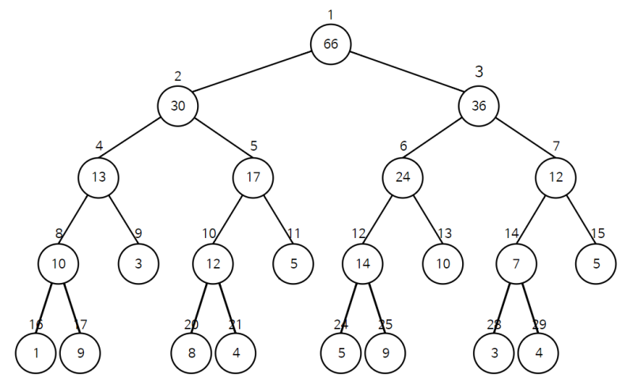

# 세그먼트 트리


특정 구간의 합을 가장 빠르게 구하는 방법

## 시간 복잡도

단순히 리스트로 구하는 방법

O(N)

세그먼트 트리로 구하는 방법

O(logN)

## 구조




리프 노드가 기존 배열의 값들이고

부모 노드는 자식 노드의 합

```python
class SegmentTree:
    def __init__(self, array):
        self.array = array
        self.tree = [0] * (4 * len(array))
        self.build(0, len(array) - 1, 1)

    def build(self, start, end, node):
        if start == end:
            self.tree[node] = self.array[start]
        else:
            mid = (start + end) // 2
            self.build(start, mid, node * 2)
            self.build(mid + 1, end, node * 2 + 1)
            self.tree[node] = self.tree[node * 2] + self.tree[node * 2 + 1]

    def query(self, start, end, node, left, right):
        if left > end or right < start:
            return 0
        if left <= start and end <= right:
            return self.tree[node]
        mid = (start + end) // 2
        return self.query(start, mid, node * 2, left, right) + self.query(mid + 1, end, node * 2 + 1, left, right)

    def update(self, start, end, node, index, diff):
        if index < start or index > end:
            return
        self.tree[node] += diff
        if start != end:
            mid = (start + end) // 2
            self.update(start, mid, node * 2, index, diff)
            self.update(mid + 1, end, node * 2 + 1, index, diff)

    def get_sum(self, left, right):
        return self.query(0, len(self.array) - 1, 1, left, right)

    def update_value(self, index, value):
        diff = value - self.array[index]
        self.array[index] = value
        self.update(0, len(self.array) - 1, 1, index, diff)


# 사용 예시
arr = [1, 2, 3, 4, 5]
seg_tree = SegmentTree(arr)
print(seg_tree.get_sum(0, 2))  # 1 + 2 + 3 = 6
seg_tree.update_value(1, 10)   # arr = [1, 10, 3, 4, 5]
print(seg_tree.get_sum(0, 2))  # 1 + 10 + 3 = 14

```


### 트리의 크기

최대일 경우 4*(전체의 크기)인 이유

배열의 길이는 리프노드고 리프노드는 올림했을 때 2^(h-1)가 되어야 함

그리고 높이에 따라 전체 노드 갯수가 정해짐

배열의 길이를 올림했을 때 h의 갯수 정해지고 그때의 전체 노드갯수를 계산할때 가장 효율적인 수가 4


## 수정할 경우

