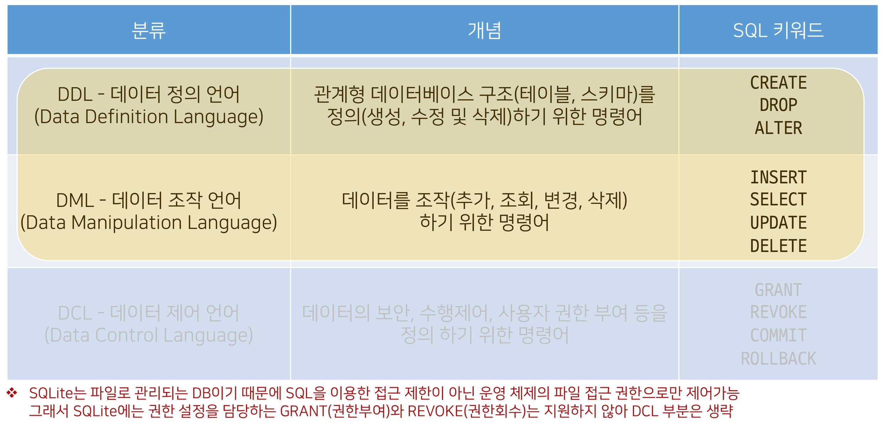
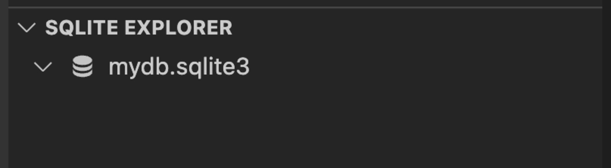

# Database

## database

### Intro

지금은 데이터의 시대 

- 세상에는 수 많은 데이터들이 존재한다. 
- 인터넷만 떠올려봐도 셀 수 없이 많은 데이터가 지금 이 순간에도 우리가 사용하는 웹 서비스나 애플리케이션 등을 통해 생성 수정 삭제 되고 있다. (내 아이디, 이메일, 비밀번호, 접속기록 등)
- 과거와 달리 이러한 데이터 규모는 점점 더 빠른 속도로 증가하고 있고, 이 데이터를 다루는 기술 또한 점점 중요해지고 있다.

#### 데이터베이스의 등장

이러한 서비스 혹은 애플리케이션들은 대체 어떻게 어디에 데이터를 저장할까? → 데이터베이스

##### 파일을 이용한 데이터 관리 

우리는 일반적으로 데이터를 파일에 저장한다. 

###### 장점 

 운영체제에 관계 없이 어디에서나 쉽게 사용가능

이메일이나 메신저를 이용해 간편하게 전송 가능

###### 단점

성능과 보안적 측면에서 한계가 명확

대용량 데이터를 다루기에 적합하지 않음

데이터를 구조적으로 정리하기에 어려움

확장이 불가능한 구조

##### 스프레드 시트를 이용한 데이터 관리

스프레드 시트(엑셀 시트) 을 사용

스프레드 시트는 컬럼(열)을 통해 데이터의 유형을 지정하고 레코드(행)을 통해 구체적인 데이터 값을 포함

스프레드 시트 자체를 데이터베이스라고 부를 수는 없지만 데이터베이스로 가는 길목정도로 생각해볼 수 있음

##### 프로그래밍 언어

스프레드 시트와 달리 프로그래밍 언어를 사용해 작동 시킬 수 있음 

데이터베이스는 많은 형태가 있지만 실제 가장 많이 쓰이는 유형은 RDB(Relational Database)라고 부르는 관계형 데이터베이스

RDB는 각각의 데이터를 테이블에 기입함 (마치 스프레드 시트에 작성하는 것처럼)

- 스프레드시트랑 똑같이 생김

쉽게 생각하면 스프레드시트 파일 모음을 관계형 RDB라고 생각하자!

#### Database 학습 목표 

데이터베이스를 사용하면 데이터를 안전하고 편리하고 빠르게 보관하고 사용할 수 있음 

거대하고 복잡하고 데이터를 다루기 위해서 고안된 도구이기 때문에 매우 많은 기능을 제공

- 기능이 많다 == 데이터 관련해서 할 수 있는 일들이 많다. 
- 모든 기능을 학습하는 것은 불필요함 → 우선 기초적인 부분에 집중하자

DB 학습의 기초 

- “데이터베이스에 데이터를 어떻게 입력하고, 어떻게 출력하는가" 
  - 입력 : 저장 수정 삭제
  - 출력 : 조회

즉 데이터베이스에서의 CRUD와 여러 키워드들 위주로 학습할 예정

#### Database 정의 

체계화된 데이터의 모임

여러 사람이 공유하고 사용할 목적으로 통합 관리되는 정보의 집합 

검색, 구조화 같은 작업을 보다 쉽게 하기 위해 조직화된 데이터를 수집하는 저장 시스템 

- 내용을 고도로 구조화 함으로써 검색과 갱신의 효율화를 꾀한 것 
- 즉, 자료 파일을 조직적으로 통합하여 자료 항목의 중복을 없애고 구조화하여 기억시켜 놓은 자료의 집합체 

이러한 Database를 조작하는 프로그램 = DBMS(Database Management System)

- 한 번쯤 들어봤을 Oracle, MySQL, SQLite ... 등이 모두 DBMS
- DBMS에서 Database를 조작하기 위해 사용하는 언어를 SQL 이라 함

웹 개발에서 대부분의 데이터베이스는 '관계형 데이터베이스 관리 시스템(RDBMS)'을 사용하여 SQL로 데이터와 프로그래밍을 구성

### RDB

#### RDB란

Relational Database (관계형 데이터베이스)

데이터를 테이블, 행, 열 등으로 나누어 구조화 하는 방식

자료를 여러 테이블로 나누어서 관리하고, 이 테이블간 관계를 설정해 여러 데이터를 쉽게 조작할 수 있다는 장점이 있음 

SQL을 사용하여 데이터를 조회하고 조작

#### [참고] 테이블간 관계 설정 예시


주문 테이블에는 고객에 대한 정보가 없음 고객 id라는 외래키를 이용해서 고객 테이블을 참조

- 이런게 관계형 데이터베이스

고객 테이블에서 고객 ID는 고객이 관계형 데이터베이스에서 고유하게 식별되는 기본 키(primary key)

주문 테이블에서 특정 주문을 식별하는 기본 키는 주문 ID 

- 외래 키(foreign key)를 사용하여 고객 테이블의 고객 ID를 연결하여 고객을 주문과 연결할 수 있음

이 관계를 통해 특정 날짜에 구매한 모든 고객에 관한 정보를 조회하거나 지난 달에 배송일이 지연된 주문을 받은 고객을 파악하거나 할 수 있음

외래 키 개념 및 RDB 모델에 관련된 자세한 사항은 추후 Django 모델 관계에서 진행

#### RDB 기본 구조

1. 스키마
2. 테이블
   - 필드
   - 레코드
   - 기본 키

##### 스키마(Schema)

테이블의 구조(Structure)

데이터베이스에서 자료의 구조, 표현 방법, 관계 등 전반적인 명세를 기술한 것


###### 테이블(Table)

필드와 레코드를 사용해 조직된 데이터 요소들의 집합

관계(Relation)라고도 부름

1. 필드(field) 
   -  속성, 컬럼(Column) 
2. 레코드(record) 
   - 튜플, 행(Row)


###### 레코드(record)

튜플 혹은 행(row)

테이블의 데이터는 레코드에 저장됨

###### PK (Primary Key) 

기본 키

각 레코드의 고유한 값 

- 각각의 데이터를 구분할 수 있는 고윳값

기술적으로 다른 항목과 절대로 중복될 수 없는 단일 값(unique)

데이터베이스 관리 및 테이블


#### 관계형 데이터베이스의 이점

데이터를 직관적으로 표현할 수 있음 

관련한 각 데이터에 쉽게 접근할 수 있음

대량의 데이터도 효율적으로 관리 가능

#### RDBMS

Relational Database Management System (관계형 데이터베이스 관리 시스템)

관계형 데이터베이스를 만들고 업데이트하고 관리하는 데 사용하는 프로그램

예시 

- SQLite, MySQL, PostgreSQL, Microsoft SQL Server, Oracle Database
  - 다 SQL 언어 사용

##### SQLite

응용 프로그램에 파일 형식으로 넣어 사용하는 비교적 가벼운 데이터베이스

안드로이드, iOS, macOS에 기본적으로 탑재되어 있으며 임베디드 소프트웨어에서도 많이 활용됨

오픈 소스 프로젝트이기 때문에 자유롭게 사용가능

###### 단점

대규모 동시 처리 작업에는 적합하지 않음

다른 RDMBS에서 지원하는 SQL 기능을 지원하지 않을 수 있음

###### SQLite를 학습하는 이유

어떤 환경에서나 실행 가능한 호환성

데이터 타입이 비교적 적고 강하지 않기 때문에 유연한 학습 환경을 제공

Django Framework의 기본 데이터베이스

## SQL

### SQL 이란 

"Structured Query Language"

RDBMS의 데이터를 관리하기 위해 설계된 특수 목적의 프로그래밍 언어

RDBMS에서 데이터베이스 스키마를 생성 및 수정할 수 있으며, 테이블에서의 자료 검색 및 관리도 할 수 있음

데이터베이스 객체에 대한 처리를 관리하거나 접근 권한을 설정하여 허가된 사용자만 RDBMS를 관리할 수 있도록 할 수 있음

많은 데이터베이스 관련 프로그램들이 SQL을 표준으로 채택하고 있음

### SQL 정리

SQL은 데이터베이스와 상호작용하는 방법

따라서 SQL을 배우면서 데이터베이스의 동작원리 또한 익힐 수 있음

### SQL Commands

#### SQL Commands 종류

명령어는 특성에 따라 다음 세 가지 그룹으로 분류 

1. DDL (Data Definition Language)
2. DML (Data Manipulation Language)
3. DCL (Data Control Language)




DDL까지는 데이터를 삽입하지는 않음

- 데이터를 삽입하기 위한 테이블을 만듬

DML은 CRUD

### SQL Syntax

```sql
-- SQL Syntax 예시

SELECT column_name FROM table_name;
```

모든 SQL 문(statement)는 SELECT, INSERT, UPDATE 등과 같은 키워드로 시작하고, 하나의 statement는 세미콜론(;)으로 끝남

- 세미콜론은 각 SQL 문을 구분하는 표준 방법
- 띄어쓰기는 중요하지 않고 세미콜론이 중요

 SQL 키워드는 대소문자를 구분하지 않음 

- 즉, SELECT와 select는 SQL 문에서 동일한 의미
- 하지만 대문자로 작성하는 것을 권장

SQL에 대한 세부적인 문법 사항들은 이어지는 DDL, DML을 진행하며 익혀볼 것

#### [참고] Statement & Clause

Statement (문)

- 독립적으로 실행할 수 있는 완전한 코드 조각

- statement는 clause로 구성됨

Clause (절)

- statement의 하위 단위

```sql
SELECT column_name FROM table_name;
```

SELECT statement라 부름

이 statement는 다음과 같이 2개의 clause로 구성 됨

1. SELECT column_name
2. FROM table_name

절은 단독적으로는 작동 안함

## DDL

사전 준비 

공용 노션 문서 참고 

1. "SQLite3 설치” 문서를 참고해서 진행
2. Vscode SQLite 확장프로그램 설치 확인


1. 데이터베이스 mydb.sqlite3 파일 생성
2. DDL.sql 파일 생성
3. vscode 실행 후 DDL.sql 화면에서 마우스 우측 버튼 클릭 
   - Use Database 선택


데이터베이스 목록에서 mydb.sqlite3 선택

이렇게 하면 DDL에서 쓴 명령어들이 mydb에서 실행

### 개요

 "Data definition" 

SQL 데이터 정의 언어를 사용하여 테이블 데이터베이스 개체를 만드는 방법을 학습

DDL은 테이블 구조를 관리 

- CREATE, ALTER, DROP
  - 생성, 수정, 삭제

### CREATE TABLE 

#### CREATE TABLE statement 

"Create a new table in the database."

##### 데이터베이스에 새 테이블을 만듦 

```sql
CREATE TABLE table_name(
    column_1 data_type constraints,
    column_2 data_type constraints,
    column_3 data_type constraints
);
```

컬럼정의(스키마)

- 컬럼 이름 / 어떤 데이터가 들어갈지 / 제약조건(다른 데이터 못들어가고, 길이)

##### contacts 테이블 생성

```sql
-- DDL.sql

CREATE TABLE contacts (
  name TEXT NOT NULL,
  age INTEGER NOT NULL,
  email TEXT NOT NULL UNIQUE
);
```

##### Query 실행하기 

실행하고자 하는 명령문에 커서를 두고 마우스 우측 버튼

- → 'Run Selected Query' 선택 
- Run Query는 파일에 있는 모든 명령문 실행

명령문을 모두 선택 할 필요 없으며, 실행하고자 하는 명령문 안에 커서가 올라가 있으면 가능


##### 쿼리 실행 후 테이블 및 스키마 확인

데이터베이스(mydb.sqlite3) 오른쪽 클릭 Open database

왼쪽 아래에 스키마 정리한 것이 나옴


id 컬럼은 우리가 직접 기본 키 역할의 컬럼을 정의하지 않으면 자동으로 rowid라는 컬럼으로 만들어짐

rowid에 대한 자세한 사항은 이어지는 주제에서 자세히 다룸

먼저 테이블을 생성 하면서 작성한 “데이터 타입”과 “제약조건을 알아본다.\

#### SQLite Data Types

1. NULL
2. INTEGER
3. REAL
4. TEXT
5. BLOB

##### NULL

NULL value

- NULL이라는 값

정보가 없거나 알 수 없음을 의미 (missing information or unknown)

##### INTEGER

정수

크기에 따라 0, 1, 2, 3, 4, 6 또는 8바이트와 같은 가변 크기를 가짐

##### REAL

실수

8바이트 부동 소수점을 사용하는 10진수 값이 있는 실수

##### TEXT

문자 데이터

##### BLOB (Binary Large Object)

입력된 그대로 저장된 데이터 덩어리 (대용 타입 없음)

바이너리 등 멀티미디어 파일 

- 0과 1로 이루어진 데이터

예시

- 이미지 데이터

##### [참고] Boolean type 

SQLite에는 별도의 Boolean 타입이 없음

대신 Boolean 값은 정수 0(false)과 1(true)로 저장됨

##### [참고] Date & Time Datatype

SQLite에는 날짜 및 시간을 저장하기 위한 타입이 없음

대신 SQLite의 built-in "Date And Time Functions"으로 TEXT, REAL 또는 INTEGER 값으로 저장할 수 있음

-  내장 함수들 존재
  -  https://www.sqlite.org/lang_datefunc.html

##### [참고] Binary Data 

데이터의 저장과 처리를 목적으로 0과 1의 이진 형식으로 인코딩 된 파일

기본적으로 컴퓨터의 모든 데이터는 binary data 

- 다만, 이를 필요에 따라서 텍스트 타입으로 변형해서 사용하는 것

##### SQLite는 다음 규칙을 기반으로 데이터 타입을 결정 

값에 둘러싸는 따옴표와 소수점 또는 지수가 없으면 - INTEGER

값이 작은 따옴표나 큰따옴표로 묶이면 - TEXT

값에 따옴표나 소수점, 지수가 없으면 - READ

값이 따옴표 없이 NULL이면 - NULL

##### SQLite Datatypes 특징

SQLite는 다른 모든 SQL 데이터베이스 엔진(MySQL, PostgreSQL 등)의 정적이고 엄격한 타입(static, rigid typing)이 아닌 "동적 타입 시스템(dynamic type system)"을 사용

- 컬럼에 선언된 데이터 타입에 의해서가 아니라 컬럼에 저장된 값에 따라 데이터 타입이 결정됨
- 선언했더라도 데이터에 저장된 타입에 따라 결정됨
- 그래서 선언하지 않더라도 데이터 만들 수 있음
- 다른 엔진은 선언한 타입에 안맞으면 안들어감

또한 테이블을 생성할 때 컬럼에 대해 특정 데이터 타입을 선언하지 않아도 됨 

- 예를 들어 동일한 컬럼에 정수 1을 넣을 경우 INTEGER로 타입이 지정되고, 문자 '1' 을 넣을 경우는 TEXT 타입으로 지정됨 
- 이러한 SQLite의 동적 타입 시스템을 사용하면 기존의 엄격하게 타입이 지정된 데이터베이스에서는 불가능한 작업을 유연하게 수행할 수 있음
- 게다가 정적 타입 시스템이 지정된 데이터베이스에서 작동하는 SQL 문이 SQLite에서 동일한 방식으로 작동한다는 점
- 다만 이는 다른 데이터베이스와의 호환성 문제가 있기 때문에 테이블 생성 시 데이터 타입을 지정하는 것을 권장
  - 일반적인 엔진에서도 돌아가도록 하기 위해 맞춰줌

데이터 타입을 지정하게 되면 SQLite는 입력된 데이터의 타입을 지정된 데이터 타입으로 변환 

- 예를 들어 TEXT 타입 컬럼에 정수 1을 저장할 경우 문자 타입의 '1'로 저장됨
  - 에러가 나지 않고 변환
- 허용 가능한 타입 변환은 다음과 같음


##### [참고] "static, rigid typing" 데이터베이스

statically, rigidly typed databases 라고도 부름

저장되는 값의 데이터 타입은 컬럼에 선언된 데이터 타입에 의해 결정된다.

동작 예시

```sql
 CREATE TABLE my_table (
   a INTEGER NOT NULL,
   b TEXT NOT NULL,
 );
```

만약 a 컬럼에 123', b 컬럼에 456 데이터를 삽입하려는 경우 삽입을 수행하기 전에 문자열 '123'을 정수 123으로 변환하고, 정수 456을 문자열 '456'으로 변환

##### Type Affinity 

“타입 선호도"

특정 컬럼에 저장된 데이터에 권장되는 타입

데이터 타입 작성 시 SQLite의 5가지 데이터 타입이 아닌 다른 데이터 타입을 선언한다면, 내부적으로 각 타입의 지정된 선호도에 따라 5가지 선호도로 인식됨 

1. INTEGER
2. TEXT
3. BLOB

4. REAL

5. NUMERIC


내부적으로 어떤 것으로 정해질것인가

다른 엔진에서 지원하는 VARCHAR(20)같은것도 TEXT로 인식

###### 존재 이유

다른 데이터베이스 엔진 간의 호환성을 최대화

정적이고 엄격한 타입을 사용하는 데이터베이스의 SQL문을 SQLite에서도 작동하도록 하기 위함

#### Constraints

##### 개요

“제약조건”

입력하는 자료에 대해 제약을 정함

- 유효성 검사와 비슷

제약에 맞지 않다면 입력이 거부됨

사용자가 원하는 조건의 데이터만 유지하기 위한 즉, 데이터의 무결성을 유지하기 위한 보편적인 방법으로 테이블의 특정 컬럼에 설정하는 제약

###### 데이터 무결성

데이터 베이스 내의 데이터에 대한 정확성, 일관성을 보장하기 위해 데이터 변경 혹은 수정 시 여러 제한을 두어 데이터의 정확성을 보증하는 것 

- 무결성이란 데이터의 정확성, 일관성을 나타냄 

데이터베이스에 저장된 데이터의 무결성을 보장하고 데이터베이스의 상태를 일관되게 유지하는 것이 목적

##### 종류

1. NOT NULL 
2. UNIQUE
3. PRIMARY KEY
4. AUTOINCREMENT
5. 그외 기타 Constraints

###### NOT NULL

컬럼이 NULL 값을 허용하지 않도록 지정

기본적으로 테이블의 모든 컬럼은 NOT NULL 제약 조건을 명시적으로 사용하는 경우를 제외하고는 NULL 값을 허용함

###### UNIQUE

컬럼의 모든 값이 서로 구별되거나 고유한 값이 되도록 함

처음에 들어간 값이 다른 레코드에 들어갈 수 없다

###### PRIMARY KEY 

테이블에서 행의 고유성을 식별하는 데 사용되는 컬럼

안해도 자동으로 만들어지지만 직접하려면 써야함

각 테이블에는 하나의 기본 키만 있음

암시적으로 NOT NULL 제약 조건이 포함되어 있음

```sql
-- 예시

CREATE TABLE table_name (
  id INTEGER PRIMARY KEY,
  ..
);
```

※ 주의) INTEGER 타입에만 사용가능 (INT BIGINT 등 불가능)

###### AUTOINCREMENT

사용되지 않은 값이나 이전에 삭제된 행의 값을 재사용하는 것을 방지

PRIMARY KEY와 같이 사용될 수 있음

INTEGER PRIMARY KEY 다음에 작성하면 해당 rowid를 다시 재사용하지 못하도록 함 

- 1,2,3 만들고
- 3 삭제한 후에
- 다시 만들면 기본적으로는 3 만들어짐
- AUTOINCREMENT쓰면 다시 3 안 만들어짐 4 만들어짐
  - 장고도 그랬음, 장고는 AUTOINCREMENT를 쓰고 있다

```sql
-- 예시 CREATE TABLE table_name (
  id INTEGER PRIMARY KEY AUTOINCREMENT
  ..
);
```

Django에서 테이블 생성 시 id 컬럼에 기본적으로 사용하는 제약조건

##### rowid의 특징

테이블을 생성할 때마다 rowid라는 암시적 자동 증가 컬럼이 자동으로 생성됨

- 자동으로 1 다음 2 다음 3

테이블의 행을 고유하게 식별하는 64비트 부호 있는 정수 값

테이블에 새 행을 삽입할 때마다 정수 값을 자동으로 할당 

- 값은 1에서 시작
- 데이터 삽입 시에 rowid 또는 INTEGER PRIMARY KEY 컬럼에 명시적으로 값이 지정되지 않은 경우, SQLite는 테이블에서 가장 큰 rowid보다 하나 큰 다음 순차 정수를 자동으로 할당 (AUTOINCREMENT와 관계없이) 
  - 3지워졌으면 다시 3
- INTEGER PRIMARY KEY 쓰면 rowid 대체

만약 INTEGER PRIMARY KEY 키워드를 가진 컬럼을 직접 만들면 이 컬럼은 rowid 컬럼의 별칭(alias)이 됨

- 내부적으로 rowid가 없어지지 않음

- 즉, 새 컬럼 이름으로 rowid에 액세스 할 수 있으며 rowid 이름으로도 여전히 액세스 가능

데이터가 최대 값에 도달하고 새 행을 삽입하려고 하면 SQLite는 사용되지 않는 정수를 찾아 사용 (Limits in SQLite - https://www.sqlite.org/limits.html)

꽉 찼을 때, 만약 SQLite가 사용되지 않은 정수를 찾을 수 없으면 SQLITE_FULL 에러가 발생

- 또한 일부 행을 삭제하고 새 행을 삽입하면 SQLite는 삭제된 행에서 rowid 값을 재사용하려고 시도

#### ALTER TABLE

##### 개요

"Modify the structure of an existing table."

기존 테이블의 구조를 수정(변경)

SQLite의 ALTER TABLE 문을 사용하면 기존 테이블을 다음과 같이 변경할 수 있음

1. Rename a table
   - 이름을 바꿀 수 있음
2. Rename a column (3.20.0 에서 추가됨)
   - 컬럼의 이름 변경
3. Add a new column to a table
   - 새로운 컬럼 추가
4. Delete a column (3.35.0 에서 추가됨)
   - 컬럼 삭제

https://www.sqlite.org/lang_altertable.html

##### ALTER TABLE statement

``` sql
-- 1. Rename a table
ALTER TABLE table_name RENAME TO new_table_name;

-- 2. Rename a column
ALTER TABLE table_name RENAME COLUMN column_name TO new_column_name;

-- 3. Add a new column to a table
ALTER TABLE table_name ADD COLUMN column_definition;

-- 4. Delete a column
ALTER TABLE table_name DROP COLUMN column_name;
```

###### ALTER TABLE RENAME

"Rename a table" (테이블명 변경)

작성 및 결과 확인

```sql
-- DDL.sql

ALTER TABLE contacts RENAME TO new_contacts;
```

새로고침 누르면 contacts에서 new_contacts로 바뀌어있음


###### ALTER TABLE RENAME COLUMN

“Rename a column" (컬럼명 변경)

작성 및 결과 확인

```sql
 -- DDL.sql
 
 ALTER TABLE new_contacts RENAME COLUMN name TO last_name;
```


###### ALTER TABLE ADD COLUMN

“Add a new column to a table” (새 컬럼 추가)

작성 및 결과 확인

```sql
 -- DDL.sql
 
 ALTER TABLE new_contacts ADD COLUMN address TEXT NOT NULL;
```


현재 과정에서는 일어나지 않지만 만약 테이블에 기존 데이터가 있을 경우 다음과 같은 에러가 발생

```sql
Cannot add NOT NULL column with default value NULL
```

이전에 이미 저장된 데이터들은 새롭게 추가되는 컬럼에 값이 없기 때문에 NULL이 작성됨.

그런데 새로 추가되는 컬럼에 NOT NULL 제약조건이 있기 때문에 기본 값 없이는 추가될 수 없다는 에러가 발생한 것

다음과 같이 DEFAULT 제약 조건을 사용하여 해결할 수 있음

```sql
ALTER TABLE new_contacts ADD COLUMN address TEXT NOT NULL DEFAULT 'no address';
```

이렇게 하면 address 컬럼이 추가되면서 기존에 있던 데이터들의 address 컬럼 값은 'no address' 가 됨

- 기본값을 넣어주면서 추가

######  [참고] DEFAULT 제약조건

column 제약조건 중 하나

데이터를 추가할 때 값을 생략할 시에 기본 값을 설정함

https://www.sqlite.org/syntax/column-constraint.html'

###### ALTER TABLE DROP COLUMN

"Delete a column" (컬럼 삭제)

작성 및 결과 확인

```sql
-- DDL.sql

ALTER TABLE new_contacts DROP COLUMN address;
```


단, 삭제하지 못하는 경우가 있음

- 컬럼이 다른 부분에서 참조되는 경우 
  - FOREIGN KEY(외래 키) 제약조건에서 사용되는 경우 (추후 Django 모델 관계에서 다룰 예정)

- PRIMARY KEY인 경우

- UNIQUE 제약 조건이 있는 경우

```sql
ALTER TABLE new_contacts DROP COLUMN email;
```

```sql
Cannet drop UNIQUE column: "email"
```

#### DROP TABLE

##### 개요

 "Remove a table from the database."

데이터베이스에서 테이블을 제거 

```sql
DROP TABLE table_name;
```

존재하지 않는 테이블을 제거하면 SQLite에서 오류가 발생

```sql
no such table: table_name
```

##### 실습

작성 및 결과 확인

```sql
-- DDL.sql

DROP TABLE new_contacts;
```



##### 특징

한 번에 하나의 테이블만 삭제할 수 있음

여러 테이블을 제거하려면 여러 DROP TABLE 문을 실행해야 함

DROP TABLE 문은 실행 취소하거나 복구할 수 없음

- 따라서 각별히 주의하여 수행해야 한다.

### 정리

데이터 정의 언어

CREATE TABLE

- 데이터 타입과 제약조건

ALTER TABLE

- RENAME
- RENAME COLUMN'
- ADD COLUMN
- DROP COLUMN

DROP TABLE

## DML

### 개요

DML을 통해 데이터를 조작하기 (CRUD)

INSERT, SELECT, UPDATE, DELETE

- CRUD

### 사전 준비

#### 공용 Gitlab으로 공유된 users.csv 파일 준비

테이블에 해당 CSV 파일 데이터를 import 해서 사용할 예정

#### command-line program - "sqlite3" 

SQL 문 및 commands을 사용하여 SQLite 데이터베이스와 상호 작용할 수 있는 간단한 command-line tool

실행 화면 예시

bash에 sqlite3를 입력

```bash
$ sqlite3
SQLite version 3.38.0 2022-02-22 18:58:40
Enter ".help" for usage hints.
Connected to a transient in-memory database.
Use ".open FILENAME" to reopen on a persistent database.
sqlite>
```

거기에다가 sql 명령어들을 쓸 수 있음

불편한데 csv파일을 테이블에 import할때

#### sqlite3 사용하기

1. 시작하기 

   ```bash
   $ sqlite3
   
   SQLite version 3.38.0 2022-02-22 18:58:40
   Enter ".help" for usage hints.
   Connected to a transient in-memory database.
   Use ".open FILENAME" to reopen on a persistent database.
   ```

2. 데이터베이스 파일 열기

   ```bash
   sqlite> .open mydb.sqlite3
   ```

   혹은 다음과 같이 시작하면서 데이터베이스를 열 수도 있음

   ```bash
   $ sqlite3 mydb.sqlite3
   ```

3. sqlite3 종료하기

   ```bash
   sqlite> .exit
   ```

이외에 다양한 commands는 .help 명령어를 사용해 확인 해보기

#### CSV 파일을 SQLite 테이블로 가져오기

sqlite3 tool을 사용하여 CSV 파일을 테이블로 가져오는 방법

1. DML.sql 파일 생성

2. 테이블 생성하기

   ```sql
   DML.sql
   
   CREATE TABLE users (
     first_name TEXT NOT NULL,
     last_name TEXT NOT NULL,
     age INTEGER NOT NULL,
     country TEXT NOT NULL,
     phone TEXT NOT NULL,
     balance INTEGER NOT NULL
   );
   ```

   새로운 sql 파일으로 다시 생성


​	


이 테이블에 csv 파일 넣을 예정

3. 데이터베이스 파일 열기

   ```bash
   sqlite> .open mydb.sqlite3
   ```

4. 모드(.mode)를 csv로 설정

   ```bash
   sqlite> .mode csv
   ```

5. import 명령어를 사용하여 csv 데이터를 테이블로 가져오기

   ```bash
   sqlite> .import users.csv users
   ```

6. import된 데이터 확인하기

   sqlite3 tool 에서도 SQL문을 사용할 수 있지만, 실습의 편의와 명령어 기록을 위해 sql 확장자 파일에서 진행하도록 함


```bash
sqlite> .exit
```

exit로 나올 수 있음

### Simple query

#### 개요

SELECT 문을 사용하여 간단하게 단일 테이블에서 데이터를 조회하기

#### SELECT statement

```sql
SELECT column1, column2 FROM table_name;
```

"Query data from a table"

특정 테이블에서 데이터를 조회하기 위해 사용

문법 규칙

1. SELECT 절에서 컬럼 또는 쉼표로 구분된 컬럼 목록을 지정
2. FROM 절(clause)에서 데이터를 가져올 테이블을 지정

##### 실습

SELECT 문은 SQLite에서 가장 복잡한 문

다양한 절과 함께 사용할 수 있으며 하나씩 학습할 예정

- ORDER BY
- DISTINCT
- WHERE
- LIMIT
- LIKE
- GROUP BY

###### 이름과 나이 조회하기

```sql
-- DML.sql

SELECT first_name, age FROM users;
```


###### 전체 데이터 조회하기

모든 컬럼에 대한 shorthand(약칭)인 *(asterisk)를 사용할 수 있음

```sql
-- DML.sql

SELECT * FROM users;
```


rowid 컬럼은 다음과 같이 조회할 수 있다. 

```sql
-- DML.sql

SELECT rowid, first_name FROM users;
```

rowid는 이렇게 명시를 해줘야 출력됨


### Sorting rows

#### 개요

ORDER BY 절을 사용하여 쿼리의 결과를 정렬하기

#### ORDER BY clause

```sql
SELECT select_list FROM table_name
ORDER BY column_1 ASC, column_2 DESC;
```

"Sort a result set of a query" 

SELECT 문에 추가하여 결과를 정렬

ORDER BY 절은 FROM 절 뒤에 위치함

하나 이상의 컬럼을 기준으로 결과를 오름차순, 내림차순으로 정렬할 수 있음

이를 위해 ORDER BY 절 다음에 ASC 또는 DESC 키워드를 사용

- ASC : 오름차순 (기본 값)
- DESC : 내림차순

##### 실습

이름과 나이를 나이가 어린 순서대로 조회하기

```sql
-- DML.sql

SELECT first_name, age FROM users ORDER BY age ASC;

SELECT first_name, age FROM users ORDER BY age;
```

기본값이라 ASC 안써도 적용됨


이름과 나이를 나이가 많은 순서대로 조회하기

```sql
-- DML.sql

SELECT first_name, age FROM users ORDER BY age DESC;
```


이름, 나이, 계좌 잔고를 나이가 어린순으로, 만약 같은 나이라면 계좌 잔고가 많은 순으로 정렬해서 조회하기

```sql
-- DML.sql

SELECT first_name, age, balance FROM users ORDER BY age ASC, balance DESC;
```

ORDER BY절은 하나 이상의 컬럼을 정렬할 경우 첫 번째 열을 사용하여 행을 정렬하고, 그런 다음 두번째 컬럼을 사용하여 정렬 되어있는 행을 정렬하는 방식

즉, 먼저 age를 기준으로 먼저 오름차순으로 정렬하고, 이 결과를 balance를 기준으로 내림차순으로 정렬한 것


##### [참고] Sorting NULLS

NULL의 정렬 방식

정렬과 관련하여 SQLite는 NULL을 다른 값보다 작은 것으로 간주

즉, ASC를 사용하는 경우 결과의 시작 부분에 NULL이 표시되고, DESC를 사용하는 경우 결과의 끝에 NULL이 표시됨

https://www.sqlitetutorial.net/sqlite-order-by/

### Filtering data

#### 개요

데이터를 필터링하여 중복 제거, 조건 설정 등 쿼리를 제어하기

Clause

- SELECT DISTINCT
- WHERE
- LIMIT

Operatior

- LIKE
- IN
- BETWEEN

#### SELECT DISTINCT clause

``` sql
SELECT DISTINCT select_list FROM table_name;
```

"Remove duplicate rows in the result"

조회 결과에서 중복된 행을 제거

DISTINCT 절은 SELECT 에서 선택적으로 사용할 수 있는 절

문법 규칙

1. DISTINCT 절은 SELECT 키워드 바로 뒤에 나타나야 함
2. DISTINCT 키워드 뒤에 컬럼 또는 컬럼 목록을 작성

##### 실습

모든 지역 조회하기

```sql
-- DML.sql

SELECT country From users;
```

중복없이 모든 지역 조회하기

```sql
-- DML.sql

SELECT DISTINCT country FROM users;
```

지역 순으로 내림차순 정렬하여 중복없이 모든 지역 조회하기

```sql
-- DML.sql

SELECT DISTINCT country FROM users ORDER BY country;
```

이름과 지역이 중복 없이 모든 이름과 지역 조회하기

```sql
-- DML.sql

SELECT DISTINCT first_name, country FROM users;
```

각 컬럼의 중복을 따로 계산하는 것이 아니라 두 컬럼을 하나의 집합으로 보고 중복을 제거

이름과 지역 중복 없이 지역 순으로 오름차순 정렬하여 모든 이름과 지역 출력하기

```sql
-- DML.sql

SELECT DISTINCT first_name, country
FROM users
ORDER BY country;
```

##### [참고] NULL with DISTINCT

SQLite는 NULL 값을 중복으로 간주 

NULL 값이 있는 컬럼에 DISTINCT 절을 사용하면 SQLite는 NULL 값의 한 행을 유지

#### WHERE clause

```sql
SELECT column_list FROM table_name
WHERE search_condition;
```

"Specify the search condition for rows returned by the query"

조회 시 특정 검색 조건을 지정

WHERE 절은 SELECT 문에서 선택적으로 사용할 수 있는 절

- SELECT 문 외에도 UPDATE 및 DELETE 문에서 WHERE 절을 사용할 수 있음

FROM 절 뒤에 작성

##### WHERE의 검색 조건 작성 형식

```sql
left_expression COMPARISON_OPERATOR right_expression
```

```sql
WHERE column_1 = 10

WHERE column_2 LIKE 'ko%'
--ko로 시작되는 단어들을 가져와라

WHERE column_3 IN (1, 2)
--1 아니면 2

WHERE column_4 BETWEEN 10 AND 20
-- 범위
```

##### SQLite logical operators (논리연산자)

두 표현식이 동일한지 테스트

- `=`
- `<>` or `!=`
- `<`
- `<=`
- `>=`

##### SQLite logical operators (논리연산자)

일부 표현식의 truth를 테스트할 수 있음

1, 0 또는 NULL 값을 반환

SQLite는 Boolean 데이터 타입을 제공하지 않으므로 1은 TRUE를 의미하고 0은 FALSE를 의미

ALL, AND, ANY, BETWEEN, IN, LIKE, NOT, OR 등

##### 실습

나이가 30살 이상인 사람들의 이름, 나이, 계좌 잔고 조회하기

```sql
-- DML.sql

SELECT first_name, age, balance FROM users
WHERE age >= 30;
```

나이가 30살 이상이고 계좌 잔고가 50만원 초과인 사람들의 이름, 나이, 계좌 잔고 조회하기

```sql
-- DML.sql

SELECT first_name, age, balance FROM users
WHERE age >= 30 and balance > 500000;
```

##### LIKE operator

“Query data based on pattern matching" 

패턴 일치를 기반으로 데이터를 조회

SELECT, DELETE, UPDATE 문의 WHERE 절에서 사용

기본적으로 대소문자를 구분하지 않음

- 'A' LIKE 'a' 는 true

SQLite는 패턴 구성을 위한 두 개의 와일드카드(wildcards)를 제공

1. % (percent)

   - 0개 이상의 문자가 올 수 있음을 의미

   - 패턴이 있을 수도 있고 없을 수도 있고
   - '김%'
     - 김, 김치, 김치 냉장도 다 됨

2. _ (underscore)

   - 단일(1개) 문자가 있음을 의미
   - 반드시 무엇인가 있다
   - '김_'
     - 김밥 등 무조건 2글자

###### '%' wildcard 예시

''영%' 패턴은 영으로 시작하는 모든 문자열과 일치 (영, 영미, 영미리 등) 

'%도' 패턴은 도로 끝나는 모든 문자열과 일치 (도, 수도, 경기도 등) 

'%강원%' 패턴은 강원을 포함하는 모든 문자열과 일치 (강원, 강원도, 강원도에 살아요 등)

###### '_' wildcard 예시

'영' 패턴은 영으로 시작하고 총 2자리인 문자열과 일치 (영미, 영수, 영호 등)

'도' 패턴은 도로 끝나고 총 2자리인 문자열과 일치 (수도, 과도 등)

###### wildcard 종합 예시


###### [참고] “wildcards" character

파일을 지정할 때, 구체적인 이름 대신에 여러 파일을 동시에 지정할 목적으로 사용하는 특수 기호 

- *, ? 등

주로 특정한 패턴이 있는 문자열 혹은 파일을 찾거나, 긴 이름을 생략할 때 쓰임

텍스트 값에서 알 수 없는 문자를 사용할 수 있는 특수 문자로, 유사하지만 동일한 데이터가 아닌 여러 항목을 찾기에 매우 편리한 문자

지정된 패턴 일치를 기반으로 데이터를 수집하는 데도 도움이 될 수 있음

###### 실습

이름에 '호'가 포함되는 사람들의 이름과 성 조회하기

```sql
-- DML.sql

SELECT first_name, last_name FROM users
WHERE first_name LIKE '%호%';
```

이름에 '준'으로 끝나는 사람들의 이름 조회하기

```sql
-- DML.sql

SELECT first_name FROM users
WHERE first_name LIKE '%준';
```

서울 지역 전화번호를 가진 사람들의 이름과 전화번호 조회하기

```sql
-- DML.sql

SELECT first_name, phone FROM users
WHERE phone LIKE '02-%';
```

나이가 20대인 사람들의 이름과 나이 조회하기

```sql
-- DML.sql

SELECT first_name, age FROM users
WHERE age LIKE '2_';
```

전화번호 중간 4자리가 51로 시작하는 사람들의 이름과 전화번호 조회하기

```sql
-- DML.sql

SELECT first_name, phone FROM users
WHERE phone LIKE '%-51__-%';
```

##### IN operator 

"Determine whether a value matches any value in a list of values" 

값이 값 목록 결과에 있는 값과 일치하는지 확인

표현식이 값 목록의 값과 일치하는지 여부에 따라 true 또는 false를 반환

IN 연산자의 결과를 부정하려면 NOT IN 연산자를 사용

###### 실습

경기도 혹은 강원도에 사는 사람들의 이름과 지역 조회하기

```sql
-- DML.sql

SELECT first_name, country FROM users
WHERE country IN ('경기도', '강원도');
```

IN 연산자 대신 OR 연산자를 사용하여 동일한 결과를 반환할 수 있음

```sql
-- DML.sql

SELECT first_name, country FROM users
WHERE country = '경기도' or country = '강원도';
```

경기도 혹은 강원도에 살지 않는 사람들의 이름과 지역 조회하기

```sql
-- DML.sql

SELECT first_name, country FROM users
WHERE country NOT IN ('경기도', '강원도');
```

##### BETWEEN operator

```sql
test_expression BETWEEN low_expression AND high_expression
```

"Test whether a value is in a range of values."

값이 값 범위에 있는지 테스트

값이 지정된 범위에 있으면 true를 반환

SELECT, DELETE, 및 UPDATE 문의 WHERE 절에서 사용할 수 있음

BETWEEN 연산자의 결과를 부정하려면 NOT BETWEEN 연산자를 사용

###### 실습

나이가 20살 이상, 30살 이하인 사람들의 이름과 나이 조회하기

```sql
-- DML.sql

SELECT first_name, age from users
WHERE age BETWEEN 20 AND 30;
```

AND 연산자를 이용해서 이전 쿼리와 동일한 결과를 반환할 수 있음

나이가 20살 이상, 30살 이하가 아닌 사람들의 이름과 나이 조회하기

```sql
-- DML.sql

SELECT first_name, age FROM users
WHERE age NOT BETWEEN 20 AND 30;
```

OR 연산자를 사용하여 이전 쿼리와 동일한 결과를 반환할 수 있음

```sql
-- DML.sql

SELECT first_name, age FROM users
WHERE age < 20 OR age > 30;
```

#### LIMIT clause

```sql
-- DML.sql

SELECT column_list FROM table_name LIMIT row_count;
```

"Constrain the number of rows returned by a query."

쿼리에서 반환되는 행 수를 제한

SELECT 문에서 선택적으로 사용할 수 있는 절

row_count는 반환되는 행 수를 지정하는 양의 정수를 의미

##### 실습

첫 번째부터 열 번째 데이터까지 rowid와 이름 조회하기

```sql
-- DML.sql

SELECT rowid, first_name FROM users
LIMIT 10;
```

계좌 잔고가 가장 많은 10명의 이름과 계좌 잔고 조회하기

```sql
-- DML.sql

SELECT first_name, balance FROM users
ORDER BY balance DESC
LIMIT 10;
```

나이가 가장 어린 5명의 이름과 나이 조회하기

```sql
-- DML.sql

SELECT first_name, age FROM users
ORDER BY age LIMIT 5;
```

##### OFFSET keyword

LIMIT 절을 사용하면첫 번째 데이터부터 지정한 수 만큼의 데이터를 받아올 수 있지만, OFFSET과 함께 사용하면 특정 지정된 위치에서부터 데이터를 조회할 수 있음 

###### 실습

11번째부터 20번째 데이터의 rowid와 이름 조회하기

```sql
-- DML.sql

SELECT rowid, first_name FROM users
LIMIT 10 OFFSET 10;
```

### Grouping data

#### GROUP BY clause

```sql
SELECT column_1, aggregate_function(column_2)
FROM table_name
GROUP BY column_1, column_2; 
```

"Make a set of summary rows from a set of rows."

특정 그룹으로 묶인 결과를 생성

선택된 컬럼 값을 기준으로 데이터(행)들의 공통 값을 묶어서 결과로 나타냄

SELECT 문에서 선택적으로 사용가능한 절

SELECT 문의 FROM 절 뒤에 작성

- WHERE 절이 포함된 경우 WHERE 절 뒤에 작성해야 함

각 그룹에 대해 MIN, MAX, SUM, COUNT 또는 AVG와 같은 집계 함수(aggregate function)를 적용하여 각 그룹에 대한 추가적인 정보를 제공할 수 있음

##### 실습-1

각 지역별로 몇 명씩 살고 있는지 조회하기

- '각 지역별'은 지역 별로 그룹을 나눌 필요가 있음을 의미함
- county 컬럼으로 그룹화

```sql
-- DML.sql

SELECT country From users GROUP BY country;
```

##### Aggregate function

“집계 함수"

값 집합의 최대값, 최소값, 평균, 합계 및 개수를 계산

값 집합에 대한 계산을 수행하고 단일 값을 반환

- 여러 행으로부터 하나의 결과 값을 반환하는 함수

SELECT 문의 GROUP BY 절과 함께 종종 사용됨

- 그룹화 한 것을 집계

제공하는 함수 목록 

- AVG(), COUNT(), MAX(), MIN(), SUM() 

AVG(), MAX(), MIN(), SUM()는 숫자를 기준으로 계산이 되어져야 하기 때문에 반드시 컬럼의 데이터 타입이 숫자(INTEGER)일 때만 사용 가능

https://www.sqlitetutorial.net/sqlite-aggregate-functions/

###### Aggregate function 예시

users 테이블의 전체 행 수 조회하기

```sql
-- DML.sql

SELECT COUNT(*) FROM users;
```

나이가 30살 이상인 사람들의 평균 나이 조회하기

```sql
-- DML.sql

SELECT AVG(age) FROM users WHERE age >= 30;
```

지역 나누어서 몇 명씨 사는지 계산

```sql
-- DML.sql

SELECT country, COUNT(*)
From users GROUP BY country;
```

###### COUNT 참고사항

이전 쿼리에서 COUNT(), COUNT(age), COUNT(last_name) 등 어떤 컬럼을 넣어도 결과는 같음

- 데이터 이름만 다름

현재 쿼리에서는 그룹화된 country를 기준으로 카운트 하는 것이기 때문에 어떤 컬럼을 카운트해도 전체 개수는 동일하기 때문

##### 실습-2

각 성씨가 몇명씩 있는지 조회하기

```sql
-- DML.sql

SELECT last_name, COUNT(*) AS number_of_name
From users GROUP BY last_name;
```

인원이 가장 많은 성씨 순으로 조회하기

```sql
-- DML.sql

SELECT last_name, COUNT(*)
From users GROUP BY last_name ORDER BY COUNT(*) DESC;
```

각 지역별 평균 나이 조회하기

```sql
-- DML.sql

SELECT country, AVG(age)
From users GROUP BY country;
```

### Changing data

#### 개요

데이터를 삽입, 수정, 삭제하기

- NSERT
- UPDATE
- DELETE

#### 사전준비

실습 편의를 위해 새 테이블 생성

```sql
-- DML.sql

CREATE TABLE classmates (
  name TEXT NOT NULL,
  age INTEGER NOT NULL,
  address TEXT NOT NULL
);
```

#### INSERT statement

```sql
INSERT INTO table_name (column1, column2, ...)
VALUES (value1, value2, ...);
```

"Insert new rows into a table." 

새 행을 테이블에 삽입

문법 규칙

1. 먼저 INSERT INTO 키워드 뒤에 데이터를 삽입할 테이블의 이름을 지정
2. 테이블 이름 뒤에 쉼표로 구분된 컬럼 목록을 추가
   - 컬럼 목록은 선택 사항이지만 컬럼 목록을 포함하는 것이 권장됨
3. VALUES 키워드 뒤에 쉼표로 구분된 값 목록을 추가
   - 만약 컬럼 목록을 생략하는 경우 값 목록의 모든 컬럼에 대한 값을 지정해야 함
   - 값 목록의 값 개수는 컬럼 목록의 컬럼 개수와 같아야 함 (모든 목록에 대해 값이 들어가야)

##### 실습

단일 행 삽입하기

```sql
-- DML.sql

INSERT INTO classmates (name, age, address)
VALUES ('홍길동', 23, '서울');
```

다음과 같이 작성할 수도 있음

```sql
-- DML.sql

INSERT INTO classmates
VALUES ('홍길동', 23, '서울');
```

여러 행 삽입하기

```sql
-- DML.sql

INSERT INTO classmates
VALUES
 ('김철수', 30, '경기'),
 ('이영미', 31, '강원'),
 ('박진성', 26, '전라'),
 ('최지수', 12, '충청'),
 ('정요한', 28, '경상');
```

#### UPDATE statement

```sql
UPDATE table_name
SET column_1 = new_value_1,
    column_2 = new_value_2
WHERE
    search_condition;
```

“Update existing rows in a table."

테이블에 있는 기존 행의 데이터를 업데이트한다.

문법 규칙

1. UPDATE 절 이후에 업데이트할 테이블을 지정
2. SET 절에서 테이블의 각 컬럼에 대해 새 값을 설정
3. WHERE 절의 조건을 사용하여 업데이트할 행을 지정
   - WHERE 절은 선택 사항이며, 생략하면 UPDATE 문은 테이블의 모든 행에 있는 데이터를 업데이트 함
4. 선택적으로 ORDER BY 및 LIMIT 절을 사용하여 업데이트할 행 수를 지정 할 수도 있음

SET은 어떤 값을 어떻게 새로운 값으로 바꿀 것인가

WHERE 어떤 값을 바꿀것인가

##### 실습

2번 데이터의 이름을 '김철수한무두루미', 주소를 '제주도'로 수정하기

```sql
-- DML.sql

UPDATE classmates
SET name='김철수한무두루미',
    address='제주도'
WHERE rowid = 2;
```

#### DELETE statement

```sql
-- DML.sql

DELETE FROM table_name
WHERE search_condition;
```

"Delete rows from a table."

테이블에서 행을 제거

테이블의 한 행, 여러 행 및 모든 행을 삭제할 수 있음

문법 규칙

1. DELETE FROM 키워드 뒤에 행을 제거하려는 테이블의 이름을 지정
2. WHERE 절에 검색 조건을 추가하여 제거할 행을 식별
   - WHERE 절은 선택 사항이며, 생략하면 DELETE 문은 테이블의 모든 행을 삭제
3. 선택적으로 ORDER BY 및 LIMIT 절을 사용하여 삭제할 행 수를 지정할 수도 있음

##### 실습

5번 데이터 삭제하기

```sql
-- DML.sql

DELETE FROM classmates WHERE rowid = 5;
```

삭제된 것 확인하기

```sql
-- DML.sql

SELECT rowid, * FROM classmates;
```

이름에 '영'이 포함되는 데이터 삭제하기

- like랑 같이 써서 응용

```sql
-- DML.sql

DELETE FROM classmates WHERE name LIKE '%영%';
```

테이블의 모든 데이터 삭제하기

```sql
-- DML.sql

DELETE FROM classmates;
```

## 마무리

Database

- RDB

SQL

DDL

- CREATE TABLE
  - Data Type
  - Constraints
- ALTER TABLE
- DROP TABLE

DML

- SELECT
  - SELECT DISTINCT
- ORDER BY
- WHERE
  - LIKE, IN, BETWEEN
- LIMIT, OFFSET
- GROUP BY
  - Aggregate Function
- INSERT / UPDATE / DELETE

### 데이터 구조화의 중요성

다루고자 하는 데이터를 구조화해서 저장하면 데이터의 가공 및 확장이 용이

모든 서비스는 데이터를 효율적으로 다루는 것이 필수적

- 예를 들어 빅데이터, 인공지능과 같은 대규모 데이터로부터 의미 있는 분석결과를 뽑아낼 수 있음

### 데이터베이스의 미래

오늘날 인터넷에서의 방대한 데이터 수집은 세상을 빠르게 변화 시키고 있음

이전에는 데이터를 단순히 저장 하고 조회하기 위한 용도였다면, 이제는 저장된 데이터를 분석하고 활용하는 시대,

- 기업들은 이러한 분석을 통해 더 나은 의사 결정을 하고 기업의 확장성과 민첩성을 높임 

따라서 데이터에 대한 액세스 및 처리량을 최적화 하는 것이 점점 중요해지고 있으며, 앞으로 데이터베이스는 점점 자동화 되어 클라우드 기술, 머신러닝 등을 사용해 더욱더 고도화된 데이터를 다루고 처리하게 될 것