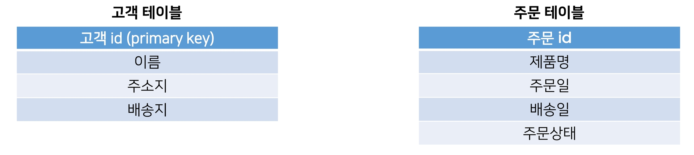
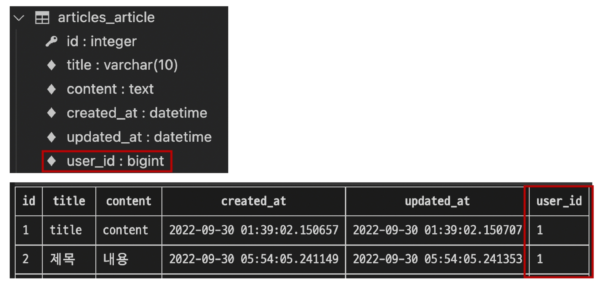

# Database

## A many-to-one relationship

### 개요

관계형 데이터베이스에서의 외래 키 속성을 사용해 모델간 N:1 관계 설정하기

### Intro

#### RDB(관계형 데이터베이스) 복습

데이터를 테이블, 행, 열 등으로 나누어 구조화하는 방식

RDB의 모든 테이블에는 행에서 고유하게 식별 가능한 기본 키라는 속성이 있으며, 외래 키를 사용하여 각 행에서 서로 다른 테이블 간의 관계를 만드는 데 사용할 수 있음

- 각각의 행이 다른 테이블에 참조할 수 있는 것이 외래키

#### 관계(Relationship)

테이블 간의 상호작용을 기반으로 설정되는 여러 테이블 간의 논리적인 연결

상대방이 가져갈 수 있는 값을 가져감

#### 테이블 간 관계 예시



다음과 같이 어떠한 서비스의 데이터베이스에 고객 테이블과 주문 테이블이 존재

고객 테이블에는 고객에 관한 데이터가, 주문 테이블에는 주문에 관한 거래 정보가 포함됨


만약 고객들이 특정 제품을 주문한다면 주문 테이블에 레코드가 생성됨 

그런데 해당 주문이 올바르게 배송되기 위해서는 어떤 고객이 주문 했는지를 알아야 함 

- 즉, 배송지 주소를 가지고 있는 고객 테이블의 정보를 포함해야 함

주문 테이블에서 어떻게 고객 테이블 정보를 포함 할 수 있을까?


컬럼을 추가

각 주문데이터에 고객 정보를 입력하는 방법이 있음

하지만 이렇게 이름으로 저장할 경우 이름이 같은 다른 사용자를 구분할 수 없음

- 김진수가 같은김진수인지 다른 김진수인지 모름

그렇다면 고객 정보의 어떤 데이터를 사용하는 것이 적합할까?


고객 정보의 기본 키(PK)인 고객 id 정보를 저장하는 방법이 있음

- 1,3 같은 사람이란것 알수 있음

이처럼 관계형 데이터베이스에서 한 테이블의 필드 중 다른 테이블의 행을 식별할 수 있는 키를 외래 키(foreign key, FK)라 함


이렇게 되면 이 두 테이블은 공유된 고객 id를 기반으로 연결되며 다양한 명령 처리를 진행할 수 있음 

- 특정 날짜에 구매한 모든 고객 정보 확인하기
- 지난 달에 배송이 지연된 주문을 받은 고객 처리하기
- 특정 고객이 주문한 모든 주문 정보 조회하기... 등

실제 상황보다는 간단한 예시지만 이처럼 RDB는 데이터 간의 매우 복잡한 관계를 보여주고 처리하는 데 탁월한 방식

#### RDB에서의 관계

1. 1:1
   - One-to-one relationships
   - 한 테이블의 레코드 하나가 다른 테이블의 레코드 단 한 개와 관련된 경우

2. N:1
   - Many-to-one relationships
   - 한 테이블의 0개 이상의 레코드가 다른 테이블의 레코드 한 개와 관련된 경우
     - 아까 예시에서의 주문테이블(한 테이블)-고객 테이블(다른 테이블)
     - 주문 테이블 N : 고객 테이블 1
     - 0개 이상인 이유 아직 주문이 없을 수도 있음
   - 기준 테이블에 따라(1:N, One-to-many relationships)이라고도 함
3. M: N
   - Many-to-many relationships
   - 한 테이블의 0개 이상의 레코드가 다른 테이블의 0개 이상의 레코드와 관련된 경우
   - 양쪽 모두에서 N:1 관계를 가짐 & M:N에 대한 자세한 내용은 N:1 이후 진행

Many-to-one relationships 예시


여러 개의 주문 입장에서 각각 어떤 주문에 속해 있는지 표현해야 하므로 고객 테이블의 PK를 주문 테이블에 FK로 집어 넣어 관계를 표현

고객(1)은 여러 주문(N)을 진행할 수 있음 

​	❖ 만약 고객이 단 한 개의 주문만 생성할 수 있다면 두 테이블은 1:1 관계라 할 수 있음

- 만약 주문을 한번밖에 못한다면 1대1

### Foreign Key

#### 개념 

외래 키(외부 키)

관계형 데이터베이스에서 한 테이블의 필드 중 다른 테이블의 행을 식별할 수 있는 키

- 한 테이블 N(주문 테이블), 다른 테이블 1(고객 테이블)

참조하는 테이블에서 1개의 키에 해당하고, 이는 참조되는 측 테이블의 기본 키(Primary Key)를 가리킴

- 중복이 일어나면 안되기 때문
- 그게 유일한 키가 되어야 함

참조하는 테이블의 행 1개의 값은, 참조되는 측 테이블의 행 값에 대응됨

- 이 때문에 참조하는 테이블의 행에는, 참조되는 테이블에 나타나지 않는 값을 포함할 수 없음
  - 주문하지 않은 사람 데이터 포함 안됨

참조하는 테이블 행 여러 개가, 참조되는 테이블의 동일한 행을 참조할 수 있음

- 주문 여러개가 고객 한개가 한 것일수도 있음

#### 특징

키를 사용하여 부모 테이블의 유일한 값을 참조 (by 참조 무결성)

- 부모 테이블: 참조되는측

외래 키의 값이 반드시 부모 테이블의 기본 키 일 필요는 없지만 유일한 값이어야 함

- 기본키의 특징이 유일한 값이라서 일반적으로 기본 키 사용

##### [참고] 참조 무결성

데이터베이스 관계 모델에서 관련된 2개의 테이블 간의 일관성을 말함

외래 키가 선언된 테이블의 외래 키 속성(열)의 값은 그 테이블의 부모가 되는 테이블의 기본 키 값으로 존재해야 함

- 없는 값을 쓸 수는 없다

## N:1 (Comment-Article)

### 개요

Comment(N) - Article(1) 

- 댓글은 게시글에 종속되어 있음

Comment 모델과 Article 모델 간 관계 설정

"0개 이상의 댓글은 1개의 게시글에 작성 될 수 있음"

### 모델 관계 설정

게시판의 게시글와 N:1 관계를 나타낼 수 있는 댓글을 구현해보자

N:1 관계에서 댓글을 담당할 Comment 모델은 N, Article 모델은 1이 될 것


참조하는 측에서 외래키를 가짐


만약comment 테이블에 데이터가 다음과 같이 작성되었다면 1번 게시글에는 1개의 댓글이, 3번 게시글에는 2개의 댓글이 작성되어 있다고 볼 수 있음

#### 실습

models.py

```py
class Comment(models.Model):
    content = models.TextField()
    created_at = models.DateTimeField(auto_now_add=True)
    updated_at = models.DateTimeField(auto_now=True)

    def __str__(self):
        return self.content
```

코멘트라는 클래스를 만들어줌

이는 모델스의 모델을 상속받아줌

댓글에 제약을 걸지는 않을 것이므로 텍스트필드

str 함수 : 객체가 출력될 때 무엇으로 출력될지

### Django Relationship fields

#### 종류

1. `OneToOneField()`
   - A one-to-one relationship
2. `ForeignKey()`
   - A many-to-one relationship
3. `ManyToManyField()`
   - A many-to-many relationship

#### `ForeignKey(to, on_delete, **options)`

A many-to-one relationship을 담당하는 Django의 모델 필드 클래스

Django 모델에서 관계형 데이터베이스의 외래 키 속성을 담당

2개의 필수 위치 인자가 필요

1. 참조하는 model class
2. on_delete 옵션

https://docs.djangoproject.com/en/3.2/ref/models/fields/#foreignkey

### Comment Model

#### Comment 모델 정의

models.py

```python
article = models.ForeignKey(Article, on_delete=models.CASCADE)
```

첫번째 인자 Article

이름은 article로 관습적으로 씀

```python
# articles/models.py

class Comment (models.Model):
    article = models.ForeignKey(Article, on_delete=models.CASCADE)
    content = models.CharField(max_length=200)
    created_at = models.DateTimeField(auto_now_add=True)
    updated_at = models.DateTimeField(auto_now=True)
    
    def __str__(self):
        return self.content
```

외래 키 필드는 ForeignKey 클래스를 작성하는 위치와 관계없이 필드의 마지막에 작성됨

ForeignKey() 클래스의 인스턴스 이름은 참조하는 모델 클래스 이름의 단수형(소문자)으로 작성하는 것을 권장 (이유는 이어지는 모델 참조에서 확인 예정)

최종 models.py

```python
from django.db import models

class Article(models.Model):
    title = models.CharField(max_length=10)
    content = models.TextField()
    created_at = models.DateTimeField(auto_now_add=True)
    updated_at = models.DateTimeField(auto_now=True)

    def __str__(self):
        return self.title


class Comment(models.Model):
    article = models.ForeignKey(Article, on_delete=models.CASCADE)
    content = models.TextField()
    created_at = models.DateTimeField(auto_now_add=True)
    updated_at = models.DateTimeField(auto_now=True)

    def __str__(self):
        return self.content
```

#### ForeignKey arguments - on_delete

외래 키가 참조하는 객체가 사라졌을 때, 외래 키를 가진 객체를 어떻게 처리할 지를 정의

- 게시글이 있고 댓글이 있을 때 게시글이 삭제됨
- 이 때 댓글 객체를 어떻게 처리할 것인가

데이터 무결성을 위해서 매우 중요한 설정

on_delete 옵션 값

- CASCADE : 부모 객체(참조 된 객체)가 삭제 됐을 때 이를 참조하는 객체도 삭제
- PROTECT, SET_NULL, SET_DEFAULT .... 등 여러 옵션 값들이 존재
  - 댓글이 있으면 게시글 못지움, 댓글의 외래키 값 NULL, 다른 기본값으로 변경
- 수업에서는 CASCADE 값만 사용할 예정

##### [참고] 데이터 무결성 (Data Integrity)

데이터의 정확성과 일관성을 유지하고 보증하는 것

데이터베이스나 RDBMS의 중요한 기능 

무결성 제한의 유형

1. 개체 무결성 (Entity integrity)
1. 참조 무결성 (Referential integrity) : 참조하는 객체가 존재해야 하고 유일해야 한다
1. 범위 무결성 (Domain integrity)

https://en.wikipedia.org/wiki/Data_integrity

#### Migration 과정 진행

장고는 model.py의 migrations

파이썬으로 되어있어서 ORM이 중간에서 해석

파이썬으로 된 설계도를 SQL로 보내주고 SQL받아서 다시 쿼리셋으로 보내줌

models.py에서 모델에 대한 수정사항이 발생했기 때문에 migration 과정을 진행

```bash
$ python manage.py makemigrations
```

밑에 처럼 뜸

```bash
Migrations for 'articles':
  articles\migrations\0002_comment.py
    - Create model Comment
```

마이그레이션 파일 `0002_comment.py` 생성 확인

dependencies는 이전에 참고한 설계도

migrate 진행

```bash
$ python manage.py migrate
```

입력

```bash
Operations to perform:
  Apply all migrations: accounts, admin, articles, auth, contenttypes, sessions
Running migrations:
  Applying contenttypes.0001_initial... OK
  Applying contenttypes.0002_remove_content_type_name... OK
  Applying auth.0001_initial... OK
  Applying auth.0002_alter_permission_name_max_length... OK
  Applying auth.0003_alter_user_email_max_length... OK
  Applying auth.0004_alter_user_username_opts... OK
  Applying auth.0005_alter_user_last_login_null... OK
  Applying auth.0006_require_contenttypes_0002... OK
  Applying auth.0007_alter_validators_add_error_messages... OK
  Applying auth.0008_alter_user_username_max_length... OK
  Applying auth.0009_alter_user_last_name_max_length... OK
  Applying auth.0010_alter_group_name_max_length... OK
  Applying auth.0011_update_proxy_permissions... OK
  Applying auth.0012_alter_user_first_name_max_length... OK
  Applying accounts.0001_initial... OK
  Applying admin.0001_initial... OK
  Applying admin.0002_logentry_remove_auto_add... OK
  Applying admin.0003_logentry_add_action_flag_choices... OK
  Applying articles.0001_initial... OK
  Applying articles.0002_comment... OK
  Applying sessions.0001_initial... OK
```

migrate 후 Comment 모델 클래스로 인해 생성된 테이블 확인


앱이름_모델이름

ForeignKey 모델 필드로 인해 작성된 컬럼의 이름이 article_id인 것을 확인

- 참조하는 테이블 이름을 소문자 단수형으로 했던 이유
- 누구를 참조하는지 알수 있음
- 그렇다고 article_id로 했으면 article_id_id가 됨

만약 ForeignKey 인스턴스를 article이 아닌 abcd로 생성 했다면 abcd_id로 만들어짐

- 이처럼 명시적인 모델 관계 파악을 위해 참조하는 클래스 이름의 소문자(단수형)로 작성하는 것이 권장 되었던 이유

sqlmigrate해보기

```bash
$ python manage.py sqlmigrate articles 0002
```

```bash
BEGIN;
--
-- Create model Comment
--
CREATE TABLE "articles_comment" ("id" integer NOT NULL PRIMARY KEY AUTOINCREMENT, "content" text NOT NULL, "created_at" datetime NOT NULL, "updated_at" datetime NOT NULL, "article_id" bigint NOT NULL REFERENCES "articles_article" ("id") DEFERRABLE INITIALLY DEFERRED);
CREATE INDEX "articles_comment_article_id_59ff1409" ON "articles_comment" ("article_id");
COMMIT;
```

SQL문으로 어떻게 입력되는지 볼수 있음

- AUTOINCREMENT

- 기본적으로 NOT NULL입력

### 댓글 생성 연습하기

shell_plus 실행

```bash
$ python manage.py shell_plus
```

```bash
# Shell Plus Model Imports
from accounts.models import User
from articles.models import Article, Comment
from django.contrib.admin.models import LogEntry
from django.contrib.auth.models import Group, Permission
from django.contrib.contenttypes.models import ContentType
from django.contrib.sessions.models import Session
# Shell Plus Django Imports
from django.core.cache import cache
from django.conf import settings
from django.contrib.auth import get_user_model
from django.db import transaction
from django.db.models import Avg, Case, Count, F, Max, Min, Prefetch, Q, Sum, When
from django.utils import timezone
from django.urls import reverse
from django.db.models import Exists, OuterRef, Subquery
Python 3.9.13 (tags/v3.9.13:6de2ca5, May 17 2022, 16:36:42) [MSC v.1929 64 bit (AMD64)]
Type 'copyright', 'credits' or 'license' for more information
IPython 8.4.0 -- An enhanced Interactive Python. Type '?' for help.  
```

중간에 보면 comment도 인폴트 된 것 확인

1. 댓글 생성

   Comment 클래스의 인스턴스 comment 생성

   ```python
   comment = Comment()
   ```

   인스턴스 변수 저장

   ```python
   comment.content = 'first comment'
   ```

   - 댓글 내용 들어감

   DB에 댓글 저장

   ```python
   comment.save()
   ```

   ```bash
   django.db.utils. IntegrityError: NOT NULL constraint failed: articles_comment.article_id
   ```

   - NOT NULL이라는 제약조건이 실패했다
   - 어떤 article을 참조하는지 pk값
   - articles_comment 테이블의 ForeignKeyField, article_id 값이 저장시 누락되었기 때문

   게시글 생성 및 확인

   ```python
   article = Article.objects.create(title='title', content='content')
   ```

   ```shell
   In [7]: article.pk
   Out[7]: 1
   In [8]: article
   Out[8]: <Article: title>
   ```

   외래 키 데이터 입력

   ```python
   comment.article = article
   ```

   - 다음과 같이 article 객체 자체를 넣을 수 있음
   - 그러면 알아서 객체의 번호값을 추출해서 저장

   DB에 댓글 저장 및 확인

   ```python
   comment.save()
   ```

   - 아까처럼 에러 안뜸

2. 댓글 속성 값 확인

   ```shell
   In [13]: comment.pk
   Out[13]: 1
   In [14]: comment
   Out[14]: <Comment: first comment>
   ```

   데이터베이스 확인하면 추가된 것 확인 가능

   ```python
   comment.article_id = article.pk
   ```

   이렇게 할수도 있지만 권장하지 않음, 객체를 넣어야 함

   ```shell
   In [17]: comment.content
   Out[17]: 'first comment'
   
   In [19]: comment.article
   Out[19]: <Article: title>
   # 객체 자체가 나옴
   ```

3. comment 인스턴스를 통한 article 값 접근하기

   ```shell
   In [15]: comment.article_id
   Out[15]: 1
   # 직접 컬럼의 값
   
   In [16]: comment.article.pk
   Out[16]: 1
   # 아티클 테이블에 있는 pk를 가져옴
   
   # 두개의 조회 위치 다름
   
   
   In [20]: comment.article.content
   Out[20]: 'content'
   # 내용까지 확인 가능
   ```

4. 두번째 댓글 작성해보기

   ```python
   comment = Comment(content='second comment', article=article)    
   # 이번에는 한번에 article까지
   
   comment.save()
   ```

   ```shell
   In [23]: comment.pk
   Out[23]: 2
   
   In [24]: comment
   Out[24]: <Comment: second comment>
   
   In [25]: commetn.article_id
   Out[25]: 1
   ```

   작성된 댓글 확인 해보기

   

### 관계 모델 참조

n에서 1의 정보 참조할 수 있는대

1에는 n에 대해 정보 확인 안됨

#### Related manager

Related manager는 N:1 혹은 M:N 관계에서 사용 가능한 문맥(context)

Django는 모델 간 N: 1 혹은 M:N 관계가 설정되면 역참조할 때에 사용할 수 있는 manager를 생성

- 우리가 이전에 모델 생성 시 objects라는 매니저를 통해 queryset api를 사용했던 것처럼 related manager를 통해 queryset api를 사용할 수 있게 됨

지금은 N:1 관계에서의 related manager 만을 학습할 것

https://docs.djangoproject.com/en/3.2/ref/models/relations/

#### 역참조

나를 참조하는 테이블(나를 외래 키로 지정한)을 참조하는 것

- article에서 comment를 역참조 한다

즉, 본인을 외래 키로 참조 중인 다른 테이블에 접근하는 것

N:1 관계에서는 1이 N을 참조하는 상황

- 외래 키를 가지지 않은 1이 외래 키를 가진 N을 참조

#### `article.comment_set.method()`

Article 모델이 Comment 모델을 참조(역참조)할 때 사용하는 매니저

article.comment 형식으로는 댓글 객체를 참조 할 수 없음 

- 실제로 Article 클래스에는 Comment와의 어떠한 관계도 작성되어 있지 않음

대신 Django가 역참조 할 수 있는 comment_set manager를 자동으로 생성해 article.comment_set 형태로 댓글 객체를 참조할 수 있음

* N:1 관계에서 생성되는 Related manger의 이름은 참조하는 “모델명_set" 이름 규칙으로 만들어짐

반면 참조 상황(Comment → Article)에서는 실제 ForeignKey 클래스로 작성한 인스턴스가 Comment 클래스의 클래스 변수이기 때문에 comment.article 형태로 작성 가능

- models.py에 comment에는 article이 있어서 당연히 확인 가능하지만 model.py에 article에는 그런 정보 없음

#### Related manager 연습하기

1. 1번 게시글 조회하기

   ```python
   article = Article.objects.get(pk=1)
   ```

   ```shell
   In [28]: article.pk
   Out[28]: 1
   ```

2. dir() 함수를 사용해 클래스 객체가 사용할 수 있는 메서드를 확인하기

   ```shell
   In [29]: dir(article)
   Out[29]: 
   ['DoesNotExist',
    'MultipleObjectsReturned',
    '__class__',
    '__delattr__',
    '__dict__',
    '__dir__',
    '__doc__',
    '__eq__',
    '__format__',
    '__ge__',
    '__getattribute__',
    '__getstate__',
    '__gt__',
    '__hash__',
    '__init__',
    '__init_subclass__',
    '__le__',
    '__lt__',
    '__module__',
    '__ne__',
    '__new__',
    '__reduce__',
    '__reduce_ex__',
    '__repr__',
    '__setattr__',
    '__setstate__',
    '__sizeof__',
    '__str__',
    '__subclasshook__',
    '__weakref__',
    '_check_column_name_clashes',
    '_check_constraints',
    '_check_default_pk',
    '_check_field_name_clashes',
    '_check_fields',
    '_check_id_field',
    '_check_index_together',
    '_check_indexes',
    '_check_local_fields',
    '_check_long_column_names',
    '_check_m2m_through_same_relationship',
    '_check_managers',
    '_check_model',
    '_check_model_name_db_lookup_clashes',
    '_check_ordering',
    '_check_property_name_related_field_accessor_clashes',
    '_check_single_primary_key',
    '_check_swappable',
    '_check_unique_together',
    '_do_insert',
    '_do_update',
    '_get_FIELD_display',
    '_get_expr_references',
    '_get_next_or_previous_by_FIELD',
    '_get_next_or_previous_in_order',
    '_get_pk_val',
    '_get_unique_checks',
    '_meta',
    '_perform_date_checks',
    '_perform_unique_checks',
    '_prepare_related_fields_for_save',
    '_save_parents',
    '_save_table',
    '_set_pk_val',
    '_state',
    'check',
    'clean',
    'clean_fields',
    'comment_set',
    'content',
    'created_at',
    'date_error_message',
    'delete',
    'from_db',
    'full_clean',
    'get_deferred_fields',
    'get_next_by_created_at',
    'get_next_by_updated_at',
    'get_previous_by_created_at',
    'get_previous_by_updated_at',
    'id',
    'objects',
    'pk',
    'prepare_database_save',
    'refresh_from_db',
    'save',
    'save_base',
    'serializable_value',
    'title',
    'unique_error_message',
    'updated_at',
    'validate_unique']
   ```

   - comment_set이 있음

3.  1번 게시글에 작성된 모든 댓글 조회하기 (역참조)

   ```shell
   In [30]: article.comment_set.all()
   Out[30]: <QuerySet [<Comment: first comment>, <Comment: second comment>]>
   ```

   - detail 페이지 등에서 댓글을 출력할 수 있게 됨

4. 1번 게시글에 작성된 모든 댓글 출력하기

   ```python
   comments = article.comment_set.all()
   ```

   - 이렇게 변수에 담아서

   ```shell
   In [32]: for comment in comments:
       ...:     print(comment.content)
       ...:
   first comment
   second comment
   ```

   - 이런식 가능해짐

#### ForeignKey arguments - related_name

```python
# articles/models.py

class Comment(models.Model):
    article = models.ForeignKey(Article, on_delete=models.CASCADE, related_name='comments')
    ...
```

ForeignKey 클래스의 선택 옵션

역참조 시 사용하는 매니저 이름(model_set manager)을 변경할 수 있음

- article.comment_set 대신 딴걸로 가능

작성 후, migration 과정이 필요 · 선택 옵션이지만 상황에 따라 반드시 작성해야 하는 경우가 생기기도 하는데, 이는 추후 자연스럽게 만나볼 예정

- 다대다에 가능

작성 후 다시 원래 코드로 복구 

- 위와 같이 변경 하면 기존 article.comment_set은 더 이상 사용할 수 없고, article.comments로 대체됨
- 별칭이 아니라 아예 바꿔짐

#### admin site 등록

새로 작성한 Comment 모델을 admin site에 등록하기

```python
from .models import Article, Comment
```

위에 Comment 추가

```python
admin.site.register(Comment)
```

models.py

```python
from django.contrib import admin
from .models import Article, Comment

# Register your models here.
admin.site.register(Article)
admin.site.register(Comment)
```

추가

```shell
$ python manage.py createsuperuser
```

```shell
$ python manage.py runserver
```

해서 어드민 들어가면 확인 및 관리 가능

### Comment 구현

#### CREATE

모델 폼 : 모델을 기반으로 필드, 제약조건을 바탕으로 모델폼으로 만들어짐

저장된 데이터 바탕으로 하는거라 모델폼

모델폼과 폼은 사용처가 다를 뿐 어느쪽이 좋은 것이 아님

사용자로부터 댓글 데이터를 입력 받기 위한 CommentForm 작성

```python
from .models import Article, Comment
```

Comment도 import해줌

```python
class CommentForm(forms.ModelForm):

    class Meta:
        model = Comment
        fields = '__all__'
```

추가

최종 `articles/forms.py`

```python
from django import forms
from .models import Article, Comment


class ArticleForm(forms.ModelForm):

    class Meta:
        model = Article
        fields = '__all__'

class CommentForm(forms.ModelForm):

    class Meta:
        model = Comment
        fields = '__all__'
```


articles/views.py

```python
from .forms import ArticleForm, CommentForm
```

CommentForm 추가

```python
	comment_form = CommentForm()
```

detail 함수 안에 이 문장 추가하고

```python
		'comment_form': comment_form
```

context 안에 이거 넣어줌

```python
@require_safe
def detail(request, pk):
    article = Article.objects.get(pk=pk)
    comment_form = CommentForm()
    context = {
        'article': article,
        'comment_form': comment_form
    }
    return render(request, 'articles/detail.html', context)
```

articles/detail.html

```django
  <form action="#" method='POST'>
    
    {{ comment_form }}
    <input type="submit">
  </form>
```

추가

페이지 가보면 외래키를 출력하고 있음


댓글을 어떤 게시글에 쓸지 드랍다운으로 결정할 수 있는 상황

detail 페이지에 출력된 CommentForm을 살펴보면 다음과 같이 출력됨

실 서비스에서는 댓글을 작성할 때 댓글을 어떤 게시글에 작성하는지 직접 게시글 번호를 선택하지 않음

실제로는 해당 게시글에 댓글을 작성하면 자연스럽게 그 게시글에 댓글이 작성되어야 함

다음과 같이 출력되는 이유는 Comment 클래스의 외래 키 필드 article 또한 데이터 입력이 필요하기 때문에 출력 되고 있는 것

하지만, 외래 키 필드는 사용자의 입력으로 받는 것이 아니라 view 함수 내에서 받아 별도로 처리되어 저장되어야 함

- 출력에서 가리고 사용자로부터는 content를 받고 article은 다른곳에서 받게 해야함

articles/form.py

```python
		exclude = ('article',)
```

출력 제외하는 법

```python
class CommentForm(forms.ModelForm):

    class Meta:
        model = Comment
        exclude = ('article',)
```

출력에서 제외된 외래 키 데이터는 어디서 받아와야 할까?

detail 페이지의 url을 살펴보면 `path('<int:pk>/', views.detail, name='detail')`

url에 해당 게시글의 pk 값이 사용 되고 있음

댓글의 외래 키 데이터에 필요한 정보가 바로 게시글의 pk 값

이전에 학습했던 url을 통해 변수를 넘기는 `variable routing`을 사용

`articles/urls.py`

```python
    path('<int:pk>/comments/', views.comments_create, name='comments_create')
```

추가

```python
from django.urls import path
from . import views


app_name = 'articles'
urlpatterns = [
    path('', views.index, name='index'),
    path('create/', views.create, name='create'),
    path('<int:pk>/', views.detail, name='detail'),
    path('<int:pk>/delete/', views.delete, name='delete'),
    path('<int:pk>/update/', views.update, name='update'),
    path('<int:pk>/comments/', views.comments_create, name='comments_create')
]
```

`views.py`

```python
def comments_create(request, pk):
    # 몇번째 글인지 알아야
    article = Article.objects.get(pk=pk)
    comment_form = CommentForm(request.POST)
    if comment_form.is_valid():
        comment_form.save()
    return redirect('article:detail', article.pk)
```

함수 만들어줌

`detail.html`

아까 코멘츠 폼에 #으로 해놨던 url 추가

```django

```

```django
  <form action="" method='POST'>
    
    {{ comment_form }}
    <input type="submit">
  </form>
```

이렇게 하고 페이지 가면 IntegrityError 뜸

article.pk를 폼에 넣지 않았기 때문(아까 출력 제외함)

아까 코멘트 데이터 만드는 과정

```python
comment = Comment()
comment.content = 'aaa'
comment.article = article
comment.save()
```

코멘트 인스턴스를 불러와야 article 객체를 넣을 수 있음

검증할 필요가 없어서 밸리드 뒤에 넣고

save메소드에 더 추가할 수 있는 옵션값이 있음

commit=False하면 저장은 아직 안하고 저장할 인스턴스를 제공해서 거기 더 추가할 수 있게 함

##### The save() method

`save(commit=False)`

"Create, but don't save the new instance."

아직 데이터베이스에 저장되지 않은 인스턴스를 반환

저장하기 전에 객체에 대한 사용자 지정 처리를 수행할 때 유용하게 사용

https://docs.djangoproject.com/en/3.2/topics/forms/modelforms/#the-save-method

save 메서드의 commit 옵션을 사용해 DB에 저장되기 전 article 객체 저장하기

```python
		comment= comment_form.save(commit=False)
```

저장하려는 인스턴스 불러와서

```python
        comment.article = article
```

article 데이터에 article 객체로 넣어주고

```python
        comment.save()
```

그 후에 저장

`articles/views.py`

```python
def comments_create(request, pk):
    # 몇번째 글인지 알아야
    article = Article.objects.get(pk=pk)
    comment_form = CommentForm(request.POST)
    if comment_form.is_valid():
        comment= comment_form.save(commit=False)
        comment.article = article
        comment.save()
    return redirect('articles:detail', article.pk)
```

테이블 확인하면 댓글 추가되어 있음


#### READ

작성한 댓글 목록 출력하기

특정 article에 있는 모든 댓글을 가져온 후 context에 추가

`views.py`

context의 댓글 목록을 가져와야함

역참조해야함

디테일 함수 안에

```python
    comments = article.comment_set.all()
```

넣어주고

```python
        'comments' : comments
```

context 추가

``` python
@require_safe
def detail(request, pk):
    article = Article.objects.get(pk=pk)
    comment_form = CommentForm()
    comments = article.comment_set.all()
    context = {
        'article': article,
        'comment_form': comment_form,
        'comments' : comments
    }
    return render(request, 'articles/detail.html', context)
```

detail 템플릿에서 댓글 목록 출력하기

`detail.html`

```django
  <h4>댓글 목록</h4>
  <ul>
    
      <li>{{ comment.content}}</li>
    
  </ul>
  <hr>
```

페이지 가보면 댓글 출력되어 있음

#### DELETE

댓글 삭제 구현하기

urls.py

  ```py
  	path('<int:comment_pk>/comments/delete/', views.comments_delete, name='comments_delete'),
  ```

```python
from django.urls import path
from . import views


app_name = 'articles'
urlpatterns = [
    path('', views.index, name='index'),
    path('create/', views.create, name='create'),
    path('<int:pk>/', views.detail, name='detail'),
    path('<int:pk>/delete/', views.delete, name='delete'),
    path('<int:pk>/update/', views.update, name='update'),
    path('<int:pk>/comments/', views.comments_create, name='comments_create'),
    path('<int:comment_pk>/comments/delete/', views.comments_delete, name='comments_delete'),
]
```

views.py

```python
from .models import Article, Comment

```

Comment 추가 import

```python
def comments_delete(request, comment_pk):
    comment = Comment.objects.get(pk=comment_pk)
    # article_pk는 comment에서 article을 구할 수 있기 때문이 그거 선언해줌
    article_pk = comment.article.pk
    comment.delete()
    return redirect('articles:detail', article_pk)
```


두번째 방법은 urls에서 pk 두개 다 받는것

```python
    path('<int:article_pk>/comments/<int:comment_pk>/delete/', views.comments_delete, name='comments_delete'),

```

``` python
from django.urls import path
from . import views


app_name = 'articles'
urlpatterns = [
    path('', views.index, name='index'),
    path('create/', views.create, name='create'),
    path('<int:pk>/', views.detail, name='detail'),
    path('<int:pk>/delete/', views.delete, name='delete'),
    path('<int:pk>/update/', views.update, name='update'),
    path('<int:pk>/comments/', views.comments_create, name='comments_create'),
    path('<int:article_pk>/comments/<int:comment_pk>/delete/', views.comments_delete, name='comments_delete'),
]
```


이 방법은 계속 article_pk로 url쓰던 일관성을 유지할 수 있음

view 함수에 하나 더 받아줌

```python
def comments_delete(request, article_pk, comment_pk):
```

```python
def comments_delete(request, article_pk, comment_pk):
    comment = Comment.objects.get(pk=comment_pk)
    comment.delete()
    return redirect('articles:detail', article_pk)
```

댓글을 삭제할 수 있는 버튼을 각각의 댓글에 출력

detail.html

리스트에 코멘트 담긴거 각각에

```django
        <form action="" method='POST'>
          
          <input type="submit">
        </form>
```

variable ro팅이 두개 들어감

```django



  <h1>DETAIL</h1>
  <h2>{{ article.pk }}번째 글입니다.</h2>
  <hr>
  <p>제목 : {{ article.title }}</p>
  <p>내용 : {{ article.content }}</p>
  <p>작성 시각 : {{ article.created_at }}</p>
  <p>수정 시각 : {{ article.updated_at }}</p>
  <a href="">UPDATE</a>
  <form action="" method="POST">
    
    <input type="submit" value="DELETE">
  </form>
  <hr>
  <a href="">뒤로가기</a>
  <hr>
  <h4>댓글 목록</h4>
  <ul>
    
      <li>{{ comment.content}}
        <form action="" method='POST'>
          
          <input type="submit">
        </form>
      </li>
    
  </ul>
  <hr>
  <form action="" method='POST'>
    
    {{ comment_form }}
    <input type="submit">
  </form>


```

#### 댓글 수정을 지금 구현하지 않는 이유

댓글 수정도 게시글 수정과 마찬가지로 구현이 가능

- 게시글 수정 페이지가 필요했던 것처럼 댓글 수정 페이지가 필요하게 됨

하지만 일반적으로 댓글 수정은 수정 페이지로 이동 없이 현재 페이지가 유지된 상태로 댓글 작성 Form 부분만 변경되어 수정 할 수 있도록 함

이처럼 페이지의 일부 내용만 업데이트 하는 것은 JavaScript의 영역이기 때문에 JavaScript를 학습한 후 별도로 진행하도록 함

#### Comment 추가 사항

##### 개요

댓글에 관련된 아래 2가지 사항을 작성하면서 마무리하기

1. 댓글 개수 출력하기
   1. DTL filter - length 사용
   2. Queryset API - count() 
      - 메소드
2.  댓글이 없는 경우 대체 컨텐츠 출력하기

##### 댓글 개수 출력하기 

###### DTL filter - length 사용

```django
{{ comments|length }}

{{ article.comment_set.all|length }}
```

###### Queryset API - count() 

```django
{{ comments.count }}

{{ article.comment_set.count }}
```

###### 출력하기

detail.html

```django
  
  <p>{{ comments|length }}개의 댓글이 있습니다.</p>
  
```

댓글이 있다면

##### 댓글이 없을 때 대체 텍스트 출력하기

DTL에 for empty 활용하기

for

empty

endfor

- for문에 반복가능한 객체가 없다면 empty안에 있는 것 출력

```django
    
      <li>댓글이 없어요..</li>
```

for문 안에 맨 아래에 추가

```python
    
      <li>{{ comment.content}}
        <form action="" method='POST'>
          
          <input type="submit" value='DELETE'>
        </form>
      </li>
    
      <li>댓글이 없어요..</li>
    
```

전체 for문

## N:1 (Article - User)

### 개요

Article(N) - User(1)

Article 모델과 User 모델 간 관계 설정

“0개 이상의 게시글은 1개의 회원에 의해 작성 될 수 있음"

###  Referencing the User model

#### Django에서 User 모델을 참조하는 방법

1. `settings.AUTH_USER_MODEL`
2. get_user_model()
   - 예전에 accounts에서 커스텀한 폼 만들때 사용
   - 이때 models에서 직접 User을 참조하지 않고 이 함수 사용
   - 현재 활성화되고 있는 유저 모델 가져오는 함수

##### settings.AUTH_USER_MODEL

반환 값 : 'accounts.User' (문자열)

- 이거 예전에 settings.py에서 AUTH_USER_MODEL = 'accounts.User'로 기본 유저를 바꿔놨기 때문

User 모델에 대한 외래 키 또는 M:N 관계를 정의 할 때 사용

 models.py의 모델 필드에서 User 모델을 참조할 때 사용

##### get_user_model()

반환 값 : User Object (객체)

현재 활성화(active)된 User 모델을 반환

커스터마이징한 User 모델이 있을 경우는 Custom User 모델, 그렇지 않으면 User를 반환

models.py가 아닌 다른 모든 곳에서 유저 모델을 참조할 때 사용

##### Django에서 User 모델을 참조하는 방법 정리 

문자열과 객체를 반환하는 특징과 Django의 내부적인 실행 원리에 관련된 것

- 문자열을 주고 객체를 주는 차이

- models.py에는 문자열을 필요로 함

- 장고 프로젝트 안에서 models.py는 객체가 나오기 전에 실행됨

당장 알 필요는 없고 이렇게만 외우도록 한다. 

User 모델을 참조할 때 

- models.py에서는 settings.AUTH_USER_MODEL
- 다른 모든 곳에서는 get_user_model()

### 모델 관계 설정

#### Article과 User간 모델 관계 설정


Article 모델에 User 모델을 참조하는 외래 키 작성

models.py

```python
from django.conf import settings
```

추가

```python
    user = models.ForeignKey(settings.AUTH_USER_MODEL, on_delete=models.CASCADE)
```

article모델에 외래키 데이터 추가

```python
from django.db import models
from django.conf import settings

class Article(models.Model):
    user = models.ForeignKey(settings.AUTH_USER_MODEL, on_delete=models.CASCADE)
    title = models.CharField(max_length=10)
    content = models.TextField()
    created_at = models.DateTimeField(auto_now_add=True)
    updated_at = models.DateTimeField(auto_now=True)

    def __str__(self):
        return self.title
```

models.py 바뀌었으니 마이그레이트

### Migration 진행

기존에 존재하던 테이블에 새로운 컬럼이 추가되어야 하는 상황이기 때문에 migrations 파일이 곧바로 만들어지지 않고 일련의 과정이 필요

makemigrations하기

```bash
$ python manage.py makemigrations
```

```bash
You are trying to add a non-nullable field 'user' to article without a default; we can't do that (the database needs something to populate existing rows).
Please select a fix:
 1) Provide a one-off default now (will be set on all existing rows with a null value for this column)
 2) Quit, and let me add a default in models.py
Select an option: 
```

첫번째 화면 

- 기본적으로 모든 컬럼은 NOT NULL 제약조건이 있기 때문에 데이터가 없이는 새로 추가되는 외래 키 필드 user_id가 생성되지 않음
- 그래서 기본값을 어떻게 작성할 것인지 선택해야 함
- 1을 입력하고 Enter 진행 (다음 화면에서 직접 기본 값 입력)

기본값 없이 기존 테이블에 데이터를 붙이려 하네 원래 있던 데이터들에 외래키들은 어떻게 할거야

1번 - 다음 화면 넘어가서 직접 기본값 입력 할것이냐

2번 - 화면 나가서 코드에서 기본값 넣을 것이냐

저번에 1번 선택하면 날짜 적합 데이터 넣어줌

이번에도 1번

```ba
Select an option: 1
Please enter the default value now, as valid Python
The datetime and django.utils.timezone modules are available, so you can do e.g. timezone.now
Type 'exit' to exit this prompt
>>> 
```

두번째 화면 

comment의 user_id에 어떤 데이터를 넣을 것인지 직접 입력해야 함

마찬가지로 1 입력하고 Enter 진행

그러면 기존에 작성된 댓글이 있다면 모두 1번 회원이 작성한 것으로 처리됨

```bash
>>> 1
Migrations for 'articles':
  articles\migrations\0003_article_user.py
    - Add field user to article
```

migrate 진행

```bash
$ python manage.py migrate
```

article 테이블 스키마 변경 및 확인



기본값으로 다 1번 들어가있다

### CREATE 

#### 개요

인증된 회원의 댓글 작성 구현하기 

작성하기 전 로그인을 먼저 진행한 상태로 진행

#### ArticleForm


ArticleForm 출력을 확인해보면 create 템플릿에서 불필요한 필드(user)가 출력됨

- 전에는 없었는데 이번에 USER 관계 만들어주면서 생김
- user도 받아야 하기 때문

이전에 CommentForm에서 외래 키 필드 article이 출력되는 상황과 동일한 상황

user 필드도 마찬가지로 사용자로부터 받는 것이 아니라 request 객체에서 가져옴

전에는 없었는데 이번에 USER 관계 만들어주면서 생김

user도 받아야 하기 때문

일단 forms.py에 가서 ArticleForm에

```python
        exclude = ('user',)
```

이거 추가해줌

```python
from django import forms
from .models import Article, Comment


class ArticleForm(forms.ModelForm):

    class Meta:
        model = Article
        exclude = ('user',)
```

일단 출력은 사라짐

근데 이상태에서 내용 넣어서 게시글 작성하면 안써짐

user 데이터 필요하기 때문

views.py 가서 create 함수 바꿔줌

바꾸기 전

```python
@login_required
@require_http_methods(['GET', 'POST'])
def create(request):
    if request.method == 'POST':
        form = ArticleForm(request.POST)
        if form.is_valid():
            article = form.save()
            return redirect('articles:detail', article.pk)
    else:
        form = ArticleForm()
    context = {
        'form': form,
    }
    return render(request, 'articles/create.html', context)
```

여기에

```python
			article = form.save(commit=False)
```

commit안해주고

```python
            article.user = request.user
```

 유저 지정해줘야 하는데 그 데이터는 request에 있음 게시글 생성을 요청하는 user

```python
            article.save()
```

그 다음에야 세이브

```python
@login_required
@require_http_methods(['GET', 'POST'])
def create(request):
    if request.method == 'POST':
        form = ArticleForm(request.POST)
        if form.is_valid():
            article = form.save(commit=False)
            # 커밋하지 않음
            article.user = request.user
            # 유저 지정해줘야 하는데 그 데이터는 request에 있음 게시글 생성을 요청하는 user
            article.save()
            # 그 다음에 세이브
            return redirect('articles:detail', article.pk)
    else:
        form = ArticleForm()
    context = {
        'form': form,
    }
    return render(request, 'articles/create.html', context)
```

### DELETE

#### 게시글 삭제 시 작성자 확인

이제 게시글에는 작성자 정보가 함께 들어있기 때문에 현재 삭제를 요청하려는 사람과 겟기글을 작성한 사람을 비교하여 본인의 게시글만 삭제할 수 있도록 함

views.py의 delete 수정

바꾸기전

```python
@require_POST
def delete(request, pk):
    if request.user.is_authenticated:
        article = Article.objects.get(pk=pk)
        article.delete()
    return redirect('articles:index')
```

인증만 되면 삭제 가능

```python
        if request.user == article.user:
```

추가해서 유저이기도 해야 삭제 가능하게 함

```python
    article = Article.objects.get(pk=pk)
```

if문 위로 올려서 if문에서 사용할수 있게함

삭제하고는 index로 가고 삭제 안하면 그냥 detail에 남도록 함

변경 후

```python
@require_POST
def delete(request, pk):
    # if문에서 쓰기 때문에 위로 올림
    article = Article.objects.get(pk=pk)
    if request.user.is_authenticated:
        if request.user == article.user:
            article.delete()
            return redirect('articles:index')
    return redirect('articles:detail', article.pk)
```

### UPDATE

#### 게시글 수정시 작성자 확인

수정도 마찬가지로 수정을 요청하려는 사람과 게시글을 작성한 사람을 비교하여 본인의 게시글만 수정할 수 있도록 함

views.py

```python
@login_required
@require_http_methods(['GET', 'POST'])
def update(request, pk):
    article = Article.objects.get(pk=pk)
    if request.method == 'POST':
        form = ArticleForm(request.POST, instance=article)
        if form.is_valid():
            form.save()
            return redirect('articles:detail', article.pk)
    else:
        form = ArticleForm(instance=article)
    context = {
        'form': form,
        'article': article,
    }
    return render(request, 'articles/update.html', context)
```

검사하기 전에 같은지 if문 넣어줌

```python
    if request.user == article.user:
```

아니면 메인페이지로 보냄

```python
    else:
        return redirect('articles:index')
```

바뀐 후

```python
@login_required
@require_http_methods(['GET', 'POST'])
def update(request, pk):
    article = Article.objects.get(pk=pk)
    if request.user == article.user:
        if request.method == 'POST':
            form = ArticleForm(request.POST, instance=article)
            # form = ArticleForm(data=request.POST, instance=article)
            if form.is_valid():
                form.save()
                return redirect('articles:detail', article.pk)
        else:
            form = ArticleForm(instance=article)
    else:
        return redirect('articles:index')
    context = {
        'form': form,
        'article': article,
    }
    return render(request, 'articles/update.html', context)
```

추가로 해당 게시글의 작성자가 아니라면, 수정/삭제 버튼을 출력하지 않도록 함

detail.html

```django
  
  
```

사이에 

```django
    <a href="">UPDATE</a>
    <form action="" method="POST">
      
      <input type="submit" value="DELETE">
    </form>
```

넣어줌

추가후 detail.html

```django



  <h1>DETAIL</h1>
  <h2>{{ article.pk }}번째 글입니다.</h2>
  <hr>
  <p>제목 : {{ article.title }}</p>
  <p>내용 : {{ article.content }}</p>
  <p>작성 시각 : {{ article.created_at }}</p>
  <p>수정 시각 : {{ article.updated_at }}</p>
  
    <a href="">UPDATE</a>
    <form action="" method="POST">
      
      <input type="submit" value="DELETE">
    </form>
  
  <hr>
  <a href="">뒤로가기</a>
  <hr>
  <h4>댓글 목록</h4>
  
  <p>{{ comments|length }}개의 댓글이 있습니다.</p>
  
  <ul>
    
      <li>{{ comment.content}}
        <form action="" method='POST'>
          
          <input type="submit" value='DELETE'>
        </form>
      </li>
    
      <li>댓글이 없어요..</li>
    
  </ul>
  <hr>
  <form action="" method='POST'>
    
    {{ comment_form }}
    <input type="submit">
  </form>


```

다른 계정으로 보면 수정삭제 버튼 안보임

### READ

#### 게시글 작성자 출력

index 템플릿과 detail 템플릿에서 각 게시글의 작성자 출력

index.html

```django
    <p><b>작성자 : {{ article.user }}</b></p>
```

추가해줌

원래 

```django
    <p><b>작성자 : {{ article.user.username }}</b></p>
```

해야 하는데 user의 기본 str함수가 username을 출력하도록 되어 있음

detail.html에도 추가

```django
    <p><b>작성자 : {{ article.user }}</b></p>
```

## N:1 (Comment - User)

### 개요

Comment(N) - User(1)

Comment 모델과 User 모델 간 관계 설정

"0개 이상의 댓글은 1개의 회원에 의해 작성 될 수 있음"

- 안쓸수도 있고 1개 쓸수도 있고 여러개 쓸수도 있음

### 모델 관계 설정


comment는 이제 몇번 게시글 댓글인지 누가 댓글인지

외래키 두개 됨


models.py 변경

Comment 모델에

```python
    user = models.ForeignKey(settings.AUTH_USER_MODEL, on_delete=models.CASCADE)
```

추가

```python
class Comment(models.Model):
    article = models.ForeignKey(Article, on_delete=models.CASCADE)
    user = models.ForeignKey(settings.AUTH_USER_MODEL, on_delete=models.CASCADE)
    content = models.TextField()
    created_at = models.DateTimeField(auto_now_add=True)
    updated_at = models.DateTimeField(auto_now=True)

    def __str__(self):
        return self.content
```

마이그레이션 한번더

makemigrations

안내문 또뜸

또 1번 넣어줌

migrate

테이블 스키마 보면 user_id 1 추가되어있음

### CREATE

#### 개요

인증된 회원의 댓글 작성 구현하기

작성하기 전 로그인을 먼저 진행한 상태로 진행

#### CommentForm

CommentForm 출력을 확인해보면 create 템플릿에서 불필요한 필드(user)가 출력됨

- 외래키를 받아야 하기 때문에
- 하지만 사용자로부터 받는 것이 아니라 request로 받음

user 필드도 마찬가지로 사용자로부터 받는 것이 아니라 request로 전달받은 데이터로 처리

forms.py로 갑니다

CommentForm의 exclude에 user 추가

변경전

```python
class CommentForm(forms.ModelForm):

    class Meta:
        model = Comment
        # fields = '__all__'
        exclude = ('article')
```

```python
        exclude = ('article', 'user')
```

변경후

```python
class CommentForm(forms.ModelForm):

    class Meta:
        model = Comment
        # fields = '__all__'
        exclude = ('article', 'user')
```

이제 댓글 작성 뷰 함수 가서 user는 request에서 받도록 해줌

views.py

comments_create함수에

이미 아티클 하느라 세이브 되기전에 받아놓은 인스턴스 변수가 있어서 거기 넣어줌

```python
        comment.user = request.user
```

```python
def comments_create(request, pk):
    # 몇번째 글인지 알아야
    article = Article.objects.get(pk=pk)
    comment_form = CommentForm(request.POST)
    if comment_form.is_valid():
        comment= comment_form.save(commit=False)
        comment.article = article
        comment.user = request.user
        comment.save()
    return redirect('articles:detail', article.pk)
```

### READ

#### 댓글 작성자 출력

detail 템플릿에서 각 게시글의 작성자 출력

댓글목록 안 각 리스트에

```django
{{ comment.user }}
```

추가

댓글 목록 부분

```django
    <h4>댓글 목록</h4>
      
      <p>{{ comments|length }}개의 댓글이 있습니다.</p>
      
      <ul>
        
          <li>
            {{ comment.user }} - {{ comment.content}}
            <form action="" method='POST'>
              
              <input type="submit" value='DELETE'>
            </form>
          </li>
        
          <li>댓글이 없어요..</li>
        
      </ul>
```

전체 detail.html

```django



  <h1>DETAIL</h1>
  <h2>{{ article.pk }}번째 글입니다.</h2>
  <hr>
  <p><b>작성자 : {{ article.user }}</b></p>
  <p>제목 : {{ article.title }}</p>
  <p>내용 : {{ article.content }}</p>
  <p>작성 시각 : {{ article.created_at }}</p>
  <p>수정 시각 : {{ article.updated_at }}</p>
  
    <a href="">UPDATE</a>
    <form action="" method="POST">
      
      <input type="submit" value="DELETE">
    </form>
  
  <hr>
  <a href="">뒤로가기</a>
  <hr>
  <h4>댓글 목록</h4>
  
  <p>{{ comments|length }}개의 댓글이 있습니다.</p>
  
  <ul>
    
      <li>
        {{ comment.user }} - {{ comment.content}}
        <form action="" method='POST'>
          
          <input type="submit" value='DELETE'>
        </form>
      </li>
    
      <li>댓글이 없어요..</li>
    
  </ul>
  <hr>
  <form action="" method='POST'>
    
    {{ comment_form }}
    <input type="submit">
  </form>

```

### DELETE

#### 댓글 삭제 시 작성자 확인

이제 댓글에는 작성자 정보가 함께 들어있기 때문에 현재 삭제를 요청하려는 사람과 댓글을 작성한 사람을 비교하여 본인의 댓글에만 삭제할 수 있도록 함

views.py

```py
    if request.user == comment.user:
```

넣어줌

```python
def comments_delete(request, article_pk, comment_pk):
    comment = Comment.objects.get(pk=comment_pk)
    if request.user == comment.user:
        comment.delete()
    return redirect('articles:detail', article_pk)
```

삭제버튼 작성자만 볼 수 있게

detail.html

```django
        

        
```

해주고 안에 삭제 버튼 넣어줌

댓글목록 부분

```django
  <h4>댓글 목록</h4>
  
  <p>{{ comments|length }}개의 댓글이 있습니다.</p>
  
  <ul>
    
      <li>
        {{ comment.user }} - {{ comment.content}}
        
          <form action="" method='POST'>
            
            <input type="submit" value='DELETE'>
          </form>
        
      </li>
    
      <li>댓글이 없어요..</li>
    
  </ul>
```

### 인증된 사용자에 대한 접근 제한하기

#### 개요

is_authenticated와 view decorator를 활요하여 코드 정리하기

- is_authenticated: 어나니머스는 못하게 하고 로그인해야 하게 함
- view decorator 
  - @login_required
  - @require_http_methods(['GET', 'POST'])
  - @require_POST
  - @require_safe
    - GET만

views.py

comments_create 함수에

전체 내용 앞에

```python
    if request.user.is_authenticated:
```

해주고

아닐 경우

```python
	return redirect('accounts:login')
```

로그인 페이지로 보냄

변경전

```python
def comments_create(request, pk):
    # 몇번째 글인지 알아야
    article = Article.objects.get(pk=pk)
    comment_form = CommentForm(request.POST)
    if comment_form.is_valid():
        comment= comment_form.save(commit=False)
        comment.article = article
        comment.user = request.user
        comment.save()
    return redirect('articles:detail', article.pk)
```

변경후

```python
def comments_create(request, pk):
    if request.user.is_authenticated:
        # 몇번째 글인지 알아야
        article = Article.objects.get(pk=pk)
        comment_form = CommentForm(request.POST)
        if comment_form.is_valid():
            comment= comment_form.save(commit=False)
            comment.article = article
            comment.user = request.user
            comment.save()
        return redirect('articles:detail', article.pk)
	return redirect('accounts:login')
```

로그인 안하면 댓글창 안보이고 로그인해주세요 뜨게 하기

detail.html

댓글창을 if문으로 감싸줌

```django
  

  
```

```django
  
  <form action="" method='POST'>
    
    {{ comment_form }}
    <input type="submit">
  </form>
  
```

else문으로 로그인 안했으면 로그인 링크 뜨게 함

```django
  
    <a href="">댓글을 작성하려면 로그인하세요.</a>
```

댓글창 변경 후

```django
  
  <form action="" method='POST'>
    
    {{ comment_form }}
    <input type="submit">
  </form>
  
    <a href="">댓글을 작성하려면 로그인하세요.</a>
  
```


삭제도 인증된 사람만 하게 하기

로그인보다 인증된 사람인지 먼저 봐야 함

views.py에

comment_delete 함수

변경전

```python
def comments_delete(request, article_pk, comment_pk):
    comment = Comment.objects.get(pk=comment_pk)
    if request.user == comment.user:
        comment.delete()
    return redirect('articles:detail', article_pk)
```

함수 내용

```python
    if request.user.is_authenticated:
```

안에 넣어버림

변경후

```python
def comments_delete(request, article_pk, comment_pk):
    if request.user.is_authenticated:
        comment = Comment.objects.get(pk=comment_pk)
        if request.user == comment.user:
            comment.delete()
    return redirect('articles:detail', article_pk)
```

댓글이 작성되는건 POST만 받아야 함

views.py

comments_create 함수에

```python
@require_POST
```

 추가

```python
@require_POST
def comments_create(request, pk):
    if request.user.is_authenticated:
        # 몇번째 글인지 알아야
        article = Article.objects.get(pk=pk)
        comment_form = CommentForm(request.POST)
        if comment_form.is_valid():
            comment= comment_form.save(commit=False)
            comment.article = article
            comment.user = request.user
            comment.save()
        return redirect('articles:detail', article.pk)
    return redirect('accounts:login')
```

삭제도 POST만 되도록 추가

```python
@require_POST
def comments_delete(request, article_pk, comment_pk):
    if request.user.is_authenticated:
        comment = Comment.objects.get(pk=comment_pk)
        if request.user == comment.user:
            comment.delete()
    return redirect('articles:detail', article_pk)
```

## 마무리

### 마무리 INDEX

 A many-to-one relationship 

- Foreign Key
- Django Relationship fields
  - 역참조를 위해 _set하는 특수한 매니저
- Related manager

N:1 모델 관계 설정

1. Comment - Article
2. Article - User
   - Referencing the User model
     - models.py에서만 settings.AUTH_USER_MODEL 쓰기

3. Comment - User

### import문 쓰는 순서

어느 정도 가이드가 존재한다

- https://docs.djangoproject.com/en/dev/internals/contributing/writing-code/coding-style/

```python
# PSL에 있는 파이썬 스탠다드 라이브러리
# standard library
import json
from itertools import chain

# 설치한것 pip install 설치하고
# third-party
import bcrypt

# 장고 내장 라이브러리
# Django
from django.http import Http404
from django.http.response import (
    Http404, HttpResponse, HttpResponseNotAllowed, StreamingHttpResponse,
    cookie,
)

# 로컬에서 가져온것 (.)
# local Django
from .models import LogEntry

# try/except
try:
    import yaml
except ImportError:
    yaml = None

CONSTANT = 'foo'


class Example:
    # ...
```

같은 레벨이면 짧은 것부터

isort 라이브러리

```bash
$ python -m pip install "isort >= 5.1.0"
```

설치 후

```bash
$ isort accounts/views.py
```

이렇게 사용

장고에서 원하는 양식에 맞춰서 정리해주는 라이브러리

기타 스타일

{{ }} 안에 띄어쓰기 해주기

request 풀네임 다 써주기

필드명은 대문자 쓰지 마라

클래스 메타는 한줄 띄고 넣어라

초이스 필드


### 상태별로 에러

딜리트인 경우 is_authenricated  안될때도 redirect하고 user가 작성자가 아닐때도 redirect해서 구분 안됨

이걸 숫자 세자리의 오류 페이지로 연결


```python
    if request.user.is_authenticated:
```

안될때 : 인증되지 않았다

https://developer.mozilla.org/ko/docs/Web/HTTP/Status

401 Unauthorized

비록 HTTP 표준에서는 "미승인(unauthorized)"를 명확히 하고 있지만, 의미상 이 응답은 "비인증(unauthenticated)"을 의미합니다. 클라이언트는 요청한 응답을 받기 위해서는 반드시 스스로를 인증해야 합니다.


```python
        if request.user == comment.user:
```

안될때 : 권한이 없다

403 Forbidden

클라이언트는 콘텐츠에 접근할 권리를 가지고 있지 않습니다. 예를들어 그들은 미승인이어서 서버는 거절을 위한 적절한 응답을 보냅니다. 401과 다른 점은 서버가 클라이언트가 누구인지 알고 있습니다.

- 누구인지는 알겠는데 지울 권한이 없다


401 페이지로 보내주기

views.py

변경전

```python
@require_POST
def delete(request, pk):
    # if문에서 쓰기 때문에 위로 올림
    article = Article.objects.get(pk=pk)
    if request.user.is_authenticated:
        if request.user == article.user:
            article.delete()
            return redirect('articles:index')
    return redirect('articles:detail', article.pk)
```


```python
from django.http import HttpResponse
```

인폴트 해줌

delete 함수

 authenticated 안될때 리턴에

```python
    return HttpResponse(status=401)
```

하면 401 오류 페이지로 감


403 페이지로 보내주기

```python
from django.http import HttpResponseForbidden
```

인폴트

delete함수

`request.user == article.user` 안될때 공간에

```python
            return HttpResponseForbidden
```

하면 됨

확인하려면 로그인 한 상태로 남의 글 지우기

하면 403 오류 페이지 뜸

변경후

views.py

```python
from django.shortcuts import render, redirect
from django.http import HttpResponse, HttpResponseForbidden

...

def delete(request, pk):
    # if문에서 쓰기 때문에 위로 올림
    article = Article.objects.get(pk=pk)
    if request.user.is_authenticated:
        if request.user == article.user:
            article.delete()
            return redirect('articles:index')
        return HttpResponseForbidden()
    return HttpResponse(status=401)
```

