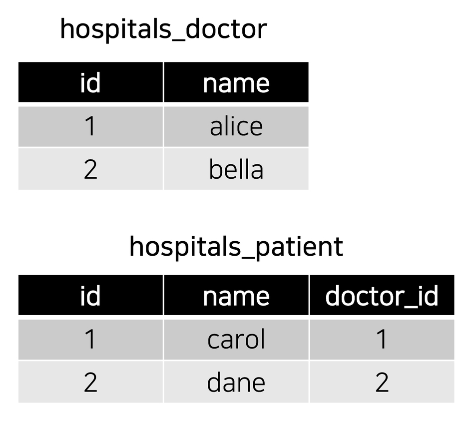
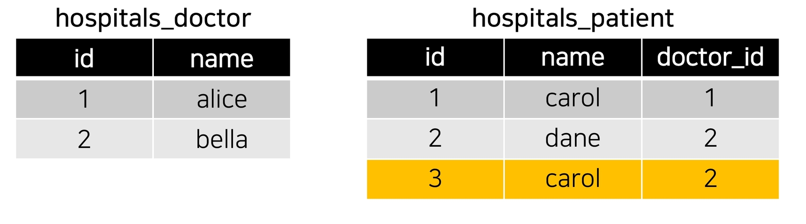
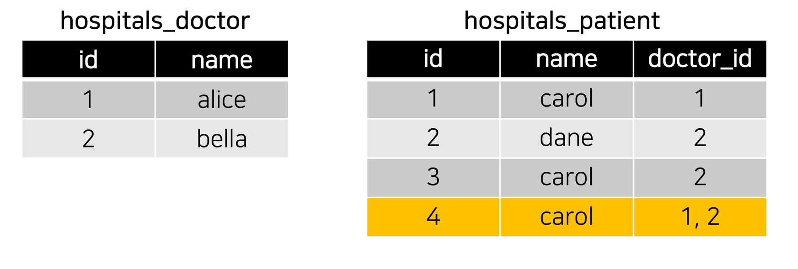
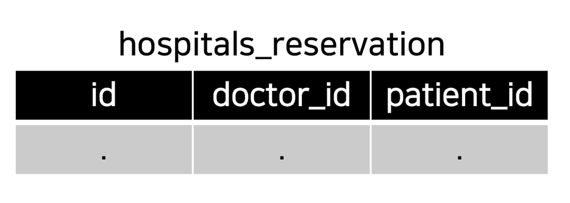
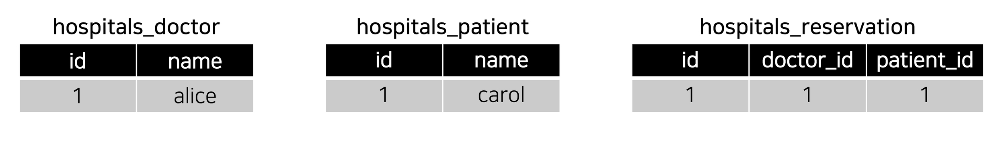
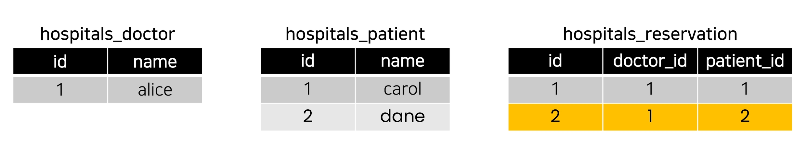
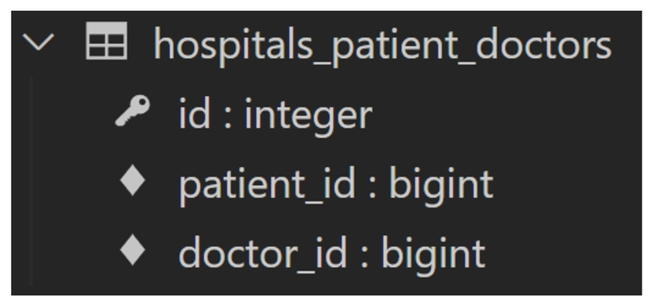
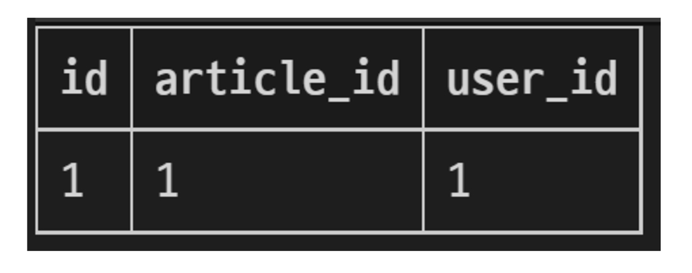
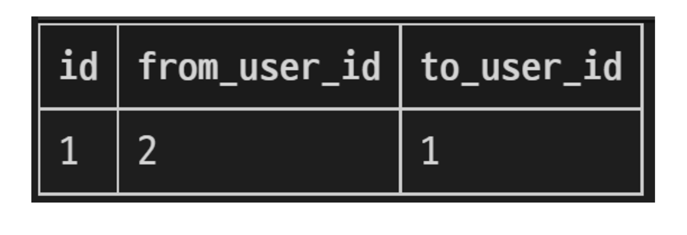

# Database

## Many to Many relationship

### Intro

#### RDB에서의 관계 복습

1. `1:1`
   - One-to-one relationships
   - 한 테이블의 레코드 하나가 다른 테이블의 레코드 단 한 개와 관련된 경우
2. `N:1`
   - Many-to-one relationships
   - 한 테이블의 0개 이상의 레코드가 다른 테이블의 레코드 한 개와 관련된 경우
   - 기준 테이블에 따라(1:N, One-to-many relationships)이라고도 함
3. `M:N`
   - Many-to-many relationships
   - 한 테이블의 0개 이상의 레코드가 다른 테이블의 0개 이상의 레코드와 관련된 경우
   - 양쪽 모두에서 N:1 관계를 가짐

#### 개요

병원에 내원하는 환자와 의사의 예약 시스템을 구축하라는 업무를 지시 받음

- 필요한 데이터 베이스 모델을 고민해보고 모델링 진행하기
- 모델링을 하는 이유는 현실 세계를 최대한 유사하게 반영하기 위함

무엇부터 고민해야 할까?

- 병원 시스템에서 가장 핵심이 되는 것은? → 의사와 환자
- 이 둘의 관계를 어떻게 표현할 수 있을까?

우리 일상에 가까운 예시를 통해 DB를 모델링하고 그 내부에서 일어나는 데이터의 흐름을 어떻게 제어할 수 있을지 고민해보기

#### [참고] 데이터 모델링

주어진 개념으로부터 논리적인 데이터 모델을 구성하는 작업

물리적인 데이터베이스 모델로 만들어 고객의 요구에 따라 특정 정보 시스템의 데이터베이스에 반영하는 작업

#### 시작하기 전 용어 정리

`target model`

- 관계 필드를 가지지 않은 모델
- 예) Comment-Article
  - Comment가 Article을 참조함
  - 코멘트가 소스모델, 아티클이 타겟모델

`source model`

- 관계 필드를 가진 모델

#### N:1의 한계

의사와 환자간 예약 시스템을 구현

지금까지 배운 N:1 관계를 생각해 한 명의 의사에게 여러 환자가 예약할 수 있다고 모델 관계를 설정

```python
# hospitals/models.py

class Doctor(models.Model):
    name = models.TextField()

    def __str__(self):
        return f'{self.pk}번 의사 {self.name}'


class Patient(models.Model):
    doctor = models.ForeignKey(Doctor, on_delete=models.CASCADE)
    name = models.TextField()

    def __str__(self):
        return f'{self.pk}번 환자 {self.name}'
```

migration

```bash
$ python manage.py makemigrations
$ python manage.py migrate
```

의사 두명 환자 두명 만듬

```bash
In [2]: doctor1 = Doctor.objects.create(name='alice')

In [3]: doctor2 = Doctor.objects.create(name='bella')

In [4]: patient1 = Patient.objects.create(name='carol', doctor=doctor1)

In [5]: patient2 = Patient.objects.create(name='dane', doctor=doctor2)

In [6]: doctor1
Out[6]: <Doctor: 1번 의사 alice>

In [7]: doctor2
Out[7]: <Doctor: 2번 의사 bella>

In [8]: patient1
Out[8]: <Patient: 1번 환자 carol>

In [9]: patient2
Out[9]: <Patient: 2번 환자 dane>
```

1번 환자(carol)가 두 의사 모두에게 방문하려고 함

```bash
In [10]: patient3 = Patient.objects.create(name='carol', doctor=doctor2)
```



예약 테이블이면 이래도 되는데 환자 테이블인데 같은 사람이 다른 pk를 가지게 됨

동시에 예약할 수는 없을까?

```bash
In [11]: patient4 = Patient.objects.create(name='carol', doctor=doctor1, doctor2)
  File "<ipython-input-11-d8f6d418c249>", line 1
    patient4 = Patient.objects.create(name='carol', doctor=doctor1, doctor2)
                                                                           ^
SyntaxError: positional argument follows keyword argument
```




동일한 환자지만 다른 의사에게 예약하기 위해서는 객체를 하나 더 만들어서 예약을 진행해야 함

- 새로운 환자 객체를 생성할 수 밖에 없음

외래 키 컬럼에 '1, 2' 형태로 참조하는 것은 Integer 타입이 아니기 때문에 불가능

그렇다면 “예약 테이블을 따로 만들자"

#### 중개 모델

환자 모델의 외래 키를 삭제하고 별도의 예약 모델을 새로 작성

```python
from django.db import models

# Create your models here.
class Doctor(models.Model):
    name = models.TextField()

    def __str__(self):
        return f'{self.pk}번 의사 {self.name}'


class Patient(models.Model):
    name = models.TextField()

    def __str__(self):
        return f'{self.pk}번 환자 {self.name}'


class Reservation(models.Model):
    doctor = models.ForeignKey(Doctor, on_delete=models.CASCADE)
    patient = models.ForeignKey(Patient, on_delete=models.CASCADE)

    def __str__(self):
        return f'{self.doctor_id}번 의사의 {self.patient_id}번 환자'
```

새롭게 migration

```bash
$ python manage.py makemigrations
$ python manage.py migrate
```


예약 모델은 의사와 환자에 각각 N:1관계를 가짐



의사와 환자 생성 후 예약 만들기

```bash
In [1]: doctor1 = Doctor.objects.create(name='alice')

In [2]: patient1 = Patient.objects.create(name='carol')

In [3]: doctor1
Out[3]: <Doctor: 1번 의사 alice>

In [5]: patient1
Out[5]: <Patient: 1번 환자 carol>

In [7]: Reservation.objects.create(doctor=doctor1, patient=patient1)
Out[7]: <Reservation: 1번 의사의 1번 환자>
```




1번 의사가 본인에게 예약된 모든 환자를 조회

```bash
In [8]: doctor1.reservation_set.all()
Out[8]: <QuerySet [<Reservation: 1번 의사의 1번 환자>]>
```

1번 환자가 자신의 모든 예약을 조회

```bash
In [9]: patient1.reservation_set.all()
Out[9]: <QuerySet [<Reservation: 1번 의사의 1번 환자>]>
```

1번 의사에 환자 한명 더 추가

```bash
In [12]: Reservation.objects.create(doctor=doctor1, patient=patient2)
Out[12]: <Reservation: 1번 의사의 2번 환자>

In [13]: doctor1.reservation_set.all()
Out[13]: <QuerySet [<Reservation: 1번 의사의 1번 환자>, <Reservation: 1번 의사의 2번 환자>]>
```



장고는 다대다 관계에서 별개의 모델을 사용

#### Django ManyToManyField

`models.py`

환자에 관계 필드 하나 추가

```python
    doctors = models.ManyToManyField(Doctor)
```

다대다 필드는 복수형으로

변경후

```python
from django.db import models

# Create your models here.
class Doctor(models.Model):
    name = models.TextField()

    def __str__(self):
        return f'{self.pk}번 의사 {self.name}'


class Patient(models.Model):
    doctors = models.ManyToManyField(Doctor)
    name = models.TextField()

    def __str__(self):
        return f'{self.pk}번 환자 {self.name}'
```

새롭게 migration

```bash
$ python manage.py makemigrations
$ python manage.py migrate
```

이렇게 하고 데이터베이스 스키마 보면

`patient`에 별개의 필드가 새로 생긴게 아님

`hospital_patient_doctors`가 생겼는데 아까 `Reservation`이랑 똑같이 생김

- 알아서 중개 테이블을 만들어준것

`patient`에 작성하던 `doctor`에 작성하던 상관 없다

- 외래키는 반드시 종속되는 쪽에 작성
- 다대다는 비종속적인 관계이기 때문에 어디에 써도 상관 없다

참조와 역참조의 관계만 달라짐

- `patient`에 쓰면 `patient`가 `doctor` 참조 `doctor`가 `patient` 역참조


예약을 잡는 주체는 환자와 의사

`Reservation` 만들었을때는 `Reservation`이 객체 선언해서 어색했음

하지만 `ManytoManyField`는 `doctor`와 `patient`가 주체가 되고 이게 자연스러움

의사 1명 환자 2명 생성

```bash
In [1]: doctor1 = Doctor.objects.create(name='alice')

In [2]: patient1 = Patient.objects.create(name='carol')

In [3]: patient2 = Patient.objects.create(name='dane')
```

1번 환자가 1번 의사에게 예약

환자가 의사에게 예약 - 참조

`add()`

```bash
In [4]: patient1.doctors.add(doctor1)
```

환자가 의사를 추가한다는 자연스러운 구문이 나옴

중개 테이블 데이터 보면 환자 닥터 연결된 데이터 나옴

조회하는 법 - 역참조할 필요 없음, 참조임

```bash
In [5]: patient1.doctors.all()
Out[5]: <QuerySet [<Doctor: 1번 의사 alice>]>
```

훨씬 편함

의사 입장에서 조회할때

- 역참조라 `_set` 쓰게 됨

```bash
In [6]: doctor1.patient_set.all()
Out[6]: <QuerySet [<Patient: 1번 환자 carol>]>
```

- ManyToManyField를 어디다 쓰느냐에 따라 달라지는 부분
- 하지만 기능적으로는 똑같다


의사가 환자에게 예약도 가능

- 다대다 관계의 특징

의사1이 환자2와 예약 잡음

```bash
In [7]: doctor1.patient_set.add(patient2)
```

의사1 환자 목록 확인

```bash
In [8]: doctor1.patient_set.all()
Out[8]: <QuerySet [<Patient: 1번 환자 carol>, <Patient: 2번 환자 dane>]>
```

중개모델 때는 reservation을 한번 거쳐서 목록이 나왔는데

매니투매니에서는 한번에 나옴


삭제도 양쪽에서 다 가능하다

`remove()`

의사쪽에서 취소하기

```bash
In [10]: doctor1.patient_set.remove(patient1)
```

환자쪽에서 취소하기

```bash
In [11]: patient2.doctors.remove(doctor1)
```

Django는 ManyToManyField를 통해 중개 테이블을 자동으로 생성함

의사는 `의사.patient_set.`

환자는 `환자.doctors.`

두개 통일시켜 주고 싶음 -> related_name

#### 'related_name' argument

`target model`이 `source model`을 참조할 때 사용할

`ForeignKey()`의 `relate_name`과 동일

`models.py`에 변경

변경전

`related_name` 추가

```python
    doctors = models.ManyToManyField(Doctor, related_name='patients')
```

```python
from django.db import models

# Create your models here.
class Doctor(models.Model):
    name = models.TextField()

    def __str__(self):
        return f'{self.pk}번 의사 {self.name}'


class Patient(models.Model):
    doctors = models.ManyToManyField(Doctor, related_name='patients')
    name = models.TextField()

    def __str__(self):
        return f'{self.pk}번 환자 {self.name}'
```

새롭게 migration

```bash
$ python manage.py makemigrations
$ python manage.py migrate
```

이전 방식으로 `_set` 쓰면

```bash
In [2]: doctor1.patient_set.all()
---------------------------------------------------------------------------
AttributeError                            Traceback (most recent call last)
<ipython-input-2-e81b89c43a95> in <module>
----> 1 doctor1.patient_set.all()

AttributeError: 'Doctor' object has no attribute 'patient_set'
```

이제

```bash
In [3]: doctor1.patients.all()
Out[3]: <QuerySet []>
```

이렇게 조회가능

#### 'through' argument

그렇다면 중개 모델을 직접 작성하는 경우는 없을까?

- 중개 테이블을 수동으로 지정하려는 경우 `through` 옵션을 사용하여 사용하려는 중개 테이블을 나타내는 Django 모델을 지정할 수 있음

가장 일반적인 용도는 중개테이블에 추가 데이터를 사용해 다대다 관계와 연결하려는 경우

- 예약의 경우 예약일이 언제이고 어디가 아파서 예약했는지와 같은 경우

`ManyToManyField`랑 중개 테이블 둘 다 만들어줘야 함

`through` 설정 및 `Reservation Class` 수정

- 이제는 예약 정보에 증상과 예약일이라는 추가 데이터가 생김


다시 중개 테이블 만듬

`models.py`

```python
class Reservation(models.Model):
    doctor = models.ForeignKey(Doctor, on_delete=models.CASCADE)
    patient = models.ForeignKey(Patient, on_delete=models.CASCADE)
    symptom = models.TextField()
    reseved_at = models.DateTimeField(auto_now_add=True)
    

    def __str__(self):
        return f'{self.doctor_id}번 의사의 {self.patient_id}번 환자'
```

`Patient`모델에 `doctors`필드 수정

```python
    doctors = models.ManyToManyField(Doctor, related_name='patients', through='Reservation')
```

원래 자동으로 생성하던 테이블을 여기 들어가는 테이블로 대체하겠다

전체

```python
from django.db import models

# Create your models here.
class Doctor(models.Model):
    name = models.TextField()

    def __str__(self):
        return f'{self.pk}번 의사 {self.name}'


class Patient(models.Model):
    doctors = models.ManyToManyField(Doctor, related_name='patients', through='Reservation')
    name = models.TextField()

    def __str__(self):
        return f'{self.pk}번 환자 {self.name}'


class Reservation(models.Model):
    doctor = models.ForeignKey(Doctor, on_delete=models.CASCADE)
    patient = models.ForeignKey(Patient, on_delete=models.CASCADE)
    symptom = models.TextField()
    reseved_at = models.DateTimeField(auto_now_add=True)


    def __str__(self):
        return f'{self.doctor_id}번 의사의 {self.patient_id}번 환자'
```

새롭게 migration

```bash
$ python manage.py makemigrations
$ python manage.py migrate
```

장점 

- 따로 `Reservation 테이블 호출할 필요없이 아까처럼 자연스럽게 가능
- 여전히 `Reservation`을 호출해서 생성하는 것 또한 가능

의사1 환자2 생성

```bash
In [1]: doctor1 = Doctor.objects.create(name='alice')

In [2]: patient1 = Patient.objects.create(name='carol')

In [3]: patient2 = Patient.objects.create(name='dane')
```

`reservation`으로 생성

```bash
In [5]: reservation1 = Reservation.objects.create(doctor=doctor1, patient=patient1, symptom='headache')
```

`add()`에 추가 데이터 넣으려면 `through_defaults`에 딕셔너리 넣음

```bash
In [8]: patient2.doctors.add(doctor1, through_defaults={'symptom':'flu'})
```

예약삭제

```python
doctor1.patients.remove(patient1)
patient2.doctors.remove(doctor1)
```

#### 정리

`M:N` 관계로 맺어진 두 테이블에는 변화가 없음

`Django`의 `ManyToManyField`은 중개 테이블을 자동으로 생성함

`Django`의 `ManyToManyField`는 `M:N` 관계를 맺는 두 모델 어디에 위치해도 상관 없음

- 대신 필드 작성 위치에 따라 참조와 역참조 방향을 주의할 것

N: 1은 완전한 종속의 관계였지만 M:N은 의사에게 진찰받는 환자, 환자를 진찰하는 의사의 두 가지 형태로 모두 표현이 가능한 것

### ManyToManyField

#### ManyToManyField란

`ManyToManyField(to, **options)`

다대다 (M:N, many-to-many) 관계 설정 시 사용하는 모델 필드

하나의 필수 위치인자(M:N 관계로 설정할 모델 클래스)가 필요

모델 필드의 RelatedManager를 사용하여 관련 개체를 추가, 제거 또는 만들 수 있음

- `add()`, `remove()`, `create()`, `clear()` ...

#### 데이터베이스에서의 표현

Django는 다대다 관계를 나타내는 중개 테이블을 만듦

테이블 이름은 ManyToManyField 이름과 이를 포함하는 모델의 테이블 이름을 조합하여 생성됨

`'db_table' arguments`을 사용하여 중개 테이블의 이름을 변경할 수도 있음

#### ManyToManyFieldManyToMany Field's Arguments

1. `related_name`
2. `through`
3. `symmetrical`

##### related_name

`target model`이 `source model`을 참조할 때 사용할 `manager name`

`ForeignKey`의 `related_name`과 동일

##### through

중개 테이블을 직접 작성하는 경우, through 옵션을 사용하여 중개 테이블을 나타내는 Django 모델을 지정 

- 이 중개 테이블을 이용해서 작성하겠다

일반적으로 중개 테이블에 추가 데이터를 사용하는 다대다 관계와 연결하려는 경우(extra data with a many-to-many relationship)에 사용됨

##### symmetrical

대칭이라는 뜻

기본값 : `True`

`ManyToManyField`가 동일한 모델(`on self`)을 가리키는 정의에서만 사용

- 사람-사람

```python
# 예시

class Person(models. Model):
    friends = models.ManyToManyField('self')
    # friends = models. ManyToManyField('self', symmetrical=False)
```

- 사람1이 사람2를 친구로 생각할 수 있는데

- 사람2가 사람2 친구로 생각 안할 수도 있음

대칭이 True면 한쪽이 추가되면 다른쪽도 추가됨

False면 한쪽이 추가되도 다른쪽에 추가 안됨

대표적인 예 : `Follow`

#### Related Manager

N:1 혹은 M:N 관계에서 사용 가능한 문맥(context)

- 대표적으로 `_set`

Django는 모델 간 N: 1 혹은 M:N 관계가 설정되면 역참조시에 사용할 수 있는 manager를 생성

- 우리가 이전에 모델 생성 시 `objects` 라는 매니저를 통해 `queryset api`를 사용했던 것처럼 `related manager`를 통해 `queryset api`를 사용할 수 있게 됨

같은 이름의 메서드여도 각 관계(`N:1`, `M:N`)에 따라 다르게 사용 및 동작됨

- `N:1`에서는` target 모델 객체`만 사용 가능
- `M:N` 관계에서는 관련된 두 객체에서 모두 사용 가능

메서드 종류

- `add()`, `remove()`, `create()`, `clear()`, `set()` 등

##### methods

*`many-to-many relationships` 일 때의 동작만 작성되었음

###### add()

“지정된 객체를 관련 객체 집합에 추가

이미 존재하는 관계에 사용하면 관계가 복제되지 않음

모델 인스턴스, 필드 값(PK)을 인자로 허용

###### remove()

"관련 객체 집합에서 지정된 모델 개체를 제거"

내부적으로 `QuerySet.delete()`를 사용하여 관계가 삭제됨

모델 인스턴스, 필드 값(PK)을 인자로 허용

### 중개 테이블 필드 생성 규칙

1. 소스(`source model`) 및 대상(`target model`) 모델이 다른 경우

   - `id`

   - `<containing_model>_id`

   - `<other_model>_id`

     

2. `ManyToManyField`가 동일한 모델을 가리키는 경우

   - `id`
   - `from_<model>_id`
   - `to_<model>_id`


## M:N (Article-User)

###  개요

Article과 User의 M:N 관계 설정을 통한 좋아요 기능 구현하기

### LIKE

#### 모델 관계 설정

`models.py`에

아티클 모델에

```python
    like_users = models.ManyToManyField(settings.AUTH_USER_MODEL)
```

추가

```python
from django.db import models
from django.conf import settings


# Create your models here.
class Article(models.Model):
    user = models.ForeignKey(settings.AUTH_USER_MODEL, on_delete=models.CASCADE)
    like_users = models.ManyToManyField(settings.AUTH_USER_MODEL)
    title = models.CharField(max_length=10)
    content = models.TextField()
    created_at = models.DateTimeField(auto_now_add=True)
    updated_at = models.DateTimeField(auto_now=True)

    # def __str__(self):
    #     return self.title


class Comment(models.Model):
    article = models.ForeignKey(Article, on_delete=models.CASCADE)
    user = models.ForeignKey(settings.AUTH_USER_MODEL, on_delete=models.CASCADE)
    content = models.CharField(max_length=200)
    created_at = models.DateTimeField(auto_now_add=True)
    updated_at = models.DateTimeField(auto_now=True)

    def __str__(self):
        return self.content
```

`makemigrations`하려고 하면

```bash
$ python manage.py makemigrations
```

```bash
SystemCheckError: System check identified some issues:

ERRORS:
articles.Article.like_users: (fields.E304) Reverse accessor for 'articles.Article.like_users' clashes with reverse accessor for 'articles.Article.user'.
        HINT: Add or change a related_name argument to the definition for 'articles.Article.like_users' or 'articles.Article.user'.
articles.Article.user: (fields.E304) Reverse accessor for 'articles.Article.user' clashes with reverse accessor for 'articles.Article.like_users'.
        HINT: Add or change a related_name argument to the definition for 'articles.Article.user' or 'articles.Article.like_users'.
(venv) 
```

역참조가 충돌한다

Article:User(N:1)

참조 : `article.user`

역참조: `user.article_set`


Article:User (M:N)

참조: `article.like_users`

역참조: `user.article_set`


`user.article_set`이 두개가 충돌하게 됨

`related_name`을 필수적으로 사용해야 하는 상화

- 일반적으로 M:N을 바꿈
- M:N에서 `related_name`을 `like_articles`로 만듬

```python
    like_users = models.ManyToManyField(settings.AUTH_USER_MODEL, related_name='like_articles')
```

로 변경

```python
from django.db import models
from django.conf import settings


# Create your models here.
class Article(models.Model):
    user = models.ForeignKey(settings.AUTH_USER_MODEL, on_delete=models.CASCADE)
    like_users = models.ManyToManyField(settings.AUTH_USER_MODEL, related_name='like_articles')
    title = models.CharField(max_length=10)
    content = models.TextField()
    created_at = models.DateTimeField(auto_now_add=True)
    updated_at = models.DateTimeField(auto_now=True)

    # def __str__(self):
    #     return self.title


class Comment(models.Model):
    article = models.ForeignKey(Article, on_delete=models.CASCADE)
    user = models.ForeignKey(settings.AUTH_USER_MODEL, on_delete=models.CASCADE)
    content = models.CharField(max_length=200)
    created_at = models.DateTimeField(auto_now_add=True)
    updated_at = models.DateTimeField(auto_now=True)

    def __str__(self):
        return self.content


```

다시 migration하고 테이블 보면 `articles_article_like_users` 생김


like_users 필드 생성 시 자동으로 역참조에는 `.article_set` 매니저가 생성됨

그러나 이전 N: 1(Article-User) 관계에서 이미 해당 매니저를 사용 중

- `user.article_set.all()` → 해당 유저가 작성한 모든 게시글 조회
- user가 작성한 글들(`user.article_set`)과 user가 좋아요를 누른 글(`user.article_set`)을 구분할 수 없게 됨

user와 관계된 `ForeignKey` 혹은 `ManyToManyField` 중 하나에 `related_name`을 작성해야 함

#### User - Article간 사용 가능한 related manager 정리

- `article.user`
  - 게시글을 작성한 유저 - N: 1
- `user.article_set`
  - 유저가 작성한 게시글(역참조) - N: 1
- `article.like_users`
  - 게시글을 좋아요한 유저 - M:N 
- `user.like_articles`
  - 유저가 좋아요한 게시글(역참조) - M:N

#### LIKE 구현

##### url 및 view 함수 작성

`urls.py`

`variable routing`으로 `article_pk`보내줌

```python
    path('<int:article_pk>/likes/', views.likes, name='likes'),
```

추가

최종

```python
from django.urls import path
from . import views


app_name = 'articles'
urlpatterns = [
    path('', views.index, name='index'),
    path('create/', views.create, name='create'),
    path('<int:pk>/', views.detail, name='detail'),
    path('<int:pk>/delete/', views.delete, name='delete'),
    path('<int:pk>/update/', views.update, name='update'),
    path('<int:pk>/comments/', views.comments_create, name='comments_create'),
    path('<int:article_pk>/comments/<int:comment_pk>/delete/', views.comments_delete, name='comments_delete'),
    path('<int:article_pk>/likes/', views.likes, name='likes'),
]
```

`views.py`

```python
    article = Article.objects.get(pk=article_pk)
```

article 호출

좋아요 추가뿐 아니라 취소도 해야 함

각각 add remove

추가해야할 유저는 현재 요청한 유저 - `request.user`

```python
    article.like_users.add(request.user)
```

취소는 remove

```python
    article.like_users.remove(request.user)
```

if문으로 두개를 구분해줘야함

어떤 기준으로 두개를 구분할 것인가

```python
    if request.user in article.like_users.all():
```

이것도 되는데 in은 데이터 커지면 좀 무리

```python
    if article.like_users.filter(pk=request.user.pk).exists():
```

이것도 가능

`.exists()`

- `QuerySet`에 결과가 포함되어 있으면 True를 반환하고 그렇지 않으면 False를 반환

- 특히 큰 `QuerySet`에 있는 특정 개체의 존재와 관련된 검색에 유용

- in보다는 보통 빠르다, 항상 빠른것은 아님

- 사실 없어도 목록에 있는지 없는지 똑같이 True False로 나오기 떄문에 되긴 하는데 애초에 T/F로 나오는거랑 같 구한다음에 T/F로 평가하는지랑 봤을 때 바로 나오는게 좋다

```py
    if article.like_users.filter(pk=request.user.pk).exists():
        article.like_users.remove(request.user)
    else:
        article.like_users.add(request.user)
```

메인 페이지에 만들거라 리다이렉트해줌

```python
    return redirect('articles:index')
```

최종

```python
def likes(request, article_pk):
    article = Article.objects.get(pk=article_pk)
    if article.like_users.filter(pk=request.user.pk).exists():
        article.like_users.remove(request.user)
    else:
        article.like_users.add(request.user)
    return redirect('articles:index')
```

##### index 템플릿에서 각 게시글에 좋아요 버튼 출력하기

```django
    <div>
      <form action="" method="POST">
        
        
          <input type="submit" value="좋아요 취소">
        
          <input type="submit" value="좋아요">
        
      </form>
    </div>
```

추가

##### 좋아요 버튼 출력 확인

출력확인하려고 create 갔는데 like users 설정할 수 있음

이거 지워줌

`forms.py`

`exclude` 에 `like_users` 추가

```python
        exclude = ('user', 'like_users',)
```

```python
class ArticleForm(forms.ModelForm):

    class Meta:
        model = Article
        # fields = '__all__'
        exclude = ('user', 'like_users',)
```


##### 좋아요 버튼 클릭 후 좋아요 테이블 확인



1번 유저가 1번 게시글에 1번째 좋아요 눌렀다

지웠다가 다시하면 id가 2임 오토인그레먼트라 재사용 안함

##### 데코레이터 및 is_authenticated 추가

POST만 받아야 하기 때문에

```python
@require_POST
```

추가

인증된건지 확인하고

``` python
    if request.user.is_authenticated:
```

아니면 로그인창으로

```python
    return redirect('accounts:login')
```

안에 기존 내용물 넣어줌

```python
@require_POST
def likes(request, article_pk):
    if request.user.is_authenticated:
        article = Article.objects.get(pk=article_pk)
        
        if article.like_users.filter(pk=request.user.pk).exists():
            article.like_users.remove(request.user)
        else:
            article.like_users.add(request.user)
        return redirect('articles:index')
    return redirect('accounts:login')
```

## M:N (User-User)

### 개요

User 자기 자신과의 M:N 관계 설정을 통한 팔로우 기능 구현하기

- `on-self`라고 함

### Profile

#### 개요

자연스러운 follow 흐름을 위한 프로필 페이지를 먼저 작성

#### Profile 구현

##### url 및 view 함수 작성

account에 할거냐 article에 할거냐 할 때 유저쪽이랑 관계 있어서 account가 적당

`accounts/urls.py`

`<str:>`로도 variable rounting 가능

주의할점이 `<str:>`로 하고 앞에 profile 안넣었고 맨위에 넣으면 모든 문자열이 다 <str:>로 가버리는 경우가 생김

밑에 있으면 문제될건 없는데, 확장성을 봤을 때 그래도 별로

```python
    path('profile/<str:username>', views.profile, name='profile'),
```

추가

```python
from django.urls import path
from . import views


app_name = 'accounts'
urlpatterns = [
    path('login/', views.login, name='login'),
    path('logout/', views.logout, name='logout'),
    path('signup/', views.signup, name='signup'),
    path('delete/', views.delete, name='delete'),
    path('update/', views.update, name='update'),
    path('password/', views.change_password, name='change_password'),
    path('profile/<str:username>', views.profile, name='profile'),
]
```

`accounts/views.py`

유저를 가져올때 User 직접 참조는 장고에서 권하지 않음

하나는 `settings.AUTH_USER_MODEL`인데 이건 models.py만

거기 말고 다른 곳에서는 `get_user_model()`

```python
from django.contrib.auth import get_user_model
```

`import` 해주고

바로 `get_user_model().objects.get`할수도 있지만

User로 한번 변수 넣어주는게 더 직관적

```python
def profile(request, username):
    User = get_user_model()
    person = User.objects.get(username=username)
```

context 넣어서 render

```python
    context = {
        'person': person,
    }
    return render(request, 'accounts/profile.html', context)
```

최종

```python
from django.shortcuts import render
from django.contrib.auth import get_user_model

...

def profile(request, username):
    User = get_user_model()
    person = User.objects.get(username=username)
    context = {
        'person': person,
    }
    return render(request, 'accounts/profile.html', context)
```

##### profile 템플릿 작성

`accounts/protfile.html`

기본 틀

```django




```

유저네임

```django
  <h1>{{ person.username }}님의 프로필</h1>
```

게시글들은 역참조해야함

```django
  
    <div>{{ article.title }}</div>
  
```

댓글도 역참조

```django
  
    <div>{{ comment.content }}</div>
  
```

좋아요도 역참조인데 `related_name` 설정한걸로

```django
  
    <div>{{ article.title }}</div>
  
```

최종

```django



  <h1>{{ person.username }}님의 프로필</h1>

  <h2>{{ person.username }}님이 작성한 모든 게시글</h2>
  
  <div>{{ article.title }}</div>
  
  
  <h2>{{ person.username }}님이 작성한 모든 댓글</h2>
  
  <div>{{ comment.content }}</div>
  
  
  <h2>{{ person.username }}님이 좋아요 한 모든 게시글</h2>
  
    <div>{{ article.title }}</div>
  
  

```

##### profile 템플릿으로 이동할 수 있는 하이퍼 링크 작성

`base.html`

인자로 보낼 수 있으려면 username 보내야 하는데 user.username 또는 request.user.username

```django
      <a href=""></a>
```

최종

```django
<!DOCTYPE html>
<html lang="en">
<head>
  <meta charset="UTF-8">
  <meta http-equiv="X-UA-Compatible" content="IE=edge">
  <meta name="viewport" content="width=device-width, initial-scale=1.0">
  <link href="https://cdn.jsdelivr.net/npm/bootstrap@5.2.0/dist/css/bootstrap.min.css" rel="stylesheet" integrity="sha384-gH2yIJqKdNHPEq0n4Mqa/HGKIhSkIHeL5AyhkYV8i59U5AR6csBvApHHNl/vI1Bx" crossorigin="anonymous">  <title>Document</title>
</head>
<body>
  <div class="container">
    
      <h3>{{ user }}</h3>
      <a href="">내 프로필</a>
      <form action="" method="POST">
        
        <input type="submit" value="Logout">
      </form>
      <form action="" method="POST">
        
        <input type="submit" value="회원탈퇴">
      </form>
      <a href="">회원정보수정</a>
    
      <a href="">Login</a>
      <a href="">Signup</a>
    
    <hr>
    
    
  </div>
  <script src="https://cdn.jsdelivr.net/npm/bootstrap@5.2.0/dist/js/bootstrap.bundle.min.js" integrity="sha384-A3rJD856KowSb7dwlZdYEkO39Gagi7vIsF0jrRAoQmDKKtQBHUuLZ9AsSv4jD4Xa" crossorigin="anonymous"></script>
</body>
</html>
```

profile 페이지에서도 메인 갈 수 있게

```django
  <a href="">back</a>
```

`profile.html`

```django



  <h1>{{ person.username }}님의 프로필</h1>

  <h2>{{ person.username }}님이 작성한 모든 게시글</h2>
  
  <div>{{ article.title }}</div>
  
  
  <h2>{{ person.username }}님이 작성한 모든 댓글</h2>
  
  <div>{{ comment.content }}</div>
  
  
  <h2>{{ person.username }}님이 좋아요 한 모든 게시글</h2>
  
    <div>{{ article.title }}</div>
  

  <a href="">back</a>
  

```

##### profile 템플릿으로 이동할 수 있는 하이퍼 링크 출력 확인

작성자 누르면 프로필 이동하게

`index.html`

```django
      <b>작성자 : <a href="">{{ article.user }}</a></b></p>
```

이렇게 하면 그냥 user여서 나의 프로필로 감

작성자의 유저네임으로 가야함

`article.user`만 해도 `article.user.username`처럼 작동함

쟝고 내부 설정이 그러함 객체만 출력

```django
      <b>작성자 : <a href="">{{ article.user }}</a></b></p>
```

```django



  <h1>Articles</h1>
  
    <a href="">CREATE</a>
  
  <hr>
  
    <p>
      <b>작성자 : <a href="">{{ article.user }}</a></b>
    </p>
    <p>글 번호 : {{ article.pk }}</p>
    <p>제목 : {{ article.title }}</p>
    <p>내용 : {{ article.content }}</p>
    <div>
      <form action="" method="POST">
        
        
        <input type="submit" value="좋아요 취소">
        
        <input type="submit" value="좋아요">
        
      </form>
    </div>
    <a href="">상세 페이지</a>
    <hr>
  

```

### Follow모델 관계 설정

##### ManyToManyField 작성 및 Migration 진행

1번 유저가 2번 유저 팔로우하면 팔로잉, 

그러면 2번 유저에게 1번 유저는 즉, 역참조 당하는건 팔로워

그래서 필드명은 `followings`, `related_name`이 `followers`

자기자신 참조는 문자열로 `'self'`

`symmetrical`은 `True`로 하면 무조건 맞팔되버려서 `False`

```python
    followings = models.ManyToManyField('self', symmetrical=False, related_name='followers')
```

`accounts/models.py`

```python
from django.db import models
from django.contrib.auth.models import AbstractUser

# Create your models here.
class User(AbstractUser):
    followings = models.ManyToManyField('self', symmestrical=False, related_name='followers')
```

migration

```bash
$ python manage.py makemigrations
$ python manage.py migrate
```

##### 생성된 중개 테이블 확인

컬럼 이름이 독특하게 만들어짐

`from_user`

`to_user`

누가 누구를 참조하는지 알 수있게

##### url 및 view 함수 작성

`accounts/urls.py`

누구인지 알아야 하니까 `user_pk`를 `variable rounting`

```python
    path('<int:user_pk>/follow', views.follow, name='follow'),
```

```python
from django.urls import path
from . import views


app_name = 'accounts'
urlpatterns = [
    path('login/', views.login, name='login'),
    path('logout/', views.logout, name='logout'),
    path('signup/', views.signup, name='signup'),
    path('delete/', views.delete, name='delete'),
    path('update/', views.update, name='update'),
    path('password/', views.change_password, name='change_password'),
    path('profile/<str:username>', views.profile, name='profile'),
    path('<int:user_pk>/follow', views.follow, name='follow'),
]
```

`views.py`

if 확인할 때 그 사람에게서 역참조하는 것이니 `followers`

```python
def follow(request, user_pk):
    User = get_user_model()
    person = User.objects.get(pk=user_pk)  # 상대방임
    # 내가(request.user) 그 사람의 팔로워 목록에 있다면
    if request.user in person.followers.all():
        # 언팔로우
        person.followers.remove(request.user)
    else:
        # 팔로우
        person.followers.add(request.user)
```

헷갈리면 you , me로 바꿈

```python
def follow(request, user_pk):
    User = get_user_model()  # 전체 유저
    me = request.user
    you = User.objects.get(pk=user_pk)  # 상대방임
    # 내가(request.user) 그 사람의 팔로워 목록에 있다면
    # if me in you.followers.all():
    if you.followers.filter(pk=me.pk).exists():
        # 언팔로우
        you.followers.remove(me)
    else:
        # 팔로우
        you.followers.add(me)
```

자기 자신 팔로우하면 안됨

```python
    if me != you:
```

추가

```python
    return redirect('accounts:profile', you.username)
```

진행된 다음 다시 프로필로 리다이렉트

최종

```python
def follow(request, user_pk):
    User = get_user_model()
    me = request.user
    you = User.objects.get(pk=user_pk)
    if me != you:
        if you.followers.filter(pk=me.pk).exists():
            you.followers.remove(me)
        else:
            you.followers.add(me)
    return redirect('accounts:profile', you.username)
```

##### 팔로우, 언팔로우 버튼 작성

`profile.html`

자기 자신이 아닐때

```django
    
	
```

그 안에 form 만들어주고 팔로워인지 아닌지에따라 나눠줌

```django
      <form action="" method="POST">
        
        
          <input type="submit" value="언팔로우">
        
          <input type="submit" value="팔로우">
        
      </form>    
```

최종

```django



  <h1>{{ person.username }}님의 프로필</h1>

  
    <div>
      <form action="" method="POST">
        
        
          <input type="submit" value="언팔로우">
        
          <input type="submit" value="팔로우">
        
      </form>    
    </div>    
  

  <h2>{{ person.username }}님이 작성한 모든 게시글</h2>
  
  <div>{{ article.title }}</div>
  
  
  <h2>{{ person.username }}님이 작성한 모든 댓글</h2>
  
  <div>{{ comment.content }}</div>
  
  
  <h2>{{ person.username }}님이 좋아요 한 모든 게시글</h2>
  
    <div>{{ article.title }}</div>
  

  <a href="">back</a>
  

```

##### 팔로우 버튼 클릭 후 팔로우 버튼 변화 및 테이블 확인

2번째 만든계정으로 로그인하고 1번째 만든 계정 프로필에서 팔로우하면 



##### 프로필 유저의 팔로잉, 팔로워 수 작성

`profile.html`

```django
    팔로워 : {{ person.followers.all | length }} / 팔로잉 {{ person.followings.all | length }}
```


##### 데코레이터 및 is_authenticated 추가

```python
@require_POST
```

추가

```python
	if request.user.is_authenticated:
        
    return redirect('accounts:login')
```

사이에 전체 넣어줌

최종 

```python
@require_POST
def follow(request, user_pk):
    if request.user.is_authenticated:
        User = get_user_model()  # 전체 유저
        me = request.user
        you = User.objects.get(pk=user_pk)  # 상대방임
        # 내가(request.user) 그 사람의 팔로워 목록에 있다면
        if me != you:
            # if me in you.followers.all():
            if you.followers.filter(pk=me.pk).exists():
                # 언팔로우
                you.followers.remove(me)
            else:
                # 팔로우
                you.followers.add(me)
        return redirect('accounts:profile', you.username)
    return redirect('accounts:login')
```


## 마무리

### INDEX

Many-to-many relationship

- ManyToManyField()

M:N (Article-User)

- Like

M:N (User-User)

- Profile
- Follow


## Fixtures

### 개요

Fixtures를 사용해 모델에 초기 데이터 제공하는 방법

### 초기 데이터의 필요성

협업하는 A, B 유저가 있다고 생각해보자

1. A가 먼저 프로젝트를 작업 후 github에 push 한다
   - gitignore 설정으로 인해 DB는 업로드하지 않기 때문에 A가 개발하면서 올라가지 않는다
2. B가 github에서 A push한 프로젝트를 pull (혹은 clone) 한다. 
   - 마찬가지로 프로젝트는 받았지만 A가 생성하고 조작한 데이터는 없는 빈 프로젝트를 받게 된다

이처럼 Django 프로젝트의 앱을 처음 설정할 때 동일하게 준비 된 데이터로 데이터베이스를 미리 채우는 것이 필요한 순간이 있다.

Django에서는 fixtures를 사용해 앱에 초기 데이터(initial data)를 제공할 수 있다

즉, migrations와 fixtures를 사용하여 data와 구조를 공유하게 된다.

### Providing data with fixtures

#### 사전준비

유저, 게시글, 댓글, 좋아요 등 각 데이터를 최소 2개 이상 생성해두기

#### fixtures

Django가 데이터베이스로 가져오는 방법을 알고 있는 데이터 모음

- 가져오는 방법을 알고 있다?
  - Django가 직접 만들기 때문에 데이터베이스 구조에 맞추어 작성되어 있음

#### fixtures 기본 경로

`app_name/fixtures/`

Django는 설치된 모든 app의 디렉토리에서 fixtures 폴더 이후의 경로로 fixtures 파일을 찾는다

#### fixtures 생성 및 로드

생성

- 추출

- dumpdata

로드

- 불러오기
- loaddata

##### dumpdata

응용 프로그램과 관련된 데이터베이스의 모든 데이터를 표준 출력으로 출력

여러 모델을 하나의 json 파일로 만들 수 있음

```bash
# 작성 예시

$ python manage.py dumpdata [app_name[.ModelName] [app_name[.ModelName] ...]] > {filename}.json
```

manage.py와 동일한 위치에 data가 담긴 articles.json 파일이 생성됨

dumpdata의 출력 결과물은 loaddata의 입력으로 사용됨

```bash
$ python manage.py dumpdata --indent 4 articles.article > articles.json
```

- --indent 4는 옵션 : 한줄이 아니라 인덴트 넣어서 띄어쓰기 되게

```bash
$ python manage.py dumpdata --indent 4 articles.article > articles.json

$ python manage.py dumpdata --indent 4 articles.comment > comments.json

$ python manage.py dumpdata --indent 4 accounts.user > users.json
```

이렇게 두고 깃헙에 올리면 된다

나중에 받는사람들은 이거 로드해서 쓸수 있다

전체 공간이 아니라 각앱/fixtures 혹은 그냥 전체 fixtures 한곳에 모아 넣어주는건 직접 해야함

##### loaddata

fixtures의 내용을 검색하여 데이터베이스로 로드

db.sqlite3 지우고 작업한 거 받은 상황 가정

일단 migrate

```bash
$ python manage.py migrate
```

load 띄어쓰기로 한번에 여러개 가능

```bash
$ python manage.py loaddata articles.json comments.json users.json
```

한번에 할때는 순서 상관없는데

하나씩 할때는 순서 상관없음

article은 like_users데이터가 필요로 하는데 user데이터가 있어야 함

그래서 user먼저 로드되어야 함

외래키 없는 데이터부터하고 외래키가 있으면 그 외래키 모델이 더 먼저 되었어야 함

## Improve Query

$ python manage.py migrate

$ python manage.py loaddata users.json articles.json comments.json

### annotate

index-1확인

댓글들이 각각 세고 있어서 중복이 일어남

` default 1.04 ms (11 queries including 10 similar )`

그래서 게시글을 가져올 때 댓글 계산해서 붙여서 가져옴

annotate

views.py

원래

```python
def index_1(request):
    articles = Article.objects.order_by('-pk')
    context = {
        'articles': articles,
    }
    return render(request, 'articles/index_1.html', context)
```

변경후

```python
def index_1(request):
    articles = Article.objects.annotate(Count('comment')).order_by('-pk')
    context = {
        'articles': articles,
    }
    return render(request, 'articles/index_1.html', context)
```

index.html

```django



  <h1>Articles</h1>
  
    <p>제목 : {{ article.title }}</p>
    <p>댓글개수 : {{ article.comment_set.count }}</p>
    <hr>
  

```

변경후

```django



  <h1>Articles</h1>
  
    <p>제목 : {{ article.title }}</p>
    <p>댓글개수 : {{ article.comment__count }}</p>
    <hr>
  


```

그리고 디버그툴에서 sql 보면 11개가 1개로 줄어듬

`SQL queries from 1 connection`

 `default 1.13 ms (1 query )`

### select_related

1:1 또는 N:1 참조 관계에서 사용

SQL에서 INNER JOIN 절을 활용

- SQL의 INNER JOIN을 사용하여 참조하는 테이블의 일부를 가져오고 SELECT FROM을 통해 관련된 필드들을 가져옴

중복되는 쿼리 줄일 수 있음

index-2가서 디버그툴 sql보면

`default 0.98 ms (11 queries including 10 similar and 8 duplicates )`

각 게시글이 유저들을 참조할 수 있음

views.py

변경전

```python
def index_2(request):
    articles = Article.objects.order_by('-pk')
    context = {
        'articles': articles,
    }
    return render(request, 'articles/index_2.html', context)
```

변경후

```python
def index_2(request):
    articles = Article.objects.select_related('user').order_by('-pk')
    context = {
        'articles': articles,
    }
    return render(request, 'articles/index_2.html', context)
```

이렇게 변경하고

sql 디버그툴 보면

`default 1.00 ms (1 query )`로 바뀌어있음

아티클 가져오면서 참조하는 연관되는 user까지 다 들고와서 한번에 되게함

### prefetch_related

index-3는

모든 게시글의 댓글목록을 출력하고 있음

sql 보면

`default 2.98 ms (11 queries including 10 similar )`

views.py

변경전

```python
def index_3(request):
    articles = Article.objects.order_by('-pk')
    context = {
        'articles': articles,
    }
    return render(request, 'articles/index_3.html', context)
```

변경후

```python
def index_3(request):
    articles = Article.objects.prefetch_related('comment_set').order_by('-pk')
    context = {
        'articles': articles,
    }
    return render(request, 'articles/index_3.html', context)
```

역참조에서도 마찬가지로 관련된거 한번에 가져옴

`default 0.00 ms (2 queries )`로 바뀌어져 있음

게시글 가져오면서 애초에 댓글까지 다 가져온것

### 

index-4

`default 17.57 ms (111 queries including 110 similar and 100 duplicates )`

앞에 있는 문제 다 합쳐짐

- 게시글 출력하면서 댓글 목록
- 각각 댓글의 작성자 댓글이 10번 반복이라 100번되는것
- 해결하려면 댓글 가져올때 유저도 같이 가져오고
- 게시글 가져올때 댓글도 가져오면 됨

일단 하나 줄이기

변경전

```python
def index_4(request):
    articles = Article.objects.order_by('-pk')

    context = {
        'articles': articles,
    }
    return render(request, 'articles/index_4.html', context)
```

 변경후

```python
def index_4(request):
    articles = Article.objects.prefetch_related('comment_set').order_by('-pk')

    context = {
        'articles': articles,
    }
    return render(request, 'articles/index_4.html', context)
```

`default 34.83 ms (102 queries including 100 similar and 100 duplicates )`

로 줄었음 큰 개선은 없음

한번더 변경

```python
def index_4(request):
    articles = Article.objects.prefetch_related(
        Prefetch('comment_set', queryset=Comment.objects.select_related('user'))
    ).order_by('-pk')

    context = {
        'articles': articles,
    }
    return render(request, 'articles/index_4.html', context)
```

`default 3.99 ms (2 queries )`

SQL문

```sql
SELECT ••• FROM "articles_comment" INNER JOIN "accounts_user" ON ("articles_comment"."user_id" = "accounts_user"."id") WHERE "articles_comment"."article_id" IN ('10', '9', '8', '7', '6', '5', '4', '3', '2', '1')
```

처음에 다들고 왔기 때문에

INNER JOIN과 IN이 다 있음

이미 다 들고와서 쿼리를 다시 안보내도됨

처음에 다들고오면 거기서 뽑아서 쓰면 됨


### 섣부른 최적화를 하지 말자

작은 효율성에 대해서는, 말하자면 97% 정도에 대해서는 잊어버려라. 섣부른 최적화는 모든 악의 근원이다

- 도널드 커누스(알고리즘 잘하는 사람)