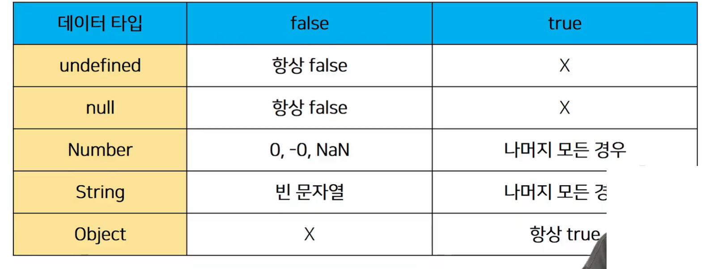

# JavaSript

## JavaScript

###  개요

### JavaScript를 배워야 하는 이유

#### Web 기술의 기반이 되는 언어

HTML문서의 콘텐츠를 돟적으로 변경할 수 있는 언어

Web이라는 공간에서 채팅, 게임 등 다양한 동작을 할 수 있게 된 기반

#### 다양한 분야로 확장이 가능한 언어

JavaScript는 Web을 위해 탄생한 언어로, 초기에는 언어의 특성상 많은 개발자에게 환영 받지 못함

하지만 버전이 올라가면서 하나의 단단한 언어로 자리 매김을 한 언어

단순히 Web 조작을 넘어서 서버 프로그래밍, 모바일 서비스, 컴퓨터 응용프로그래밍, 블록체인, 게임 개발 등 다양한 분야에서 활용이 가능한 언어가 됨

과거에는 단순히 Web Front-end를 위해서만 JavaScript 개발자를 찾았 이제는 그 영역이 매우 넓어져 다양한 직군에서 찾는 언어가 됨

#### 2022년 현재, 가장 인기 있는 언어

실제로 JavaScript는 언어의 확장성만큼 큰 인기를 얻고 있는 언어

### JavaScript의 역사

#### 개요

JavaScript의 개발 환경을 알아보기 전에 역사를 먼저 알아보기

Web을 조작하기 위한 언어인 만큼 Web Browser와도 깊은 연관 관계가 있음

이러한 이유 때문에 JavaScript를 처음 학습할 때 다양한 용어를 접하게 되는데 역사를 통해 전체적인 그림을 그려보고자 함

#### 웹 브라우저의 역할

URL을 통해 Web(WWW)을 탐색함

HTML/CSS/JavaScript를 이해한 뒤 해석해서 사용자에게 하나의 화면으로 보여줌

웹 서비스 이용 시 클라이언트의 역할을 함

즉, 웹 페이지 코드를 이해하고, 보여주는 역할을 하는 것이 바로 웹 브라우저

#### 웹 브라우저와 스크립트 언어

1993, Mosaic Web Browser

- 유저가 웹을 쉽게 탐색할 수 있게 버튼 등을 탑재한 GUI 기반의 웹 브라우저
- Netstape가 만듦

1994, Netscape Navigator

- Mosaic Web Browser를 개선한 후속작, 시장 점유율 80% 차지

이때 까지만 해도 정적 웹페이지를 단순히 보여주는 용도에 그침

웹 브라우저에 탑재해서 웹 페이지를 동적으로 바꿔줄 Script 언어 개발 필요

-  Script 언어?
  -  소스 코드를 기계어로 바꿔주는 컴파일러 없이 바로 실행 가능한 언어 속도가 느리다는 단점이 있음

Netscape에서 약 10일의 개발 기간을 통해 Script언어인 Mocha 개발

이후 LiveScript로 이름 변경 후 브라우저에 LiveScript를 해석해주는 Engine을 내장

이후 당시 인기있던 JAVA의 명성에 기대보고자 JavaScript로 이름 변경

1995, Microsoft의 Internet Explorer

- "Netscape가 너무 잘나가는데? 우리도 Web Browser 만들어보자"
-  JavaScript를 그대로 복사한 JScript라는 언어 제작 후 이를 탑재한 Web Browser인 Internet Explorer 출시
- 이후 JavaScript와 JScript는 각자의 기능을 추가하기 시작
- 개발자들은 Netscape Navigator와 Internet Explorer 각각에 대한 코드를 작성 해야 하는 상황을 맞이하게 됨

1996-2000, ECMA 표준 발의

- Netscape가 정보 통신에 관한 규약을 만드는 비영리 단체 ECMA에게 JavaScript 기반의 표준안 발의 제안, ECMAScript 1 출시
- 이후 여러가지 문법이 추가되며 ECMAScript의 버전이 올라감
- 이 상황을 지켜보던 Microsoft
  - “Windows알지? 우리는 거기에 기본적으로 Internet Explorer 탑재함!"
  - 점유율이 높아서 발전 적음
- 결국 시장 점유율 95% 이상으로 증가, ECMAScript 표준안 지키지 않는다 선언

2001-2004, 다양한 웹 브라우저의 등장

- ActionScript3라는 스크립트 언어를 기반으로 한 Firefox 웹 브라우저 출시
  - 넷스케이프에서 자바스크립트 만든 브랜든 나이트가 나와서 모질라 재단

- 개발자 : 너무 많아서 못버팀
  - Netscape Navigator & Internet Explorer & Firefox 지원을 위해 고통
- 이후 Opera등의 다양한 웹 브라우저가 계속 시장에 출시됨
- 다양성으로 인해 더더욱 많은 개발자가 필요해졌고, 이는 집단 지성을 형성
- 에크마는 관심 못받지만 계속 나오고 있음

jQuery 등의 라이브러리 등장

- 각 브라우저의 엔진에 맞는 스크립트를 여러 번 작성하는 것이 고통스러움
- 중간에 하나의 레이어를 두고 코딩하는 것 = jQuery
  - jQuery 문법에 맞춰 작성하면 브라우저별 엔진에 맞는 스크립트 변환은 jQuery가 알아서 변환해줌 
- 이후 아주 많은 코드가 jQuery로 작성됨

2008, Google의 Chrome 등장과 대통합의 시대

- V8 이라는 강력한 엔진을 탑재한 Chrome 등장
  - JavaScript 해석이 다른 웹 브라우저에 비해 월등히 빠름
  - 이로 인해 웹 브라우저가 버벅임이 없고 매우 빠르게 동작
  - 시장 1위 됨
-  Chrome의 성능 앞에서 다른 웹 브라우저들이 함께 표준안을 만들자고 제안

2009, ECMAScripts (ES5) 표준안 제정

2015, ECMAScript6 (ES6) 표준안 제정

- 6년걸림
- 자바스크립트의 대격변
- 사실상 지금의 자바스크립트의 원형

이후에도 계속해서 버전이 업데이트 되고 있으나, 큰 변화는 ES6에서

#### 정리

웹 브라우저는 JavaScript를 해석하는 엔진을 가지고 있음

현재의 JavaScript는 이제 시장에서 자리를 잡은 언어이며, 개발에서 큰 축을 담당하는 언어

더 이상 jQuery 등의 라이브러리를 사용할 필요가 없음(모든 웹 브라우저가 표준안을 따름)

특히, Chrome의 V8의 경우 JavaScript를 번역하는 속도가 매우 빠름

- 물건인데? Web Browser에서만 사용하지 말고 다른 개발에서도 활용해보자!
- node.js, react.js, electron 등의 내부 엔진으로 사용
  - 자바가 밖에서도 가동되게 되고 더 빠르게 발전하게 만들기 시작
- 그 결과, back-end, mobile, desktop app등을 모두 JavaScript로 개발이 이뤄짐

### JavaScript 실행환경

#### 개요

1. Web Browser로 실행하기
   - HTML 파일에 포함시키기
   - 외부 JavaScripy 파일 사용하기
   - Web Brouser에서 바로 입력하기
2. Node.js로 실행하기

#### Web Browser로 실행하기

Web Browser에는 JavaScript를 해석할 수 있는 엔진이 있어 실행할 수 있음 

HTML 파일에 직접 JavaScript를 작성 후 웹 브라우저로 파일 열기 

html안 Script태그 안에서는 자동으로 자바스크립트 입력 가능

`hello.html`

```html
<!DOCTYPE html>
<html lang="en">
<head>
  <meta charset="UTF-8">
  <meta http-equiv="X-UA-Compatible" content="IE=edge">
  <meta name="viewport" content="width=device-width, initial-scale=1.0">
  <title>Document</title>
</head>
<body>
  <Script>
    console.log('hello, javascript')
  </Script>
</body>
</html>
```

이렇게 하고 open browser하면 아무것도 안뜸

화면이 아니라 console에서 띄운것

개발자 도구의 console 확인하면 띄워져 있음

자바스크립트는 콘솔에 프린트함


자바스크립트에 작성하고 그것을 HTML에 포함

hello.js

```javascript
console.log('hello, javascript')
```

hello.html

```html
<!DOCTYPE html>
<html lang="en">
<head>
  <meta charset="UTF-8">
  <meta http-equiv="X-UA-Compatible" content="IE=edge">
  <meta name="viewport" content="width=device-width, initial-scale=1.0">
  <title>Document</title>
</head>
<body>
</body>
<script src="hello.js"></script>
</html>
```


스크립트 사용한 적 있다 - 부트스트랩

부트스트랩이 자바스크립트 필요함

스크립트는 보통 아래

위에 하는건 특수한 케이스다

웹 브라우저의 console에서 바로 JavaScript를 입력해도 된다 (엔진이 있어서 내장되어있음)


node.js가 밖에서 할 수 있게 해줌

특별하게 웹 브라우저에서 바로 실행할 수 있는 JavaScript 문법들을 Vanilla JavaScript라고 부름

순수한 JavaScript라는 의미 모든 아이스크림의 순정은 Vanilla라는 어원

#### Node.js로 실행하기

웹 브라우저를 이용하지 않고 JavaScript를 실행할 수 있음(엔진이 있으니까)

공용 노션 “Node.js 설치 문서" 참고

- 설치 확인

- ```bash
  $ node -v $ npm -v_ 
  ```

-  Javascript 파일 실행해 보기

- ```bash
  $ node 01_hello.JavaScript
  ```

 앞으로 수업에서는 웹 브라우저 환경과 node 환경을 상황에 맞게 바꿔가

```bash
$ node -v
v16.18.0

$ npm -v
8.19.2

$ node hello.js
hello, javascript
```

npm (Node Package Manager)

- JavaScript를 위한 패키지 관리자(파이썬의 pip)

## JavaScript 기초 문법

### 코드 작성법

#### 세미콜론 (semicolon) 

자바스크립트는 세미콜론을 선택적으로 사용 가능

세미콜론이 없으면 ASI에 의해 자동으로 세미콜론이 삽입됨

- ASI (Automatic Semicolon Insertion, 자동 세미콜론 삽입 규칙
- 점점 안쓰고 있음 안써도 문제 발생 안함
- 문제 생기는 상황은 현 단계에서는 안씀

본 수업에서는 자바스크립트의 문법 및 개념적 측면에 집중하기 위해 세미콜론을 사용하지 않고 진행

세미콜론 예시

```javascript
console.log('hello');
console.log('javascript')
```

위에처럼 쓰나 아래처럼 쓰나 똑같음

#### 들여쓰기와 코드 블럭

python은 4칸 들여쓰기를 사용했으나, JavaScript는 2칸 들여쓰기를 사용

블럭(block)은 if, for, 함수에서 중괄호{}내부를 말함

- python은 들여쓰기를 이용해서 코드 블럭을 구분
- JavaScript는 중괄호 { } 를 사용해 코드 블럭을 구분

```javascript
if (isClean) { // 중괄호를 사용해서 코드 블럭 구분
  console.log('clean!') // 2칸 들여쓰기
}
```

#### 코드 스타일 가이드

코딩 스타일의 핵심은 합의된 원칙과 일관성

코드의 품질에 직결되는 중요한 요소

- 코드의 가독성, 유지보수 또는 팀원과의 커뮤니케이션 등 개발 과정 전체에 영향을 끼침

Python에도 PEP8이라는 코드 스타일 가이드가 있었듯, JavaScript에도 코드 스타일 가이드 존재

다만 JavaScript는 여러 코드 스타일 가이드가 회사마다 존재하는데, 수업에서는 Airbnb Style Guide를 기반으로 사용할 것

- 단, 가이드의 일부 항목은 문법 및 개념적 측면에 집중하기 위해 변형해서 사용하는 경우 있음
- https://github.com/airbnb/javascript

##### [참고] 다양한 JavaScript 코드 스타일 가이드

Airbnb JavaScript Style Guide

Google JavaScript Style Guide

JavaScript Standard Style

#### 주석

한줄 주석(//)과 여러 줄 (/* */)주석

```javascript
// console.log('hello, javascript')
```

```javascript
/*
주석
*/
```

### 변수와 식별자

#### 식별자 정의와 특징

식별자(identifier)는 변수를 구분할 수 있는 변수명을 말함

식별자는 반드시 문자, 달러($) 또는 밑줄(_)로 시작

대소문자를 구분하며, 클래스명 외에는 모두 소문자로 시작

- 파이썬과 공통점

예약어 사용 불가능

- 예약어 예시: for, if, function 등
- 이미 예약되어있는 것들

카멜 케이스(camelCase, lower-camel-case) 

- 변수, 객체, 함수에 사용
- 중간에 튀어나옴

파스칼 케이스(PascalCase, upper-camel-case)

- 클래스, 생성자에 사용
- 파이썬에서도 클래스할때

대문자 스네이크 케이스(SNAKE_CASE)

- 상수(constants)에 사용

파이썬에서는 식별자를 세이크케이스?로 씀

##### 카멜 케이스

```javascript
// 변수
let dog
let variableName

// 객체
const userInfo = { name: 'Tom', age: 20 }

// 함수
function add() {}
function getName() {}
```

##### 파스칼 케이스

##### 대문자 스네이크 케이스

#### 변수 선언 키워드

Python과 다르게 JavaScript는 변수를 선언하는 키워드가 정해져 있음

1. let
   - 블록 스코프 지역 변수를 선언 (추가로 동시에 값을 초기화)
2.  const
   - 블록 스코프 읽기 전용 상수를 선언 (추가로 동시에 값을 초기화)
3. var
   - 변수를 선언 (추가로 동시에 값을 초기화)

##### [참고] 선언, 할당, 초기화

선언 (Declaration)

- 변수를 생성하는 행위 또는 시점
- 값을 지정하진 않음
- 선언만 하면 undefined가 들어감

할당 (Assignment) 

- 선언된 변수에 값을 저장하는 행위 또는 시점
- 일반적으로 선언과 할당을 같이 함

초기화 (Initialization)

- 선언된 변수에 처음으로 값을 저장하는 행위 또는 시점
- 선언도 undefined 들어갔으니 초기화

```javascript
let foo          // 선언
console.log(foo) // undefined

foo = 11         // 할당
console.log(foo) // 11

let bar = 0      // 선언 + 할당
console.log(bar) // 0
```

##### [참고] 블록 스코프 (block scope)

파이썬의 이름공간

if, for, 함수 등의 중괄호({}) 내부를 가리킴

블록 스코프를 가지는 변수는 블록 바깥에서 접근 불가능

```javascript
let x = 1
 
if (x == 1) { 
     let x = 2
     console.log(x)    // 2
}

console.log(x)         // 1
```

#####  let

재할당 가능 & 재선언 불가능

```javascript
let number = 10 // 1. 선언 및 초기값 할당
number = 20     // 2. 재할당

let number = 10 // 1. 선언 및 초기값 할당
let number = 20 // 2. 재선언 불가능
```

재할당으로 이미 10 넣은 것 20으로 바꿀 수 있음

- 파이썬은 둘 다 됨

블록 스코프를 갖는 지역 변수를 선언, 선언과 동시에 원하는 값으로 초기화 할 수 있음

##### const

재할당 불가능 & 재선언 불가능

- 읽기 전용

```javascript
const number 10   // 1. 선언 및 초기값 할당
number = 10       // 2. 재할당 불가능

const number = 10 // 1. 선언 및 초기값 할당
const number = 20 // 2. 재선언 불가능
```

선언 시 반드시 초기값을 설정 해야 하며, 이후 값 변경이 불가능

- const number 안됨

재선언 안되는건 let과 const 공통점

let 과 동일하게 블록 스코프를 가짐

##### var

재할당 가능 & 재선언 가능

- 유지 보수에서 문제 발생

ES6 이전에 변수를 선언할 때 사용되던 키워드

- let, const 등장

“호이스팅" 되는 특성으로 인해 예기치 못한 문제 발생 가능

- 따라서 ES6 이후부터는 var 대신 const와 let을 사용하는 것을 권장
- air bnb 가이드에서도 안쓸것을 권장

함수 스코프(function scope)를 가짐

- 블럭스코프는 중괄호 기준 var는 함수의 중괄호만 스코프를 가짐 if, for는 스코프 안가짐

변수 선언 시 var , const, let 키워드 중 하나를 사용하지 않으면 자동으로 var로 선언

- 그래서 변수 선언 반드시 해야함

###### [참고] 함수 스코프 (function scope)

함수의 중괄호 내부를 가리킴

함수 스코프를 가지는 변수는 함수 바깥에서 접근 불가능

```javascript
1 function foo() {
2   var x = 5
3   console.log(x) // 5
4 }
5
6 // ReferenceError: x is not defined
7 console.log(x)
```

###### [참고] 호이스팅 (hoisting)

끌어올리다라는 뜻

변수를 선언 이전에 참조할 수 있는 현상

var 로 선언된 변수는 선언 이전에 참조할 수 있으며, 이러한 현상을 호이스팅이라 함

변수 선언 이전의 위치에서 접근 시 undefined를 반환

```javascript
console.log(name)  // undefined => 선언 이전에 참조

var name = '홍길동' // 선언

// 위 코드를 암묵적으로 아래와 같이 이해함
var name           // undefined 로 초기화
console.log(name)

var name = '홍길동'
```

변수 트래킹이 어렵고

변수가 재사용 안되도록 너무 노력해야 함

즉, JavaScript에서 변수들은 실제 실행시에 코드의 최상단으로 끌어 올려지게 되며 (hoisted) 이러한 이유 때문에 var 로 선언된 변수는 선언 시에 undefined 로 값이 초기화되는 과정이 동시에 일어남

반면 let, const는 호이스팅이 일어나면 에러를 발생시킴

```javascript
console.log(username) // undefined
var username = '홍길동'

console.log(email) // Uncaught ReferenceError
let email = 'gildong@gmail.com'

console.log(age)  // Uncaught ReferenceError
const age = 50
```

변수를 선언하기 전에 접근이 가능한 것은 코드의 논리적인 흐름을 깨뜨리는 행위이며 이러한 것을 방지하기 위해 let, const가 추가되었음

- 즉 var 는 사용하지 않아야 하는 키워드

다만, 아직까지도 많은 기존의 JavaScript 코드는 ES6 이전의 문법으로 작성되어 있으므로 호이스팅에 대한 이해가 필요

##### 변수 선언 키워드 정리


어디에 변수를 쓰고 상수를 쓸지 결정하는 것은 프로그래머의 몫

Airbnb 스타일 가이드에서는 기본적으로 const 사용을 권장

-  재할당해야 하는 경우만 let

다만, 실습에서는 편의를 위해 재할당이 가능한 let을 기본적으로 사용해도 됨

### 데이터 타입

JavaScript의 모든 값은 특정한 데이터 타입을 가짐

크게 원시 타입(Primitive type)과 참조 타입(Reference type)으로 분류됨


#### Number

정수 또는 실수형 숫자를 표현하는 자료형

파이썬의 여러개 숫자 여기는 다 하나

```javascript
const a = 13
const b = -5
const c = 3.14 // float - 숫자표현
const d = 2.998e8 // 2.998 * 108 = 299,800,000
const e = Infinity
const f = -Infinity
const g = NaN // Not a Number를 나타내는 값
```

##### NaN

Not-A-Number(숫자가 아님)를 나타냄

Number.isNaN()의 경우 주어진 값의 유형이 Number이고 값이 NaN이면 true, 아니면 false를 반환

 ```javascript
 Number.isNaN(NaN)       // true
 Number.isNaN(0 / 0)     // true
 
 // isNaN() 으로는 True
 Number.isNaN('NaN')     // false
 Number.isNaN(undefined) // false
 Number.isNaN({})        // false
 Number.isNaN('blabla')  // false
 
 // 이들 모두 false
 Number.isNaN(true)
 Number.isNaN(null)
 Number.isNaN(37)
 Number.isNaN('37')
 Number.isNaN('37.37')
 Number.isNaN('')
 Number.isNaN(' ')
 ```

NaN을 반환하는 경우

1. 숫자로서 읽을 수 없음

   ```javascript
   (parseInt("어쩌구"), Number(undefined))
   ```

2. 결과가 허수인 수학 계산식

   ```javascript
   (Math.sqrt(-1)) 
   ```

3. 피연산자가 NaN

   ```javascript
   (7 ** NaN)
   ```

4. 정의할 수 없는 계산식

   ```javascript
   (0 * Infinity)
   ```

5. 문자열을 포함하면서 덧행이 아닌 계산식

   ```javascript
   ("가" / 3)
   ```

#### String

문자열을 표현하는 자료형

작은 따옴표 또는 큰 따옴표 모두 가능

```javascript
const sentence1 = 'Ask and go to the blue' // single quote
const sentence2 = "Ask and go to the blue" // double quote

console.log(sentence1)
console.log(sentence2)
```

 곱셈, 나눗셈, 뺄셈은 안되지만 덧셈을 통해 문자열 붙일 수 있음

- 파이썬은 곱셈 가능

```javascript
const firstName = 'Tony'
const lastName = 'Stark
const fullName = firstName + lastName

console.log(fullName)
```

Quote를 사용하면 선언 시 줄 바꿈이 안됨

대신 escape sequence를 사용할 수 있기 때문에 \n를 사용해야 함

```javascript
// Bad
const word = "안녕
하세요"                       // Uncaught SyntaxError: Invalid or unexpected token

// Good
const word1 = "안녕 \n하세요"
console.log(word1)
```

Template Literal을 사용하면 줄 바꿈이 되며, 문자열 사이에 변수도 삽입도 가능

- quote가 아니라 백틱임`

(단, escape sequence를 사용할 수 없다) == Python의 "f-string"

```javascript
const word2 = `안녕
들 하세요`
console.log(word2)

const age = 10
const message = `홍길동은 ${age}세입니다.`
console.log(message)
```

##### Template literals (템플릿 리터럴)

내장된 표현식을 허용하는 문자열 작성 방식

ES6+ 부터 지원

Backtick()을 이용하며, 여러 줄에 걸쳐 문자열을 정의할 수도 있고 JavaScript의 변수를 문자열 안에 바로 연결할 수 있는 이점이 생김

표현식을 넣을 수 있는데, 이는 `$`와 중괄호( `${expression}` )로 표기

```javascript
const age = 10 
const message = `홍길동은 ${age}세입니다.`
```

#### Empty Value

값이 존재하지 않음을 표현하는 값으로 Javascript에서는 null 과 undefined 가 존재

동일한 역할을 하는 이 두개의 키워드가 존재하는 이유는 단순한 JavaScript의 설계 실수

큰 차이를 두지 말고 interchangeable 하게 사용할 수 있도록 권장함

##### null

값을 나타내는 특별한 키워드

변수의 값이 없음을 의도적으로 표현할 때 사용하는 데이터 타입

의도된 빈값

```javascript
let lastName = null
console.log(lastName) // null
```

##### undefined

값이 정의되어 있지 않음을 표현하는 값

변수 선언 이후 직접 값을 할당하지 않으면 자동으로 할당됨

- 자바스크립트가 자동으로

개발자가 넣을수도 있긴 한데 그렇게는 잘 안쓴다

```javascript
let firstName          // 선언만 하고 할당하지 않음
console.log(firstName) // undefined
```

##### null 과 undefined

null과 undefined의 가장 대표적인 차이점은 typeof 연산자를 통해 타입을 확인 했을 때 나타남

````javascript
typeof null       // "object"
typeof undefined  // "undefined", 
````

null이 원시 타입임에도 불구하고 object로 출력되는 이유는 [avaScript 설계 당시의 버그를 지금까지 해결하지 못한 것

- 원시 타입들은 원래 type 찍으면 본인 이름 나옴
- 참조 타입은 객체가 뜸
- null은 객체가 뜸

쉽게 해결 할 수 없는 이유는 이미 null 타입에 의존성을 띄고 있는 많은 프로그림들이 망가질 수 있기 때문 (하위 호환 유지)

- 이미 레거시 코드들이 있다

- 원래 스크립트로 만들어진것이라 허점들이 있음

#### Boolean

true와 false

- 파이썬과 달리 다 소문자

참과 거짓을 표현하는 값

조건문 또는 반복문에서 유용하게 사용

- 조건문 또는 반복문에서 boolean이 아닌 데이터 타입은 자동 형변환 규칙에 따라 true 또는 false로 변환됨

##### ToBoolean Conversions (자동 형변환)

https://tc39.es/ecma262/#sec-toboolean



### 연산자

#### 할당 연산자

오른쪽에 있는 피연산자의 평가 결과를 왼쪽 피연산자에 할당하는 연산자

다양한 연산에 대한 단축 연산자 지원

Increment 및 Decrement 연산자

- Increment(++): 피연산자의 값을 1 증가시키는 연산자
- Decrement(--): 피연산자의 값을 1 감소시키는 연산자 
- += 또는 -=와 같이 더 분명한 표현으로 적을 것을 권장

```javascript
let c = 0

c += 10
console.log(c) // 10 -> c에 10을 더한다

c -= 3
console.log(c) // 7 -> c에 3을 뺀다

c *= 10
console.log(c) // 70 -> c에 10을 곱한다 CO|| 10

// 아래 두개는 사용하지 않을 것을 권장
c++
console.log(c) // 71 -> c에 1을 더한다(증감식)

c--
console.log(c) // 70 - c에 1을 뺀다(증감식)
```

#### 비교 연산자

피연산자들(숫자, 문자, Boolean 등)을 비교하고 결과값을 boolean으로 반환하는 연산자

문자열은 유니코드 값을 사용하며 표준 사전 순서를 기반으로 비교

- ex) 알파벳끼리 비교할 경우

  - 알파벳 순서상 후순위가 더 크다

  - 소문자가 대문자보다 더 크다.

```javascript
3 > 2     // true
3 < 2   // false

'A' < 'B' // true
'z' < 'a' // true
'J' < 'L' // true
```

#### 동등 연산자 (==)

두 피연산자가 같은 값으로 평가되는지 비교 후 boolean 값을 반환

비교할 때 암묵적 타입 변환을 통해 타입을 일치시킨 후 같은 값인지 비교

- 이러면 안됨

두 피연산자가 모두 객체일 경우 메모리의 같은 객체를 바라보는지 판별 

예상치 못한 결과가 발생할 수 있으므로 특별한 경우를 제외하고 사용하지 않음

- null undefined관련해서 사용하는 특수 케이스가 있음

```javascript
const a = 1
const b = '1'
 
console.log(a == b) // true
console.log(a == true) // true

// 자동 형변환 예시
console.log(8 * null) // 0, null은 0
console.log('5' - 1) // 4
console.log('5' + 1) // '51'
console.log('five' * 2) // NaN
```

#### 일치 연산자 (===)

두 피연산자의 값과 타입이 모두 같은 경우 true를 반환

같은 객체를 가리키거나, 같은 타입이면서 같은 값인지를 비교

엄격한 비교가 이뤄지며 암묵적 타입 변환이 발생하지 않음

- 엄격한 비교 - 두 비교 대상의 타입과 값 모두 같은 지 비교하는 방식

```javascript
const a = 1
const b = '1'

console.log(a === b) // false
console.log(a === Number(b)) // true
```

#### 논리 연산자

세 가지 논리 연산자로 구성

- and 연산은 '&&' 연산자
- or 연산은 'II' 연산자
- not 연산은 '!' 연산자

단축 평가 지원

- ex) false && true => false
- ex) true || false => true
  - 뒤까지 볼 필요 없으면 안봄

```javascript
true && false   // false
true && true    // true

false || true   // true
false || false  // false

!true           // false

1 && 0 // 0
0 && 1 // 0
4 && 7 // 7

1 || 0 // 1
0 || 1 // 1
4 || 7 // 4
```

#### 삼항 연산자 (Ternary Operator)

3개의 피연산자를 사용하여 조건에 따라 값을 반환하는 연산자

조건식 ? __ : __ 구조

가장 앞의 조건식이 참이면 : (콜론) 앞의 값이 반환되며, 그 반대일 경우 : 뒤의 값이 반환되는 연산자

삼항 연산자의 결과 값이기 때문에 변수에 할당 가능

```javascript
true ? 1:2  // 1 
false ? 1:2 // 2

const result = Math.PI > 4 ? 'Yep' : 'Nope'
console.log(result) // Nope
```

### 조건문

#### 조건문의 종류와 특징

if statement

- 조건 표현식의 결과값을 boolean 타입으로 변환 후 참/거짓을 판단

switch statement

조건 표현식의 결과값이 어느 값(case)에 해당하는지 판별

주로 특정 변수의 값에 따라 조건을 분기할 때 활용

- 조건이 많아질 경우 if문보다 가독성이 나을 수 있음

#### if statement

` if, else if, else`

 조건은 소괄호(condition) 안에 작성

실행할 코드는 중괄호{} 안에 작성

블록 스코프 생성

```javascript
const name = 'manager'

if (name === 'admin') {
  console.log('관리자님 환영합니다')
} else if (name === 'manager') {
  console.log('매니저님 환영합니다')
} else {
  console.log(`${name}님 환영합니다.`)
}
```

#### switch statement

표현식(expression)의 결과값을 이용한 조건문

- True, False가 아니라 값을 찾음

표현식의 결과값과 case문의 오른쪽 값을 비교

break 및 default문은 [선택적]으로 사용 가능

break문이 없는 경우 break문을 만나거나 default문을 실행할 때까지 다음 조건문 실행

블록 스코프 생성

```javascript
switch(expression) {
  case 'first value': {
    // do something
    [break]
  }
  case 'second value': {
    // do something
    [break]
  }
  [default: {
    // do something
  }]
}
```

아래처럼 하면 모든 console이 출력된다 (Fall-through)

- 매칭되고 나서 멈추지 않으면 다 출력됨

```javascript
const name = '홍길동'

switch(name) {
  case '홍길동': {
    console.log('홍길동님 환영합니다')
  }
  case 'manager': {
    console.log('매니저님 환영합니다')
  }
  default: {
    console.log(`${name}님 환영합니다.`)
  }
}
```

break를 작성하면 의도한대로 동작

```javascript
const name = '홍길동'

switch(name) {
  case '홍길동': {
    console.log('홍길동님 환영합니다')
    break
  }
  case 'manager': {
    console.log('매니저님 환영합니다')
    break      
  }
  default: {
    console.log(`${name}님 환영합니다.`)
  }
}
```

#### if / switch

조건이 많은 경우 switch문을 통해 가독성 향상을 기대할 수 있음

일반적으로 중첩 else if문은 유지보수하기 힘들다는 문제도 있음

```javascript
const numOne = 5
const numTwo = 10
let operator = '+'

if (operator === '+') {
  console.log(numone + numTwo)
} else if (operator === '-') {
  console.log(numone - numTwo)
} else if (operator === '*') {
  console.log(numone * numTwo)
} else if (operator === '/') {
  console.log(numone / numTwo)
} else {
  console.log('유효하지 않은 연산자입니다.)
}
```

```javascript
const numOne = 5
const numTwo = 10
let operator = '+'

switch(operator) {
  case '+': {
    console.log(numOne + numTwo)
    break
  }
  case '-': {
    console.log(numone - numTwo)
    break
  }
  case '*': {
    console.log(numone * numTwo)
    break
  }
  case '7': {
    console.log(numone / numTwo)
    break
  }
  default: {
    console.log('유효하지 않은 연산자입니다.')
  }
}
```

### 반복문

#### 반복문 종류

while

for

for...in

for...of

#### while

조건문이 참이기만 하면 문장을 계속해서 수행 

```javascript
while (조건문) {
    // do something
}
```

예시

```javascript
let i = 0
while (i < 6) {
  console.log(i)
  i += 1
}
// 0, 1, 2, 3, 4, 5
```

#### for

특정한 조건이 거짓으로 판별될 때까지 반복 

- const 쓰면 재할당이 안되기 때문에 let 써야 함

````javascript
for ([초기문]; [조건문]; [증감문]) {
    // do something
}
````

예시

```javascript
 for (let i = 0; i < 6; i++) {
     console.log(i)
 }

// 0, 1, 2, 3, 4, 5
```

##### 동작 예시

```javascript
for (let i = 0; i<6; i++) {
    console.log(i) // 0, 1, 2, 3, 4, 5
}
```


세미클론 안쓰기로 했지만 이 안에는 써야 함

a++와 ++a는 증감되는 시점의 차이가 있다

#### for...in

객체(object)의 속성을 순회할 때 사용

- 파이썬 딕셔너리 느낌

배열도 순회 가능하지만 인덱스 순으로 순회한다는 보장이 없으므로 권장하지 않음

- 배열처럼 반복 가능한 객체는 for..of

```javascript
for (variable in object) {
  statements
}
```

예시

```javascript
const fruits = { a: 'apple', b: 'banana' }

for (const key in fruits) {
  console.log(key) // a, b
  console.log(fruits[key]) // apple, banana
}
```

#### for...of

반복 가능한 객체를 순회할 때 사용

반복 가능한(iterable) 객체의 종류: Array, Set, String 등

- 내부적으로 속성값을 출력하는게 아니라 각각 인덱스에 있는 값을 출력

```javascript
for (variable of object) {
  statements
}
```

예시

```javascript
const numbers = [0, 1, 2, 3]

for (const number of numbers) {
  console.log(number) // 0, 1, 2, 3
}
```

#### for...in for...of 차이

for...in 은 속성 이름을 통해 반복

- 인덱스 아님
- 배열은 내부적으로 object임 내부적으로는 { 0 : 1, 1 : 5, 2 : 7 }
- 객체에 쓴다

for...of 는 속성 값을 통해 반복

- 반복가능한건(객체 말고 나머지) of
- in을 쓸수는 있지만 되도록 of
- 시험 내기 좋다

```javascript
const arr = [3, 5, 7]

for (const i in arr) {
  console.log(i) // 0 1 2
}
for (const i of arr) {
  console.log(i) // 3 5 7
}
```

for ... in (객체 순회 적합)

```javascript
// array
const fruits = ['딸기', '바나나', '메론']

for (let fruit in fruits) {
    console.log(fruit) // 0, 1, 2
}        

// object
const capitals = {
    Korea: '서울',
    France: '파리',
    USA: '워싱턴 D.C.'
}

for (let capital in capitals) {
    console.log(capital) // Korea, France, USA
}
```

for ... in (Iterable 순회 적합)

```javascript
// array
const fruits = ['딸기', '바나나', '메론']

for (let fruit of fruits) {
    console.log(fruit) // 딸기, 바나나, 메론
}        

// object
const capitals = {
    Korea: '서울',
    France: '파리',
    USA: '워싱턴 D.C.'
}

for (let capital in capitals) {
    console.log(capital) // Uncaught TypeError: caitals is not iterable
}
```

##### [참고] for...in, for...of 와 const

일반적인 for문 `for (let i = 0; i < arr.length; i++) { ... }`의 경우에는 최초 정의한 i 를 재할당 하면서 사용하기 때문에 const를 사용하면 에러 발생

- let 써야함

다만 for...in, for...of 의 경우에는 재할당이 아니라, 매 반복 시 해당 변수를 새로 정의하여 사용하므로 에러가 발생하지 않음

### 조건문과 반복문 정리


### 함수

#### 개요

참조 타입 중 하나로써 function 타입에 속함

- 타입 찍어보면 function 나옴

JavaScript에서 함수를 정의하는 방법은 주로 2가지로 구분됨

- 함수 선언식 (function declaration)
- 함수 표현식 (function expression)

#### 함수의 정의

##### 함수 선언식 (Function declaration)

일반적인 프로그래밍 언어의 함수 정의 방식

```javascript
function 함수명() {
  // do something
}
```

예시

```javascript
function add(num1, num2) {
  return num1 + num2
}

add(2, 7) // 9
// console.log(add(2,7))을 해야 확인 가능
```

##### 함수 표현식 (Function expression)

표현식 내에서 함수를 정의하는 방식

함수 표현식은 함수의 이름을 생략한 익명 함수로 정의 가능

- function () 이렇게 생긴걸 익명함수라 함
- 함수를 변수에 저장하는 방식

````javascript
변수키워드 함수명 = function () {
  // do someting
}
````

예시

```javascript
const sub = function (num1, num2) {
  return num1 - num2
}

sub(7, 2) // 5
```

표현식에서 함수 이름을 명시하는 것도 가능

다만 이 경우 함수 이름은 호출에 사용 되지 못하고 디버깅 용도로 사용됨

- 에러 코드 로그들 나올 때 어떤 함수인지 그래서 좀 장황하게 씀

```javascript
const mySub = function namedSub (num1, num2) {
  return num1 - num2
}
mySub(1, 2) // -1
namedSub(1, 2) // ReferenceError: namedSub is not defined
```

##### 기본 인자(Default arguments)

인자 작성 시 '=' 문자 뒤 기본 인자 선언 가능

```javascript
const greeting = function (name = 'Anonymous') {
  return `Hi ${name}`
}
greeting() // Hi Anonymous
```

##### 매개변수와 인자의 개수 불일치 허용

매개변수보다 인자의 개수가 많을 경우

- 파이썬때는 안됐음
- 인자 3개 매개변수 2개 넣어도 그냥 2개 나옴

```javascript
const noArgs = function () {
  return 0
}
noArgs(1, 2, 3) // 0

const twoArgs = function (arg1, arg2) {
  return [arg1, arg2]

twoArgs(1, 2, 3) // [1, 2]


```

매개변수보다 인자의 개수가 적을 경우

```javascript
const threeArgs = function (arg1, arg2, arg3) {
  return [arg1, arg2, arg3]
}
threeArgs()      // [undefined, undefined, undefined]
threeArgs(1)     // [1, undefined, undefined]
threeArgs(1, 2)  // [1, 2, undefined]
```

##### Spread syntax (...)

“전개 구문”

전개 구문을 사용하면 배열이나 문자열과 같이 반복 가능한 객체를 배열의 경우는 요소, 함수의 경우는 인자로 확장할 수 있음

1. 배열과의 사용
1. 함수와의 사용 (Rest parameters)

파이썬때는 가변인자 - 애프터리스크(*args)

###### 배열과의 사용

```javascript
let parts = ['shoulders', 'knees']
let lyrics = ['head', ...parts, 'and', 'toes']
// [ 'head', 'shoulders', 'knees', 'and', 'toes' ]
```

###### 함수와의 사용 (Rest parameters)

The rest parameter syntax를 사용하여 정해지지 않은 수의 매개변수를 배열로 받을 수 있음

- 안넣었다고 아예 안뜨는 것이 아니라 빈 배열로 나옴

```javascript
function func(a, b, ... theArgs) {
  //
}
```

```javascript
const restOpr = function (arg1, arg2, ...restArgs) {
  return [arg1, arg2, restArgs]
}
restArgs(1, 2, 3, 4, 5)  // [1, 2, [3, 4, 5]]
restArgs(1, 2)           // [1, 2, []]
```

#### 선언식과 표현식

##### 함수의 타입

선언식 함수와 표현식 함수 모두 타입은 function으로 동일

```javascript
//함수 표현식
const add = function (args) { }

// 함수 선언식 function sub(args) { }

console.log(typeof add) // function
console.log(typeof sub) // function
```

##### 호이스팅 - 선언식

함수 선언식으로 정의한 함수는 var 로 정의한 변수처럼 호이스팅이 발생

즉 함수 호출 이후에 선언해도 동작

```javascript
add(2, 7) // 9

function add (num1, num2) {
    return num1 + num2
}
```

##### 호이스팅 - 표현식

반면 함수 표현식으로 선언한 함수는 함수 정의 전에 호출 시 에러 발생

함수 표현식으로 정의된 함수는 변수로 평가되어 변수의 scope 규칙을 따름

```javascript
sub(7, 2) // Uncaught ReferenceError: Cannot access 'sub' before initialization

const sub = function (num1, num2) {
    return num1 - num2
}
```

그래서 표현식 권장

##### 선언식과 표현식 정리


#### Arrow Function

#####화살표 함수 (Arrow Function)

"함수를 비교적 간결하게 정의할 수 있는 문법”

function 키워드와 중괄호를 이용한 구문을 짧게 사용하기 위해 탄생

1. function 키워드 생략가능
2. 함수의 매개변수가 하나뿐이라면 ``()``도 생략 가능
3. 함수의 내용이 한 줄이라면 `{}`와 `return`도 생략 가능

화살표 함수는 항상 익명 함수

-  == 함수 표현식에서만 사용가능

###### 예시

```javascript
const greeting = function (name) {
  return `Hi ${name}`  
}

// 1단계 - function 없에고 인자와 중괄호 사이 화살표 넣음
const greeting = (name) => {
  return `Hi, ${name}`
}


// 2단계 - 인자가 1개일 경우에만 소괄호 없엠
const greeting = name => {
  return `Hi, ${name}`
}

// 3단계 - 함수 바디가 return을 포함한 표현식 1개(1줄)일 경우에 return과 중괄호 없엠
const greeting = name => `Hi, ${name}`

// 3단계인데 소괄호 쓰는
const greeting = (name) => `Hi, ${name}`
```

2단계는 airbnb가이드에서 권장하지 않음

- 인자에는 소괄호 없에지 않도록
- 명확성과 일관성을 위해 항상 인자 주위에는 괄호를 포함하는 것을 권장

1, 3단계 그중에서도 1단계 많이 씀. 3단계 써도 소괄호 쓰는것 씀

###### 응용

```javascript
// 1. 인자가 없다면? () or _ 로 표시 가능.
// 아예 빈공백으로 둘 순 없음
let noArgs = () => 'No args'
noArgs = _ => 'No args'

// 2-1. object를 return 한다면
let returnObject = () => { return { key: 'value'} } // return을 명시적으로 적어준다.

// 2-2. return을 적지 않으려면 괄호를 붙여야 한다
returnObject = () => ({ key: 'value' })
```

2-2보다는 2-1로 명시적으로 적어주는 경우가 더 많다

##### 즉시 실행 함수(IFE, Immediately Invoked Function Expression)

선언과 동시에 실행되는 함수

함수의 선언 끝에 ()`를 추가하여 선언되자 마자 실행하는 형태

() 에 값을 넣어 인자로 넘겨줄 수 있음

 즉시 실행 함수는 선언과 동시에 실행되기 때문에 같은 함수를 다시 호출할 수 없음

이러한 특징을 살려 초기화 부분에 많이 사용

일회성 함수이므로 익명함수로 사용하는 것이 일반적

```javascript
(function(num) { return num ** 3 })(2) // 8
(num => num ** 3)(2) // 8
```

### Array와 Object

#### 개요

파이썬으로 치면 list, dict

 JavaScript의 데이터 타입 중 참조 타입(reference)에 해당 하는 타입은 array와 object이며, 객체라고 말함 

객체는 속성들의 모음(collection)

- (참고) 객체 안쪽의 속성들은 메모리에 할당 되어있고 해당 객체는 메모리의 시작 주소 값을 가리키고 있는 형태로 이루어져 있음

#### 배열 (Array)

##### 배열 (Array)

키와 속성들을 담고 있는 참조 타입의 객체

순서를 보장하는 특징이 있음

주로 대괄호([])를 이용하여 생성하고, 0을 포함한 양의 정수 인덱스로 특정 값에 접근 가능

- 음의 정수 인덱싱 불가능

배열의 길이는 array.length 형태로 접근 가능

- (참고) 배열의 마지막 원소는 array.length - 1로 접근

```javascript
const numbers = [1, 2, 3, 4, 5]

console.log(numbers[0]) // 1
console.log(numbers[-1]) // undefined
console.log(numbers.length) // 5

const numbers = [1, 2, 3, 4, 5]

console.log(numbers[numbers.length - 1]) // 5
console.log(numbers[numbers.length - 2]) // 4
console.log(numbers[numbers.length - 3]) // 3
console.log(numbers[numbers.length - 4]) // 2
console.log(numbers[numbers.length - 5]) // 1
```

```javascript
const numbers = [1, 2, 3, 4, 5]

console.log(numbers[0])
console.log(numbers[-1])
console.log(numbers.length)
console.log(numbers[numbers.length-1])
```

##### 배열 메서드 기초


###### array.reverse()

원본 배열 요소들의 순서를 반대로 정렬

```javascript
const numbers =
numbers.reverse()
console.log(numbers) // [5, 4, 3, 2, 1]
```

###### array.push()

배열의 가장 뒤에 요소 추가

```javascript
const numbers = [1, 2, 3, 4, 5]
numbers.push(100)
console.log(numbers) // [1, 2, 3, 4, 5, 100]
```

###### array.pop()

배열의 마지막 요소 제거

```javascript
numbers.pop()
console.log(numbers) // [1, 2, 3, 4, 5]
```

###### array.includes(value)

배열에 특정 값이 존재하는지 판별 후참 또는 거짓 반환

```javascript
const numbers = [1, 2, 3, 4, 5]

console.log(numbers.includes(1))// true

console.log(numbers.includes(100)) // false
```

###### array.indexOf(value)

배열에 특정 값이 존재하는지 확인 후 가장 첫 번째로 찾은 요소의 인덱스 반환

만약 해당 값이 없을 경우 -1 반환

- 에러 아님

```javascript
const numbers = [1, 2, 3, 4, 5]
let result

result = numbers.indexOf(3) // 2
console.log(result)

result = numbers.indexOf(100) // -1
console.log(result)
```

###### array.join([separator])

배열의 모든 요소를 연결하여 반환

separator(구분자)는 선택적으로 지정가능하며, 생략 시 쉼표를 기본 값으로 사용

```javascript
const numbers = [1, 2, 3, 4, 5]
let result

result = numbers.join()  // 1,2,3,4,5
console.log(result)

result = numbers.join('') // 12345
console.log(result)

result = numbers.join(' ') // 1 2 3 4 5
console.log(result)

result = numbers.join('-') // 1-2-3-4-5
console.log(result)
```

##### 배열 메서드 심화 - Array Helper Methods

배열을 순회하며 특정 로직을 수행하는 메서드

메서드 호출 시 인자로 callback 함수를 받는 것이 특징

- callback 함수: 어떤 함수의 내부에서 실행될 목적으로 인자로 넘겨받는 함수
- 함수 안에 함수가 들어감

앞의 요소 하나하나가 뒤에 있는 콜백함수의 인자 들어가서 순서대로 로직에 적용되는 것


###### [참고] Django로 보는 콜백함수 예시

```javascript
# urls.py

from django.urls import path
from . import views

urlpatterns = [
    path('index/', views.index, name='index'),
]

# views.py

from django.shortcuts import render

def index(request):
	# ... 생략 ...
    return render(request, 'articles/index.html', context)
```

path 함수에 전달되는 callback 함수

index 함수가 path함수에 있는것

######  forEach

```javascript
array.forEach((element, index, array) => {
    // do something
})
```

`array.forEach(callback(element[, index[, array]]))`

인자로 주어지는 함수(콜백 함수)를 배열의 각 요소에 대해 한 번씩 실행

- 콜백 함수는 3가지 매개변수로 구성
  1. element: 배열의 요소
  2. index: 배열 요소의 인덱스
  3. array: 배열 자체

반환 값(return) 없음

map이랑 비슷한 로직(첫번째 인자가 함수인것도)

```javascript
// 1.
const colors = ['red', 'blue', 'green']

const printClr = function (color) {
  console.log(color)
}

colors.forEach(printClr)

/*
 red
blue
green
*/

// 2. 바로 넣은 것
colors.forEach(function (color) {
  console.log(color)
})


/*
 red
blue
green
*/

// 3. 화살표 함수 적용
colors.forEach((color) => {
  console.log(color)
})

/*
 red
blue
green
*/

// 중괄호까지 지우면
colors.forEach((color) => console.log(color))


/*
 red
blue
green
*/

```

###### map

```javascript
array.map((element, index, array) => {
    // do something
})
```

`array.map(callback(element[, index[, array]]))`

배열의 각 요소에 대해 콜백 함수를 한 번씩 실행

콜백 함수의 반환 값을 요소로 하는 새로운 배열 반환

기존 배열 전체를 다른 형태로 바꿀 때 유용

- forEach + return이라고 생각하기

리턴이 있으니 변수 지정

```javascript
const numbers = [1, 2, 3, 4, 5]

// 1. 일단 사용
const doubleEle = function (number) {
  return number * 2
}

const newArry = numbers.map(doubleEle)

console.log(newArry) // [ 2, 4, 6, 8, 10 ]


// 2. 함수 정의를 인자로 넣어보기
const newArry = numbers.map(function (number) {
  return number * 2
})

console.log(newArry) // [ 2, 4, 6, 8, 10 ]

// 3. 화살표 함수
const newArry = numbers.map((number) => {
  return number * 2
})

console.log(newArry) // [ 2, 4, 6, 8, 10 ]

// 4. 중괄호 리턴 빼기
const newArry = numbers.map((number) => number * 2)

console.log(newArry) // [ 2, 4, 6, 8, 10 ]
```

###### filter

```javascript
array.filter( (element, index, array) => {
    // do something
})
```

`array.filter(callback(elements, index[, array]]))`

배열의 각 요소에 대해 콜백 함수를 한 번씩 실행

콜백 함수의 반환 값이 참인 요소들만 모아서 새로운 배열 반환

기존 배열의 요소들을 필터링할 때 유용

```javascript
const products = [
  { name: 'cucumber', type: 'vegetable' },
  { name: 'banana', type: 'fruit' },
  { name: 'carrot', type: 'vegetable' },
  { name: 'apple', type: 'fruit' },
]
// 객체를 요소로 가지는 배열

const fruitFilter = function (product) {
  return product.type === 'fruit'
}
//.으로 탐색 가능

const newArry = products.filter(fruitFilter)

console.log(newArry) 
// [ { name: 'banana', type: 'fruit' }, { name: 'apple', type: 'fruit' } ]

// 2.
const newArry = products.filter(function (product) {
  return product.type === 'fruit'
})

console.log(newArry)
// [ { name: 'banana', type: 'fruit' }, { name: 'apple', type: 'fruit' } ]

// 3.
const newArry = products.filter((product) => {
  return product.type === 'fruit'
})

console.log(newArry)
// [ { name: 'banana', type: 'fruit' }, { name: 'apple', type: 'fruit' } ]

```

###### reduce

```javascript
array.reduce((acc, element, index, array) => {
    // do something
}, initialValue)
```

`array.reduce(callback(acc, element, [index[, array]])[, initialValue])`

인자로 주어지는 함수(콜백 함수)를 배열의 각 요소에 대해 한 번씩 실행해서,하나의 결과 값을 반환.

- 이전까지 한 함수들은 새로운 배열

즉, 배열을 하나의 값으로 계산하는 동작이 필요할 때 사용(총합, 평균 등)

map, filter 등 여러 배열 메서드 동작을 대부분 대체할 수 있음

reduce 메서드의 주요 매개변수

- acc
  - 이전 callback 함수의 반환 값이 누적되는 변수
- initialValue(optional)
  - 최초 callback 함수 호출 시 acc에 할당되는 값, default 값은 배열의 첫 번째 값

reduce의 첫번째 매개변수인 콜백함수의 첫번째 매개변수(acc)는 누적된 값(전 단계 까지의 결과)

- 파이썬은 result같은 따로 변수를 만들었는데 자바스크립트는 첫번째 값으로 누적

reduce의 두번째 매개변수인 initialValue 는 누적될 값의 초기값, 지정하지 않을 시 첫번째 요소의 값이 됨

*빈 배열의 경우 initialValue를 제공하지 않으면 에러 발생

```javascript
const numbers = [90, 80, 70, 100]

// 총합

const sumNum = numbers.reduce(function (result, number) {
  return result + number
})

console.log(sumNum)  // 340

// 초기값 설정 안하면 첫값으로 하지만 웬만하면 넣을것

const sumNum = numbers.reduce(function (result, number) {
  return result + number
}, 0)

console.log(sumNum) // 340

// 화살표 함수
const sumNum = numbers.reduce((result, number) => {
  return result + number
}, 0)

console.log(sumNum) // 340

// 더 줄이기
const sumNum = numbers.reduce((result, number) => result + number, 0) 

console.log(sumNum) // 340

// // 평균
const avgNum = numbers.reduce((result, number) => result + number, 0) / numbers.length

console.log(avgNum)   // 85
```

```javascript
const numbers = [90, 80, 70, 100]

const sumNum = numbers.reduce((result, number) => {
  console.log(result)
  return result + number
}, 0)

console.log(sumNum)
```

이런식으로 단계별 result 확인 가능


###### find

```javascript
array.find((element, index, array)) {
    // do something
}
```

`array.find(callback(elements, index[, array]]))`

배열의 각 요소에 대해 콜백 함수를 한 번씩 실행

콜백 함수의 반환 값이 참이면, 조건을 만족하는 첫번째 요소를 반환

찾는 값이 배열에 없으면 undefined 반환

```javascript
const avengers = [
  { name: 'Tony Stark', age: 45 },
  { name: 'Steve Rogers', age: 32 },
  { name: 'Thor', age: 40 },
]

const avenger = avengers.find((avenger) => {
  return avenger.name === 'Tony Stark'
})

console.log(avenger)  //  { name: 'Tony Stark', age: 45 }
```

###### some

```javascript
array.some( (element, index, array) => {
    // do something
})
```

`array.some(callback(elements, index[, array]]))`

 배열의 요소 중 하나라도 주어진 판별 함수를 통과하면 참(True)을 반환

모든 요소가 통과하지 못하면 거짓(False) 반환

빈 배열은 항상 false 반환

```javascript
const arr = [1, 2, 3, 4, 5]

// 1.
const result = arr.some(function (elem) {
  return elem % 2 === 0
})

console.log(result)   // true

// 2.
const result = arr.some((elem) => {
  return elem % 2 === 0
})

console.log(result)   // true

// 3.
const result = arr.some((elem) => elem % 2 === 0)

console.log(result)   // true
```

###### every

```javascript
array.every((element, index, array) => {
    // do something
})
```

`array.every(callback(element[, index[, array]]))`

배열의 모든 요소가 주어진 판별 함수를 통과하면 참을 반환

하나의 요소라도 통과하지 못하면 거짓 반환 

빈 배열은 항상 true 반환

```javascript
const arr = [1, 2, 3, 4, 5]

const newResult = arr.every((elem) => elem % 2 === 0)

console.log(newResult)  // false
```

###### 배열 순회 비교

```javascript
const chars = ['a', 'B', 'C', 'D']
// for loop
for (let idx = 0; idx < chars.length; idx++) {
  console.log(idx, chars[idx])
}

// for ... of
for (const char of chars) {
  console.log(char)
}

// forEach
chars.forEach((char, idx) => {
  console.log(idx, char),
})
// 이렇게 두번째 인자에 인덱스 출력 가능 enumerate처럼

chars.forEach(char => {
  console.log(char)
})
```


#### 객체(Object)

OOP의 객체보다는 좀더 작은 정의의 개념

##### 개요

객체는 속성(property)의 집합이며, 중괄호 내부에 key와 value의 쌍으로 표현

key는 문자열 타입만 가능

- key 이름에 띄어쓰기 등의 구분자가 있으면 따옴표로 묶어서 표현

value는 모든 타입(함수포함) 가능

객체 요소 접근은 점(.) 또는 대괄호([])로 가능

- key 이름에 띄어쓰기 같은 구분자가 있으면 대괄호 접근만 가능
- 파이썬은 .get() 또는 대괄호([])

##### 객체 (Object) 예시

```javascript
const myInfo= {
  name: 'jack',
  phoneNumber: '01012345678',
  'samsung products': {
    buds: 'Galaxy Buds pro',
    galaxy: 'Galaxy S99',
  },
}
// samsung products는 띄어쓰기 있어서 ''로
// key 3개 : name, phoneNumber, samsung products
// samsung products 내부 키 2개

console.log(myInfo.name)
console.log(myInfo['name'])
console.log(myInfo.phoneNumber)
console.log(myInfo['samsung products'])
console.log(myInfo['samsung products'].buds)
console.log(myInfo['samsung products'].galaxy)
```

##### 객체 관련 문법

###### 객체 관련 ES6 문법 익히기

ES6에 새로 도입된 문법들로 객체 생성 및 조작에 유용하게 사용 가능

1. 속성명 축약
2. 메서드명 축약
3. 계산된 속성명 사용하기
4. 구조 분해 할당
5. 객체 전개 구문(Spread Operator)

###### 속성명 축약

객체를 정의할 때 key와 할당하는 변수의 이름이 같으면 예시와 같이 축약 가능

왼족은 ES5 오른쪽은 ES6+


###### 메서드명 축약

메서드 선언 시 function 키워드 생략 가능


```javascript
const obj = {
  name: 'jack',
  greeting() {
    console.log('hi!')
  }
}

console.log(obj.name)
console.log(obj.greeting())
```

###### 계산된 속성 (computed property name)

객체를 정의할 때 key의 이름을 표현식을 이용하여 동적으로 생성 가능


대괄호를 써줘야 함

key에 다른 단어 넣어주면 그 값으로 키의 이름이 바뀜

```javascript
console.log(obj.name)
console.log(obj.greeting())


const key = 'ssafy'
const value = ['한국', '미국', '일본', '중국']

const myObj = {
  [key]: value,
}

console.log(myObj)
console.log(myObj.ssafy)
```

###### 구조 분해 할당 (destructing assignment)

배열 또는 객체를 분해하여 속성을 변수에 쉽게 할당할 수 있는 문법


변수에 중괄호를 넣으면 그 안에서 그 이름을 찾아서 분해

여러개 가능한 것이 유용

###### Spread syntax (...)

배열과 마찬가지로 전개구문을 사용해 객체 내부에서 객체 전개 가능

- 배열에서는 복사
- 함수에서는 Rest parameter : 갯수가 정해지지 않은 인자

얕은 복사에 활용 가능


- 깊은 복사는 안됨

##### JSON

JavaScript Object Notation

Key-Value 형태로 이루어진 자료 표기법

JavaScript의 Object와 유사한 구조를 가지고 있지만 Object는 그 자체로 타입이고, JavaScriptON은 형식이 있는 문자열

즉, JavaScriptON을 Object로 사용하기 위해서는 변환 작업이 필요

- 각자 프로그램 언어에서 변환
  - 파이썬은 Dict로 바꿨고 javascript에선 Object

###### JSON 변환

```javascript
const jsonData = {
  coffee: 'Americano',
  iceCream: 'Mint Choco',
}

// Objext -> json
const objToJson = JSON.stringify(jsonData)
// JSON은 내장이라 import 안해줘도 된다
console.log(objToJson)         //{"coffee":"Americano","iceCream":"Mint Choco"}
console.log(typeof objToJson)  // string

// json -> Object
const jsonToObj = JSON.parse(objToJson)
console.log(jsonToObj)        // { coffee: 'Americano', iceCream: 'Mint Choco' }
console.log(typeof jsonToObj) // object
console.log(jsonToObj.coffee) // Americano, 이제 이렇게 접근 가능
```

##### **[참고] 배열은 객체다**

키와 속성들을 담고 있는 참조 타입의 객체(object)

배열은 인덱스를 키로 갖으며 length 프로퍼티를 갖는 특수한 객체

```javascript
Object.getOwnPropertyDescriptors([1, 2, 3]);

/*
{
'0': { value: 1, writable: true, enumerable: true, configurable: true },
'1': { value: 2, writable: true, enumerable: true, configurable: true },
'2': { value: 3, writable: true, enumerable: true, configurable: true },
length: { value: 3, writable: true, enumerable: false, 
}
*/
```

배열.length 쓸 수 있었던 것도 이때문

for .. in에서 속성이름을 출력하기 때문

## 마무리

JavaScript 기초 문법

- 세미콜론
- 들여쓰기와 코드 블럭
- 스타일 가이드
- 변수와 식별자
- 타입과 연산자
  - 원시 자료형
- 조건문
- 반복문

함수

- 선언식과 표현식
- 화살표 함수

Array와 Object

- 배열
  - Array Helper Method
- 객체
  - ES6+ 객체 문법

## 스타일 가이드 관련

```javascript
const numbers = [1, 2, 3]


numbers.forEach(...)
```

그러면 

```javascript
[1, 2, 3].forEach(...)
```

이건 될까

되긴 된다 하지만 쓰지 말자


코드의 시작이 괄호가 되는 것은 좋은 코드가 아니다

그 위 문장이 있고 괄호가 있으면 이어지는 문장이 되어버림

세미콜론 쓰면 되지만 그렇게 안하기로 함

배열이 객체면 속성값으로 접근 가능한지

number.0

이런식으로

안된다