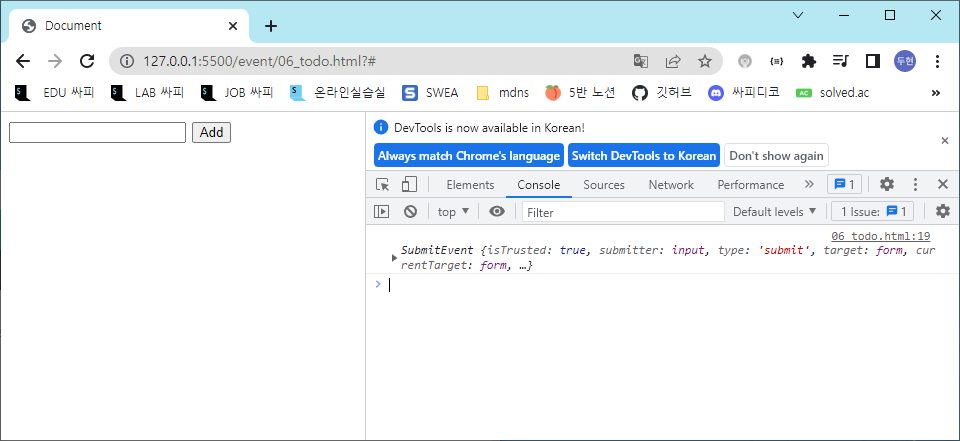

# JavaScript

## 개요

“브라우저에서의 JavaScript"

- 웹 페이지에서 복잡한 기능을 구현하는 스크립트 언어
- 가만히 정적인 정보만 보여주는 것이 아닌 주기적으로 갱신되거나, 사용자와 상호 작용이 가능하거나, 애니메이션이 적용된 그래픽 등에 관여

[참고] 스크립트 언어 (Script Language)

- 응용 소프트웨어를 제어하는 컴퓨터 프로그래밍 언어

## DOM

### Browser APIs

 웹 브라우저에 내장된 API로, 현재 컴퓨터 환경에 관한 데이터를 제공하거나 여러가지 유용하고 복잡한 일을 수행

- 클라이언트 사이드에서 추가적으로 가능

종류

- DOM
- Geolocation API
  - 지리정보
- WebGL 등
  - 그래픽

### DOM

웹페이지도 일종의 문서로 접근을 해야 함

“문서 객체 모델 (Document Object Model)"문서의 구조화된 표현을 제공하며 프로그래밍 언어가 DOM 구조에 접근할 수 있는 방법을 제공

- 문서 구조, 스타일, 내용 등을 변경할 수 있게 도움
- HTML 콘텐츠를 추가, 제거, 변경하고, 동적으로 페이지에 스타일을 추가하는 등HTML/CSS를 조작할 수 있음
- 문서가 구조화되어 있으며 각 요소는 객체(object)로 취급

단순한 속성 접근, 메서드 활용 뿐만 아니라 프로그래밍 언어적 특성을 활용한 조작 가능

- 대표적으로 자바스크립트

DOM API라는 모델을 통해서 함


DOM은 문서를 논리 트리로 표현

DOM 메서드를 사용하면 프로그래밍적으로 트리에 접근할 수 있고 이를 통해 문서의 구조, 스타일, 컨텐츠를 변경할 수 있음

태그/내용을 오브젝트로 제공

별도로 import할 필요 없이 브라우저가 자체적으로 제공

웹 페이지는 일종의 문서(document)

이 문서는 웹 브라우저를 통해 그 내용이 해석되어 웹 브라우저 화면에 나타나거나HTML 코드 자체로 나타나기도 함

DOM은 동일한 문서를 표현하고, 저장하고, 조작하는 방법을 제공

DOM은 웹 페이지의 객체 지향 표현이며, JavaScript와 같은 스크립트 언어를이용해 DOM을 수정할 수 있음

- 요소 하나하나에 접근해서 조작
- 조작을 하려면 접근을 해야 한다

#### DOM에 접근하기

DOM을 사용하기 위해 특별히 해야 할 일은 없음

모든 웹 브라우저는 스크립트 언어가 접근할 수 있는 웹페이지를 만들기 위해

DOM을 항상 사용함 

DOM의 주요 객체들을 활용하여 문서를 조작하거나 특정 요소들을 얻을 수 있음

#### DOM의 주요 객체

window

document

navigator, location, history, screen 등

##### window object

DOM을 표현하는 창

가장 최상위 객체 (작성 시 생략 가능)

탭 기능이 있는 브라우저에서는 각각의 탭을 각각의window 객체로 나타냄

개발자 도구 console

###### window의 메서드 예시

새 탭 열기

```javascript
window.open()
```

경고 대화 상자 표시

```javascript
window.print()
```

인쇄 대화 상자 표시

```javascript
window.alert()
```

##### document object

브라우저가 불러온 웹 페이지

페이지 컨텐츠의 진입점 역할을 하며, `<body>`등과 같은 수많은 다른 요소들을 포함하고 있음


###### document의 속성 예시

현재 문서의 제목

```javascript
document.title
// "삼성 청년 SW 아카데미"
```

제목 수정하기

```javascript
document.title = "JavaScript"
// "JavaScript"
```

###### [참고] document는 window의 속성이다

```javascript
window.document
// #document
```

###### [참고] 파싱(Parsing)

구문 분석 해석

브라우저가 문자열을 해석하여 DOM Tree로 만드는 과정


파싱을 먼저 하고 스타일을 만들고 배치를 한다

논리적인 DOM 트리

### DOM 조작

#### 개요

Document가 제공하는 기능을 사용해 웹 페이지 문서 조작하기

DOM 조작 순서

1. 선택 (Select)
2. 조작 (Manipulation)
   - 생성, 추가, 삭제 등

#### 선택 관련 메서드

##### document.querySelector(selector)

제공한 선택자와 일치하는 element 한 개 선택

제공한 CSS selector를 만족하는 첫 번째 element 객체를 반환 (없다면 null 반환)

- 하나만 찾는것
- 여러개 있는 것 선택할 때는 적합하지 않음

##### document.querySelectorAll(selector)

제공한 선택자와 일치하는 여러 element를 선택

매칭 할 하나 이상의 셀렉터를 포함하는 유효한 CSS selector를 인자(문자열)로 받음

제공한 CSS selector를 만족하는 NodeList를 반환

- 배열종류

##### 실습

###### 01_select.html

h1태그를 id값을 통해 접근

```html
    console.log(document.querySelector('#title'))
```

p태그 접근

```html
    console.log(document.querySelectorAll('.text'))
```


여러개 있는걸 querySelector로 하면 첫번째


ul태그 안에 li 태그 선택하고 싶을때


이렇게 해도 되는데 브라우저에서도 제공

elements에서 우클릭하고 copy에서 copyselector

그러면

```html
'body > ul > li:nth-child(1)'
```

이런식으로 뜨는데 

전체 찾고 싶으면

```html
'body > ul > li'
```

##### [참고] NodeList

index로만 각 항목에 접근 가능

배열의 forEach 메서드 및 다양한 배열 메서드 사용 가능

querySelectorAll()에 의해 반환되는 NodeList는 DOM의 변경사항을실시간으로 반영하지 않음

- 반복되는 와중에 내용이 바뀌었다고 해도 그것이 반영이 안됨
- 노드리스트는 반영하기도 하는데 querySelectorAll은 반영 안함
  - 그것을 정적 콜렉션이라 하고 반영하는게 동적 컬렉션

```html
liTags = document.querySelectorAll('body > ul > li')
    liTags.forEach(element => {
      console.log(element)  
    });
```


li 하나하나씩 출력됨

실시간으로 반영되는 친구도 있다

#### 조작 관련 메서드 (생성)

`document.createElement(tagName)`

작성한 tagName의 HTML 요소를 생성하여 반환

- 반환한다는 것이 중요하다

자바스크립트를 통해 태그를 생성

#### 조작 관련 메서드 (입력)

`Node.innerText `

Node 객체와 그 자손의 텍스트 컨텐츠(DOMString)를 표현(해당 요소 내부의 raw text)

사람이 읽을 수 있는 요소만 남김

즉, 줄 바꿈을 인식하고 숨겨진 내용을 무시하는 등 최종적으로 스타일링이 적용된 모습으로 표현됨

정확히는 속성값 - 태그와 태그 사이 콘텐츠가 들어가는데 거기가 innertext가 채우는 부분

#### 조작 관련 메서드 (추가)

`Node.appendChild()`

한 Node를 특정 부모 Node의 자식 NodeList 중 마지막 자식으로 삽입

- DOM 구조이기 때문에 어딘가의 하위 구조로 넣어줘야 함

한번에 오직 하나의 Node만 추가할 수 있음

추가된 Node 객체를 반환

만약 주어진 Node가 이미 문서에 존재하는 다른 Node를 참조한다면 현재 위치에서 새로운 위치로 이동

#### 조작 관련 메서드 (삭제)

`Node.removeChild()`

DOM에서 자식 Node를 제거
제거된 Node를 반환

#### 실습

###### 02_create_append.html


```html
<!DOCTYPE html>
<html lang="en">
<head>
  <meta charset="UTF-8">
  <meta http-equiv="X-UA-Compatible" content="IE=edge">
  <meta name="viewport" content="width=device-width, initial-scale=1.0">
  <title>Document</title>
</head>
<body>
  <div></div>
  
  <script>
    // 태그 생성
    const h1Tag = document.createElement('hi')

    // 태그 안에 컨텐츠를 작성하고
    h1Tag.innerText = 'DOM 조작'

    // 부모 div 태그를 가져와서
    const div = document.querySelector('div')

    // div 태그의 자식 요소로 추가
    div.appendChild(h1Tag)

    // div의 h1 요소 삭제
    div.removeChild(h1Tag)
  </script>
</body>
</html>
```

#### 조작 관련 메서드 (속성 조회 및 설정)

`Element.getAttribute(attributeName)`

- 해당 요소의 지정된 값(문자열)을 반환
- 인자(attributeName)는 값을 얻고자 하는 속성의 이름

`Element.setAttribute(name, value)`

- 지정된 요소의 값을 설정
- 속성이 이미 존재하면 값을 갱신, 존재하지 않으면 지정된 이름과 값으로 새 속성을 추가

###### 03_attribute.html

브라우저 console로 입력

```javascript
const aTag = document.createElement('a')
//undefined
aTag
// <a></a>
```

만들어주고

```javascript
aTag.setAttribute('href','https://google.com')
// undefined
aTag
//<a href="https://google.com"></a>
```

href 속성값 추가

```javascript
aTag.innerText = '구글'
//'구글'
aTag
//<a href="https://google.com">구글</a>
```

내용 넣기

div태그선택하고

자식 태그로 넣기

```javascript
const divTag = document.querySelector('div')
// undefined
divTag.appendChild(aTag)
//<a href="https://google.com">구글</a>
```


블루로 바꾸기

선택먼저

```javascript
const h1Tag = document.querySelector('h1')
// undefined
```

```javascript
h1Tag.classList
DOMTokenList ['red', value: 'red']
```

이렇게 클래스에 접근 가능

.toggle로 변경

```javascript
h1Tag.classList.toggle('blue')
// true
```

mdn classlist에서 종류 확인

코드로 보면

```javascript
<!DOCTYPE html>
<html lang="en">
<head>
  <meta charset="UTF-8">
  <meta http-equiv="X-UA-Compatible" content="IE=edge">
  <meta name="viewport" content="width=device-width, initial-scale=1.0">
  <title>Document</title>
  <style>
    .red { 
      color: red;
    }
    .blue {
      color: blue;
    }
  </style>
</head>
<body>
  <h1 class="red">안녕하세요</h1>
  <div></div>

  <script>
    const aTag = document.createElement('a')
    aTag.setAttribute('href','https://google.com')
    aTag.innerText = '구글'

    const divTag = document.querySelector('div')
    divTag.appendChild(aTag)
    
    const h1Tag = document.querySelector('h1')
    h1Tag.classList.toggle('blue')

  </script>
</body>
</html>
```

#### DOM 조작 정리

1. 선택한다
   - querySelector()
   - querySelectorAll()
2. 조작한다
   - innerText
   - setAttribute()
   - getAttribute()
   - createElement()
   - appendChild()
   - ...

### Event

#### 개요

Event란 프로그래밍하고 있는 시스템에서 일어나는 사건(action) 혹은 발생 (occurrence)인데, 우리가 원한다면 그것들에 어떠한 방식으로 응답할 수 있도록 시스템이 말해주는 것

- 예를 들어 사용자가 웹 페이지의 버튼을 클릭한다면 클릭에 대해 이벤트가 발생하고 우리는 클릭이라는 사건에 대한 결과를 받거나, 조작을 할 수 있음
- Event라는 객체를 제공

클릭 말고도 웹에서는 각양각색의 Event가 존재

- 키보드 키 입력, 브라우저 닫기, 데이터 제출, 텍스트 복사 등

- 네이버에서 검색창에 ㅌ치면 검색어가 뜨는것과 같음 페이지는 그대로인데 그것만 바꿈 
- 거기만 json으로 쏴주는것

#### Event Intro

##### Event object

네트워크 활동이나 사용자와의 상호작용 같은 사건의 발생을 알리기 위한 객체

Event 발생

- 마우스를 클릭하거나 키보드를 누르는 등 사용자 행동으로 발생할 수도 있고
- 특정 메서드를 호출하여 프로그래밍적으로도 만들어 낼 수 있음

DOM 요소는 Event를 받고(수신)

받은 Event를 처리할 수 있음

- 처리를 하는 메쏘드가 있음

- Event 처리는 주로 addEventListener()라는 Event 처리기(Event handler)를사용해 다양한 html 요소에 “부착"하게 됨
- Dom. 뒤에 붙음
- 수신처리부착 이벤트를 듣고 있다가 본인이 원하는 이벤트가 발생하면 행동을 함수로 지정


할일에 콜백함수가 들어간다

##### Event IntroEvent handler - addEventListener()

EventTarget.addEventListener(type, listener[, options])

지정한 Event가 대상에 전달될 때마다 호출할 함수를 설정

- listener에 들어감

Event를 지원하는 모든 객체(Element, Document, Window 등)를대상(EventTarget)으로 지정 가능

타겟에 부착해서 계속 듣고 있는 것

###### type

반응 할 Event 유형을 나타내는 대소문자 구분 문자열

대표 이벤트

- input, click, submit

- 다양한 이벤트 확인

  - https://developer.mozilla.org/en-US/docs/Web/Events

  - 웹에서 하는 모든 행동이 이벤트로 존재한다

###### listener

지정된 타입의 Event를 수신할 객체

- EventTarget에서 발생하는 이벤트가 첫번째 인자로 들어간다
- forEach 첫번째 인자 element에 배열이 하나씩 들어가는거랑 구조 유사

JavaScript function 객체(콜백 함수)여야 함

콜백 함수는 발생한 Event의 데이터를 가진 Event 기반 객체를 유일한 매개변수로 받음

##### 실습

###### 01_button.html

버튼을 누르면 0을 1씩 증가 시키게

```javascript
const btn = document.querySelector('#btn')

// 이벤트 핸들러
// 버튼에 클릭이라는 이벤트 발생하면 뒤 함수가 실행
btn.addEventListener('click', function (event) {
    console.log(event)
})
```

이렇게 하면 버튼 누르면

이벤트가 콘솔에 찍힘


p태그 설정

```javascript
      const pTag = document.querySelector('#counter')
```

countNum 초기값 설정

```javascript
    let countNum = 0
```

countNum 설정후 하나씩 더해지게 하고

```javascript
      const pTag = document.querySelector('#counter')
      countNum += 1
```

피태그 안에 넣어줌

```javascript
      pTag.innerText = countNum
```

최종

```javascript
    const btn = document.querySelector('#btn')
    let countNum = 0
    btn.addEventListener('click', function (event) {
      const pTag = document.querySelector('#counter')
      countNum += 1
      pTag.innerText = countNum
    })
```

페이지 전환없이 특정 부분만 바뀜

###### 02_input.html

인풋 이벤트 넣었을 때 그대로 출력

인풋 선택하기

```javascript
    const inputTag = document.querySelector('#text-input')
```

이벤트 핸들러 부착

```javascript
    inputTag.addEventListener('input', function (event) {
    })
```

이렇게 하면 input안에 하나 칠때마다 출력됨

```javascript
    inputTag.addEventListener('input', function (event) {
      console.log(event)
    })
```


p태그 선택

```javascript
      const pTag = document.querySelector('p')
```

인풋에 입력한 문자열은 어떤 객체에 있을까

아까 출력한 이벤트 안에 있음

발생한 이벤트에 이벤트 타겟을 설정할 수 있음 그 속성값이 event.target

```javascript
    const inputTag = document.querySelector('#text-input')

    inputTag.addEventListener('input', function (event) {
      console.log(event.target)
      const pTag = document.querySelector('p')
    })
```

이렇게 치면


인풋에는 value속성

```javascript
    const inputTag = document.querySelector('#text-input')

    inputTag.addEventListener('input', function (event) {
      console.log(event.target.value)
      const pTag = document.querySelector('p')
    })
```


input의 벨류값

이걸 innertext에 넣어주면

```javascript
      pTag.innerText = event.target.value
```

최종

```javascript
    const inputTag = document.querySelector('#text-input')

    inputTag.addEventListener('input', function (event) {

      const pTag = document.querySelector('p')
      pTag.innerText = event.target.value
    })
```


###### 03_button_input.gtml

입력하면 입력값 시시간 출력하고 버튼을 하면 출력된 값의 클래스를 토글

버튼이 아이디가 있으니까 그걸로 선택

```javascript
   const btn = document.querySelector('#btn')
```

이벤트 핸들러

```javascript
   btn.addEventListener('click', function (event) {
    
   })
```

쿼리셀렉터로 h1태그 선택

```javascript
    const h1Tag = document.querySelector('h1')
```

토글

```javascript
    h1Tag.classList.toggle('blue')
```

글자 실시간 출력

```javascript
    const inputTag = document.querySelector('input')
    inputTag.addEventListener('input', function (event) {
      const h1Tag = document.querySelector('h1')
      h1Tag.innerText = event.target.value
    })
```

최종

```java
    const btn = document.querySelector('#btn')
    btn.addEventListener('click', function (event) {
      const h1Tag = document.querySelector('h1')
      h1Tag.classList.toggle('blue')
    })

    const inputTag = document.querySelector('input')
    inputTag.addEventListener('input', function (event) {
      const h1Tag = document.querySelector('h1')
      h1Tag.innerText = event.target.value
    })
```

이런걸로 다크모드

#### Event 취소

##### event.preventDefault()

현재 Event의 기본 동작을 중단

HTML 요소의 기본 동작을 작동하지 않게 막음

HTML 요소의 기본 동작 예시

- a 태그 : 클릭 시 특정 주소로 이동
- form 태그 : form 데이터 전송

예) 복사를 못하게 함

##### 실습

###### 04_prevent.html

복사하려고 하면 경고창

h1태그 선택

```javascript
    const h1Tag = document.querySelector('h1')
```

copy를 넣으면 복사하는것

```javascript
    h1Tag.addEventListener('copy', function (event) {
      
    })
```

```javascript
      event.preventDefault()
```

이렇게 넣으면 복사가 안됨

경고문

```javascript
      alert('복사할 수 없습니다!!!')
```

최종

```javascript
    const h1Tag = document.querySelector('h1')
    h1Tag.addEventListener('copy', function (event) {
      event.preventDefault()
      alert('복사할 수 없습니다!!!')
    })
```


#### Event 종합실습

##### 05_lotto.html

버튼 클릭하면 랜덤 로또 번호 6개 출력

먼저 버튼 선택 버튼 아이디가 있으니 그걸로 선택

```javascript
    const btn = document.querySelector('#lotto-btn')
```

이벤트 핸들러

```javascript
    btn.addEventListener('click', function (event) {
      
    })
```

공이 들어갈 컨테이너 생성

```javascript
      const ball = document.createElement('div')
```

.toggle도 있는데 하나만 추가하는건 .add로도 가능

css에 있는 ball-container

```javascript
      ball.classList.add('ball-container')
```

랜덤한 숫자 8개 랜덤

파이썬은 랜덤할 수 있는데 자바스크립트는 그런 부분이 부족

그래서 그런 부분 라이브러리로 보완 그 중 하나가 lodash

```html
  <script src="https://cdn.jsdelivr.net/npm/lodash@4.17.21/lodash.min.js"></script>
```

```javascript
      const numbers = _.samplesize(_.range(1, 46), 6)
```

이런식으로 메쏘드 씀

이 range 파이썬이랑 똑같은 기능

내장된 모듈이나 메쏘드 쓸 수 있도록

https://lodash.com/

CDN copies 가져다가 붙이면 쓸 수 있음

파이썬의 메쏘드와 유사한 이름들이 존재

`_sampleSize` 샘플로 추출

`_range` 범위

```javascript
    const btn = document.querySelector('#lotto-btn')
    btn.addEventListener('click', function (event) {

      const ball = document.createElement('div')
      ball.classList.add('ball-container')

      const numbers = _.sampleSize(_.range(1, 46), 6)
      console.log(numbers)
    })
```

이거 잠깐 출력해보면


이걸 만들고

공 만들기

forEach문으로

```javascript
      numbers.forEach((number) => {

      });
```

div 만들고

```javascript
        const ballContainer = document.createElement('div')
```

안에 넣고

```javascript
        ballContainer.innerText = number
```

스타일 입히기

style.backgroundColor로 색깔 입히기 가능

```javascript
        ball.classList.add('ball')
        ball.style.backgroundColor = 'crimson'
```

볼 컨테이너 안에 넣기

```javascript
        ballContainer.appendChild(ball)
```

공 컨테이너는 결과 영역의 자식으로 넣기

컨테이너에 div 6개 넣고 한방에 다른 영역

```javascript
      const resultDiv = document.querySelector('#result')
      resultDiv.appendChild(ballContainer)
```

최종

```javascript
    const btn = document.querySelector('#lotto-btn')
    btn.addEventListener('click', function (event) {

      const ballContainer = document.createElement('div')
      ballContainer.classList.add('ball-container')

      const numbers = _.sampleSize(_.range(1, 46), 6)
      console.log(numbers)

      numbers.forEach((number) => {
        const ball = document.createElement('div')
        ball.innerText = number
        ball.classList.add('ball')
        ball.style.backgroundColor = 'crimson'
        ballContainer.appendChild(ball)
      });

      const resultDiv = document.querySelector('#result')
      resultDiv.appendChild(ballContainer)
    })
```


###### [참고] lodash

모듈성, 성능 및 추가 기능을 제공하는 JavaScript 유틸리티 라이브러리

array, object등 자료구조를 다룰 때 사용하는 유용하고 간편한 유틸리티 함수들을 제공

함수 예시

- reverse, sortBy, range, random ...

https://lodash.com/

##### 06_todo.html

입력해서 add 누르면 todo가 추가

form에서 submit이벤트가 발생하게

form의 기본동작을 막기도 해야함

리스트도 만들어서 어펜드 차일드

폼 태그 설정 아이디 없으니 그냥 폼으로

```javascript
    const formTag = document.querySelector('form')
```

이벤트 핸들러, 동작은 submit

```javascript
    formTag.addEventListener('submit', function (event) {
      
    })
```

```javascript
    const formTag = document.querySelector('form')
    formTag.addEventListener('submit', function (event) {
      console.log(event)
    })
```

이렇게 누르고 확인



주소가 바뀜 액션으로 요청을 보내는것

요청 보내는 것이 아니기 때문에 이거 막아야 함

```javascript
      event.preventDefault()
```

```javascript
    const formTag = document.querySelector('form')
    formTag.addEventListener('submit', function (event) {
      console.log(event)
      event.preventDefault()
    })
```

이렇게 넣고 하면


계속 출력되고 주소 안바뀜

입력값 가져오고 저장

input태그 가져오기 input태그가 두개인데 클래스가 하나만 있어 클래스 선택자로 선택

```javascript
      const inputTag = document.querySelector('.inputData')
```

인풋 태그 벨류값

```javascript
      const data = inputTag.value
```

한번 출력해보고 Add 누르면

```javascript
    const formTag = document.querySelector('form')
    formTag.addEventListener('submit', function (event) {
      event.preventDefault()
      const inputTag = document.querySelector('.inputData')
      const data = inputTag.value
      console.log(data)
    })
```


이제 리스트 태그 만들고

```javascript
      const liTag = document.createElement('li')
```

이너 텍스트로 넣어줌

```javascript
      liTag.innerText = data
```

만든걸 ul태그에 넣어줌

먼저 ul태그 선택

```javascript
      const ulTag = document.querySelector('ul')
```

li태그를 안에 넣어줌

```javascript
      ulTag.appendChild(liTag)
```

하나 입력하고 없어지도록 reset() 붙여줌

```ja
      event.target.reset()
```

최종

```javascript
    const formTag = document.querySelector('form')
    formTag.addEventListener('submit', function (event) {

      event.preventDefault()
      const inputTag = document.querySelector('.inputData')
      const data = inputTag.value

      const liTag = document.createElement('li')
      liTag.innerText = data

      const ulTag = document.querySelector('ul')
      ulTag.appendChild(liTag)

      event.target.reset()
    })
```


공백이나 스페이스만 넣었을때는 안되게 하기

.trim() 공백 제거

```javascript
      if (data.trim()){

      } else {
        alert('내용을 입력하세요!')
      }
```

하고 안에 실행되는과정 넣기

최최종

```javascript
    const formTag = document.querySelector('form')
    formTag.addEventListener('submit', function (event) {

      event.preventDefault()
      const inputTag = document.querySelector('.inputData')
      const data = inputTag.value

      if (data.trim()){
        const liTag = document.createElement('li')
        liTag.innerText = data
  
        const ulTag = document.querySelector('ul')
        ulTag.appendChild(liTag)
        event.target.reset()
      } else {
        alert('내용을 입력하세요!')
      }
    })
```


콜백함수 길어지니 밖으로 빼기

함수 따로 만들고 함수 들어갈 곳에 그것 넣기

최최종

```javascript
    const addTodo = function (event) {

      event.preventDefault()
      const inputTag = document.querySelector('.inputData')
      const data = inputTag.value
 
      if (data.trim()){
        const liTag = document.createElement('li')
        liTag.innerText = data
  
        const ulTag = document.querySelector('ul')
        ulTag.appendChild(liTag)
        event.target.reset()
      } else {
        alert('내용을 입력하세요!')
      }
    }
```

### this

#### this

어떠한 object를 가리키는 키워드

- (java에서의 this와 python에서의 self는 인스턴스 자기자신을 가리킴) 

Javascript의 함수는 호출될 때 this를 암묵적으로 전달 받음

- 따로 선언 안해도

JavaScript에서의 this는 일반적인 프로그래밍 언어에서의 this와 조금 다르게 동작

- 다른 언어는 호출 방식은 상관없고 어디서 호출됐는지에 따라 값 고정
- 자바스크립트는 같은 함수라도 어떻게 호출하냐에 따라 this가 다름

JavaScript는 해당 함수 호출 방식에 따라 this에 바인딩 되는 객체가 달라짐

즉, 함수를 선언할 때 this에 객체가 결정되는 것이 아니고, 함수를 호출할 때 함수가 어떻게 호출 되었는지에 따라 동적으로 결정됨

#### INDEX

1. 전역 문맥에서의 this
   - 고정이라 지금은 여기서 상관없음
2. 함수 문맥에서의 this (함수 호출방식 3가지에 따라 다름)
   - 단순 호출
   - Method (객체의 메서드로서)
   - Nested

##### 전역 문맥에서의 this

브라우저의 전역 객체인 window를 가리킴

- 전역객체는 모든 객체의 유일한 최상위 객체를 의미

```javascript
console.log(this) // window
```

이건 브라우저일때 상황이고 node에서는 global

##### 함수 문맥에서의 this

함수의 this 키워드는 다른 언어와 조금 다르게 동작

- this의 값은 함수를 호출한 방법에 의해 결정됨
- 함수 내부에서 this의 값은 함수를 호출한 방법에 의해 좌우됨

###### 단순 호출

전역 객체를 가리킴

전역은 브라우저에서는 window, Node.js는 global을 의미함

```javascript
const myFunc = function () {
    console.log(this)
}

// 브라우저
myFunc() // window
// Node.js
myFunc() // global
```

큰 특이사항 없음

###### Method (Function in Object, 객체의 메서드로서)

메서드로 선언하고 호출한다면, 객체의 메서드이므로 전역이 아니라 해당 객체가 바인딩

```javascript
const myObj = {
    data: 1,
    my Func() {
        console.log(this) // myObj
        console.log(this.data) // 1
  }
}
myObj.myFunc() // myObj
```

같은 곳에있는 data에 접근할 수 있음

전역이 아니라 본인을 호출하는 객체

본인이 해당되는 데이터를 사용할 수 있음

###### Nested (Function 키워드)

forEach의 콜백 함수에서의 this가 메서드의 객체를 가리키지 못하고 전역 객체 window를 가리킴

단순 호출 방식으로 사용되었기 때문

- 방식이 중요함

이를 해결하기 위해 등장한 함수 표현식이 바로 "화살표 함수"

- 동작 원리 자체가 다름

```javascript
const myObj = {
    numbers: [1],
    myFunc() {
        console.log(this) // myObj
        this.numbers.forEach(function (number) {
             console.log(number) // 1
             console.log(this) // window
    	})
	}
}

myObj.myFunc()
```

이전에 일반 function 키워드와달리 메서드의 객체를 잘 가리킴

화살표 함수에서 this는 자신을 감싼 정적 범위

- 감싸고 있는 객체
- 더 깊어지면 그 안에 있는 중간 범위

자동으로 한 단계 상위의 scope의 context를 바인딩

- 여기서는 myObj

- 바인딩 방식이 다름

this 쓰려면 화살표 함수 써야함

```javascript
const myObj = {
    numbers: [1],
    myFunc() {
        console.log(this) // myObj
        this.numbers.forEach((number) => {
             console.log(number) // 1
             console.log(this) // window
    	})
	}
}

myObj.myFunc()
```

function 키워드와 화살표 함수 비교


#### 화살표 함수

화살표 함수는 호출의 위치와 상관없이 상위 스코프를 가리킴 (Lexical scope this)•

Lexical scope

- 함수를 어디서 호출하는지가 아니라 어디에 선언하였는지에 따라 결정
- Static scope 라고도하며 대부분의 프로그래밍 언어에서 따르는 방식
- 일반적인 프로그래밍 언어에서는 this가 이 방식임

따라서 함수 내의 함수 상황에서 화살표 함수를 쓰는 것을 권장

#### this와 addEventListener

하지만..

`addEventListener`에서의 콜백 함수는 특별하게 function 키워드의 경우 `addEventListener`를 호출한 대상을(`event.target` ) 뜻함

- 로또 경우에서는 btn

반면 화살표 함수의 경우 상위 스코프를 지칭하기 때문에 window 객체가 바인딩 됨

- 호출방식이 중요한 게 아니라 어디에 선언된지가 중요함
- 한단계 위를 가리키는데 한단계 위면 전역이 되어버림

결론

- "`addEventListener` 의 콜백 함수는 function 키워드를 사용하기"
- this 안쓰면 상관없긴함

```html
<body>
<button id="function">function</button>
<button id="arrow">arrow function</button>

<script>
	const functionButton = document.querySelector('#function')
    const arrowButton = document.querySelector('#arrow')
    
	functionButton.addEventListener('click', function(event) {
	  console.log(this) // <button id="function">function</button>
	})
	
    arrowButton.addEventListener('click', event => {
	  console.log(this) // window
    })
  </script>
</body>
```

시험문제로 밑줄친 this가 가리키는것

#### 장점/단점

this가 호출되는 순간에 결정되는 것(런타임)의 장점 단점

장점

- 함수(메서드)를 하나만 만들어서 여러 객체에 재사용할 수 있다.
  - 고정되어있는 this가 아니라 개체별로 각각 잘 가리킬 수 있다

단점

- 이런 유연함이 실수로 이어질 수 있다

this가 좋은지 나쁜지는 우리가 판단하는 것이 중요한것이 아니다

동작원리 이해하고 장점을 취하고 실수 줄여야함

## 마무리

DOM

- DOM 조작

Event

- addEventListener

this

- "function" vs "arrow function"