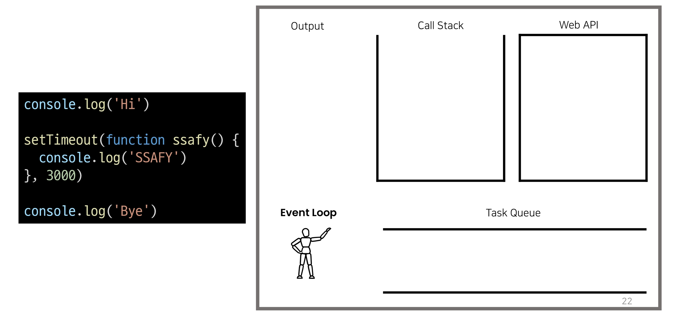

# Javascript

## 동기와 비동기

### 개요

JavaScript에서의 비동기 처리 학습

### INTRO

주문 후 커피가 나올 때까지 기다려야 함 (동기식)


주문 후 진동벨이 울리면 커피를 가져옴


- 주문 후 본인이 해야할 일을 할 수 있다

만약 위에서부터 순서대로만 처리 해야 한다면?

<오늘의 할 일> 

1. 교수님께 이메일 보내기
   - 교수님 답장 확인하기
   - 교수님께 답장 보내기
2. 저녁 식사 하기
3. 부모님께 안부 전화하기
   - 전화 통화가 안되면 문자로 안부 물어보기
4. 꿀잠자기

교수님의 답장이 오지 않으면 영원히 저녁 식사를 할 수 없다!


### 동기(Synchronous)

모든 일을 순서대로 하나씩 처리하는 것

순서대로 처리한다 == 이전 작업이 끝나면 다음 작업을 시작한다.

우리가 작성했던 Python 코드가 모두 동기식 

```python
print('첫번째 작업')
for i in range (10):
    print('두번째 작업')
    print(i)
print('세번째 작업') 
```


요청과 응답을 동기식으로 처리한다면?요청을 보내고 응답이 올때까지 기다렸다가 다음 로직을 처리

01_sync

```javascript
    const btn = document.querySelector('button')
    btn.addEventListener('click', () => {
      alert('you clicked me!')
      const pElem = document.createElement('p')
      pElem.innerText = 'p Element'
      document.body.appendChild(pElem)
  })
```

경고창이 끝나야 p가 뜸

### **비동기(Asynchronous)**

작업을 시작한 후 결과를 기다리지 않고 다음 작업을 처리하는 것 (병렬적 수행)

시간이 필요한 작업들은 요청을 보낸 뒤 응답이 빨리 오는 작업부터 처리

예시) Gmail에서 메일 전송을 누르면 목록 화면으로 전환되지만 실제로 메일을 보내는 작업은 병렬적으로 뒤에서 처리됨


네이버 페이지 뜨는것도

02_async.js

```javascript
function slowRequest(callBack) {
  console.log('1. 오래 걸리는 작업 시작 ...')
  setTimeout(function () {  
    callBack()
  }, 3000)
}

function myCallBack() {
  console.log('2. 콜백함수 실행됨')
}

slowRequest(myCallBack)
console.log('3. 다른 작업 실행')
```

1-3-2 순으로 실행됨

```bash
$ node 02_async.js
1. 오래 걸리는 작업 시작 ...
3. 다른 작업 실행
2. 콜백함수 실행됨
```

2번이 setTimeout에 걸리고 3초 걸리는 시간처리 기다리지 않고 3번부터 실행

#### 비동기(Asynchronous)를 사용하는 이유

사용자 경험 

예를 들어 아주 큰 데이터를 불러온 뒤 실행되는 앱이 있을 때, 동기로 처리한다면 데이터를 모두 불러온 뒤에야 앱의 실행 로직이 수행되므로 사용자들은 마치 앱이 멈춘 것과 같은 경험을 겪게 됨

즉, 동기식 처리는 특정 로직이 실행되는 동안 다른 로직 실행을 차단하기 때문에 마치 프로그램이 응답하지 않는 듯한 사용자 경험을 만들게 됨

비동기로 처리한다면 먼저 처리되는 부분부터 보여줄 수 있으므로, 사용자 경험에 긍정적인 효과를 볼 수 있음 이와 같은 이유로 많은 웹 기능은 비동기 로직을 사용해서 구현되어 있음

### Javascript의 비동기 처리

#### Single Thread, JavaScript

그러면 응답이 먼저 오는 순서대로 처리하지 말고,아예 여러 작업을 동시에 처리하면 되지 않을까?

- 그렇지는 못한다

 JavaScript는 한 번에 하나의 일만 수행할 수 있는 Single Thread 언어로 동시에 여러 작업을 처리할 수 없음

[참고] Thread란? 작업을 처리할 때 실제로 작업을 수행하는 주체로, multi-thread라면 업무를 수행할 수 있는 주체가 여러 개라는 의미

즉, JavaScript는 하나의 작업을 요청한 순서대로 처리할 수 밖에 없다! 그러면 어떻게 Single Thread인 JavaScript가 비동기 처리를 할 수 있을까?

#### JavaScript Runtime

JavaScript 자체는 Single Thread이므로 비동기 처리를 할 수 있도록도와주는 환경이 필요함

특정 언어가 동작할 수 있는 환경을 런타임(Runtime)이라 함

JavaScript에서 비동기와 관련한 작업은 브라우저 또는 Node 환경에서 처리

- 브라우저와 node.js의 도움이 필요

이중에서 브라우저 환경에서의 비동기 동작은 크게 아래의 요소들로 구성됨

1. Javascript Engine의 Call Stack
1. Web API
1. Task Queue
1. Event Loop

#### 비동기 처리 동작 방식

##### 브라우저 환경

브라우저 환경에서의 JavaScript의 비동기는 아래와 같이 처리된다.

1. 모든 작업은 Call Stack(LIFO)으로 들어간 후 처리된다.
   - pop하면서 실행
2. 오래 걸리는 작업이 Call Stack으로 들어오면 Web API로 보내서 처리하도록 한다.
   - web api 브라우저가 제공하는 공간
3. Web API에서 처리가 끝난 작업들은 곧바로 Call Stack으로 들어가지 못하고 Task Queue(FIFO)에 순서대로 들어간다.
   - 대기열
4. Event Loop가 Call Stack이 비어 있는 것을 체크하고 Call Stack이 빈다면,Task Queue에서 가장 오래된 (가장 앞에 있는) 작업을 Call Stack으로 보낸다.




코드가 실행


모든것은 콜스택에 일단 들어가고


하이 출력됨


셋 타임아웃 실행


3초후에 실행되어야 해서 다른 공간으로 이동함


시간 가는동안 


콜스택에서 다른 업무


바이 출력


3초 지나고 콜스택 가는게 아니라 


태스트 큐로 감


이벤트 루프가 감시하다가 비었을 때 


콜스택에 넣음


그제서야


출력함


3초라고 웹API에 처리하는 시간이고 콜스택에서 처리하는 시간이 있고 대기자가 있을수 있기 때문에

3초 보장할 수 없음 최소 지연시간일뿐임

`03_eventloop.html`

```javascript
    console.log('Hi')

    setTimeout(function () {
      console.log('SSAFY')
    }, 3000)

    console.log('Bye')
```

```
Hi
Bye
SSAFY
```

근데 0초로 해도 또

```javascript
    console.log('Hi')

    setTimeout(function () {
      console.log('SSAFY')
    }, 0)

    console.log('Bye')
```

```
Hi
Bye
SSAFY
```

0초는 지연시간일뿐이기 때문 그 시간후에 출력된다는 것이 아님

##### Call Stack

요청이 들어올 때 마다 순차적으로 처리하는 Stack(LIFO)기본적인 JavaScript의 Single Thread 작업 처리

##### Web API

JavaScript 엔진이 아닌 브라우저에서 제공하는 runtime 환경으로시간이 소요되는 작업을 처리 (setTimeout, DOM Event, AJAX 요청 등)

##### Task Queue

비동기 처리된 Callback 함수가 대기하는 Queue(FIFO)

##### Event Loop

Call Stack과 Task Queue를 지속적으로 모니터링

Call Stack이 비어 있는지 확인 후 비어 있다면 Task Queue에서 대기 중인 오래된 작업을 Call Stack으로 Push

### 정리

JavaScript는 한 번에 하나의 작업을 수행하는 Single Thread 언어로 동기적 처리를 하지만, 브라우저 환경에서는 Web API에서 처리된 작업이 지속적으로 Task Queue를 거쳐 Event Loop에 의해 Call Stack에 들어와 순차적으로 실행됨으로써 비동기 작업이 가능한 환경이 된다.

## Axios

### Axios

JavaScript의 HTTP 웹 통신을 위한 라이브러리

확장 가능하나 인터페이스와 쉽게 사용할 수 있는 비동기 통신 기능을 제공

node 환경은 npm을 이용해서 설치 후 사용할 수 있고, browser 환경은 CDN을 이용해서 사용할 수 있음

Axios 공식문서 및 github

- https://axios-http.com/kr/docs/intro
- https://github.com/axios/axios

### Axios 기본 구조

#### Axios 사용해보기

```javascript
<script src="https://cdn.jsdelivr.net/npm/axios/dist/axios.min.js"></script>
<script>
  axios.get(' 요청할 URL')
    .then(성공하면 수행할 콜백함수)
    .catch(실패하면 수행할 콜백함수)
</script>
```

axios가 request의 역할

.을 밑으로 엔터쳐서 명시적으로 긴 콜백함수 표현하기 위해

get, post 등 여러 method 사용가능

then을 이용해서 성공하면 수행할 로직을 작성

catch를 이용해서 실패하면 수행할 로직을 작성

#### **고양이 사진 가져오기**

The Cat API (https://api.thecatapi.com/v1/images/search)

- 이미지를 요청해서 가져오는 작업을 비동기로 처리

response 구조

```json
// https://api.thecatapi.com/v1/images/search
[
    {
        "id": "d6n",
        "url": "https://cdn2.thecatapi.com/images/d6n.jpg",
        "width": 333,
        "height": 500
    }
]
```

##### Python

`04_cat_api.py`

```py
import requests 

print('고양이는 야옹')

cat_image_search_url = 'https://api.thecatapi.com/v1/images/search'
response = requests.get(cat_image_search_url)

if response.status_code == 200:
    print(response.json())
else: 
    print('실패했다옹')
    
print('야옹야옹')
```

파이썬은 응답 기다리기 때문에 순서대로 출력

```bash
$ python 04_cat_api.py
고양이는 야옹
[{'id': 'dpb', 'url': 'https://cdn2.thecatapi.com/images/dpb.jpg', 'width': 1024, 'height': 681}]
야옹야옹
```

##### JavaScript

`05_cat_api.html`

```html
<!DOCTYPE html>
<html lang="en">
<head>
  <meta charset="UTF-8">
  <meta http-equiv="X-UA-Compatible" content="IE=edge">
  <meta name="viewport" content="width=device-width, initial-scale=1.0">
  <title>Document</title>
</head>
<body>
  <button>야옹아 이리온</button>

  <script src="https://cdn.jsdelivr.net/npm/axios/dist/axios.min.js"></script>
  <script>
    console.log('고양이는 야옹')
    const catImageSearchURL = 'https://api.thecatapi.com/v1/images/search'
    axios.get(catImageSearchURL)
        .then((response) => {
        console.log(response)
    })
        .catch((error) => { 
        console.log('실패했다옹')
    })
      console.log('야옹야옹') 
  </script>
</body>
</html>
```


자바스크립트는 기다리지 않기 떄문에 야옹야옹이 먼저 나옴

```javascript
axios.get(catImageSearchURL)
    .then((response) => {
    console.log(response.data)
    // imgElem = document.createElement('img')
    // imgElem.setAttribute('src', response.data[0].url)
    // document.body.appendChild(imgElem)
})
    .catch((error) => { 
    console.log('실패했다옹')
})
console.log('야옹야옹') 
```

##### 결과 비교

동기식 코드(python)는 위에서부터 순서대로 처리가 되기때문에 첫번째 print 가출력되고 이미지를 가져오는 처리를 기다렸다가 다음 print 가 출력되는 반면

비동기식 코드(JavaScript)는 바로 처리가 가능한 작업(console.log)은 바로 처리하고, 오래 걸리는 작업인 이미지를 요청하고 가져오는 일은 요청을 보내 놓고 기다리지 않고 다음 코드로 진행 후 완료가 된 시점에 결과 출력이 진행됨.

##### 완성하기

작업 Flow

1. 버튼을 누르면
2. 고양이 이미지를 요청하고
3. 요청이 처리되어 응답이 오면
4. 처리된 response에 있는 url을 img태그에 넣어 보여주기

response.data로 하면


response.data[0]


response.data[0].url


이제

```javascript
    const btn = document.querySelector('button')
```

버튼 찾고

```javascript
    btn.addEventListener('click', function () {

    })
```

버튼에 이벤트 핸들러

```javascript
      axios.get(catImageSearchURL)
        .then((response) => {
          imgElem = document.createElement('img')
          imgElem.setAttribute('src', response.data[0].url)
          document.body.appendChild(imgElem)
        })
        .catch((error) => { 
          console.log('실패했다옹')
        })
        console.log('야옹야옹') 
```

아까 찾아온 url을 img 태그로 넣음

##### 실행 결과

버튼을 누르면 console.log가 먼저 출력되고 이미지 요청을 보낸다.

버튼을 여러 번 누르면 먼저 로딩되는 이미지부터 나오는 것을 볼 수 있다.


여러번 누르면 먼저 처리되는 이미지부터 출력

최종

`05_cat_api.html`

```html
...
<body>
  <button>야옹아 이리온</button>

  <script src="https://cdn.jsdelivr.net/npm/axios/dist/axios.min.js"></script>
  <script>
    console.log('고양이는 야옹')
    const catImageSearchURL = 'https://api.thecatapi.com/v1/images/search'
    const btn = document.querySelector('button')

    btn.addEventListener('click', function () {
      axios.get(catImageSearchURL)
        .then((response) => {
          imgElem = document.createElement('img')
          imgElem.setAttribute('src', response.data[0].url)
          document.body.appendChild(imgElem)
        })
        .catch((error) => { 
          console.log('실패했다옹')
        })
        console.log('야옹야옹') 
    })
  </script>
</body>
...
```

강아지도 추가하기


마지막 then에서는 return없어도 된다

### 정리

axios는 비동기로 데이터 통신을 가능하게 하는 라이브러리

같은 방식으로 우리가 배운 Django REST API로 요청을 보내서 데이터를 받아온 후 처리할 수 있음

## Callback과 Promise

### 비동기 처리의 단점

비동기 처리의 핵심은 Web API로 들어오는 순서가 아니라 작업이 완료되는 순서에 따라 처리한다는 것!

그런데 이는 개발자 입장에서 코드의 실행 순서가 불명확하다는 단점이 있음 이와 같은 단점은 실행 결과를 예상하면서 코드를 작성할 수 없게 함

→ 어떻게 해야 할까? → 콜백 함수를 사용하자 !!

### 콜백 함수(Callback Function)

#### 콜백 함수란?

특별한 함수가 아님! 다른 함수의 인자로 전달되는 함수를 콜백 함수라고 한다.

비동기에만 사용되는 함수가 아니며 동기, 비동기 상관없이 사용 가능

시간이 걸리는 비동기 작업이 완료된 후 실행할 작업을 명시하는 데 사용되는 콜백 함수를 비동기 콜백(asynchronous callback)이라 부름

- ~하면 ~하겠다로 순서 만들 수 있음

#### 예시

JavaScript의 Event Listener

```javascript
const btn = document.querySelector('button')
btn.addEventListener('click', () => {
    alert('Completed')
})
```

Django의 View Function

```python
from django.urls import path
from . import views

urlpatterns = [
	path('index/', views.index),
]
```

시점이라는 것이 존재

- 클릭할때
- url 접근했을때

#### 사용하는 이유

명시적인 호출이 아닌 특정한 조건 혹은 행동에 의해 호출되도록 작성할 수 있음

“요청이 들어오면”, “이벤트가 발생하면", "데이터를 받아오면” 등의 조건으로 이후 로직을 제어할 수 있음

비동기 처리를 순차적으로 동작할 수 있게 함

비동기 처리를 위해서는 콜백 함수의 형태가 반드시 필요함

#### 콜백 지옥 (Callback Hell)

콜백 함수는 연쇄적으로 발생하는 비동기 작업을 순차적으로 동작할 수 있게 함 

보통 어떤 기능의 실행 결과를 받아서 다른 기능을 수행하기 위해 많이 사용하는데, 이 과정을 작성하다 보면 비슷한 패턴이 계속 발생하게 됨

- A를 처리해서 결과가 나오면, 첫 번째 callback 함수를 실행하고 첫 번째 callback 함수가 종료되면, 두 번째 callback 함수를 실행하고 두 번째 callback 함수가 종료되면, 세 번째 callback 함수를 실행하고 ...


비동기 처리를 위한 콜백을 작성할 때 마주하는 문제를 Callback Hell(콜백 지옥)이라 하며, 그때의 코드 작성 형태가 마치 “피라미드와 같다"고 해서 “Pyramid of doom(파멸의 피라미드)”라고도 부름

#### 정리

콜백 함수는 비동기 작업을 순차적으로 실행할 수 있게 하는 반드시 필요한 로직

비동기 코드를 작성하다 보면 콜백 함수로 인한 콜백 지옥(callback hell)은 반드시 나타나는 문제

- 코드의 가독성을 해치고

- 유지 보수가 어려워짐

### 프로미스(Promise)

Callback Hell 문제를 해결하기 위해 등장한 비동기 처리를 위한 객체

“작업이 끝나면 실행 시켜줄게"라는 약속(promise)

비동기 작업의 완료 또는 실패를 나타내는 객체

Promise 기반의 클라이언트가 바로 이전에 사용한 Axios 라이브러리 !

- "Promise based HTTP client for the browser and node.js”
- 성공에 대한 약속 then()
- 실패에 대한 약속 catch()
- 객체.메서드
  - 그 앞에 결과물이 객체라는 말
  - axios.get()가 객체라는 말
  - 이게 프로미스 객체임

```javascript
console.log(axios.get(catImageSearchURL))
```


#### then(callback)

요청한 작업이 성공하면 callback 실행

callback은 이전 작업의 성공 결과를 인자로 전달 받음

#### catch(callback)

then()이 하나라도 실패하면 callback 실행

callback은 이전 작업의 실패 객체를 인자로 전달 받음

- 왜 실패했는지에 대한 정보

#### then & catch

then과 catch 모두 항상 promise 객체를 반환즉, 계속해서 chaining을 할 수 있음

axios로 처리한 비동기 로직이 항상 promise 객체를 반환

그래서 then을 계속 이어 나가면서 작성할 수 있던 것

```javascript
axios.get('요청할 URL').then(...).then(...).catch(...)
```

```javascript
axios.get('요청할 URL') // Promise 객체 return
  .then(성공하면 수행할 1번 콜백함수)
  .then(1번 콜백함수가 성공하면 수행할 2번 콜백함수)
  ...
  .catch(실패하면 수행할 콜백함수)
```

깊어지지 않고 아래로 내려가면서 아래로

then이 실패해야지 다음 then이 실행됨

어떤 함수든 실패하면 catch로 감

#### 비동기 콜백 vs Promise

```javascript
// 기존의 콜백 함수 작성 방식

work1(function () {
  // 첫번째 작업 ... 
  work2(result1, function (result2) {
	// 두번째 작업 ...
    work3(result2, function (result3) {
	  console.log('최종 결과:' + result3)
    })
  })
})
```

```javascript
// promise 방식

work1()
  .then((result1) => {
  // work2
  return result2
  .then((result2) => {
  // work3
  return result3
  .catch((error) => {
  // error handling
  })
```

promise 방식은 비동기 처리를 마치 우리가 일반적으로 위에서 아래로 적는 방식처럼 코드를 작성할 수 있음

캐치를 중간에 섞으면 캐치 위의 댄에서만 사용할 수 있다

일반적으로는 마지막에 씀

#### **Promise가 보장하는 것 (vs 비동기 콜백)**

비동기 콜백 작성 스타일과 달리 Promise가 보장하는 특징

1. callback 함수는 JavaScript의 Event Loop가현재 실행 중인 Call Stack을 완료하기 이전에는 절대 호출되지 않음
   - Promise callback 함수는 Event Queue에 배치되는 엄격한 순서로 호출됨
2. 비동기 작업이 성공하거나 실패한 뒤에 .then() 메서드를 이용하여 추가한 경우에도 1번과 똑같이 동작 
3. then()을 여러 번 사용하여 여러 개의 callback 함수를 추가할 수 있음 (Chaining) 
   - 각각의 callback은 주어진 순서대로 하나하나 실행하게 됨
   - Chaining은 Promise의 가장 뛰어난 장점

then()에 들어가는 response는 아무거나 들어가도 되어서

내려주는 이름을 맞춰서 가는 경우가 많음

axios.post() 이렇게 POST 방식 가능 근데 이건 데이터 보내기는 어려움

이 것 대신

```javascript
      axios.get(catImageSearchURL)
```

아래 방식으로 하면 수월함

```javascript
      axios({
        method : 'post',
        url : catImageSearchURL
        data : {
          title: '제목',
          content: '내용'
        }
      })
```

https://axios-http.com/kr/docs/req_config

이 공식문서 형식대로 써야함

## 마무리

동기와 비동기

JavaScript의 비동기 처리

- Call Stack, Web API, Task Queue, Event Loop

Axios 라이브러리

- then & catch

Async Callback과 Promise