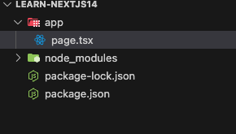
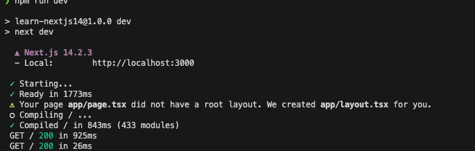

# 1강

 ## 라이브러리 vs 프레임워크

`라이브러리` : 코드 내에서 우리가 사용하는 것

- 원하는 아키텍처를 사용

- 원하는 언어 사용 가능
- 코드 내에서 사용하려고 설치하지만 우리가 사용함
- 파일 저장 장소, 폴더 이런것 우리가 정함
- 우리가 필요할 때 사용
- 다운 받아서 사용
- 리액트 : ui인터페이스를 build할 때 사용하는 라이브러리
  - 반응형 사용자 인터페이스 구축
  - sas나 리액트 쿼리 등등 자유롭게 사용
  - 어떤 폴더, 파일, 구조에서 리액트 사용할 지는 우리가 정함

`프레임워크` : 이것이 우리의 코드를 사용

- 프레임워크가 우리 대신 결정해주고 작업해줌
- next.js가 기능해줌
- 올바른 위치에 올바른 파일을 넣으면 애플리케이션 작송
- import해서 사용하는게 아니라 넥스트가 우리의 코드를 call
- 올바른 위치에 올바른 코드 하면 여기서 export되어서 넥스트가 사용

## setup

`npm init -y`해서 패키지 만들고 lisence MIT로 바꿈

```zsh
npm install react@latest next@latest react-dom@latest
```

`package.json`

```json
{
  ...
  "scripts": {
    "dev": "next dev"
  },
  ...
}

```

app안의 page를 찾을거임 넥스트가

그래서 만들어줌




page.tsx

```tsx
export default function Tomato() {
    return <h1>Hello NextJs!</h1>
}
```

`npm run dev`



App.page.tsx에 루트 레이아웃이 없다 그래서 크리에이트 했다 이런거 뜸