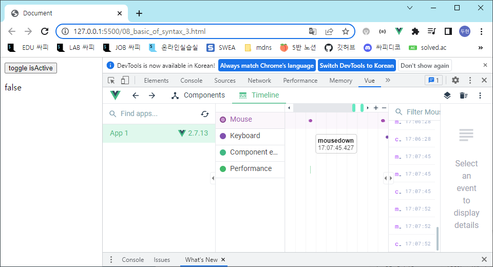

# Vue

## Vue intro

### 개요

Front-end 개발이란 무엇인가

Front-end framework란 무엇인가

Vue를 배우는 이유

Vue 기초 문법

### Front-end Development

#### What is Front-end Development?

##### 개요

우리가 앞으로 할 일은 JavaScript를 활용한 Front-end 개발

Back-end 개발은 Back-end 개발에 특화된 Django로 진행

Front-end?

- Vue.js
-  Vue.js === JavaScript Front-end Framework

##### Front-end Framework

Front-end(FE) 개발이란?

- 사용자에게 보여주는 화면 만들기

Web App (SPA)을 만들 때 사용하는 도구

- SPA - Single Page Application

##### Web App 이란?

웹 브라우저에서 실행되는 어플리케이션 소프트웨어

VIBE 웹 사이트로 이동

https://vibe.naver.com/today

개발자 도구 > 디바이스 모드

웹 페이지가 그대로 보이는 것이 아닌 디바이스에 설치된 App처럼 보이는 것

웹 페이지가 디바이스에 맞는 적절한 UX/UI로 표현되는 형태


##### SPA (Single Page Application)

Web App과 함께 자주 등장할 용어 SPA

이전까지는 사용자의 요청에 적절한 페이지 별 template을 반환

SPA는 서버에서 최초 1장의 HTML만 전달받아 모든 요청에 대응하는 방식을 의미

- 하나의 문서에서 수정하고 그리고

- 어떻게 한 페이지로 모든 요청에 대응 할 수 있을까?
- CSR (Client Side Rendering) 방식으로 요청을 처리하기 때문
  - 클라이언트에서 렌더링


##### [참고] SSR (Server Side Rendering) 이란?

기존의 요청 처리 방식은 SSR

Server가 사용자의 요청에 적합한 HTML을 렌더링하여 제공하는 방식

전달 받은 새 문서를 보여주기 위해 브라우저는 새로고침을 진행

```django



  <h1>User List Page</h1>
  
	<p>{{ user.pk }}</p>
	<p>{{ user.username }}</p>
	<p>{{ user.password }}</p>
    <hr>
  
    <p>아직 가입한 유저가 없습니다.</p>
  

```


서버에서 다 만들어서 클라이언트한데 주고 클라이언트는 하는 일 없음

##### CSR(Client Side Rendering)이란?

화면을 만드는 주체가 클라이언트 즉, 자바스크립트

최초 한 장의 HTML을 받아오는 것은 동일

-  단, server로부터 최초로 받아오는 문서는 빈 html 문서

```html
<body>
  <noscript>
    <strong>We're sorry but ...
    </strong>
  </noscript>
  <div id="app"></div>
  <!-- built files will be auto injected -->
</body>
```

각 요청에 대한 대응을 JavaScript를 사용하여 필요한 부분만 다시 렌더링

1. 새로운 페이지를 서버에 AJAX로 요청
1. 서버는 화면을 그리기 위해 필요한 데이터를 JSON 방식으로 전달
1.  JSON 데이터를 JavaScript로 처리, DOM 트리에 반영(렌더링)

```javascript
axios.get(
    HOST_URL,
    {
      headers: {
        Authorization: `Token ${key}`
      }
    }
  )
  .then(res => {
    this.todos = res.data
    })
  .catch(err => console.log(err))
```


ajax 요청을 보내면 서버는 특정 데이터를 제이슨으로 보냄

브라우저가 열심히 렌더링 해야함(이전 ssr때는 아무것도 안함)

###### 장점

왜 CSR 방식을 사용하는 걸까??

1. 모든 HTML 페이지를 서버로부터 받는 것이 아니기 때문
   - 클라이언트 - 서버간 통신 즉, 트래픽이 감소
   - 트래픽이 감소한다 = 응답 속도가 빨라진다.
2. 매번 새 문서를 받아 새로고침하는 것이 아니라 필요한 부분만 고쳐 나가므로 각 요청이 끊김없이 진행
   - SNS에서 추천을 누를 때 마다 첫 페이지로 돌아간다 = 끔직한 App!
   - 요청이 자연스럽게 진행이 된다 = UX 향상
3. BE와 FE의 작업 영역을 명확히 분리 할 수 있음
   - 각자 맡은 역할을 명확히 분리한다 = 협업이 용이해짐
   - 백엔드는 데이터만 잘 주면 되고 프론트엔드는 그 데이터를 잘 보이면 된다

###### 단점

CSR은 만능일까?

첫 구동 시 필요한 데이터가 많으면 많을수록 최초 작동 시작까지 오랜 시간이 소요

- 브라우저가 그리기 때문
- SSR은 완성본을 던지는 것이라 비교가 된다

Naver, Netflix, Disney+ 등 모바일에 설치된 Web-App을 실행 하게 되면 잠깐의 로딩 시간이 필요

- 로고로 로딩창 띄움

검색 엔진 최적화(SEO, Search Engine Optimization)가 어려움

- 서버가 제공하는 것은 텅 빈 HTML
- 내용을 채우는 것은 AJAX 요청으로 얻은 JSON 데이터로 클라이언트(브라우저)가 진행
- 검색 엔진이 검색하려면 데이터가 있어야 하는데 검색이 안되고 최적화가 안됨

대체적으로 HTML에 작성된 내용을 기반으로 하는 검색 엔진에 빈 HTML을 공유하는 SPA 서비스가 노출되기는 어려움

###### [참고] SEO(Search Engine Optimization)

google, bing과 같은 검색 엔진 등에 내 서비스나 제품 등이 효율적으로 검색 엔진에 노출되도록 개선하는 과정을 일컫는 작업

- 페이지 최적화 된 점수로 위쪽에 노출
- 최대한 위쪽에 뜰 수 있도록 하는 것을 SEO

검색 = 각 사이트가 운용하는 검색 엔진에 의해 이루어지는 작업

검색 엔진 = 웹 상에 존재하는 가능한 모든 정보들을 긁어 모으는 방식으로 동작

- 정보의 대상은 주로 HTML에 작성된 내용
- JavaScript가 실행된 이후의 결과를 확인하는 과정이 없음

최근에는 SPA, 즉 CSR로 구성된 서비스의 비중이 증가

- SPA 서비스도 검색 대상으로 넓히기 위해 JS를 지원하는 방식으로 발전

단, 단순 HTML만을 분석하는 것보다 몇 배의 리소스가 필요한 작업이기에 여전히 CSR의 검색 엔진 최적화 문제가 모두 해결된 것은 아님

##### CSR vs SSR

CSR과 SSR은 흑과 백이 아님

- 내 서비스에 적합한 렌더링 방식을 적절하게 활용할 수 있어야 함

SPA 서비스에서도 SSR을 지원하는 Framework도 발전하고 있음

- 단점을 보완

- Vue의 Nuxt.js
- React의 Next.js
- Angular Universal 등

##### 여러가지 Front-end Framework

Front-end Framework == HTML + CSS + JS를 더 편하게 작업하기 위한 툴

- React, Angular, Svelte, Vue

2021년 Front-end Framework 인기도


##### 그럼 이런 프레임워크를 꼭 써야 할까?

No, 더 쉽게 개발하기 위해서 사용하는 것

실제로 Github은 이러한 Front-end Framework를 사용하지 않음

하지만 대부분의 기업에서는 생산성과 협업을 위해 Framework를 사용해서 개발

#### Why Vue

##### 왜 우리는 vue를 배울까?

쉽다.

Vue는 타 Framework에 비해 입문자가 시작하기에 좋은 Framework

왜 Vue는 상대적으로 낮은 진입 장벽을 가질 수 있었을까?

Vue를 발표한 개발자 Evan You

학사 - 미술, 미술사 / 석사 - 디자인 & 테크놀로지 전공

구글의 Angular 개발자 출신

- Vue는 타 Framework에 비해 입문자가 시작하기에 좋은 Framework
- Angular보다 가볍고, 간편하게 사용할 수 있는 Framework를 만들기 위해 퇴사
- 2014년 Vue 발표


##### Vue는 정말 쉬울까?

Vue 구조는 매우 직관적임

- 3등분
  - 템플릿- HTML
  - 스크립트-자바스크립트
  - 스타일-CSS

FE Framework를 빠르고 쉽게 학습하고 활용 가능

- angular나 react와 크게 다르지 않음

추후 필요하다면, 다른 FE Framework 학습 시 빠르게 적응 가능

```vue
// 01_vue_intro.vue

<template>
  <!-- HTML -->
  <div>
    <p>Hello :)</p>
  </div>
</template>

<script>
  // JavaScript
</script>

<style>
  /* CSS */
  p {
    color: black;
  }
</style>
```

###### Vue 없이 코드 작성하기

- 입력 받은 값을 name 뒤에 출력하기

- 02_html_only.html에서 진행

```vue
// 02_html_only.html

<!DOCTYPE html>
<html lang="en">
  ...
  <body>
    <div id="app">
      <p id="name">name : </p>
      <input id="inputName" type="text">
    </div>
      
    <script>
      // CODE HERE
    </script>
  </body>
</html>
```

1. input tag 선택
2. P tag 선택
3. addEventListener 추가

```html
// 02_html_only.html

<body>
  <div id="app">
    <p id="name">name : </p>
    <input id="inputName" type="text">
  </div>
  
  <script>
    // CODE HERE
    const name = document.querySelector('#name')
    const input = document.querySelector('#inputName')
    input.addEventListener('input', function (e) {
      ...
    })
  </script>
</body>
```

입력 받은 데이터를 p tag에 추가하려고 한다면?

기존에 가지고 있었던 text도 신경 써야함

- data를 관리하기 위한 추가 작업이 필요함

```html
// 02_html_only.html

input.addEventListener('input', function (e) {
  name.innerText = name.innerText + e.target.value
})
```

##### Vue CDN

Vue로 작업을 시작하기 위하여 CDN을 가져와야 함

- html에서 쓰려면

Django == Python Web Framework

- pip install

Vue === JS Front-end Framework

-  Bootstrap에서 사용하였던 CDN 방식 제공
- npm 활용은 추후에 진행 예정

Vue CDN을 위하여 Vue2 공식 문서 접속

- https://v2.vuejs.org/

1. Getting Started
2. Installation
3. Development version CDN 복사
   - 위에것이 개발용


##### Vue로 코드 작성하기

입력받은 값을 name 뒤에 출력하기

`03_html_vue.html`에서 진행

```html
// 03_html_vue.html

<!DOCTYPE html>
<html lang="en">
  ...
  <body>
    <div id="app">
      <p id="name">name : </p>
      <input id="inputName" type="text">
    </div>
      
    <script>
      // CODE HERE
    </script>
  </body>
</html>
```

1. Vue CDN 가져오기

   ```html
   <script src="https://cdn.jsdelivr.net/npm/vue@2/dist/vue.js"></script>
   ```

   이걸 스크립트 않에 젛기

   ```javascript
   const app = new Vue({
     
       })
   ```

   객체를 넣어야

2. Vue instance 생성
   - Vue instance - 1개의 Object
   - 정해진 속성명을 가진 Object

3. el, data 설정
   - data에 관리할 속성 정의

   안에 넣기

   ```javascript
         el: '#app',
         data: {
           message: '',
         }
   ```

4. 선언적 렌더링 {{  }}

   - Vue data를 화면에 렌더링

```html
// 03_html_vue.html

<body>
  <div id="app">
    <p id="name">name : {{ message }} </p>
    <input type="text">
  </div>
  <!-- Vue CDN 생략 -->
  <script> const app = new Vue({
      el: '#app',
      data: {message: '',
      },
    })
  </script>
</body>
```

###### [참고] Dev Tools 확인


vue 누르고 Root누름


Vue devtools에서 data 변경 -> DOM 반영

눈에 보이는 화면을 조작하는 것이 아닌 vue가 가진 data를 조작


글씨쓰면 message에 들어감 {{ message }}자리인것

4. input tag에 v-model 작성
   - input에 값 입력 -> Vue data 반영
   - Vue data -> Dom 반영

```html
 v-model="message"
```

추가

```html
// 03_html_vue.html

<body>
  <div id="app">
    <p id="name">name : {{ message }} </p>
    <input type="text" V-model="message">
  </div>
    <!-- Vue CDN -->
  <script>
    const app = new Vue({
      el: '#app',
      data: {
        message: '',
      },
    })
    </script>
</body>
```


##### Facebook 의 예시

input에 있는값 바로 쏠 때의 좋은점

한 명의 유저가 이름을 변경한다면 화면에서 조작해야 할 영역이 매우 많음


###### Vanilla JS만으로 모든 데이터를 조작한다면?


불필요한 코드의 반복

###### Vue를 통해 데이터를 관리한다면? = 변경 사항도 한 번에 반영


하나의 Data로 관리

data 하나 바꾸면 모든 DOM에서 한번에 리 렌더링됨

### Vue 2 vs Vue 3

#### Vue3

2022년 02월 부터 vue 프레임워크의 기본 버전이 3버전으로 전환

대체적인 설정들이 Vue3을 기본으로 적용되어 있음

- ex) 공식문서, CDN, npm 등

#### Vue2

여전히 vue2가 많이 사용됨 (legacy code)

사용된 기간이 긴 만큼 상대적으로 많은 문서의 양, 참고자료, 질문/답변

안정적인 측면에서는 아직 vue2가 우세한 편

## Vue instance

### MVVM Pattern

소프트웨어 아키텍처 패턴의 일종

- 장고에서의 MTV의 역할

마크업 언어로 구현하는 그래픽 사용자 인터페이스( view )의 개발을 Back-end( model )로부터 분리시켜 view가 어느 특정한 모델 플랫폼에 종속되지 않도록 함


데이터가 Model

View

VM이 view model

이벤트를 듣고 조작하는 과정 - vue가 담당


View - 우리 눈에 보이는 부분 = DOM !

Model - 실제 데이터 = JSON !

View Model (Vue)

- View를 위한 Model
- View와 연결(binding)되어 Action을 주고 받음
- Model이 변경되면 View Model도 변경되고 바인딩된 View도 변경됨
- View에서 사용자가 데이터를 변경하면 View Model의 데이터가 변경되고 바인딩된 다른 View도 변경됨
  - 중간에서 소통을 담당


#### MVVM Pattern 정리

MVC 패턴에서 Controller를 제외하고 View Model을 넣은 패턴

View는 Model을 몰라요, Models View를 몰라요 (독립성 증가, 적은 의존성)

- DOM은 Data를 몰라요, Data도 DOM을 몰라요
- 각각의 구역 명확하게 나뉘어져 있다
- 직접적으로 연결되어 있지 않고 vue를 통한다 직접 소통할 수 없다

VIew에서 데이터를 변경하면 View Model의 데이터가 변경되고, 연관된 다른 View도 함께 변경된다

아까 코드를 보면

```html
  <div id="app">
    <p id="name">name : {{ message }}</p>
    <input id="inputName" type="text" v-model="message">
  </div>
```

이 부분이 view

```javascript
const app = new Vue({
      el: '#app',
      data: {
        message: '',
      }
    })
```

view model

```javascript
        message: '',
```

model

### Vue instance

`04_vue_start.html`에서 작업 진행

```html
// 04_vue_start.html

<!DOCTYPE html>
<html lang="en">
<head>
  ...
</head>
<body>
  <!-- vue CDN 작성 -->
  <script>
    // CODE HERE
    const vm = new Vue()
    console.log(vm)
  </script>
</body>
</html>
```

1. Vue CDN 가져오기

   ```javascript
     <script src="https://cdn.jsdelivr.net/npm/vue@2/dist/vue.js"></script>
   ```

   추가

2. new연산자를 사용한 생성자 함수 호출
   - vue instance 생성

3. 인스턴스 출력 및 확인


Vue instance === 1개의 객체


여기에 객체를 넣어서 하나씩 만듬

아주 많은 속성과 메서드를 이미 가지고 있고, 이러한 기능들을 사용하는 것

### [참고] 생성자 함수

`05_constructor_func.js` 에서 진행

JS에서 객체를 하나 생성한다고 한다면?

- 하나의 객체를 선언하여 생성

```javascript
const member = {
  name: 'aiden',
  age: 22,
  sId: 2022311491
}
```

동일한 형태의 객체를 또 만든다면?

- 또 다른 객체를 선언하여 생성

```javascript
const member2 = {
    name: 'haley',
    age: 20,
    sId: 2022311492,
}
```

동일한 구조의 객체를 여러 개 만들고 싶다면?

- 그 구조를 만들어서 찍어냄

생성자 함수는 특별한 함수를 의미하는 것이 아님

new 연산자로 사용하는 함수

```javascript
function Member(name, age, sId) {
  this.name = name
  this.age = age
  this.sId = sId
}
 
const member3 = new Member('isaac', 21, 2022654321)
```

함수 이름은 반드시 대문자로 시작

생성자 함수를 사용할 때는 반드시 new 연산자를 사용

Vue()도 생성자 함수이다 vue의 객체를 생성해주는 생성자 함수

### el (element)

Vue instance와 DOM을 mount(연결)하는 옵션

- View와 Model을 연결하는 역할
- 누구를 dom으로 볼 것인가
- HTML id 혹은 class와 마운트 가능(css 선택자로 선택)

Vue instance와 연결되지 않은 DOM 외부는 Vue의 영향을 받지 않음

- Vue 속성 및 매서드 사용 불가

`04_vue_start.html` 에서 작업 진행

새로운 Vue instance 생성

생성자 함수 첫번째 인자로 Object 작성

el 옵션에 #app 작성 = DOM 연결

- ID가 app인 element를 연결을 하겠다
- 연결안된 다른 div는 해도 작동 안한다

인스턴스 출력

```javascript
<div id="app">
    
</div>
...
<script>
  // const vm = new Vue()
  // console.log(vm)
    
  const app = new Vue({
    el: '#app'
  })
  console.log(app)
</script>
```

div id="app"있는 곳이랑 vue랑 연결


vue객체 출력되는 내용이 살짝 달라짐

그중 element가 등록되어 있음

Vue와 연결되지 않은 div 생성

- 두 div 모두에 {{ message }} 작성
- 결과 확인

message 속성이 정의 되지 않았다는 경고와

{{ message }} 가 그대로 출력되는 차이

```javascript
<div id="app">
  {{ message }}
</div>
<div>
  {{ message }}
</div>
<script>
  const app = new Vue({
    el: '#app'
  })
  console.log(app)
</script>
```


메세지가 없어서 오류 뜬거고 출력되는건 하나

```javascript
<div id="app">
    {{ message }}
  </div>
  <div>
    {{ message }}
  </div>
  <!-- Vue CDN -->
  <script src="https://cdn.jsdelivr.net/npm/vue@2/dist/vue.js"></script>
  <script>
    // 2. el
    const app = new Vue({
      el: '#app',
      // 3. data
      data: {
        message: 'Hello, Vue!'
      },
    })
    console.log(app)
  </script>
```


이렇게 data가 들어간다

### data

Vue instance의 데이터 객체 혹은 인스턴스 속성

데이터 객체는 반드시 기본 객체 { } (Object) 여야 함

객체 내부의 아이템들은 value로 모든 타입의 객체를 가질 수 있음

정의된 속성은 interpolation {{}} 을 통해 view에 렌더링 가능함

Vue instance에 data 객체 추가

data 객체에 message 값 추가

결과 확인

추가된 객체의 각 값들은 this.message 형태로 접근 가능

```javascript
<div id="app">
  {{ message }}
</div>

<!-- Vue CDN -->
<script>
  const app = new Vue({
    el: '#app',
    data: {
      message: 'Hello, Vue!'
    },
  })
</script>
```

### methods

Vue instance의 method들을 정의하는 곳

methods 객체 정의

- 객체 내 print method 정의
- print method 실행 시 Vue instance의 data내 message 출력

콘솔창에서 app.print() 실행

- app이 가지고 있는 print 메소드를 실행한다


```javascript
<script>
  const app = new Vue({
    el: '#app',
    data: {
      message: 'Hello, Vue!'
    },
      methods: {
        print: function () {
          console.log(this.message)
        },
      }
  })
</script>
```

디스는 매소드를 호출하는 객체

원래 vue의 정해진 값에 접근할때는 달러가 붙음

message 접근

```javascript
this.$data.message
```

근데 데이터마다 달러 다 쓸순 없어서 빼고도 바로 data 접근할 수도 있음

method를 호출하여 data 변경 가능

- 접근할 수 있기에 변경할 수도 있음
- 객체 내 bye method 정의
- print method 실행 시 Vue instance의 data내 message 변경

콘솔창에서 app.bye() 실행

- DOM에 바로변경된 결과 반영
- Vue의 강력한 반응성(reactivity)

```javascript
<script>
  const app = new Vue({
    el: '#app',
    data: {
      message: 'Hello, Vue!'
    },
    methods: {
      ...
      bye: function () {
        this.message = 'Bye, Vue!'
      },
    }
  })
</script>
```

this.message에 접근해서 bye vue로 바꿈


콘솔 입력하면 바로 바꿈

- 강력한 반응성

#### [주의] methods with Arrow Function

메서드를 정의 할 때, Arrow Function을 사용하면 안됨

- 콜백은 되는데 매서드를 선언할 때는 쓰면 안됨

Arrow Function의 this는 함수가 선언될 때 상위 스코프를 가리킴

즉, this가 상위 객체 window를 가리킴

호출은 문제 없이 가능하나 this로 Vue의 data를 변경하지 못함

- this가 객체가 아니여서

```javascript
    // 1. Vue instance constructor
    // const vm = new Vue()
    // console.log(vm)

    // 2. el
    const app = new Vue({
      el: '#app',
      // 3. data
      data: {
        message: 'Hello, Vue!'
      },

      // 4. methods
      methods: {
        print: function () {
          console.log(this.message)
        },

        bye: function () {
          this.message = 'Bye, Vue!'
        },

        // 4-1. arrow function
        arrowBye: () => {
          this.message = 'Arrow Function?'
          console.log(this)
        }
      }
    })
    console.log(app)
```


윈도우가 나옴

## Basic of Syntax

### Template Syntax

Vue2 guide > template syntax 참고

- https://v2.vuejs.org/v2/guide/syntax.html

렌더링 된 DOM을 기본 Vue instance의 data에 선언적으로 바인딩할 수 있는 HTML 기반 template syntax를 사용

- 렌더링 된 DOM - 브라우저에 의해 보기 좋게 그려질 HTML 코드
- HTML 기반 template syntax - HTML 코드에 직접 작성할 수 있는 문법 제공
- 선언적으로 바인딩 : Vue instance와 DOM을 연결
  - 아까 사용했던 방식, 다른 방법도 존재한다

#### Template Interpolation

`06_basic_of_sytax.html에서 진행`

가장 기본적인 바인딩(연결) 방법

중괄호 2개로 표기

DTL과 동일한 형태로 작성

Template interpolation 방법은 HTML을일반 텍스트로 표현

```html
<!-- 1. Text interpolation -->
<div id="app">
    <p>메시지: {{ msg }}</p>
</div>

<script src="https://cdn.jsdelivr.net/npm/vue@2/dist/vue.js"></script>
<script>
    // 1. Text interpolation
    const app = new Vue({
        el: '#app',
        data: {
            msg: 'Text interpolation',
        }
    })
</script>
```


div에

```html
HTML 메시지 : {{ rawHTML }}
```

추가

data에

```javascript
        rawHTML: '<span style="color:red"> 빨간 글씨</span>'
```

추가

```html
<!-- 1. Text interpolation -->
<div id="app">
    <p>메시지: {{ msg }}</p>
    <p>HTML 메시지 : {{ rawHTML }}</p>
</div>

<script src="https://cdn.jsdelivr.net/npm/vue@2/dist/vue.js"></script>
<script>
    // 1. Text interpolation
    const app = new Vue({
        el: '#app',
        data: {
            msg: 'Text interpolation',
            rawHTML: '<span style="color:red"> 빨간 글씨</span>',
        }
    })
</script>
```


#### RAW HTML

v-html directive을 사용하여 data와 바인딩

directive - HTML 기반 template syntax

html에 v-html로 넣음

HTML의 기본 속성이 아닌 Vue가 제공하는 특수 속성의 값으로 data를 작성

```html
    <p>HTML 메시지 : <span v-html="rawHTML"></span></p>
```

```html
<!-- 1. Text interpolation -->
  <div id="app">
    <p>메시지: {{ msg }}</p>   
    <p>HTML 메시지 : {{ rawHTML }}</p>
    <p>HTML 메시지 : <span v-html="rawHTML"></span></p>
  </div>
  </div>

  <script src="https://cdn.jsdelivr.net/npm/vue@2/dist/vue.js"></script>
  <script>
    // 1. Text interpolation
    const app = new Vue({
      el: '#app',
      data: {
        msg: 'Text interpolation',
        rawHTML: '<span style="color:red"> 빨간 글씨</span>'
      }
    })
  </script>
```


#### [참고] JS 표현식

표현식 형태로 작성 가능

```html
    <p>{{ msg.split('').reverse().join('') }}</p>
```

자바스크립트 표현식


역으로 출력함

### Directives

#### Directives 기본 구성

v-접두사가 있는 특수 속성에는 값을 할당 할 수 있음

- 단순한 문자열이 아니라 자바스크립트 표현식

- 값에는 JS 표현식을 작성 할 수 있음

directive의 역할은 표현식의 값이 변경될 때 반응적으로 DOM에 적용하는 것

html 동코드를 어떻게 변경할 것인지


(preventEvent랑 똑같은 역할의 코드)

`:`을 통해 전달인자(argument)를 받을 수 있음

`.`으로 표시되는 특수 접미사(modifiers) - derective를 특별한 방법으로 바인딩해야 함

#### 새 Vue instance 생성

`6_basic_of_sytax.html`에서 진행

각각의 instance들은 연결된 DOM element에만 영향을 미침

연결되지 않은 DOM이 Vue의 영향을 받지 않았던 것과 동일한 상황

```javascript
    const app2 = new Vue({
      el: '#app2',
      data: {
        message: 'Hello!',
        html: '<a href="https://www.google.com">GOOGLE</a>'
      }
    })
```

자바스크립트 부분에 위에 추가

문자열 하나 html 하나 추가

```html
  <div id="app2">
    <!-- 2-1. v-text & {{}} -->
    <p v-text="message"></p>
  </div>
```

html엔 이거 추가

```html
...
  <!-- 2. v-text & v-html -->
  <div id="app2">
    <!-- 2-1. v-text & {{}} -->
    <p v-text="message"></p>
  </div>

  <script src="https://cdn.jsdelivr.net/npm/vue@2/dist/vue.js"></script>
  <script>
    // 2. v-text && v-html
    const app2 = new Vue({
      el: '#app2',
      data: {
        message: 'Hello!',
        html: '<a href="https://www.google.com">GOOGLE</a>'
      }
    })
  </script>
```

#### v-text

Template Interpolation과 함께 가장 기본적인 바인딩 방법


{{ }} 와 동일한 역할

```html
    <p>{{ message }}</p>
```

도 똑같이 출력

```html
...  
  <div id="app2">
    <!-- 2-1. v-text & {{}} -->
    <p v-text="message"></p>
    <!-- 같음 -->
    <p>{{ message }}</p>
  </div>
...
```


- 정확히 동일한 역할인 것은 아님

#### v-html

RAW HTML을 표현할 수 있는 방법

```html
    <p v-html="html"></p>
```

추가

```html
...
  <!-- 2. v-text & v-html -->
  <div id="app2">
    <!-- 2-1. v-text & {{}} -->
    <p v-text="message"></p>
    <!-- 같음 -->
    <p>{{ message }}</p>

    <!-- 2-2. v-html -->
    <p v-html="html"></p>
  </div>

  <script src="https://cdn.jsdelivr.net/npm/vue@2/dist/vue.js"></script>
  <script>
    // 2. v-text && v-html
    const app2 = new Vue({
      el: '#app2',
      data: {
        message: 'Hello!',
        html: '<a href="https://www.google.com">GOOGLE</a>'
      }
    })
  </script>
```


단, 사용자가 입력하거나 제공하는 컨텐츠에는 절대 사용 금지

- XSS 공격 참고

#### v-show

표현식에 작성된 값에 따라 element를 보여 줄 것인지 결정

- boolean 값이 변경 될 때 마다 반응

대상 element의 display 속성을 기본 속성과 none으로 toggle

요소 자체는 항상 DOM에 렌더링 됨

바인딩 된 isActive의 값이 false이므로 첫 방문 시 p tag는 보이지 않음

- vue dev tools에서 isActive 변경 시 화면에 출력
- 값을 false로 변경 시 다시 사라짐

화면에서만 사라졌을 뿐, DOM에는 존재한다.

- display 속성이 변경되었을 뿐

```html
  <!-- 3. v-show && v-if -->
  <div id="app3">
    <p v-show="isActive">보이니? 안보이니?</p>
  </div>

  <script src="https://cdn.jsdelivr.net/npm/vue@2/dist/vue.js"></script>
  <script>
    // 3. v-show && v-if
    const app3 = new Vue({
      el: '#app3',
      data: {
        isActive: false
      }
    })
  </script>
```


false여서 안보임

랜더링 자체는 했는데 display: none으로 안보임

```javascript
      data: {
        isActive: true
      }
```

로 변경하면

```html
  <!-- 3. v-show && v-if -->
  <div id="app3">
    <p v-show="isActive">보이니? 안보이니?</p>
  </div>

  <script src="https://cdn.jsdelivr.net/npm/vue@2/dist/vue.js"></script>
  <script>
    // 3. v-show && v-if
    const app3 = new Vue({
      el: '#app3',
      data: {
        isActive: true
      }
    })
  </script>
```


true, false 조정할때

dev tools > vue로도 할 수 있음


#### v-if

V-show와 사용 방법은 동일

isActive의 값이 변경 될 때 반응

단, 값이 false인 경우 DOM에서 사라짐

- 아예 렌더링 자체를 안함

v-if v-else-if v-else 형태로 사용

```javascript
    <p v-if="isActive">안보이니? 보이니?</p>
```

추가

```html
  <!-- 3. v-show && v-if -->
  <div id="app3">
    <p v-show="isActive">보이니? 안보이니?</p>
    <p v-if="isActive">안보이니? 보이니?</p>
  </div>

  <script src="https://cdn.jsdelivr.net/npm/vue@2/dist/vue.js"></script>
  <script>
    // 3. v-show && v-if
    const app3 = new Vue({
      el: '#app3',
      data: {
        isActive: false
      }
    })
  </script>
```

false로 했을때


p태그가 하나밖에 없음 v-if는 렌더링조차 안된것

#### v-show VS v-if

v-show (Expensive initial load, cheap toggle)

- 표현식 결과와 관계 없이 렌더링 되므로 초기 렌더링에 필요한 비용은 v-if 보다 높을 수 있음
- display 속성 변경으로 표현 여부를 판단하므로 렌더링 후 toggle 비용은 적음
- 토글 자주하면 이것

v-if (Cheap initial load, expensive toggle)

- 표현식 결과가 false인 경우 렌더링조차 되지 않으므로 초기 렌더링 비용은 v-show 보다 낮을 수 있음
- 단, 표현식 값이 자주 변경되는 경우 잦은 재 렌더링으로 비용이 증가할 수 있음
- 초기 렌더링 비용이 싼 것이 필요하다면 이것
- else if, if를 사용해야 해서 이걸 더 많이 쓰게 됨

종합

```html
  <!-- 1. Text interpolation -->
  <div id="app">
    <p>메시지: {{ msg }}</p>   
    <p>HTML 메시지 : {{ rawHTML }}</p>
    <p>HTML 메시지 : <span v-html="rawHTML"></span></p>
    <p>{{ msg.split('').reverse().join('') }}</p>
  </div>

  <!-- 2. v-text & v-html -->
  <div id="app2">
    <!-- 2-1. v-text & {{}} -->
    <p v-text="message"></p>
    <!-- 같음 -->
    <p>{{ message }}</p>

    <!-- 2-2. v-html -->
    <p v-html="html"></p>
  </div>

  <!-- 3. v-show && v-if -->
  <div id="app3">
    <p v-show="isActive">보이니? 안보이니?</p>
    <p v-if="isActive">안보이니? 보이니?</p>
  </div>

  <script src="https://cdn.jsdelivr.net/npm/vue@2/dist/vue.js"></script>
  <script>
    // 1. Text interpolation
    const app = new Vue({
      el: '#app',
      data: {
        msg: 'Text interpolation',
        rawHTML: '<span style="color:red"> 빨간 글씨</span>'
      }
    })

    // 2. v-text && v-html
    const app2 = new Vue({
      el: '#app2',
      data: {
        message: 'Hello!',
        html: '<a href="https://www.google.com">GOOGLE</a>'
      }
    })

    // 3. v-show && v-if
    const app3 = new Vue({
      el: '#app3',
      data: {
        isActive: false
      }
    })
  </script>
```


#### v-for

`07_basic_of_sytax_2.html`에서 진행

`for .. in ..` 형식으로 작성

반복한 데이터 타입에 모두 사용 가능

index를 함께 출력하고자 한다면 (char, index) 형태로 사용 가능

- 두개의 인자 넣으면 index까지

배열 역시 문자열과 동일하게 사용 가능

각 요소가 객체라면 dot notation으로 접근 할 수 있음

div가 반복

객체 순회 시 value가 할당되어 출력

2번째 변수 할당 시 key 출력 가능

##### string

```html
<!-- 3. v-for -->
  <div id="app">
    <h2>String</h2>
    <div v-for="char in myStr">
      {{ char }}
    </div>
    <h2>Array</h2>
    <h2>Object</h2>
  </div>

  <script src="https://cdn.jsdelivr.net/npm/vue@2/dist/vue.js"></script>
  <script>
    const app = new Vue({
      el: '#app',
      data: {
        // 1. String
        myStr: 'Hello, World!',
      }
    })
  </script>
```


index까지

- enumerate와 유사

```html
<!-- 3. v-for -->
  <div id="app">
    <h2>String</h2>
    <div v-for="(char, index) in myStr" :key="index">
      <p>{{ index }}번째 문자열 {{ char }}</p>
    </div>
    <h2>Array</h2>
    <h2>Object</h2>
  </div>

  <script src="https://cdn.jsdelivr.net/npm/vue@2/dist/vue.js"></script>
  <script>
    const app = new Vue({
      el: '#app',
      data: {
        // 1. String
        myStr: 'Hello, World!',
      }
    })
  </script>
```


##### array

###### 그냥 array

```html
<!-- 3. v-for -->
  <div id="app">
    <h2>String</h2>
    <h2>Array</h2>
    <div v-for="(item, index) in myArr" :key="index">
      <p>{{ index }}번째 아이템 {{ item }}</p>
    </div>
    <h2>Object</h2>
  </div>

  <script src="https://cdn.jsdelivr.net/npm/vue@2/dist/vue.js"></script>
  <script>
    const app = new Vue({
      el: '#app',
      data: {
        // 2-1. Array
        myArr: ['python', 'django', 'vue.js'],
      }
    })
  </script>
```

###### array에 객체가 있는 경우


```html
<!-- 3. v-for -->
  <div id="app">
    <h2>String</h2>
    <h2>Array</h2>
    <div v-for="(item, index) in myArr2" :key="`arry-${index}`">
      <p>{{ index }}번째 아이템</p>
	  <p>{{ item.name }}</p>
    </div>
    <h2>Object</h2>
  </div>

  <script src="https://cdn.jsdelivr.net/npm/vue@2/dist/vue.js"></script>
  <script>
    const app = new Vue({
      el: '#app',
      data: {
        // 2-2. Array with Object
        myArr2: [
          { id: 1, name: 'python', completed: true},
          { id: 2, name: 'django', completed: true},
          { id: 3, name: 'vue.js', completed: false},
		],
      }
    })
  </script>
```


##### object

```html
<!-- 3. v-for -->
  <div id="app">
    <h2>String</h2>
    <h2>Array</h2>
    <h2>Object</h2>
    <div v-for="value in myObj">
      <p>{{ value }}</p>
    </div>
  </div>

  <script src="https://cdn.jsdelivr.net/npm/vue@2/dist/vue.js"></script>
  <script>
    const app = new Vue({
      el: '#app',
      data: {
        // 3. Object
        myObj: {
          name: 'harry',
          age: 27
        },
      }
    })
  </script>
```

value, key 출력하는 것

key가 뒤쪽에 있다는것 헷갈리지 않게


```html
<!-- 3. v-for -->
  <div id="app">
    <h2>String</h2>
    <h2>Array</h2>
    <h2>Object</h2>
    <div v-for="(value, key) in myObj"  :key="key">
      <p>{{ key }} : {{ value }}</p>
    </div>
  </div>

  <script src="https://cdn.jsdelivr.net/npm/vue@2/dist/vue.js"></script>
  <script>
    const app = new Vue({
      el: '#app',
      data: {
        // 3. Object
        myObj: {
          name: 'harry',
          age: 27
        },
      }
    })
  </script>
```


종합

```html
  <!-- 3. v-for -->
  <div id="app">
    <h2>String</h2>
    <div v-for="char in myStr">
      {{ char }}
    </div>
    <div v-for="(char, index) in myStr" :key="index">
      <p>{{ index }}번째 문자열 {{ char }}</p>
    </div>

    <h2>Array</h2>
    <div v-for="(item, index) in myArr" :key="index">
      <p>{{ index }}번째 아이템 {{ item }}</p>
    </div>

    <div v-for="(item, index) in myArr2" :key="`arry-${index}`">
      <p>{{ index }}번째 아이템</p>
		  <p>{{ item.name }}</p>
    </div>

    <h2>Object</h2>
    <div v-for="value in myObj">
      <p>{{ value }}</p>
    </div>

    <div v-for="(value, key) in myObj"  :key="key">
      <p>{{ key }} : {{ value }}</p>
    </div>
  </div>

  <script src="https://cdn.jsdelivr.net/npm/vue@2/dist/vue.js"></script>
  <script>
    const app = new Vue({
      el: '#app',
      data: {
        // 1. String
        myStr: 'Hello, World!',

        // 2-1. Array
        myArr: ['python', 'django', 'vue.js'],

        // 2-2. Array with Object
        myArr2: [
          { id: 1, name: 'python', completed: true},
          { id: 2, name: 'django', completed: true},
          { id: 3, name: 'vue.js', completed: false},
			  ],
        
        // 3. Object
        myObj: {
          name: 'harry',
          age: 27
        },
      }
    })
  </script>
```


##### [참고] 특수 속성 key

v-for 사용 시 반드시 key 속성을 각 요소에 작성

주로 v-for directive 작성 시 사용

vue 화면 구성 시 이전과 달라진 점을 확인 하는 용도로 활용

- 따라서 key가 중복되어서는 안됨

각 요소가 고유한 값을 가지고 있지 않다면 생략할 수 있음

순회를 할때 반복되는 요소들의 식별값을 부여하기 위해

반복하는 불변의 순서를 보장하기 위해

뷰 내부적으로 돌아가기 위함이라 반드시 써야 한다

다른 v-for와 겹치지 않는

- 겹치면 뷰가 경고를 보냄

  

- "`문자열 -${index}`" 이런식으로 해결

- 겹치는 것 중 하나 

  ```html
  :key="`saffy-${index}`"
  ```

  로 수정

  ```html
    <div id="app">
      <h2>String</h2>
      <div v-for="char in myStr">
        {{ char }}
      </div>
      <div v-for="(char, index) in myStr" :key="index">
        <p>{{ index }}번째 문자열 {{ char }}</p>
      </div>
  
      <h2>Array</h2>
      <div v-for="(item, index) in myArr" :key="`saffy-${index}`">
        <p>{{ index }}번째 아이템 {{ item }}</p>
      </div>
  
      <div v-for="(item, index) in myArr2" :key="`arry-${index}`">
        <p>{{ index }}번째 아이템</p>
  		  <p>{{ item.name }}</p>
      </div>
  ```

  

  

  오류 사라짐

- 객체에서는 안겹치기 때문에 그냥 key="key" 하면된다

- 배열에서 겹치는 경우가 있음

- 그래서 인덱스 안출력하더라도 [char, index] 형식으로 key용으로 출력하는 경우가 많다

#### v-on

`08_basic_of_sytax_3.html`에서 진행

`:`을 통해 전달받은 인자를 확인

값으로 JS 표현식 작성

addEventListener의 첫 번째 인자와 동일한 값들로 구성

대기하고 있던 이벤트가 발생하면 할당된 표현식 실행

클릭 이벤트가 발생했을 때 할당식(1씩 증가)이 발동한다

```html
<div id="app">
  <button v-on:click="number++">
    increase Number
  </button>
  <p>{{ number }}</p>
</div>
<script src="https://cdn.jsdelivr.net/npm/vue@2/dist/vue.js"></script>
<script>
  const app = new Vue({
    el: '#app',
      data: {
        number: 0,
    },
  })
</script>
```


method를 통한 data 조작도 가능

method에 인자를 넘기는 방법은 일반 함수를 호출할 때와 동일한 방식

`:`을 통해 전달된 인자에 따라 특별한 modifiers (수식어)가 있을 수 있음

- ex) v-on:keyup.enter 등
  - enter는 엔터 눌렀을때
- Vue2 가이드 > api > V-on 파트 참고

아래 코드는 버튼 누르면 true false 토글

```html
<div id="app">
    <button v-on:click="toggleActive">
      toggle isActive
    </button>
    <p>{{ isActive }}</p>
</div>
<script src="https://cdn.jsdelivr.net/npm/vue@2/dist/vue.js"></script>
<script>
    const app = new Vue({
      el: '#app',
      data: {
        isActive: false,
      },
      methods: {
        toggleActive: function () {
          this.isActive = !this.isActive
        },

        checkActive: function (check) {
          console.log(check)
        }
      }
    })
</script>
```



`@`shortcut 제공

- v-on을 골뱅이로 씀

- ex) @keyup.click

false를 console에 출력하는 코드

```html
<div id="app">
    <button @click="checkActive(isActive)">
      check isActive
    </button>
</div>
<script src="https://cdn.jsdelivr.net/npm/vue@2/dist/vue.js"></script>
<script>
    const app = new Vue({
      el: '#app',
      data: {
        isActive: false,
      },
      methods: {
        toggleActive: function () {
          this.isActive = !this.isActive
        },

        checkActive: function (check) {
          console.log(check)
        }
      }
    })
</script>
```


#### v-bind

HTML 기본 속성에 Vue data를 연결

class의 경우 다양한 형태로 연결 가능

- 조건부 바인딩
  - { 'class Name': '조건 표현식' }
  - 삼항 연산자도 가능
- 다중 바인딩
  - ['JS 표현식', 'JS 표현식', ...]

Vue data의 변화에 반응하여 DOM에 반영하므로 상황에 따라 유동적 할당 가능

`:` shortcut 제공

- ex) :class 등
- V-for 에서 사용하였던 :key는 v-bind의 shortcut을 활용한 것


href속성에 들어간 값이 url이 문자열이 아니라 변수임

```html
<div id="app2">
    <a v-bind:href="url">Go To GOOGLE</a>
</div>
<script src="https://cdn.jsdelivr.net/npm/vue@2/dist/vue.js"></script>
<script>
    const app2 = new Vue({
      el: '#app2',
      data: {
        url: 'https://www.google.com/',
      },
</script>
```


스타일에 활용

- 변수값을 넣을수도 있고

- true/false로도 가능하고

- 여러개 스타일은 배열로

```html
<div id="app2">
    <p v-bind:class="redTextClass">빨간 글씨</p>
    <p v-bind:class="{ 'red-text': true }">빨간 글씨</p>
    <p v-bind:class="[redTextClass, borderBlack]">빨간 글씨, 검은 테두리</p>
</div>
<script src="https://cdn.jsdelivr.net/npm/vue@2/dist/vue.js"></script>
<script>
    const app2 = new Vue({
      el: '#app2',
      data: {
        redTextClass: 'red-text',
        borderBlack: 'border-black',
      },
</script>
```


다크모드

이렇게 메소드도 활용 가능

`@`는 v-on `:`은 v-bind

아까 key에 붙어있던것도 문자열이 아니라 식이여서 바인딩

```html
<div id="app2">
    <p :class="theme">상황에 따른 활성화</p>
    <button @click="darkModeToggle">
        dark Mode {{ isActive }}
    </button>
</div>
<script src="https://cdn.jsdelivr.net/npm/vue@2/dist/vue.js"></script>
<script>
    const app2 = new Vue({
      el: '#app2',
      data: {
        isActive: true,
        theme: 'dark-mode'
      },
      methods: {
        darkModeToggle() {
          this.isActive = !this.isActive
          if (this.isActive) {
            this.theme = 'dark-mode'
          } else {
            this.theme = 'white-mode'
          }
        }
      }
    })
</script>
```


#### v-model

`09_basic_of_sytax_4.html`에서 진행

Vue instance와 DOM의 양방향 바인딩

Vue data 변경 시 v-model로 연결된 사용자 입력 element에도 적용

v-on 사용해서 입력한 것 바로 출력하기

- input을 하면 onInputChange를 호출하겠다
- onInputChange는 event.target값을 myMessage에 채워넣음

```html
<div id="app">
    <h2>1. Input -> Data</h2>
    <h3>{{ myMessage }}</h3>
    <input @input="onInputChange" type="text">
    <hr>
  </div>

  <script src="https://cdn.jsdelivr.net/npm/vue@2/dist/vue.js"></script>
  <script>
    const app = new Vue({
      el: '#app',
      data: {
        myMessage: '',
      },
      methods: {
        onInputChange: function (event) {
          this.myMessage = event.target.value
        },
      }
    })
  </script>    
```


v-on대신 v-model로 여러 과정 안거치고 바로 하기

```html
  <div id="app">
    <h2>2. Input <-> Data</h2>
    <h3>{{ myMessage2 }}</h3>
    <input v-model="myMessage2" type="text">
    <hr>
  </div>

  <script src="https://cdn.jsdelivr.net/npm/vue@2/dist/vue.js"></script>
  <script>
    const app = new Vue({
      el: '#app',
      data: {
        myMessage2: '',
      },
  </script>        
```


v-on일때와 달리 한글이 완성이 되어야 뜬다


구글에 ime형태의 입력기들은 글자 완성되어야 떠서 v-model이 한방향 늦음

이런 부분 안하려면 v-on하면된다

종합

```java
  <div id="app">
    <h2>1. Input -> Data</h2>
    <h3>{{ myMessage }}</h3>
    <input @input="onInputChange" type="text">
    <hr>

    <h2>2. Input <-> Data</h2>
    <h3>{{ myMessage2 }}</h3>
    <input v-model="myMessage2" type="text">
    <hr>
  </div>

  <script src="https://cdn.jsdelivr.net/npm/vue@2/dist/vue.js"></script>
  <script>
    const app = new Vue({
      el: '#app',
      data: {
        myMessage: '',
        myMessage2: '',
      },
      methods: {
        onInputChange: function (event) {
          this.myMessage = event.target.value
        },
      }
    })
  </script>
```


### Vue advanced

#### computed

Vue instance가 가진 options 중 하나

- 메쏘드는 사용할때마다 재호출인데 이건 미리 계산해둔 값을 사용함 처음에 사용한것

computed 객체에 정의한 함수를 페이지가 최초로 렌더링 될 때 호출하여 계산

- 계산 결과가 변하기 전까지 함수를 재호출하는 것이 아닌 계산된 값을 반환

`10_computed.html`에서 methods와의 차이 확인

```javascript
const app = new Vue({
      el: '#app',
      data: {
        number1: 100,
        number2: 100
      },
      computed: {
        add_computed: function () {
          console.log('computed 실행됨!')
          return this.number1 + this.number2
        }
      },
      methods: {
        add_method: function () {
          console.log('method 실행됨!')
          return this.number1 + this.number2
        },
        dataChange: function () {
          this.number1 = 200
          this.number2 = 300
        }
      }
    })
```


method 3번 할때 computed는 1번함 호출 아낄 수 있음

computed재계산 할때 종속된 둘(number1, number2) 중 하나의 값 변할때 그때 재계산

- computed는 두 숫자에 종속됨


change data 눌러서 숫자 바꾸면 또 3번 1번 computed는 data 바뀌면 재계산 한다는건데

그것도 한번만 함

또 method는 소괄호 씀

computed는 소괄호 안씀

즉 computed는 값이고 method는 호출

- 처음할때는 호출하긴함

#### method VS computed

method

- 호출 될 때마다 함수를 실행
- 같은 결과여도 매번 새롭게 계산

computed

- 함수의 종속 대상의 변화에 따라 계산 여부가 결정됨
- 종속 대상이 변하지 않으면 항상 저장(캐싱)된 값을 반환
- 재계산 안하는것을 computed 사용

#### watch

`11_watch.html`

특정 데이터의 변화를 감지하는 기능

1. watch 객체를 정의
2. 감시할 대상 data를 지정
3. data가 변할 시 실행 할 함수를 정의

첫 번째 인자는 변동 전 data

두 번째 인자는 변동 후 data

실행 함수를 Vue method로 대체 가능

1. 감시 대상 data의 이름으로 객체 생성
2. 실행하고자 하는 metho를 handler에 문자열 형태로 할당

Array, Object의 내부 요소 변경을 감지를 위해서는 deep 속성 추가 필요

#### filters

텍스트 형식화를 적용할 수 있는 필터

interpolation 혹은 v-bind를 이용할 때 사용 가능

필터는 자바스크립트 표현식 마지막에 나 `|`(파이프)와 함께 추가되어야 함

이어서 사용(chaining) 가능

`12_filters.html`에서 결과 확인

## 마무리

Vue intro

Why vue

Vue instance

Basic of syntax

Vue advanced