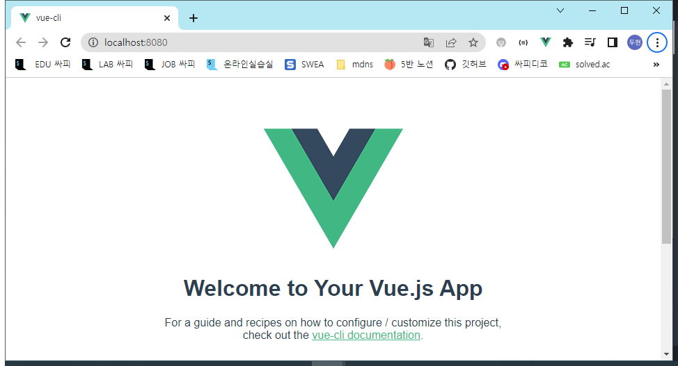

# Vue

## Vue CLI

### Node.js

자바스크립트는 브라우저를 조작하는 유일한 언어

- 하지만 브라우저 밖에서는 구동할 수 없었음

자바스크립트를 구동하기 위한 런타임 환경인 Node.js로 인해 브라우저가 아닌 환경에서도 구동할 수 있게 됨

- Chrome V8 엔진을 제공하여 여러 OS 환경에서 실행할 수 있는 환경을 제공
- Browser만 조작 가능했으나, Server-Side-Programming 또한 가능

#### NPM(Node Package Manage)

자바스크립트 패키지 관리자

- python에 pip, Node.js에는 npm
- 다양한 의존성 패키지를 관리

Node.js의 기본 패키지 관리자

- 다른 패키지 관리자도 있는데 NPM이 가장 거대하다

Node.js 설치시 함께 설치됨

### Vue CLI

Vue 개발을 위한 표준 도구

프로젝트의 구성을 도와주는 역할

확장 플러그인, GUI, Babel 등 다양한 tool 제공

### Vue CLI Quick Start

설치

- git bash로 아무데서나 하면됨 (글로벌)
- 파이썬처럼 가상환경 안하고 함

```bash
$ npm install -g @vue/cli
```

프로젝트 생성

- 이건 vscode terminal에서 진행

- git bash에서 하면 안됨

```bash
$ vue create vue-cli
```

```bas
Vue CLI v5.0.8
? Please pick a preset:
  Default ([Vue 3] babel, eslint) 
  Default ([Vue 2] babel, eslint) 
> Manually select features        
```

인터렉티브 쉘이 나옴

- 깃 배쉬는 이걸 지원하지 않아서 선택이 움직이지 않음
- 그래서 vscode에서 함

선택하고 enter누름

```bash
Vue CLI v5.0.8
? Please pick a preset: Default ([Vue 2] babel, eslint)


Vue CLI v5.0.8
✨  Creating project in C:\Users\multicampus\Desktop\두현\라이브 코드\1102\03_vue
\vue-cli.
⚙️  Installing CLI plugins. This might take a while...


added 847 packages, and audited 848 packages in 16s

91 packages are looking for funding
  run `npm fund` for details

found 0 vulnerabilities
🚀  Invoking generators...
📦  Installing additional dependencies...


added 86 packages, and audited 934 packages in 3s

102 packages are looking for funding
  run `npm fund` for details

found 0 vulnerabilities
⚓  Running completion hooks...

📄  Generating README.md...

🎉  Successfully created project vue-cli.
👉  Get started with the following commands:

 $ cd vue-cli
 $ npm run serve
```

마지막 두줄에 이동하라고 알려줌

폴더가 생기기 때문

```bash
$ npm run serve

> vue-cli@0.1.0 serve
> vue-cli-service serve

 INFO  Starting development server...


 DONE  Compiled successfully in 3416ms                              오전 9:16:10


  App running at:
  - Local:   http://localhost:8080/
  - Network: unavailable

  Note that the development build is not optimized.
  To create a production build, run npm run build.
```

http://localhost:8080/

누르면 페이지 켜짐



ctrl+c를 누르면 서버가 켜짐

- Network는 같은 네트워크에 있다면 모바일로도 접속할 수 있는

### Vue CLI 프로젝트 구조

터미널에 master가 뜬다

- 이미 git init이 되어 있는 상태로 만들어진다는 말
- git 관리중인 폴더 안에 만들면 .git 안생김

#### node_modules


node.js 환경의 여러 의존성 모듈

- 독립이 아니라 의존성이여서 하나라도 빠지면 연쇄적으로 작동안됨

python의 venv와 비슷한 역할을 함

- 따라서 .gitignore에 넣어주어야 하며 Vue 프로젝트를 생성하면 자동으로 추가됨

##### Babel

JavaScript Compiler

자바스크립트의 ES6+ 코드를 구버전으로 번역/변환해주는 도구

자바스크립트의 파편화, 표준화의 영향으로 작성된 코드의 스펙트럼이 매우 다양

- 최신 문법을 사용해도 브라우저의 버전 별로 동작하지 않는 상황이 발생
- 버전에 따른 같은 의미의 다른 코드를 작성하는 등의 대응이 필요해졌고, 이러한 문제를 해결하기 위한 도구
- 원시 코드(최신 버전)를 목적 도구(구 버전)으로 옯기는 번역기가 등장하면서 항상 코드가 특정 브라우저에서 동작하지 않는 상황에 대해 크게 고민하지 않을 수 있게 됨
- 최신 모드로 개발하면 자동으로 변역

###### 동작 예시


##### Webpack


static module bundler

- 모듈 - .js

모듈간의 의존성 문제를 해결하기 위한 도구

- 복잡하게 의존성으로 얽혀있음
- 관리하기 힘들어지는걸 도구를 통해 관리

프로젝트에 필요한 모든 모듈을 매핑하고 내부적으로 종속성 그래프를 빌드함

###### Module

개발하는 애플리케이션의 크기가 커지고 복잡해지면 파일 하나에 모든 기능을 담기가 어려워짐

따라서 자연스럽게 파일을 여러 개로 분리하여 관리를 하게 되었고, 이때 분리된 파일 각각이 모듈(module) 즉, js 파일 하나가 하나의 모듈

모듈은 대개 기능 단위로 분리하며, 클래스 하나 혹은 특정한 목적을 가진 복수의 함수로 구성된 라이브러리 하나로 구성됨

여러 모듈 시스템

- ESM(ECMA Script Module), AMD, CommonJS, UMD

######  Module 의존성 문제

모듈의 수가 많아지고 라이브러리 혹은 모듈 간의 의존성(연결성)이 깊어지면서 특정한 곳에서 발생한 문제가 어떤 모듈 간의 문제인지 파악하기 어려움

Webpack은 이 모듈간의 의존성 문제를 해결하기 위해 등장

###### Bundler

모듈 의존성 문제를 해결해주는 작업이 Bundling

이러한 일을 해주는 도구가 Bundler이고, Webpack은 다양한 Bundler 중 하나

모듈들을 하나로 묶어주고 묶인 파일은 하나 (혹은 어러 개)로 만들어짐

Bundling된 결과물은 개별 모듈의 실행 순서에 영향을 받지 않고 동작하게 됨

snowpack, parcel, rollup.js 등의 webpack 이외에도 다양한 모듈 번들러 존재

Vue CLI는 이러한 Babel, Webpack에 대한 초기 설정이 자동으로 되어있음

###### node_modules의 의존성 깊이


###### static module bundler


의존성을 Webpack이 담당해주므로 개발자는 npm install을 사용해 다양한 모듈을 한번에 설치하고 각 모듈을 사용해 개발에 집중할 수 있음

#### package.json


프로젝트의 종속성 목록과 지원되는 브라우저에 대한 구성 옵션을 포함

#### package-lock.json


node_modules에 설치되는 모듈과 관련된 모든 의존성을 설정 및 관리

협업 및 배포 환경에서 정확히 동일한 종속성을 설치하도록 보장하는 표현

사용할 패키지의 버전을 고정

개발 과정 간의 의존성 패키지 충돌 방지

python의 requirementes.txt 역할

```bash
npm install
```

이거 입력하면 받아짐

우리가 업데이트해야할 것은 없음

##### public/index.html

Vue 앱의 뼈대가 되는 html 파일

Vue 앱과 연결될 요소가 있음

favicon은 로고

spa는 하나의 페이지를 받고 거기에 그려나가는 것 그 하나의 페이지가 여기이다

div.#app 이 있는데 여기에 넣는다

#### src/

##### src/assets

정적 파일을 저장하는 디렉토리

장고에서는 static 폴더

##### src/components

하위 컴포넌트들이 위치

##### src/App.vue

최상의 컴포넌트

public/index.html과 연결됨

- div id="app"과


##### src/main.js

webpack이 빌드를 시작할 때 가장 먼저 불러오는 entry point

public/index.html과 src/App.vue를 연결시키는 작업이 이루어지는 곳

Vue 전역에서 활용할 모듈을 등록할 수 있는 파일

## Component

### Component

UI를 독립적이고 재사용 가능한 조각들로 나눈 것

- 즉, 기능별로 분화한 코드 조각

CS에서는 다시 사용할 수 있는 범용성을 위해 개발된 소프트웨어 구성 요소를 의미

하나의 app을 구성할 때 중첩된 컴포넌트들의 tree로 구성하는 것이 보편적임

- Web시간에 배운 HTML 요소들의 중첩을 떠올려 보자!
  - Body tag를 root node로 하는 tree의 구조이다
    - DOM트리 구조
  - 마찬가지로, Vue에서는 src/App.vue를 root node로 하는 tree의 구조를 가짐

컴포넌트는 유지보수를 쉽게 만들어 줄 뿐만 아니라 재사용성의 측면에서도 매우 강력한 기능을 제공


우리가 사용하는 웹 서비스도 여러 개의 컴포넌트로 이루어져 있음

하나의 컴포넌트를 만들어두면 반복되는 UI를 쉽게 처리할 수 있음

- 기능별로 하나씩 만들어두고 그거 쓸때마다 불러옴


### Django에서의 예시

우리는 base.html과 index.html을 분리하여 작성하였지만 하나의 화면으로 볼 수 있다

- 즉, 한 화면은 여러 개의 컴포넌트로 이루어질 수 있음
- block태그 사용


base.html을 변경하면 이를 extends하는 모든 화면에 영향을 미침

- 유지 보수를 쉽게 해줌

index.html에서 for문을 통해 여러 게시글들을 하나의 형식에 맞추어서 출력해줌

- 형식을 재사용하고 있었음


우리는 자연스럽게 컴포넌트 기반으로 작성하고 있었음

### Component based architecture 특징

관리가 용이

- 유지/보수 비용 감소

재사용성

확장 가능

캡슐화

독립적

### SFC

#### component in Vue

그렇다면 Vue에서 말하는 component란무엇일까

- 이름이 있는 재사용 가능한 Vue instance

그렇다면 Vue instance란?

- 앞서 수업에서 사용한 new Vue()로 만든 인스턴스

#### SFC (Single File Component)

하나의 .vue 파일이 하나의 Vue instance이고, 하나의 컴포넌트이다

- 즉, Single File Component

Vue instance에서는 HTML, CSS, JavaScript 코드를 한번에 관리

- 이 Vue instance를 기능 단위로 작성하는 것이 핵심
  - 하나의 컴포넌트가 여러가지 일을 하도록 하지 않고 하나의 일만 하도록

컴포넌트 기반 개발의 핵심 기능

#### 정리

HTML, CSS, 그리고 JavaScript를 .vue라는 확장자를 가진 파일 안에서 관리하며 개발

이 파일을 Vue instance, 또는 Vue component라고 하며, 기능 단위로 작성

Vue CLI가 Vue를 Component based하게 사용하도록 도와줌

### Vue component

#### Vue component 구조

##### 템플릿(HTML)

```vue
<template>
  <div id="app">
    
    <HelloWorld msg="Welcome to Your Vue.js App"/>
  </div>
</template>
```

HTML의 body 부분

눈으로 보여지는 요소 작성

다른 컴포넌트를 HTML 요소처럼 추가 가능

##### 스크립트(JavaScript)

```vue
<script>
import HelloWorld from './components/HelloWorld.vue'

export default {
  name: 'App',
  components: {
    HelloWorld
  }
}
</script>
```

JavaScript 코드가 작성되는 곳

컴포넌트 정보, 데이터, 메서드 등 Vue 인스턴스를 구성하는 대부분이 작성 됨

const app = new Vue() 안쓰고 이 자체가 인스턴스

##### 스타일(CSS)

CSS가 작성되며 컴포넌트의 스타일을 담당

```vue
<style>
#app {
  font-family: Avenir, Helvetica, Arial, sans-serif;
  -webkit-font-smoothing: antialiased;
  -moz-osx-font-smoothing: grayscale;
  text-align: center;
  color: #2c3e50;
  margin-top: 60px;
}
</style>
```

##### 정리

컴포넌트들이 tree 구조를 이루어 하나의 페이지를 만듦

root에 해당하는 최상단의 component가 App.vue

이 App.vue를 index.html과 연결

결국 index.html 파일 하나만을 rendering

- 이게 바로 SPA

#### 실습

##### 현재 구조

Vue CLI를 실행하며 이미 HellWorld.vue라는 컴포넌트가 생성되어 있고 App.vue에 등록되어 사용되고 있음

- npm run serve 명령어를 진행했을 때 나온 회면의 대부분이 HelloWorld.vue


```vue
// App.vue
<template>
  <div id="app">
    
    <HelloWorld msg="Welcome to Your Vue.js App"/>
  </div>
</template>
```

##### MyComponent.vue

이름은 대문자 카멜케이스

1. src/components/ 안에 생성

   vue하고 자동완성 엔터 누르면 자동완성 뜬다

   ```vue
   <template>
     
   </template>
   
   <script>
   export default {
   
   }
   </script>
   
   <style>
   
   </style>
   ```

   

2. script에 이름 등록

   ```vue
   <script>
   export default {
   
   }
   </script>
   ```

   안에 

   ```vue
     name: "MyComponent",
   ```

   추가함

   이름을 지어줘야 다른 컴퍼넌트에서 가져갈 수 있음

3. template에 요소 추가

   ```vue
   <template>
     
   </template>
   ```

   안에

   ```vue
     <div>
       <h1>이거는 내가 만든 새로운 컴포넌트다!</h1>    
     </div>
   ```

   추가

- 주의 templates 안에는 반드시 하나의 요소만 추가 가능
  - 비어 있어도 안됨
  - 해당 요소 안에 추가 요소를 작성해야 함
- 실제로는 div에서부터 렌더링 template태그는 html영역표시이고 렌더링과는 연관없다

##### component 등록 3단계

1. 불러오기
2. 등록하기
3. 보여주기

###### 불러오기

`import {instance name} from {위치}`

instance name은 instance 생성시 작성한 name

@은 src의 shortcut

.vue 생략가능

App.vue

스크립트 맨위에

```vue
import MyComponent from './components/MyComponent.vue'
```

추가

```vue
import MyComponent from '@/components/MyComponent'
```

줄이면 이렇게 씀

###### 등록하기

```vue
...
export default {
  name: 'App',
  components: {
    HelloWorld,
  }
}
...
```

안에

```vue
    MyComponent,
```

추가

###### 보여주기

템플릿에

```vue
<template>
  <div id="app">
    
    <HelloWorld msg="Welcome to Your Vue.js App"/>
  </div>
</template>
...
```

```vue
    <MyComponent/>
```

추가

최종

```vue
<template>
  <div id="app">
    
    <MyComponent/>
    <HelloWorld msg="Welcome to Your Vue.js App"/>
  </div>
</template>

<script>
import HelloWorld from './components/HelloWorld.vue'
import MyComponent from '@/components/MyComponent'

export default {
  name: 'App',
  components: {
    HelloWorld,
    MyComponent,
  }
}
</script>

<style>
#app {
  font-family: Avenir, Helvetica, Arial, sans-serif;
  -webkit-font-smoothing: antialiased;
  -moz-osx-font-smoothing: grayscale;
  text-align: center;
  color: #2c3e50;
  margin-top: 60px;
}
</style>
```


수정했을 때 vue 파일 저장만 하면 페이지 새로고침 안하고 바로 변경됨

스타일 주기

```vue
<style>

</style>
```

에

```vue
  .border {
    border: solid 1px balck;
  }
```

추가

템플릿

div에

```vue
  <div class="border">
    <h1>이거는 내가 만든 새로운 컴포넌트다!</h1>
  </div>
```

클래스 추가


##### 하위 컴포넌트 만들기

MyComponentItem.vue 만들고

```vue
<template>
  
</template>

<script>
export default {

}
</script>

<style>

</style>
```

###### 이름 설정

이름 달라도 되긴 한데 굳이 다르게 할 필요 없음

```vue
  name: "MyComponentItem",
```

###### 작성

템플릿에

```vue
  <div>
    <h3>나는 MyComponent의 하위 컴포넌트다</h3>
  </div>
```

넣음

###### 불러오기

MyComponent에

```vue
import MyComponentItem from '@/components/MyComponentItem'
```

넣고

###### 등록하기

```vue
export default {
  name: "MyComponent",

}
```

안에

```vue
  components: {
    MyComponentItem,
  }
```

추가


등록하고 안쓰면 이런거 뜸

###### 보여주기

템플릿에

```vue
    <MyComponentItem/>
```

넣기

최종

```vue
<template>
  <div class="border">
    <h1>이거는 내가 만든 새로운 컴포넌트다!</h1>
    <MyComponentItem/>
  </div>
</template>

<script>
// 1. 불러오기

import MyComponentItem from '@/components/MyComponentItem'
export default {
  name: "MyComponent",
  components: {
    // 2. 등록하기
    MyComponentItem,
  }
}
</script>


<style>
  .border {
    border: solid 1px black;
  }
</style>
```


vue 장점-재사용성

재사용은 그냥 복사하면 됨

```vue
<template>
  <div class="border">
    <h1>이거는 내가 만든 새로운 컴포넌트다!</h1>
    <MyComponentItem/>
    <MyComponentItem/>
    <MyComponentItem/>
  </div>
</template>
```

면


#### component 이름 스타일 가이드

##### 싱글 파일 컴포넌트 이름 규칙 지정

우선순위 B

파스칼케이스를 항상 쓰거나 케밥을 쓸거면 항상 케밥을 써라

##### 베이스 컴포넌트 이름

우선순위 B

베이스 역할하면 Base붙여라 

##### 싱글 인스턴스 컴포넌트 이름

단독으로 쓰는 애들은 파일명 앞에 The를 붙여라

어딘가에 하위로 쓰이는게 아니라 단독으로 쓰는 경우

##### 강한 연관성을 가진 컴포넌트 이름

강한 연관성을 가지고 있으면

요소로 쓰이는 컴포넌트, 하위 컴포넌트들은 상위 컴포넌트들의 이름을 이어가야 함

ex) 

Mycomponent.vue

MyComponentItem.vue

## Pass Props & Emit Events

### Data in components

우리는 정적 웹페이지가 아닌, 동적 웹페이지를 만들고 있음

- 즉, 웹페이지에서 다뤄야 할 데이터가 등장
- User data, 게시글, data, 등등···

한 페이지 내에서 같은 데이터를 공유해야 함

- 하지만 페이지들은 component로 구분이 되어 있음

상위 컴포넌트에서 정의된 데이터들을 하위 컴포넌트로 어떻게 보낼 수 있을까

하위 컴포넌트에도 똑같은 data를 정의?

- 상위 컴포넌트의 data와 하위 컴포넌트의 데이터가 동일한 data가 맞는가?

- 상위 컴포넌트의 data가 변경된다면 하위 컴포넌트의 data도 같이 변경이 될까

  ->아니다

- 각 Component는 독립적이므로 서로 다른 data를 가지게 됨
- 그렇다면 완전히 동일한 data를 서로 다른 Component에서 보여주려면 어떻게 해야할까

필요한 컴포넌트들끼리 데이터를 주고받으면 될까?

- 데이터의 흐름을 파악하기 힘듦

- 개발 속도 저하

- 유지보수 난이도 증가

컴포넌트는 부모-자식 관계를 가지고 있으므로 부모-자식 관계만 데이터를 주고받게 하자

- 다른 줄기의 컴포넌트는 바로 보낼 수 없도록
- 데이터의 흐름을 파악하기 용이
- 유지 보수하기 쉬워짐

### pass props & emit event

부모->자식으로의 데이터의 흐름

- pass props의 방식

자식->부모로의 데이터의 흐름

- emit event의 방식
- 이벤트 발생

### Pass Props

#### Pass Props - 1

요소의 속성(property)을 사용하여 데이터 전달

props는 부모(상위) 컴포넌트의 정보를 전달하기 위한 사용자 지정 특성

자식(하위) 컴포넌트는 props 옵션을 사용하여 수신하는 props를 명시적으로 선언해야 함

- 이걸 쓰겠다

#### props in HelloWorld

App .vue

```vue
    <HelloWorld msg="Welcome to Your Vue.js App"/>
```

이렇게 msg 보내줌

HelloWorld.vue

이렇게 받아서 씀


```vue
<script>
export default {
  name: 'HelloWorld',
  props: {
    msg: String
  }
}
</script>
```

이렇게 출력됨


static props 정적인 프롭스라고 함

##### 정리

App.vue의 `<HelloWorld/>` 요소에 msg="~"라는 property를 설정하였고, 하위 컴포넌트인 HelloWorld는 자신에게 부여된 msg property를 template에서 {{ msg }}의 형태로 사용한 것

App.vue에서 변경하면 하위 컴퍼넌트 요소가 바뀜

#### Pass Props - 2

이렇게 부모->자식으로의 data 전달 방식을 pass props라고 함

정적인 데이터를 전달하는 경우 static props라고 명시하기도 함

요소의 속성을 작성하듯이 사용 가능하며, prop-data-name"value"의 형태로 데이터를 전달

- 이때 속성의 키 값은 kebab-case를 사용
  - html의 속성값에 쓰는데 html은 대소문자 구분 못함
- 자바스크립트에서 받을때는 카멜케이스로(하이픈뒤의 글자가 대문자인)

Prop 명시

데이터를 받는 쪽, 즉 하위 컴포넌트에서도 props에 대해 명시적으로 작성해주어야 함

전달받은 props를 type과 함께 명시

컴포넌트를 문서화할 뿐만 아니라, 잘못된 타입이 전달하는 경우 브라우저의 자바스크립트 콘솔에서 사용자에게 경고

https://v2.vuejs.org/v2/guide/components-props.html#Prop-Validation

#### 실습

MyComponent.vue에서 MyComponentItem.vue로 넘기기

MyComponent.vue

```vue
    <MyComponentItem/>
```

에

```vue
    <MyComponentItem static-props="MyComponent에서 보낸 데이터"/>
```

MyComponentItem.vue

일단 어떤 데이터를 받았는지 선언

```vue
<script>
export default {
  name: "MyComponentItem",

}
</script>
```

안에

```vue
  props: {
    staticProps: String,
  }
```

출력하기

템플릿에

```vue
    <p>{{ staticProps }}</p>
```


#### Pass Props convention

부모에서 넘겨주는 props

- kebab-case
  - HTML 속성명은 대소문자를 구분하지 않기 때문

자식에서 받는 props

- camelCase

부모 템플릿(html)에서 kebab-case로 넘긴 변수를 자식의 스크립트(vue)에서 자동으로 camelCase로 변환하여 인식을 한다

#### Dynamic props

변수를 props로 전달할 수 있음

그냥 문자열이 아니라 자바스크립트 변수, 표현식, 메소드

v-bind directive를 사용해 데이터를 동적으로 바인딩

- `:`나 v-bind쓰면 문자열 대신 data에 있는 그 이름의 변수를 쓰는것

부모 컴포넌트의 데이터가 업데이트 되면 자식 컴포넌트로 전달되는 데이터 또한 업데이트 됨

##### 실습

Mycomponent.vue

```vue
export default {
  name: "MyComponent",
  
  components: {
    // 2. 등록하기
    MyComponentItem,
  }
}
```

여기에 data를 넣어주는데 함수의 리턴 객체로 해줘야 함

- 이름 공간때문

```vue
  data: function () {
    return {
      
    }
  },
```

```vue
      dynamicProps: '이건 동적인 데이터'
```

넣어줌

```vue
    <MyComponentItem
      static-props="MyComponent에서 보낸 데이터"

    />
```

여기에 

```vue
      :dynamic-props="dynamicProps"
```

넣어줌

최종

MyComponent.vue

```vue
<template>
  <div class="border">
    <h1>이거는 내가 만든 새로운 컴포넌트다!</h1>
    <MyComponentItem
      static-props="MyComponent에서 보낸 데이터"
      :dynamic-props="dynamicProps"
    />
  </div>
</template>

<script>
// 1. 불러오기

import MyComponentItem from '@/components/MyComponentItem'
export default {
  name: "MyComponent",
  data: function () {
    return {
      dynamicProps: '이건 동적인 데이터'
    }
  },
  components: {
    // 2. 등록하기
    MyComponentItem,
  }
}
</script>


<style>
  .border {
    border: solid 1px black;
  }
</style>
```

MyComponentItem.vue

```vue
export default {
  name: "MyComponentItem",
  props: {
    staticProps: String,

  }
}
```

먼저 선언하기 위해

```vue
    dynamicProps: String,
```

추가

템플릿에

```vue
    <p>{{ dynamicProps }}</p>
```

추가

최종

MyComponentItem.vue

```vue
<template>
  <div>
    <h3>나는 MyComponent의 하위 컴포넌트다</h3>
    <p>{{ staticProps }}</p>
    <p>{{ dynamicProps }}</p>
  </div>
</template>

<script>
export default {
  name: "MyComponentItem",
  props: {
    staticProps: String,
    dynamicProps: String,
  }
}
</script>

<style>

</style>
```


###### 컴포넌트의 data 함수

각 vue 인스턴스는 같은 data 객체를 공유하므로 새로운 data객체를 반환(return)해서 사용해야 함

https://v2.vuejs.org/v2/guide/components.html#data-Must-Be-a-Function

#### Pass Props - 3

:dynamic-props="dynamicProps"는 앞의 key값(dynamic-props)이란 이름으로 뒤에 ""안에 오는 데이터(dynamicProps)를 전달하겠다는 뜻

즉, :my-props="dynamicProps"로 데이터를 넘긴다면, 자식 컴포넌트에서 myProps로 데이터를 받아야 함

v-bind로 묶여있는 ""안의 구문은 javascript의 구문으로 볼 수 있음

- 따라서 dynamicProps라고 하는 변수에 대한 data를 전달할 수 있는것

그렇다면, 숫자를 props로 전달하기 위해서 다음 두 방법 중 어떤 게 맞을까?

```vue
// 1
<SomeComponent num-props="1"/>

//2
<SomeComponent :num-props="1",>
```

첫번째 방식은 static props로 string으로서의 "1"을 전달

두번째 방식은 dynamic props로 숫자로서의 1을 전달

#### 단방향 데이터 흐름

모든 props는 부모에서 자식으로 즉 아래로 단방향 바인딩을 형성

부모 속성이 업데이트되면 자식으로 흐르지만 반대 방향은 아님

- 부모 컴포넌트가 업데이트될 때마다 자식 컴포넌트의 모든 prop들이 최신 값으로 새로고침 됨

목적

- 하위 컴포넌트가 실수로 상위 컴포넌트 상태를 변경하여 앱의 데이터를 이해하기 힘들게 만드는 것을 방지
  - 다른 하위 컴포넌트에 영향
  - 유지보수가 어려워짐
- 위에서 아래로만 하면 위로만 추적하면 됨

하위 컴포넌트에서 prop를 변경하려고 시도해서는 안되며 그렇게 하면 Vue는 콘솔에서 경고를 출력함

그래서 올리려면 event를 알림

### Emit Event

#### Emit Event

부모 컴포넌트에서 자식 컴포넌트로 데이터를 전달할 때는 이벤트를 발생시킴

이벤트를 발생시키는 게 어떻게 데이터를 전달하는 것이냐?

1. 데이터를 이벤트 리스너의 콜백함수의 인자로 전달
2. 상위 컴포넌트는 해당 이벤트를 통해 데이터를 받음

#### $emit

$emit 메서드를 통해 부모 컴포넌트에 이벤트를 발생

- $emit('event-name') 형식으로 사용하며 부모 컴포넌트에 event-name이라는 이벤트가 발생했다는 것을 알림
  - 첫번째 인자 이벤트 이름
  - javascript는 변수에 _, $ 두개의 특수문자를 사용 가능
  - 이때, 기존에 사용하던 변수, 메서드들과 겹치지 않게 하기 위해서 vue는 $emit를 이벤트 전달을 쓰였다
- 마치 사용자가 마우스 클릭을 하면 click 이벤트가 발생하는 것처럼 $emit('event-name')가 실행되면 event-name 이벤트가 발생하는것

#### 실습

MyComponentItem.vue

이벤트 만들기

템플릿에

```vue
    <button @click="childToParent">클릭!</button>
```

스크립트에

메쏘드

```vue
methods: {
    childToParent: function () {
      this.$emit('child-to-parent')    
    }
  },
```

$는 기본 속성값이라는 뜻

케밥으로 하는건 받는쪽이 html이여서

점프는 못하고 한단계씩

최종

MyComponentItem.vue

```vue
<template>
  <div>
    <h3>나는 MyComponent의 하위 컴포넌트다</h3>
    <p>{{ staticProps }}</p>
    <p>{{ dynamicProps }}</p>
    <button @click="childToParent">클릭!</button>
  </div>
</template>

<script>
export default {
  name: "MyComponentItem",
  props: {
    staticProps: String,
    dynamicProps: String,
  },
  methods: {
    childToParent: function () {
      this.$emit('child-to-parent')
    }
  },
}
</script>

<style>

</style>
```

MyComponent.vue

템플릿

```vue
    <MyComponentItem
      static-props="MyComponent에서 보낸 데이터"
      :dynamic-props="dynamicProps"

    />
```

에

```vue
      @child-to-parent="parentGetEvent"
```

자식에서 저 이벤트가 발생하면 parentGetEvent라는 이벤트를 발생시키겠다

추가

스크립트 메쏘드에 

```vue
  methods : {
    parentGetEvent:function () {
      console.log('자식 컴포넌트에서 발생한 emit 이벤트를 들었다')
    }
  },
```

추가

최종 MyComponent.vue

```vue
<template>
  <div class="border">
    <h1>이거는 내가 만든 새로운 컴포넌트다!</h1>
    <MyComponentItem
      static-props="MyComponent에서 보낸 데이터"
      :dynamic-props="dynamicProps"
      @child-to-parent="parentGetEvent"
    />
  </div>
</template>

<script>
// 1. 불러오기

import MyComponentItem from '@/components/MyComponentItem'
export default {
  name: "MyComponent",
  data: function () {
    return {
      dynamicProps: '이건 동적인 데이터'
    }
  },
  methods : {
    parentGetEvent:function () {
      console.log('자식 컴포넌트에서 발생한 emit 이벤트를 들었다')
    }
  },
  components: {
    // 2. 등록하기
    MyComponentItem,
  }
}
</script>


<style>
  .border {
    border: solid 1px black;
  }
</style>
```

버튼 클릭하면


#### Emit Event 흐름 정리

1. 자식 컴포넌트에 있는 버튼 클릭 이벤트를 청취하여 연결된 핸들러 함수(childToParent)호출
2. 호출된 함수에서 $emit을 통해 상위 컴포넌트에 이벤트(child-to-parent)발생
3. 상위 컴포넌트는 자식 컴포넌트가 발생시킨 이벤트(child-to-parent)를 청취하여 연결된 핸들러 함수(parentGetEvent) 호출
   - v-on으로 들음

#### emit with data

##### 실습

두단계 올리려면 두단계로 이걸 하면됨

이걸 이용해서 어떻게 데이터를 올리느냐

MyComponentItem.vue

이벤트를 발생(emit)시킬 때 인자로 데이터를 전달 가능

- $emit의 두번째 인자로 보낸다

```vue
methods: {
    childToParent: function () {
      this.$emit('child-to-parent')
    }
  },
```

에서

```vue
      this.$emit('child-to-parent', '나는 자식이 보낸 데이터다')
```

MyComponent.vue

이렇게 전달한 데이터는 이벤트와 연결된 부모 컴포넌트의 핸들러 함수의 인자로 사용 가능

- 여기서 parentGetEvent함수의 인자를 넣으면 그게 그 받은 데이터가됨

부모 

```vue
  methods : {
    parentGetEvent:function (childData) {
      console.log('자식 컴포넌트에서 발생한 emit 이벤트를 들었다')
      console.log(childData)
    }
  },
```

최종

MyComponentItem.vue

```vue
<template>
  <div>
    <h3>나는 MyComponent의 하위 컴포넌트다</h3>
    <p>{{ staticProps }}</p>
    <p>{{ dynamicProps }}</p>
    <button @click="childToParent">클릭!</button>
  </div>
</template>

<script>
export default {
  name: "MyComponentItem",
  props: {
    staticProps: String,
    dynamicProps: String,
  },
  methods: {
    childToParent: function () {
      this.$emit('child-to-parent', '나는 자식이 보낸 데이터다')
    }
  },
}
</script>

<style>

</style>
```

MyComponent.vue

```vue
<template>
  <div class="border">
    <h1>이거는 내가 만든 새로운 컴포넌트다!</h1>
    <MyComponentItem
      static-props="MyComponent에서 보낸 데이터"
      :dynamic-props="dynamicProps"
      @child-to-parent="parentGetEvent"
    />
  </div>
</template>

<script>
// 1. 불러오기

import MyComponentItem from '@/components/MyComponentItem'
export default {
  name: "MyComponent",
  data: function () {
    return {
      dynamicProps: '이건 동적인 데이터'
    }
  },
  methods : {
    parentGetEvent:function (childData) {
      console.log('자식 컴포넌트에서 발생한 emit 이벤트를 들었다')
      console.log(childData)
    }
  },
  components: {
    // 2. 등록하기
    MyComponentItem,
  }
}
</script>


<style>
  .border {
    border: solid 1px black;
  }
</style>
```


##### 흐름 정리

1. 자식 컴포넌트에 있는 버튼 클릭 이벤트를 청취하여 연결된 핸들러 함수(childToParent)호출
2. 호출된 함수에서 $emit을 통해 상위 컴포넌트에 이벤트(child-to-parent)발생
   - 이벤트에 데이터(child data)를 함께 전달
3. 부모 컴포넌트는 자식 컴포넌트의 이벤트(child-to-parent)를 청취하여 연결된 핸들러 함수(parentGetEvent) 호출, 함수의 인자로 전달된 데이터(child data)가 포함되어 있음

4. 호출된 함수에서 console.log(`~child data~`)실행

#### emit with dynamic data

pass props와 마찬가지로 동적인 데이터도 전달 가능

자식 컴포넌트에서 입력받은 데이터를 부모 컴포넌트에게 전달하여 출력해보자

##### 실습

MyComponentItem.vue

템플릿에 v-model쓴 input태그 추가

```vue
    <input type="text" v-model="childInputData">
```

여기 입력한것 스크립트에 저장

데이타에

```vue
  data: function () {
    return {
      childInputData: null
    }
```


v-model 작동 확인

인풋태그에 이벤트 설정

```vue
    <input
      type="text"
      v-model="childInputData"
      @keyup.enter="childInput"  
    >
```

그 이벤트는 childInputData를 올리는 이벤트

```vue
    childInput: function () {
      this.$emit('child-input', this.childInputData)
      this.childInputData = null
    },
```

MyComponent.vue

템플릿에

```vue
      @child-input="getDynamicData"
```

추가 

이 이름의 메소드 아래에 추가

```vue
    getDynamicData: function (childInputData) {
      console.log(`사용자가 입력한 값은 ${childInputData}입니다.`)
    }
```

최종

MyComponentItem.vue

```vue
<template>
  <div>
    <h3>나는 MyComponent의 하위 컴포넌트다</h3>
    <p>{{ staticProps }}</p>
    <p>{{ dynamicProps }}</p>
    <button @click="childToParent">클릭!</button>
    <input
      type="text"
      v-model="childInputData"
      @keyup.enter="childInput"  
    >
  </div>
</template>

<script>
export default {
  name: "MyComponentItem",
  props: {
    staticProps: String,
    dynamicProps: String,
  },
  data: function () {
    return {
      childInputData: null,
    }
  },
  methods: {
    childToParent: function () {
      this.$emit('child-to-parent', '나는 자식이 보낸 데이터다')
    },
    childInput: function () {
      this.$emit('child-input', this.childInputData)
      this.childInputData = null        
    },
  },
}
</script>

<style>

</style>
```

MyComponent.vue

```vue
<template>
  <div class="border">
    <h1>이거는 내가 만든 새로운 컴포넌트다!</h1>
    <MyComponentItem
      static-props="MyComponent에서 보낸 데이터"
      :dynamic-props="dynamicProps"
      @child-to-parent="parentGetEvent"
      @child-input="getDynamicData"
    />
  </div>
</template>

<script>
// 1. 불러오기

import MyComponentItem from '@/components/MyComponentItem'
export default {
  name: "MyComponent",
  data: function () {
    return {
      dynamicProps: '이건 동적인 데이터'
    }
  },
  methods : {
    parentGetEvent:function (childData) {
      console.log('자식 컴포넌트에서 발생한 emit 이벤트를 들었다')
      console.log(childData)
    },
    getDynamicData: function (childInputData) {
      console.log(`사용자가 입력한 값은 ${childInputData}입니다.`)
    }
  },
  components: {
    // 2. 등록하기
    MyComponentItem,
  }
}
</script>


<style>
  .border {
    border: solid 1px black;
  }
</style>
```


#### 정리

자식 컴포넌트에서 부모 컴포넌트로 이벤트를 발생시킴

- 이벤트에 데이터를 담아 전달 가능

부모 컴포넌트의 이벤트를 청취

- 전달받은 데이터는 이벤트 핸들러 함수의 인자로 사용

### pass props / emit event 컨벤션

아니 그래서 언제는 kebab-case고 언제는 camelCase야?

- HTML 요소에서 사용할 때는 kebab-case
- JavaScript에서 사용할때는 camelCase

props

- 상위->하위 흐름에서 HTML 요소로 내려줌 : kebab-case
- 하위에서 받을 때 JavaScript에서 받음: camelCase

emit

- emit 이벤트를 발생시키면 HTML 요소가 이벤트를 청취함 : kebab-case'
  - 처음에 자바스크립트에 쓰는거라 이거 좀 헷갈릴 수 있음
  - 받는 쪽이 중요한데 HTML로 받기 때문에 케밥
- 메서드, 변수명 등은 JavaScript에서 사용함: camelCase

### to-do 생성 삭제 실습

```bash
$ vue create vue-cli-todo-practice
```

```bash
$ cd vue-cli-todo-practice
$ npm run serve
```


3개 만들어야 함

로고, helloworld랑 기본 스타일 스크립트 다 지움

TodoFrom.vue 만들고 기본 양식

```vue
<template>
  
</template>

<script>
export default {

}
</script>

<style>

</style>
```

이름

```vue
<template>
  <div>
    <h1>TodoForm</h1>
  </div>
</template>

<script>
export default {
  name: 'TodoForm',
}
</script>

<style>

</style>
```

앱에 등록

3단계 불러오고 등록하고 사용하기

App.vue

```vue
<template>
  <div id="app">
    <TodoForm/>
  </div>
</template>

<script>
import TodoForm from '@/components/TodoForm'

export default {
  name: 'App',
  components: {
    TodoForm,
  }
}
</script>
<style>

</style>
```


TodoList.vue 만들고 이름

```vue
<template>
  <div>
    <h1>TodoList</h1>
  </div>
</template>

<script>
export default {
  name: 'TodoList'
}
</script>

<style>

</style>
```

App.vue

3단계 불러오고 등록하고 사용하고

```vue
<template>
  <div id="app">
    <TodoList/>
    <TodoForm/>
  </div>
</template>

<script>
import TodoForm from '@/components/TodoForm'
import TodoList from '@/components/TodoList'

export default {
  name: 'App',
  components: {
    TodoForm,
    TodoList,
  }
}
</script>
<style>

</style>
```

TodoListItem.vue

컴포넌트 만들기

TodoList의 하위 컴포넌트라 이름

TodoListItem.vue

```vue
<template>
  <div>
    <h3>TodoListItem</h3>
  </div>
</template>

<script>
export default {
  name: 'TodoListItem',
}
</script>

<style>

</style>
```

이제 TodoList에 등록

TodoList.vue

3단계

```vue
<template>
  <div>
    <h1>TodoList</h1>      
    <TodoListItem/>
  </div>
</template>

<script>
import TodoListItem from '@/components/TodoListItem'

export default {
  name: 'TodoList',
  components: {
    TodoListItem,
  }
}
</script>

<style>

</style>
```


Todo리스트의 목록에 들어갈 데이터 들어갈 위치

App.vue에 넣기

스크립트에 데이터 넣기

```vue
data: function () {
    return {
      todos: [
        {
          title: '할 일',
        }
      ]
    }
  }
```

이게 TodoList.vue까지 내리면 됨

그 요소들을 TodoListItem에 반복

템플릿 TodoList 태그에 넣어줘서 보내줌

```vue
    <TodoList :todos="todos"/>
```

TodoList에 출력

최종

App.vue

```vue
<template>
  <div id="app">
    <TodoList :todos="todos"/>
    <TodoForm/>
  </div>
</template>

<script>
import TodoForm from '@/components/TodoForm'
import TodoList from '@/components/TodoList'

export default {
  name: 'App',
  components: {
    TodoForm,
    TodoList,
  },
  data: function () {
    return {
      todos: [
        {
          title: '할 일',
        }
      ]
    }
  },
}
</script>
<style>

</style>
```


TodoList.vue

props 추가

```vue
  props: {
    todos: Array,
  }
```

템플렛에 변수 넣기

```vue
    {{ todos }}
```

TodoList.vue 최종

```vue
<template>
  <div>
    <h1>TodoList</h1>
    {{ todos }}
    <TodoListItem/>
  </div>
</template>

<script>
import TodoListItem from '@/components/TodoListItem'

export default {
  name: 'TodoList',
  components: {
    TodoListItem,
  },
  props: {
    todos: Array,
  }
}
</script>

<style>

</style>
```


TodoList.vue

템플릿에 ul태그 만들고 TodoListItem 태그랑 todo 데이터 넣기

```vue
    <ul v-for="(todo, index) in todos" :key="index">
      <TodoListItem :todo="todo"/>
    </ul>
```

반복되는 하나하나를 내려줌

최종

```vue
<template>
  <div>
    <ul v-for="(todo, index) in todos" :key="index">
      <TodoListItem :todo="todo"/>
    </ul>
  </div>
</template>

<script>
import TodoListItem from '@/components/TodoListItem'

export default {
  name: 'TodoList',
  components: {
    TodoListItem,
  },
  props: {
    todos: Array,
  },
}
</script>

<style>

</style>
```

TodoListItem.vue

위에서 보낸 todo 스크립 props에 type이랑 받아줌

```vue
  props: {
    todo: Object
  }
```

템플릿에

li태그로 넣어줌

```vue
  <li>
    {{ todo.title }}
  </li>
```

최종

```vue
<template>
  <li>
    {{ todo.title }}
  </li>
</template>

<script>
export default {
  name: 'TodoListItem',
  props: {
    todo: Object
  }
}
</script>

<style>

</style>
```


이제 기능 구현

사용자 입력 받는 부분은 TodoForm.vue

거기서 받아서 이벤트 발생시켜서 App.vue에서 받아서 todos 배열에 저장

그러면 자연스럽게 todolist와 todolistitem에 보내는 정보가 동기화

TodoForm.vue

템플릿에 input태그

```vue
    <input type="text">
```

실시간으로 데이터 받도록 data 넣고

```vue
  data: function () {
    return {
      todoTitle: null,
    }
  },
```

 v-model 태그 넣어서 input태그랑  todotitle양방향 바인딩

```vue
  <div>
    <input
      type="text"
      v-model="todoTitle"
    >
  </div>
```

인풋에 데이터 넣고 엔터 쳤을때의 이벤트 만들어서그 데이터 상위 컴포넌트로 보내줌

```vue
  <div>
    <input
      type="text"
      v-model="todoTitle"
      @keyup.enter="createTodo"
    >
  </div>
```

```vue
  methods: {
    createTodo: function () {
      this.$emit('create-todo', this.todoTitle)
      this.todoTitle = null
    }
  },
```


vue dev tools의 타임라인 component event에서 동작 확인

App.vue

TodoForm태그에 @추가해서 이벤트 받고 

받으면 이제 만들 createTodo 메소드 실행하도록 함

```vue
    <TodoForm @create-todo="createTodo"/>
```

메소드는 배열에 추가하는것

```vue
  methods: {
    createTodo: function (todoTitle) {
    }
  }
```

object로 받아야 하기 때문에 받은것 object로 만듬 

```vue
  methods: {
    createTodo: function (todoTitle) {
      const todo = {
        title: todoTitle
      }
      this.todos.push(todo)
    }
  }
```

아까 예시로 넣은 todo 데이터 지우고 빈 리스트로 만듬

```vue
  data: function () {
    return {
      todos: [],
    }
  },
```

최종

```vue
<template>
  <div id="app">
    <TodoList :todos="todos"/>
    <TodoForm @create-todo="createTodo"/>
  </div>
</template>

<script>
import TodoForm from '@/components/TodoForm'
import TodoList from '@/components/TodoList'

export default {
  name: 'App',
  components: {
    TodoForm,
    TodoList,
  },
  data: function () {
    return {
      todos: [],
    }
  },
  methods: {
    createTodo: function (todoTitle) {
      const todo = {
        title: todoTitle
      }
      this.todos.push(todo)
    }
  }
}
</script>
<style>

</style>
```


삭제 버튼

버튼은 TodoListItem인데 지우는건 App임

삭제를 외치면 2단계 emit으로 외쳐서 마지막에 app에서 삭제함

`TodoListItem.vue`

X버튼 만들고 클릭됐을 때 deleteTodo메소드 실행되도록

```vue
    <button @click="deleteTodo">X</button>
```

이 메소드는 삭제를 하는게 아니라 이 버튼이 눌렸다고 전달만 함

이때 어떤 todo에 눌렸는지 전달하는 것이 중요함

```vue
  methods: {
    deleteTodo: function () {
      this.$emit('delete-todo', this.todo)
    }
  },
```

일단 TodoList에서 외침을 듣기

`TodoList.vue`

TodoListItem태그에 @들어서 deleteTodo메소드 실행시킴

```vue
      <TodoListItem :todo="todo" @delete-todo="deleteTodo"/>
```

이 메소드는 그냥 고대로 다시 위로 올려보내는 메소드임

```vue
  methods: {
    deleteTodo: function (todo) {
      this.$emit('delete-todo', todo)
    }
  },
```

최종

```vue
<template>
  <div>
    <ul v-for="(todo, index) in todos" :key="index">
      <TodoListItem :todo="todo" @delete-todo="deleteTodo"/>
    </ul>
  </div>
</template>

<script>
import TodoListItem from '@/components/TodoListItem'

export default {
  name: 'TodoList',
  components: {
    TodoListItem,
  },
  props: {
    todos: Array,
  },
  methods: {
    deleteTodo: function (todo) {
      this.$emit('delete-todo', todo)
    }
  },
}
</script>

<style>

</style>
```

App.vue

여기서 또 들어서 이제 삭제하면 됨

TodoList태그에 추가

```vue
    <TodoList :todos="todos" @delete-todo="deleteTodo"/>
```

그리고 삭제하는 메소드

먼저 올라온 todo가 todos중에 몇번째 인덱스인지 찾음

그 인덱스 삭제하고 새로운 배열 다시 만들기

```vue
  methods: {
	...
    deleteTodo: function (todo) {
      const index = this.todos.indexOf(todo)
      this.todos.splice(index, 1)
    }
  }
```

최종

```vue
<template>
  <div id="app">
    <TodoList :todos="todos" @delete-todo="deleteTodo"/>
    <TodoForm @create-todo="createTodo"/>
  </div>
</template>

<script>
import TodoForm from '@/components/TodoForm'
import TodoList from '@/components/TodoList'

export default {
  name: 'App',
  components: {
    TodoForm,
    TodoList,
  },
  data: function () {
    return {
      todos: [],
    }
  },
  methods: {
    createTodo: function (todoTitle) {
      const todo = {
        title: todoTitle
      }
      this.todos.push(todo)
    },
    deleteTodo: function (todo) {
      const index = this.todos.indexOf(todo)
      this.todos.splice(index, 1)
    }
  }
}
</script>
<style>

</style>
```


올린것

- TodoForm에서 작성한것 올림
- TodoListItem에서 삭제하자는것 두번 올림

내리는것

- 앱에서 Todolist로 배열 내려주고
- Todolist에서 하나씩 객체로 내려줌

## 마무리

1. Vue CLI
2. SFC
3. Pass Props & Emit Events