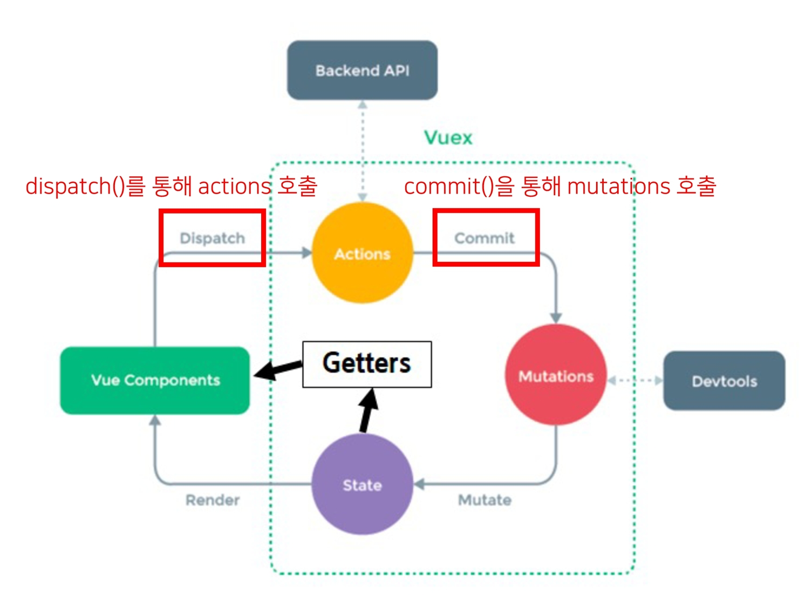
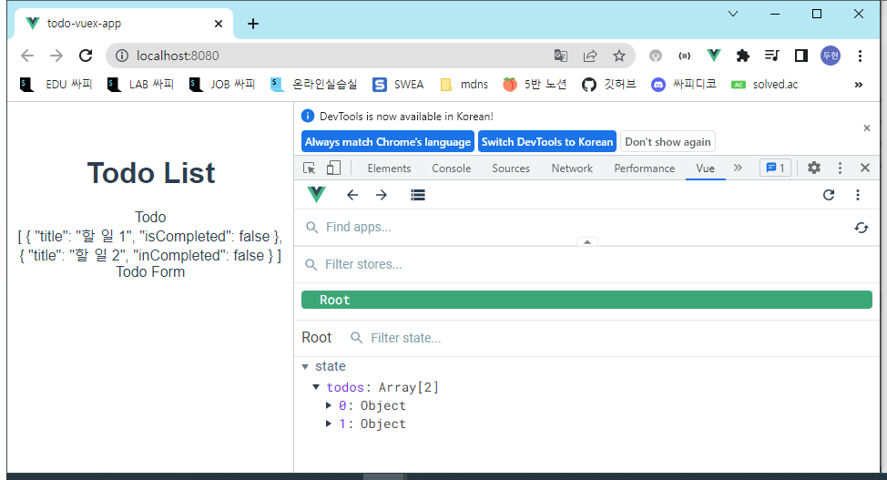

# Vue

## Vuex

### 개요

상태 관리(State Management)가 무엇인지 이해하기

Vuex가 무엇인지, 왜 필요한지 이해하기

Vuex 기본 문법 알아보기

### State Management

##### 상태 관리

상태(State)란?

- 현재에 대한 정보(data)

나의 상태가 어때?라는 질문에 어떻게 대답할 수 있을까?

- 배가 고픈 상태야
- 밤새 공부했더니 졸린 상태야
- 강의를 열심히 들었더니 자신감이 넘치는 상태야

그럼 Web Application에서의 상태는 어떻게 표현할 수 있을까?

현재 App이 가지고 있는 Data로 표현할 수 있음

우리는 여러 개의 component를 조합해서 하나의 App을 만들고 있음

각 component는 독립적이기 때문에 각각의 상태(data)를 가짐

하지만 결국 이러한 component들이 모여서 하나의 App을 구성할 예정

즉, 여러 개의 component가 같은 상태(data)를 유지할 필요가 있음

- 상태 관리 (State Management) 필요!

#### Pass Props & Emit Event

지금까지 우리는 props와 event를 이용해서 상태 관리를 하고 있음

각 컴포넌트는 독립적으로 데이터를 관리

같은 데이터를 공유하고 있으므로, 각 컴포넌트가 동일한 상태를유지하고 있음

데이터의 흐름을 직관적으로 파악 가능

그러나 component의 중첩이 깊어지면 데이터 전달이 쉽지 않음

공통의 상태를유지해야 하는 component가 많아지면 데이터 전달 구조가 복잡해짐

만약 A에서 B로 데이터를 전달해야 한다면?

pass Props 3번 Emit Event 3번 총 6번 가야 한다

-> 어떻게 하면 쉽게 해결할 수 있을까?

#### Centralized Store

중앙 저장소(store)에 데이터를 모아서 상태 관리

각 component는 중앙 저장소의 데이터를 사용

component의 계층에 상관없이 중앙 저장소에 접근해서 데이터를 얻거나 변경할 수 있음

중앙 저장소의 데이터가 변경되면 각각의 component는 해당 데이터의 변화에 반응하여 새로 변경된 데이터를 반영함

규모가 크거나 컴포넌트 중첩이 깊은 프로젝트의 관리가 매우 편리

#### Vuex


state management pattern + Library for vue.js

(상태 관리 패턴 + 라이브러리)

데이터가 예측 가능한 방식으로만 변경될 수 있도록 하는 규칙을 설정하며, Vue의 반응성을효율적으로 사용하는 상태 관리 기능을 제공

Vue의 공식 도구로써 다양한 기능을 제공

### vuex 시작하기

#### 프로젝트 with vuex

```bash
$ vue create vuex-app
```

```bash
$ cd vuex-app
```

vue CLI를 통해 vuex plugin 적용

```bas
$ vue add vuex
```

커밋하길 권장한다는 내용이 나오고 y 누르면 됨

```bash
 WARN  There are uncommitted changes in the current repository, it's    recommended to commit or stash them first.
? Still proceed? (y/N) 
```

```bash
📦  Installing @vue/cli-plugin-vuex...


up to date, audited 934 packages in 1s

102 packages are looking for funding
  run `npm fund` for details

4 critical severity vulnerabilities

To address all issues (including breaking changes), run:
  npm audit fix --force

Run `npm audit` for details.
✔  Successfully installed plugin: @vue/cli-plugin-vuex


🚀  Invoking generator for @vue/cli-plugin-vuex...
📦  Installing additional dependencies...


added 1 package, and audited 935 packages in 1s

102 packages are looking for funding
  run `npm fund` for details

4 critical severity vulnerabilities

To address all issues (including breaking changes), run:
  npm audit fix --force

Run `npm audit` for details.
⚓  Running completion hooks...

✔  Successfully invoked generator for plugin: @vue/cli-plugin-vuex
```


src/store/

가 생기고 index.js가 있음 여기가 중앙 저장소

```javascript
import Vue from 'vue'
import Vuex from 'vuex'

Vue.use(Vuex)

export default new Vuex.Store({
  state: {
  },
  getters: {
  },
  mutations: {
  },
  actions: {
  },
  modules: {
  }
})
```


vuex의 핵심 컨셉 4가지

1. state
   - data 역할
2. getters
   - 계산된 값-computed
3. mutations
   - 함수들
4. actions
   - 함수들


#### 1. State

vue 인스턴스의 data에 해당

중앙에서 관리하는 모든 상태 정보

개별 component는 state에서 데이터를 가져와서 사용

- 개별 component가 관리하던 data를 중앙 저장소(Vuex Store의 state)에서 관리하게 됨

state의 데이터가 변화하면 해당 데이터를 사용(공유)하는 component 자동으로 다시 렌더링

$store.state로 state 데이터에 접근

- $는 컴포넌트들이 가지고 있는 속성($emit과 마찬가지)

#### 2. Mutations

실제로 state를 변경하는 유일한 방법

vue 인스턴스의 methods에 해당하지만 Mutations에서 호출되는 핸들러(handeler) 함수는 반드시 동기적이어야 함

- 비동기 로직으로 mutations를 사용해서 state를 변경하는 경우, state의 변화의 시기를 특정할 수 없기 때문

첫번째 인자로 state를 받으며,

-  변경하기 위해

component 혹은 Actions에서 commit() 메서드로 호출됨

#### 3. Actions

mutations와 비슷하지만 비동기 작업을 포함할 수 있다는 차이가 있음

- state 변경하는 역할은 포기 - mutations에게 넘김
- 나머지는 actions

state를 직접 변경하지 않고 commit() 메서드로 mutations를 호출해서 state를 변경함

context 객체를 인자로 받으며, 이 객체를 통해 store.js의 모든 요소와 매서드에 접근할 수 있음 (== 즉 state를 직접 변경할 수 있지만 하지 않아야 함)

component에서 dispatch() 매서드에 의해 호출됨

#### Mutations & Actions

vue component의 method 역할이 vuex에서는 아래와 같이 분화됨

Mutations

- state를 변경

Actions

- state 변경을 제외한 나머지 로직



action이 바로 state 바꾸는게 아니라 mutatuons에게 commit으로 넘김

actions는 백엔드 API랑도 연결 뮤테이션은 바꾸는것만 해서 연결 x

#### 4. Getters

vue 인스턴스의 computed에 해당

state를 활용하여 계산된 값을 얻고자 할 때 사용, state의 원본 데이터를 건들지 않고 계산된 값을 얻을 수 있음

computed와 마찬가지로 getters의 결과는 캐시(cache) 되며, 종속된 값이 변경된 경우에만 재계산됨

getters에서 계산된 값은 state에 영향을 미치지 않음

- mutations만 영항을 미칠 수 있음

첫번째 인자로 state, 두번째 인자로 getter를 받음

- state를 기반이라서
- 다른 getters 사용하는 경우도 있기 때문에

#### 그럼 이제 모든 데이터를 Vuex에서 관리해야 할까

Vuex를 사용한다고 해서 모든 데이터를 state에 넣어야 하는 것은 아님

Vuex에서도 여전히 pass props, emit event를 사용하여 상태를 관리할 수 있음

- 모든것을 굳이 중앙에 넣을 필요는 없음
- 하나만 쓰는 경우, 1단계만 올리면 되는 경우에 굳이 중앙에 올릴필요 없음

개발 환경에 따라 적절하게 사용하는 것이 필요함

#### 정리

state

- 중앙에서 관리하는 모든 상태 정보

mutations

- state를 변경하기 위한 methods
  - 동기식 작업만

actions

- 비동기 작업이 포함될 수 있는(외부 API의 소통 등) methods

- state를 변경하는 것 외의 모든 로직 진행
  - 비동기도 들어갈 수 있다

getters

- state를 활용해 계산한 새로운 변수 값

component에서 데이터를 조작하기 위한 데이터의 흐름

- component-> (actions) -> mutations -> state
  - actions가 여러가지 일을 하고 mutations는 스테이트 변경
  - 바로 변경만 하는거면 actions 생략 가능

component에서 데이터를 사용하기 위한 데이터의 흐름

- state->(getters)->component
  - 바로 가져오지만 getters 있으면 씀

### 실습

#### Object method shorthand

이제부터는 객체 메서드 축약형을 사용할 것

key: value형식이 아니라 바로 펑션 씀

- 콜론이랑 펑션 없어지고 소괄호랑 이름이랑 합쳐진다

```javascript
// before
const obj = {
  addValue: funtion (value) {
    return value
  },
}
```

```javascript
// after
const obj = {
  addValue(value) {
    return value
  },
}
```

#### state

중앙에서 관리하는 모든 상태 정보

$store.state로접근 가능

store의 state에 message 데이터 정의

index.js에

```javascript
  state: {
    message: 'message in store',
  },
```

추가하고

App.vue

```vue
    <h1>{{ $store.state.message }}</h1>
```

추가함

component에 등록 안해도 됨

최종

```vue
<template>
  <div id="app">
    <h1>{{ $store.state.message }}</h1>
  </div>
</template>

<script>

export default {
  name: 'App',
  components: {
  },
}
</script>

<style>
#app {
  font-family: Avenir, Helvetica, Arial, sans-serif;
  -webkit-font-smoothing: antialiased;
  -moz-osx-font-smoothing: grayscale;
  text-align: center;
  color: #2c3e50;
  margin-top: 60px;
}
</style>
```


개발자도구에 vuex 생겼고 확인할 수 있음

그런데 이렇게 html에서 바로 접근하는건 그렇게 좋은건 아님

스크립트에서 매서드 조회하는게 좋음

App.vue

스크립트에 computed로 가져옴

이때 축약형 사용

```vue
export default {
  name: 'App',
  components: {
  },
  computed: {
    message() {
      return this.$store.state.message
    }
  }
}
```

스크립트에 넣고

템플릿에

```vue
    <h1>{{ message }}</h1>
```

최종

```vue
<template>
  <div id="app">
    <h1>{{ message }}</h1>
  </div>
</template>

<script>

export default {
  name: 'App',
  components: {
  },
  computed: {
    message() {
      return this.$store.state.message
    }
  }
}
</script>

<style>
#app {
  font-family: Avenir, Helvetica, Arial, sans-serif;
  -webkit-font-smoothing: antialiased;
  -moz-osx-font-smoothing: grayscale;
  text-align: center;
  color: #2c3e50;
  margin-top: 60px;
}
</style>
```


좀더 vue다운 코드다

#### actions

state를 변경할 수 있는 mutations 호출

- 변경하고 최종적으로 변경해라고 넘김

component에서 dispatch()에 의해 호출됨

dispatch(A, B)

- A: 호출하고자 하는 actions 함수
- B: 넘겨주는 데이터(payload)

actions의 첫번째 인자는 context

- context는 store의 전반적인 속성을 모두 가지고 있으므로 context.state와 context.getters를 통해 mutations를 호출하는 것이 모두 가능
- dispatch()를 사용해 다른 actions도 호출할 수 있음
- 단, actions에서 state를 직접 조작하는 것은 삼가야 함

actions의 두번째 인자는 payload

- 넘겨준 데이터를 받아서 사용


일단 input 태그 하나 만들어주고

```vue
    <input
      type="text"
      @keyup.enter="changeMessage"  
    >
```

넣어줌

저장되는 곳 data 만들고 넣어줌

```vue
  data() {
    return {
      
    }
  },
```

v-model로 바인딩

```vue
    <input
      type="text"
      @keyup.enter="changeMessage"
      v-model="inputData"
    >
```

```vue
  data() {
    return {
      inputData: null,
    }
  },
```

이제 실시간으로 data에 입력한 값이 들어감

메소드가 가져가서 저장

```vue
  methods: {
    changeMessage() {
      const newMessage = this.inputData
    }
  }
```

이제 action 호출해야 함

```vu
  methods: {
    changeMessage() {
      const newMessage = this.inputData
      this.$store.dispatch('액션 매서드 이름', newMessage)
    }
  }
```

index.js 돌아가서 매서드 정의

컨텍스트 객체는 모든 객체를 포함 모든 곳을 접근할 수 있다는게 이걸로 다 가능하다는 것

```javascript
  actions: {
    changeMessage(context, newMessage) {
      console.log(context)
      console.log(newMessage)
    }
```

이 이름 아까 이름 자리에 넣어줌

App.vue

```vue
  methods: {
    changeMessage() {
      const newMessage = this.inputData
      this.$store.dispatch('changeMessage', newMessage)
    }
  }
```

vue 타임라인 확인


dipatch 있고

state보면 모든 접근 가능

하지만 할 수 있지만 하지 않는다

#### mutations

actions에서 commit()을 통해 mutations 호출하기

mutations는 state를 변경하는 유일한 방법

component 또는 actions에서 commit()에 의해 호출됨

commit(A, B)

- A: 호출하고자 하는 mutations 함수
- B: payload

mutations 함수 작성하기

mutations는 state를 변경하는 유일한 방법

index.js

액션스에서 커밋으로 뮤테이션 호출

```javascript
  actions: {
    changeMessage(context, newMessage) {
      context.commit('mutation 메서드 이름', 추가데이터)
    }
  },
```

뮤테이션스에

```javascript
  mutations: {
    CHANGE_MESSAGE(state, newMessage) {
      
    }
  },
```

이름 대문자로 해서 이게 뮤테이션스라는 것을 알림 액션스랑 구분시키라고 권장됨

```javascript
  mutations: {
    CHANGE_MESSAGE(state, newMessage) {
      console.log(state)
      console.log(newMessage)
    }
  },
```

콘솔로 어떤건지 확인

```javascript
  actions: {
    changeMessage(context, newMessage) {
      context.commit('CHAGE_MESSAGE', newMessage)
    }
  },
```

만든거 이름 액션스에 넣기

최종

index.js

```javascript
import Vue from 'vue'
import Vuex from 'vuex'

Vue.use(Vuex)

export default new Vuex.Store({
  state: {
    message: 'message in store',
  },
  getters: {
  },
  mutations: {
    CHANGE_MESSAGE(state, newMessage) {
      console.log(state)
      console.log(newMessage)
    }
  },
  actions: {
    changeMessage(context, newMessage) {
      // console.log(context)
      // console.log(newMessage)
      context.commit('CHANGE_MESSAGE', newMessage)
    }
  },
  modules: {
  }
})

```


state조작해야 하기 때문에 첫번째 인자로 state가 들어간다

액션 안거쳐도 되긴 하는데 그냥 연습용으로 함

state.message에 newmessage를 할당해준다

```javascript
  mutations: {
    CHANGE_MESSAGE(state, newMessage) {
      state.message = newMessage
    }
  },
```

최종

```javascript
import Vue from 'vue'
import Vuex from 'vuex'

Vue.use(Vuex)

export default new Vuex.Store({
  state: {
    message: 'message in store',
  },
  getters: {
  },
  mutations: {
    CHANGE_MESSAGE(state, newMessage) {
      state.message = newMessage
    }
  },
  actions: {
    changeMessage(context, newMessage) {
      context.commit('CHANGE_MESSAGE', newMessage)
    }
  },
  modules: {
  }
})

```


#### getters

getters 사용해보기

- getters는 state를 활용한 새로운 변수
- getters 함수
  - 첫번째 인자는 state
  - 두번째 인자는 getters

현재 메세지의 길이 값을 해보자

index.js

```javascript
  getters: {
    messageLength(state) {
      return state.message.length
    }
  },
```

App.vue

```vue
  computed: {
	...
    messageLength() {
      return this.$store.getters.messageLength
    }
  },
```

템플릿

```vue
    <h2>입력된 문자의 길이는 {{ messageLength }}</h2>
```

총합

index.js

```javascript
import Vue from 'vue'
import Vuex from 'vuex'

Vue.use(Vuex)

export default new Vuex.Store({
  state: {
    message: 'message in store',
  },
  getters: {
    messageLength(state) {
      return state.message.length
    }
  },
  mutations: {
    CHANGE_MESSAGE(state, newMessage) {
      // console.log(state)
      // console.log(newMessage)
      state.message = newMessage
    }
  },
  actions: {
    changeMessage(context, newMessage) {
      // console.log(context)
      // console.log(newMessage)
      context.commit('CHANGE_MESSAGE', newMessage)
    }
  },
  modules: {
  }
})

```

App.vue

```vue
<template>
  <div id="app">
    <h1>{{ message }}</h1>
    <h2>입력된 문자의 길이는 {{ messageLength }}</h2>
    <input
      type="text"
      @keyup.enter="changeMessage"
      v-model="inputData"
    >
  </div>
</template>

<script>

export default {
  name: 'App',
  data() {
    return {
      inputData: null,
    }
  },
  components: {
  },
  computed: {
    message() {
      return this.$store.state.message
    },
    messageLength() {
      return this.$store.getters.messageLength
    }
  },
  methods: {
    changeMessage() {
      const newMessage = this.inputData
      this.$store.dispatch('changeMessage', newMessage)
    }
  }
}
</script>

<style>
#app {
  font-family: Avenir, Helvetica, Arial, sans-serif;
  -webkit-font-smoothing: antialiased;
  -moz-osx-font-smoothing: grayscale;
  text-align: center;
  color: #2c3e50;
  margin-top: 60px;
}
</style>
```


중앙 저장소의 데이터가 바뀌면 다 바뀐다

## Lifecycle Hooks

### Lifecycle Hooks

각 Vue 인스턴스는 생성과 소멸의 과정 중 단계별 초기화 과정을 거침

- Vue 인스턴스가 생성된 경우, 인스턴스를 DOM에 마운트하는 경우, 데이터가 변경되어 DOM을 업데이트하는 경우 등
- 각 단계가 트리거가 되어 특정 로직을 실행할 수 있음
- 이를 Lifecycle Hooks이라고 함


빨간부분들 

이 위치에 우리가 원하는 코드를 넣을 수 있음

### 

### Lifecycle Hooks 맛보기

lifecyclehook


처음 상태


childComponent 보면 단계들이 있는데 콘솔을 보면 mounted까지 됐다는 거 확인 가능


change value 버튼 누르면 단계중에 updated까지 진행됐다는 것을 알 수 있음

toggle 누르면


destroyed까지 되고 렌더된것 사라짐

#### created

사용자의 입력 없이 페이지가 만들어지기 전에 첫 요청 이걸 바탕으로 페이지 만듦

Vue instance가 생성된 후 호출됨

data, computed 등의 설정이 완료된 상태

서버에서 받은 데이터를 vue instance의 data에 할당하는 로직을 구현하기 적합

단, mount되지 않아 요소에 접근할 수 없음

- DOM 요소


JavaScript에서 학습한 Dog API 활용 실습의 경우 버튼을 누르면 강아지 사진을 보여줌

버튼을 누르지 않아도 첫 실행 시 기본 사진이 출력되도록 하고 싶다면?

-> created 함수에 강아지 사진을 가져오는 함수를 추가

App.vue에 dogcomponent 가져오기

```vue
import DogComponent from '@/components/DogComponent'
```

```vue
  components: {
    ChildComponent,
    DogComponent,
  },
  created() {
    console.log('App created!')
  },
  mounted() {
    console.log('App mounted!')
  },
```

```vue
    <DogComponent/>

```

최종

App.vue

```vue
<template>
  <div id="app">
    <button @click="toggle">toggle</button>
    <ChildComponent
      v-if="flag"
    />
    <hr>
    <DogComponent/>
  </div>
</template>

<script>
import ChildComponent from '@/components/ChildComponent'
import DogComponent from '@/components/DogComponent'

export default {
  name: 'App',
  data() {
    return {
      flag: true
    }
  },
  methods: {
    toggle() {
      this.flag = !this.flag
    }
  },
  components: {
    ChildComponent,
    DogComponent,
  },
  created() {
    console.log('App created!')
  },
  mounted() {
    console.log('App mounted!')
  },
}
</script>
```


버튼 누르면


이걸 버튼 누르기 전에 하고 싶은 것임

DogComponent.vue

스크립트에

```vue
  created() {
    this.getDogImage()
  }
```

추가하면

DogComponent

```vue
<template>
  <div>
    <button @click="getDogImage">멍멍아 이리온</button><br><br>
    <br>
  </div>
</template>


<script>
import axios from 'axios'

export default {
  name:'DogComponent',
  data() {
    return {
      imgSrc: null,
    }
  },
  methods:{
    getDogImage() {
      const dogImageSearchURL = 'https://dog.ceo/api/breeds/image/random'
      
      axios({
        method: 'get',
        url: dogImageSearchURL
      })
        .then((response) => {
          const imgSrc = response.data.message
          this.imgSrc = imgSrc
        })
        .catch((error) => {
          console.log(error)
        })
    }
  },
  created() {
    this.getDogImage()
  }
}
</script>

<style>

</style>

```


버튼 안눌러도 뜸

created시점에 이미지 호출하도록 하기 때문에 

vue lifecycle의 훅에 넣어버린것

#### mounted

Vue instance가 요소에 mount된 후 호출됨

mount된 요소를 조작할 수 있음

created의 경우, mount 되기 전이기 때문에 DOM에 접근할 수 없으므로 동작하지 않음

- mounted는 html(DOM)도 조작 가능

mounted는 주석처리

DogComponent.vue

스크립트에

```vue
  mounted() {
    const button = document.querySelector('button')
    button.innerText = '멍멍!'
  }
```

추가

최종

```vue
<template>
  <div>
    <button @click="getDogImage">멍멍아 이리온</button><br><br>
    <br>
  </div>
</template>


<script>
import axios from 'axios'

export default {
  name:'DogComponent',
  data() {
    return {
      imgSrc: null,
    }
  },
  methods:{
    getDogImage() {
      const dogImageSearchURL = 'https://dog.ceo/api/breeds/image/random'
      
      axios({
        method: 'get',
        url: dogImageSearchURL
      })
        .then((response) => {
          const imgSrc = response.data.message
          this.imgSrc = imgSrc
        })
        .catch((error) => {
          console.log(error)
        })
    }
  },
  created() {
    this.getDogImage()
  },
  mounted() {
    const button = document.querySelector('button')
    button.innerText = '멍멍!'
  }
}
</script>

<style>

</style>

```


바뀜

만약 이걸 created에 했다면

```vue
  created() {
    const button = document.querySelector('button')
    button.innerText = '멍멍!'
  },
```


이런 오류가 뜨고 버튼 안바뀌어져 있음

#### updated

데이터가 변경되어 DOM에 변화를 줄 때 호출됨

재렌더링 즉 DOM에 변화있을때


일단 처음에 하나 생겨 있고


버튼 누를때마다 새로운 멍멍이 생김

### Lifecycle Hooks 특징

instance마다 각각의 Lifecycle을 가지고 있음

Lifecycle Hooks는 컴포넌트별로 정의할 수 있음

DogComponent.vue

스크립트

```vue
  created() {
    this.getDogImage()
    console.log('Child created!')
  },
  mounted() {
    const button = document.querySelector('button')
    button.innerText = '멍멍!'
    console.log('Child mounted!')    
  },
  updated() {
    console.log('새로운 멍멍이!')
    console.log('Child updated!')    
  }
```

콘솔들 넣어서 부모 컴포넌트랑 비교해서 언제 발동하는지 확인


순서가 이렇게 됨

현재 해당 프로젝트는

App.vue 생성 -> DogComponent생성->DogComponent 부착->App.vue 부착->DogComponent 업데이트 순으로 동작한것

부모 컴포넌트의 mounted hook이 실행되었다고 해서 자식이 mount된 것이 아니고, 

부모 컴포넌트가 updated hook이 실행되었다고 해서 자식이 updated 된 것이 아님

- 서로 영향이 있는 것이 아님

- 부착 여부가 부모-자식 관계에 따라 순서를 가지고 있지 않은 것

instance마다 각각의 Lifecycle을 가지고 있기 때문

- 독립적이다

## Todo with Vuex

### 개요

Vuex를 사용한 Todo 프로젝트 만들기

구현 기능

- Todo CRUD
- Todo 개수 계산
  - 전체 Todo
  - 완료된 Todo
  - 미완료된 Todo

컴포넌트 구성


### 사전 준비

#### Init Project

1. 프로젝트 생성 및 vuex 플러그인 추가

   ```bash
   $ vue create todo-vuex-app
   
   $ cd todo-vuex-app
   
   $ vue add vuex
   ```

   

2. HelloWorld 컴포넌트 및 관련 코드 삭제

   - App.vue의 CSS 코드는 남김

#### 컴포넌트 작성

TodoListItem.vue

vue 탭하고 이름 넣고 들어갈 것 작성

```vue
<template>
  <div>Todo</div>
</template>

<script>
export default {
  name: 'TodoListItem'
}
</script>

<style>

</style>
```

TodoList.vue

```vue
<template>
  <div>

  </div>
</template>

<script>

export default {
  name: 'TodoList'
}
</script>

<style>

</style>
```

이름 넣고

하위 컴퍼넌트 불러오고 등록하고 보여주기

```vue
<template>
  <div>
    <TodoListItem/>
  </div>
</template>

<script>
import TodoListItem from '@/components/TodoListItem'

export default {
  name: 'TodoList',
  components: {
    TodoListItem,
  }
}
</script>

<style>

</style>
```


TodoFrom.vue

```vue
<template>
  <div>Todo Form</div>
</template>

<script>
export default {
  name: 'TodoForm',
}
</script>

<style>

</style>
```

만들고 이름넣고

App.vue

하위 컴퍼넌트 불러오고 등록하고 보여주고

```vue
<template>
  <div id="app">
    <h1>Todo List</h1>
    <TodoList/>
    <TodoForm/>
  </div>
</template>

<script>
import TodoList from '@/components/TodoList'
import TodoForm from '@/components/TodoForm'

export default {
  name: 'App',
  components: {
    TodoList,
    TodoForm,
  }
}
</script>

<style>
#app {
  font-family: Avenir, Helvetica, Arial, sans-serif;
  -webkit-font-smoothing: antialiased;
  -moz-osx-font-smoothing: grayscale;
  text-align: center;
  color: #2c3e50;
  margin-top: 60px;
}
</style>
```


### Read Todo

#### State 세팅

출력을 위한 기본 todo 작성

중앙저장소에 세팅

index.js

state에 작성

베열이고 하나하나가 객체

```javascript
todos: [
      {
        title: '할 일 1',
        inCompleted: false,
      },
      {
        title: '할 일 2',
        inCompleted: false,
      }
    ]
```

추가

최종

```javascript
import Vue from 'vue'
import Vuex from 'vuex'

Vue.use(Vuex)

export default new Vuex.Store({
  state: {
    todos: [
      {
        title: '할 일 1',
        inCompleted: false,
      },
      {
        title: '할 일 2',
        inCompleted: false,
      }
    ]
  },
  getters: {
  },
  mutations: {
  },
  actions: {
  },
  modules: {
  }
})
```


#### state 데이터 가져오기

TodoList.vue

```vue
    {{ $store.state.todos }}
```


이렇게 그냥 가져와도 되는데 좋은 방법은 아님

computed값으로 가져오자

```vue
  computed: {
    todos() {
      return this.$store.state.todos
    }
  },
```

추가하고

```vue
    {{ todos }}
```

로 추가함

최종

 TodoList.vue

```vue
<template>
  <div>
    <TodoListItem/>
    {{ todos }}
  </div>
</template>

<script>
import TodoListItem from '@/components/TodoListItem'

export default {
  name: 'TodoList',
  components: {
    TodoListItem,
  },
  computed: {
    todos() {
      return this.$store.state.todos
    }
  },
}
</script>

<style>

</style>
```




이걸 TodoListItem에 내려줘야 함

Props로 내려줌

- 여전히 필요함
- 개별 데이터 반복 돌려서 중앙데이터에 올리는 것보다는 그냥 내리는게 간단함

템플릿

```vue
    <TodoListItem
      v-for="(todo, index) in todos"
      :key="index"
      :todo="todo"
    />
```

반복되는 todo를 todo 아이템에 내려줌

이때 키는 유일한 값으로

- 원래 다른거 해야하는데 일단 index로

TodoListItem.vue

스크립트에서 props로 받아주겠다 선언

```vue
  props: {
    todo: Object,
  }
```

템플릿에 추가

```vue
  <div>{{ todo.title }}</div>
```

최종

TodoList.vue

```vue
<template>
  <div>
    <TodoListItem
      v-for="(todo, index) in todos"
      :key="index"
      :todo="todo"
    />
  </div>
</template>

<script>
import TodoListItem from '@/components/TodoListItem'

export default {
  name: 'TodoList',
  components: {
    TodoListItem,
  },
  computed: {
    todos() {
      return this.$store.state.todos
    }
  },
}
</script>

<style>

</style>
```


TodoListItem.vue

```vue
<template>
  <div>{{ todo.title }}</div>
</template>

<script>
export default {
  name: 'TodoListItem',
  props: {
    todo: Object,
  }
}
</script>

<style>

</style>
```


### Create Todo

#### Todoform

사용자 입력 받아서 컴퍼넌트 데이타로 저장했다가 스테이트로 넘김

data 필요

스크립트에

```vue
  data() {
    return {
      todoTitle: null,
    }
  }
```

추가하고

input태크 추가하고 v-model하고 엔터랑 함수 연결

```vue
  <div>
    <input
      type="text"
      v-model="todoTitle"
      @keyup.enter="createTodo"
    >
  </div>
```

그 메소드도 만들어줌

```vue
  methods: {
    createTodo() {
      console.log(this.todoTitle)
    }
  },
```

엔터 눌렀을 때 이 메소드 실행되서 출력되는지 확인

최종

TodoForm.vue

```vue
<template>
  <div>
    <input
      type="text"
      v-model="todoTitle"
      @keyup.enter="createTodo"
    >
  </div>
</template>

<script>
export default {
  name: 'TodoForm',
  data() {
    return {
      todoTitle: null,
    }
  },
  methods: {
    createTodo() {
      console.log(this.todoTitle)
    }
  },
}
</script>

<style>

</style>
```


이제 todo넣으려면 매서드로 액션을 하게 하고(dispatch) 그 액션이 뮤테이션을 호출하고(commit) 스테이트를 바꾸게

일단 액션을 호출하는데 이름은 아직 안만든 거고 payload로 todotitle 넣어줌

```vue
  methods: {
    createTodo() {
      // console.log(this.todoTitle)
      this.$store.dispatch('createTodo', this.todoTitle)
    }
  },
```

이러고 일단 입력해보면


에러 뜸 

입력하고 빈칸되게 null 값 들어가게 함

```vue
      this.todoTitle = null
```

추가

빈값 입력 안되게 trim 써서

템플릿 v-model 수정

```vue
      v-model.trim="todoTitle"
```

if문으로 빈칸 아닐때, true일때만 dispatch하게

```vue
<template>
  <div>
    <input
      type="text"
      v-model.trim="todoTitle"
      @keyup.enter="createTodo"
    >
  </div>
</template>

<script>
export default {
  name: 'TodoForm',
  data() {
    return {
      todoTitle: null,
    }
  },
  methods: {
    createTodo() {
      // console.log(this.todoTitle)
      if (this.todoTitle) {
        this.$store.dispatch('createTodo', this.todoTitle)
      }  
      this.todoTitle = null
    }
  },
}
</script>

<style>

</style>
```

#### Actions

actions에는 보통 비동기 관련 작업이 진행되지만 현재 별도의 비동기 관려 작업이 불필요하기 때문에 입력받은 todo 제목(todoTitle)을 todo 객체(todoItem)으로 만드는 과정을 Actions에서 작성할 예정

- 사실 그냥 뮤테이션에 들어가도 됨
- 그래도 과정을 보기 위해 

createTodo에서 보낸 데이터를 수신 후 todoItem object를 생성

index.js

액션스에 추가

```vue
actions: {
    createTodo(context, todoTitle) {
      // Todo 객체 만들기
      const todoItem = {
        title: todoTitle,
        isCompleted: false,
      }
      console.log(todoItem)
    }
  },
```

이러고 일단 인풋에 입력해보면


객체가 제대로 생성되는 것은 확인

#### Mutations

```vue
      context.commit('CREATE_TODO', todoItem)
```

액션에 추가

```vue
actions: {
    createTodo(context, todoTitle) {
      const todoItem = {
        title: todoTitle,
        isCompleted: false,
      }
      context.commit('CREATE_TODO', todoItem)
    }
  },
```

그리고 CREATE_TODO는 mutations에

```vue
  mutations: {
    CREATE_TODO(state, todoItem) {
      state.todos.push(todoItem)
    }
  },
```

이제 기본 data는 필요 없으니 삭제

```vue
  state: {
    todos: []
  },
```

최종

TodoForm.vue

```vue
<template>
  <div>
    <input
      type="text"
      v-model.trim="todoTitle"
      @keyup.enter="createTodo"
    >
  </div>
</template>

<script>
export default {
  name: 'TodoForm',
  data() {
    return {
      todoTitle: null,
    }
  },
  methods: {
    createTodo() {
      // console.log(this.todoTitle)
      if (this.todoTitle) {
        this.$store.dispatch('createTodo', this.todoTitle)
      }  
      this.todoTitle = null
    }
  },
}
</script>

<style>

</style>
```


index.js

```javascript
import Vue from 'vue'
import Vuex from 'vuex'

Vue.use(Vuex)

export default new Vuex.Store({
  state: {
    todos: []
  },
  getters: {
  },
  mutations: {
    CREATE_TODO(state, todoItem) {
      state.todos.push(todoItem)
    }
  },
  actions: {
    createTodo(context, todoTitle) {
      const todoItem = {
        title: todoTitle,
        isCompleted: false,
      }
      context.commit('CREATE_TODO', todoItem)
    }
  },
  modules: {
  }
})

```


#### 중간 정리

Vue 컴포넌트의 method에서 dispatch()를 사용해 actions 메서드를 호출

Actions에 정의된 함수는 commit()을 사용해 mutations를 호출

Mutations에 정의된 함수가 최종적으로 state를 변경

1. 컴포넌트
2. actions메서드
3. mutations 호출
4. state 변경

### Delete Todo

#### TodoListItem

개별 요소에 삭제 버튼이 있으니 TodoListItem에 가야함

TodoListItem.vue

```vue
    <button @click="deleteTodo">
      Delete  
    </button>  
```

버튼 추가

```vue
  methods: {
    deleteTodo() {
      console.log('삭제 메서드 호출')
    }
  }
```

일단 메서드 작동하는 지 확인


이제 얘가 액션을 호출하도록 함

별도로 보내줘야 할 데이터는 todo중에 어떤 todo를 삭제해야할지

```vue
  methods: {
    deleteTodo() {
      this.$store.dispatch('deleteTodo', this.todo)
    }
  }
```

액션이 딱히 뭘 하는건 아니고 그대로 뮤테이션 호출해도 되긴함

이렇게 하면 method에서 바로 mutation가능

commit() 사용

```vue
  methods: {
    deleteTodo() {
      this.$store.commit('DELETE_TODO', this.todo)
    }
  }
```

근데 그냥 다 해봄

#### Actions

이제 액션 작성

index.js

```vue
  actions: {
	...
    deleteTodo(context, todoItem) {
      context.commit('DELETE_TODO',todoItem)
    }
  },
```

#### Mutations

뮤테이션 작성

```vue
mutations: {
    ...
    DELETE_TODO(state, todoItem) {

    }
  },
```

일단 이 todo의 인덱스를 찾고

```vue
      const index = state.todos.indexOf(todoItem)
```

그 인덱스 빼고 재구성

```vue
      state.todos.splice(index,1)
```

최종

TodoListItem.vue

```vue
<template>
  <div>
    {{ todo.title }}
    <button @click="deleteTodo">
      Delete  
    </button>  
  </div>
</template>

<script>
export default {
  name: 'TodoListItem',
  props: {
    todo: Object,
  },
  methods: {
    deleteTodo() {
      this.$store.dispatch('deleteTodo', this.todo)
    }
  }
}
</script>

<style>

</style>
```


index.js

```vue
import Vue from 'vue'
import Vuex from 'vuex'

Vue.use(Vuex)

export default new Vuex.Store({
  state: {
    todos: []
  },
  getters: {
  },
  mutations: {
    CREATE_TODO(state, todoItem) {
      state.todos.push(todoItem)
    },
    DELETE_TODO(state, todoItem) {
      const index = state.todos.indexOf(todoItem)
      state.todos.splice(index, 1)
    }
  },
  actions: {
    createTodo(context, todoTitle) {
      const todoItem = {
        title: todoTitle,
        isCompleted: false,
      }
      context.commit('CREATE_TODO', todoItem)
    },
    deleteTodo(context, todoItem) {
      context.commit('DELETE_TODO',todoItem)
    }
  },
  modules: {
  }
})
```


### Update Todo

취소선 긋고 취소선

IsCompleted 토글하게 하겠다

#### TodoListItem

일단 todo리스트를 span 태그로 감싸줘서 처리할 수 있도록 함

```vue
    <span>{{ todo.title }}</span>
```

메소드랑 연결

```vue
    <span @click="updateTodoStatus">{{ todo.title }}</span>
```

메소드 작성

dispatch로 액션호출하고 마찬가지로 무슨 todo인지 전달

```vue
    updateTodoStatus() {
      this.$store.dispatch('updateTodoStatus', this.todo)
    }
```

최종

TodoListItem.vue

```vue
<template>
  <div>
    <span @click="updateTodoStatus">{{ todo.title }}</span>
    <button @click="deleteTodo">
      Delete  
    </button>  
  </div>
</template>

<script>
export default {
  name: 'TodoListItem',
  props: {
    todo: Object,
  },
  methods: {
    deleteTodo() {
      // console.log('삭제 메서드 호출')
      this.$store.dispatch('deleteTodo', this.todo)
    },
    updateTodoStatus() {
      this.$store.dispatch('updateTodoStatus', this.todo)
    },
  }
}
</script>

<style>

</style>
```

#### Actions

이번에도 할일은 없음 API랑 소통할 일이 없기 때문

```javascript
actions: {
	...
    updateTodoStatus(context, todoItem) {
      context.commit('UPDATE_TODO_STATUS', todoItem)
    },
  },
```

#### Mutation

```javascript
  mutations: {
	...
    UPDATE_TODO_STATUS(state, todoItem) {
      console.log(todoItem)
    }
  },
```

일단 잘 왔는지 확인


이제 이걸 todos 배열에서 선택된 todo의 is_completed값만 토글한 후 업데이트 된 todos배열로 되어야 함

반복으로 하고 그것이 다시 todos로 할당이 되어야함 ->array helper method중에서 map이 적합

```javascript
    UPDATE_TODO_STATUS(state, todoItem) {
      console.log(todoItem)
      state.todos = state.todos.map((todo) => {

        return todo
      })
    },
```

그리고 todo랑 todoItem이 같은지 확인해야 함

```javascript
    UPDATE_TODO_STATUS(state, todoItem) {
      console.log(todoItem)
      state.todos = state.todos.map((todo) => {
        if(todo === todoItem) {

        }
        return todo
      })
    },
```

 같았을 때만 원본 todo의 iscompleted의 값을 반대로

```javascript
    UPDATE_TODO_STATUS(state, todoItem) {
      console.log(todoItem)
      state.todos = state.todos.map((todo) => {
        if(todo === todoItem) {
          todo.isCompleted = !todo.isCompleted
        }
        return todo
      })
    },
```

index.js 최종

```javascript
import Vue from 'vue'
import Vuex from 'vuex'

Vue.use(Vuex)

export default new Vuex.Store({
  state: {
    todos: []
  },
  getters: {
  },
  mutations: {
    CREATE_TODO(state, todoItem) {
      state.todos.push(todoItem)
    },
    DELETE_TODO(state, todoItem) {
      const index = state.todos.indexOf(todoItem)
      state.todos.splice(index,1)
    },
    UPDATE_TODO_STATUS(state, todoItem) {
      console.log(todoItem)
      state.todos = state.todos.map((todo) => {
        if(todo === todoItem) {
          todo.isCompleted = !todo.isCompleted
        }
        return todo
      })
    },
  },
  actions: {
    createTodo(context, todoTitle) {
      const todoItem = {
        title: todoTitle,
        isCompleted: false,
      }
      context.commit('CREATE_TODO', todoItem)
    },
    deleteTodo(context, todoItem) {
      context.commit('DELETE_TODO',todoItem)
    },
    updateTodoStatus(context, todoItem) {
      context.commit('UPDATE_TODO_STATUS', todoItem)
    },
  },
  modules: {
  }
})
```


클릭했을 때 isCompleted 바뀌는지 확인

```javascript
const index = state.todos.indexOf(todoItem)
state.todos[index].isCompleted = !state.todos[index].isCompleted
```

이렇게 해도 됨

이제 inCompleted에 따라 스타일링을 해야함

#### 취소선 스타일링


TodoListItem.vue

스타일에

```vue
<style>
  .is-completed {
    text-decoration: line-through;
  }
</style>
```

클래스

v-bind로 할 수 있는 객체를 이용한 스타일 바인딩

span태그에 추가

```vue
      :class="{ 'is-completed' : todo.isCompleted }"
```

```vue
<span
      @click="updateTodoStatus"
      :class="{ 'is-completed' : todo.isCompleted }"
    >
    
      {{ todo.title }}
    </span>
```

최종

TodoListItem.vue

```vue
<template>
  <div>
    <span
      @click="updateTodoStatus"
      :class="{ 'is-completed' : todo.isCompleted }"
    >
    
      {{ todo.title }}
    </span>
    <button @click="deleteTodo">
      Delete  
    </button>  
  </div>
</template>

<script>
export default {
  name: 'TodoListItem',
  props: {
    todo: Object,
  },
  methods: {
    deleteTodo() {
      this.$store.dispatch('deleteTodo', this.todo)
    },
    updateTodoStatus() {
      this.$store.dispatch('updateTodoStatus', this.todo)
    },
  }
}
</script>

<style>
  .is-completed {
    text-decoration: line-through;
  }
</style>
```


### 상태별 todo 개수 계산

getters 활용

#### 전체 todo 개수

getters에 추가 state값 쓸거라 그거 넣어줌

```javascript
  getters: {
    allTodosCount(state) {

    }
  },
```

```javascript
  getters: {
    allTodosCount(state) {
      return state.todos.length
    }
  },
```

전체 갯수 넣어줌

App.vue

앱의 computed에 불러와 넣어줌

computed는 값이라 소괄호를 쓰지 않음

```vue
  computed: {
    allTodosCount() {
      return this.$store.getters.allTodosCount
    }
  }
```

템플릿에 넣어줌

```vue
    <h2>모든 Todo 개수: {{ allTodosCount }}</h2>
```

최종

index.js

```javascript
import Vue from 'vue'
import Vuex from 'vuex'

Vue.use(Vuex)

export default new Vuex.Store({
  ...
  getters: {
    allTodosCount(state) {
      return state.todos.length
    }
  ...

```

App.vue

```vue
<template>
  <div id="app">
    <h1>Todo List</h1>
    <h2>모든 Todo 개수: {{ allTodosCount }}</h2>
    <TodoList/>
    <TodoForm/>
  </div>
</template>

<script>
import TodoList from '@/components/TodoList'
import TodoForm from '@/components/TodoForm'

export default {
  name: 'App',
  components: {
    TodoList,
    TodoForm,
  },
  computed: {
    allTodosCount() {
      return this.$store.getters.allTodosCount
    }
  }
}
</script>

<style>
#app {
  font-family: Avenir, Helvetica, Arial, sans-serif;
  -webkit-font-smoothing: antialiased;
  -moz-osx-font-smoothing: grayscale;
  text-align: center;
  color: #2c3e50;
  margin-top: 60px;
}
</style>

```


#### 완료된 todo 개수

index.js

getters에 추가

```javascript
  getters: {
	...
    completedTodosCount(state) {

      })
    }
  },
```

 완료된 todo만 모아놓은 새로운 배열을 생성

```javascript
      const completedTodos = state.todos.filter((todo)=>{
        return todo.isCompleted === true
      })
```

그 새로운 배열의 길이를 반환

```javascript
      return completedTodos.length
```

getters

```javascript
getters: {
	...
    completedTodosCount(state) {
      const completedTodos = state.todos.filter((todo)=>{
        return todo.isCompleted === true
      })
      return completedTodos.length
    }
  },
```

App.vue

computed에

```vue
    completedTodosCount() {
      return this.$store.getters.completedTodosCount
    }
```

추가

최종

index.js

```javascript
import Vue from 'vue'
import Vuex from 'vuex'

Vue.use(Vuex)

export default new Vuex.Store({
  ...
  getters: {
    allTodosCount(state) {
      return state.todos.length
    },
    completedTodosCount(state) {
      const completedTodos = state.todos.filter((todo)=>{
        return todo.isCompleted === true
      })
      return completedTodos.length
    }
  },
  ...
```

App.vue

```vue
<template>
  <div id="app">
    <h1>Todo List</h1>
    <h2>모든 Todo 개수: {{ allTodosCount }}</h2>
    <h2>완료된 Todo 개수: {{ completedTodosCount }}</h2>
    <TodoList/>
    <TodoForm/>
  </div>
</template>

<script>
import TodoList from '@/components/TodoList'
import TodoForm from '@/components/TodoForm'

export default {
  name: 'App',
  components: {
    TodoList,
    TodoForm,
  },
  computed: {
    allTodosCount() {
      return this.$store.getters.allTodosCount
    },
    completedTodosCount() {
      return this.$store.getters.completedTodosCount
    }
  }
}
</script>

<style>
#app {
  font-family: Avenir, Helvetica, Arial, sans-serif;
  -webkit-font-smoothing: antialiased;
  -moz-osx-font-smoothing: grayscale;
  text-align: center;
  color: #2c3e50;
  margin-top: 60px;
}
</style>

```


#### 미완료된 Todo 개수

전체 빼기 완료 하면됨

```javascript
  getters: {
	...
    unCompletedTodosCount(state) {

    }
  },
```

getters에서 다른 getters 접근하려면 두번째 인자로 getters가져와야 함 첫번째 state인자만으로 안됨

```javascript
  getters: {
	...
    unCompletedTodosCount(state, getters) {

    }
  },
```

```javascript
      return getters.allTodosCount - getters.completedTodosCount
```

이렇게 가져와서 빼줌

App.vue

computed에 더해주고

```vue
    unCompletedTodosCount() {
      return this.$store.getters.unCompletedTodosCount
    }
```

템플릿에 넣어줌

```vue
    <h2>미완료된 Todo 개수: {{ unCompletedTodosCount }}</h2>
```

최종

index.js

```javascript
import Vue from 'vue'
import Vuex from 'vuex'

Vue.use(Vuex)

export default new Vuex.Store({
  ...
  getters: {
	...
    unCompletedTodosCount(state, getters) {
      return getters.allTodosCount - getters.completedTodosCount
    }
  },
...
})

```


### Local Storage

현재는 이런 todo들이 새로고침하면 사라짐

브라우저 데이터베이스가 있음

개발자도구에 application

local storage 사용


#### 개요

브라주저의 Local Storage에 todo 데이터를 저장하여 브라우저를 종료하고 다시 실행해도 데이터가 보존될 수 있도록 하기

#### Window.localStorage

브라우저에서 제공하는 저장공간 중 하나인 Local Storage에 관련된 속성

만료되지 않고 브라우저를 종류하고 다시 실행해도 데이터가 보존됨

데이터가 문자열 형태로 저장됨

관련 매서드

- setItem(key, value)- key, value 형태로 데이터 저장
  - 저장하기
- getItem(key) - key에 해당하는 데이터 조회
  - 가져오기

https://developer.mozilla.org/ko/docs/Web/API/Window/localStorage

#### 실습

index.js

액션스에서 세팅

- state를 변경하지 않기 때문에 mutation이 아니라 actions

문자열로 바꿔주는 과정

```javascript
  actions: {
	...
    saveTodosToLocalStorage(context) {

    },
  },
```

json으로 바꿔줌

```javascript
      const jsonTodos = JSON.stringify(context.state.todos)
```

window.localStorage인데 window는 생략 가능

setItem은 저장

```javascript
      localStorage.setItem()
```

안에 키, 값 들어감

값은 jsonTodos고 키는 편한대로


저장, 수정, 삭제 될 때 이 동작이 필요

액션은 context가 있어서 다른 액션 부를 수 있음

createTodo, deleteTodo, updateTodoStatus 안에 이거 넣음

```javascript
      context.dispatch('saveTodosToLocalStorage')
```

index.js

```javascript
import Vue from 'vue'
import Vuex from 'vuex'

Vue.use(Vuex)

export default new Vuex.Store({
  ...
  actions: {
    createTodo(context, todoTitle) {
      const todoItem = {
        title: todoTitle,
        isCompleted: false,
      }
      context.commit('CREATE_TODO', todoItem)
      context.dispatch('saveTodosToLocalStorage')
    },
    deleteTodo(context, todoItem) {
      context.commit('DELETE_TODO',todoItem)
      context.dispatch('saveTodosToLocalStorage')
    },
    updateTodoStatus(context, todoItem) {
      context.commit('UPDATE_TODO_STATUS', todoItem)
      context.dispatch('saveTodosToLocalStorage')
    },
    saveTodosToLocalStorage(context) {
      const jsonTodos = JSON.stringify(context.state.todos)
      localStorage.setItem('todos', jsonTodos)
    },
  },
  ...
})
```


이제 저장했으니 불러와야 함

버튼 누르면 가져오게 하기

App.vue

```vue
    <button @click='loadTodos'>Todo 불러오기</button>
```

템플릿에 버튼 추가

메서드 추가

```vue
  methods: {
    loadTodos() {
      this.$store.dispatch('loadTodos')
    }
  }
```

아직 안만들어진 액션 호출

index.js

이제 액션 만들기

로컬 스토리지에 있는 데이터를 불러와야 함 뮤테이션 필요

뮤테이션 바로 호출해버림

```javascript
    loadTodos(context) {
      context.commit('LOAD_TODOS')
    },
```

뮤테이션 만들기

Json다시 파싱해줘야 함

getitem으로 가져오고

그걸 파싱해서 저장함

```vue
    LOAD_TODOS(state) {
      const localStorageTodos = localStorage.getItem('todos')
      const parsedTodos = JSON.parse(localStorageTodos)
      state.todos = parsedTodos
    },
```

최종

index.js

```javascript
import Vue from 'vue'
import Vuex from 'vuex'

Vue.use(Vuex)

export default new Vuex.Store({
  state: {
    todos: []
  ....
  mutations: {
	....
    LOAD_TODOS(state) {
      const localStorageTodos = localStorage.getItem('todos')
      const parsedTodos = JSON.parse(localStorageTodos)
      state.todos = parsedTodos
    },
  },
  actions: {
    createTodo(context, todoTitle) {
      const todoItem = {
        title: todoTitle,
        isCompleted: false,
      }
      context.commit('CREATE_TODO', todoItem)
      context.dispatch('saveTodosToLocalStorage')
    },
    deleteTodo(context, todoItem) {
      context.commit('DELETE_TODO',todoItem)
      context.dispatch('saveTodosToLocalStorage')
    },
    updateTodoStatus(context, todoItem) {
      context.commit('UPDATE_TODO_STATUS', todoItem)
      context.dispatch('saveTodosToLocalStorage')
    },
    saveTodosToLocalStorage(context) {
      const jsonTodos = JSON.stringify(context.state)
      localStorage.setItem('todos', jsonTodos)
    },
    loadTodos(context) {
      context.commit('LOAD_TODOS')
    },
  },
  ....
})
```

App.vue

```vue
<template>
  <div id="app">
    <h1>Todo List</h1>
    <h2>모든 Todo 개수: {{ allTodosCount }}</h2>
    <h2>완료된 Todo 개수: {{ completedTodosCount }}</h2>
    <h2>미완료된 Todo 개수: {{ unCompletedTodosCount }}</h2>
    <TodoList/>
    <TodoForm/>
    <button @click='loadTodos'>Todo 불러오기</button>
  </div>
</template>

<script>
import TodoList from '@/components/TodoList'
import TodoForm from '@/components/TodoForm'

export default {
  name: 'App',
  components: {
    TodoList,
    TodoForm,
  },
  computed: {
    allTodosCount() {
      return this.$store.getters.allTodosCount
    },
    completedTodosCount() {
      return this.$store.getters.completedTodosCount
    },
    unCompletedTodosCount() {
      return this.$store.getters.unCompletedTodosCount
    }
  },
  methods: {
    loadTodos() {
      this.$store.dispatch('loadTodos')
    }
  }
}
</script>

<style>
#app {
  font-family: Avenir, Helvetica, Arial, sans-serif;
  -webkit-font-smoothing: antialiased;
  -moz-osx-font-smoothing: grayscale;
  text-align: center;
  color: #2c3e50;
  margin-top: 60px;
}
</style>

```


#### vuex-persisedstate

Vuex state를 자동으로 브라우저의 Local Storage에 저장해주는 라이브러리 중 하나

페이지가 새로고침되어도 Vuex state를 유지시킴

Local Storage에 저장된 data를 자동으로 state로 불러옴

https://github.com/robinvdvleuten/vuex-persistedstate

설치

```bash
$ npm i vuex-persistedstate
```

적용

index.js

맨위

```javascript
import createPersistedState from 'vuex-persistedstate'
```

플러그인 배열 추가

```javascript
export default new Vuex.Store({
  plugins: [
    createPersistedState(),
  ],
  ...
})
```

이제 saveTodosToLocalStorage 디스패치로 불러와준것 없에줌

그 액션 자체도 없에줌

loadtodos도 액션, 뮤테이션 다 없에줌

App.vue

버튼도 없에줌

최종

index.js

```javascript
import Vue from 'vue'
import Vuex from 'vuex'
import createPersistedState from 'vuex-persistedstate'

Vue.use(Vuex)

export default new Vuex.Store({
  plugins: [
    createPersistedState(),
  ],
  state: {
    todos: []
  },
  getters: {
    allTodosCount(state) {
      return state.todos.length
    },
    completedTodosCount(state) {
      const completedTodos = state.todos.filter((todo)=>{
        return todo.isCompleted === true
      })
      return completedTodos.length
    },
    unCompletedTodosCount(state, getters) {
      return getters.allTodosCount - getters.completedTodosCount
    }
  },
  mutations: {
    CREATE_TODO(state, todoItem) {
      state.todos.push(todoItem)
    },
    DELETE_TODO(state, todoItem) {
      const index = state.todos.indexOf(todoItem)
      state.todos.splice(index,1)
    },
    UPDATE_TODO_STATUS(state, todoItem) {
      console.log(todoItem)
      state.todos = state.todos.map((todo) => {
        if(todo === todoItem) {
          todo.isCompleted = !todo.isCompleted
        }
        return todo
      })
    },
  },
  actions: {
    createTodo(context, todoTitle) {
      const todoItem = {
        title: todoTitle,
        isCompleted: false,
      }
      context.commit('CREATE_TODO', todoItem)
    },
    deleteTodo(context, todoItem) {
      context.commit('DELETE_TODO',todoItem)
    },
    updateTodoStatus(context, todoItem) {
      context.commit('UPDATE_TODO_STATUS', todoItem)
    },
  },
  modules: {
  }
})

```

App.vue

```vue
<template>
  <div id="app">
    <h1>Todo List</h1>
    <h2>모든 Todo 개수: {{ allTodosCount }}</h2>
    <h2>완료된 Todo 개수: {{ completedTodosCount }}</h2>
    <h2>미완료된 Todo 개수: {{ unCompletedTodosCount }}</h2>
    <TodoList/>
    <TodoForm/>
  </div>
</template>

<script>
import TodoList from '@/components/TodoList'
import TodoForm from '@/components/TodoForm'

export default {
  name: 'App',
  components: {
    TodoList,
    TodoForm,
  },
  computed: {
    allTodosCount() {
      return this.$store.getters.allTodosCount
    },
    completedTodosCount() {
      return this.$store.getters.completedTodosCount
    },
    unCompletedTodosCount() {
      return this.$store.getters.unCompletedTodosCount
    }
  },
}
</script>

<style>
#app {
  font-family: Avenir, Helvetica, Arial, sans-serif;
  -webkit-font-smoothing: antialiased;
  -moz-osx-font-smoothing: grayscale;
  text-align: center;
  color: #2c3e50;
  margin-top: 60px;
}
</style>
```


이렇게 저장해주고 불러와주는것도 해줘서 새로고침해도 그대로임

## 마무리

### 그냥 mutations으로만 state를 변경하면 안될까?

가능하다

단, 저장소의 각 컨셉(state, getters, mutations, actions)은 각자의 역할이 존재하도록 설계되어있음

물론 우리가 작성한 todo app처럼 actions의 로직이 특별한 작업 없이 단순히 mutations만을 호출하는 경우도 있으나 이 경우는 Vuex 도입의 적절성을 판단해 볼 필요가 있음

- actions가 하는일이 없었음

### Vuex, 그럼 언제 사용해야 할까?

Vuex는 공유된 상태 관리를 처리하는 데 유용하지만, 개념에 대한 이해와 시작하는 비용이 큼

애플리케이션이 단순하다면 Vuex가 없는 것이 더 효율적일 수 있음

그러나 중대형 규모의 SPA를 구축하는 경우 Vuex는 자연스럽게 선택할 수 있는 단계가 오게 됨

결과적으로 역할에 적절한 상황에서 활용했을 때 Vuex 라이브러리 효용을 극대화할 수 있음

즉, 필요한 순간이 왔을 때 사용하는 것을 권장

### 마무리

1. Vuex
2. Lifecycle Hooks
3. Todo with Vuex