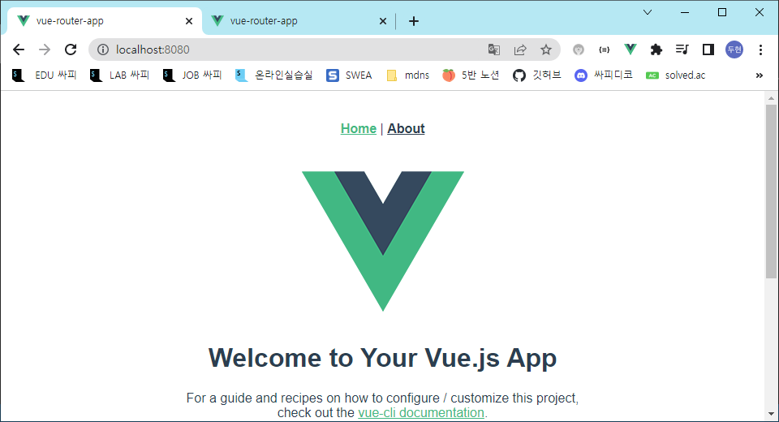
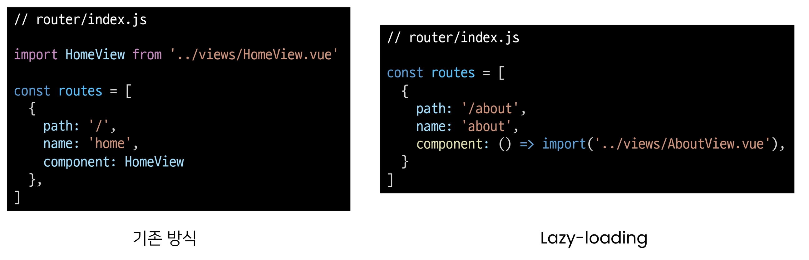
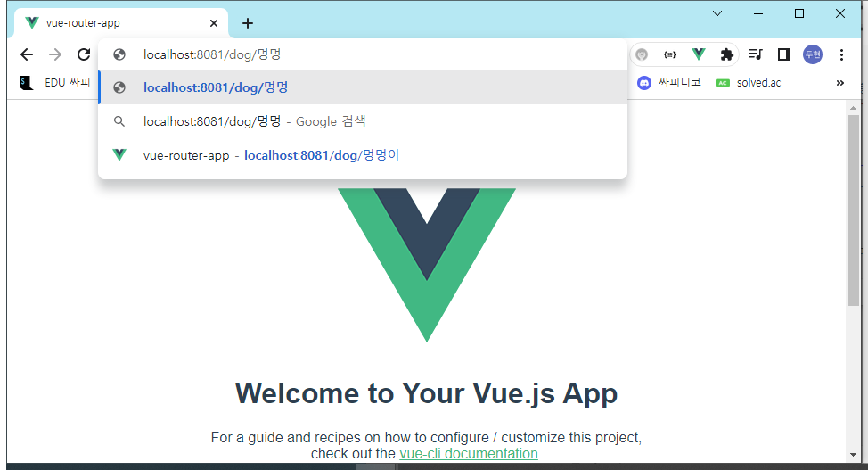
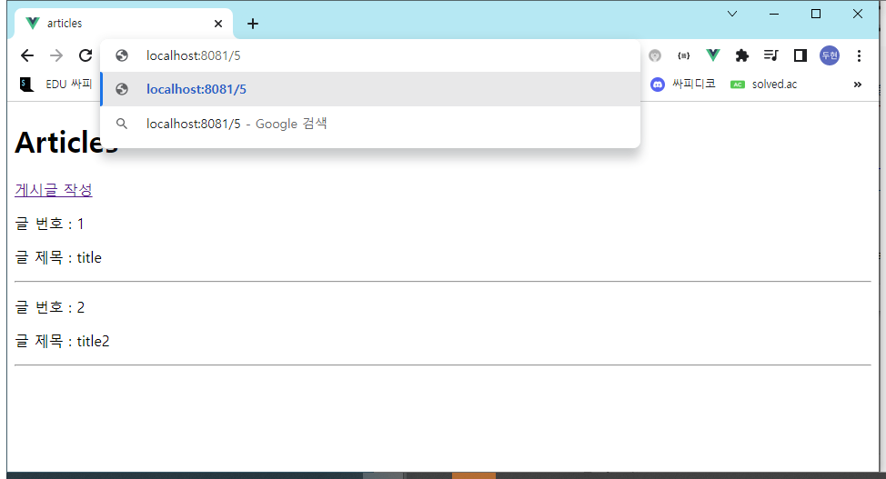

# Vue

## UX & UI

### INTRO

#### 개요

두 개의 같은 기능을 하는 웹사이트가 있을 때, 어느 웹 사이트가 더 사용하기 편할까?

만약 선택을 헀다면 왜 그럴까?


오른쪽

우리는 비슷한 것끼리 묶어나 내용을 구성해서 인지하는 것이 편하다는 것을 알고 있다.

만약 그렇지 않을 경우 불편하다는 느낌을 받거나 의사결정을 하는데 많은 시간이 걸리기도 한다.

이러한 요소들은 유저와 밀접한 부분이기에 매우 중요하며 모든 서비스에서 반드시 고려되어야 한다.

단순한 느낌이나 심미적인 부분만 고려하는 것이 아닌 체계적인 설계를 통해 기획해야 한다.

#### UX & UI

##### UX (User Experience)

"데이터를 보니 사람들이 여기 있는 메뉴바를 잘 사용하지 않는 것 같아. 차라리 크기를 확 줄이거나 위치를 조정해보면 어떨까?"

유저와 가장 가까이에 있는 분야, 데이터를 기반으로 유저를 조사하고 분석해서 개발자, 디자이너가 이해할 수 있게 소통

유저가 느끼는 느낌, 태도 그리고 행동을 디자인

- 백화점 1층에서 느껴지는 좋은 향수 향기
- 러쉬 매장 근처만 가도 맡을 수 있는 러쉬 향기
- 로딩이 너무 길어서 사용하고 싶지 않았던 사이트 등

###### 좋은 UX를 설계하기 위해서는

사람들의 마음과 생각을 이해하고 정리해서 우리 제품에 녹여내는 과정이 필요

유저 리서치, 데이터 설계 및 정제, 유저 시나리오, 프로토타임 설계 등이 필요

##### UI (User Interface)

"메뉴바의 위치는 다른 구성 요소 배치와 함께 생각했을 때 여기가 좋겠어. 유저는 위에서부터 내려와서 여기에서 결정하는 시나리오를 따를 것 같아"

- UX는 사용 빈도를 봤다면 UI는 배치를 봤다

유저에게 보여지는 화면을 디자인

UX를 고려한 디자인을 반영, 이 과정에서 기능 개선 혹은 추가가 필요할 경우 Front-end 개발자와 가장 많이 소통

###### [참고] Interface

서로 다른 두 개의 시스템, 장치 사이에서 정보나 신호를 주고받는 경우의 접점

- 즉, 사용자가 기기를 쉽게 동작시키는데 도움을 주는 시스템

우리 일상 속에 인터페이스 예시

- CLI(command-line interface)나 GUI(Graphic User Interface)를 사용해서 컴퓨터를 조작

###### 좋은 UI를 설계하기 위해서는

예쁜 디자인 즉 심미적인 부분만 중요하다기보다는 사용자가 보다 쉽고 편리하게 사용할 수 있도록 하는 부분까지 고려되어야 함

통일된 디자인을 위한 디자인 시스템, 소통을 위한 중간 산출물, 프로토타입 등이 필요

UI 디자인에 있어 가장 중요한 것은 협업

##### 디자이너와 기획자 그리고 개발자

많은 회사에서 UX/UI 디자인을 함께하는 디자이너를 채용하거나 UX는 기획자, UI는 디자이너의 역할로 채용하기도 함

UX (직무: UX Researcher, User Resertcher)

- (구글) 사용자의 경험을 이애하기 위한 통계 모델을 설계

- (MS) 리서치를 기획하고 사용자의 대한 지표를 정의

- (Meta) 정성적인 방법과 정량적인 방법을 사용해서 사용자 조사를 실시

UI (직무: Product Designer, Interaction Designer)

- (구글) 다양한 디자인 프로토타이핑 툴을 사용해서 개발 가이드를 제공

- (MS) 시각 디자인을 고려해서 체계적인 디자인 컨셉을 보여줌

- (Meta) 제품을 이해하고 더 나은 UI Flow와 사용자 경험을 디자인

개발자는 단순히 기능 개발만 하는 사람이 아니며 제품에 대해 고민하고 소통하는 능력이 반드시 필요

즉 다양한 분야와의 협업이 필수적이기에 기본적인 UX/UI에 대한 이해가 있어야 함

### 생각하는 UX & UI 디자인

만약 유저에 대한 이해없이 기능만을 생각한다면...

UI 디자인은 너무나 깔끔하게 되었으나 UX를 고려하지 않아 유저들은 잔디밭 위로 지름길을 만들어 다녔고 심지어 너무 낳이 다녀ㅓ 잔디마저 모두 사라져버린상황

UX/UI를 디자인 하는 것은 굉장히 섬세하면서 어려운 작업


#### [참고] Can't Unsee

더 나은 UX/UI를 고민해볼 수 있는 웹 사이트

https://cantunsee.space/

#### 학문으로서의 UX & UI

UX와 UI는 단순히 누군가의 직감에 의해서 결정되는 것이 아님

하나의 학문으로서 연구되고 있는 분야이며 심리학과도 밀접한 연관이 있음

UX/UI 그리고 HCI

- GUI: 유저가 보는 일반적인 시각적 디자인
- UI: 유저가 보거나 듣는 등 비시각적인 부분까지 포함한 디자인
- UX: 유저가 겪는 모든 경험(컴퓨터와 관련이 없는 부분까지도 포함)
- HCI(Human Computer Interaction): 인간과 컴퓨터 사이의 상호작용에 대한 학문

점점 더 복잡해지는 기술과 반대로 점점 더 단순하고 대중화 되어야 하는 유저에 대한 경험으로 인해 계속해서 연구되는 중요한 분야

예술에 정답이 없듯, 디자인에도 정답이 정해져 있지 않음

전세계의 많은 디자이너 또는 연구자들이 데이터에 기반해서 연구한 다양한 가이드 존재

예시) Apple의 UI 디자인 원칙

- https://developer.apple.com/kr/design/tips/

### Prototyping

#### Software prototyping

애플리케이션에 프로토타입을 만드는 것

즉 개발중인 소프트웨어 프로그램의 완성되기 전 버전을 만드는 것

한번에 완성 버전이 나올 수 없기에 중간마다 현재 상태를 체크하는 과정

#### Prototyping Tool 시장

UX/UI디자인을 prototyping 하기 위한 도구는 굉장히 많고 빠른 패러다임의 변화로 인해 치열한 경쟁이 계속되고 있음

이전까지는 Sketch라는 툴이 굉장히 많이 사용되었지만, 현재에는 Figma라는 툴이 약 70%의 시장 점유율을 보이고 있음

#### Figma


인터페이스 디자인을 위한 협업 웹 애플리케이션 (2012년 출시)

협업에 중점을 두면서 UX/UI 설계에 초점을 맞춤


##### Why Figma?

웹 기반 시스템을 가짐(웹 환경에서 동작)

- 매우 가벼운 환경에서 실행가능, 모든 작업 내역이 웹에 저장됨

실시간으로 팀원들이 협업할 수 있는 기능을 제공

직관적이고 다양한 디자인 툴을 제공

Figma 사용자들이 만든 다양한 플러그인이 존재 (VSCode의 확장프로그램 등)

대부분의 기능을 무료로 사용할 수 있음

##### Figma 성공의 이유

성능의 희생을 일부 감수하고 웹 기반으로 원할한 협업이 이루어지도록 함

기존 서비스들의 모든 불필요한 과정을 생략하고 디자인 그 자체에만 집중할 수 있게 함

- 이게 디자이너들이 원하던 것

이를 따라잡기 위해 시장 업계 1위 Adobe도 Adobe XD라는 프로그램을 앞세우며 많은 노력을 했지만 경쟁이 불가함을 인정한 Adobe는 결국

Adobe, Figma 28조원에 인수 (2022.09)

#### 프로젝트를 시작하기 전에

개발부터 시작하지 말고 반드시 충분한 기획을 거칠 것

우리가 완성하고자 하는 대략적인 모습을 그려보는 과정이 필요 (프로토타입)

이러한 과정을 통해서 기획에서 빠진 화면이나 API 등을 확인할 수 있음

설계와 기획이 끝난 후 개발을 시작해야 체계적인 진행이 가능함


#### 프로젝트와 협업

협업은 프로젝트와 팀이 성공하기 위한 토대

어떻게 효과적으로 잘 협업할 수 있는지 다양한 방법과 도구를 찾아보고 학습하며 여러 프로젝트를 경험하는 과정이 반드시 필요

## Vue Router

### Routing

#### Routing

네트워크에서 경로를 선택하는 프로세스

웹 서비스에서의 라우팅

- 유저가 방문한 URL에 대해 적절한 결과를 응답하는 것

예시

- /articles/index/에 접근하면 articles의 index에 대한 결과를 보내줌

#### Routing in SSR

Server가 모든 라우팅을 통제

- view함수 redirect, render

URL로 요청이 들어오면 응답으로 완성된 HTML 제공

- Django로 보낸 응답 HTml은 완성본인 상태였음

결론적으로, Routing(URL)에 대한 결정권을 서버가 가짐

#### Routing in SPA / CSR

서버는 하나의 HTML(index.html)만을 제공

이후에 모든 동작은 하나의 HTML 문서 위에서 JavaScript 코드를 활용

- DOM을 그리는데 필요한 추가적인 데이터가 있다면 axios와 같은 AJAX 요청을 보낼 수 있는 도구를 사용하여 데이터를 가져오고 처리

즉, 하나의 URL만 가질 수 있음

#### Why routing?

그럼 동작에 따라 URL이 반드시 바뀌어야 하나?

그렇지는 않다! 단, 유저의 사용성 관점에서는 필요함

Routing이 없다면,

- 유저가 URL을 통한 페이지의 변화를 감지할 수 없음
- 페이지가 무엇을 렌더링 중인지에 대한 상태를 알 수 없음
  - 새로고침 시 처음 페이지로 돌아감
  - 링크를 공유할 시 처음 페이지만 공유 가능
- 브라우저의 뒤로 가기 기능을 사용할 수 없음

### Vue Router

#### Vue Router

Vue의 공식 라우터

SPA 상에서 라우팅을 쉽게 개발할 수 있는 기능을 제공

라우트(routes)에 컴포넌트를 매핑 후, 어떤 URL에서 렌더링 할지 알려줌

- 라우터 1,2,3 컴포넌트 만들고 뭔가 누르면 그 컴포넌트를 보여주고 여러 페이지 보여줌
- 각각 라우터에 URL주소
- 실제로 이동하는건 아니고 보여주는것만 바뀌는 것이다 근본은 같음
- 그러면서 URL도 바뀐다

- 즉, SPA를 MPA처럼 URL을 이동하면서 사용 가능
- SPA의 단점 중 하나인 URL이 변경되지 않는다를 해결

[참고] MPA (Multiple Page Application)

- 여러 개의 페이지로 구성된 애플리케이션
- SSR 방식으로 렌더링

#### Vue Router 시작하기

Vuex와 마찬가지의 방식으로 설치 및 반영

```bash
$vue create vue-router-app
```

```bash
$ cd vue-router-app
```

```bash
$ vue add router
```

```bash
 WARN  There are uncommitted changes in the current repository, it's recommended to commit or stash them first.
? Still proceed? (y/N) 
```

변경사항이 있어서 커밋 권장 - y함

```ba
? Use history mode for router? (Requires proper server setup for index fallback 
in production) (Y/n)
```

history 모두 사용 여부 - Y

#### History mode

브라우저의 History API를 활용한 방식

- 새로고침 없이 URL 이동 기록을 남길 수 있음

우리에게 익숙한 URL 구조로 사용 가능

- 예시)http://localhost:8080/index

[참고] History mode를 사용하지 않으면 Default값인 hash mode로 설정됨('#'를 통해 URL을 구분하는 방식)

- 예시)http://localhost:8080#index

- 일반 url모드에서는 문서 특정 위치의 북마크 역할이었음

App.vue

헬로월드가 없고 nav바에 router-link랑 router-view가 생겨있음

스크립트가 없어짐

파일트리

- router폴더

  - index.js있음

    ```javascript
    import Vue from 'vue'
    import VueRouter from 'vue-router'
    import HomeView from '../views/HomeView.vue'
    
    Vue.use(VueRouter)
    
    const routes = [
      {
        path: '/',
        name: 'home',
        component: HomeView
      },
      {
        path: '/about',
        name: 'about',
        // route level code-splitting
        // this generates a separate chunk (about.[hash].js) for this route
        // which is lazy-loaded when the route is visited.
        component: () => import(/* webpackChunkName: "about" */ '../views/AboutView.vue')
      }
    ]
    
    const router = new VueRouter({
      mode: 'history',
      base: process.env.BASE_URL,
      routes
    })
    
    export default router
    ```

    - routes라는 변수가 있고 이것저것 있음
    - django의 urls.py와 비슷
    - 각 컴포넌트의 경로를 지정

- views폴더 있음

```bash
$npm run server
```


위에 링크 생김

누르면


URL도 바뀜

하지만 페이지 바뀐걸까

안바뀜 컴퍼넌트만 바뀐것 SPA는 페이지 하나

보여주는 화면이 바뀌고 URL이 바꿔서 이동했다는 느낌을 받도록 한것

이제 뒤로가기 가능 URL이 기록되기 때문에


태그보면 a태그인데 실제 이동은 하는게 아니니 기본 기능은 막혀있음


#### router-link

a 태그와 비슷한 기능 -> URL을 이동시킴

- routes에 등록된 컴포넌트와 매핑됨
- 히스토리 모드에서 router-link는 클릭 이벤트를 차단하여 a 태그와 달리 브라우저가 페이지를 다시 로드하지 않도록 홈

목표 경로는 'to'속성으로 지정됨

기능에 맞게 HTML에서 a 태그로 rendering 되지만, 필요에 따라 다른 태그로 바꿀 수 있음

#### router-link

주어진 URL에 대해 일치하는 컴포넌트를 렌더링하는 컴포넌트

렌더링될 위치

- 하나밖에 없음

- 동시에 렌더링되는 것이 아니기 때문

실제 component가 DOM에 부착되어 보이는 자리를 의미

router-link를 클릭하면 routes에 매핑된 컴포넌트를 렌더링

Django에서의 block tag와 비슷함

링크올리면 보여지는게 위로 올라감

- App.vue는 base.html의 역할
- router-view는 block태그로 감싼 부분


#### src/router/index.js

Django에서의 urls.py에 해당


path있고 name있고 컴퍼넌트 있는게

path있고 name있고 urls있던 urls.py와 비슷

라우터 관련된 정보 및 설정이 적성되는 곳

routes에 URL과 컴포넌트를 매핑

- 어떤 url를 입력하면 어떤 컴포넌트를 보여주겠다


#### src/Views

router-view에 들어갈 component 작성

기존에 컴포넌트를 작성하던 곳은 components 폴더 뿐이었지만 이제 두 폴더로 나뉘어짐

각 폴더 안의 .vue파일들이 기능적으로 다른 것은 아님

- 그냥 분리

- views에 들어가는 것들은 라우터에 매핑되는 애들 그 하위 컴포넌트들은 component

- 라우터에 직접적으로 연결되는 컴포넌트랑 아닌 컴포넌트들 나눈것

이제 폴더별 컴포넌트 배치는 다음과 같이 진행 (규약은 아님)

views/

- routes에 매핑되는 컴포넌트, 즉 `<router-view>`의 위치에 렌더링되는 컴포넌트를 모아두는 폴더
- 다른 컴포넌트와 구분하기 위해 View로 끝나도록 만드는 것을 권장
  - 코드짤때 이름으로도 알 수 있도록
  - 뮤테이션에서 상수로 대문자로 했던것처럼
- ex) App 컴포넌트 내부의 AboutView & HomeView 컴포넌트

components/

- routes에 매핑된 컴포넌트의 하위 컴포넌트를 모아두는 폴더
- ex) HomeView 컴포넌트 내부의 HelloWorld 컴포넌트

### 실습

#### 주소를 이동하는 2가지 방법

1. 선언적 방식 네비게이션
2. 프로그래밍 방식 네비게이션

#### 선언적 방식 네비게이션

router-link의 'to' 속성으로 주소 전달

- routes에 등록된 주소와 매핑된 컴포넌트로 이동
- 이미 기본 페이지에 사용중

#### Named Routes

이름을 갖는 routes

- Django에서 path 함수의 name 인자의 활용과 같은 방식

to에 문자열 입력하는 것이 아님

#### 선언적 방식 네비게이션

주소가 많으면 외우기 힘드니까 이름으로 접근하게

동적인 값을 사용하기 때문에 v-bind를 사용해야 정상적으로 작동

원래

```html
  <div id="app">
    <nav>
      <router-link to="/">Home</router-link> |
      <router-link to="/about">About</router-link>
    </nav>
    <router-view/>
  </div>
```

변한 후

```html
  <div id="app">
    <nav>
      <router-link :to="{ name: 'home' }">Home</router-link> |
      <router-link :to="{ name: 'about' }">About</router-link>
    </nav>
    <router-view/>
  </div>
```


그래도 링크 그대로되어있고 눌러도 그대로 이동함

#### 프로그래밍 방식 네비게이션

Vue 인스턴스 내부에서 라우터 인스턴스에 $router로 접근할 수 있음

다른 URL로 이동하려면 this.$router.push를 사용

- history stack에 이동할 URL을 넣는(push)방식
- history stack에 기록이 남기 때문에 사용자가 브라우저의 뒤로 가기 버튼을 클릭하면 이전 URL로 이동할 수 있음

결국 `<router-link : to="...">`를 클릭하는 것과

$router.push(...)를 호출하는 것은 같은 동작

AboutView.vue

스크립트 만들어주고

이름 넣어줌

```vue
export default {
  name: 'AboutView',
  methods: {
    toHome() {
      this.$router.push( { name: 'home'})
    }
  }
}
```

그리고 템플릿에 버튼 만들고 클릭 메소드 연결 해주고

```html
    <button @click='toHome'>홈으로!</button>
```

그 메소드로 라우터 푸시 넣어줌

```vue
  methods: {
    toHome() {
      this.$router.push( { name: 'home'})
    }
  }
```

최종 

AboutView.vue

```vue
<template>
  <div class="about">
    <h1>This is an about page</h1>
    <button @click='toHome'>홈으로!</button>
  </div>
</template>

<script>
export default {
  name: 'AboutView',
  methods: {
    toHome() {
      this.$router.push( { name: 'home'})
    }
  }
}
</script>
```


누르면 홈으로 감



```html
  <div class="about">
    <h1>This is an about page</h1>
    <router-link :to="{ name: 'home' }">홈으로!</router-link> |
    <button @click='toHome'>홈으로!</button>
  </div>
```

두개 결국 똑같은것

#### Dynamic Route Matching

동적 인자 전달

- URL의 특정 값을 변수처럼 사용할 수 있음

Django에서의 variable routing

index.js

routes에

```javascript
  {
    path: '/hello/:userName',
    name: 'hello',
    component: 
  }
```

추가

여기서 :userName이 동적 인자임

HelloView.vue만듬

라우터에 직접 연결되니까 views 폴더에 만듬

빈 div 넣어주고 이름 설정 기본해줌

```vue
<template>
  <div></div>
</template>

<script>
export default {
  name: 'HelloView',
}
</script>

<style>

</style>
```

이제 routes 컴포넌트 채우기

```vue
import HelloView from '@/views/HelloView'
```

위에 가져오고

```vu
    component: HelloView
```


최종

```vue
import Vue from 'vue'
import VueRouter from 'vue-router'
import HomeView from '../views/HomeView.vue'
import HelloView from '@/views/HelloView'

Vue.use(VueRouter)

const routes = [
  ...
  {
    path: '/hello/:userName',
    name: 'hello',
    component: HelloView
  }
]

const router = new VueRouter({
  mode: 'history',
  base: process.env.BASE_URL,
  routes
})

export default router

```

$route.params로 변수에 접근 가능

HelloView.vue

username을 여기에 출력해봄

```vue
    <h1>hello, {{ $route.params.userName }}</h1>
```

넣음

최종

```vue
<template>
  <div>
    <h1>hello, {{ $route.params.userName }}</h1>
  </div>
</template>

<script>
export default {
  name: 'HelloView',
}
</script>

<style>

</style>
```


url에 있는 값을 가져올 수 있음

이렇게 직접하는것보다는 data에서 정의하고 가져다 쓰는게 좋은 방식

스크립트에

```vue
  data() {
    return {
      userName: this.$route.params.userName
    }
  }
```

넣어주고

템플릿

```vue
    <h1>hello, {{ userName }}</h1>
```

최종

```vue
<template>
  <div>
    <h1>hello, {{ userName }}</h1>
  </div>
</template>

<script>
export default {
  name: 'HelloView',
  data() {
    return {
      userName: this.$route.params.userName
    }
  },
}
</script>

<style>

</style>
```


똑같이 작동

이제 페이지로 갈 수 있는 링크도 만들어줌

##### 선언적 방식 네비게이션

App.vue

router-link 만들어주는데 이건 파라미터도 필요함 

params도 넣어줌

```vu
      <router-link :to="{ name: 'hello', params: {userName: 'ssafy'} }">Hello</router-link>
```

최종 App.vue

```vue
<template>
  <div id="app">
    <nav>
      <router-link :to="{ name: 'home' }">Home</router-link> |
      <router-link :to="{ name: 'about' }">About</router-link> |
      <router-link :to="{ name: 'hello', params: {userName: 'ssafy'} }">Hello</router-link>
    </nav>
    <router-view/>
  </div>
</template>

<style>
#app {
  font-family: Avenir, Helvetica, Arial, sans-serif;
  -webkit-font-smoothing: antialiased;
  -moz-osx-font-smoothing: grayscale;
  text-align: center;
  color: #2c3e50;
}

nav {
  padding: 30px;
}

nav a {
  font-weight: bold;
  color: #2c3e50;
}

nav a.router-link-exact-active {
  color: #42b983;
}
</style>

```

이러고 홈에서 Hello 누르면


이동함

지금은 ssafy로 고정했는데 입력도 변수로 바꾸고 그 변수에 입력하도록 할 수 있음

##### 프로그래밍 방식 네비게이션

AboutView.vue

입력될 데이터를 만들어줌

```vue
  data() {
    return {
      inputData: null,
    }
  },
```

input태그 만들어주고 양방향 바인딩 v-model로 해줌

```vue
    <input
      type="text"
      v-model="message"
    >
```

엔터 눌렀을때 메서드 가도록 설정

```vue
    <input
      type="text"
      @keyup.enter='toHello'
      v-model="inputData"
    >
```

이제 그 메소드 가면 Hello로 가도록

파람스에 들어갈 때는 data에서 가져오는 this.inputData로 함

```vue
    toHello() {
      this.$router.push( { name: 'hello', params: {userName: this.inputData } })
    }
```

```vue
this.$router.push({ path:`hello/${this.inputData}`} )
```

이것도 되긴한데 이름, 파람으로 가라

#### route에 컴포넌트를 등록하는 또다른 방법



##### lazy-loading

모든 파일을 한 번에 로드하려고 하면 모든 걸 다 읽는 시간이 매우 오래 걸림

이 방식은 들어갔을때야 로딩함

미리 로드를 하지 않고 특정 라우트에 방문할 때 매핑된 컴포넌트의 코드를 로드하는 방식을 활용할 수 있음

- 모든 파일을 한 번에 로드하지 않아도 되기 때문에 최초에 로드하는 시간이 빨라짐

- 당장 사용하지 않을 컴포넌트는 먼저 로드하지 않는 것이 핵심
- 컴포넌트가 너무 큰게 있거나 너무 많으면 굳이 처음에 로딩시킬 필요는 없을 때 사용

## Navigation Guard

### 네비게이션 가드

Vue router를 통해 특정 URL에 접근할 때 다른 url로 redirect를 하거나 해당 URL로의 접근을 막는 방법

- ex) 사용자의 인증 정보가 없으면 특정 페이지에 접근하지 못하게 함

https://v3.router.vuejs.org/guide/advanced/navigation-guards.html

#### 네비게이션 가드의 종류

**전역 가드**

애플리케이션 전역에서 동장

**라우터 가드**

특정 URL에서만 동작

**컴포넌트 가드**

라우터 컴포넌트 안에 정의

#### 전역 가드

##### Global Before Guard

다른 url 주소로 이동할 때 항상 실행

router/index.js에 router.beforeEach()를 사용하여 설정

콜백 함수의 값으로 다음과 같이 3개의 인자를 받음

- to: 이동할 URL 정보가 담긴 Route 객체
- from: 현재 URL 정보가 담긴 Route 객체
- next: 지정한 URL로 이동하기 위해 호출하는 함수
  - 콜백 함수 내부에서 반드시 한번만 호출되어야 함
  - 기본적으로 to에 해당하는 URL로 이동

```javascript
const router = new VueRouter({
  mode: 'history',
  base: process.env.BASE_URL,
  routes
})
```

```javascript
export default router
```

두개 사이에 써야함 router 선언 이후에 해야해서

```javascript
router.beforeEach((to, from, next) => {
  console.log('to',to)
  console.log('from',from)
  console.log('next',next)
})
```

전체

index.js

```javascript
import Vue from 'vue'
import VueRouter from 'vue-router'
import HomeView from '../views/HomeView.vue'
import HelloView from '@/views/HelloView'

Vue.use(VueRouter)

const routes = [
  {
    path: '/',
    name: 'home',
    component: HomeView
  },
  {
    path: '/about',
    name: 'about',
    // route level code-splitting
    // this generates a separate chunk (about.[hash].js) for this route
    // which is lazy-loaded when the route is visited.
    component: () => import(/* webpackChunkName: "about" */ '../views/AboutView.vue')
  },
  {
    path: '/hello/:userName',
    name: 'hello',
    component: HelloView
  }
]

const router = new VueRouter({
  mode: 'history',
  base: process.env.BASE_URL,
  routes
})

router.beforeEach((to, from, next) => {
  console.log('to',to)
  console.log('from',from)
  console.log('next',next)
})

export default router

```


이렇게 출력해보면


about누르고 출력 보면 화면 전환은 안되고 콘솔 출력이 됨


to에는 fullpath가 about있고

from은 /이니까 home임

이 두개는 라우트 객체

next는 함수다 이동할 때 이 함수를 호출

이건 전역이라 어딜가든지 호출됨


URL이 변경되어 화면이 전환되기 전 router.beforEach()가 호출됨

- 화면이 전환되지 않고 대기 상태가 됨

변경된 URL로 라우팅하기 위해서는 next()를 호출해줘야 함

- next()가 호출되기 전까지 화면이 전환되지 않음
- 그래야 to쪽으로 화면이 넘어감

```vue
  next()
```

추가해서 

```javascript
router.beforeEach((to, from, next) => {
  console.log('to',to)
  console.log('from',from)
  console.log('next',next)
  next()
})
```

해주면 그때서야 화면 뜸

이때 url 변경 안할때 home에 있는데 home누를때는 함수 호출이 안됨(console로 확인)

할수 있는일 - 로그인 여부에 따라서 보내는 곳 다르게 하기

##### Login여부에 따른 라우팅 처리

지금 백엔드랑 같이 하는건 아니니까 그냥 true/false로 실습

LoginView.vue 만들어주기

이름 넣어주고

```vue
<template>
  <h1>로그인 페이지</h1>
</template>

<script>
export default {
  name: 'LoginView'
}
</script>

<style>

</style>
```

라우터 등록

router/index.js

```javascript
  {
    path: '/login',
    name: 'login',
    component: 
  },
]
```

넣어주고

```javascript
import LoginView from '@/views/LoginView'
```

가져오고

```javascript
  {
    path: '/login',
    name: 'login',
    component: LoginView
  },
```

component까지 넣어줌

이제 /login갔을때 LoginView로 감

이제 라우터 링크

App.vue

```vue
      <router-link :to="{ name: 'login' }">Login</router-link>
```

추가

그러면 이제 login 페이지는 뜸


index.js

```javascript
router.beforeEach((to, from, next) => {

})
```

함수 수정

로그인 이후

```javascript
  const isLoggedIn = true
```

로그인이 필요한 페이지 목록을 만들고 hello를 넣어줌

```javascript
  const authPages = ["hello"]
```

이제 이동할 페이지가 로그인이 필요한 페이지 목록에 있는 곳인지 확인

```javascript
  const isAuthRequired = authPages.includes(to.name)
```

로그인이 되어있다면 그 페이지로 안되어 있다면 로그인 페이지로

next안에 파라미터 넣어주면 이동

```javascript
  if (isAuthRequired && !isLoggedIn) {
    next({ name: 'login'})
  } else {
    next()
  }
```

최종

index.js

```javascript
import Vue from 'vue'
import VueRouter from 'vue-router'
import HomeView from '../views/HomeView.vue'
import HelloView from '@/views/HelloView'
import LoginView from '@/views/LoginView'

Vue.use(VueRouter)

const routes = [
  {
    path: '/',
    name: 'home',
    component: HomeView
  },
  {
    path: '/about',
    name: 'about',
    // route level code-splitting
    // this generates a separate chunk (about.[hash].js) for this route
    // which is lazy-loaded when the route is visited.
    component: () => import(/* webpackChunkName: "about" */ '../views/AboutView.vue')
  },
  {
    path: '/hello/:userName',
    name: 'hello',
    component: HelloView
  },
  {
    path: '/login',
    name: 'login',
    component: LoginView
  },
]

const router = new VueRouter({
  mode: 'history',
  base: process.env.BASE_URL,
  routes
})

router.beforeEach((to, from, next) => {
  // 로그인 이후 일단 설정
  const isLoggedIn = true
  // 로그인이 필요한 페이지
  const authPages = ["hello"]
  
  const isAuthRequired = authPages.includes(to.name)

  if (isAuthRequired && !isLoggedIn) {
    next({ name: 'login'})
  } else {
    next()
  }
})

export default router
```


이상태에서 hello가봄


잘 가짐

로그인 안된 상태에는 어떤지 보기 위해 

```javascript
  const isLoggedIn = false
```

로 바꿔줌

이상태에서 Hello누르면


로그인 페이지로 감

콘솔 찍어보기

```javascript
router.beforeEach((to, from, next) => {
  // 로그인 이후 일단 설정
  const isLoggedIn = false
  // 로그인이 필요한 페이지
  const authPages = ["hello"]
  
  const isAuthRequired = authPages.includes(to.name)

  if (isAuthRequired && !isLoggedIn) {
    console.log('login으로 이동!')
    next({ name: 'login'})
  } else {
    console.log('to로 이동!')
    next()
  }
})
```

이러고 home에서 hello 누르면


login으로 이동후에 to로 이동도 뜸

첫번째 출력은 /hello/{}로 접속시도 후 전역가드에 막히는데 전역 가느에서 login으로 이동 요청할 때 출력

두번째 출력은 /login으로 이동할 때 출력

authPages 리스트 안에 다른 페이지 이름도 넣어버리면 그 페이지도 로그인 여부에 따라 로그인 페이지로 이동함

```javascript
  const authPages = ["hello", "home"]
```

이런식으로

반대로 로그인하지 않아도 되는 페이지들로 지정할 수도 있음

```javascript
router.beforeEach((to, from, next) => {
  // 로그인 이후 일단 설정
  const isLoggedIn = false
  // 로그인이 필요한 페이지
  const allowAllPaged=['login']
  
  const isAuthRequired = !allowAllPaged.includes(to.name)

  if (isAuthRequired && !isLoggedIn) {
    console.log('login으로 이동!')
    next({ name: 'login'})
  } else {
    console.log('to로 이동!')
    next()
  }
})
```

#### 라우터 가드

전체 route가 아닌 특정 route에 대해서만 가드를 설정하고 싶을 때 사용

beforeEnter()

- route에 진입했을 때 실행됨
- 라우터를 등록한 위치에 추가
- 단 매개벼녀수, 쿼리, 해시 값이 변경될 때는 실행되지 않고 다른 경로에서 탐색할 때만 실행됨
  - 이 경로 안에 있을 때는 안됨
- 콜백 함수는 to, from, next를 인자로 받음

##### Login 여부에 따른 라우팅 처리

이미 로그인 되어있는 경우 HomeView로 이동하기

index.js

라우터 가드 실습을 위해 전역 가드 실습코드는 주석처리

const routes 위에

```javascript
const isLoggedIn = true
```

해서 로그인 상태라고 치고

routes안에 로그인 페이지 등록한 곳

```javascript
    beforeEnter(to, from, next) {
      if (isLoggedIn) {
        console.log('이미 로그인 되어있음')
        next({name: 'home'})
      } else {
        next()
      }
    }
```

추가해서

```javascript
{
    path: '/login',
    name: 'login',
    component: LoginView,
    beforeEnter(to, from, next) {
      if (isLoggedIn) {
        console.log('이미 로그인 되어있음')
        next({name: 'home'})
      } else {
        next()
      }
    }
  },
```

로그인 되어있으면 home으로 가고 아니면 

그냥 로그인 페이지로 감

이건 로그인 페이지 갈때만 작동 다른 페이지 이동할땐 안작동

지금 로그인 되었다고 친 상태

```javascript
import Vue from 'vue'
import VueRouter from 'vue-router'
import HomeView from '../views/HomeView.vue'
import HelloView from '@/views/HelloView'
import LoginView from '@/views/LoginView'

Vue.use(VueRouter)

const isLoggedIn = true

const routes = [
  {
    path: '/',
    name: 'home',
    component: HomeView
  },
  {
    path: '/about',
    name: 'about',
    // route level code-splitting
    // this generates a separate chunk (about.[hash].js) for this route
    // which is lazy-loaded when the route is visited.
    component: () => import(/* webpackChunkName: "about" */ '../views/AboutView.vue')
  },
  {
    path: '/hello/:userName',
    name: 'hello',
    component: HelloView
  },
  {
    path: '/login',
    name: 'login',
    component: LoginView,
    beforeEnter(to, from, next) {
      if (isLoggedIn) {
        console.log('이미 로그인 되어있음')
        next({name: 'home'})
      } else {
        next()
      }
    }
  },
]

const router = new VueRouter({
  mode: 'history',
  base: process.env.BASE_URL,
  routes
})


export default router

```

이상태로 로그인 누르면


홈으로 가버림

해당되는 라우터에 작성을 하고 그 라우터 쓸때 작동

#### 컴포넌트 가드

##### 컴포넌트 가드

특정 컴포넌트 내에서 가드를 지정하고 싶을 때 사용

beforeRouteUpdate()

- 해당 컴포넌트를 렌더링하는 경로가 변경될 때 실행

##### Params 변화 감지

about에서 jun에게 인사하는 페이지로 이동


이때 hello 누르면 

`http://localhost:8081/hello/ssafy`로 URL바뀌었는데 화면은 ssafy로 안바뀜


변수값만 바뀐건 vue가 인식 못하고 hello/까지만 봄 url이 전환됐다고 생각을 안함

그래서 렌더링이 못따라감

이걸 가드로 처리해줌

변화하지 않는 이유

- 컴포넌트가 똑같은거면 그냥 재사용함

- vue에서는 그냥 지우고 하지 않고 그냥 재사용

- 기존 컴포넌트를 지우고 새로 만드는 것보다 효율적

  - 단, lifecycle hook이 호출되지 않음

  - 따라서, $route.params에 있는 데이터를 새로 가져오지 않음

beforeRouteUpdate()를 사용해서 처리

- userName을 이동할 params에 있는 userName으로 재할당

views/HelloView.vue에 작성

```vue
export default {
  name: 'HelloView',
  data() {
    return {
      userName: this.$route.params.userName
    }
  },

}
```

여기에

```vue
  beforeRouteUpdate(to, from, next) {
    
  }
```

넣어줌

최종

```vue
<template>
  <div>
    <h1>hello, {{ userName }}</h1>
  </div>
</template>

<script>
export default {
  name: 'HelloView',
  data() {
    return {
      userName: this.$route.params.userName
    }
  },
  beforeRouteUpdate(to, from, next) {
    this.userName = to.params.userName
    next()
  }
}
</script>

<style>

</style>
```


userName을 to객체 안에 있는 userName으로 바꿔줌


에서 헬로 누르면


잘 바뀜

경로가 변경될때(hello/harry -> hello/saffy)실행하는 함수이다

#### 404 NOT FOUND

##### 404 NOT FOUND

사용자가 요청한 리소스가 존재하지 않을 때 응답

컴퍼넌트 일단 만듦

views에 NotFound404.vue만듦

```vue
<template>
  <div>
    <h1>404 Not Found</h1>
  </div>
</template>

<script>
export default {
  name : 'NotFound404'
}
</script>

<style>

</style>
```

router/index.js

```javascript
  {
    path: '/NotFound404',
    name: 'NotFound404',
    component: 
  },
```

추가하고

가져오고

```javascript
import NotFound404 from '@/views/NotFound404'
```

component 써줌

```javascript
  {
    path: '/404',
    name: 'NotFound404',
    component: NotFound404
  },
```


모든 경로에 대해서 404 페이지로 리다이렉트 시켜보기

라우터 하나더 만들고

path에 애프터리스크 넣으면 모든경로로 보내게 됨

```javascript
{
  path: '*',
  
}
```

404로 리다이렉트

```javascript
  redirect: '/404'
```

이렇게 넣고 없는 페이지 들어가면


처리할 수 없는 페이지 가면 404 가고

다른 페이지들은 정상적으로 작동

##### 형식은 유효하지만 특정 리소스를 찾을수 없는 경우

예시) Django에게 articles/1/로 요청을 보냈지만, 1번 게시글이 삭제된 상태

- 이때는 path: "*"를 만나 404 page가 렌더링 되는 것이 아니라 기존에 명시한 articles/:id/에 대한 components가 렌더링됨
- 하지만 데이터가 존재하지 않기 때문에 정상적으로 렌더링이 되지 않음

해결책

- 데이터가 없음을 명시
- 404 page로 이동해야 함

애프터리스크로 한건 위에서 없는 형식일 때 보내는 것인데

장고 예시를 볼때 데이터 없는데 형식 자체는 유효함 그래도 404로 가야하는 상황

- 그래서 기존 component로 렌더링되고 제대로 안됨

Dog API 문서를 참고하여 동적 인자로 강아지 품종을 전달해 품종에 대한 랜덤 이미지를 출력하는 페이지를 만들어보기

https://dog.ceo/dog-api/

views/DogView.vue 만들기

```vue
<template>
  <div>

  </div>
</template>

<script>
export default {
  name: 'DogView',
}
</script>

<style>

</style>
```

index.js

라우터에 추가

이때 애프터리스크로 한거 위에 있어야 함

```javascript
import Vue from 'vue'
import VueRouter from 'vue-router'
import HomeView from '../views/HomeView.vue'
import HelloView from '@/views/HelloView'
import LoginView from '@/views/LoginView'
import NotFound404 from '@/views/NotFound404'
import DogView from '@/views/DogView'

Vue.use(VueRouter)

const isLoggedIn = true

const routes = [
	...
  {
    path: '/dog/:breed',
    name: 'dog',
    component: DogView,
  },
  {
    path: '*',
    redirect: '/404'
  },
]

const router = new VueRouter({
  mode: 'history',
  base: process.env.BASE_URL,
  routes
})


export default router

```

https://dog.ceo/dog-api/breeds-list

에서 품종

DogView.vue

```vue
    
```

이미지 태그 넣고 

axios 쓰려는데 쓰려면 설치

```bash
$ npm i axios
```

import

```vue
import axios from 'axios'
```

스크립트에 아까 바인드 한 data 만들어주고 이미지 태그에 src 추가바인드

```vue
  data() {
    return {
      imgSrc: null
    }
  }
```

```vue
    
```


파라미터에서 breed 가져오고 API 주소 가져옴

```vue
const breed = this.$route.params.breed
      const dogImageUrl = `https://dog.ceo/api/breed/${breed}/images/random`
```

액시오스

```vue
      axios({
        method: 'get',
        url: dogImageUrl,
      })
        .then((response) => {
          console.log(response)
        })
        .catch((error) => {
          console.log(error)
        })
```

```vue
  created() {
    this.getDogImage()
  }
```

추가해서 로드될때 실행되게


data 가져올 위치 확인

.then안에

```vue
          const imgSrc = response.data.message
          this.imgSrc = imgSrc
```

써서 imgSrc 바꾸도록 함


로딩중이다 화면 만들기

data에

```vue
  data() {
    return {
      imgSrc: null,
      message: '로딩중',
    }
```

해주고

위에 p태그로

```vue
    <p v-if="!imgSrc">{{ message }}</p>
```

해주면 사진 안뜨는 동안 로딩중 뜸

최종

```vue
<template>
  <div>
    <p v-if="!imgSrc">{{ message }}</p>
    
  </div>
</template>

<script>
import axios from 'axios'

export default {
  name: 'DogView',
  data() {
    return {
      imgSrc: null,
      message: '로딩중',
    }
  },
  methods: {
    getDogImage() {
      const breed = this.$route.params.breed
      const dogImageUrl = `https://dog.ceo/api/breed/${breed}/images/random`

      axios({
        method: 'get',
        url: dogImageUrl,
      })
        .then((response) => {
          console.log(response)
          const imgSrc = response.data.message
          this.imgSrc = imgSrc
        })
        .catch((error) => {
          console.log(error)
        })
    }
  },
  created() {
    this.getDogImage()
  }
}
</script>

<style>

</style>
```


이제 캐치에 이 메시지 이용해서 오류났을 페이지 설정

```vue
        .catch((error) => {
          this.message = `${this.$route.params.breed}은 없는 품종입니다`
          console.log(error)
        })
```


이렇게보다 사실 404에 보내는게 낫다

주소는 틀리지 않은데 리소스가 없는 경우니까 404동작해야 함

catch에 route를 이동해줌

```vue
        .catch((error) => {
          // this.message = `${this.$route.params.breed}은 없는 품종입니다`
          this.$router.push('/404')
          console.log(error)
        })
```

push는 $router에 있다는것 $route랑 헷갈리면 안됨

```vue
<template>
  <div>
    <p v-if="!imgSrc">{{ message }}</p>
    
  </div>
</template>

<script>
import axios from 'axios'

export default {
  name: 'DogView',
  data() {
    return {
      imgSrc: null,
      message: '로딩중',
    }
  },
  methods: {
    getDogImage() {
      const breed = this.$route.params.breed
      const dogImageUrl = `https://dog.ceo/api/breed/${breed}/images/random`

      axios({
        method: 'get',
        url: dogImageUrl,
      })
        .then((response) => {
          console.log(response)
          const imgSrc = response.data.message
          this.imgSrc = imgSrc
        })
        .catch((error) => {
          // this.message = `${this.$route.params.breed}은 없는 품종입니다`
          this.$router.push('/404')
          console.log(error)
        })
    }
  },
  created() {
    this.getDogImage()
  }
}
</script>

<style>

</style>
```


이렇게 하면




## Articles with Vue

### 개요

지금까지 배운 내용들을 종합하여 Django에서 만들었던 게시판 만들기

구현기능

- index
- Create
- Detail
- Delete
- 404

컴포넌트 구성


### 사전 준비

프로젝트 시작

```bash
$ vue create articles
$ cd articles
$ vue add vuex
$ vue add router
```

App.vue는 이렇게만 남김

```vue
<template>
  <div id="app">
    <router-view/>
  </div>
</template>
```

### Index

store/index.js

index.js 두개라 잘봐야한다

state에 

```javascript
    articles: [
      {
        id: 1,
        title: 'title',
        content: 'content',
        createdAt: new Date().getTime(),
      },
      {
        id: 2,
        title: 'title2',
        content: 'content2',
        createdAt: new Date().getTime(),
      },
    ]
```

추가

장고 데이터베이스 쓰는게 아니라서 임의로 다음에 추가될 article_id 여기 써줌

```javascript
state: {
    article_id: 3,
    articles: [
      {
        id: 1,
        title: 'title',
        content: 'content',
        createdAt: new Date().getTime(),
      },
      {
        id: 2,
        title: 'title2',
        content: 'content2',
        createdAt: new Date().getTime(),
      },
    ]
  },
```

indexView컴퍼넌트 작성

IndexView.vue

```vue
<template>
<div>
  <h1>Articles</h1>
</div>
</template>

<script>
export default {
  name: 'IndexView'
}
</script>

<style>

</style>
```

이제 router/index.js 가서 등록

```javascript
import Vue from 'vue'
import VueRouter from 'vue-router'
import IndexView from '../views/IndexView.vue'

Vue.use(VueRouter)

const routes = [
  {
    path: '/',
    name: 'index',
    component: IndexView
  },
]

const router = new VueRouter({
  mode: 'history',
  base: process.env.BASE_URL,
  routes
})

export default router
```

IndexView.vue

computed로 state에 있는 데이터 가져옴

```vue
  computed: {
    articles() {
      return this.$store.state.articles
    }
  }
```

그리고 출력

```vue
  {{ articles }}
```

IndexView.vue

```vue
<template>
<div>
  <h1>Articles</h1>
  {{ articles }}
</div>
</template>

<script>
export default {
  name: 'IndexView',
  computed: {
    articles() {
      return this.$store.state.articles
    }
  }
}
</script>

<style>

</style>
```


이제 prop으로 ArticleItem.vue에 내려줌

얘는 라우터랑 직접적으로 안 이어지므로 components 폴더에 만들어줌

```vue
<template>
  <div></div>
</template>

<script>
export default {
  name: 'ArticleItem',
}
</script>

<style>

</style>
```

부모 컴퍼넌트에 등록

IndexView.vue

import하고

```vue
import ArticleItem from '@/components/ArticleItem'
```

등록하고

```vue
  components: {
    ArticleItem
  },
```

출력

```vue
  <ArticleItem
  />
```

v-for로 내려줌

```vue
  <ArticleItem
    v-for="article in articles"
    :key='article.id'
    :article=article
  />
```

ArticleItem.vue에서 props로 받아줌

```vue
  props: {
    article: Object,
  }
```

템플릿에 출력

```vue
    <p>글 번호 : {{ article.id }}</p>
    <p>글 제목 : {{ article.title }}</p>
```

ArticleItem.vue

```vue
<template>
  <div>
    <p>글 번호 : {{ article.id }}</p>
    <p>글 제목 : {{ article.title }}</p>
    <hr>
  </div>
</template>

<script>
export default {
  name: 'ArticleItem',
  props: {
    article: Object,
  }
}
</script>

<style>

</style>
```


### Create

CreateView 컴퍼넌트 및 라우터 작성

views에 CreateView.vue 만듦

```vue
<template>
 <div>
  <h1>게시글 작성</h1>
 </div>
</template>

<script>
export default {
  name: 'CreateView'
}
</script>

<style>

</style>
```

라우터 등록

```javascript
import CreateView from '../views/CreateView.vue'
```

```javascript
  {
    path: '/create',
    name: 'create',
    component: CreateView
  },
```

이제 폼 입력 받아야 함

CreateView.vue

```vue
<template>
 <div>
  <h1>게시글 작성</h1>
  <form>
    <input type="text"><br>
    <textarea></textarea>
    <input type="submit">
  </form>
 </div>
</template>
```


입력할 데이터 넣어주기

```vue
  data() {
    return {
      title: null,
      content: null,
    }
  }
```

양방향 바인딩 두개

v-model.trim로 공백 제거

```vue
    <input type="text" v-model.trim="title"><br>
    <textarea v-model.trim="content"></textarea>
```

기존 서브밋 이벤트 취소하고 다른 이벤트 호출

```vue
  <form @submit.prevent="createArticle">
      
  </form>
```

데이터 입력받은것 액션으로 보내는 메서드

```vue
  methods: {
    createArticle() {
      const title = this.title
      const content = this.content
      const payload = {
        title, content
      }
      this.$store.dispatch('createArticle', payload)
    }
  }
```

store/index.js

에서 액션 함수 만들어줌

```javascript
    createArticle(context,payload) {
      const article = {
        id: context.state.article_id,
        title: payload.title,
        content: payload.content,
        craetedAt: new Date().getTime()
      }
      context.commit('CREATE_ARTICLE', article)
    }
```

페이로드 제목 내용에 id랑 시간까지 더해서 article 객체 만들고

뮤테이션으로 보내줌

뮤테이션은 넣어주기만 하면됨

```javascript
    CREATE_ARTICLE(state, article) {
      state.articles.push(article)
      state.article_id = state.article_id + 1
    }
```

article_id는 3에서부터 하나씩 더해주게

index에서 createView로 이동할 수 있는 라우터 링크 만들기

IndexView.vue

```vue
  <router-link :to="{ name: 'create' }"></router-link>
```

추가

CreateView.vue에도 뒤로가기로 index가게

```vue
  <router-link :to="{ name: 'index' }">뒤로 가기</router-link>
```


제출 눌러주면


글 생겨있음

근데 제출 누르고 화면 멈춰있음

뷰에서는 리다이렉트 개념보다는 라우터 주소로 푸쉬해주면 된다

CreateArticle.vue의 createArticle함수에

```vue
      this.$router.push({ name: 'index' })
```

이러면 제출 누르면 index로 이동함

새고 누르면 휘발성 데이터라 없어짐(로컬 스토리지 하면 유지)

### Detail

views에 DetailView.vue만듦

```vue
<template>
  <h1>Detail</h1>
</template>

<script>
export default {
  name: 'DetailView',
}
</script>

<style>

</style>
```

라우터 등록

```javascript
import DetailView from '../views/DetailView.vue'
```

```javascript
  {
    path: '/:id',
    name: 'detail',
    component: DetailView
  },
```

id변수로 동적으로 라우팅

DetailView.vue

데이터 만들고

```vue
  data() {
    return {
      article: null,
    }
```

아티클스 데이터 computed로 받아옴

```vue
  computed: {
    articles() {
      return this.$store.state.articles
    }
  }
```

url로 온 id로 반복하면서 데이터 찾음 articles.objects.get()역할

해서 data의 article에 넣어줌 그리고 찾았으면 더 돌 필요 없으니 break

```vue
  methods: {
    getArticleById() {
      const id = this.$route.params.id
      for (const article of this.articles) {
        if (article.id === Number(id)) {
          this.article = article
          break
        }
      }
    }
  }
```

템플릿

```vue
<template>
  <div>
    <h1>Detail</h1>
    <p>글 번호 : {{ article.id }}</p>
    <p>글 제목 : {{ article.title }}</p>
    <p>글 내용 : {{ article.content }}</p>
    <p>글 작성시간 : {{ article.createdAt }}</p>
  </div>
</template>
```

이제 처음에 자동으로 실행되게 created

```vue
  created() {
    this.getArticleById()
  }
```


```vue
  methods: {
    getArticleById(id) {
      for (const article of this.articles) {
        if (article.id === Number(id)) {
          this.article = article
          break
        }
      }
    }
  },
  created() {
    this.getArticleById(this.$route.params.id)
  }
```

이렇게 created에 인자로 id 파라미터로 받은거 넣고

메소드는 인자 받은걸 id로 하면

id넣는 시점 다르게 할 수도 있음

서버로 오는데 시간이 걸린다고 할수도 있음

created 주석 처리

이러면 article이 null이라서 콘솔에 오류가 됨 

- 아직 메소드 동작 안해서 null인것

article 앞에 ? 섞어주면

optional chaning`?.`을 통해 article 객체가 있을 때만 출력되도록 수정

```vue
<template>
  <div>
    <h1>Detail</h1>
    <p>글 번호 : {{ article?.id }}</p>
    <p>글 제목 : {{ article?.title }}</p>
    <p>글 내용 : {{ article?.content }}</p>
    <p>글 작성시간 : {{ article?.createdAt }}</p>
  </div>
</template>
```


값 없어도 에러 안뜸

created 주석을 다시 해제

#### [참고] Optional Chaining

Optional Chaining(?.) 앞의 평가 대상이 undefined나 null이면 에러가 발생하지 않고 undefined를 반환


유닉스 시간을 우리가 보는 시간으로 바꿔서 계산하는 computed

```vue
    articleCreatedAt() {
      const article = this.article
      const createdAt = new Date(article?.createdAt).toLocaleString()
      return createdAt
    }
```

하고 템플릿 호출한거 바꿔줌

```vue
    <p>글 작성시간 : {{ articleCreatedAt }}</p>
```


디테일에서 index 나가는 뒤로가기 만들기

```vue
    <router-link :to="{ name: 'index' }">뒤로가기</router-link>
```

index에서 detail 페이지 가도록

ArticleItem.vue

```vue
  <div @click="goDetail">
      
  </div>
```

만들고

```vue
  methods: {
    goDetail(id) {
      this.$router.push({name:'detail', params: {}})
    }
  }
```


이때 param로 articleid 넣어줘야 하는데 어디서 가져와야 할까

```vue
  <div @click="goDetail(article.id)">
      
  </div>
```

이렇게 인자로 넣어줄 수 있다

```vue
  methods: {
    goDetail(id) {
      this.$router.push({name:'detail', params: {id}})
    }
  }
```

```vue
      this.$router.push({name:'detail', params: {id: `${this.article.id}`}})
```

이렇게 props에서 바로 가져와도 된다

그러면 게시글 누르면 detail로 이동

### Delete

DetailView.vue

```vue
    <button @click="deleteArticle">삭제</button>
```

버튼 만들고

메소드 만드는데 액션 안가고 그냥 뮤테이션 가버려

```vue
    deleteArticle() {
      this.$store.commit('DELETE_ARTICLE', this.article.id)
    }
```

store/index.js

뮤테이션

```javascript
    DELETE_ARTICLE(state, article_id){
      state.articles = state.article.filter((article) => {
        return !(article.id === article_id)
      })
    }
```

걸리는 애들을 false로 빼버리겠다


삭제 누르고 뒤로가기 누르면


사라짐 이제 삭제하고 뒤로가기 안누르고 바로 index가도록

DetailView.vue의 methods중에

```vue
    deleteArticle() {
      this.$store.commit('DELETE_ARTICLE', this.article.id)
      this.$router.push({name: 'index'})
    }
```

### NotFound404

views에다가 NotFound404.vue 만들기

```vue
<template>
  <div>
    <h1>404 Not Found</h1>
  </div>
</template>

<script>
export default {
  name: 'NotFound404'
}
</script>

<style>

</style>
```

라우터 등록

이때 만약

```javascript
  {
    path: '/404-not-found',
    name: 'NotFound404',
    component: NotFound404
  },
```

이렇게 한 경우 

`  path: '/:id',` 이렇게 한 detail에 먼저 걸리는 경우가 있음

그래서 수정하거나 404-not-found 순서를 위로 올리면 된다


DetailView.vue에서 게시글 없을 때 404 가도록 설정

method의 getArticleById에 추가

```vue
      if (this.article === null) {
        this.$router.push({name: 'NotFound404'})
      }
```

```vue
    getArticleById(id) {
      for (const article of this.articles) {
        if (article.id === Number(id)) {
          this.article = article
          break
        }
      }
      if (this.article === null) {
        this.$router.push({name: 'NotFound404'})
      }
    },
```



없는 주소 입력하면


존재하지 않는 주소일때도 404 가게 애프터리스크 쓰기

router/index.js

```javascript
  {
    path: '*',
    redirect: {name: 'NotFound404'}
  },
```

추가


근데 마지막에 넣은거 주석으로 넣어도 404간다

라우터 한 마지막 주소가 :id인데 변수이기 때문에 이거에 들어가고 detail로 가서 

this.article===null에 가서 그런것

이게 마지막에 걸려서 그런 특수한 상황이고 일반적인 상황은 아님

## 마무리

UX & UI

Vue Router

Navigation Guard

Articles app with Vue