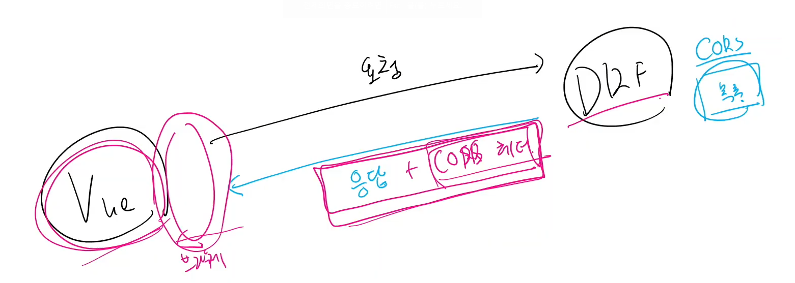
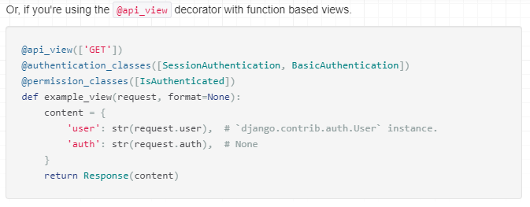
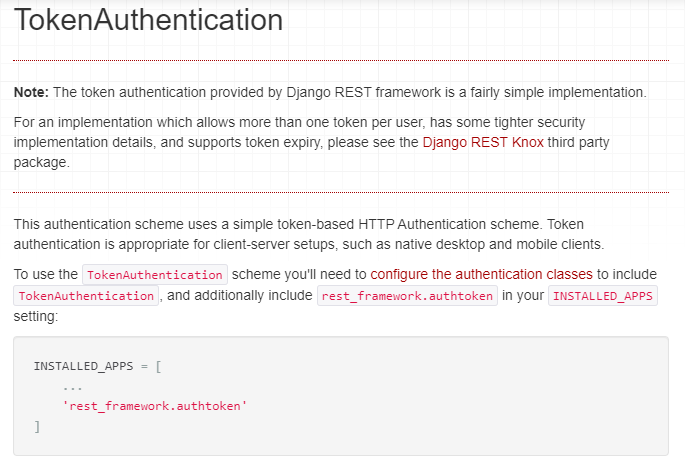
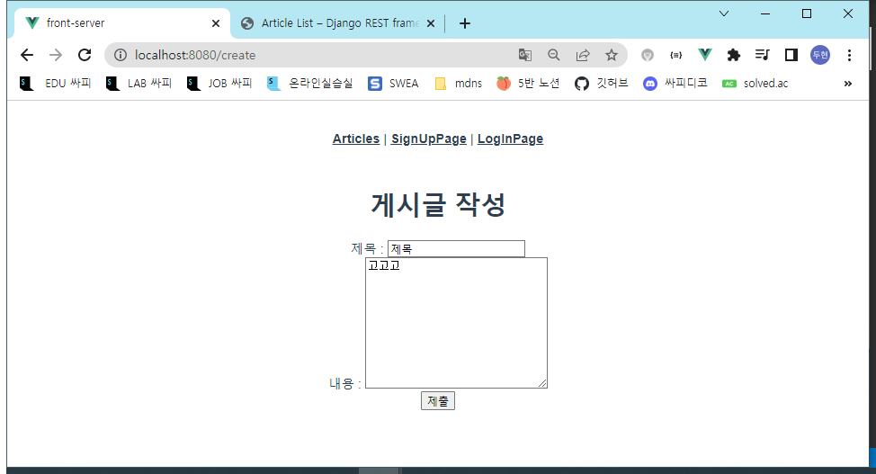

# Vue

## Vue with DRF

### 개요

Server와 Client의 통신 방법 이해하기

CORS 이슈 이해하고 해결하기

DRF Auth System 이해하기

Vue와 API server 통신하기

### Server & client

#### Server

서버(server)란?

- 클라이언트에게 정보와 서비스를 제공하는 컴퓨터 시스템
- 서비스 전체를 제공 == Django Web Service
- 정보를 제공 == DRF API Service

서비스 전체를 제공 == Django Web Service

- Django를 통해 전달받은 HTML에는 하나의 웹 페이지를 구성할 수 있는 모든 데이터가 포함
- 즉, 서버에서 모든 내용을 렌더링 하나의 HTML 파일로 제공
- 정보를 포함한 web 서비스를 구성하는 모든 내용을 서버 측에서 제공

정보를 제공 == DRF API Service

- Django를 통해 관리하는 정보만들 클라인언트에게 제공
- DRF를 사용하여 JSON으로 변환
  - 새로고침 없이

#### Client

클라이언트(Client)란?

- Sercer가 제공하는 서비스에 적절한 요청을 통해 Server로부터 반환받은 응답을 사용자에게 표현하는 기능을 가진 프로그램 혹은 시스템
  - 요청
  - 표현

- Server가 제공하는 서비스에 적절한 요청을 해야 한다.
  - Server가 정의하는 방식대로 요청 인자를 넘겨 요청
  - Server는 정상적인 요청에 적합한 응답 제공
- 잘못된 요청 예
  - 아래와 같은 Model이 정의되어 있다면
- Server로부터 반환받은 응답을 사용자에게 표현
  - 사용자의 요청에 적합한 data를 server에 요청하여 응답받은 결과로 적절한 화면을 구성

#### 정리

Server는 정보와 서비스를 제공

- DB와 통신하여 데이터를 생성, 조회, 수정, 삭제를 담당(CRUD)
- 요청을 보낸 Client에게 정상적인 요청이었다면 처리한 결과를 응답
- DRF

Client는 사용자의 정보 요청을 처리, server에게 응답받은 정보를 표현

- Server에게 정보(데이터)를 요청
- 응답 받은 정보를 가공하여 화면에 표현

- Vue

## Again DRF

### Skeleton Code 확인

#### back-server

##### Model 구조 확인


N대1상황

##### 요청 경로 확인


api/v1/으로 요청

##### Dummy data 확인

데이터 삽입


터미널 둘로 나누고

오른쪽을 백엔드로 해서 폴더 이동하고 가상환경 만들기

```bash
$ python -m venv venv
$ source venv/Scripts/activate
$ pip install -r requirements.txt
$ python manage.py migrate
$ python manage.py loaddata articles.json comments.json
```

http://127.0.0.1:8000/api/v1/articles/


#### fron-server 폴더 구조 확인 및 서버 구동 준비

폴더 이동후

```bash
$ npm i
$ npm run serve
```

서버 두개 켜기 한쪽은 8080 한쪽은 8000

##### 컴포넌트 구조 확인

#### 메인 페이지 구성

views/ArticleView.vue component 확인 및 route 등록

router/index.js

```javascript
import ArticleView from '@/views/ArticleView'
```

```javascript
  {
    path: '/',
    name: 'ArticleView',
    component: ArticleView
  },
```


src/App.vue

```vue
      <router-link :to="{ name: 'ArticleView' }">Articles</router-link> | 
```


components/ArticleList.vue 확인

- 전체 게시물을 표현할 컴포넌트
- 화면 구성을 위한 최소한의 stlye 포함

ArticleView에 등록

```vue
import ArticleList from '@/components/ArticleList'
```

```vue
  components: {
    ArticleList,
  },
```

```vue
    <ArticleList/>
```


ArticleList.vue에 ArticleListItem 등록

```vue
import AtricleListItem from '@/components/ArticleListItem'
```

```vue
  components: {
    AtricleListItem,
  },
```

```vue
    <ArticleListItem/>
```


store/index.js

```javascript
  state: {
    articles: [
      {
        id: 1,
        title: '제목',
        content: '내용'
      },
      {
        id: 2,
        title: '제목2',
        content: '내용2'
      },
    ],
  },
```

샘플용 데이터

ArticleList.vue에 computed로 가져오기

```vue
  computed: {
    articles() {
      return this.$store.state.articles
    }
  }
```

for문 돌면서 prop하기

```vue
    <ArticleListItem
      v-for="article in articles"
      :key="article.id"
      :article="article"
    />
```

articleListItem에서 받은거 출력

```vue
  props: {
    article: Object,
  }
```

```vue
<template>
  <div>
    <h5>{{ article.id }}</h5>
    <p>{{ article.title }}</p>
    <hr>
  </div>
</template>
```


## Vue with DRF

### AJAX 요청 준비

axios 설정

설치

뷰쪽 터미널

```bash
$ npm install axios
```

store/index.js에서 불러오기

```javascript
import axios from 'axios'

```

요청 보낼 API server 도메인 변수에 담기

```javascript
const API_URL = 'http://127.0.0.1:8000'
```

ArticleView.vue에서 method로 가져옴

```vue
  methods: {
    getArticles() {
      this.$store.dispatch('getArticles')
    }
  }
```

store/index.js

actions에 만들어주기

```javascript
  actions: {
    getArticles(context) {
      axios({
        method: 'get',
        url: `${API_URL}/api/v1/articles/`
      })
        .then((res)=> {
          console.log(res, context)
        })
        .catch((err)=> {
          console.log(err)
        })
    },
  },
```

ArticleView.vue

created에 위 메소드 실행


장고 터미널에는 200으로 응답 제대로 됨


근데 오류가 뜸

```
Access to XMLHttpRequest at 'http://127.0.0.1:8000/api/v1/articles/' from origin 'http://localhost:8080' has been blocked by CORS policy: No 'Access-Control-Allow-Origin' header is present on the requested resource.
```

CORS policy 정책에 의해 블락

'Access-Control-Allow-Origin' 해더가 없다

### Cross-Origin Resource Sharing

#### What Happend?

브라우저가 요청을 보내고 서버의 응답이 브라우저에 동착

- Server의 log는 200(정상) 반환
- 즉 Server는 정상적으로 응답했지만 브라우저가 막은것

보아낭의 이유로 브라우저는 동일 출처 정책(SOP)에 의해 다른 출처의 리소스의 상호작용하는 것을 제한함

Vue와 장고 리소스가 동일한 출처가 아니라서 크롬이 막아버림

#### SOP (Same-Origin Policy)

동일 출처 정책

불러온 문서나 스크립트가 다른 출처에서 가져온 리소스와 상호작용하는 것을 제한하는 보안 방식

잠재적으로 해로울 수 있는 문서를 분리함으로써 공격받을 수 있는 경로를 줄임

- 다른 출처는 공격할 수 있음

https://developer.mozilla.org/en-US/docs/Web/Security/Same-origin_policy

#### Origin - "출처"

URL의 Protocol, Host, Port를 모두 포함하여 출처라고 부름

Same Origin 예시

- 아래 세 영역이 일치하는 경우에만 동일 출처로 인정

- 장고랑 뷰는 Port가 다름 8080과 8000

- http://localhost:3000/posts/3/을 기준으로 비교

#### CORS - 교차 출처 리소스 공유

SOP라서 있는 것

추가 HTTP Header를 사용하여, 특정 출처에서 실행 중인 웹 어플리케이션이 다른 출처의 자원에 접근할 수 있는 권한을 부여하도록 브라우저에 알려주는 체제

- 막은게 브라우저기 때문에 브라우저에 알려줘야 함
- 헤더는 응답쪽에 붙임 그걸 보고 브라우저가 승인하고 통과시킴

- 어떤 출처에서 자신의 컨텐츠를 불러갈 수 있는지 서버에 지정할 수 있는 방법
- 클라이언트가 아니라 서버에 지정

리소스가 자신의 출처와 다를 때 교차 출처 HTTP 요청을 실행

- 만약 다른 출처의 리소르를 가져오기 위해서는 이를 제공하는 서버가 브라우저에게 다른 출처지만 접근해도 된다는 사실을 알려야 함
- ''교차 출처 리소스 공유 정책 (CORS policy)'

다른 출처에서 온 리소스를 공유하는 것에 대한 정채

CORS policy에 위배되는 경우 브라우저에서 해당 응답 결과를 사용하지 않음

- Server에서 응답을 주더라도 브라우저에서 거절

다른 출처의 리소스를 불러오려면 그 출처에서 올바른 CORS header를 포함한 응답을 반환해야 함

서버가 해야한다 응답을 할때 헤더를 붙여줘야 함

https://developer.mozilla.org/ko/docs/Web/HTTP/CORS

### How to set CORS

CORS 표준에 의해 추가됨 HTTP Response Header를 통해 이를 통제 가능

HTTP Response Header 예시 중 우린 Access-Control-Allow-Origin

Access-Control-Allow-Origin

- 단일 출처를 지정하여 브라우저가 해당 출처가 리소스에 접근하도록

- 헤더를 붙여서 응답할 수 있는 목록을 만들어줌
- 그 목록에 있는 다른 곳에서 오면 응답 + CORS관련 헤더를 붙임
- Vue가기 전에 있는 브라우저에서 헤더를 보고 다른 출처에서 왔지만 승인된것인걸 알고 통과시키고 Vue가 받게 됨



#### django-cors-headers library 사용하기

django-cors-headers github에서 내용 확인

- https://github.com/adamchainz/django-cors-headers

응답에 CORS 

```bash
python -m pip install django-cors-headers
$ pip freeze > requirements.txt   
```

settings.py

```python
INSTALLED_APPS = [
    ...,
    "corsheaders",
    ...,
]
```

```python
MIDDLEWARE = [
    ...,
    "corsheaders.middleware.CorsMiddleware",
    "django.middleware.common.CommonMiddleware",
    ...,
]
```

아래꺼는 이미 있는 것 corsheaders의 위치를 여기다 하라는 것 미들웨어 중에는 최대한 위에 해라


허용할 다른 출처를 작성하는곳

내 응답을 통과시킬 헤더를 붙일 다른 출처

`CORS_ALLOWED_ORIGINS: Sequence[str]`

- 배열 안에 문자열로 작성을 한다

- 목록이라는 말

- 이거 써야 함

`CORS_ALLOWED_ORIGIN_REGEXES: Sequence[str | Pattern[str]]` 

- 정규 표현식

`CORS_ALLOW_ALL_ORIGINS: bool`

- true로 하면 모든 출처 허용
- 그래서 위험 기본값 false

settings.py

```python
CORS_ALLOWED_ORIGINS = [
    'http://localhost:8080',
]
```

vue의 출처 넣어줌


해결됨


개발자 도구 Network, articles보면 

`Access-Control-Allow-Origin: http://localhost:8080`

있음

`CORS_ALLOW_ALL_ORIGINS: bool`

해보기

settings.py

```python
CORS_ALLOW_ALL_ORIGINS: true
```


Access-Control-Allow-Origin: *

애프터리스크가 쓰여있음 출처 전부다 승인하는 응답인것

권장하지는 않음

### Article Read

res로 온것중 data에 있는 것 써야함 state에 저장

store/index.js

액션에서 아까 하던 axios의 then에

```javascript
context.commit('GET_ARTICLES', res.data)
```

뮤테이션

```javascript
  mutations: {
    GET_ARTICLES(state, articles) {
      state.articles = articles
    }
```


### Article Create

CreateView.vue

- 게시글 생성을 위한 form
- v-model.trim
- .prevent

```vue
  data() {
    return {
      title: null,
      content: null,
    }
  },
```

메소드

```vue
methods: {
    createArticle() {
      const title = this.title
      const content = this.content
      if (!title) {
        alert('제목을 입력해주세요')
      } else if (!content) {
        alert('내용을 입력해주세요')
      }
    }
  }
```

```vue
    <form @submit.prevent="createArticle">
	  ...
    </form>
```

router/index.js

```javascript
import CreateView from '@/views/CreateView'
```

```javascript
  {
    path: '/create',
    name: 'CreateView',
    component: CreateView
  },
```

ArticleView.vue

```vue
    <router-link :to="{name:'CreateView'}">[CREATE]</router-link>
```


CreateView.vue

이제 액시오스로 받아야 하는데 POST로

장고에서 post에 대한 처리 어떻게 하는지 views.py에서 확인하고 가져옴

```vue
import axios from 'axios'

```

createArticle 함수 이어서

```vue
    createArticle() {
	  ...
      axios({

        }
    },  
```

```vue
const API_URL = 'http://127.0.0.1:8000'
```

```vuw
axios({
        method: 'post',
        url: `${API_URL}/api/v1/articles/`,
        data: {
          title:title,
          content:content,
        }
      })
        .then((res)=>{
          console.log(res)
        })
        .catch((err)=>{
          console.log(err)
        })
```


201이면 제대로 됨

data 확인


생겨있음

폼에서 보내는게 아니라 AJAX이기 때문에 csrf token 없어도 된다

게시글 작성하고 다시 페이지 넘어가기

CreateView

then안에

```vue
          this.$router.push({ name: 'ArticleView'})
```

바로 업데이트 된 이유

lifecycle hook에서 created에 있어서 바로 업데이트

#### [참고] 지금의 요청 방식은 효율적인가

비효율적인 부분이 존재

- 전체 게시글 정보를 요청해야 새로 생성된 게시글을 확인할 수 있음
- 만약 vuex state를 통해 전체 게시글 정보를 관리하도록 구성한다면? 내가 새롭게 생성한 게시글은 확인할 수 있겠지만...
- 나 이외의 유저들이 새롭게 생성한 게시글은 언제 불러 와야 할까?
- 무엇을 기준으로 새로운 데이터가 생겼다는 것을 확인할 수 있을까?

내가 구성하는 서비스에 따라 데이터 관리 방식을 고려해 보아야 함

### Article Detail

단일 게시글 조회

DetailView.vue

일단 라우터 링크 매핑

router/index.js

```javascript
import DetailView from '@/views/DetailView'
```

```javascript
  {
    path: '/:id',
    name: 'DetailView',
    component: DetailView,
  },
```

동적이라 마지막

ArticleListItem.vue

각각 이동할 수 있는 링크

```vue
    <router-link
      :to="{ name: 'DetailView', params: {id: article.id} }"
    >
    [DETAIL]
    </router-link>
```


아직 각 페이지 별로 출력은 못받음

DetailView.vue

method만들기

```vue
const API_URL = 'http://127.0.0.1:8000'

```

가져오고

```vue
  methods: {
    getArticleDetail() {

    }
  }
```

만들기

```vue
      axios({
        method: 'get',
        url: `${API_URL}/api/v1/articles/${this.$route.params.id}`
      })
```

$route.params로 가져오기

```vue
        .then((res)=>{
          console.log(res)
        })
        .catch((err)=>{
          console.log(err)
        })
```

```vue
  created() {
    this.getArticleDetail()
  },
```

create에서 호출


1번 조회하면


데이터 넣어주고

```vue
  data() {
    return {
      article:null
    }
  },
```

then 안에

```vue
        .then((res)=>{
          this.article = res.data
        })
```

```html
    <p>글 번호 : {{ article?.id }}</p>
    <p>제목 : {{ article?.title }}</p>
    <p>내용 : {{ article?.content }}</p>
    <p>작성시간 : {{ article?.created_at }}</p>
    <p>수정시간 : {{ article?.updated_at }}</p>
```


터미널에서 장고가 일하는거 보임

user하려면 

### Authentication & Authorization

#### Authentication - 인증, 입증

자신이라고 주장하는 사용자가 누구인지 확인하는 행위

모든 보안 프로세스의 첫번째 단계 (가장 기본 요소)

즉, 내가 누구인지를 확인하는 과정

401 Unauthorized

- 비록 HTTP 표준에서는 "미승인(unauthorized)"을 명확히 하고 있지만, 의미상 이 응답은 "비인증(unauthenticated)"을 의미

#### Authorization - 권한 부여, 허가

권한은 인증 이후에

사용자에게 특정 리소스 또는 기능에 대한 액세스 권한을 부여하는 과정 (절차)

보안 환경에서 권한 부여는 항상 인증이 먼저 필요함

- 사용자는 조직에 대한 엑세스 권한을 부여받기 전에 먼저 자신의 ID가 진짜인지 먼저 확인해야 함

서류의 등급, 웹페이지에서 글을 조회 & 삭제 & 수정할 수 있는 방법, 제한 구역

- 인증이 되었어도 모든 권한을 부여받는 것은 아님

403 Forbidden

- 401과 다른 점은 서버는 클라이언트가 누구인지 알고 있음
- 누구인지는 아는데 권한이 없다

### How to authentication determined

#### 인증여부 확인 방법

DRF 공식문서에서 제안하는 인증 절차 방법

https://www.django-rest-framework.org/api-guide/authentication/


settings.py에 작성하여야 할 설정

- 기본적인 인증 절차를 어떠한 방식으로 둘 것이냐를 설정하는것

- 예시의 2가지 방법 외에도 각 framework마다 다양한 인증방식이 있음

우리가 사용할 방법은 DRF가 기본으로 제공해주는 인증 방식 중 하나인 `TokenAuthentication`

모든 상황에 대한 인증 방식을 정의하는 것이므로, 각 요청에 따라 다른 인증 방식을 거치고자 한다면 다른 방식이 필요

view 함수마다 (각 요청마다) 다른 인증 방식을 설정하고자 한다면 decorator 활용



[참고] permission_classes

- 권한 관련 설정
- 권한 역시 특정 view 함수마다 다름 접근 권한을 요구할 수 있음

settings에 글로벌 하게 할거냐 decorator로 각각 할거냐

#### 다양한 인증 방식

BasicAuthentication

- 가장 기본적인 수준의 인증 방식
- 테스트에 적합

SessionAuthentication

- Django에서 사용하였던 session 기반의 인증 시스템
- DRF와 Django의 session 인증 방식은 보안적 측면을 구성하는 방법에 차이가 있음

RemoteUserAuthentiocation

- Django의 Remote user 방식을 사용할 때 활용하는 인증 방식

TokenAuthentication

- 매우 간단하게 구현할 수 있음
- 기본적인 보안 기능 제공
- 다양한 외부 패키지가 있음

(중요) settings.py에서 DEFAULT_AUTHENTICATION_CLASSES를 정의

- TokenAuthentication 인증 방식을 사용할 것임을 명시



```python
INSTALLED_APPS = [
	...
    # Auth
    'rest_framework.authtoken',
	...
]
```

하고 migrate

생성한 Token을 User에게 발급

- User는 발급받은 Token을 요청과 함께 전송
- Token을 통해 User 인증 및 권한 확인
- 로그인하면 token 부여하고 user는 요청마다 token을 붙여서 보냄 붙여야 인증자

Token 발급 방법이 있는데 이거 안쓰고 라이브러리 쓸것

```python
def some_view_func(request):
    token = Token.objects.create(user=...)
    return Response({'token': token.key})
```


User는 발급 받은 Token을 headers에 담아 요청과 함께 전송

- 단 반드시 Token 문자열 함께 삽입
  - 삽입해야 할 문자열은 각 인증 방식마다 다름 (ex)Bearer, Auth, JWT 등)

띄어쓰기도 잘 지켜야 함

주의) Token 문자열과 발급받은 실제 token 사이를 ' '(공백)으로 구분

Authorization HTTP headers 작성방법


#### 토큰 생성 및 관리 문제점

기본 제공 방식에서 고려해야할 상황들

1. Token 생성 시점
2. 생성한 Token 관리 방법
3. User와 관련된 각종 기능 관리 방법
   - 회원가입
   - 로그인
   - 회원 정보 수정
   - 비밀번호 변경 등

### dj-rest-auth

인증 관련 라이브러리

#### Dj-Rest-Auth

회원가입, 인증(소셜미디어 인증 포함), 비밀번호 재설정, 사용자 세부 정보 검색, 회원 정보 수정 등을 위핸 REST API end point 제공

주의) django-rest-auth는 더 이상 업데이트르르 지원하지 않음 dj-rest-auth 사용

https://github.com/iMerica/dj-rest-auth

https://dj-rest-auth.readthedocs.io/en/latest/

장고쪽에서

```bash
$ pip install dj-rest-auth
$ pip freeze > requirements.txt
```

```py
INSTALLED_APPS = (
    ...,
    'rest_framework',
    'rest_framework.authtoken',
    ...,
    'dj_rest_auth'
)
```

위 두개는 아까 했음

dj_rest_auth만

URL patterns 추가

my_api/urls.py

```python
urlpatterns = [
    ...
    path('dj-rest-auth/', include('dj_rest_auth.urls')),
]
```

유저모델 대체 과정

기존 db랑 migration 파일 삭제

settings.py

```python
INSTALLED_APPS = [
    # Django Apps
    'accounts',
	...
]
```

```python
AUTH_USER_MODEL = 'accounts.User'
```

```bash
$ python manage.py makemigrations
$ python manage.py migrate
```


urls.py에 하나 추가했는데 url 5가지 만들어짐

근데 signup이 없음 결이 다름 

얘네는 이미 인증이 되어있는 애들을 대상으로 해야 함 토큰이 생성되어야 하는것

https://dj-rest-auth.readthedocs.io/en/latest/

다시 확인

Installation

- Registration 사용
- (참고)여기 두번째는 소셜 로그인


일단 설치

```bash
$ pip install 'dj-rest-auth[with_social]'
$ pip freeze > requirements.txt
```

settings.py

```python
INSTALLED_APPS = (
    ...,
    'django.contrib.sites',
    'allauth',
    'allauth.account',
    'allauth.socialaccount',
    'dj_rest_auth.registration',
)

SITE_ID = 1
```

my_api/urls.py

```python
urlpatterns = [
    ...,
    path('dj-rest-auth/', include('dj_rest_auth.urls')),
    path('dj-rest-auth/registration/', include('dj_rest_auth.registration.urls'))
]
```

위에거는 원래


또 마이그레이트

```ba
$ python manage.py migrate
```

signup 확인

http://127.0.0.1:8000/accounts/signup/


signform 확인 가능 근데 이거 사용하진 않고 뷰에서 만듦

회원가입 요청 후 결과 확인


이렇게 키를 줌

로그인됐을때도 이렇게 발급


#### Password change

/accounts/password/change/ 기능 확인

로그인되어있거나, 인증이 필요한 기능

DRF 자체 제공 HTML form에서는 토큰을 입력할 수 있는 공간이 없음

Postman에서 진행

[참고] Raw data에서 직접 headers 추가 기능

```python
{
    "headers": {'Authorization' : "Token token"},
    "new_password1" : "new password",
    "new_password2" : "new password"
}
```

Postman으로 양식에 맞춰 POST 요청

body/form-data에 값 입력

이렇게만 하면


`  "detail": "Authentication credentials were not provided."`

누군데->token을 헤더스에 보냄

headers에 Token입력

Authorization: Token { your token } 형식에 맞춰 입력


token하고 띄어쓰기하는것 주의


그래도 403 뜸

이제 서버쪽에서 토큰 기반의 인증을 승인할거다라는 선언 안함

settings.py

```python
REST_FRAMEWORK = {
    # Authentication
    'DEFAULT_AUTHENTICATION_CLASSES': [
        'rest_framework.authentication.TokenAuthentication',
    ],
}
```

우리는 global하게(view함수에 쓰는 모든 함수에) 이 토큰이 필요하다


200응답

#### Permission setting

권한 설정 방법 확인

- DRF 공식문서 >  API GUIDE > Permissions 확인

https://www.django-rest-framework.org/api-guide/permissions/

얘도 views함수에 데코레이터 각각하는것과 settings에 한번에 할 수 있도록 할 수 있음


인증 속성명과 비슷

모든 drf에서 IsAuthenticated를 확인하겠다

권한 세부 설정

1. 모든 요청에 대해 인증을 요구하는 설정
2. 모든 요청에 대해 인증이 없어도 허용하는 설정

설정 위치 == 인증 방법을 설정한 곳과 동일

- 우선 모든 요청에 대해 허용 설정

```python
'DEFAULT_PERMISSION_CLASSES': [
   'rest_framework.permissions.AllowAny',
]
```

추가하면

```python
REST_FRAMEWORK = {
    # Authentication
    'DEFAULT_AUTHENTICATION_CLASSES': [
        'rest_framework.authentication.TokenAuthentication',
    ],

    # permission
    'DEFAULT_PERMISSION_CLASSES': [
        # 'rest_framework.permissions.IsAuthenticated',
        'rest_framework.permissions.AllowAny',
    ],
}
```

인증된  사용자에 대해 모든 view함수 처리를 허용하겠다

일단 다 풀어준 다음에 인증이 필요한 게시글 생성, 수정은 인증해야 하도록

articles/views.py

```python
from rest_framework.decorators import permission_classes
from rest_framework.permissions import IsAuthenticated
```

```python
@api_view(['GET', 'POST'])
@permission_classes([IsAuthenticated])
def article_list(request):
    ...
```

현재 allowany라 모든 view함수는 가능한데 이렇게 데코레이터 붙여주면 인증 요구할 수 있음

이렇게 설정하고

http://127.0.0.1:8000/api/v1/articles/

들어가면


`@permission_classes([IsAuthenticated])`

걸었기 때문에 토큰을 요구하게끔 바뀜

그렇다면 생성요청

POSTMAN으로 

http://127.0.0.1:8000/api/v1/articles/

하고 타이틀 콘텐트 넣음


이것도 article_list함수 통해서기때문에 데코레이터에 걸려서 이렇게 뜸


헤더스 넣어주고 다시 SEND하면


생성된다

## DRF Auth with Vue

이상황에서 vue에서 리스트 뽑으면


401 뜨고 토큰달라함

### SignUp Page

views/SignupView.vue 

```vue
  data() {
    return {
      username: null,
      password1: null,
      password2: null,
    }
  },
```

데이터 넣고

```vue
  <div>
    <h1>Sign Up Page</h1>
    <form @submit.prevent="signUp">
      <label for="username">username : </label>
      <input type="text" id="username" v-model="username"><br>

      <label for="password1"> password : </label>
      <input type="password" id="password1" v-model="password1"><br>

      <label for="password2"> password confirmation : </label>
      <input type="password" id="password2" v-model="password2">
      
      <input type="submit" value="SignUp">
    </form>
  </div>
```

인풋 폼에 v-model로 양방향 바인딩 해줌

form태그는 기존 기능 막고 SignUp함수 이제 만들거랑 연결

router/index.js

```javascript
import SignUpView from '@/views/SignUpView'
```

```javascript
  {
    path: '/signup',
    name: 'SignUpView',
    component: SignUpView
  },
```

App.vue

```vue
      <router-link :to="{ name: 'SignUpView' }">SignUpPage</router-link> | 
```


### SignUp Request

회원가입을 완료 시 응답받을 정보 Token을 store에서 관리할 수 있도록 actions를 활용하여 요청 후, state에 저장할 로직 작성

- 회원가입이나 로그인 후 얻을 수 있는 Token은 server를 구성 방식에 따라 매 요청마다 요구할 수 있으므로, 다양한 컴포넌트에서 쉽게 접근할 수 있도록 중앙 상태 저장소인 vuex에서 관리

SignUpView.vue

method

```vue
methods: {
    signUp() {
      const username = this.username
      const password1 = this.password1
      const password2 = this.password2

      const payload = {
        username,
        password1,
        password2,
      }

      this.$store.dispatch('signUp', payload)
    }
  }
```

payload할때 축약형태

store/index.js

액션

post방식

```javascript
    signUp(context, payload) {
      axios({
        method: 'post',
        url: `${API_URL}/accounts/signup/`,
        data: {
          username: payload.username,
          password1: payload.password1,
          password2: payload.password2,
        }
      })
        .then((res)=>{
          console.log(res)
        })
        .catch((err)=>{
          console.log(err)
        })
    },
```


가입시도하면


201로 성공

data에 보면 key가 있음

이걸 이제 mutation에 보내서 저장함

```javascript
        .then((res)=>{
          // console.log(res)
          context.commit('SIGN_UP', res.data.key)
        })
```

```javascript
  state: {
	...
    token: null,
  },
```

state에 token 만들어주고

뮤테이션

```javascript
  mutations: {
    ...
    SIGN_UP(state, token) {
      state.token = token
    },
  },
```


가입하고 vuex 보면 token 저장되어 있음

### 토큰 관리

게시물 전체 조회와 달리, 인증요청의 응답으로 받은 Token은 매번 요청하기 힘듦

- 비밀번호를 항상 보관하고 있을 수는 없음
- localStorage에 token 저장을 위해 vuex-persistedstate활용

설치

```bash
$ npm istall vuex-persistedstate
```

store/index.js

import 하기

```javascript
import createPersistedState from 'vuex-persistedstate'
```

플러그인 추가

```javascript
export default new Vuex.Store({
  plugins: [
    createPersistedState()
  ],
  ...
})
```

다시 저장되는지 확인


localstorage에 저장된것 확인 가능

#### [참고] User 인증 정보를 localStorage에 저장해도 되는가?

안전한 방법으로 볼 수는 없음

따라서, vuex-persistedstate는 아래의 2가지 방법을 제공

1. 쿠키를 사용해서 관리
2. 로컬 저장소를 난독화하여 관리

실습의 편의를 위해 localStorage를 사용할 예정

### Login Page

LoginView.vue

data 두개 만들고

```vu
  data() {
    return {
      username: null,
      password: null,
    }
  },
```

```vue
  <div>
    <h1>LogIn Page</h1>
    <form>
      <label for="username">username : </label>
      <input type="text" id="username" v-model="username"><br>

      <label for="password"> password : </label>
      <input type="password" id="password" v-model="password"><br>

      <input type="submit" value="logIn">
    </form>
  </div>
```

form의 input태그랑 v-model로 양방향 바인딩

```vue
    <form @submit.prevent="logIn">
        ...
    </form>
```

로그인 기존 기능 막아주고 logIn함수랑

이제 라우터 풀어줌

router/index.js

```javascript
import LogInView from '@/views/LogInView'

```

```javascript
  {
    path: '/login',
    name: 'LogInView',
    component: LogInView
  },
```

App.vue

```vue
      <router-link :to="{ name: 'LogInView' }">LogInPage</router-link>
```


#### Login Request

signUp과 다른 점은 password1 password2가 password로 바뀐 것 뿐

요청을 보내고 응답을 받은 Token을 state에 저장하는 것까지도 동일

- mutations가 처리해야 하는 업무가 동일
- SIGN_UP mutations를 SAVE_TOKEN mutations로 대체 가능

공통점이 많기 때문에 하나로 통합해버림

일단 LoginView.vue

```vue
  methods: {
    logIn() {
      const username = this.username
      const password = this.password

      const payload = {
        username,
        password,
      }
      this.$store.dispatch('logIn', payload)
    }
  }
```

store/index.js

액션

```javascript
logIn(context, payload) {
      axios({
        method: 'post',
        url: `${API_URL}/accounts/login/`,
        data: {
          username: payload.username,
          password: payload.password,
        }
      })
        .then((res) => {
          console.log(res)
        })
        .catch((err) => {
          console.log(err)
        })
    }
```

일단 로그인 해보면


200 받을 수 있음

data의 key가 똑같이 있음 이걸 mutation으로 넘기는데 이때 어차피 아까랑 똑같으니까 sign_up이랑 뮤테이션 통합해버림

```javascript
    signUp(context, payload) {
      axios({
		...
      })
        .then((res)=>{
          context.commit('SAVE_TOKEN', res.data.key)
        })
		...
    },
    logIn(context, payload) {
      axios({
		...
      })
        .then((res) => {
          context.commit('SAVE_TOKEN', res.data.key)
        })
		...
    }
```

어차피 둘다 토큰 저장하는거니까 통합하고 아까 만든 뮤테이션 이름 SAVE_TOKEN으로

```javascript
  mutations: {
	...
    SAVE_TOKEN(state, token) {
      state.token = token
    },
  },
```

### isAuthenticated in Vue

회원가입, 로그인 요청에 대한 처리 후 state에 저장된 Token을 직접 확인하기 전까지 인증 여부 확인 불가

인증되지 않았을 시 게시글 정보를 확인할 수 없으나 이유를 알 수 없음

- 로그인 여부를 확인할 수 있는 수단이 없음

- 토큰이 있는 사람인지 그것만 확인

store/index.js

자주 계산할 필요가 없어서 getters에 작성

```javascript
  getters: {
    isLogin(state) {
      return state.token ? true : false
    }
  },
```

게시글 조회할때 로그인 여부 확인

ArticleView.vue

일단 computed로 isLogin 가져옴

getArticles

원래 

```vue
  methods: {
    getArticles() {
      this.$store.dispatch('getArticles')
  }
```

였는데

```javascript
  methods: {
    getArticles() {
      if (this.isLogin === true) {
        this.$store.dispatch('getArticles')
      } else {
        alert('로그인이 필요한 서비스입니다.')
        this.$router.push({ name: 'LogInView' })
      }
    }
  }
```

로그인하고 메인페이지 가야하기 때문에 SAVE TOKEN에 설정해줌

회원가입, 로그인할 때 하기 떄문에 

store/index.js

여기서 router 쓰려면

```javascript
import router from '@/router'
```

하고

```vue
      router.push({ name: 'ArticleView' })
```

추가

```vue
  mutations: {
	...
    SAVE_TOKEN(state, token) {
      state.token = token
      router.push({ name: 'ArticleView' })
    },
  },
```

이상태로 articles 누르면


하고 


로그인 페이지로 넘어감


로그인시도했을 때 로그인 돼서 token까지 저장됐는데 articlelist는 안뜸


게시글 요청할 때 이 토큰 안썼기 때문

요청에 토큰을 붙여줘야 함

### Request with token

#### Article List Read with Token

store의 getArticles 액션 함수가 이걸 요청하는 함수

여기에 토큰 붙여주자

store/index.js

원래

```javascript
getArticles(context) {
      axios({
        method: 'get',
        url: `${API_URL}/api/v1/articles/`
      })
        .then((res)=> {
          context.commit('GET_ARTICLES', res.data)
        })
        .catch((err)=> {
          console.log(err)
        })
    },
```

```javascript
        headers: {
          Authorization: `Token ${context.state.token}`
        }
```

추가

```javascript
    getArticles(context) {
      axios({
		...
        headers: {
          Authorization: `Token ${context.state.token}`
        }
      })
		...
    },
```

이렇게 붙이고 다시 가보면


뜸

게시글 작성에도 토큰 붙여주러 가자

CreateView.vue

```vue
methods: {
    createArticle() {
      const title = this.title
      const content = this.content
      if (!title) {
        alert('제목을 입력해주세요')
      } else if (!content) {
        alert('내용을 입력해주세요')
      }
      axios({
        method: 'post',
        url: `${API_URL}/api/v1/articles/`,
        data: {
          title:title,
          content:content,
        }
      })
        .then((res)=>{
          console.log(res)
          this.$router.push({ name: 'ArticleView'})
        })
        .catch((err)=>{
          console.log(err)
        })
    },    
  }
```

안붙은 상태에서 보내면




안됨

```javascript
        headers: {
          Authorization: `Token ${this.$store.state.token}`
        }
```

또 붙여줌

```vue
createArticle() {
	  ...
      axios({
		...
        headers: {
          Authorization: `Token ${this.$store.state.token}`
        },
      })
        ...
    },
```


게시글 들어감

#### Create Article with User

게시글 작성할 때 유저 정보까지 넣어주기

article/models.py

```python
    user = models.ForeignKey(settings.AUTH_USER_MODEL, on_delete=models.CASCADE)
```

추가

```python
class Article(models.Model):
    user = models.ForeignKey(settings.AUTH_USER_MODEL, on_delete=models.CASCADE)
    title = models.CharField(max_length=100)
    content = models.TextField()
    created_at = models.DateTimeField(auto_now_add=True)
    updated_at = models.DateTimeField(auto_now=True)
```


```bash
$ python manage.py makemigrations
$ python manage.py migrate
```

이제 serializers.py

```python
class ArticleListSerializer(serializers.ModelSerializer):
    username = serializers.CharField(source='user.username', read_only=True)

    class Meta:
        model = Article
        fields = ('id', 'title', 'content', 'user', 'username')
```

views.py

```python
            serializer.save(user=request.user)
```

user 넣어주기

```python
@api_view(['GET', 'POST'])
@permission_classes([IsAuthenticated])
def article_list(request):
    if request.method == 'GET':
        articles = get_list_or_404(Article)
        serializer = ArticleListSerializer(articles, many=True)
        return Response(serializer.data)

    elif request.method == 'POST':
        serializer = ArticleSerializer(data=request.data)
        if serializer.is_valid(raise_exception=True):
            serializer.save(user=request.user)
            return Response(serializer.data, status=status.HTTP_201_CREATED)
```

ArticleListItem.vue

```vue
    <p>작성자: {{ article.username }}</p>
```

추가


## drf-spectacular

tmdb 같은거 보면 api에 대한 문서를 문서화되어있는데

우리것도 바꿀 수 있음

### swagger란?

스웨거(Swagger)는 개발자가 REST 웹 서비스를 설계, 빌드, 문서화, 소비하는 일을 도와주는 오픈 소스 소프트웨어 프레임워크

- 즉, API를 설계하고 문서화하는데 도움을 주는 라이브러리

### 다양한 DRF API

스웨거(Swagger)를 생성할 수 있도록 도움을 주는 라이브러리

- drf-spectacular
- https://github.com/tfranzel/drf-spectacular

과거에는 다양한 라이브러리가 있었으나 OpenAPI Specification이 3.0으로 업데이트되며 새 버전을 지원하지 않는 라이브러리들이 있으니 사용시 유의

- django rest swagger
- drf-yasg (drf-swagger)

### drf-spectacular

```bash
$ pip install drf-spectacular
```

settings.py

```python
INSTALLED_APPS = [
    ...

    # OpenAPI 3.0
    'drf_spectacular',

    ...
]
```

```python
REST_FRAMEWORK = {
    ...

    # spectacular Settings
    'DEFAULT_SCHEMA_CLASS': 'drf_spectacular.openapi.AutoSchema',
}
```

```python
SPECTACULAR_SETTINGS = {
    'TITLE': 'Your Project API',
    'DESCRIPTION': 'Your project description',
    'VERSION': '1.0.0',
    'SERVE_INCLUDE_SCHEMA': False,
    # OTHER SETTINGS
}
```

articles/urls.py

```python
from drf_spectacular.views import SpectacularAPIView, SpectacularSwaggerView
```

import하고

```python
# # 필수 작성
    path('schema/', SpectacularAPIView.as_view(), name='schema'),
    # # optional UI
    path('swagger/', SpectacularSwaggerView.as_view(url_name='schema'), name='swagger-ui'),
```

http://127.0.0.1:8000/api/v1/swagger/

들어가면


저 내용은

settings.py에서

```python
SPECTACULAR_SETTINGS = {
    'TITLE': 'Your Project API',
    'DESCRIPTION': 'Your project description',
    'VERSION': '1.0.0',
    'SERVE_INCLUDE_SCHEMA': False,
    # OTHER SETTINGS
}
```

이거 수정하면 됨